<nav class="menu">
    <ul>
        <li class="home"><a href="/">Home</a></li>
        <li class="name">test</li>
        <li class="pdf"><a href="test_test">PDF</a></li>
    </ul>
</nav>

<article class="slides">

       <section id="slide-001">
            <a class="slide-link" href="test.com#slide-001" title="Link to this slide.">link here</a>
            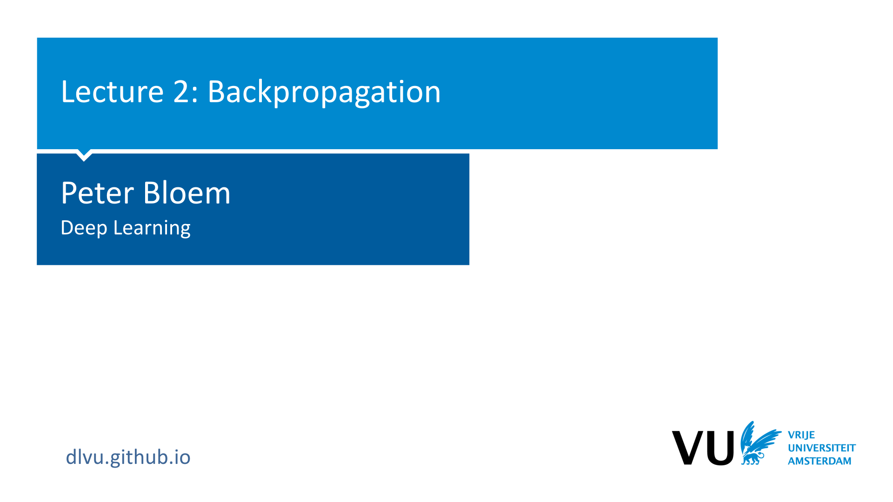

            <figcaption>
            
Today’s lecture will be entirely devoted to the backpropagation algorithm. The heart of all deep learning. 

            </figcaption>
       </section>

       <section id="slide-002">
            <a class="slide-link" href="test.com#slide-002" title="Link to this slide.">link here</a>
            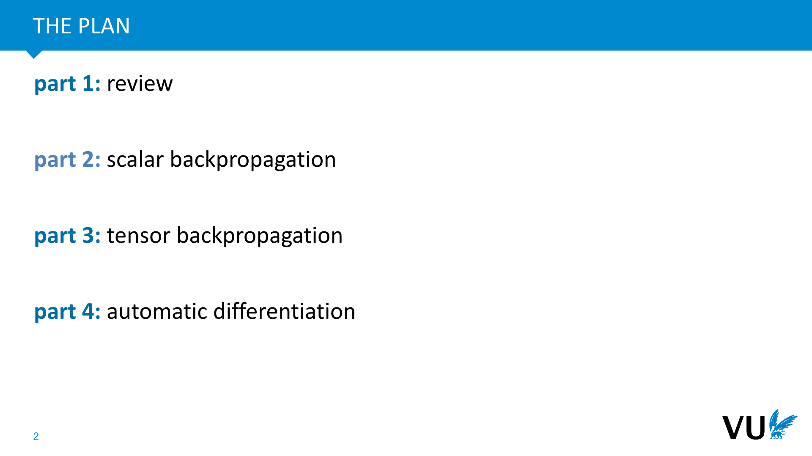

            <figcaption>
            
In <strong>the first part</strong>, we will review the basics of neural networks. The rest of the lecture will mostly be about backpropagation: the algorithm that allows us to efficiently compute a gradient for the parameters of a neural net, so that we can train it using the gradient descent algorithm. The introductory lecture covered some of this material alreayd, but we'll go over the basics again to set up the notations and visualization for the rest of the lecture. 

In <strong>the second part</strong> we describe backpropagation in a <em>scalar</em> setting. That is, we will treat each individual element of the neural network as a single number, and simply loop over all these numbers to do backpropagation over the whole network. This simplifies the derivation, but it is ultimately a slow algorithm with a complicated notation. 

In <strong>the second part</strong>, we translate neural networks to operations on vectors, matrices and tensors. This allows us to simplify our notation, and more importantly, massively speed up the computation of neural networks. Backpropagation on tensors is a little more difficult to do than backpropagation on scalars, but it's well worth the effort. 

In <strong>the third part</strong>, we will make the final leap from manually worked out and implemented backpropagation system to  full-fledged <em>automatic differentiation</em>: we will show you how to build a system that takes care of the gradient computation entirely by itself. This is the technology behind software like pytorch and tensorflow.

            </figcaption>
       </section>

       <section id="slide-003">
            <a class="slide-link" href="test.com#slide-003" title="Link to this slide.">link here</a>
            

            <figcaption>
            

            </figcaption>
       </section>

       <section id="slide-004">
            <a class="slide-link" href="test.com#slide-004" title="Link to this slide.">link here</a>
            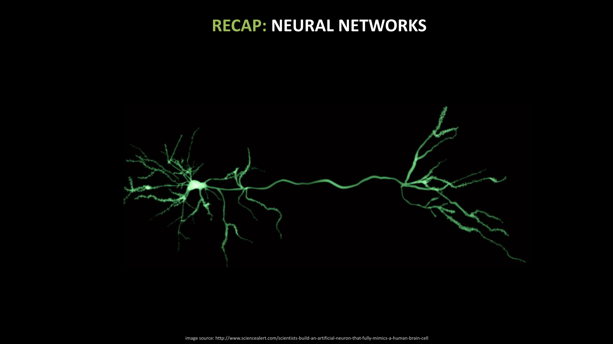

            <figcaption>
            
We’ll start with a quick recap of the basic principles behind neural networks. The name comes from <em>neurons </em>the cells that make up most of our brain and nervous system. 

In the very early days of AI (the late 1950s), researchers decided to take a simple approach to AI. To simply model neurons in the computer. A neuron receives multiple different signals from other cells through connections called <strong>dendrites</strong>. It processes these in a relatively simple way, deriving a<em> single</em> new signal, which it sends out through its single <strong>axon</strong>. The axon branches out so that the single signal can reach multiple other cells. 

 

            </figcaption>
       </section>

       <section id="slide-005">
            <a class="slide-link" href="test.com#slide-005" title="Link to this slide.">link here</a>
            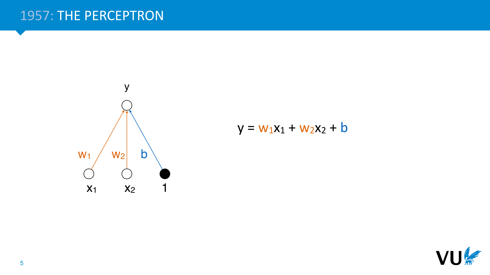

            <figcaption>
            
The of idea of a neuron needed to be radically simplified to work with computers of that age, but doing so yielded one of the first successful machine learning systems: <strong>the perceptron</strong>. 

The perceptron has a number of <em>inputs</em>, each of which is multiplied by a <strong>weight</strong>. The result is summed over all weights and inputs, together with a <strong>bias parameter</strong>, to provide the <em>output</em> of the perceptron. If we're doing binary classification, we can take the sign of the output as the class (if the output is bigger than 0 we predict class A otherwise class B). 

The bias parameter is often represented as a special input node, called a<strong> bias node</strong>, whose value is fixed to 1. 

For most of you, this will be nothing new. This is simply a linear classifier or linear regression model. It just happens to be drawn as a network.  

But the real power of the brain doesn't come from single neurons, it comes from <em>chaining a large number of neurons together</em>. Can we do the same thing with perceptrons: link the outputs of one perceptron to the inputs of the next in a large network, and so make the whole more powerful than any single perceptron?

            </figcaption>
       </section>

       <section id="slide-006" class="anim">
            <a class="slide-link" href="test.com#slide-006" title="Link to this slide.">link here</a>
            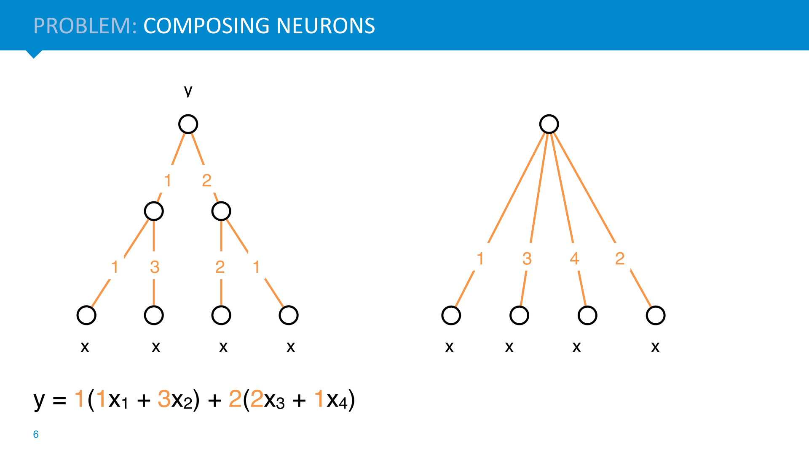

            <figcaption>
            
This is where the perceptron turns out to be too simple an abstraction. Composing perceptrons (making the output of one perceptron the input of another) doesn’t make them more powerful. All you end out with is something that is equivalent to another linear model. We’re not creating models that can learning non-linear functions. 
<aside    >We’ve removed the bias node here for clarity, but that doesn’t affect our conclusions: any composition of affine functions is itself an affine function. </aside>
If we're going to build networks of perceptrons that do anything a single perceptron can't do, we need another trick.

            </figcaption>
            click image for animation
       </section>

       <section id="slide-007">
            <a class="slide-link" href="test.com#slide-007" title="Link to this slide.">link here</a>
            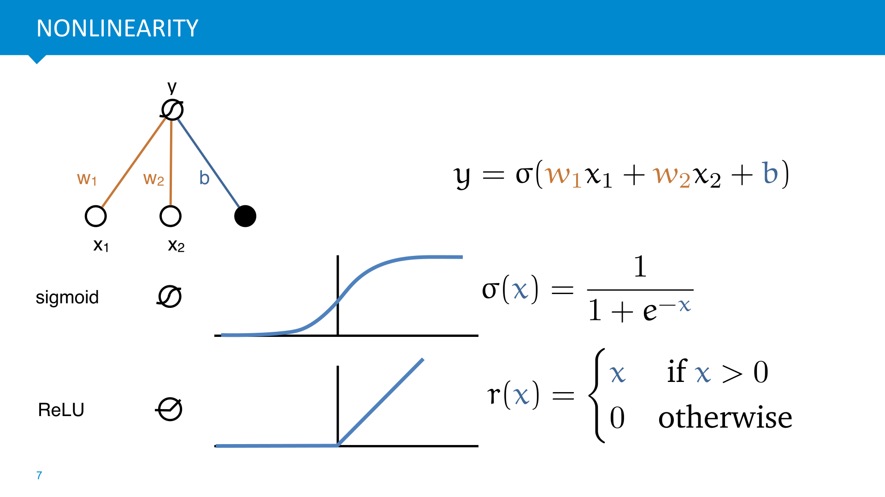

            <figcaption>
            
The simplest solution is to apply a <em>nonlinear</em> function to each neuron, called the <strong>activation function.</strong> This is a scalar function we apply to the output of a perceptron after all the weighted inputs have been combined.  

One popular option (especially in the early days) is the <strong>logistic sigmoid</strong>, which we’ve seen already. Applying a sigmoid means that the sum of the inputs can range from negative infinity to positive infinity, but the output is always in the interval [0, 1]. 

Another, more recent nonlinearity is the<strong> linear rectifier</strong>, or <strong>ReLU</strong> nonlinearity. This function just sets every negative input to zero, and keeps everything else the same. 

Not using an activation function is also called using a <strong>linear activation</strong>. 
<aside    >If you're familiar with logistic regression, you've seen the sigmoid function already: it's stuck on the end of a linear regression function (that is, a perceptron) to turn the outputs into class probabilities. Now, we will take these sigmoid outputs, and feed them as inputs to other perceptrons.</aside><aside    ></aside>
            </figcaption>
       </section>

       <section id="slide-008">
            <a class="slide-link" href="test.com#slide-008" title="Link to this slide.">link here</a>
            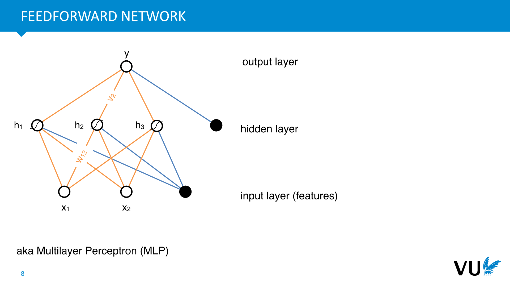

            <figcaption>
            
Using these nonlinearities, we can arrange single neutrons into <strong>neural networks</strong>. Any arrangement makes a neural network, but for ease of training, the arrangement shown here was the most popular for a long time. It’s called a <strong>feedforward network </strong>or <strong>multilayer perceptron</strong>. We arrange a layer of hidden units in the middle, each of which acts as a perceptron with a nonlinearity, connecting to all input nodes. Then we have one or more output nodes, connecting to all hidden layers. Crucially: 

There are <strong>no cycles</strong>, the network feeds forward from input to output. 

Nodes in the same layer are not connected to  each other, or to any other layer than the previous one. 

Each layer is <strong>fully connected</strong> to the previous layer, every node in one layer connects to every node in the layer before it. 

In the 80s and 90s feedforward networks usually had just one hidden layer, because we hadn’t figured out how to train deeper networks. 

Note: Every orange and blue line in this picture represents one parameter of the model.

            </figcaption>
       </section>

       <section id="slide-009">
            <a class="slide-link" href="test.com#slide-009" title="Link to this slide.">link here</a>
            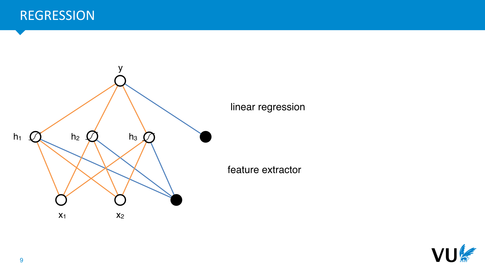

            <figcaption>
            
If we want to train a regression model (a model that predicts a numeric value), we put non-linearities on the hidden nodes, and no activation on the output node. That way, the output can range from negative to positive infinity, and the nonlinearities on the hidden layer ensure that we can learn functions that a single perceptron couldn't learn (we can learn non-linear functions). 

We can think of the first layer as learning some nonlinear transformation of the features, and the second layer as performing linear regression on these derived  features.

            </figcaption>
       </section>

       <section id="slide-010" class="anim">
            <a class="slide-link" href="test.com#slide-010" title="Link to this slide.">link here</a>
            

            <figcaption>
            
If we have a classification problem with two classes, called positive and negative, we can place a sigmoid activation on the output layer, so that the output is between 0 and 1. We can then interpret this as the<strong> probability </strong>that the input has the <strong>positive</strong> class (according to our network). The probability of the negative class is 1 minus this value. 

 

            </figcaption>
            click image for animation
       </section>

       <section id="slide-011">
            <a class="slide-link" href="test.com#slide-011" title="Link to this slide.">link here</a>
            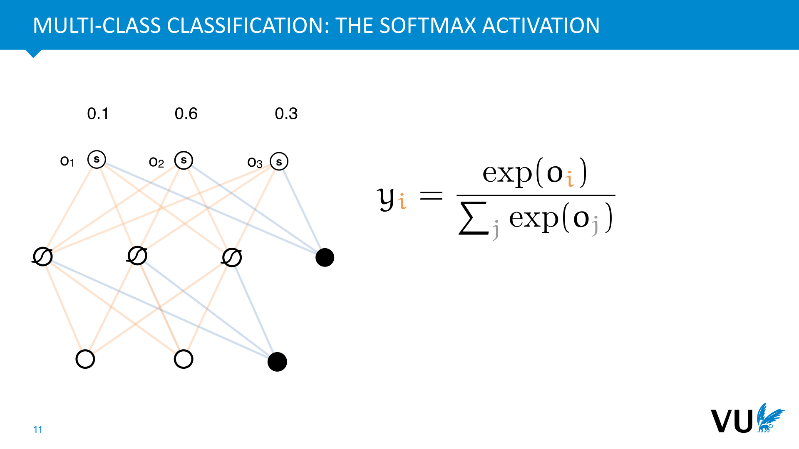

            <figcaption>
            
For multi-class classification, we can use the <strong>softmax activation</strong>. We create a single output node for every class, and ensure that their values sum to one. We can then interpret this series of values as the class probabilities that our network predicts. The softmax activation ensures positive values that sum to one. 

After the softmax we can interpret the output of node y3 as the probability that our input has class 3. 

To compute the softmax, we simply take the exponent of each output node oi (to ensure that they are all positive) and then divide each by the total (to ensure that they sum to one). We could make the values positive in many other ways (taking the absolute or the square), but the exponent is a common choice for this sort of thing in statistics and physics, and it seems to work well enough. 

The softmax activation is a little unusual: it’s not <em>element-wise </em>like the sigmoid or the ReLU. To compute the value of one output node, it looks at the inputs of  all the other outputs nodes.  

            </figcaption>
       </section>

       <section id="slide-012" class="anim">
            <a class="slide-link" href="test.com#slide-012" title="Link to this slide.">link here</a>
            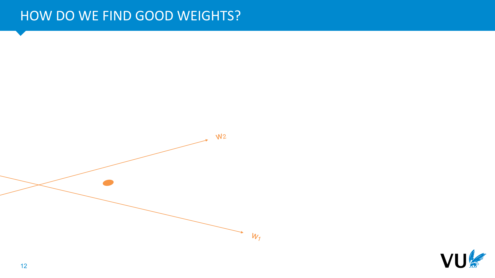

            <figcaption>
            
Now that we know how to build a neural network, and how to compute its output for a given input, the next question is <em>how do we train it? </em>Given a particular network and a set of examples of which inputs correspond to which outputs, how do we find the weights for which the network makes good predictions? 

To find good weights we first define a<strong> loss function</strong>. This is a function of a particular model (represented by its weights) to a single scalar value, called the model's <strong>loss</strong>. The better our model, the lower the loss. If we imagine a model with just two weights then the set of all models, called the <strong>model space</strong>, forms a plane. For every point in this plane, our loss function defines a loss. We can draw this above the plane as a surface: the <strong>loss surface</strong><strong> </strong>(sometimes also called, more poetically, the loss landscape). 
<aside    >Shown in the slide is a simple example of a loss function (the Euclidean distance between the model output and the target). There are many other loss functions available, and we will see the most important ones throughout the course. </aside>
Our job is to search the loss surface for a low point. When the loss is low, the model predictions are close to the target labels, and we've found a model that does well. 
<aside    >Make sure you understand the difference between the model, a function from the inputs x to the outputs y in which the weights act as constants, and the loss function, a function from the weights to a loss value, <strong>in which the data acts as constants</strong>. </aside>
The symbol <strong>θ</strong> is a common notation referring to the set of all weights of a model (sometimes combined into a vector, sometimes just a set).

            </figcaption>
            click image for animation
       </section>

       <section id="slide-013">
            <a class="slide-link" href="test.com#slide-013" title="Link to this slide.">link here</a>
            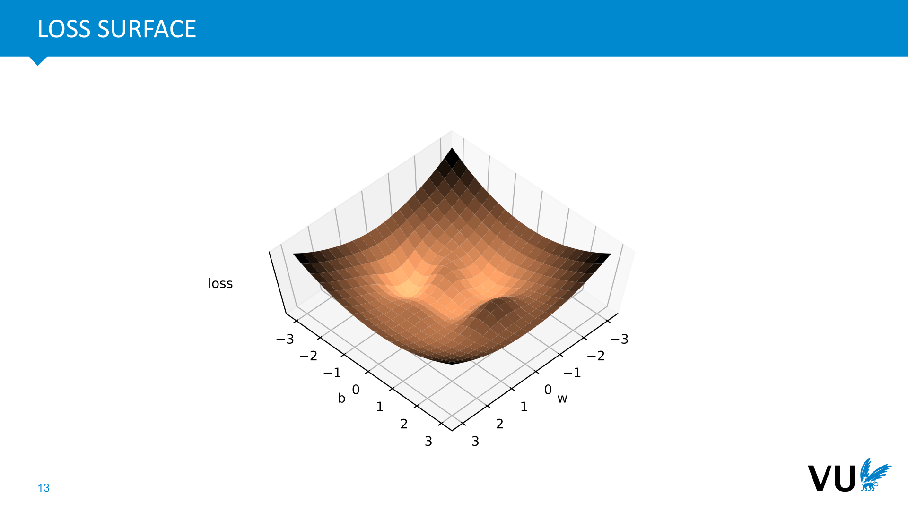

            <figcaption>
            

            </figcaption>
       </section>

       <section id="slide-014">
            <a class="slide-link" href="test.com#slide-014" title="Link to this slide.">link here</a>
            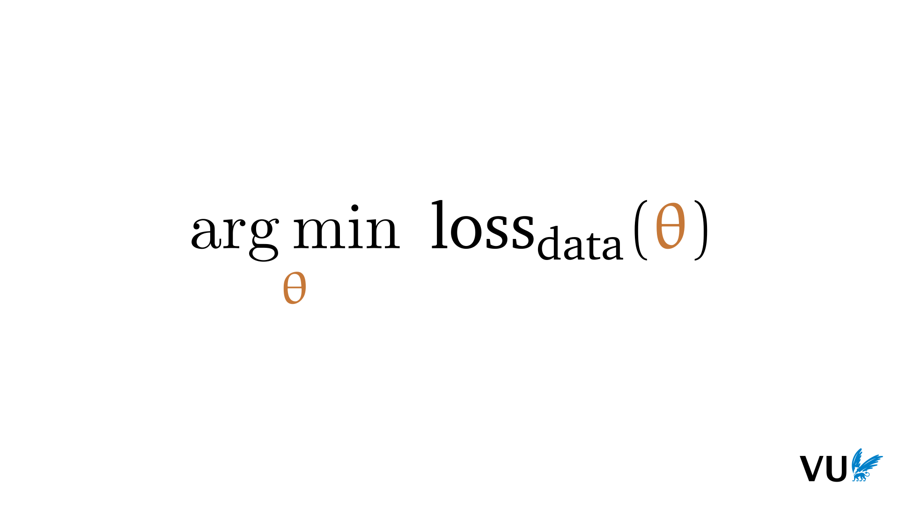

            <figcaption>
            
This is a common way of summarizing the aim of machine learning. We have a large space of possible parameters, with <strong>θ </strong>representing a single choice, and in this space we want to find the <strong>θ </strong>for which the loss on our chosen dataset is minimized. 

It turns out this is actually an oversimplification, and we don't want to solve this particular problem <em>too</em> well. We'll discuss this in the fourth lecture. For now, this serves as a reasonable summary of what we're trying to do.

            </figcaption>
       </section>

       <section id="slide-015" class="anim">
            <a class="slide-link" href="test.com#slide-015" title="Link to this slide.">link here</a>
            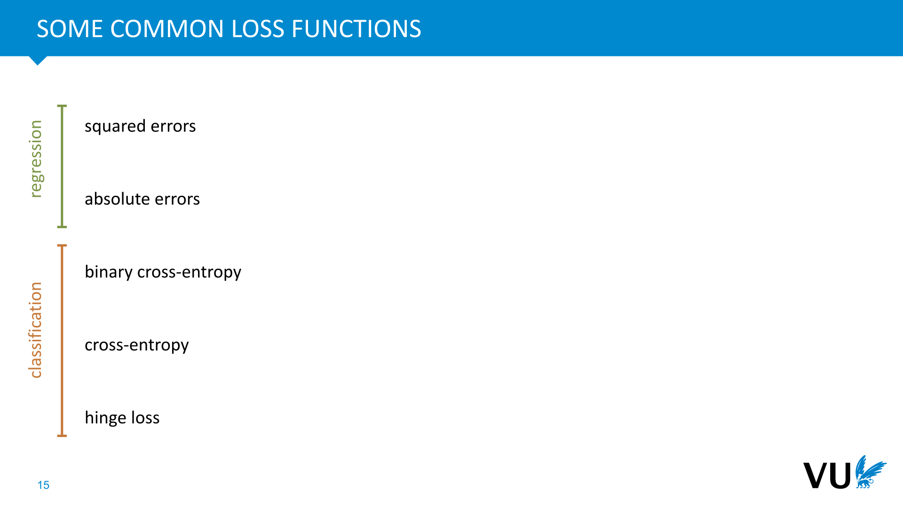

            <figcaption>
            
Here are some common loss functions for situations where we have examples (t) of what the model output (y) should be for a given input (x).  

The squared error losses are derived from basic regression. The (binary) cross entropy comes from logistic regression (as shown last lecture) and the hinge loss comes from support vector machine classification. You can find their derivations in most machine learning books/courses. We won’t elaborate on them here, except to note that in all cases the loss is lower if the model output (y) is closer to the example output (t). 

The loss can be computed for a single example or for multiple examples.<strong> In almost all cases, the loss for multiple examples is just the sum over all their individual losses.</strong>

<strong></strong>

            </figcaption>
            click image for animation
       </section>

       <section id="slide-016" class="anim">
            <a class="slide-link" href="test.com#slide-016" title="Link to this slide.">link here</a>
            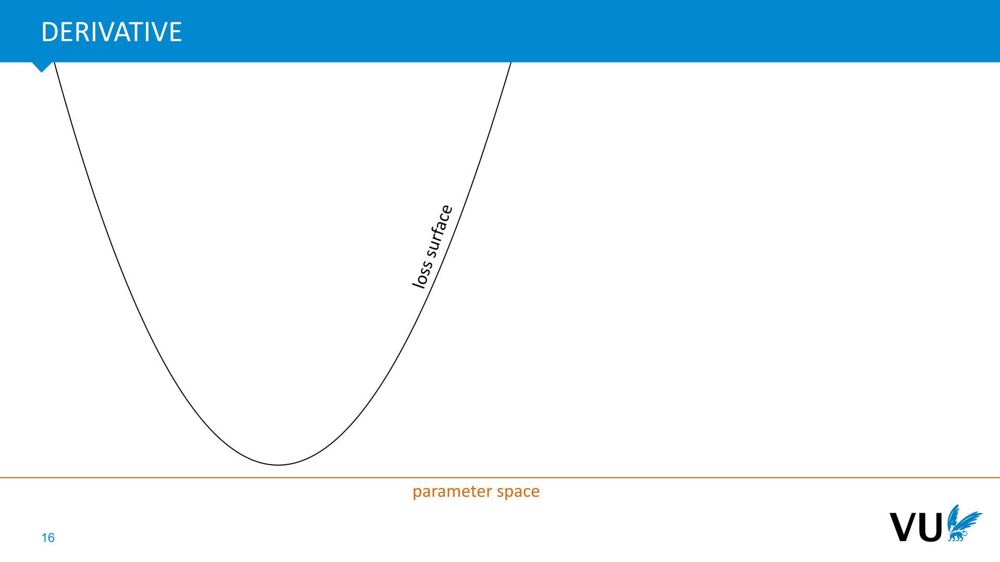

            <figcaption>
            
In one dimension, we know that the derivative of a function (like the loss) tells us how much a function increases or decreases if we take a step of size 1 to the right. 
<aside    >To be more precise, it tells us how much the best linear approximation of the function at a particular point, the tangent line, increases or decreases.</aside><aside    ></aside>
            </figcaption>
            click image for animation
       </section>

       <section id="slide-017" class="anim">
            <a class="slide-link" href="test.com#slide-017" title="Link to this slide.">link here</a>
            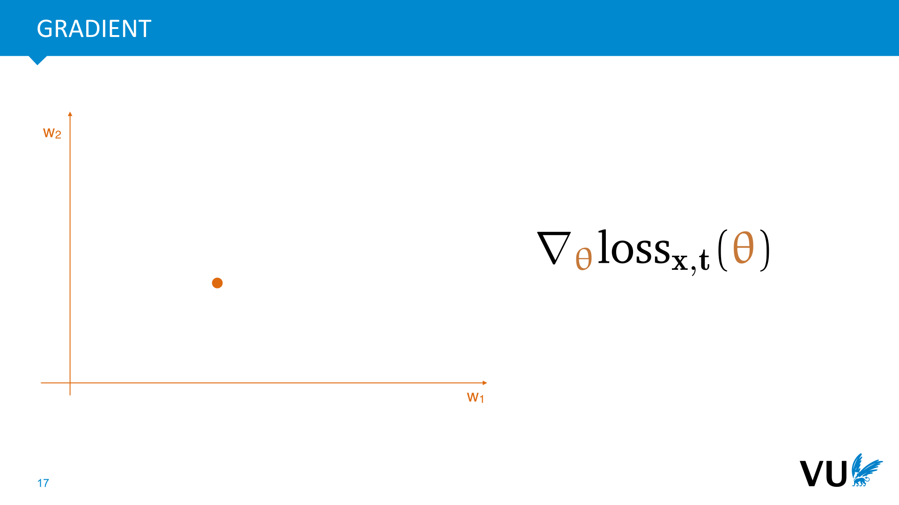

            <figcaption>
            
If our input space has multiple dimensions, like our model space, we can simply take the derivative with respect to each input, separately, treating the others as constants. This is called a<strong> partial derivative</strong>. The collection of all possible partial derivatives is called <strong>the gradient</strong>.  

If we interpret the gradient as a vector, it points in the direction in which the function grows the fastest. Taking a step in the opposite direction means we are walking down the function. 

In our case, this means that if we can work out the gradient of the loss (which contains the model and the data), then we can take a small step in the opposite direction and be sure that we are moving to a lower point on the loss surface. 

The symbol for the gradient is a downward pointing triangle called a nabla. The subscript indicates the variable over which we are taking the derivatives.  Note that in this case we are treating θ as a vector.

            </figcaption>
            click image for animation
       </section>

       <section id="slide-018">
            <a class="slide-link" href="test.com#slide-018" title="Link to this slide.">link here</a>
            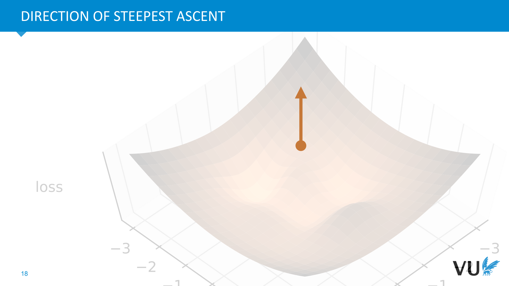

            <figcaption>
            
Here's a simple way to think of the gradient. <strong>The gradient is an arrow that points in the direction of steepest ascent</strong>. That is, the gradient of our loss (at the dot) is the direction in which the loss surface increases the quickest.  

More precisely, if we fit a tangent hyperplane to the loss surface at the dot, then the direction of steepest ascent on that hyperplane is the gradient. Since it's a hyperplane, the opposite direction (the gradent with a minus in front of it) is the direction of steepest descent. 

This is why we care about the gradent: it helps us find a downward direction on the loss surface. All we have to do is follow the negative gradient and we will end up lowering our loss.

            </figcaption>
       </section>

       <section id="slide-019" class="anim">
            <a class="slide-link" href="test.com#slide-019" title="Link to this slide.">link here</a>
            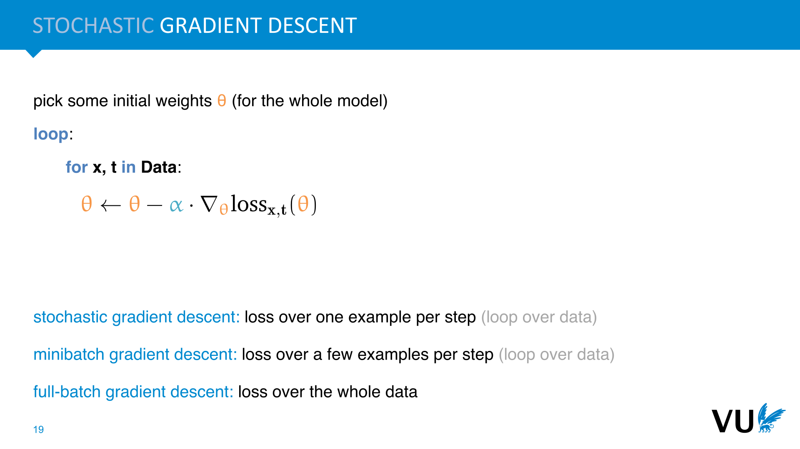

            <figcaption>
            
This is the idea behind the <strong>gradient descent algorithm</strong>. We compute the gradient, take a small step in the opposite direction and repeat. The reason we take small steps is that the gradient is only the direction of steepest ascent <em>locally</em>. It's a linear approximation to the nonlinear loss function. The further we move from our current position the worse an approximation the tangent hyperplane will be for the function that we are actually trying to follow. That's why we only take a small step, and then <em>recompute</em> the gradient in our new position. 

We can compute the gradient of the loss with respect to a single example from our dataset, a small batch of examples, or over the whole dataset. These options are usually called stochastic, minibatch and full-batch gradient descent respectively (although minibatch and stochastic gradient descent are sometimes used interchangeably). 

In deep learning, we almost always use <strong>minibatch gradient descent,</strong> but there are some cases where full batch is used. 

Training usually requires multiple passes over the data. One such pass is called an <strong>epoch</strong>.

            </figcaption>
            click image for animation
       </section>

       <section id="slide-020">
            <a class="slide-link" href="test.com#slide-020" title="Link to this slide.">link here</a>
            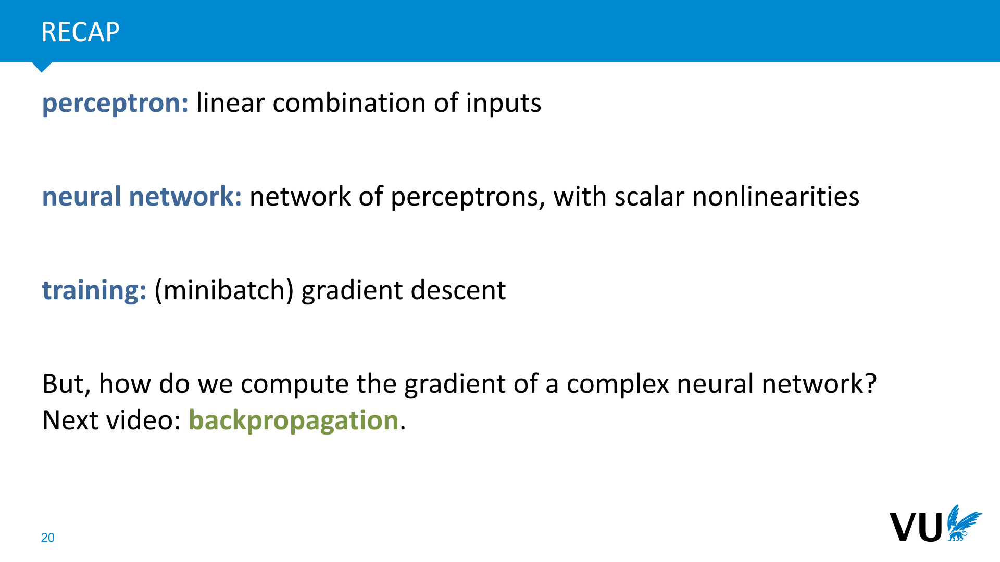

            <figcaption>
            
This is the basic idea of neural network training. What we haven't discussed is how to work out the gradient of a loss function over a neural network. For simple functions like linear classifiers, this can be done by hand. For more complex functions, like very deep neural networks, this is no longer feasible, and we need some help.  

This help comes in the form of the <strong>backpropagation</strong> algorithm.

            </figcaption>
       </section>

       <section id="slide-021">
            <a class="slide-link" href="test.com#slide-021" title="Link to this slide.">link here</a>
            

            <figcaption>
            <aside    >Before we move on, it's important to note that the name neural network is not much more than a historical artifact. The original neural neural networks were very loosely inspired by thenetworks of neurons in our heads, but even then the artificial neural nets were so simplified that they had little to do with the real thing. Today's neural nets are nothing like brain networks, and serve in no way as a realistic model of what happens in our head. In short, don't read too much into the name. </aside>
 

            </figcaption>
       </section>

       <section id="slide-022">
            <a class="slide-link" href="test.com#slide-022" title="Link to this slide.">link here</a>
            

            <figcaption>
            
In the previous video, we looked at what neural networks are, and we saw that to train them, we need to work out the derivatives of the loss with respect to the parameters of the neural network: collectively these derivatives are known as <em>the gradient</em>. 

            </figcaption>
       </section>

       <section id="slide-023">
            <a class="slide-link" href="test.com#slide-023" title="Link to this slide.">link here</a>
            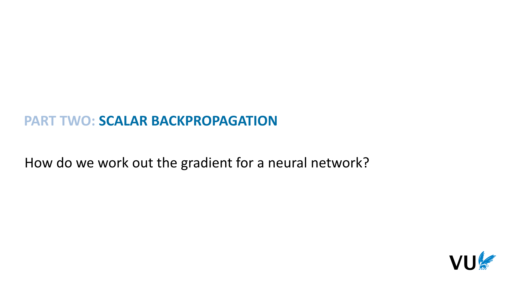

            <figcaption>
            
For simple models, like logistic regression, working out a gradient is usually done by hand, with pen and paper.  

This function is then translated into code, and used in a gradient descent loop. But the more complicated our model becomes, the more complex it becomes to work out a complete formulation of the gradient.

            </figcaption>
       </section>

       <section id="slide-024">
            <a class="slide-link" href="test.com#slide-024" title="Link to this slide.">link here</a>
            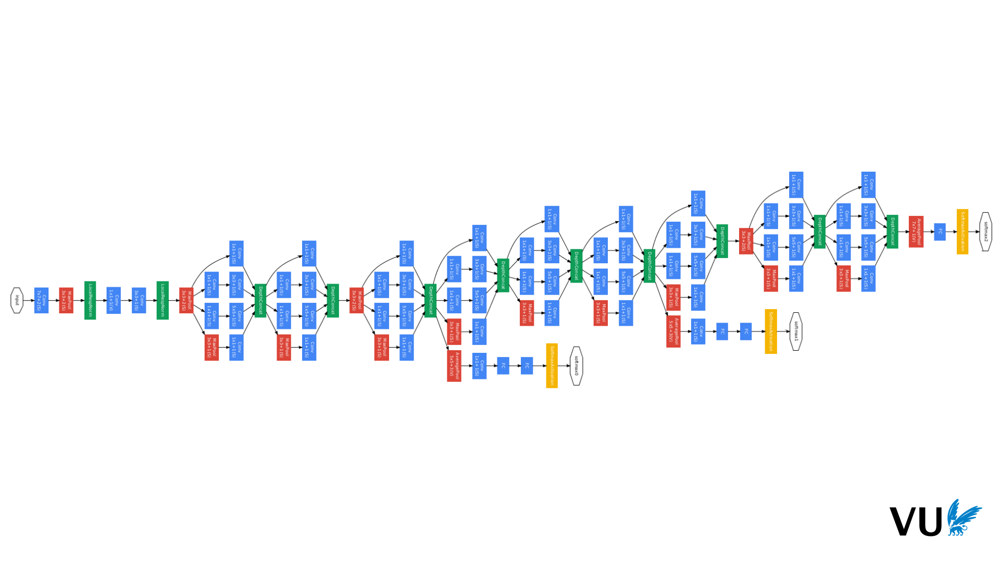

            <figcaption>
            
Here is a diagram of the sort of network we’ll be encountering (this one is called the GoogLeNet). We can’t work out a complete gradient for this kind of architecture by hand. We need help. What we want is some sort of algorithm that lets the computer work out the gradient for us.

            </figcaption>
       </section>

       <section id="slide-025">
            <a class="slide-link" href="test.com#slide-025" title="Link to this slide.">link here</a>
            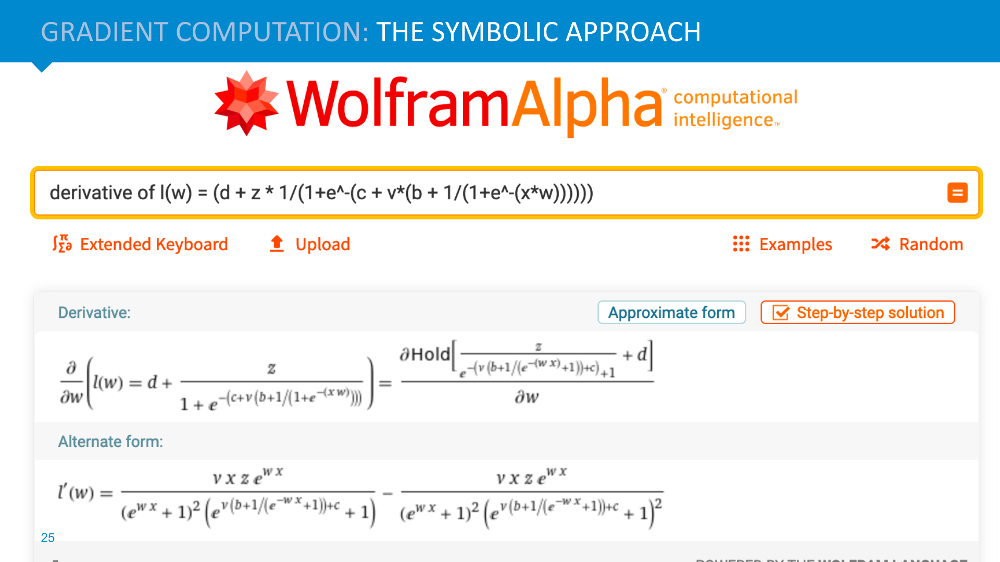

            <figcaption>
            
Of course, working out derivatives is a pretty mechanical process. We could easily take all the rules we know, and put them into some algorithm. This is called <strong>symbolic differentiation</strong>, and it’s what systems like Mathematica and Wolfram Alpha do for us. 

Unfortunately, as you can see here, the derivatives it returns get pretty horrendous the deeper the neural network gets. This approach becomes impractical very quickly.  
<aside    >As the depth of the network grows, the symbolic expression of its gradient (usually) grows exponentially in size. </aside>
Note that in symbolic differentiation we get a description of the derivative that<strong> is independent of the input</strong>. We get a function that we can then feed any input to.

            </figcaption>
       </section>

       <section id="slide-026">
            <a class="slide-link" href="test.com#slide-026" title="Link to this slide.">link here</a>
            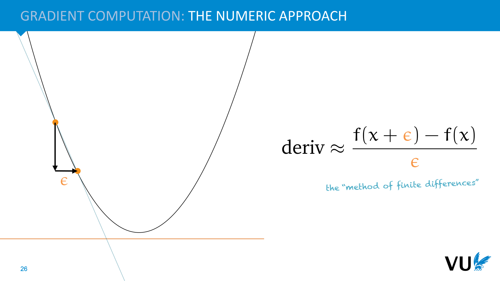

            <figcaption>
            
Another approach is to compute the gradient <em>numerically</em>. For instance by the method of finite differences: we take a small step ε and, see how much the function changes. The amount of change divided by the step size is a good estimate for the  gradient if ε is small enough. 

Numeric approaches are sometimes used in deep learning, but it’s very expensive to make them accurate enough if you have a large number of parameters. 

Note that in the numeric approach, you only get an answer <strong>for a particular input</strong>. If you want to compute the gradient at some other point in space, you have to compute another numeric approximation. Compare this to the symbolic approach (either with pen and paper or through wolfram alpha) where once the differentation is done, all we have to compute is the derivative that we've worked out.

            </figcaption>
       </section>

       <section id="slide-027">
            <a class="slide-link" href="test.com#slide-027" title="Link to this slide.">link here</a>
            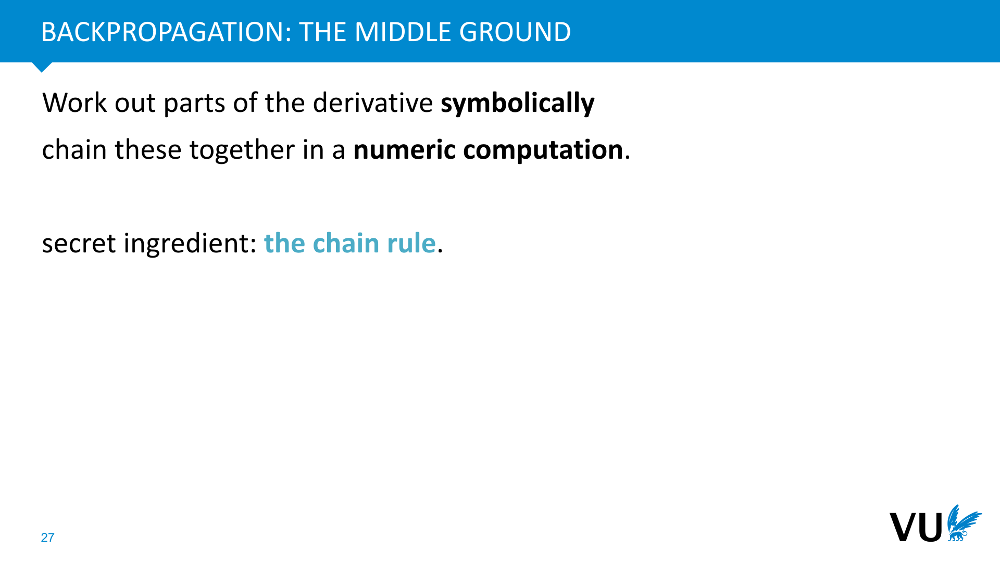

            <figcaption>
            
Backpropagation is a kind of middle ground between symbolic and numeric approaches to working out the gradient. We break the computation into parts: we work out the derivatives of the parts <em>symbolically</em>, and then chain these together <em>numerically</em>. 

The secret ingredient that allows us to make this work is the <strong>chain rule</strong> of differentiation.

            </figcaption>
       </section>

       <section id="slide-028" class="anim">
            <a class="slide-link" href="test.com#slide-028" title="Link to this slide.">link here</a>
            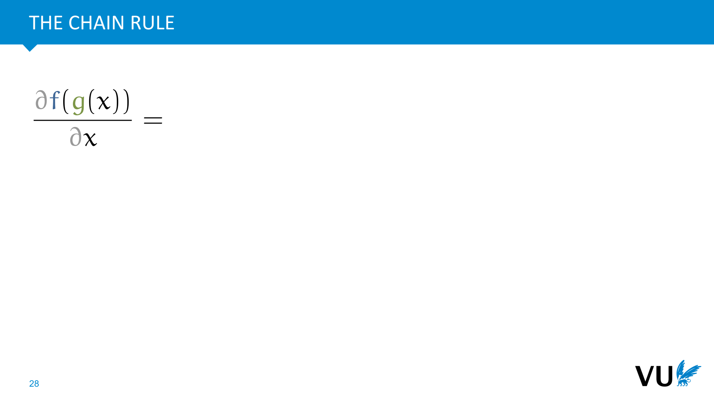

            <figcaption>
            
Here is the chain rule: if we want the derivative of a function which is the composition of two other functions, in this case f and g, we can take the derivative of f with respect to the output of g and  multiply it by the derivative of g with respect to the input x. 

Since we’ll be using the chain rule <em>a lot</em>, we’ll introduce a simple shorthand to make it a little easier to parse. We draw a little diagram of which function feeds into which. This means we know what the argument of each function is, so we can remove the arguments from our notation.  

We call this diagram a <strong>computation graph</strong>. We'll stick with simple diagrams like this for now. At the end of the lecture, we will expand our notation a little bit to capture more detail of the computation. 

            </figcaption>
            click image for animation
       </section>

       <section id="slide-029" class="anim">
            <a class="slide-link" href="test.com#slide-029" title="Link to this slide.">link here</a>
            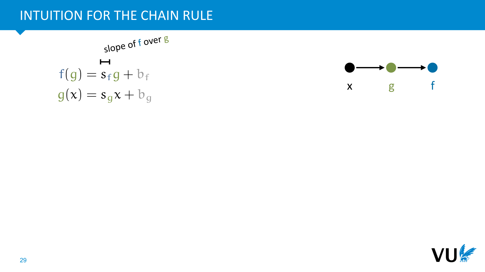

            <figcaption>
            
Since the chain rule is the heart of backpropagation, and backpropagation is the heart of deep learning, we should probably take some time to see why the chain rule is true at all. 

If we imagine that f and g are linear functions, it’s pretty straightforward to show that this is true. They may not be, of course, but the nice thing about calculus is that locally, we can <em>treat</em> them as linear functions (if they are differentiable). In an infinitesimally small neighbourhood f and g are exactly linear. 

If f and g are locally linear, we can describe their behavior with a slope s and an additive constant b. The slopes,<em> </em>sf and sg, are simply the derivatives. The additive constants we will show can be ignored.  

In this linear view, what the chain rule says is this: if we approximate f(x) as a linear function, then its slope is the slope of f <em>as a function of </em><em>g</em>, times the slope of g as a function of x. To prove that this is true, we just write down f(g(x)) as linear functions, and multiply out the brackets. 

Note that this doesn’t quite count as a rigorous proof, but it’s hopefully enough to give you some intuition for why the chain rule holds. 

            </figcaption>
            click image for animation
       </section>

       <section id="slide-030" class="anim">
            <a class="slide-link" href="test.com#slide-030" title="Link to this slide.">link here</a>
            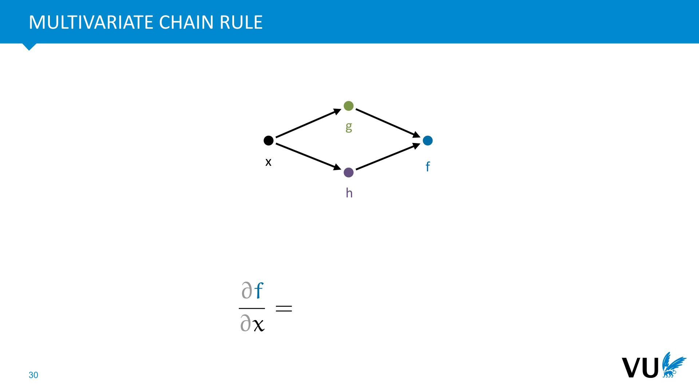

            <figcaption>
            
Since we’ll be looking at some pretty elaborate computation graphs, we’ll need to be able to deal with this situation as well: we have a computation graph, as before, but f depends on x through two different operations. How do we take the derivative of f over x? 

The multivariate chain rule tells us that we can simply apply the chain rule along g, taking h as a constant, and sum it with the chain rule along h taking g as a constant.

            </figcaption>
            click image for animation
       </section>

       <section id="slide-031" class="anim">
            <a class="slide-link" href="test.com#slide-031" title="Link to this slide.">link here</a>
            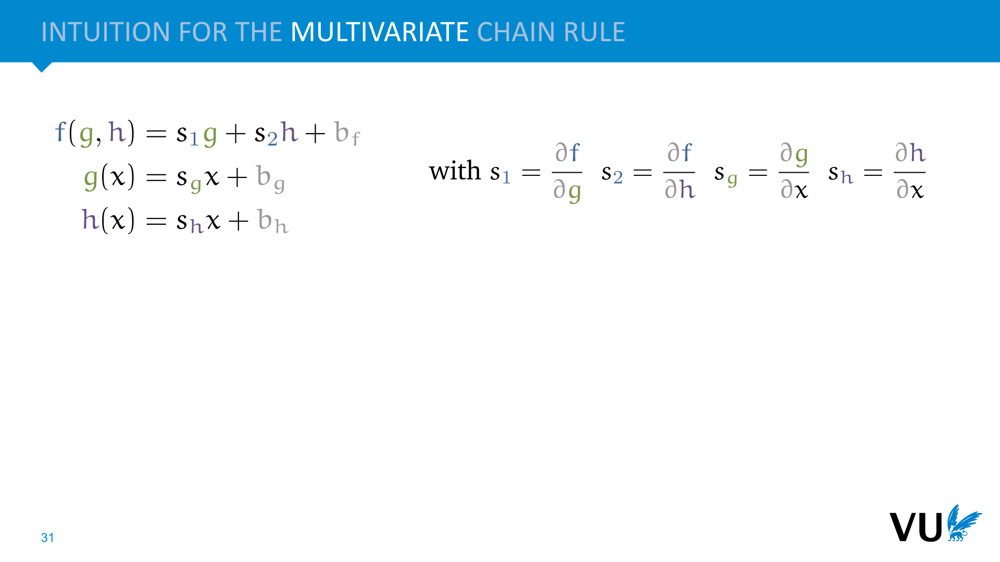

            <figcaption>
            
We can see why this holds in the same way as before. The short story: since all functions can be taken to be linear, their slopes distribute out into a sum 

            </figcaption>
            click image for animation
       </section>

       <section id="slide-032">
            <a class="slide-link" href="test.com#slide-032" title="Link to this slide.">link here</a>
            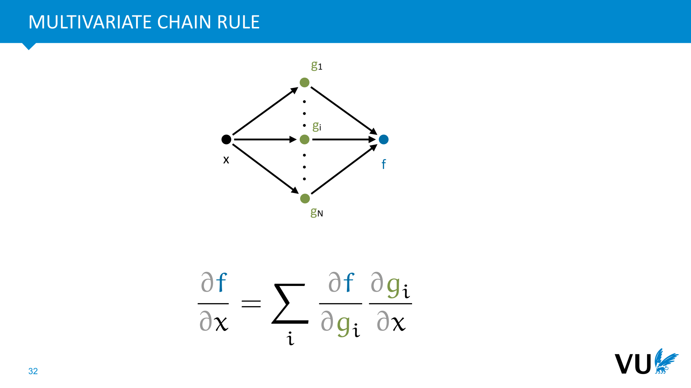

            <figcaption>
            
If we have more than two paths from the input to the output, we simply sum over all of them. 

            </figcaption>
       </section>

       <section id="slide-033">
            <a class="slide-link" href="test.com#slide-033" title="Link to this slide.">link here</a>
            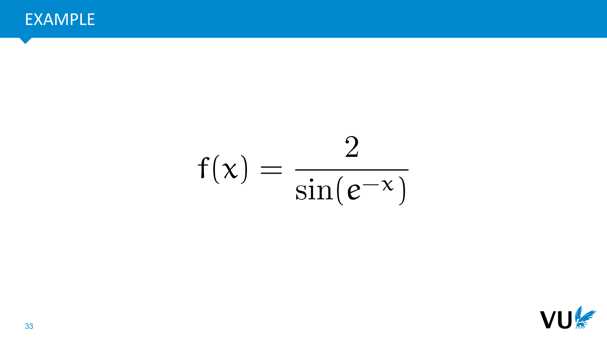

            <figcaption>
            
With that, we are ready to show how backpropagation works. We'll start with a fairly arbitrary function to show the principle before we move on to more realistic neural networks. 

            </figcaption>
       </section>

       <section id="slide-034" class="anim">
            <a class="slide-link" href="test.com#slide-034" title="Link to this slide.">link here</a>
            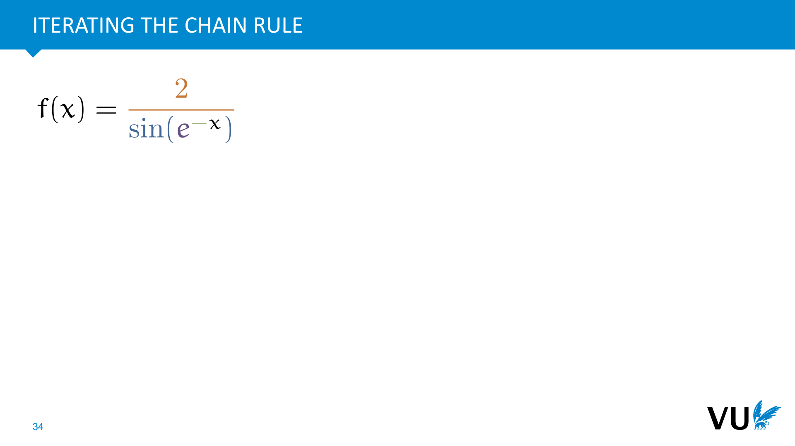

            <figcaption>
            
The first thing we do is to break up its functional form into a series of smaller operations. The entire function f is then just a chain of these small operations chained together. We can draw this in a computation graph as we did before. 

Normally, we wouldn’t break a function up in such small operations. This is just a simple example to illustrate the principle. 

            </figcaption>
            click image for animation
       </section>

       <section id="slide-035" class="anim">
            <a class="slide-link" href="test.com#slide-035" title="Link to this slide.">link here</a>
            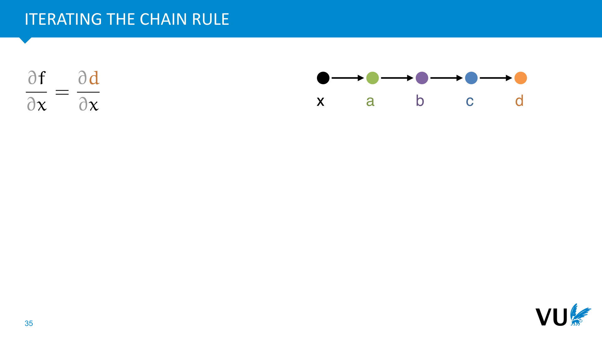

            <figcaption>
            
Now, to work out the derivative of f, we can<em> iterate the chain rule</em>. We apply it again and again, until the derivative of f over x is expressed as a long product of derivatives of operation outputs over their inputs. 

            </figcaption>
            click image for animation
       </section>

       <section id="slide-036">
            <a class="slide-link" href="test.com#slide-036" title="Link to this slide.">link here</a>
            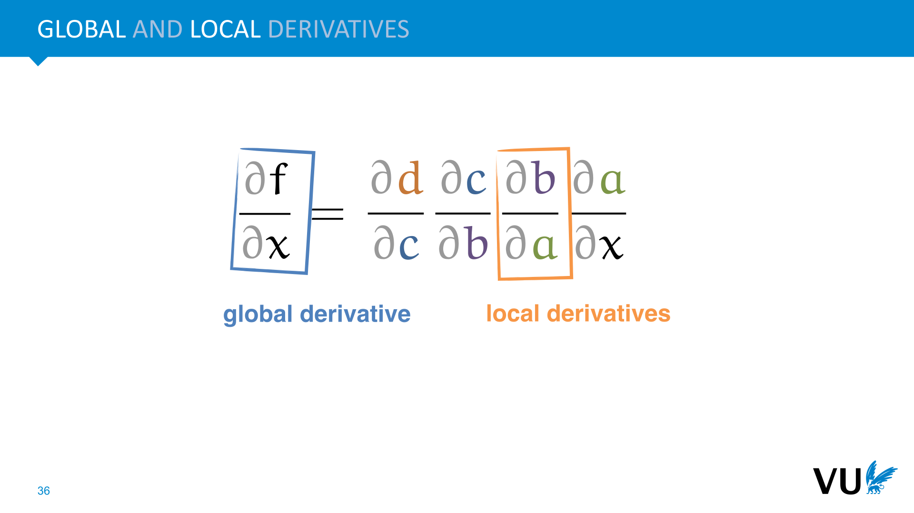

            <figcaption>
            
We call the larger derivative of f over x the <strong>global derivative</strong>. And we call the individual factors, the derivatives of the operation output wrt to their inputs, the l<strong>ocal derivatives</strong>.

            </figcaption>
       </section>

       <section id="slide-037">
            <a class="slide-link" href="test.com#slide-037" title="Link to this slide.">link here</a>
            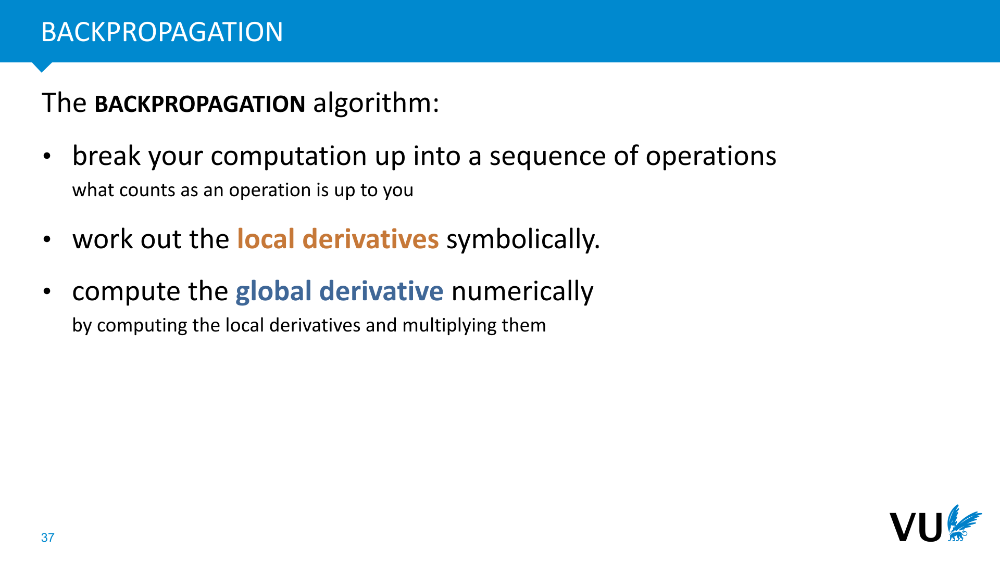

            <figcaption>
            
This is how the backpropagation algorithm combines symbolic and numeric computation. We work out the local derivatives symbolically, and then work out the global derivative numerically.

            </figcaption>
       </section>

       <section id="slide-038" class="anim">
            <a class="slide-link" href="test.com#slide-038" title="Link to this slide.">link here</a>
            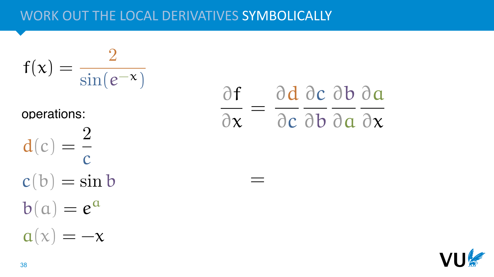

            <figcaption>
            
For each local derivative, we work out the symbolic derivative with pen and paper.  

Note that we could fill in the a, b and c in the result, but we don’t. We simply leave them as is. For the symbolic part, we are only interested in the derivative of the output of each sub-operation with respect to its immediate input. 

The rest of thew algorithm is performed numerically.

            </figcaption>
            click image for animation
       </section>

       <section id="slide-039" class="anim">
            <a class="slide-link" href="test.com#slide-039" title="Link to this slide.">link here</a>
            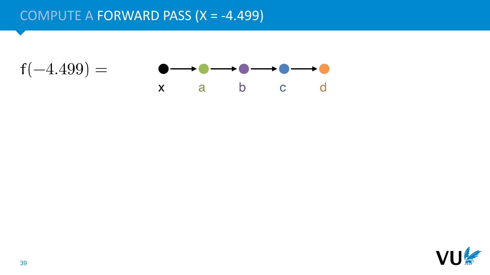

            <figcaption>
            
This we are now computing things numerically, we need a specific input, in this case x = -4.499. We start by feeding this through the computation graph. For each sub-operation, we store the output value. At the end, we get the output of the function f. This is called a <strong>forward pass</strong>: a fancy term for computing the output of f for a given input. 

Note that at this point, we are no longer computing solutions in general. We are computing our function for a specific input. We will be computing the gradient for this specific input as well.

            </figcaption>
            click image for animation
       </section>

       <section id="slide-040" class="anim">
            <a class="slide-link" href="test.com#slide-040" title="Link to this slide.">link here</a>
            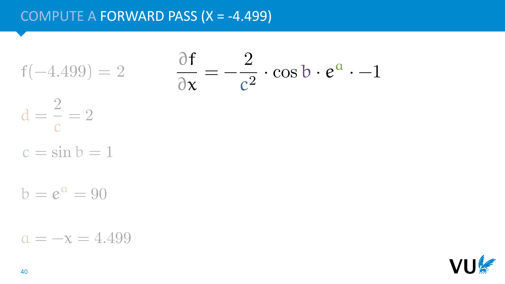

            <figcaption>
            
Keeping all intermediate values from the forward pass in memory, we go back to our symbolic expression of the derivative. Here, we fill in the intermediate values a b and c. After we do this, we can finish the multiplication numerically, giving us a numeric value of the gradient of f at x = -4.499. In this case, the gradient happens to be 0. 

            </figcaption>
            click image for animation
       </section>

       <section id="slide-041">
            <a class="slide-link" href="test.com#slide-041" title="Link to this slide.">link here</a>
            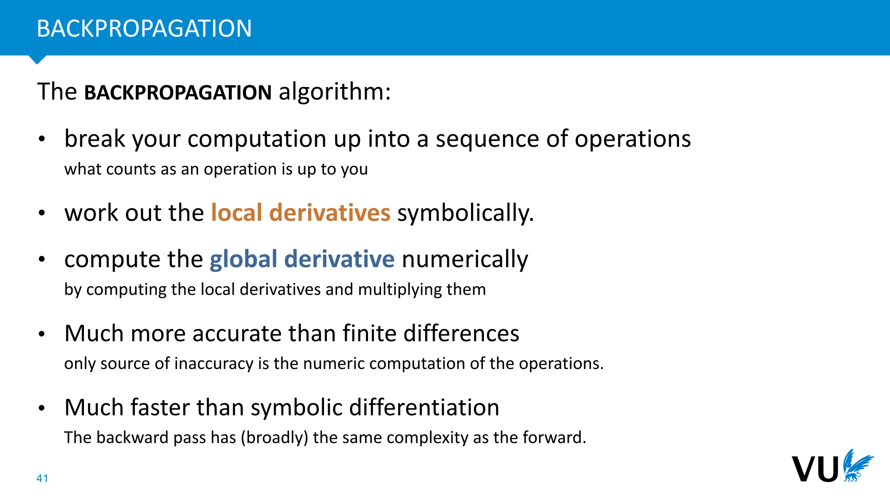

            <figcaption>
            
Before we try this on a neural network, here are the main things to remember about the backpropagation algorithm.  

Note that backpropagation by itself does not train a neural net. It just provides a gradient. When people say that they trained a network by backpropagation, that's actually shorthand for training the network by gradient descent, with the gradients worked out by backpropagation.

            </figcaption>
       </section>

       <section id="slide-042" class="anim">
            <a class="slide-link" href="test.com#slide-042" title="Link to this slide.">link here</a>
            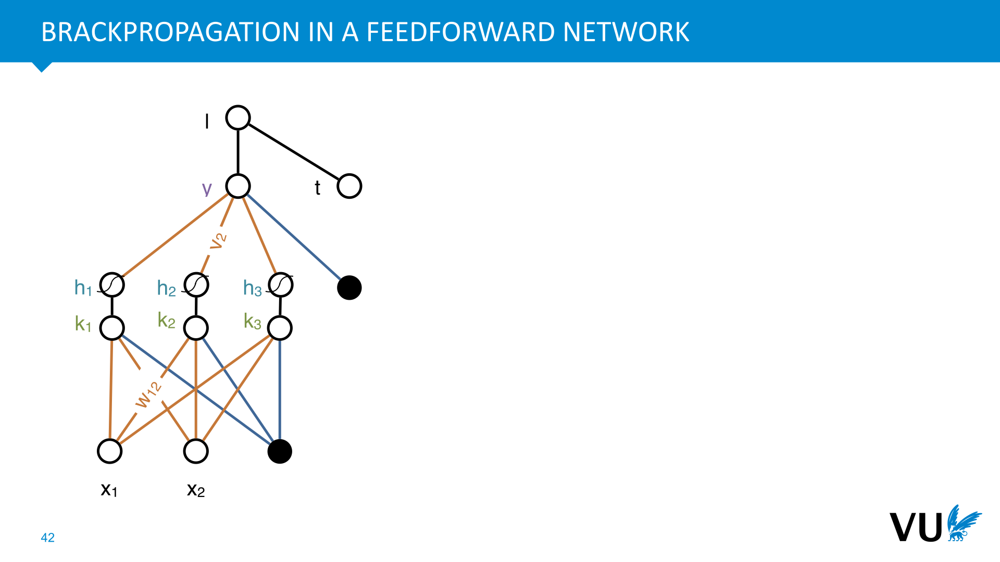

            <figcaption>
            
To explain how backpropagation works in a neural network, we extend our neural network diagram a little bit, to make it closer to the actual computation graph we’ll be using.  

First, we separate the hidden node into the result of the linear operation ki and the application of the nonlinearity hi. Second, since we’re interested in the derivative of the loss rather than the output of the network, we extend the network with one more step:<strong> the computation of the loss</strong> (over one example to keep things simple). In this final step, the output y of the network is compared to the target value t from the data, producing a loss value.  

The loss is the function for which we want to work out the gradient, so the computation graph is the one that computes first the model output, and then the loss based on this output (and the target). 

Note that the model is now just a <em>subgraph</em> of the computation graph. You can think of t as another input node, like x1 and x2, (but one to which the <em>model</em> doesn’t have access).

            </figcaption>
            click image for animation
       </section>

       <section id="slide-043" class="anim">
            <a class="slide-link" href="test.com#slide-043" title="Link to this slide.">link here</a>
            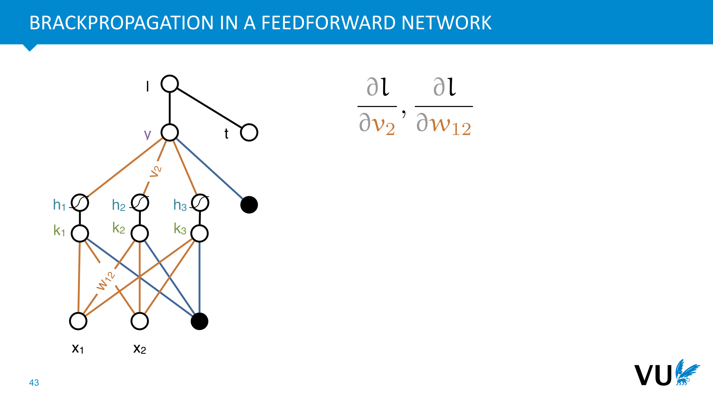

            <figcaption>
            
We want to work out the gradient of the loss. This is simply the collection of the derivative of the loss over each parameter. 

We’ll pick two parameters, v2 in the second layer, and w12 in the first, and see how backpropagation operates. The rest of the parameters can be worked out in the same way to give us the rest of the gradient. 

First, we have to break the computation of the loss into operations. If we take the graph on the left to be our computation graph, then we end up with the operations of the right. 

To simplify things, we’ll compute the loss over only one instance. We’ll use a simple squared error loss.

            </figcaption>
            click image for animation
       </section>

       <section id="slide-044" class="anim">
            <a class="slide-link" href="test.com#slide-044" title="Link to this slide.">link here</a>
            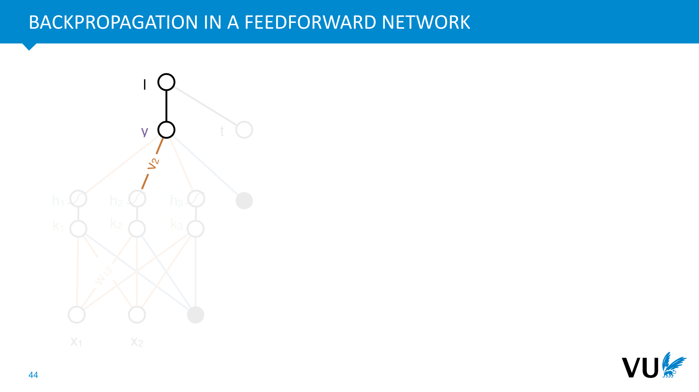

            <figcaption>
            
For the derivative with respect to v2, we’ll only need these two operations. Anything below doesn’t affect the result. 

To work out the derivative we apply the chain rule, and work out the local derivatives symbolically. 

            </figcaption>
            click image for animation
       </section>

       <section id="slide-045" class="anim">
            <a class="slide-link" href="test.com#slide-045" title="Link to this slide.">link here</a>
            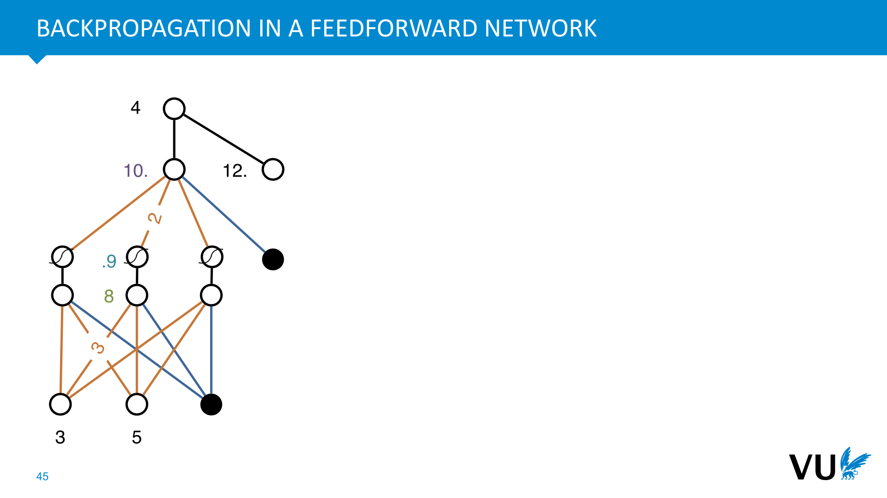

            <figcaption>
            
We then do a forward pass with some values. We get an output of 10.1, which should have been 12.1, so our loss is 4. We keep all intermediate values in memory. 

We then take our product of local derivatives, fill in the numeric values from the forward pass, and compute the derivative over v2. 

When we apply this derivative in a gradient descent update, v2 changes as shown below. 

            </figcaption>
            click image for animation
       </section>

       <section id="slide-046" class="anim">
            <a class="slide-link" href="test.com#slide-046" title="Link to this slide.">link here</a>
            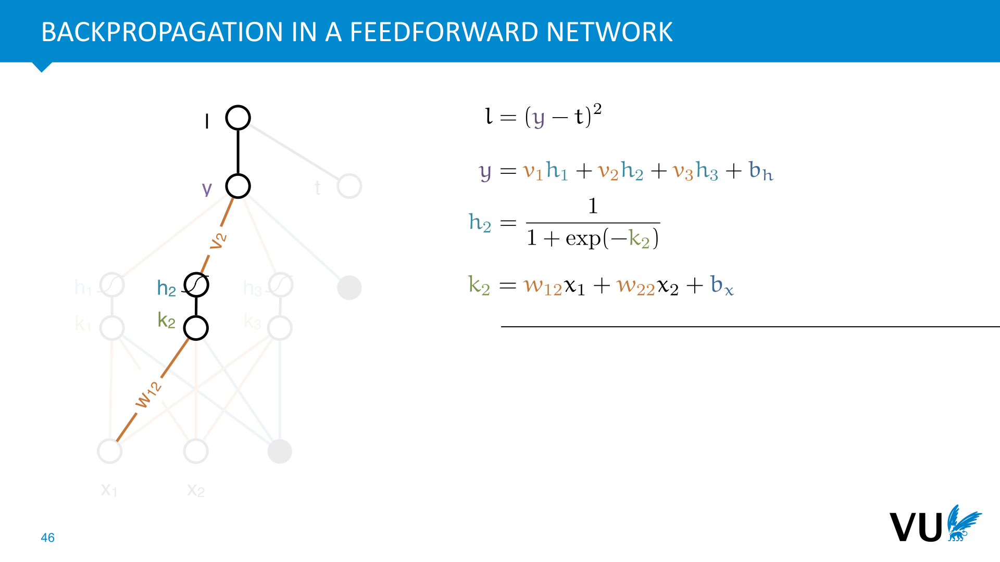

            <figcaption>
            
Let’s try something a bit earlier in the network: the weight w12. We add two operations, apply the chain rule and work out the local derivatives.

            </figcaption>
            click image for animation
       </section>

       <section id="slide-047" class="anim">
            <a class="slide-link" href="test.com#slide-047" title="Link to this slide.">link here</a>
            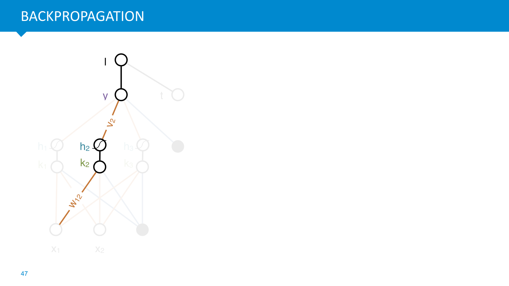

            <figcaption>
            
Note that when we’re computing the derivative for w12, we are also, along the way computing the derivatives for y, h2 and k2. 

This useful when it comes to implementing backpropagation. We can walk backward down the computation graph and compute the derivative of the loss for every node. For the nodes below, we just multiply the local gradient. This means we can very efficiently compute any derivatives we need.  

In fact, this is <em>where the name backpropagation comes from</em>: the derivative of the loss propagates down the network in the opposite direction to the forward pass. We will show this more precisely in the last part of this lecture.

            </figcaption>
            click image for animation
       </section>

       <section id="slide-048">
            <a class="slide-link" href="test.com#slide-048" title="Link to this slide.">link here</a>
            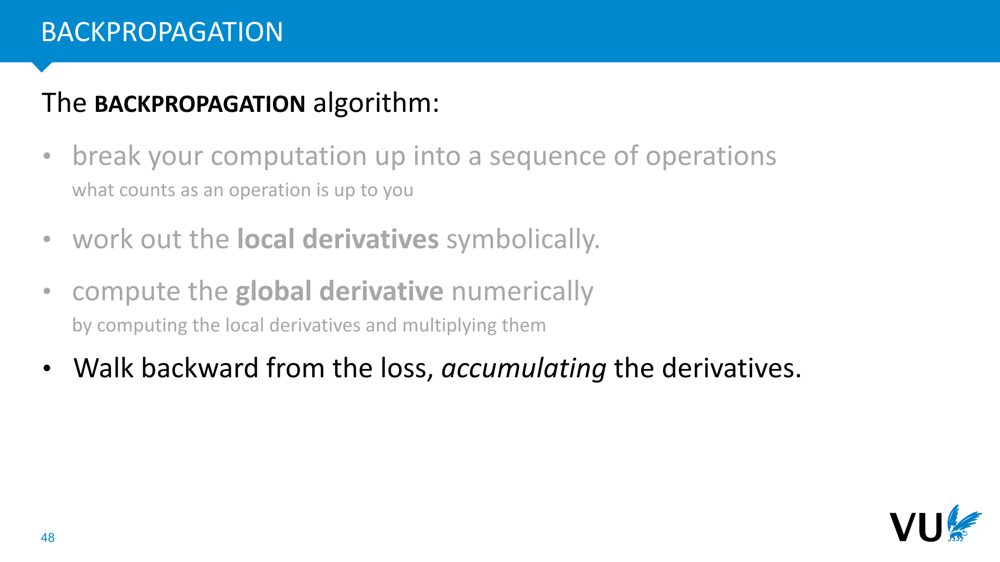

            <figcaption>
            

            </figcaption>
       </section>

       <section id="slide-049">
            <a class="slide-link" href="test.com#slide-049" title="Link to this slide.">link here</a>
            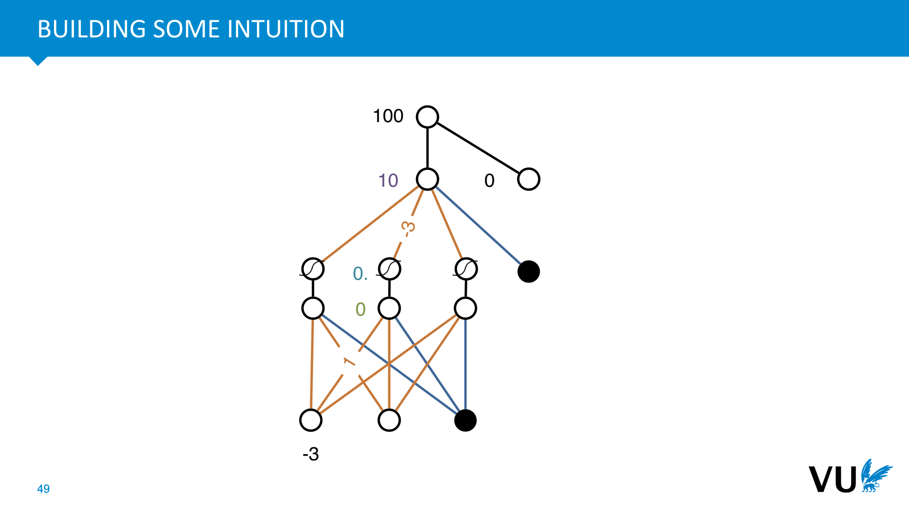

            <figcaption>
            
To finish up, let’s see if we can build a little intuition for what all these accumulated derivatives mean. 

Here is a forward pass for some weights and some inputs. Backpropagation starts with the loss, and walks down the network, figuring out at each step how every value contributed to the result of the forward pass. Every value that contributed positively to a positive loss should be lowered, every value that contributed positively to a negative loss should be increased, and so on.

            </figcaption>
       </section>

       <section id="slide-050" class="anim">
            <a class="slide-link" href="test.com#slide-050" title="Link to this slide.">link here</a>
            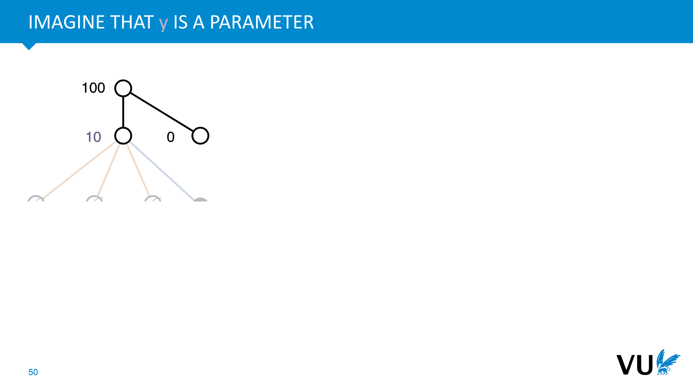

            <figcaption>
            
We’ll start with the first value below the loss: y, the output of our model. Of course, this isn’t<em> a parameter</em> of the network, we can set it to any value we'd like. But let’s imagine for a moment that we could. What would the gradient descent update rule look like if we try to update y? 

If the output is 10, and it should have been 0, then gradient descent on y tells us to lower the output of the network. If the output is 0 and it should have been 10, GD tells us to increase the value of the output. 

Even though we can’t change y directly, this is the effect we want to achieve: we want to change the values we <em>can</em> change  so that we achieve this change in y. To figure out how to do that, we take this gradient for y, and propagate it back down the network. 

Note that even though these scenarios have the same loss (because of the square), the derivative of the loss has a different sign for each, so we can tell whether the output is bigger than the target or the other way around. The loss only tells us how bad we've done, but the derivative of the loss tells us where to move to make it better.

            </figcaption>
            click image for animation
       </section>

       <section id="slide-051" class="anim">
            <a class="slide-link" href="test.com#slide-051" title="Link to this slide.">link here</a>
            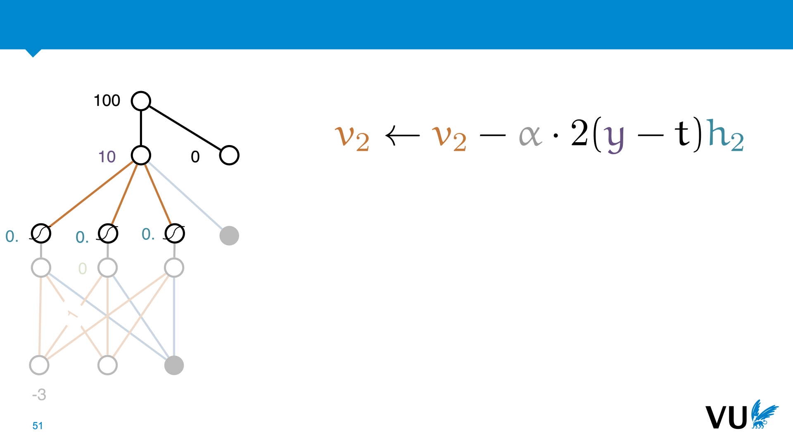

            <figcaption>
            
Instead of changing y, we have to change the values that influenced y. 

Here we see what that looks like for the weights of the second layer. First note that the output y in this example was <strong>too high</strong>. Since all the hidden nodes have positive values (because of the sigmoid), we end up subtracting some positive value from all the weights. This will lower the output, as expected.  

Second, not that the change is proportional to the input. The first hidden node h1 only contributes a factor of 0.1 (times its weight) to the value of y, so it isn't changes as much as h3, which contributes much more to the erroneous value. 

Note that the current value of the weight doesn’t factor into the update. Only how much influence the weight had on the value of y in the forward pass. The higher the activation of the source node, the more the weight gets adjusted. 

Note also how the sign of the the derivative wrt to y is taken into account. Here, the model output was too high, so the more a weight contributed to the output, the more it gets "punished" by being lowered. If the output had been too low, the opposite would be true, and we would be adding something to the value of each weight. 

            </figcaption>
            click image for animation
       </section>

       <section id="slide-052">
            <a class="slide-link" href="test.com#slide-052" title="Link to this slide.">link here</a>
            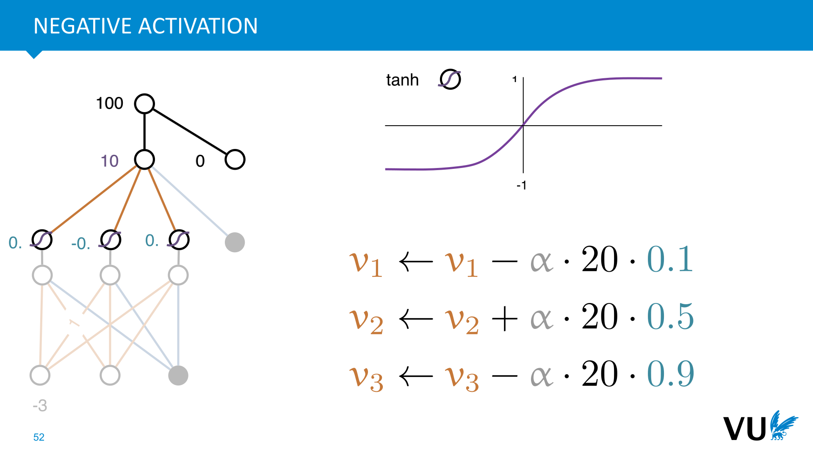

            <figcaption>
            
The sigmoid activation we’ve used so far allows only positive values to emerge from the hidden layer. If we switch to an activation that also allows negative activations (like a linear activation or a <strong>tanh</strong> activation), we see that <strong>backpropagation very naturally takes the sign into account</strong>. 

In this case, we want to update in such a way that y decreases, but we note that the weight v2 is multiplied by a <em>negative</em> value. This means that (for this instance) v2 contributes<em> negatively</em> to the model output, and its value should be increased if we want to decrease the output. 

Note that the sign of v2 itself doesn’t matter. Whether it’s positive or negative, its value should increase.

            </figcaption>
       </section>

       <section id="slide-053">
            <a class="slide-link" href="test.com#slide-053" title="Link to this slide.">link here</a>
            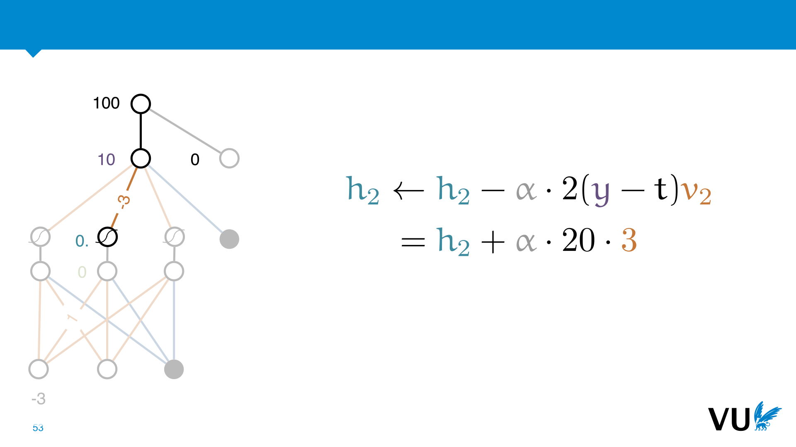

            <figcaption>
            
We use the same principle to work our way back down the network. If we could change the output of the second node h2 directly, this is how we’d do it.  

Note that we now take the value of v2 to be a constant. We are working out<em> partial derivatives</em>, so when we are focusing on one parameters, all the others are taken as constant.  

Remember, that we want to decrease the output of the network. Since v2 makes a <em>negative</em> contribution to the loss, we can achieve this by<em> increasing</em> the activation of the source node v2 is multiplied by. 
<aside    >Note also that we're now using sigmoid activations again.</aside><aside    ></aside>
            </figcaption>
       </section>

       <section id="slide-054">
            <a class="slide-link" href="test.com#slide-054" title="Link to this slide.">link here</a>
            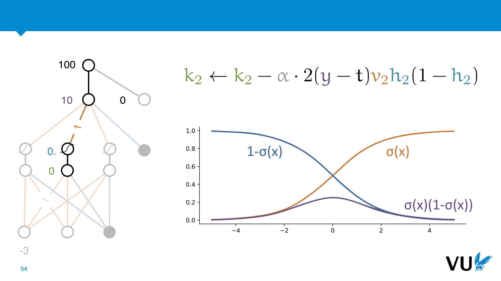

            <figcaption>
            
Moving down to k2, remember that the derivative of the sigmoid is the output of the sigmoid times 1 minus that output. 

We see here, that in the extreme regimes, the sigmoid is <em>resistant to change</em>. The closer to 1 or 0 we get the smaller the weight update becomes. 

This is actually a great <em>downside</em> of the sigmoid activation, and one of the big reasons it was eventually replaced by the ReLU as the default choice for hidden units. We’ll come back to this in lecture 4. 

Nevertheless, this update rule tells us what the change is to k2 that we <em>want to achieve</em> by changing the gradients we can actually change (the weights of layer 1).

            </figcaption>
       </section>

       <section id="slide-055">
            <a class="slide-link" href="test.com#slide-055" title="Link to this slide.">link here</a>
            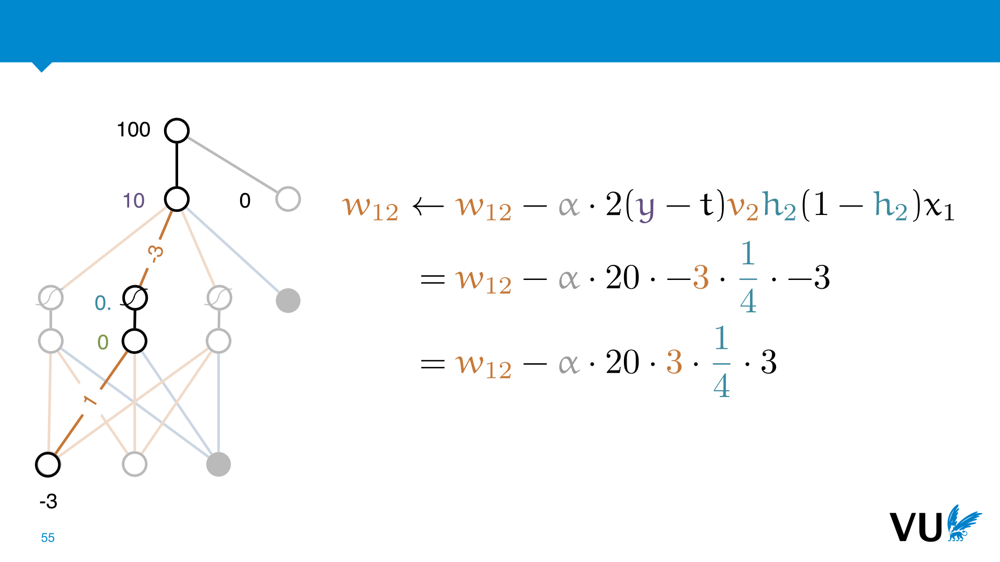

            <figcaption>
            
Finally, we come to the weights of the first layer. As before, we want the output of the network to <em>de</em>crease. To achieve this, we want h2 to <em>in</em>crease (because v2 is negative). However, the input x1 is negative, so we should decrease w12 to increase h2. This is all beautifully captured by the chain rule: the two negatives of x1 and v2 cancel out and we get a positive value which we subtract from w12.

            </figcaption>
       </section>

       <section id="slide-056">
            <a class="slide-link" href="test.com#slide-056" title="Link to this slide.">link here</a>
            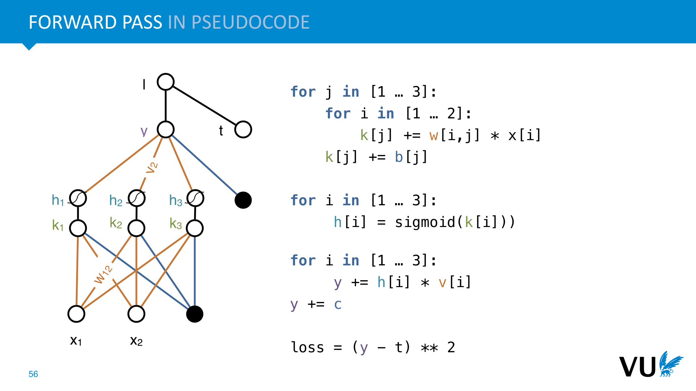

            <figcaption>
            
To finish up let's look at how you would implement this in code. Here is the forward pass: computing the model output and the loss, given the inputs and the target value. 

Assume that k and y are initialized with 0s or random values. We'll talk about initialization strategies in the 4th lecture.

            </figcaption>
       </section>

       <section id="slide-057">
            <a class="slide-link" href="test.com#slide-057" title="Link to this slide.">link here</a>
            

            <figcaption>
            
And here is the backward pass. We compute gradients for every node in the network, regardless of whether the node represents a parameter. When we do the gradient descent update, we'll use the gradients of the parameters, and ignore the rest. 

Note that we don’t implement the derivations from slide 44 directly. Instead, we work backwards down the neural network: computing the derivative of each node as we go, by taking the derivative of the loss over the outputs and multiplying it by the local derivative.

            </figcaption>
       </section>

</article>
