<nav class="menu">
    <ul>
        <li class="home"><a href="/">Home</a></li>
        <li class="name">Backpropagation</li>
                <li><a href="#video-004">Scalar backpropagation</a></li>
                <li><a href="#video-042">Tensor backpropagation</a></li>
                <li><a href="#video-066">Automatic differentiation</a></li>
                <li><a href="#slide-101">Tensor details*</a></li>
        <li class="pdf"><a href="https://dlvu.github.io/pdfs/lecture02.backpropagation.annotated.pdf">PDF</a></li>
    </ul>
</nav>

<article class="slides">

       <section id="slide-001">
            <a class="slide-link" href="https://dlvu.github.io/backpropagation#slide-001" title="Link to this slide.">link here</a>
            

            <figcaption>
            
Today’s lecture will be entirely devoted to the backpropagation algorithm. The heart of all deep learning. 

            </figcaption>
       </section>

       <section id="slide-002" class="anim">
            <a class="slide-link" href="https://dlvu.github.io/backpropagation#slide-002" title="Link to this slide.">link here</a>
            

            <figcaption>
            
This is where we left things last lecture. We introduced <strong>gradient descent</strong> as the training algorithm for neural networks. The gradient collects all derivates of the loss with respect to every weight in the neural network.  

For simple models, like a one-layer linear or logistic regression, we can work out the gradient in <em>closed form</em>. That means we get a function of what the gradient is at every point in our parameter space. 

Fro complex, multilayer functions, working out the gradient is not so easy. We need an algorithm to do it for us. That algorithm is called <strong>backpropagation</strong>, and it’s what powers deep learning.

            </figcaption>
            click image for animation
       </section>

       <section id="slide-003">
            <a class="slide-link" href="https://dlvu.github.io/backpropagation#slide-003" title="Link to this slide.">link here</a>
            

            <figcaption>
            
Because backpropagation is so important, we are going to spend an entire lecture on it. Looking at it from different perspectives, and slowly building up to the completely automated, highly parallelized version of the algorithm that we use today. 

In <strong>the first part</strong> we describe backpropagation in a <em>scalar</em> setting. That is, we will treat each individual element of the neural network as a single number, and simply loop over all these numbers to do backpropagation over the whole network. This simplifies the derivation, but it is ultimately a slow algorithm with a complicated notation. 

In <strong>the second part</strong>, we translate neural networks to operations on vectors, matrices and tensors. This allows us to simplify our notation, and more importantly, massively speed up the computation of neural networks. Backpropagation on tensors is a little more difficult to do than backpropagation on scalars, but it's well worth the effort. 

In <strong>the third part</strong>, we will make the final leap from manually worked out and implemented backpropagation system to  full-fledged <em>automatic differentiation</em>: we will show you how to build a system that takes care of the gradient computation entirely by itself. This is the technology behind software like pytorch and tensorflow.

            </figcaption>
       </section>

       <section id="slide-004">
            <a class="slide-link" href="https://dlvu.github.io/backpropagation#slide-004" title="Link to this slide.">link here</a>
            

            <figcaption>
            
In the previous video, we looked at what neural networks are, and we saw that to train them, we need to work out the derivatives of the loss with respect to the parameters of the neural network: collectively these derivatives are known as <em>the gradient</em>. 

            </figcaption>
       </section>

       <section class="video" id="video-004">
           <a class="slide-link" href="https://dlvu.github.io/backpropagation#video-4">link here</a>
           <video controls>
                <source src="https://pbm.thegood.cloud/s/9etMF968KyzFEbn/download/21%20scalar%20backpropagation.mp4" type="video/mp4" />

                Download the <a href="https://pbm.thegood.cloud/s/9etMF968KyzFEbn/download/21%20scalar%20backpropagation.mp4">video</a>.
           </video>

       </section>

       <section id="slide-005">
            <a class="slide-link" href="https://dlvu.github.io/backpropagation#slide-005" title="Link to this slide.">link here</a>
            

            <figcaption>
            
 

            </figcaption>
       </section>

       <section id="slide-006">
            <a class="slide-link" href="https://dlvu.github.io/backpropagation#slide-006" title="Link to this slide.">link here</a>
            

            <figcaption>
            
Here is a diagram of the sort of network we’ll be encountering (this one is called the GoogLeNet). We can’t work out a complete gradient for this kind of architecture by hand. We need help. What we want is some sort of algorithm that lets the computer work out the gradient for us.

            </figcaption>
       </section>

       <section id="slide-007">
            <a class="slide-link" href="https://dlvu.github.io/backpropagation#slide-007" title="Link to this slide.">link here</a>
            

            <figcaption>
            
Of course, working out derivatives is a pretty mechanical process. We could easily take all the rules we know, and put them into some algorithm. This is called <strong>symbolic differentiation</strong>, and it’s what systems like Mathematica and Wolfram Alpha do for us. 

Unfortunately, as you can see here, the derivatives it returns get pretty horrendous the deeper the neural network gets. This approach becomes impractical very quickly.  
<aside    >As the depth of the network grows, the symbolic expression of its gradient (usually) grows exponentially in size. </aside>
Note that in symbolic differentiation we get a description of the derivative that<strong> is independent of the input</strong>. We get a function that we can then feed any input to.

            </figcaption>
       </section>

       <section id="slide-008">
            <a class="slide-link" href="https://dlvu.github.io/backpropagation#slide-008" title="Link to this slide.">link here</a>
            

            <figcaption>
            
Another approach is to compute the gradient <em>numerically</em>. For instance by the method of finite differences: we take a small step ε and, see how much the function changes. The amount of change divided by the step size is a good estimate for the  gradient if ε is small enough. 

Numeric approaches are sometimes used in deep learning, but it’s very expensive to make them accurate enough if you have a large number of parameters. 

Note that in the numeric approach, you only get an answer <strong>for a particular input</strong>. If you want to compute the gradient at some other point in space, you have to compute another numeric approximation. Compare this to the symbolic approach (either with pen and paper or through wolfram alpha) where once the differentation is done, all we have to compute is the derivative that we've worked out.

            </figcaption>
       </section>

       <section id="slide-009">
            <a class="slide-link" href="https://dlvu.github.io/backpropagation#slide-009" title="Link to this slide.">link here</a>
            

            <figcaption>
            
Backpropagation is a kind of middle ground between symbolic and numeric approaches to working out the gradient. We break the computation into parts: we work out the derivatives of the parts <em>symbolically</em>, and then chain these together <em>numerically</em>. 

The secret ingredient that allows us to make this work is the <strong>chain rule</strong> of differentiation.

            </figcaption>
       </section>

       <section id="slide-010" class="anim">
            <a class="slide-link" href="https://dlvu.github.io/backpropagation#slide-010" title="Link to this slide.">link here</a>
            

            <figcaption>
            
Here is the chain rule: if we want the derivative of a function which is the composition of two other functions, in this case f and g, we can take the derivative of f with respect to the output of g and  multiply it by the derivative of g with respect to the input x. 

Since we’ll be using the chain rule <em>a lot</em>, we’ll introduce a simple shorthand to make it a little easier to parse. We draw a little diagram of which function feeds into which. This means we know what the argument of each function is, so we can remove the arguments from our notation.  

We call this diagram a <strong>computation graph</strong>. We'll stick with simple diagrams like this for now. At the end of the lecture, we will expand our notation a little bit to capture more detail of the computation. 

            </figcaption>
            click image for animation
       </section>

       <section id="slide-011" class="anim">
            <a class="slide-link" href="https://dlvu.github.io/backpropagation#slide-011" title="Link to this slide.">link here</a>
            

            <figcaption>
            
Since the chain rule is the heart of backpropagation, and backpropagation is the heart of deep learning, we should probably take some time to see why the chain rule is true at all. 

If we imagine that f and g are linear functions, it’s pretty straightforward to show that this is true. They may not be, of course, but the nice thing about calculus is that locally, we can <em>treat</em> them as linear functions (if they are differentiable). In an infinitesimally small neighbourhood f and g are exactly linear. 

If f and g are locally linear, we can describe their behavior with a slope s and an additive constant b. The slopes,<em> </em>sf and sg, are simply the derivatives. The additive constants we will show can be ignored.  

In this linear view, what the chain rule says is this: if we approximate f(x) as a linear function, then its slope is the slope of f <em>as a function of </em><em>g</em>, times the slope of g as a function of x. To prove that this is true, we just write down f(g(x)) as linear functions, and multiply out the brackets. 

Note that this doesn’t quite count as a rigorous proof, but it’s hopefully enough to give you some intuition for why the chain rule holds. 

            </figcaption>
            click image for animation
       </section>

       <section id="slide-012" class="anim">
            <a class="slide-link" href="https://dlvu.github.io/backpropagation#slide-012" title="Link to this slide.">link here</a>
            

            <figcaption>
            
Since we’ll be looking at some pretty elaborate computation graphs, we’ll need to be able to deal with this situation as well: we have a computation graph, as before, but f depends on x through two different operations. How do we take the derivative of f over x? 

The multivariate chain rule tells us that we can simply apply the chain rule along g, taking h as a constant, and sum it with the chain rule along h taking g as a constant.

            </figcaption>
            click image for animation
       </section>

       <section id="slide-013" class="anim">
            <a class="slide-link" href="https://dlvu.github.io/backpropagation#slide-013" title="Link to this slide.">link here</a>
            

            <figcaption>
            
We can see why this holds in the same way as before. The short story: since all functions can be taken to be linear, their slopes distribute out into a sum 

            </figcaption>
            click image for animation
       </section>

       <section id="slide-014">
            <a class="slide-link" href="https://dlvu.github.io/backpropagation#slide-014" title="Link to this slide.">link here</a>
            

            <figcaption>
            
If we have more than two paths from the input to the output, we simply sum over all of them. 

            </figcaption>
       </section>

       <section id="slide-015">
            <a class="slide-link" href="https://dlvu.github.io/backpropagation#slide-015" title="Link to this slide.">link here</a>
            

            <figcaption>
            
With that, we are ready to show how backpropagation works. We'll start with a fairly arbitrary function to show the principle before we move on to more realistic neural networks. 

            </figcaption>
       </section>

       <section id="slide-016" class="anim">
            <a class="slide-link" href="https://dlvu.github.io/backpropagation#slide-016" title="Link to this slide.">link here</a>
            

            <figcaption>
            
The first thing we do is to break up its functional form into a series of smaller operations. The entire function f is then just a chain of these small operations chained together. We can draw this in a computation graph as we did before. 

Normally, we wouldn’t break a function up in such small operations. This is just a simple example to illustrate the principle. 

            </figcaption>
            click image for animation
       </section>

       <section id="slide-017" class="anim">
            <a class="slide-link" href="https://dlvu.github.io/backpropagation#slide-017" title="Link to this slide.">link here</a>
            

            <figcaption>
            
Now, to work out the derivative of f, we can<em> iterate the chain rule</em>. We apply it again and again, until the derivative of f over x is expressed as a long product of derivatives of operation outputs over their inputs. 

            </figcaption>
            click image for animation
       </section>

       <section id="slide-018">
            <a class="slide-link" href="https://dlvu.github.io/backpropagation#slide-018" title="Link to this slide.">link here</a>
            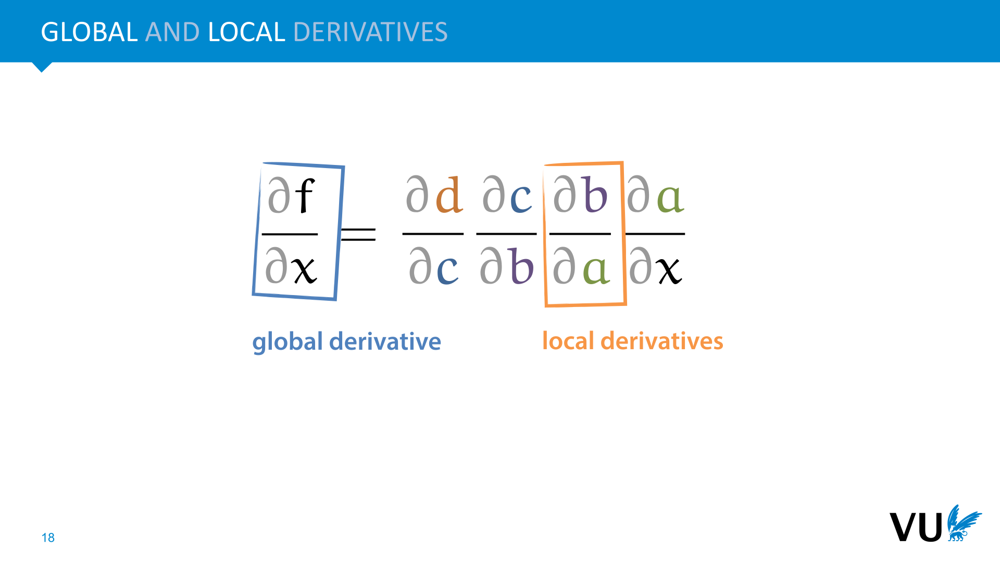

            <figcaption>
            
We call the larger derivative of f over x the <strong>global derivative</strong>. And we call the individual factors, the derivatives of the operation output wrt to their inputs, the l<strong>ocal derivatives</strong>.

            </figcaption>
       </section>

       <section id="slide-019">
            <a class="slide-link" href="https://dlvu.github.io/backpropagation#slide-019" title="Link to this slide.">link here</a>
            

            <figcaption>
            
This is how the backpropagation algorithm combines symbolic and numeric computation. We work out the local derivatives symbolically, and then work out the global derivative numerically.

            </figcaption>
       </section>

       <section id="slide-020" class="anim">
            <a class="slide-link" href="https://dlvu.github.io/backpropagation#slide-020" title="Link to this slide.">link here</a>
            

            <figcaption>
            
For each local derivative, we work out the symbolic derivative with pen and paper.  

Note that we could fill in the a, b and c in the result, but we don’t. We simply leave them as is. For the symbolic part, we are only interested in the derivative of the output of each sub-operation with respect to its immediate input. 

The rest of thew algorithm is performed numerically.

            </figcaption>
            click image for animation
       </section>

       <section id="slide-021" class="anim">
            <a class="slide-link" href="https://dlvu.github.io/backpropagation#slide-021" title="Link to this slide.">link here</a>
            

            <figcaption>
            
This we are now computing things numerically, we need a specific input, in this case x = -4.499. We start by feeding this through the computation graph. For each sub-operation, we store the output value. At the end, we get the output of the function f. This is called a <strong>forward pass</strong>: a fancy term for computing the output of f for a given input. 

Note that at this point, we are no longer computing solutions in general. We are computing our function for a specific input. We will be computing the gradient for this specific input as well.

            </figcaption>
            click image for animation
       </section>

       <section id="slide-022" class="anim">
            <a class="slide-link" href="https://dlvu.github.io/backpropagation#slide-022" title="Link to this slide.">link here</a>
            

            <figcaption>
            
Keeping all intermediate values from the forward pass in memory, we go back to our symbolic expression of the derivative. Here, we fill in the intermediate values a b and c. After we do this, we can finish the multiplication numerically, giving us a numeric value of the gradient of f at x = -4.499. In this case, the gradient happens to be 0. 

            </figcaption>
            click image for animation
       </section>

       <section id="slide-023">
            <a class="slide-link" href="https://dlvu.github.io/backpropagation#slide-023" title="Link to this slide.">link here</a>
            

            <figcaption>
            
Before we try this on a neural network, here are the main things to remember about the backpropagation algorithm.  

Note that backpropagation by itself does not train a neural net. It just provides a gradient. When people say that they trained a network by backpropagation, that's actually shorthand for training the network by gradient descent, with the gradients worked out by backpropagation.

            </figcaption>
       </section>

       <section id="slide-024" class="anim">
            <a class="slide-link" href="https://dlvu.github.io/backpropagation#slide-024" title="Link to this slide.">link here</a>
            

            <figcaption>
            
To explain how backpropagation works in a neural network, we extend our neural network diagram a little bit, to make it closer to the actual computation graph we’ll be using.  

First, we separate the hidden node into the result of the linear operation ki and the application of the nonlinearity hi. Second, since we’re interested in the derivative of the loss rather than the output of the network, we extend the network with one more step:<strong> the computation of the loss</strong> (over one example to keep things simple). In this final step, the output y of the network is compared to the target value t from the data, producing a loss value.  

The loss is the function for which we want to work out the gradient, so the computation graph is the one that computes first the model output, and then the loss based on this output (and the target). 

Note that the model is now just a <em>subgraph</em> of the computation graph. You can think of t as another input node, like x1 and x2, (but one to which the <em>model</em> doesn’t have access).

            </figcaption>
            click image for animation
       </section>

       <section id="slide-025" class="anim">
            <a class="slide-link" href="https://dlvu.github.io/backpropagation#slide-025" title="Link to this slide.">link here</a>
            

            <figcaption>
            
We want to work out the gradient of the loss. This is simply the collection of the derivative of the loss over each parameter. 

We’ll pick two parameters, v2 in the second layer, and w12 in the first, and see how backpropagation operates. The rest of the parameters can be worked out in the same way to give us the rest of the gradient. 

First, we have to break the computation of the loss into operations. If we take the graph on the left to be our computation graph, then we end up with the operations of the right. 

To simplify things, we’ll compute the loss over only one instance. We’ll use a simple squared error loss.

            </figcaption>
            click image for animation
       </section>

       <section id="slide-026" class="anim">
            <a class="slide-link" href="https://dlvu.github.io/backpropagation#slide-026" title="Link to this slide.">link here</a>
            

            <figcaption>
            
For the derivative with respect to v2, we’ll only need these two operations. Anything below doesn’t affect the result. 

To work out the derivative we apply the chain rule, and work out the local derivatives symbolically. 

            </figcaption>
            click image for animation
       </section>

       <section id="slide-027" class="anim">
            <a class="slide-link" href="https://dlvu.github.io/backpropagation#slide-027" title="Link to this slide.">link here</a>
            

            <figcaption>
            
We then do a forward pass with some values. We get an output of 10.1, which should have been 12.1, so our loss is 4. We keep all intermediate values in memory. 

We then take our product of local derivatives, fill in the numeric values from the forward pass, and compute the derivative over v2. 

When we apply this derivative in a gradient descent update, v2 changes as shown below. 

            </figcaption>
            click image for animation
       </section>

       <section id="slide-028" class="anim">
            <a class="slide-link" href="https://dlvu.github.io/backpropagation#slide-028" title="Link to this slide.">link here</a>
            

            <figcaption>
            
Let’s try something a bit earlier in the network: the weight w12. We add two operations, apply the chain rule and work out the local derivatives.

            </figcaption>
            click image for animation
       </section>

       <section id="slide-029" class="anim">
            <a class="slide-link" href="https://dlvu.github.io/backpropagation#slide-029" title="Link to this slide.">link here</a>
            

            <figcaption>
            
Note that when we’re computing the derivative for w12, we are also, along the way computing the derivatives for y, h2 and k2. 

This useful when it comes to implementing backpropagation. We can walk backward down the computation graph and compute the derivative of the loss for every node. For the nodes below, we just multiply the local gradient. This means we can very efficiently compute any derivatives we need.  

In fact, this is <em>where the name backpropagation comes from</em>: the derivative of the loss propagates down the network in the opposite direction to the forward pass. 

To make this idea more precise we’ll need to draw our computation in a slightly different kind of diagram

            </figcaption>
            click image for animation
       </section>

       <section id="slide-030" class="anim">
            <a class="slide-link" href="https://dlvu.github.io/backpropagation#slide-030" title="Link to this slide.">link here</a>
            

            <figcaption>
            
Here is a more abstract view of what is happening in backpropagation, which should apply to any kind of computation. We can think of the computations we do as modules with inputs and outputs, chained together to make a computation <em>graph</em>. The output of each module contributes ultimately to the result of the computation, which is the <em>loss</em>. 

We want to know the derivative of the loss with respect to each of our input nodes. By the chain rule, this is the derivative of the los with respect to the output times the derivative of the output with respect to the input. 

If we take care to walk back down our computation graph in the correct order, then we can be sure that for every module we encounter, we will have already computed the first factor. We only need to compute the second, and multiply by the value we already have. 
<aside    >We’ll extend this abstract view of backpropagation in the last part of the lecture. See <a href="https://mlvu.github.io/beyondlinear/#slide-031">https://mlvu.github.io/beyondlinear/#slide-031</a> for a more in-depth explanation of this principle in scalar graphs. </aside><aside    ></aside>
            </figcaption>
            click image for animation
       </section>

       <section id="slide-031">
            <a class="slide-link" href="https://dlvu.github.io/backpropagation#slide-031" title="Link to this slide.">link here</a>
            

            <figcaption>
            

            </figcaption>
       </section>

       <section id="slide-032">
            <a class="slide-link" href="https://dlvu.github.io/backpropagation#slide-032" title="Link to this slide.">link here</a>
            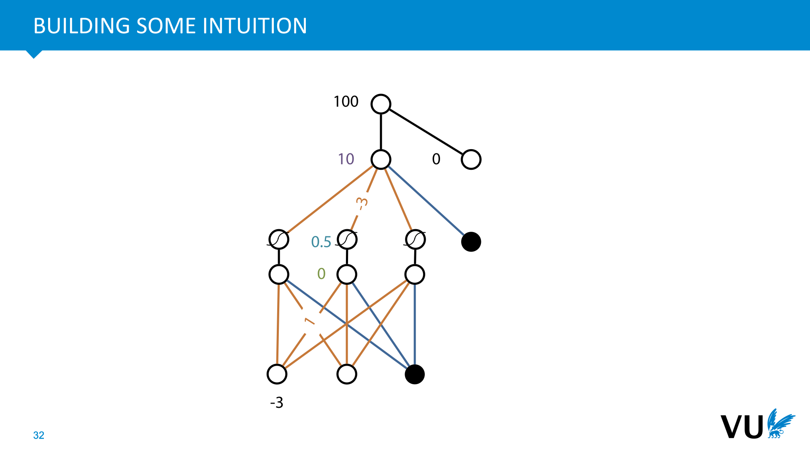

            <figcaption>
            
To finish up, let’s see if we can build a little intuition for what all these accumulated derivatives mean. 

Here is a forward pass for some weights and some inputs. Backpropagation starts with the loss, and walks down the network, figuring out at each step how every value contributed to the result of the forward pass. Every value that contributed positively to a positive loss should be lowered, every value that contributed positively to a negative loss should be increased, and so on.

            </figcaption>
       </section>

       <section id="slide-033" class="anim">
            <a class="slide-link" href="https://dlvu.github.io/backpropagation#slide-033" title="Link to this slide.">link here</a>
            

            <figcaption>
            
We’ll start with the first value below the loss: y, the output of our model. Of course, this isn’t<em> a parameter</em> of the network, we can set it to any value we'd like. But let’s imagine for a moment that we could. What would the gradient descent update rule look like if we try to update y? 

If the output is 10, and it should have been 0, then gradient descent on y tells us to lower the output of the network. If the output is 0 and it should have been 10, GD tells us to increase the value of the output. 

Even though we can’t change y directly, this is the effect we want to achieve: we want to change the values we <em>can</em> change  so that we achieve this change in y. To figure out how to do that, we take this gradient for y, and propagate it back down the network. 

Note that even though these scenarios have the same loss (because of the square), the derivative of the loss has a different sign for each, so we can tell whether the output is bigger than the target or the other way around. The loss only tells us how bad we've done, but the derivative of the loss tells us where to move to make it better.

            </figcaption>
            click image for animation
       </section>

       <section id="slide-034" class="anim">
            <a class="slide-link" href="https://dlvu.github.io/backpropagation#slide-034" title="Link to this slide.">link here</a>
            

            <figcaption>
            
Of course, we cannot change y directly. Instead, we have to change the values that influenced y. 

Here we see what that looks like for the weights of the second layer. First note that the output y in this example was <strong>too high</strong>. Since all the hidden nodes have positive values (because of the sigmoid), we end up subtracting some positive value from all the weights. This will lower the output, as expected.  

Second, note that the change is proportional to the inputs (the hidden nodes). The first hidden node h1 only contributes a factor of 0.1 (times its weight) to the value of y, so it isn't changed as much as h3, which contributes much more to the erroneous value. 

Note also that the current value of the weight doesn’t factor into the update: whether v1 is 1, 10 or 100, we subtract the same amount. Only how much influence the weight had on the value of y in the forward pass is taken into account. The higher the activation of the source node, the more the weight gets adjusted. 

Finally, note how the sign of the the derivative wrt to y is taken into account. Here, the model output was too high, so the more a weight contributed to the output, the more it gets "punished" by being lowered. If the output had been too low, the opposite would be true, and we would be adding something to the value of each weight. 

            </figcaption>
            click image for animation
       </section>

       <section id="slide-035">
            <a class="slide-link" href="https://dlvu.github.io/backpropagation#slide-035" title="Link to this slide.">link here</a>
            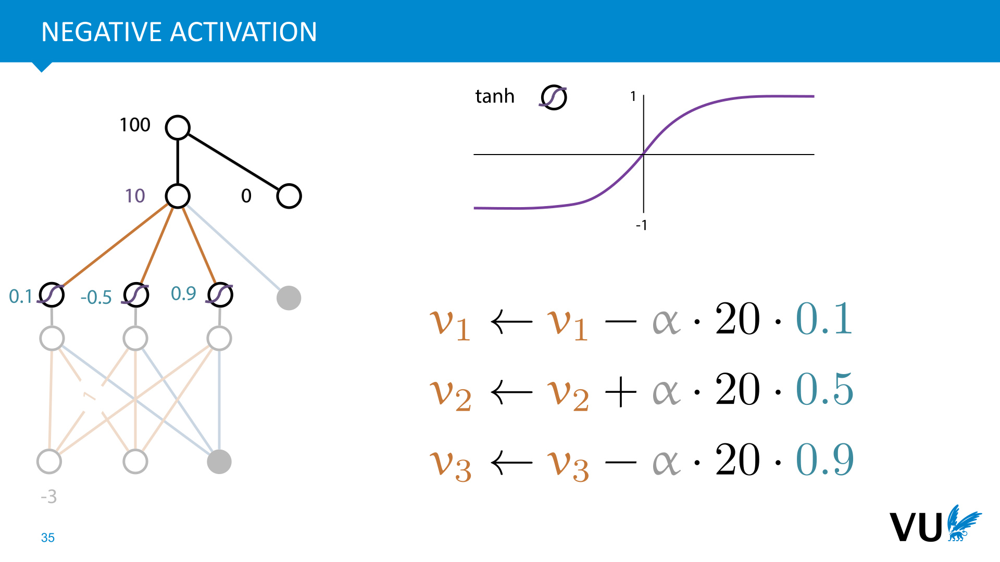

            <figcaption>
            
The sigmoid activation we’ve used so far allows only positive values to emerge from the hidden layer. If we switch to an activation that also allows negative activations (like a linear activation or a <strong>tanh</strong> activation), we see that <strong>backpropagation very naturally takes the sign into account</strong>. 
<aside    >Note the negative activation on h2. </aside>
In this case, we want to update in such a way that y decreases, but we note that the weight v2 is multiplied by a <em>negative</em> value. This means that (for this instance) v2 contributes<em> negatively</em> to the model output, and its value should be <em>in</em>creased if we want to decrease the output. 
<aside    >Note that the sign of v2 itself doesn’t matter. Whether it’s positive or negative, its value should increase.</aside><aside    ></aside>
            </figcaption>
       </section>

       <section id="slide-036">
            <a class="slide-link" href="https://dlvu.github.io/backpropagation#slide-036" title="Link to this slide.">link here</a>
            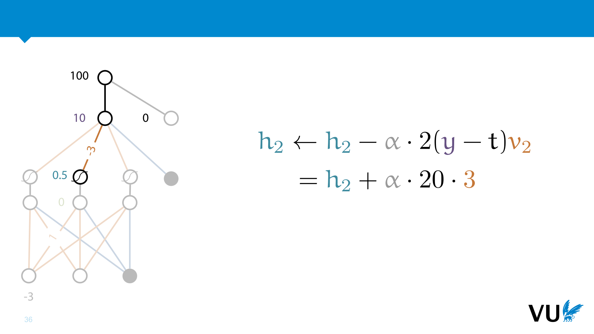

            <figcaption>
            
We use the same principle to work our way back down the network. If we could change the output of the second node h2 directly, this is how we’d do it.  

Note that we now take the value of v2 to be a constant. We are working out<em> partial derivatives</em>, so when we are focusing on one parameters, all the others are taken as constant.  

Remember, that we want to decrease the output of the network. Since v2 makes a <em>negative</em> contribution to the loss, we can achieve this by<em> increasing</em> the activation of the source node v2 is multiplied by. 
<aside    >Note also that we’ve switched back to sigmoid activations.</aside><aside    ></aside>
            </figcaption>
       </section>

       <section id="slide-037">
            <a class="slide-link" href="https://dlvu.github.io/backpropagation#slide-037" title="Link to this slide.">link here</a>
            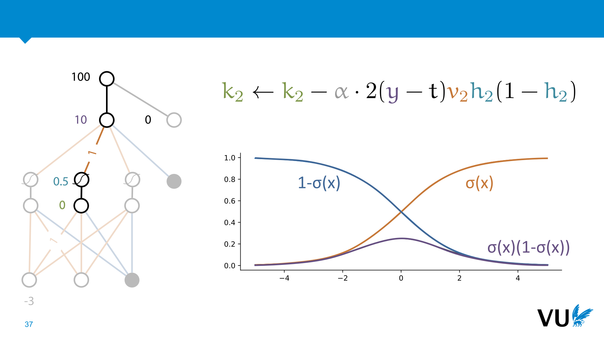

            <figcaption>
            
Moving down to k2, remember that the derivative of the sigmoid is the output of the sigmoid times 1 minus that output. 

We see here, that in the extreme regimes, the sigmoid is <em>resistant to change</em>. The closer to 1 or 0 we get the smaller the weight update becomes. 

This is actually a great <em>downside</em> of the sigmoid activation, and one of the big reasons it was eventually replaced by the ReLU as the default choice for hidden units. We’ll come back to this in a later lecture. 

Nevertheless, this update rule tells us what the change is to k2 that we <em>want to achieve</em> by changing the gradients we can actually change (the weights of layer 1).

            </figcaption>
       </section>

       <section id="slide-038">
            <a class="slide-link" href="https://dlvu.github.io/backpropagation#slide-038" title="Link to this slide.">link here</a>
            

            <figcaption>
            
Finally, we come to the weights of the first layer. As before, we want the output of the network to <em>de</em>crease. To achieve this, we want h2 to <em>in</em>crease (because v2 is negative). However, the input x1 is negative, so we should decrease w12 to increase h2. This is all beautifully captured by the chain rule: the two negatives of x1 and v2 cancel out and we get a positive value which we subtract from w12.

            </figcaption>
       </section>

       <section id="slide-039">
            <a class="slide-link" href="https://dlvu.github.io/backpropagation#slide-039" title="Link to this slide.">link here</a>
            

            <figcaption>
            
To finish up let's look at how you would implement this in code. Here is the forward pass: computing the model output and the loss, given the inputs and the target value. 

You can assume that the w’s and b’s are initially set to 0 or to random values. We'll talk about initialization strategies in the 4th lecture.

            </figcaption>
       </section>

       <section id="slide-040">
            <a class="slide-link" href="https://dlvu.github.io/backpropagation#slide-040" title="Link to this slide.">link here</a>
            

            <figcaption>
            
And here is the backward pass. We compute gradients for every node in the network, regardless of whether the node represents a parameter. When we do the gradient descent update, we'll use the gradients of the parameters, and ignore the rest. 

Note that we don’t implement the derivations from slide 44 directly. Instead, we work backwards down the neural network: computing the derivative of each node as we go, by taking the derivative of the loss over the outputs and multiplying it by the local derivative. 

What this shows is that backpropagation, done like this is a kind of meta-algorithm. For each neural network that you draw, it tells you how to work out a backward pass, but the actual<em> code</em> for that backward pass is always a different algorithm depending on the shape of the network.  

In the last section we’ll see autograd. The algorithm that looks at the shape of a network, and applies backpropagation without us having to do anything.

            </figcaption>
       </section>

       <section id="slide-041">
            <a class="slide-link" href="https://dlvu.github.io/backpropagation#slide-041" title="Link to this slide.">link here</a>
            

            <figcaption>
            

            </figcaption>
       </section>

       <section id="slide-042">
            <a class="slide-link" href="https://dlvu.github.io/backpropagation#slide-042" title="Link to this slide.">link here</a>
            

            <figcaption>
            

            </figcaption>
       </section>

       <section class="video" id="video-042">
           <a class="slide-link" href="https://dlvu.github.io/backpropagation#video-42">link here</a>
           <video controls>
                <source src="https://pbm.thegood.cloud/s/J9gfdbTn7Kx5bKk/download/22%20tensor%20backpropagation.mp4" type="video/mp4" />

                Download the <a href="https://pbm.thegood.cloud/s/J9gfdbTn7Kx5bKk/download/22%20tensor%20backpropagation.mp4">video</a>.
           </video>

       </section>

       <section id="slide-043">
            <a class="slide-link" href="https://dlvu.github.io/backpropagation#slide-043" title="Link to this slide.">link here</a>
            

            <figcaption>
            
 

 

We’ve seen what neural networks are, how to train them by gradient descent and how to compute that gradient by backpropagation. 

In order to scale up to larger and more complex structures, we need two make our computations as efficient as possible, and we’ll also need to simplify our notation. There’s one insight that we are going to get a lot of mileage out of.

            </figcaption>
       </section>

       <section id="slide-044" class="anim">
            <a class="slide-link" href="https://dlvu.github.io/backpropagation#slide-044" title="Link to this slide.">link here</a>
            

            <figcaption>
            
When we look at the computation of a neural network, we can see that most operations can be expressed very naturally in those of linear algebra. 

The multiplication of weights by their inputs is a multiplication of a matrix of weights by a vector of inputs. 
<aside    >Note that the weight w12 (as we’ve called it so far, because it goes from node 1 to node 2) actually goes into element W21 of the matrix W. You can tell the difference by whether we’re using a lower-case or capital w. </aside>
The addition of a bias is the addition of a vector of bias parameters. 

The nonlinearities can be implemented as simple element-wise operations. 

This perspective buys us two things. First… 

            </figcaption>
            click image for animation
       </section>

       <section id="slide-045">
            <a class="slide-link" href="https://dlvu.github.io/backpropagation#slide-045" title="Link to this slide.">link here</a>
            

            <figcaption>
            
Our notation becomes extremely simple. We can describe the whole operation of a neural network with one simple equation. This expressiveness will be sorely needed when we move to more complicated networks.

            </figcaption>
       </section>

       <section id="slide-046">
            <a class="slide-link" href="https://dlvu.github.io/backpropagation#slide-046" title="Link to this slide.">link here</a>
            

            <figcaption>
            
The second reason is that the biggest computational bottleneck in a neural network is the multiplication of the layer input by the layer weights. The matrix multiplication in the notation of the previous slide. This operation is more than quadratic while everything else is linear. We can see that in our pseudocode, because we have one loop, nested in another. 

Matrix multiplication (and other tensor operations like it) can be parallelized and implemented efficiently but it’s a lot of work. Ideally, we’d like to let somebody else do all that work (like the implementers of numpy) and then just call their code to do the matrix multiplications. 

This is especially important if you have access to a GPU. A matrix multiplication can easily be offloaded to the GPU for much faster processing, but for a loop over an array, there’s no benefit. 

This is called <strong>vectorizing</strong>: taking a piece of code written in for loops, and getting rid of the loops by expressing the function as a sequence of linear algebra operations.

            </figcaption>
       </section>

       <section id="slide-047">
            <a class="slide-link" href="https://dlvu.github.io/backpropagation#slide-047" title="Link to this slide.">link here</a>
            

            <figcaption>
            
Without vectorized implementations, deep learning would be painfully slow, and GPUs would be useless. Turning a naive, loop-based implementation into a vectorized one is a key skill for DL researchers and programmers.

            </figcaption>
       </section>

       <section id="slide-048" class="anim">
            <a class="slide-link" href="https://dlvu.github.io/backpropagation#slide-048" title="Link to this slide.">link here</a>
            

            <figcaption>
            
Here’s what the vectorized forward pass looks like as a computation graph, in symbolic notation and in pseudocode.  

When you implement this in numpy it’ll look almost the same. 
<aside    >Note that this doesn't just represent the network in the previous part, it represents any such network, regardless of the sizes of the input and hidden layers. We've abstracted away some details about the specifics of the network. We've also made the output and the target label vectors for the sake of generality </aside>
So far so good. The forward pass is easy enough to vectorize.

            </figcaption>
            click image for animation
       </section>

       <section id="slide-049" class="anim">
            <a class="slide-link" href="https://dlvu.github.io/backpropagation#slide-049" title="Link to this slide.">link here</a>
            

            <figcaption>
            
Of course, we lose a lot of the benefit of vectorizing if the backward pass (the backpropagation algorithm) isn’t also expressed in terms of matrix multiplications. <strong>How do we vectorize the backward pass? </strong>That's the question we'll answer in the rest of this video.<strong> </strong>

On the left, we see the forward pass of our loss computation as a set of operations on vectors and matrices. 

To generalize backpropagation to this view, we might ask if something similar to the chain rule exists for vectors and matrices. Firstly, can we define something analogous to the derivative of one matrix over another, and secondly, can we break this apart into a product of local derivatives, possibly giving us a sequence of matrix multiplications? 

The answer is yes, there are many ways of applying calculus to vectors and matrices, and there are many chain rules available in these domains. However, things can quickly get a little hairy, so we need to tread carefully.

            </figcaption>
            click image for animation
       </section>

       <section id="slide-050" class="anim">
            <a class="slide-link" href="https://dlvu.github.io/backpropagation#slide-050" title="Link to this slide.">link here</a>
            

            <figcaption>
            
The derivatives of high-dimensional objects are easily defined. We simply take the derivative of every number in the input over every number in the output, and we arrange all possibilities into some logical shape. For instance, if we have a vector-to-vector function, the natural analog of the derivative is a matrix with all the partial derivatives in it.  

However, once we get to matrix/vector operations or matrix/matrix operations, the only way to logically arrange every input with every output is a tensor of higher dimension than 2. 

NB: We don’t normally apply the differential symbol to non-scalars like this. We’ll introduce better notation later.

            </figcaption>
            click image for animation
       </section>

       <section id="slide-051">
            <a class="slide-link" href="https://dlvu.github.io/backpropagation#slide-051" title="Link to this slide.">link here</a>
            

            <figcaption>
            
As we see, even if we could come up with this kind of chain rule, one of the local derivatives is now a vector over a matrix. The result could only be represented in a 3-tensor. There are two problems with this: 

If the operation has n inputs and n outputs, we are computing n3 derivatives, even though we were only ultimately interested in n2 of them (the derivatives of <strong>W</strong>). In the scalar algorithm we only ever had two nested loops (an n2 complexity), and we only ever stored one gradient for one node in the computation graph. Now we suddenly have n3 complexity and n3 memory use. We were supposed to be making things faster. 

We can easily <em>represent</em> a 3-tensor, but there’s no obvious, default way to multiply  a 3-tensor with a matrix, or with a vector (in fact there are many different ways). The multiplication of the chain rule becomes very complicated this way. 

In short, we need a more careful approach. 

Happily, this will also mean we will never need vector calculus or matrix calculus. While our derivations will contain many vectors and matrices (and higher-order tensors), the derivatives we take <strong>will only ever be with respect to a single scalar</strong>. 
<aside    >That scalar might be an element in a vector or matrix, so it may look like we’re doing a special kind of calculus, but it will always just be a single number, so the plain old rules of partial derivatives still apply. If you don’t let yourself get spooked by the indices, you’ll always be able to work it out from the basic principles of plain derivative taking.</aside><aside    ></aside>
            </figcaption>
       </section>

       <section id="slide-052" class="anim">
            <a class="slide-link" href="https://dlvu.github.io/backpropagation#slide-052" title="Link to this slide.">link here</a>
            

            <figcaption>
            
To work out how to do this we make these simplifying assumptions. 

            </figcaption>
            click image for animation
       </section>

       <section id="slide-053">
            <a class="slide-link" href="https://dlvu.github.io/backpropagation#slide-053" title="Link to this slide.">link here</a>
            

            <figcaption>
            
Note that this doesn’t mean we can only ever train neural networks with a single scalar  output. Our neural networks  can have any number of outputs of any shape and size. We can make neural networks that generate images, natural language, raw audio, even video. 

However, the <em>loss</em> we define over those outputs needs to map them all to a single scalar value. The computation graph is always the model, plus the computation of the loss. 

            </figcaption>
       </section>

       <section id="slide-054" class="anim">
            <a class="slide-link" href="https://dlvu.github.io/backpropagation#slide-054" title="Link to this slide.">link here</a>
            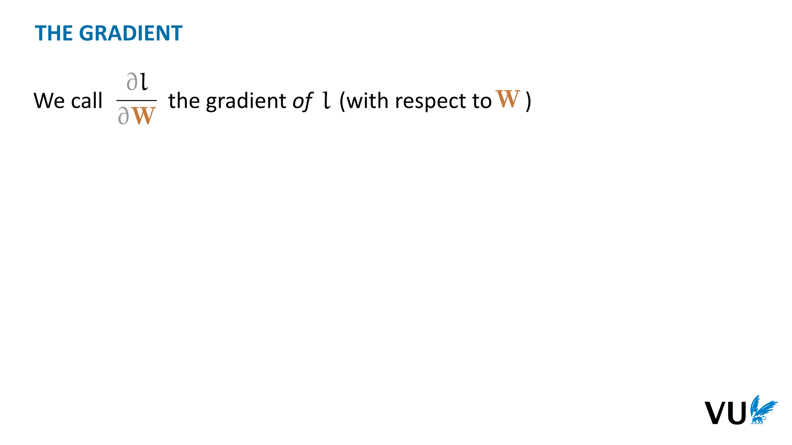

            <figcaption>
            
We call this derivative <strong>the gradient of </strong><strong>W</strong>. This is a common term, but we will deviate from the standard approach in one respect.  

Normally, the gradient is defined as a row vector, so that it can operate on a space of column vectors by matrix multiplication. 

In our case, we are never interested in multiplying the gradient by anything. We only ever want to <em>sum</em> the gradient of l wrt <strong>W</strong> with the original matrix <strong>W</strong> in a gradient update step. For this reason <strong>we define the gradient as having the same shape</strong> as the tensor <strong>W</strong> with respect to which we are taking the derivative.  

In the example shown, <strong>W</strong> is a 3-<em>tensor </em>(a kind of matrix with 3 dimensions instead of 2). The gradient of l wrt <strong>W</strong> has the same shape as <strong>W</strong>, and at element (i, j, k) it holds the scalar derivative of l wrt <strong>W</strong>ijk. 

With these rules, we can use tensors of any shape and dimension and always have a welldefined gradient.

            </figcaption>
            click image for animation
       </section>

       <section id="slide-055" class="anim">
            <a class="slide-link" href="https://dlvu.github.io/backpropagation#slide-055" title="Link to this slide.">link here</a>
            

            <figcaption>
            
The standard gradient notation isn’t very suitable for our purposes. It puts the loss front and center, but that will be the same in all cases. The object that we’re actually interested in is relegated to a subscript. Also, it isn’t very clear from the notation what the shape is of the tensor that we’re looking at.  

For this reason, we’ll introduce a new notation. This isn’t standard, so don’t expect to see it anywhere else, but it will help to clarify our mathematics a lot as we go forward. 

We’ve put the <strong>W</strong> front and center, so it’s clear that the result of taking the gradient is also a matrix, and we’ve removed the loss, since we’ve assume that we are always taking the gradient of the loss. 
<aside    >You can think of the nabla as an operator like a transposition or taking an inverse. It turns a matrix into another matrix, a vector into another vector and so on. </aside>
The notation works the same for vectors and even for scalars. This is the gradient <em>of</em> l with respect to <strong>W</strong>. Since l never changes, we’ll refer to this as “the gradient<em> for</em> <strong>W</strong>”.

            </figcaption>
            click image for animation
       </section>

       <section id="slide-056">
            <a class="slide-link" href="https://dlvu.github.io/backpropagation#slide-056" title="Link to this slide.">link here</a>
            

            <figcaption>
            
When we refer to a single element of the gradient, we will follow our convention for matrices, and use the non-bold version of its letter. 

Element (i, j) for the gradient of W is the same as the gradient for element (i, j) of W.  

To denote this element we follow the convention we have for elements of tensors, that we use the same letter as we use for the matrix, but non-bold.

            </figcaption>
       </section>

       <section id="slide-057" class="anim">
            <a class="slide-link" href="https://dlvu.github.io/backpropagation#slide-057" title="Link to this slide.">link here</a>
            

            <figcaption>
            
This gives us a good way of thinking about the gradients, but we still don’t have a chain rule to base out backpropagation on.  

The main trick we will use is to stick to <strong>scalar derivatives</strong> as much as possible.  

Once we have worked out the derivative in purely scalar terms (on pen and paper), we will then find a way to vectorize their computation.

            </figcaption>
            click image for animation
       </section>

       <section id="slide-058" class="anim">
            <a class="slide-link" href="https://dlvu.github.io/backpropagation#slide-058" title="Link to this slide.">link here</a>
            

            <figcaption>
            
We start simple: what is the gradient for <strong>y</strong>? This is a vector, because <strong>y</strong> is a vector. Let’s first work out the derivative of the i-th element of <strong>y</strong>. This is purely a scalar derivative so we can simply use the rules we already know. We get 2(yi - ti) for that particular derivative. 
<aside    >We can’t directly apply gradient descent to <strong>y</strong>, but we will see later, that it is useful to just work out all the gradients for all the variables in our graph from top to bottom.  </aside>
Then, we just re-arrange all the derivatives for yi into a vector, which gives us the complete gradient for y. 

The final step requires a little creativity: we need to figure out how to compute this vector using only basic linear algebra operations on the given vectors and matrices. In this case it’s not so complicated: we get the gradient for <strong>y</strong> by element-wise subtracting <strong>t</strong> from <strong>y</strong> and multiplying by 2. 

We haven’t needed any chain rule yet, because our computation graph for this part has only one edge. 

 

            </figcaption>
            click image for animation
       </section>

       <section id="slide-059" class="anim">
            <a class="slide-link" href="https://dlvu.github.io/backpropagation#slide-059" title="Link to this slide.">link here</a>
            

            <figcaption>
            
We now move one step down and work out the gradient for <strong>V</strong>. We start with the scalar derivative for an arbitrary element of <strong>V</strong>: Vij. 

Now, we need a chain rule, to backpropagate through <strong>y</strong>. However, since we are sticking to scalar derivatives, we can simply use the <strong>scalar multivariate chain rule</strong>. This tells us that however many intermediate values we have, we can work out the derivative for each, keeping the others constant, and sum the results. 

This gives us the sum in the second equality. We've worked out the gradient <strong>y</strong>∇ already, so we can fill that in and focus on the derivative of yk over Vij. the value of yk is defined in terms of linear algebra operations like matrix multiplication, but with a little thinking we can always rewrite these as a simple scalar sums.  

In the end we find that the derivative of yk over Vij reduces to the value of hj.  

This tells us the values of every elemen (i, j) of <strong>V</strong>∇. All that's left is to figure out how to compute this in a vectorized way. In this case, we can compute <strong>V</strong>∇ as the outer product of the gradient for <strong>y</strong>, which we've computed already, and the vector <strong>h</strong>, which we can save during the forward pass.

            </figcaption>
            click image for animation
       </section>

       <section id="slide-060">
            <a class="slide-link" href="https://dlvu.github.io/backpropagation#slide-060" title="Link to this slide.">link here</a>
            

            <figcaption>
            

            </figcaption>
       </section>

       <section id="slide-061" class="anim">
            <a class="slide-link" href="https://dlvu.github.io/backpropagation#slide-061" title="Link to this slide.">link here</a>
            

            <figcaption>
            
Since this is an important principle to grasp, let’s keep going until we get to the other set of parameters, <strong>W</strong>. We’ll leave the biases as an exercise. 

For the gradient for h, most of the derivation is the same as before, until we get to the point where the scalar derivative is reduced to a matrix mulitplication. Unlike the previous derivation, the sum over k <em>doesn't disappear</em>. We need to take it into the description of the gradient for <strong>h</strong>. 

To vectorize this, we note that each element of this vector is a dot product of <strong>y</strong> and a column of <strong>V</strong>. This means that if we premultiply y (transposed) by V, we get the required result as a row vector. Transposing the result (to make it a column vector) is equivalent to post multiplying y by the transpose of V. 

Note the symmetry of the forward and the backward operation. 

            </figcaption>
            click image for animation
       </section>

       <section id="slide-062" class="anim">
            <a class="slide-link" href="https://dlvu.github.io/backpropagation#slide-062" title="Link to this slide.">link here</a>
            

            <figcaption>
            
Now, at this point, when we analyze <strong>k</strong>, remember that we already have the gradient over <strong>h</strong>. This means that we no longer have to apply the chain rule to anything above <strong>h</strong>. We can draw this scalar computation graph, and work out the local gradient for <strong>k</strong> in terms for the gradient for <strong>h</strong>. 

Given that, working out the gradient for <strong>k</strong> is relatively easy, since the operation from <strong>k</strong> to <strong>h</strong> is an element-wise one.

            </figcaption>
            click image for animation
       </section>

       <section id="slide-063" class="anim">
            <a class="slide-link" href="https://dlvu.github.io/backpropagation#slide-063" title="Link to this slide.">link here</a>
            

            <figcaption>
            
Finally, the gradient for <strong>W</strong>. The situation here is exactly the same as we saw earlier for <strong>V</strong> (matrix in, vector out, matrix multiplication), so we should expect the derivation to have the same form (and indeed it does).

            </figcaption>
            click image for animation
       </section>

       <section id="slide-064">
            <a class="slide-link" href="https://dlvu.github.io/backpropagation#slide-064" title="Link to this slide.">link here</a>
            

            <figcaption>
            
Here’s the backward pass that we just derived in pseudocode. Note that in each step we reuse a derivative that we computed in a previous step. 

We’ve left the derivatives of the bias parameters out. You’ll have to work these out to implement the first homework exercise.

            </figcaption>
       </section>

       <section id="slide-065">
            <a class="slide-link" href="https://dlvu.github.io/backpropagation#slide-065" title="Link to this slide.">link here</a>
            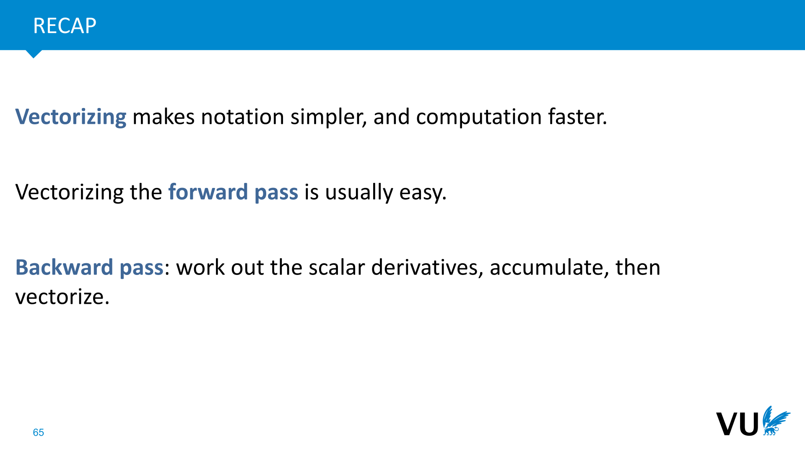

            <figcaption>
            

            </figcaption>
       </section>

       <section id="slide-066">
            <a class="slide-link" href="https://dlvu.github.io/backpropagation#slide-066" title="Link to this slide.">link here</a>
            

            <figcaption>
            

            </figcaption>
       </section>

       <section class="video" id="video-066">
           <a class="slide-link" href="https://dlvu.github.io/backpropagation#video-66">link here</a>
           <video controls>
                <source src="https://pbm.thegood.cloud/s/bHXYesG5X8Rya7P/download/23%20autodiff.mp4" type="video/mp4" />

                Download the <a href="https://pbm.thegood.cloud/s/bHXYesG5X8Rya7P/download/23%20autodiff.mp4">video</a>.
           </video>

       </section>

       <section id="slide-067">
            <a class="slide-link" href="https://dlvu.github.io/backpropagation#slide-067" title="Link to this slide.">link here</a>
            

            <figcaption>
            
 

 

We’ve simplified the computation of derivatives a lot. All we’ve had to do is work out local derivatives and chain them together. We can go one step further: if we let the computer keep track of our computation graph, and provide some backwards functions for basic operations, the computer can work out the whole backpropagation algorithm for us. This is called<strong> automatic differentiation</strong> (or sometimes<strong> autograd</strong>).

            </figcaption>
       </section>

       <section id="slide-068">
            <a class="slide-link" href="https://dlvu.github.io/backpropagation#slide-068" title="Link to this slide.">link here</a>
            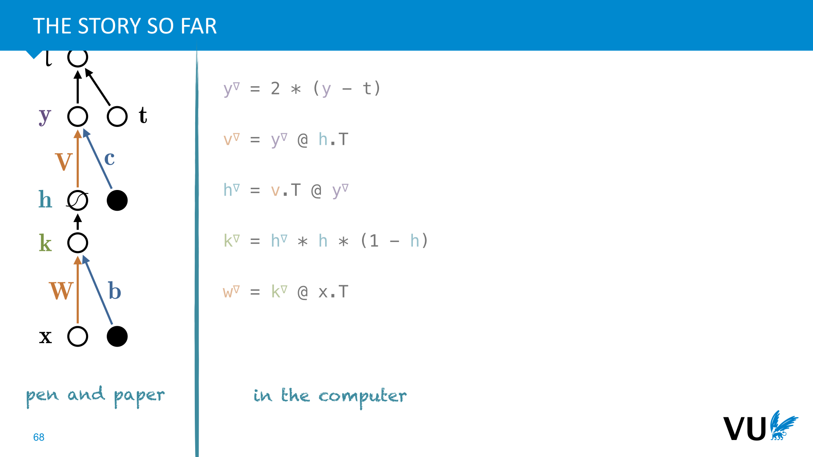

            <figcaption>
            
This is what we’ve done so far. We draw our network on pen and paper, we work out all the derivatives, vectorize them, and then we write down what we’ve worked out with pen and paper. 

            </figcaption>
       </section>

       <section id="slide-069">
            <a class="slide-link" href="https://dlvu.github.io/backpropagation#slide-069" title="Link to this slide.">link here</a>
            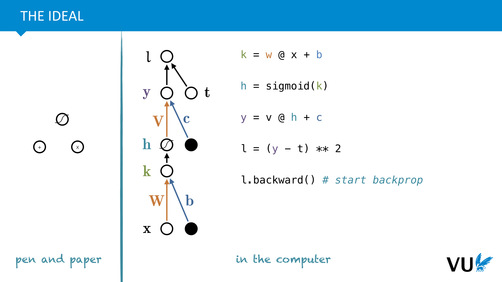

            <figcaption>
            
This is what we want to achieve. We work out on pen and paper the <em>local </em>derivatives of various <em>modules</em>, and then we chain these modules together in a computation graph <em>in our code</em>. The computer keeps the graph in memory, and can automatically work out the backpropagation.

            </figcaption>
       </section>

       <section id="slide-070" class="anim">
            <a class="slide-link" href="https://dlvu.github.io/backpropagation#slide-070" title="Link to this slide.">link here</a>
            

            <figcaption>
            
Here is the key idea that will make this possible.  

Whenever we work out a gradient, as we did in the previous video, we always look at the node above the one for which we're computing the gradient, and use the multivariate chain rule to split the gradient in two. In this case, we are working out the gradient for <strong>W</strong> and we apply the multivariate chain to break that gradient into the gradient for k and the derivatives of <strong>k</strong> with respect to <strong>W</strong>. 

The key idea, that powers automatic differentiation is that <strong>once we have k</strong>∇<strong>, we no longer care about anything else that happens </strong><em>above</em><strong> k in our computation graph</strong>. All we need is <strong>k</strong>∇ and we can work out <strong>W</strong>∇ nabla.

            </figcaption>
            click image for animation
       </section>

       <section id="slide-071">
            <a class="slide-link" href="https://dlvu.github.io/backpropagation#slide-071" title="Link to this slide.">link here</a>
            

            <figcaption>
            

            </figcaption>
       </section>

       <section id="slide-072" class="anim">
            <a class="slide-link" href="https://dlvu.github.io/backpropagation#slide-072" title="Link to this slide.">link here</a>
            

            <figcaption>
            
This kind of algorithm is called automatic differentiation. What we’ve been doing so far is called <strong>backward, or </strong><em>reverse mode</em><strong> automatic differentiation</strong>. This is efficient if you have few output nodes. Note that if we had two output nodes, we’d need to do a separate backward pass for each. 

If you have few inputs, it’s more efficient to start with the inputs and apply the chain rule working forward. This is called forward mode automatic differentiation. 

Since we assume we only have one output node (where the gradient computation is concerned), we will always use reverse mode in deep learning. 

            </figcaption>
            click image for animation
       </section>

       <section id="slide-073">
            <a class="slide-link" href="https://dlvu.github.io/backpropagation#slide-073" title="Link to this slide.">link here</a>
            

            <figcaption>
            
To make this idea precise, and applicable to as broad a range of functions as possible, we'll need to set up a few ingredients. Our values with be tensors: scalars, vectors, matrices, or their higher-dimensional analogues. 

We then build computation graphs out of operations

            </figcaption>
       </section>

       <section id="slide-074" class="anim">
            <a class="slide-link" href="https://dlvu.github.io/backpropagation#slide-074" title="Link to this slide.">link here</a>
            

            <figcaption>
            
The basic datastructure of our system will be the tensor. A tensor is a generic name for family of datastructures that includes a scalar, a vector, a matrix and so on.  

There is no good way to visualize a 4-dimensional structure. We will occasionally use this form to indicate that there is a fourth dimension along which we can also index the tensor. 

We will assume that whatever data we work with (images, text, sounds), will in some way be encoded into one or more tensors, before it is fed into our system. Let’s look at some examples. 

            </figcaption>
            click image for animation
       </section>

       <section id="slide-075" class="anim">
            <a class="slide-link" href="https://dlvu.github.io/backpropagation#slide-075" title="Link to this slide.">link here</a>
            

            <figcaption>
            
A simple dataset, with numeric features can simply be represented as a matrix. For the labels, we usually create a separate corresponding vector for the labels. 

Any categoric features or labels should be converted to numeric features (normally by one-hot coding). 

            </figcaption>
            click image for animation
       </section>

       <section id="slide-076">
            <a class="slide-link" href="https://dlvu.github.io/backpropagation#slide-076" title="Link to this slide.">link here</a>
            

            <figcaption>
            
Images can be represented as 3-tensors. In an RGB image, the color of a single pixel is represented using three values between 0 and 1 (how red it is, how green it is and how blue it is). This means that an RGB image can be thought of as a stack of three color channels, represented by matrices. 

This stack forms a 3-tensor.

            </figcaption>
       </section>

       <section id="slide-077">
            <a class="slide-link" href="https://dlvu.github.io/backpropagation#slide-077" title="Link to this slide.">link here</a>
            

            <figcaption>
            
If we have a dataset of images, we can represent this as a 4-tensor, with dimensions indexing the instances, their width, their height and their color channels respectively. Below is a snippet of code showing that when you load the CIFAR10 image data in Keras, you do indeed get a 4-tensor like this. 

There is no agreed standard ordering for the dimensions in a batch of images. Tensorflow and Keras use (batch, height, width, channels), whereas Pytorch uses (batch, channels, height, width).  

(You can remember the latter with the mnemonic “<strong>bach</strong>elor <strong>ch</strong>o<strong>w</strong>”.)

            </figcaption>
       </section>

       <section id="slide-078">
            <a class="slide-link" href="https://dlvu.github.io/backpropagation#slide-078" title="Link to this slide.">link here</a>
            

            <figcaption>
            

            </figcaption>
       </section>

       <section id="slide-079">
            <a class="slide-link" href="https://dlvu.github.io/backpropagation#slide-079" title="Link to this slide.">link here</a>
            

            <figcaption>
            
We’ll need to be a little mode precise in our notations. From now on we’ll draw computation graphs with both the operations and the values as nodes. The graph is always bipartite and directed. A tensor node is connected to the ops for which it is an input, and an operation node is connected to the tensor nodes that it produces as outputs. 
<aside    >There doesn’t seem to be a standard visual notation. This is what we'll use in most of this course. </aside><aside    >In Tensorflow operations are called ops, and in Pytorch they’re called functions. </aside><aside    ></aside>
            </figcaption>
       </section>

       <section id="slide-080">
            <a class="slide-link" href="https://dlvu.github.io/backpropagation#slide-080" title="Link to this slide.">link here</a>
            

            <figcaption>
            
As an example, here is our MLP expressed in our new notation.  

Just as before, it’s up to us how <em>granular</em> we make the computation. for instance, we wrap the whole computation of the loss in a single operation, but we could also separate out the subtraction and the squaring. 

You may note that this graph is not directed or bipartite everywhere. This is just visual shorthand. Occasionally, we will omit the direction of an edge for clarity, or omit intermediate nodes when it's clear that a tensor node or op node should be there. The actual computation graph we are describing in such cases is always bipartite and entirely directed.

            </figcaption>
       </section>

       <section id="slide-081">
            <a class="slide-link" href="https://dlvu.github.io/backpropagation#slide-081" title="Link to this slide.">link here</a>
            

            <figcaption>
            
We hold on to the same assumptions we had before. They are required for automatic differentiation to work efficiently.

            </figcaption>
       </section>

       <section id="slide-082">
            <a class="slide-link" href="https://dlvu.github.io/backpropagation#slide-082" title="Link to this slide.">link here</a>
            

            <figcaption>
            
To store a computation graph in memory, we need three classes of objects. The first two are shown here. 

A TensorNode objects holds the tensor value at that node. It holds the gradient of the tensor at that node (to be filled by the backpropagation algorithm) and it holds a pointer to the Operation Node that produced it (which can be null for leaf nodes). 

An OpNode object represents an<em> instance</em> of a particular operation being applied in the computation. It stores the particular op being used (multiplication, additions, etc) and the inputs and the outputs. In the MLP example, we perform several matrix mulitplications: each of these becomes a separate OpNode in the computation graph, all recording an instance of the matrix multiplication operation  being used. Each of them refers to a single object representing this operation. 

This is the third class: the Op. 

            </figcaption>
       </section>

       <section id="slide-083" class="anim">
            <a class="slide-link" href="https://dlvu.github.io/backpropagation#slide-083" title="Link to this slide.">link here</a>
            

            <figcaption>
            
If the difference between an Op and an OpNode is unclear consider that a single neural network may apply, say, a sigmoid operation many times. The Op object for the sigmoid defines how to compute the sigmoid operations (and its gradient). Then, for each place in the computation graph where the sigmoid is applied, we create a separate OpNode object which references the inputs and outputs specific to that application of the sigmoid, together with a single pointer to the single sigmoid Op. This is where we actually define how to perform the computation. 

An Op is defined by two functions: forward and backward.  

The function forward computes the outputs given the inputs (just like any function in any programming language). 

The function backward takes the gradient <em>for</em> the outputs (the gradient of the loss wrt to the outputs) and produces the gradient <em>for</em> the inputs. 

Both functions are also given a context object. This is a data structure (a dictionary or a list) to which the forward can add any value which it needs to save for the backward, we'll see an example of this later. 
<aside    >Note that the backward function does not compute the local derivative as we did in the scalar backpropagation: it computes the accumulated gradient of the loss over the inputs (given the accumulated gradient of the loss over the outputs).</aside><aside    ></aside>
            </figcaption>
            click image for animation
       </section>

       <section id="slide-084">
            <a class="slide-link" href="https://dlvu.github.io/backpropagation#slide-084" title="Link to this slide.">link here</a>
            

            <figcaption>
            
We'll see how to implement ops later. First, let's see how all this works put together. Using Ops, OpNodes and TensorNodes, we can build a computation graph (again, more on how we do that later). The OpNodes reference the TensorNodes that are their inputs and outputs and they reference the Ops that contain the actual code for their forward and backward. 

Once we have this computation graph, computing our model output and loss and performing backpropagation becomes almost trivially easy. We simply traverse the tree forwards from the inputs to the loss calling all the forward functions, and then backwards from the loss to the inputs, calling all the backwards functions.  

The only thing we need to keep track of is that when we call forward() on an OpNode's Op, all the ancestors of that OpNode have been called, so that we have all its inputs. And, when we traverse the tree backward, when we call backward() on an OpNode's Op that all the descendants have been called so that we have the gradients for all of its outputs. 
<aside    >Note the last point: some TensorNodes will be inputs to multiple operation nodes. By the multivariate chain rule, we should sum the gradients they get from all the OpNodes they feed into. We can achieve this easily by just initializing the gradients to zero and  adding the gradients we compute to any that are already there.</aside><aside    ></aside>
            </figcaption>
       </section>

       <section id="slide-085">
            <a class="slide-link" href="https://dlvu.github.io/backpropagation#slide-085" title="Link to this slide.">link here</a>
            

            <figcaption>
            
All this assumes that the computation graph is already there. But how do we tell the system what our computation graph should be? It turns out that the nicest way to do this is to describe the computation itself in code. This makes sense: code is a language explicitly for describing computations, so it would be nice to simply describe a computation as a piece of Python code, and have the system build a computation graph for us. 

This can be done through the magic of <em>operator overloading</em>. We simply change change what operators like * and + mean, when they are applied to TensorNode objects. There are two strategies common: lazy and eager execution.

            </figcaption>
       </section>

       <section id="slide-086" class="anim">
            <a class="slide-link" href="https://dlvu.github.io/backpropagation#slide-086" title="Link to this slide.">link here</a>
            

            <figcaption>
            
Here’s one example of how a lazy execution API might look. 

Note that when we’re building the graph, we’re not telling it which values to put at each node. We’re just defining the<em> shape</em> of the computation, but not performing the computation itself. 

When we create the model, we define which nodes are the input nodes, and which node is the loss node. We then provide the input values and perform the forward and backward passes. 

            </figcaption>
            click image for animation
       </section>

       <section id="slide-087">
            <a class="slide-link" href="https://dlvu.github.io/backpropagation#slide-087" title="Link to this slide.">link here</a>
            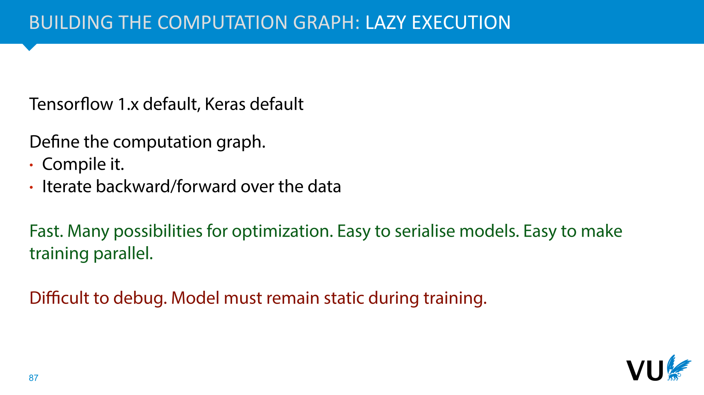

            <figcaption>
            
In lazy execution, which was the norm during the early years of deep learning, we build the computation graph, but we don’t yet specify the values on the tensor nodes. When the computation graph is finished, we define the data, and we feed it through. 

This is fast since the deep learning system can optimize the graph structure during compilation, but it makes models hard to debug: if something goes wrong during training, you probably made a mistake while defining your graph, but you will only get an error while passing data through it. The resulting stack trace will never point to the part of your code where you made the mistake.

            </figcaption>
       </section>

       <section id="slide-088" class="anim">
            <a class="slide-link" href="https://dlvu.github.io/backpropagation#slide-088" title="Link to this slide.">link here</a>
            

            <figcaption>
            
In eager mode deep learning systems, we create a node in our computation graph (a TensorNode) by specifying what data it should contain. The result is a tensor object that stores both the data, and the gradient over that data (which will be filled later). 

Here we create the variables a and b. If we now apply an operation to these, for instance to multiply their values, the result is another variable c. Languages like python allow us to <em>overload</em> the * operator it looks like we’re just computing multiplication, but behind the scenes, we are creating a computation graph that records all the computations we’ve done. 

We compute the data stored in c by running the computation immediately, but we also store references to the variables that were used to create c, and the operation that created it. <strong>We create the computation graph on the fly, as we compute the forward pass.</strong> 

Using this graph, we can perform the backpropagation from a given node that we designate as the loss node (node c in this case). We work our way down the graph computing the derivative of each variable with respect to c. At the start the TensorNodes do not have their grad’s filled in, but at the end of the backward, all gradients have been computed. 

Once the gradients have been computed, and the gradient descent step has been performed, we clear the computation graph.<strong> It's rebuilt from scratch for every forward pass.</strong> 

            </figcaption>
            click image for animation
       </section>

       <section id="slide-089">
            <a class="slide-link" href="https://dlvu.github.io/backpropagation#slide-089" title="Link to this slide.">link here</a>
            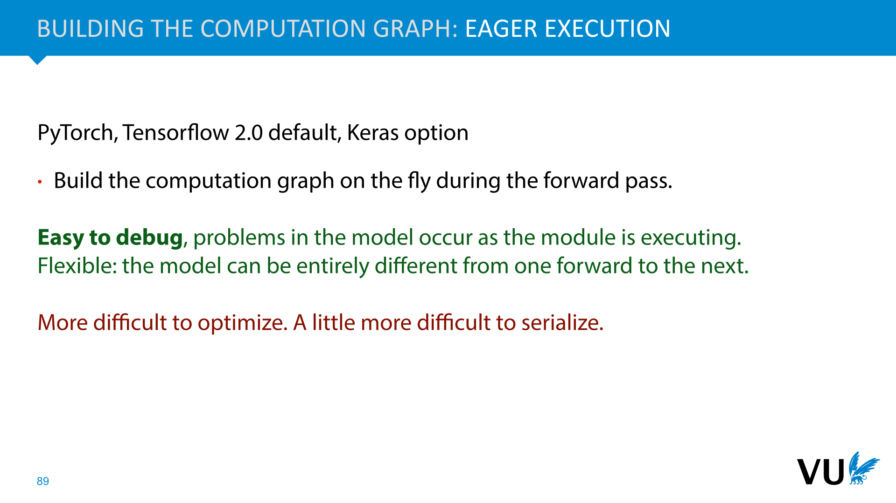

            <figcaption>
            
In eager execution, we simply execute all operations immediately on the data, and collect the computation graph on the fly. We then execute the backward and ditch the graph we’ve collected. 

This makes debugging much easier, and allows for more flexibility in what we can do in the forward pass. It can, however be a little difficult to wrap your head around. Since we’ll be using pytorch later in the course, we’ll show you how eager execution works step by step.

            </figcaption>
       </section>

       <section id="slide-090">
            <a class="slide-link" href="https://dlvu.github.io/backpropagation#slide-090" title="Link to this slide.">link here</a>
            

            <figcaption>
            

            </figcaption>
       </section>

       <section id="slide-091" class="anim">
            <a class="slide-link" href="https://dlvu.github.io/backpropagation#slide-091" title="Link to this slide.">link here</a>
            

            <figcaption>
            
The final ingredient we need is a large collection of operations with backward functions worked out. We’ll show how to do this for a few examples. 

First, an operation that sums two matrices element-wise.  

The recipe is the same as we saw in the last part:  

Write out the scalar derivative for a single element.  

Use the multivariate chain rule to sum over all outputs. 

Vectorize the result. 

Note that when we draw the computation graph, we can think of everything that happens between S and l as a single module: we are already given the gradient of l over S, so it doesn’t matter if it’s one operation or a million.  

Again, we can draw the computation graph at any granularity we like: very fine individual operations like summing and multiplying or very coarse-grained operations like entire NNs.  

For this operation, the context object is not needed, we can perform the backward pass without remembering anything about the forward pass.

            </figcaption>
            click image for animation
       </section>

       <section id="slide-092">
            <a class="slide-link" href="https://dlvu.github.io/backpropagation#slide-092" title="Link to this slide.">link here</a>
            

            <figcaption>
            
To finish up, we’ll show you the implementation of some more operations. You’ll be asked to do a few of these in the second homework exercise. 

            </figcaption>
       </section>

       <section id="slide-093" class="anim">
            <a class="slide-link" href="https://dlvu.github.io/backpropagation#slide-093" title="Link to this slide.">link here</a>
            

            <figcaption>
            
This is a pretty simple derivation, but it shows two things: 

We can easily do a backward over functions that output high dimensional tensors, but we should sum over all dimensions of the output when we apply the multivariate chain rule. 

The backward function illustrates the utility of <strong>the context object</strong>. To work out the backward, we need to know the original input. We could just have stored that for every operation, but as we see here, we’ve done part of the computation already in the forward (and in other backwards, like the sum we saw earlier, the inputs <em>aren’t</em> necessary at all). If we give the operation control over what information it wants to store for the backward pass, we are flexible to optimize for efficiency.

            </figcaption>
            click image for animation
       </section>

       <section id="slide-094" class="anim">
            <a class="slide-link" href="https://dlvu.github.io/backpropagation#slide-094" title="Link to this slide.">link here</a>
            

            <figcaption>
            
Note that the output is a vector, because we’ve summed out one dimension. Therefore, when we apply the multivariate chain rule, we sum over only one dimension. 

This is a sum like the earlier example, so we don’t need to save any tensor values from the forward pass. However, we do need to remember the size of the dimension we summed out. Therefore, we use the context to store this information. The None keyword in the slice in the last line  adds a singleton dimension: it turns the shape from (n) into (n, 1) .  
<aside    >The expand function we use here is not available in numpy, but it does exist in pytorch. In numpy we can use repeat.</aside><aside    ></aside>
            </figcaption>
            click image for animation
       </section>

       <section id="slide-095" class="anim">
            <a class="slide-link" href="https://dlvu.github.io/backpropagation#slide-095" title="Link to this slide.">link here</a>
            

            <figcaption>
            
Our final example includes a constant argument. We take a scalar, and expand it to a matrix of the given size, filled with the value x. 

In this case, we do not care about the gradient for size (and even if we did, integer values don’t yield meaningful gradients without some extra work). We consider this a constant. 

This can be done in different ways. In pytorch, you return None for the gradient for a constant (as we’ve shown here).  

In our toy system (vugrad), we consider all <em>keyword arguments</em> constants.

            </figcaption>
            click image for animation
       </section>

       <section id="slide-096">
            <a class="slide-link" href="https://dlvu.github.io/backpropagation#slide-096" title="Link to this slide.">link here</a>
            

            <figcaption>
            

            </figcaption>
       </section>

       <section id="slide-097">
            <a class="slide-link" href="https://dlvu.github.io/backpropagation#slide-097" title="Link to this slide.">link here</a>
            

            <figcaption>
            
Most deep learning frameworks also have a way of combining model parameters and computation into a single unit, often called a<strong> module</strong> or a <strong>layer</strong>. 

In this case a Linear module (as it is called in Pytorch) takes care of implementing the computation of a single layer of a neural network (sans activation) and of remembering the weights and the bias. 

Modules have a <em>forward </em>function which performs the computation of the layer, but they <em>don’t </em>have a <strong>backward</strong> function. They just chain together operations, and the backpropagation calls the backwards on the operations. In other words, it doesn’t matter to the backpropagation whether we use a module or apply all the operations by hand. 

            </figcaption>
       </section>

       <section id="slide-098">
            <a class="slide-link" href="https://dlvu.github.io/backpropagation#slide-098" title="Link to this slide.">link here</a>
            

            <figcaption>
            
Which completes the picture we wanted to create: a system where all we have to do is perform some computations on some tensors, just like we would do in numpy, and all the building of computation graphs and all the backpropagating is handled for us automatically.  

So long as the forward and backward have been defined for all the operations we want to compute, either by us, or as part of a standard library, the system will do the rest.

            </figcaption>
       </section>

       <section id="slide-099">
            <a class="slide-link" href="https://dlvu.github.io/backpropagation#slide-099" title="Link to this slide.">link here</a>
            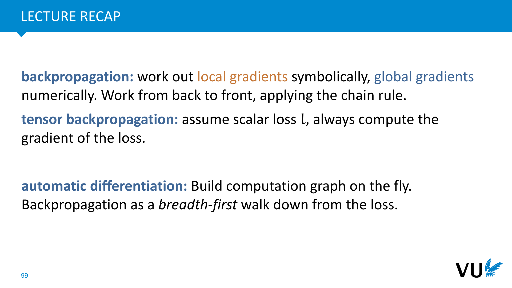

            <figcaption>
            
So 

            </figcaption>
       </section>

       <section id="slide-100">
            <a class="slide-link" href="https://dlvu.github.io/backpropagation#slide-100" title="Link to this slide.">link here</a>
            

            <figcaption>
            

            </figcaption>
       </section>

       <section id="slide-101">
            <a class="slide-link" href="https://dlvu.github.io/backpropagation#slide-101" title="Link to this slide.">link here</a>
            

            <figcaption>
            
 

These slides were cut to lighten the amount of material covered in this lecture. They're not part of the exam material, but the information is still useful if you're working with DL systems. It’s good to skim them quickly, so you know to come back here when you encounter any of the issues we describe here.

            </figcaption>
       </section>

       <section id="slide-102" class="anim">
            <a class="slide-link" href="https://dlvu.github.io/backpropagation#slide-102" title="Link to this slide.">link here</a>
            

            <figcaption>
            
It’s important to realize that even though we think of tensors as multidimensional arrays, in memory, they are necessarily laid out as a single line of numbers. The Tensor object knows the shape that these numbers should take, and uses that to compute whatever we need it to compute. 

We can do this in two ways: scanning along the rows first and then the columns is called <strong>row-major ordering</strong>. This is what numpy and pytorch both do. The other option is (unsurprisingly) called column major ordering. In higher dimensional tensors, the dimensions further to the right are always scanned before the dimensions to their left. 

Imagine looping over all elements in a tensor with shape (a, b, c, d) in four nested loops. If you want to loop over the elements in the order they are in memory, then the loop over d would be the innermost loop, then c, then b and then a. 

This allows us to perform some operations very cheaply, <strong>but we have to be careful</strong>. 

            </figcaption>
            click image for animation
       </section>

       <section id="slide-103">
            <a class="slide-link" href="https://dlvu.github.io/backpropagation#slide-103" title="Link to this slide.">link here</a>
            

            <figcaption>
            
Here is one such cheap operation: a reshape. This changes the shape of the tensor, but not the data. 

To do this cheaply, we can create a new tensor object with the same data as the old one, but with a different shape.

            </figcaption>
       </section>

       <section id="slide-104">
            <a class="slide-link" href="https://dlvu.github.io/backpropagation#slide-104" title="Link to this slide.">link here</a>
            

            <figcaption>
            

            </figcaption>
       </section>

       <section id="slide-105" class="anim">
            <a class="slide-link" href="https://dlvu.github.io/backpropagation#slide-105" title="Link to this slide.">link here</a>
            

            <figcaption>
            
Imagine that we wanted to scale a dataset of images in such way that over the whole dataset, each color channel has a maximal value of 1 (independent of the other channels). 

To do this, we need a 3-vector of the maxima per color channel. Pytorch only allows us to take the maximum in one direction, but we can reshape the array so that all the directions we’re not interested in are collapsed into one dimension. 

Afterwards, we can reverse the reshape to get our image dataset back. 

We have to be careful: the last three lines in this slide form a perfectly valid reshape, but the  c dimension in the result does<em> not</em> contain our color values.  

In general, you’re fine if you<strong> collapse dimensions that are next to each other</strong>, and uncollapse them <em>in the same order.</em>

<em></em>

            </figcaption>
            click image for animation
       </section>

       <section id="slide-106" class="anim">
            <a class="slide-link" href="https://dlvu.github.io/backpropagation#slide-106" title="Link to this slide.">link here</a>
            

            <figcaption>
            
A transpose operation can also be achieved cheaply. In this case, we just keep a reference to the old tensor, and whenever a user requests the element (i, j) we return (j, i) from the original tensor. 

NB: This isn’t precisely how pytorch does this, but the effect is the same: we get a transposed tensor in constant time, by viewing the same data in memory in a different way.

            </figcaption>
            click image for animation
       </section>

       <section id="slide-107" class="anim">
            <a class="slide-link" href="https://dlvu.github.io/backpropagation#slide-107" title="Link to this slide.">link here</a>
            

            <figcaption>
            
Even slicing can be accomplished by referring to the original data.

            </figcaption>
            click image for animation
       </section>

       <section id="slide-108">
            <a class="slide-link" href="https://dlvu.github.io/backpropagation#slide-108" title="Link to this slide.">link here</a>
            

            <figcaption>
            
For some operations, however, the data needs to be contiguous. That is, the tensor data in memory needs to be one uninterrupted string of data in row major ordering with no gaps. If this isn’t the case, pytorch will throw an exception like this. 

You can fix this by calling .contiguous() on the tensor. The price you pay is the linear time and space complexity of copying the data.

            </figcaption>
       </section>

</article>
