<nav class="menu">
    <ul>
        <li class="home"><a href="/">Home</a></li>
        <li class="name">CNNs</li>
        <li class="pdf"><a href="https://dlvu.github.io/pdfs/lecture03.cnns.annotated.pdf">PDF</a></li>
    </ul>
</nav>

<article class="slides">

       <section id="slide-001">
            <a class="slide-link" href="https://dlvu.github.io/cnns#slide-001" title="Link to this slide.">link here</a>
            

            <figcaption>
            
<strong><a href="|section|Introduction|
">|section|Introduction|
</a></strong>

<strong><a href="|video|https://www.youtube.com/embed/rOuF5r5GduQ?si=SmwIyT1p51eMwwfR|
">|video|https://www.youtube.com/embed/rOuF5r5GduQ?si=SmwIyT1p51eMwwfR|
</a></strong>
 
<strong><a href="Welcome to lecture 3 of the deep learning course. Today we will be talking about convolutional networks which are networks responsible for several recent breakthroughs in deep learning.
">Welcome to lecture 3 of the deep learning course. Today we will be talking about convolutional networks which are networks responsible for several recent breakthroughs in deep learning.
</a></strong>
 
            </figcaption>
       </section>

       <section id="slide-002">
            <a class="slide-link" href="https://dlvu.github.io/cnns#slide-002" title="Link to this slide.">link here</a>
            

            <figcaption>
            
<strong><a href="In the first part we will talk about where commercial architectures are needed. 
">In the first part we will talk about where commercial architectures are needed. 
</a></strong>

<strong><a href="In the second part I will be talking about one dimensional convolutional networks and explain the basic concepts.
">In the second part I will be talking about one dimensional convolutional networks and explain the basic concepts.
</a></strong>

<strong><a href="In part three we'll scale up to more dimensions (3D, 4D, etc.) and discuss some of the theory.
">In part three we'll scale up to more dimensions (3D, 4D, etc.) and discuss some of the theory.
</a></strong>

<strong><a href="In part four we will look at some example architectures 
">In part four we will look at some example architectures 
</a></strong>
 
            </figcaption>
       </section>

       <section id="slide-003">
            <a class="slide-link" href="https://dlvu.github.io/cnns#slide-003" title="Link to this slide.">link here</a>
            

            <figcaption>
            
            </figcaption>
       </section>

       <section id="slide-004">
            <a class="slide-link" href="https://dlvu.github.io/cnns#slide-004" title="Link to this slide.">link here</a>
            

            <figcaption>
            
<strong><a href="Of the recent breakthroughs in deep learning, the ones which are often visible are those related to images. For example, these are three examples where a deep learning system that includes some convolutional neural networks is able to create a description of an image. So basically the system receives an image and then produces a caption for that image. For example the first one you see a football player and then the system is able to generate a sentence like “a soccer player is kicking a soccer ball”. These kinds of systems receive a lot of training data (in the form of images with their captions) and generate output on images they have never seen before.
">Of the recent breakthroughs in deep learning, the ones which are often visible are those related to images. For example, these are three examples where a deep learning system that includes some convolutional neural networks is able to create a description of an image. So basically the system receives an image and then produces a caption for that image. For example the first one you see a football player and then the system is able to generate a sentence like “a soccer player is kicking a soccer ball”. These kinds of systems receive a lot of training data (in the form of images with their captions) and generate output on images they have never seen before.
</a></strong>
 
            </figcaption>
       </section>

       <section id="slide-005">
            <a class="slide-link" href="https://dlvu.github.io/cnns#slide-005" title="Link to this slide.">link here</a>
            

            <figcaption>
            
<strong><a href="A second example is semantic image segmentation. The system is able to determine what certain parts of the picture depict.
">A second example is semantic image segmentation. The system is able to determine what certain parts of the picture depict.
</a></strong>
 
            </figcaption>
       </section>

       <section id="slide-006">
            <a class="slide-link" href="https://dlvu.github.io/cnns#slide-006" title="Link to this slide.">link here</a>
            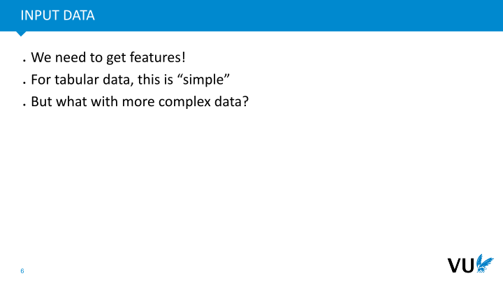

            <figcaption>
            
<strong><a href="When we look back at our basic deep learning knowledge we have a bit of an issue: we have that image coming in but what we need for our deep learning model is a set of features. For tabular data (meaning the typical table) this would be simple but what do we do with more complex data like an image?
">When we look back at our basic deep learning knowledge we have a bit of an issue: we have that image coming in but what we need for our deep learning model is a set of features. For tabular data (meaning the typical table) this would be simple but what do we do with more complex data like an image?
</a></strong>
 
            </figcaption>
       </section>

       <section id="slide-007">
            <a class="slide-link" href="https://dlvu.github.io/cnns#slide-007" title="Link to this slide.">link here</a>
            

            <figcaption>
            
<strong><a href="The first thing we should realize is that an image has a width, has a depth but also has colors. 
">The first thing we should realize is that an image has a width, has a depth but also has colors. 
</a></strong>
 
            </figcaption>
       </section>

       <section id="slide-008">
            <a class="slide-link" href="https://dlvu.github.io/cnns#slide-008" title="Link to this slide.">link here</a>
            

            <figcaption>
            
<strong><a href="We can split an image into so-called color-channels. You've probably already heard about RGB (red green blue). We can separate the image such that we have these three channels separate from each other.
">We can split an image into so-called color-channels. You've probably already heard about RGB (red green blue). We can separate the image such that we have these three channels separate from each other.
</a></strong>
 
            </figcaption>
       </section>

       <section id="slide-009">
            <a class="slide-link" href="https://dlvu.github.io/cnns#slide-009" title="Link to this slide.">link here</a>
            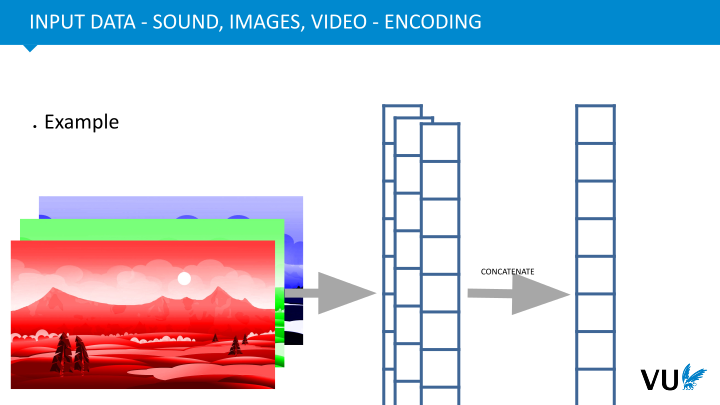

            <figcaption>
            
<strong><a href="We can then look at each of those colour channels and depict their intensity in the form of a vector. How intense is the intensity of the red colour channel at this pixel? We could then in principle concatenate all these vectors together to form one long vector representing that image.
">We can then look at each of those colour channels and depict their intensity in the form of a vector. How intense is the intensity of the red colour channel at this pixel? We could then in principle concatenate all these vectors together to form one long vector representing that image.
</a></strong>
 
            </figcaption>
       </section>

       <section id="slide-010">
            <a class="slide-link" href="https://dlvu.github.io/cnns#slide-010" title="Link to this slide.">link here</a>
            

            <figcaption>
            
<strong><a href="A problem here is that the input dimensions are very big. That means if we look at this one channel of an image, for example the image in the previous slide, we have two million features. Now we have three channels so that would already be six million. Obviously now one second of sound for example sampled at 44 kilohertz would similarly lead to 44 000 features. For videos, you have sound and a moving image leading to an even greater number of features.
">A problem here is that the input dimensions are very big. That means if we look at this one channel of an image, for example the image in the previous slide, we have two million features. Now we have three channels so that would already be six million. Obviously now one second of sound for example sampled at 44 kilohertz would similarly lead to 44 000 features. For videos, you have sound and a moving image leading to an even greater number of features.
</a></strong>
 
            </figcaption>
       </section>

       <section id="slide-011">
            <a class="slide-link" href="https://dlvu.github.io/cnns#slide-011" title="Link to this slide.">link here</a>
            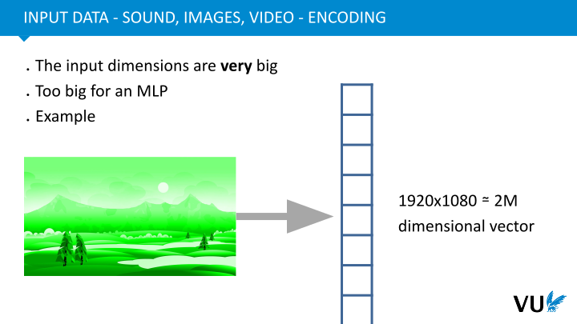

            <figcaption>
            
<strong><a href="Now, the problem is that this very large number of features is also just too big for our normal multi layer perceptron. The example before would lead to a 2 million dimensional vector. 
">Now, the problem is that this very large number of features is also just too big for our normal multi layer perceptron. The example before would lead to a 2 million dimensional vector. 
</a></strong>
 
            </figcaption>
       </section>

       <section id="slide-012">
            <a class="slide-link" href="https://dlvu.github.io/cnns#slide-012" title="Link to this slide.">link here</a>
            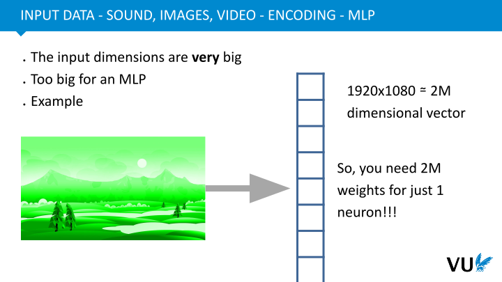

            <figcaption>
            
<strong><a href="If we want to attach a neuron to this, so we're going to make first, say, a hidden layer of our neural network, that neuron also needs 2 million weights. That neuron also needs memory space to store the gradients. And then on top of that, you probably want more than one neuron, you probably want several hidden layers and you want to have more neurons per layer. This requires an extremely large amount of weights.
">If we want to attach a neuron to this, so we're going to make first, say, a hidden layer of our neural network, that neuron also needs 2 million weights. That neuron also needs memory space to store the gradients. And then on top of that, you probably want more than one neuron, you probably want several hidden layers and you want to have more neurons per layer. This requires an extremely large amount of weights.
</a></strong>
 
            </figcaption>
       </section>

       <section id="slide-013">
            <a class="slide-link" href="https://dlvu.github.io/cnns#slide-013" title="Link to this slide.">link here</a>
            

            <figcaption>
            
<strong><a href="This approach is simply not feasible in practice.
">This approach is simply not feasible in practice.
</a></strong>
 
            </figcaption>
       </section>

       <section id="slide-014">
            <a class="slide-link" href="https://dlvu.github.io/cnns#slide-014" title="Link to this slide.">link here</a>
            

            <figcaption>
            
<strong><a href="Besides just having too many weights this system would also not converge because you have to train all those weights. Constraints in GPU memory make this infeasible as well. 
">Besides just having too many weights this system would also not converge because you have to train all those weights. Constraints in GPU memory make this infeasible as well. 
</a></strong>
 
            </figcaption>
       </section>

       <section id="slide-015">
            <a class="slide-link" href="https://dlvu.github.io/cnns#slide-015" title="Link to this slide.">link here</a>
            

            <figcaption>
            
<strong><a href="One notable observation about networks of this type is that, aside from the size argument, the features within this dataset exhibit a level of interdependence; they possess a certain locality. This implies that when two pixels are adjacent to each other, there is inherent meaning in their proximity. In contrast, when you consider a Multi-Layer Perceptron (MLP), it does not take into account this spatial ordering. Whether the information is presented with one note above another or in a mixed configuration, the MLP does not retain the sequence or order of the notes.
">One notable observation about networks of this type is that, aside from the size argument, the features within this dataset exhibit a level of interdependence; they possess a certain locality. This implies that when two pixels are adjacent to each other, there is inherent meaning in their proximity. In contrast, when you consider a Multi-Layer Perceptron (MLP), it does not take into account this spatial ordering. Whether the information is presented with one note above another or in a mixed configuration, the MLP does not retain the sequence or order of the notes.
</a></strong>
 
            </figcaption>
       </section>

       <section id="slide-016">
            <a class="slide-link" href="https://dlvu.github.io/cnns#slide-016" title="Link to this slide.">link here</a>
            

            <figcaption>
            
<strong><a href="All right, let's recap what we've observed. We've encountered an image and successfully devised a digital representation for it in memory. However, the MLP we initially employed doesn't prove to be a viable option. It lacks scalability and effectiveness. To address this issue and facilitate deep learning for this data type, we'll take a systematic approach. We'll begin by exploring this in 1D, gaining an intuitive understanding. Subsequently, we'll formalize the process and transition to 2D. Our ultimate goal is to apply the same principles to higher dimensions, such as images.
">All right, let's recap what we've observed. We've encountered an image and successfully devised a digital representation for it in memory. However, the MLP we initially employed doesn't prove to be a viable option. It lacks scalability and effectiveness. To address this issue and facilitate deep learning for this data type, we'll take a systematic approach. We'll begin by exploring this in 1D, gaining an intuitive understanding. Subsequently, we'll formalize the process and transition to 2D. Our ultimate goal is to apply the same principles to higher dimensions, such as images.
</a></strong>
 
            </figcaption>
       </section>

       <section id="slide-017">
            <a class="slide-link" href="https://dlvu.github.io/cnns#slide-017" title="Link to this slide.">link here</a>
            

            <figcaption>
            
<strong><a href="|section|Conv1D (a)|
">|section|Conv1D (a)|
</a></strong>

<strong><a href="|video|https://www.youtube.com/embed/VQqayqUCTwM?si=-DDZ-qZvORX3zTdQ|
">|video|https://www.youtube.com/embed/VQqayqUCTwM?si=-DDZ-qZvORX3zTdQ|
</a></strong>
  
<strong><a href="Welcome to part two of the convolutional neural network lecture. In this part we will be looking at one dimensional convolutions and try to build an intuition for them.
">Welcome to part two of the convolutional neural network lecture. In this part we will be looking at one dimensional convolutions and try to build an intuition for them.
</a></strong>
 
            </figcaption>
       </section>

       <section id="slide-018">
            <a class="slide-link" href="https://dlvu.github.io/cnns#slide-018" title="Link to this slide.">link here</a>
            

            <figcaption>
            
<strong><a href="A sound wave is the superposition of sine waves.
">A sound wave is the superposition of sine waves.
</a></strong>

<strong><a href="With deep learning, we can try to answer hard questions like the ones mentioned here.
">With deep learning, we can try to answer hard questions like the ones mentioned here.
</a></strong>

<strong><a href="The central example we'll consistently refer to in the following slides revolves around a one-dimensional sound wave. Our objective is to harness the power of deep learning to address complex inquiries related to sound. For instance, when presented with a particular sound wave, like the one displayed, we could seek to determine the musical style it embodies. Additionally, we could discern whether the user enjoys this music, rendering the need for a classification model. Essentially, this is a classification problem: given a piece of music, we classify it into clusters.
">The central example we'll consistently refer to in the following slides revolves around a one-dimensional sound wave. Our objective is to harness the power of deep learning to address complex inquiries related to sound. For instance, when presented with a particular sound wave, like the one displayed, we could seek to determine the musical style it embodies. Additionally, we could discern whether the user enjoys this music, rendering the need for a classification model. Essentially, this is a classification problem: given a piece of music, we classify it into clusters.
</a></strong>

<strong><a href="Conversely, there are regression tasks, like discerning the beat or rhythm underlying the music. Furthermore, we can assess the pleasantness of the music, typically quantified on a scale from one to 100.
">Conversely, there are regression tasks, like discerning the beat or rhythm underlying the music. Furthermore, we can assess the pleasantness of the music, typically quantified on a scale from one to 100.
</a></strong>
 
            </figcaption>
       </section>

       <section id="slide-019">
            <a class="slide-link" href="https://dlvu.github.io/cnns#slide-019" title="Link to this slide.">link here</a>
            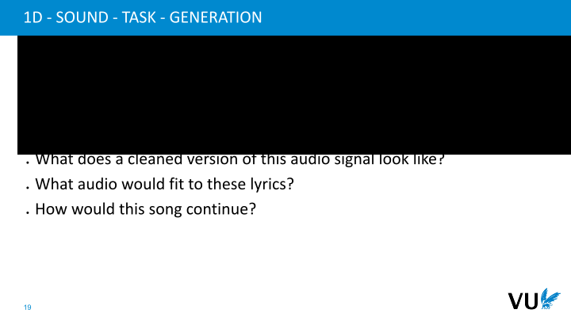

            <figcaption>
            
<strong><a href="Later, with generative modelling, we will go even further. In addition to the conventional classification and regression tasks, we encounter more challenging endeavors, particularly those falling within the realm of generative tasks. These tasks demand a creative response. For instance, when presented with a sound wave, we might ponder, "What would a pristine version of this audio signal sound like?" Alternatively, we might explore, "What audio composition best complements these lyrics?" Or perhaps, we may contemplate, "How should this sound progress, given a brief excerpt from the song?"
">Later, with generative modelling, we will go even further. In addition to the conventional classification and regression tasks, we encounter more challenging endeavors, particularly those falling within the realm of generative tasks. These tasks demand a creative response. For instance, when presented with a sound wave, we might ponder, "What would a pristine version of this audio signal sound like?" Alternatively, we might explore, "What audio composition best complements these lyrics?" Or perhaps, we may contemplate, "How should this sound progress, given a brief excerpt from the song?"
</a></strong>

<strong><a href="In these instances, the objective isn't limited to delivering a simple categorical label, integer, or floating-point number as an answer. Instead, it involves the creation of a more intricate, generative response – akin to crafting a sandwich, in a metaphorical sense.
">In these instances, the objective isn't limited to delivering a simple categorical label, integer, or floating-point number as an answer. Instead, it involves the creation of a more intricate, generative response – akin to crafting a sandwich, in a metaphorical sense.
</a></strong>
 
            </figcaption>
       </section>

       <section id="slide-020">
            <a class="slide-link" href="https://dlvu.github.io/cnns#slide-020" title="Link to this slide.">link here</a>
            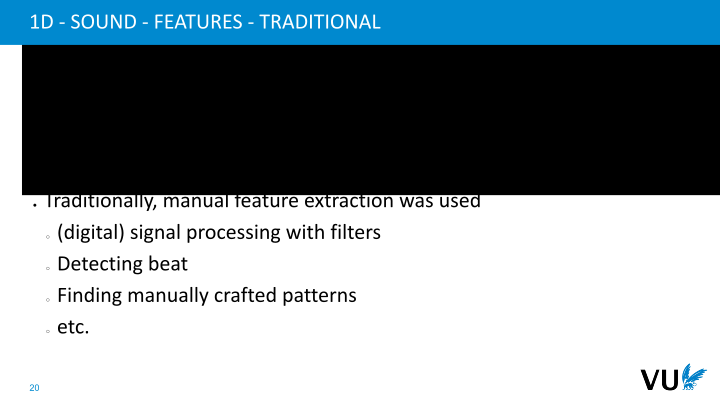

            <figcaption>
            
<strong><a href="Traditionally, addressing these challenges entailed the labor-intensive process of manual feature extraction. This approach involved the creation of digital or standard signal processing filters, which were subsequently applied to the audio data. Such filters were employed for tasks like beat detection and the identification of specific, manually engineered patterns.
">Traditionally, addressing these challenges entailed the labor-intensive process of manual feature extraction. This approach involved the creation of digital or standard signal processing filters, which were subsequently applied to the audio data. Such filters were employed for tasks like beat detection and the identification of specific, manually engineered patterns.
</a></strong>
 
            </figcaption>
       </section>

       <section id="slide-021">
            <a class="slide-link" href="https://dlvu.github.io/cnns#slide-021" title="Link to this slide.">link here</a>
            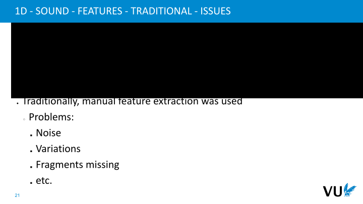

            <figcaption>
            
<strong><a href="However, these approaches are not without their shortcomings. Several challenges emerge in their application. Noise is a significant issue; when the audio signal is contaminated by noise, these methods tend to falter. Additionally, variations in vocal attributes, such as a song performed by a male versus a female, can result in substantially different sounds. Furthermore, scenarios where audio fragments are missing pose a significant challenge, as these filters struggle to perform optimally under such conditions.
">However, these approaches are not without their shortcomings. Several challenges emerge in their application. Noise is a significant issue; when the audio signal is contaminated by noise, these methods tend to falter. Additionally, variations in vocal attributes, such as a song performed by a male versus a female, can result in substantially different sounds. Furthermore, scenarios where audio fragments are missing pose a significant challenge, as these filters struggle to perform optimally under such conditions.
</a></strong>

<strong><a href="In essence, the fundamental problem lies in the fact that the specific features that need to be extracted from the audio are not predetermined. This uncertainty makes it challenging to identify the appropriate set of features for extraction.
">In essence, the fundamental problem lies in the fact that the specific features that need to be extracted from the audio are not predetermined. This uncertainty makes it challenging to identify the appropriate set of features for extraction.
</a></strong>
 
            </figcaption>
       </section>

       <section id="slide-022">
            <a class="slide-link" href="https://dlvu.github.io/cnns#slide-022" title="Link to this slide.">link here</a>
            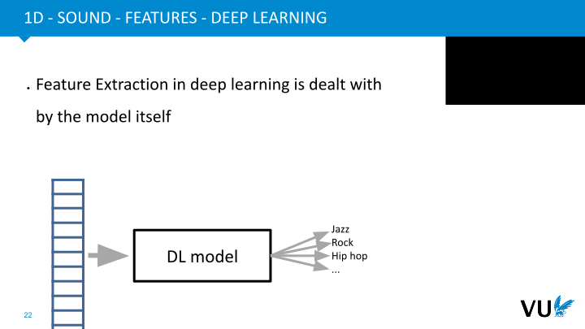

            <figcaption>
            
<strong><a href="In the context of a deep learning system, we aim to offload the burden of feature extraction onto the model itself. The model is designed to autonomously handle this aspect, and all you need to do is feed it the raw data.
">In the context of a deep learning system, we aim to offload the burden of feature extraction onto the model itself. The model is designed to autonomously handle this aspect, and all you need to do is feed it the raw data.
</a></strong>
 
            </figcaption>
       </section>

       <section id="slide-023">
            <a class="slide-link" href="https://dlvu.github.io/cnns#slide-023" title="Link to this slide.">link here</a>
            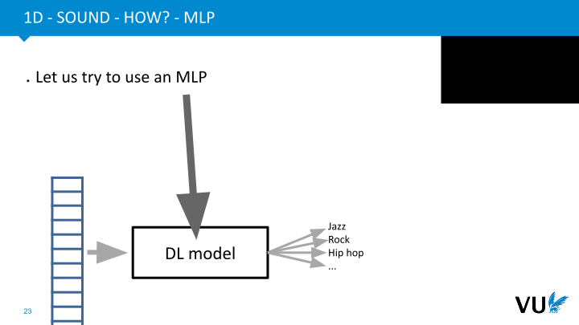

            <figcaption>
            
<strong><a href=" To begin, we'll explore using a Multi-Layer Perceptron (MLP) for this purpose. Our initial focus is on a classification task, specifically the identification of music styles.
"> To begin, we'll explore using a Multi-Layer Perceptron (MLP) for this purpose. Our initial focus is on a classification task, specifically the identification of music styles.
</a></strong>
 
            </figcaption>
       </section>

       <section id="slide-024">
            <a class="slide-link" href="https://dlvu.github.io/cnns#slide-024" title="Link to this slide.">link here</a>
            

            <figcaption>
            
Weights

Hidden layers, 

Non-linearities

Bias (not in the image)

Backprop
   
            </figcaption>
       </section>

       <section id="slide-025">
            <a class="slide-link" href="https://dlvu.github.io/cnns#slide-025" title="Link to this slide.">link here</a>
            

            <figcaption>
            
<strong><a href="Weights
">Weights
</a></strong>

<strong><a href="Hidden layers, 
">Hidden layers, 
</a></strong>

<strong><a href="Non-linearities
">Non-linearities
</a></strong>

<strong><a href="Bias (not in the image)
">Bias (not in the image)
</a></strong>

<strong><a href="Backprop
">Backprop
</a></strong>

<strong><a href="So, what would we do in principle or what we do normally is we would have these these neurons, we would feed the information based from the input into this input layer, then we would have the weights on the connections between these these neurons, then we would have a new layers which we basically collect the incoming information summing together and apply non linearity and that way things propagate into the network. I did not explicitly mentioned the bias notes in this in this image, but there are there right so in all the images which are showing about MLPs there is always also a bias note in these in these formulas and indeed images. after things have forward propagated through the network, you can also use the backpropagation basically to improve the classification accuracy of that network. Now, of course, these weights which are here, we can just represent them with one big weight matrix.
">So, what would we do in principle or what we do normally is we would have these these neurons, we would feed the information based from the input into this input layer, then we would have the weights on the connections between these these neurons, then we would have a new layers which we basically collect the incoming information summing together and apply non linearity and that way things propagate into the network. I did not explicitly mentioned the bias notes in this in this image, but there are there right so in all the images which are showing about MLPs there is always also a bias note in these in these formulas and indeed images. after things have forward propagated through the network, you can also use the backpropagation basically to improve the classification accuracy of that network. Now, of course, these weights which are here, we can just represent them with one big weight matrix.
</a></strong>
 
            </figcaption>
       </section>

       <section id="slide-026">
            <a class="slide-link" href="https://dlvu.github.io/cnns#slide-026" title="Link to this slide.">link here</a>
            

            <figcaption>
            
<strong><a href="As previously noted, in theory, this approach may appear feasible, but it is beset by several inherent challenges. Firstly, it necessitates a substantial volume of training data. Furthermore, the Multi-Layer Perceptron (MLP), as mentioned earlier, doesn't account for the order or sequence of input data. Moreover, it was highlighted previously that to make this approach effective, you would require an exceedingly large MLP. This means having a virtually one-to-one connection between neurons and input features, resulting in an impractical abundance of connections. Ultimately, this approach is unlikely to yield desirable results.
">As previously noted, in theory, this approach may appear feasible, but it is beset by several inherent challenges. Firstly, it necessitates a substantial volume of training data. Furthermore, the Multi-Layer Perceptron (MLP), as mentioned earlier, doesn't account for the order or sequence of input data. Moreover, it was highlighted previously that to make this approach effective, you would require an exceedingly large MLP. This means having a virtually one-to-one connection between neurons and input features, resulting in an impractical abundance of connections. Ultimately, this approach is unlikely to yield desirable results.
</a></strong>
 
            </figcaption>
       </section>

       <section id="slide-027">
            <a class="slide-link" href="https://dlvu.github.io/cnns#slide-027" title="Link to this slide.">link here</a>
            

            <figcaption>
            
<strong><a href="A sound wave is the superposition of sine waves.
">A sound wave is the superposition of sine waves.
</a></strong>

<strong><a href="While in reality, this a sound wave is continuous, it gets sampled at a high rate (44Khz) to make it possible to store on a computer. For or a computer a sound wave is just a sequence of numbers.
">While in reality, this a sound wave is continuous, it gets sampled at a high rate (44Khz) to make it possible to store on a computer. For or a computer a sound wave is just a sequence of numbers.
</a></strong>

<strong><a href="For the sake of this lecture we will directly use this wave as features. So, what we have is a one-dimensional vector of numbers.
">For the sake of this lecture we will directly use this wave as features. So, what we have is a one-dimensional vector of numbers.
</a></strong>

<strong><a href="Now, let's let's discuss a bit about how our input data. So what the sound wave basically is, is a superposition of sine waves, that's we have. That's basically words such as signals consists of, and in reality that send your sample if it's continuous, it's a continuous continuous wave. But what we do for getting this into computer is sampling it. So we're sampling is, for example, at a rate of 44 kilohertz is very common. And this makes it possible to store it digitally on a computer. So for a computer, a sound wave is just a sequence of numbers, right, so it is not a wave anymore, it's just a sequence of numbers. And for the sake of this lecture, we will just directly use this wave as the feature. So what we have is basically a one dimensional vector of numbers. Now, let's let's look at how we can do that. So basically, we have that sound wave. Now if we look, if we zoom in, we basically see that the sound wave consists of certain heights, let's say or certain, let's say y axis values, and we can basically basically sample them say like how high is this peak and measure it and then put it into into the vector.
">Now, let's let's discuss a bit about how our input data. So what the sound wave basically is, is a superposition of sine waves, that's we have. That's basically words such as signals consists of, and in reality that send your sample if it's continuous, it's a continuous continuous wave. But what we do for getting this into computer is sampling it. So we're sampling is, for example, at a rate of 44 kilohertz is very common. And this makes it possible to store it digitally on a computer. So for a computer, a sound wave is just a sequence of numbers, right, so it is not a wave anymore, it's just a sequence of numbers. And for the sake of this lecture, we will just directly use this wave as the feature. So what we have is basically a one dimensional vector of numbers. Now, let's let's look at how we can do that. So basically, we have that sound wave. Now if we look, if we zoom in, we basically see that the sound wave consists of certain heights, let's say or certain, let's say y axis values, and we can basically basically sample them say like how high is this peak and measure it and then put it into into the vector.
</a></strong>
 
            </figcaption>
       </section>

       <section id="slide-028">
            <a class="slide-link" href="https://dlvu.github.io/cnns#slide-028" title="Link to this slide.">link here</a>
            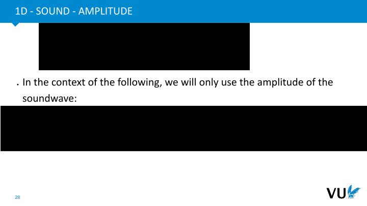

            <figcaption>
            
<strong><a href="In the context of the following steps we will only use the amplitude of the soundwave. Note, that this is reasonable, since we can reasonably easily design an MLP that extracts this.
">In the context of the following steps we will only use the amplitude of the soundwave. Note, that this is reasonable, since we can reasonably easily design an MLP that extracts this.
</a></strong>

<strong><a href="It is a good exercise to pause the video and think how such a network could be created. A possible answer can be found in the slides.
">It is a good exercise to pause the video and think how such a network could be created. A possible answer can be found in the slides.
</a></strong>
  
            </figcaption>
       </section>

       <section id="slide-029">
            <a class="slide-link" href="https://dlvu.github.io/cnns#slide-029" title="Link to this slide.">link here</a>
            

            <figcaption>
            
<strong><a href="Next, let's explore our following step. Instead of representing this wave in its original form, we'll take a different approach. Essentially, we will gauge the amplitude of the sound wave, measuring its loudness. This choice is quite rational because, in principle, you can design a MLP to perform this transformation. It can take the original sound wave and calculate its amplitude, which is essentially equivalent to computing the absolute value of the waveform.
">Next, let's explore our following step. Instead of representing this wave in its original form, we'll take a different approach. Essentially, we will gauge the amplitude of the sound wave, measuring its loudness. This choice is quite rational because, in principle, you can design a MLP to perform this transformation. It can take the original sound wave and calculate its amplitude, which is essentially equivalent to computing the absolute value of the waveform.
</a></strong>

<strong><a href="I encourage you to pause the video for a moment and consider how you might convert the original sound wave into its amplitude. This pause will enhance your comprehension of the subsequent content in this lecture.
">I encourage you to pause the video for a moment and consider how you might convert the original sound wave into its amplitude. This pause will enhance your comprehension of the subsequent content in this lecture.
</a></strong>

<strong><a href="In the presentation slides, you'll discover a possible solution for the challenge of deriving the amplitude from the original sound. Moving forward, our next step involves normalizing this amplitude. In essence, we'll adjust it so that its values fall within the range of plus one to minus one, with an average value centered around zero.">In the presentation slides, you'll discover a possible solution for the challenge of deriving the amplitude from the original sound. Moving forward, our next step involves normalizing this amplitude. In essence, we'll adjust it so that its values fall within the range of plus one to minus one, with an average value centered around zero.</a></strong>
 
            </figcaption>
       </section>

       <section id="slide-030">
            <a class="slide-link" href="https://dlvu.github.io/cnns#slide-030" title="Link to this slide.">link here</a>
            

            <figcaption>
             
<strong><a href="All right, with that step completed, we now have our vector input. However, when dealing with sound input, as we've previously discussed, and this holds true not just in general but especially for sound data, the features are intricately interconnected. The order in which these features appear is of paramount significance. This ordering plays an important role, signifying that nearby features carry more weight than those located further away. In essence, when you have a particular sound, it's crucial to comprehend it both at a local level and in the context of what was heard shortly before or after in the audio. This concept, emphasizing the significance of nearby information, is often harnessed in what's known as "filtering."
">All right, with that step completed, we now have our vector input. However, when dealing with sound input, as we've previously discussed, and this holds true not just in general but especially for sound data, the features are intricately interconnected. The order in which these features appear is of paramount significance. This ordering plays an important role, signifying that nearby features carry more weight than those located further away. In essence, when you have a particular sound, it's crucial to comprehend it both at a local level and in the context of what was heard shortly before or after in the audio. This concept, emphasizing the significance of nearby information, is often harnessed in what's known as "filtering."
</a></strong>
 
            </figcaption>
       </section>

       <section id="slide-031">
            <a class="slide-link" href="https://dlvu.github.io/cnns#slide-031" title="Link to this slide.">link here</a>
            

            <figcaption>
            
<strong><a href="A silence is at points where the amplitude is low for some time.
">A silence is at points where the amplitude is low for some time.
</a></strong>

<strong><a href="And so, what we will be doing with filters is we will first look into an example in which we try to find silence in our sound right and. What does it mean in our case? It is basically a time a period in which the amplitude is fairly low, close to zero or exactly zero during that during that time. 
">And so, what we will be doing with filters is we will first look into an example in which we try to find silence in our sound right and. What does it mean in our case? It is basically a time a period in which the amplitude is fairly low, close to zero or exactly zero during that during that time. 
</a></strong>
 
            </figcaption>
       </section>

       <section id="slide-032">
            <a class="slide-link" href="https://dlvu.github.io/cnns#slide-032" title="Link to this slide.">link here</a>
            

            <figcaption>
            
<strong><a href="In our case, this means a several consecutive features with a low value.
">In our case, this means a several consecutive features with a low value.
</a></strong>
 
            </figcaption>
       </section>

       <section id="slide-033">
            <a class="slide-link" href="https://dlvu.github.io/cnns#slide-033" title="Link to this slide.">link here</a>
            

            <figcaption>
            
<strong><a href="We want to detect where in our sound wave a silence occurs.
">We want to detect where in our sound wave a silence occurs.
</a></strong>

<strong><a href=" If we examine a segment over a specific time interval, as indicated here, and closely inspect the numerical values derived from the original signal's samples, you'll notice that there's a period during which the values remain consistently low for a certain duration."> If we examine a segment over a specific time interval, as indicated here, and closely inspect the numerical values derived from the original signal's samples, you'll notice that there's a period during which the values remain consistently low for a certain duration.</a></strong>
 
            </figcaption>
       </section>

       <section id="slide-034">
            <a class="slide-link" href="https://dlvu.github.io/cnns#slide-034" title="Link to this slide.">link here</a>
            

            <figcaption>
            
<strong><a href="We want to detect where in our sound wave a silence occurs.
">We want to detect where in our sound wave a silence occurs.
</a></strong>

<strong><a href="In the context of an MLP, we want to create a “silence neuron”. A neuron that fires in case there is a silence.
">In the context of an MLP, we want to create a “silence neuron”. A neuron that fires in case there is a silence.
</a></strong>
 
            </figcaption>
       </section>

       <section id="slide-035">
            <a class="slide-link" href="https://dlvu.github.io/cnns#slide-035" title="Link to this slide.">link here</a>
            

            <figcaption>
            
<strong><a href="This would be a neuron. Let’s work backwards. We want it to have a high value.
">This would be a neuron. Let’s work backwards. We want it to have a high value.
</a></strong>

<strong><a href="So, all parts of the summation need to have a high value (the non-linearity is a monotonic function)">So, all parts of the summation need to have a high value (the non-linearity is a monotonic function)</a></strong>
  
            </figcaption>
       </section>

       <section id="slide-036">
            <a class="slide-link" href="https://dlvu.github.io/cnns#slide-036" title="Link to this slide.">link here</a>
            

            <figcaption>
            
In our features, this means a several consecutive features with a low value.

<a href="We want to detect where in our sound wave a silence occurs.
">We want to detect where in our sound wave a silence occurs.
</a>

<a href="In the context of an MLP, we want to create a “silence neuron”. A neuron that fires in case there is a silence.
">In the context of an MLP, we want to create a “silence neuron”. A neuron that fires in case there is a silence.
</a>

<a href="This would be a neuron. Let’s work backwards. We want it to have a high value.
">This would be a neuron. Let’s work backwards. We want it to have a high value.
</a>

<a href="So, all parts of the summation need to have a high value (the non-linearity is a monotonic function)
">So, all parts of the summation need to have a high value (the non-linearity is a monotonic function)
</a>

            </figcaption>
       </section>

       <section id="slide-037">
            <a class="slide-link" href="https://dlvu.github.io/cnns#slide-037" title="Link to this slide.">link here</a>
            

            <figcaption>
            
In our features, this means a several consecutive features with a low value.

<a href="We want to detect where in our sound wave a silence occurs.
">We want to detect where in our sound wave a silence occurs.
</a>

<a href="In the context of an MLP, we want to create a “silence neuron”. A neuron that fires in case there is a silence.
">In the context of an MLP, we want to create a “silence neuron”. A neuron that fires in case there is a silence.
</a>

<a href="This would be a neuron. Let’s work backwards. We want it to have a high value.
">This would be a neuron. Let’s work backwards. We want it to have a high value.
</a>

<a href="So, all parts of the summation need to have a high value (the non-linearity is a monotonic function)
">So, all parts of the summation need to have a high value (the non-linearity is a monotonic function)
</a>

            </figcaption>
       </section>

       <section id="slide-038">
            <a class="slide-link" href="https://dlvu.github.io/cnns#slide-038" title="Link to this slide.">link here</a>
            

            <figcaption>
             
<a href="Since the input value are negative numbers, the only option is to also have the weights with negative numbers
">Since the input value are negative numbers, the only option is to also have the weights with negative numbers
</a>

            </figcaption>
       </section>

       <section id="slide-039">
            <a class="slide-link" href="https://dlvu.github.io/cnns#slide-039" title="Link to this slide.">link here</a>
            

            <figcaption>
            
            </figcaption>
       </section>

       <section id="slide-040" class="anim">
            <a class="slide-link" href="https://dlvu.github.io/cnns#slide-040" title="Link to this slide.">link here</a>
            

            <figcaption>
            
<strong><a href="This image is now simplified to the essential parts, the input to the MLP is in green, the filter in cyan.
">This image is now simplified to the essential parts, the input to the MLP is in green, the filter in cyan.
</a></strong>

<strong><a href="This filter is supposed to detect silence, but how does would it perform on other parts?
">This filter is supposed to detect silence, but how does would it perform on other parts?
</a></strong>

<strong><a href="Does it give a low signal when there is sound? Let us try...
">Does it give a low signal when there is sound? Let us try...
</a></strong>
 
            </figcaption>
            click image for animation
       </section>

       <section id="slide-041">
            <a class="slide-link" href="https://dlvu.github.io/cnns#slide-041" title="Link to this slide.">link here</a>
            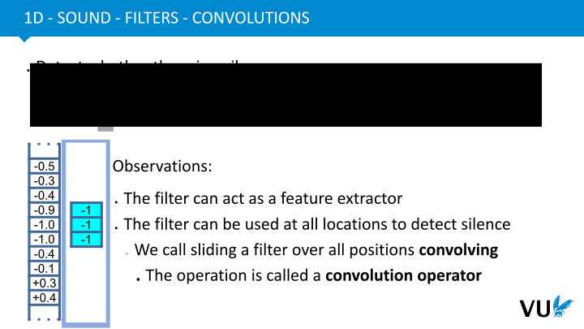

            <figcaption>
            
<strong><a href="This image is now simplified to the essential parts, the input to the MLP is in green, the filter in cyan.
">This image is now simplified to the essential parts, the input to the MLP is in green, the filter in cyan.
</a></strong>

<strong><a href="This filter is supposed to detect silence, but how does would it perform on other parts?
">This filter is supposed to detect silence, but how does would it perform on other parts?
</a></strong>

<strong><a href="Does it give a low signal when there is sound? Let us try...
">Does it give a low signal when there is sound? Let us try...
</a></strong>
 
            </figcaption>
       </section>

       <section id="slide-042" class="anim">
            <a class="slide-link" href="https://dlvu.github.io/cnns#slide-042" title="Link to this slide.">link here</a>
            

            <figcaption>
            
There are two essential observations from what we tried.

The filter can act as a feature extractor. 

The filter can be used at other locations as well and will extract the same feature, but locally.

            </figcaption>
            click image for animation
       </section>

       <section id="slide-043">
            <a class="slide-link" href="https://dlvu.github.io/cnns#slide-043" title="Link to this slide.">link here</a>
            

            <figcaption>
            
There are two essential observations from what we tried.

The filter can act as a feature extractor. 

The filter can be used at other locations as well and will extract the same feature, but locally.

            </figcaption>
       </section>

       <section id="slide-044">
            <a class="slide-link" href="https://dlvu.github.io/cnns#slide-044" title="Link to this slide.">link here</a>
            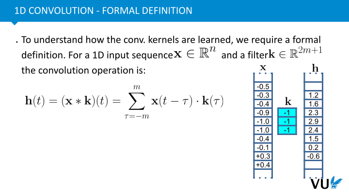

            <figcaption>
            
There are Three essential observations from what we tried.

The filter can act as a feature extractor.  The output is itself a vector.

<a href="The filter can be used at other locations as well and will extract the same feature, but locally. ">The filter can be used at other locations as well and will extract the same feature, but locally. </a>

If there is a time shift in the sound, the same shift will be visible in the output vector. This means that the convolution operator is translation equivariant. 

The convolution is just an MLP, but its connections are localized and weights are tied, meaning that they are kept the same for specific connections.

            </figcaption>
       </section>

       <section id="slide-045">
            <a class="slide-link" href="https://dlvu.github.io/cnns#slide-045" title="Link to this slide.">link here</a>
            

            <figcaption>
            
<strong><a href="|section|Conv1d (b)|
">|section|Conv1d (b)|
</a></strong>

<strong><a href="|video|https://www.youtube.com/embed/Q7KekwUricc?si=GyYQriQg_rhhOTcP|
">|video|https://www.youtube.com/embed/Q7KekwUricc?si=GyYQriQg_rhhOTcP|
</a></strong>
 
<strong><a href="For this part, we will stay within one dimensional convolutions, as we were doing in the previous video. 
">For this part, we will stay within one dimensional convolutions, as we were doing in the previous video. 
</a></strong>
 
            </figcaption>
       </section>

       <section id="slide-046">
            <a class="slide-link" href="https://dlvu.github.io/cnns#slide-046" title="Link to this slide.">link here</a>
            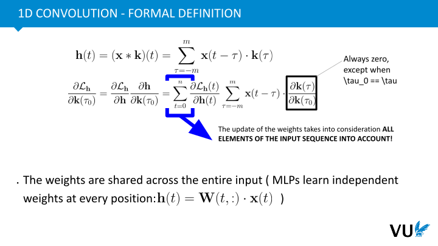

            <figcaption>
            
<strong><a href="To better grasp how convolutional kernels are learned, we'll delve into a more formal definition. We're still operating within a one-dimensional input sequence. Our input sequence, denoted as x, is n-dimensional, comprising n floating-point real numbers. In addition, we have a filter, which also possesses a specific length. This length is expressed as 2n+1, and it's designed to be uneven. In this context, we only support filters with uneven lengths, such as one, three, five, or seven.
">To better grasp how convolutional kernels are learned, we'll delve into a more formal definition. We're still operating within a one-dimensional input sequence. Our input sequence, denoted as x, is n-dimensional, comprising n floating-point real numbers. In addition, we have a filter, which also possesses a specific length. This length is expressed as 2n+1, and it's designed to be uneven. In this context, we only support filters with uneven lengths, such as one, three, five, or seven.
</a></strong>

<strong><a href="Now, what precisely does this convolution operation entail? The formula we see here aims to describe how to compute one of the network's outputs. Let's focus on the output at position T, denoted as H(T). It's essentially a summation of various elements. We've previously encountered the concept of convolution, which entails the summation of input neurons multiplied by their corresponding weights from filter K. To formalize this, we examine the vector x and identify the part that corresponds to our position T. Then, we traverse m steps both upwards and downwards from this position. In other words, we traverse from -m to m and calculate the dot product of these values with their respective counterparts in filter K. This computation forms the core of the convolution operation. Afterward, we apply the bias, along with our non-linearity. In essence, convolution boils down to this fundamental operation of multiplication or dot product.
">Now, what precisely does this convolution operation entail? The formula we see here aims to describe how to compute one of the network's outputs. Let's focus on the output at position T, denoted as H(T). It's essentially a summation of various elements. We've previously encountered the concept of convolution, which entails the summation of input neurons multiplied by their corresponding weights from filter K. To formalize this, we examine the vector x and identify the part that corresponds to our position T. Then, we traverse m steps both upwards and downwards from this position. In other words, we traverse from -m to m and calculate the dot product of these values with their respective counterparts in filter K. This computation forms the core of the convolution operation. Afterward, we apply the bias, along with our non-linearity. In essence, convolution boils down to this fundamental operation of multiplication or dot product.
</a></strong>
 
            </figcaption>
       </section>

       <section id="slide-047">
            <a class="slide-link" href="https://dlvu.github.io/cnns#slide-047" title="Link to this slide.">link here</a>
            

            <figcaption>
            
<strong><a href="In this context, where we're training a learnable filter, like our silence detector, we employ data samples and backpropagation to update this filter. This entails updating the filter weights based on a specific loss. The loss function, represented here, can vary and depend on factors such as the convolutional response at various locations. For instance, it may align with the cross-correlation in classification tasks, where a better classification results in a lower loss.
">In this context, where we're training a learnable filter, like our silence detector, we employ data samples and backpropagation to update this filter. This entails updating the filter weights based on a specific loss. The loss function, represented here, can vary and depend on factors such as the convolutional response at various locations. For instance, it may align with the cross-correlation in classification tasks, where a better classification results in a lower loss.
</a></strong>

<strong><a href="To compute the updates to the filter, we need the gradient information to determine in which direction the filter values should be adjusted in each iteration. This requires calculating the derivative of the loss with respect to the filter weights. In this expression, the final term, which pertains to the weight at position tau in the filter, will typically be zero except when tau is equal to tau zero. Tau zero corresponds to the index of the weight being updated, and it is equal to the specific position where the filter is applied. In other words, these weights are adjacent when the filter operates.
">To compute the updates to the filter, we need the gradient information to determine in which direction the filter values should be adjusted in each iteration. This requires calculating the derivative of the loss with respect to the filter weights. In this expression, the final term, which pertains to the weight at position tau in the filter, will typically be zero except when tau is equal to tau zero. Tau zero corresponds to the index of the weight being updated, and it is equal to the specific position where the filter is applied. In other words, these weights are adjacent when the filter operates.
</a></strong>
 
            </figcaption>
       </section>

       <section id="slide-048">
            <a class="slide-link" href="https://dlvu.github.io/cnns#slide-048" title="Link to this slide.">link here</a>
            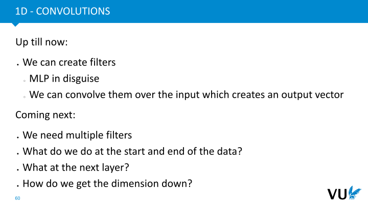

            <figcaption>
             
<strong><a href="Another noteworthy observation is that when we calculate the updates for this weight, we take into account all elements in the input sequence, ranging from zero to n. In essence, we consider how each element in the input sequence affects the updates for the position of the filter. This implies that these weights are genuinely shared across the entire input. In contrast, the Multi-Layer Perceptron (MLP) learns independent weights for each position, without this sharing property.
">Another noteworthy observation is that when we calculate the updates for this weight, we take into account all elements in the input sequence, ranging from zero to n. In essence, we consider how each element in the input sequence affects the updates for the position of the filter. This implies that these weights are genuinely shared across the entire input. In contrast, the Multi-Layer Perceptron (MLP) learns independent weights for each position, without this sharing property.
</a></strong>
 
            </figcaption>
       </section>

       <section id="slide-049">
            <a class="slide-link" href="https://dlvu.github.io/cnns#slide-049" title="Link to this slide.">link here</a>
            

            <figcaption>
            
<strong><a href="There are several advantages to this approach. Applying filters across the entire dataset makes convolutional neural networks significantly smaller in comparison to Multi-Layer Perceptrons (MLPs). For instance, a feature detector for noise, as demonstrated earlier, involves only three weights. In contrast, designing a comprehensive silence detector with an MLP would necessitate an extensive network to identify silences effectively. This showcases an outstanding parameter efficiency.
">There are several advantages to this approach. Applying filters across the entire dataset makes convolutional neural networks significantly smaller in comparison to Multi-Layer Perceptrons (MLPs). For instance, a feature detector for noise, as demonstrated earlier, involves only three weights. In contrast, designing a comprehensive silence detector with an MLP would necessitate an extensive network to identify silences effectively. This showcases an outstanding parameter efficiency.
</a></strong>

<strong><a href="Convolutional neural networks also excel at becoming potent pattern recognizers. For example, in the case of detecting silences, a CNN can recognize silences appearing anywhere in the input. In contrast, an MLP would need to learn independent silence patterns for every possible position. This leads to exceptional data efficiency, making the most out of available data. Convolutions can recognize patterns, such as silence, regardless of their specific location, making them versatile. Even if a silence occurs in a position that hasn't been seen before, the convolutional network can adapt effectively, as it's designed to identify the presence of silences anywhere.
">Convolutional neural networks also excel at becoming potent pattern recognizers. For example, in the case of detecting silences, a CNN can recognize silences appearing anywhere in the input. In contrast, an MLP would need to learn independent silence patterns for every possible position. This leads to exceptional data efficiency, making the most out of available data. Convolutions can recognize patterns, such as silence, regardless of their specific location, making them versatile. Even if a silence occurs in a position that hasn't been seen before, the convolutional network can adapt effectively, as it's designed to identify the presence of silences anywhere.
</a></strong>

<strong><a href="In summary, convolutional neural networks offer substantial benefits in terms of generalization improvement. It's worth noting that points two and three, as indicated in these bullet points, are direct outcomes of the convolution's property of translation equivariance. We'll delve deeper into this concept in the upcoming discussion.
">In summary, convolutional neural networks offer substantial benefits in terms of generalization improvement. It's worth noting that points two and three, as indicated in these bullet points, are direct outcomes of the convolution's property of translation equivariance. We'll delve deeper into this concept in the upcoming discussion.
</a></strong>
 
            </figcaption>
       </section>

       <section id="slide-050">
            <a class="slide-link" href="https://dlvu.github.io/cnns#slide-050" title="Link to this slide.">link here</a>
            

            <figcaption>
            
<strong><a href="So, let's summarize our progress thus far. We've been primarily focused on filters and discussed how they effectively act as an MLP but with the added capability of moving over the input data, generating an output vector. However, we're not only interested in detecting silence; to address the complex questions we've raised, we require more. We need filters to identify various features, such as regions with high noise, specific rhythms, and more. This necessitates multiple filters; a single filter won't suffice.
">So, let's summarize our progress thus far. We've been primarily focused on filters and discussed how they effectively act as an MLP but with the added capability of moving over the input data, generating an output vector. However, we're not only interested in detecting silence; to address the complex questions we've raised, we require more. We need filters to identify various features, such as regions with high noise, specific rhythms, and more. This necessitates multiple filters; a single filter won't suffice.
</a></strong>

<strong><a href="The next question we need to address is how to handle the data's beginning and end. Our analysis has mainly centered on the middle of the data, but we also need to consider the data's start and finish. Additionally, we've thus far examined a single layer, but it's important to think about the behavior of subsequent layers.
">The next question we need to address is how to handle the data's beginning and end. Our analysis has mainly centered on the middle of the data, but we also need to consider the data's start and finish. Additionally, we've thus far examined a single layer, but it's important to think about the behavior of subsequent layers.
</a></strong>

<strong><a href="Lastly, we must consider dimension reduction. While applying a filter, we've observed that the output maintains the same dimension as the input. In our network, we need to reduce the dimension to match the number of classes, for example, and further compress it as needed.
">Lastly, we must consider dimension reduction. While applying a filter, we've observed that the output maintains the same dimension as the input. In our network, we need to reduce the dimension to match the number of classes, for example, and further compress it as needed.
</a></strong>
 
            </figcaption>
       </section>

       <section id="slide-051">
            <a class="slide-link" href="https://dlvu.github.io/cnns#slide-051" title="Link to this slide.">link here</a>
            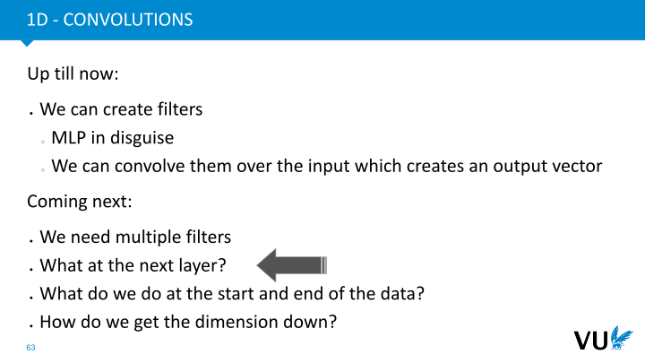

            <figcaption>
            
            </figcaption>
       </section>

       <section id="slide-052">
            <a class="slide-link" href="https://dlvu.github.io/cnns#slide-052" title="Link to this slide.">link here</a>
            

            <figcaption>
            
<strong><a href="We need more as just a silence feature extractor. We are, for example also interested in detecting sudden drops, specific frequencies, periods with sustained sounds, etc.
">We need more as just a silence feature extractor. We are, for example also interested in detecting sudden drops, specific frequencies, periods with sustained sounds, etc.
</a></strong>

<strong><a href="A first thing we do is adding multiple filters supporting different features. The number of filters is chosen by the network designer.
">A first thing we do is adding multiple filters supporting different features. The number of filters is chosen by the network designer.
</a></strong>

<strong><a href="Now, the output becomes a matrix; ">Now, the output becomes a matrix; </a></strong>

<strong><a href="the output volume. ">the output volume. </a></strong>

<strong><a href=" The columns of this volume correspond to each filter. The row in this volume corresponds to a certain group of entries in the input volume.
"> The columns of this volume correspond to each filter. The row in this volume corresponds to a certain group of entries in the input volume.
</a></strong>
 
            </figcaption>
       </section>

       <section id="slide-053">
            <a class="slide-link" href="https://dlvu.github.io/cnns#slide-053" title="Link to this slide.">link here</a>
            

            <figcaption>
            
<strong><a href="Let's begin with the need for multiple filters. As mentioned, we require numerous filters for feature extraction. The key point is that our design doesn't restrict us to having just one filter; we started with one as an example, but in practice, we can create as many filters as necessary. Whether you need two filters, ten filters, or any number, it's entirely feasible. The main difference is that instead of having a single output factor, you'll obtain multiple output factors. Each filter generates its own factor, and if you have more filters, you'll generate a corresponding number of factors.
">Let's begin with the need for multiple filters. As mentioned, we require numerous filters for feature extraction. The key point is that our design doesn't restrict us to having just one filter; we started with one as an example, but in practice, we can create as many filters as necessary. Whether you need two filters, ten filters, or any number, it's entirely feasible. The main difference is that instead of having a single output factor, you'll obtain multiple output factors. Each filter generates its own factor, and if you have more filters, you'll generate a corresponding number of factors.
</a></strong>

<strong><a href="This transformation takes us from an initial dimension, denoted as n x 1 or 1 x n, and leads to a new dimension, which depends on the number of filters employed. We refer to these outputs as the "output volume." Currently, it's represented as a 2D matrix, but it can expand further in the subsequent steps. So, we're essentially moving from one-dimensional input to a multi-factor output volume.
">This transformation takes us from an initial dimension, denoted as n x 1 or 1 x n, and leads to a new dimension, which depends on the number of filters employed. We refer to these outputs as the "output volume." Currently, it's represented as a 2D matrix, but it can expand further in the subsequent steps. So, we're essentially moving from one-dimensional input to a multi-factor output volume.
</a></strong>
 
            </figcaption>
       </section>

       <section id="slide-054" class="anim">
            <a class="slide-link" href="https://dlvu.github.io/cnns#slide-054" title="Link to this slide.">link here</a>
            

            <figcaption>
            
<strong><a href="Okay, so we have talked about multiple filters and what we can do in the next layers of this convolutional neural network. Now, there is still an issue at the start and end of the data. So let's look at an example.
">Okay, so we have talked about multiple filters and what we can do in the next layers of this convolutional neural network. Now, there is still an issue at the start and end of the data. So let's look at an example.
</a></strong>
 
            </figcaption>
            click image for animation
       </section>

       <section id="slide-055">
            <a class="slide-link" href="https://dlvu.github.io/cnns#slide-055" title="Link to this slide.">link here</a>
            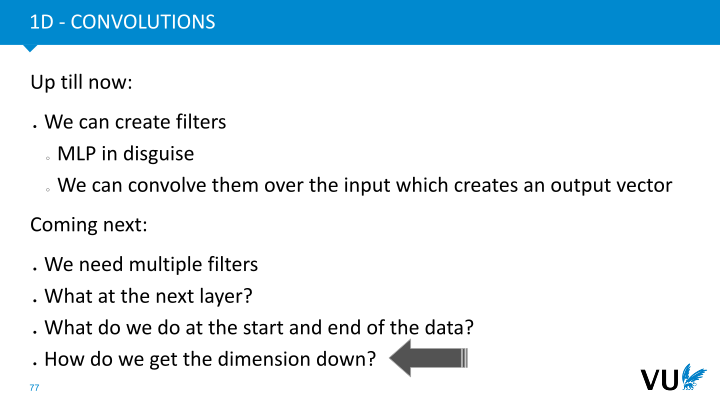

            <figcaption>
            
<strong><a href="Okay, so we have talked about multiple filters and what we can do in the next layers of this convolutional neural network. Now, there is still an issue at the start and end of the data. So let's look at an example.
">Okay, so we have talked about multiple filters and what we can do in the next layers of this convolutional neural network. Now, there is still an issue at the start and end of the data. So let's look at an example.
</a></strong>
 
            </figcaption>
       </section>

       <section id="slide-056" class="anim">
            <a class="slide-link" href="https://dlvu.github.io/cnns#slide-056" title="Link to this slide.">link here</a>
            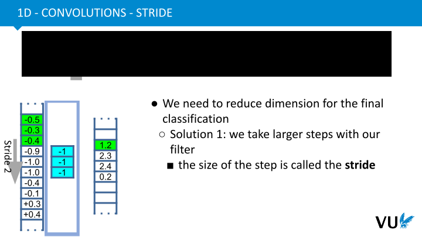

            <figcaption>
            
<strong><a href="So we have now seen what to do at the start and the end of our input data. Finally, we have to talk about how we get the dimension down. Here, we want to get the dimension lower in a controlled way. 
">So we have now seen what to do at the start and the end of our input data. Finally, we have to talk about how we get the dimension down. Here, we want to get the dimension lower in a controlled way. 
</a></strong>
 
            </figcaption>
            click image for animation
       </section>

       <section id="slide-057">
            <a class="slide-link" href="https://dlvu.github.io/cnns#slide-057" title="Link to this slide.">link here</a>
            

            <figcaption>
            
<strong><a href="So we have now seen what to do at the start and the end of our input data. Finally, we have to talk about how we get the dimension down. Here, we want to get the dimension lower in a controlled way. 
">So we have now seen what to do at the start and the end of our input data. Finally, we have to talk about how we get the dimension down. Here, we want to get the dimension lower in a controlled way. 
</a></strong>
 
            </figcaption>
       </section>

       <section id="slide-058" class="anim">
            <a class="slide-link" href="https://dlvu.github.io/cnns#slide-058" title="Link to this slide.">link here</a>
            

            <figcaption>
            
<a href="To in the end be able to do a classification, we need to get the dimension down. We do not want it by not padding, as that is destructive for the boundaries of the data.
">To in the end be able to do a classification, we need to get the dimension down. We do not want it by not padding, as that is destructive for the boundaries of the data.
</a>

<a href="A first option is to use a different ">A first option is to use a different </a>

<strong><a href="stride">stride</a></strong>

<a href=" while convolving the filters. that means, make bigger steps.
"> while convolving the filters. that means, make bigger steps.
</a>

This leads to an output volume which has a dimension equal to the input dimension divided by the stride. To make this work, the input dimension must be a multiple of the stride.

            </figcaption>
            click image for animation
       </section>

       <section id="slide-059">
            <a class="slide-link" href="https://dlvu.github.io/cnns#slide-059" title="Link to this slide.">link here</a>
            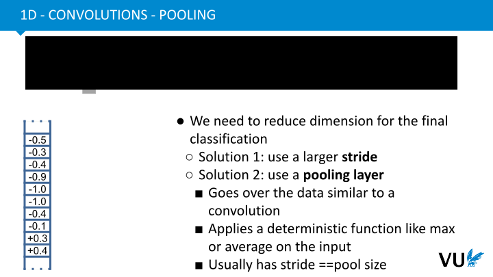

            <figcaption>
            
<a href="To in the end be able to do a classification, we need to get the dimension down. We do not want it by not padding, as that is destructive for the boundaries of the data.
">To in the end be able to do a classification, we need to get the dimension down. We do not want it by not padding, as that is destructive for the boundaries of the data.
</a>

<a href="A first option is to use a different ">A first option is to use a different </a>

<strong><a href="stride">stride</a></strong>

<a href=" while convolving the filters. that means, make bigger steps.
"> while convolving the filters. that means, make bigger steps.
</a>

This leads to an output volume which has a dimension equal to the input dimension divided by the stride. To make this work, the input dimension must be a multiple of the stride.

            </figcaption>
       </section>

       <section id="slide-060">
            <a class="slide-link" href="https://dlvu.github.io/cnns#slide-060" title="Link to this slide.">link here</a>
            

            <figcaption>
            
<a href="To in the end be able to do a classification, we need to get the dimension down. We do not want it by not padding, as that is destructive for the boundaries of the data.
">To in the end be able to do a classification, we need to get the dimension down. We do not want it by not padding, as that is destructive for the boundaries of the data.
</a>

The second option is the use of a 

<strong>pooling layer</strong>

. To put it simple, a pooling layer takes a set of elements from the previous layer and squeezes that down to one output in a deterministic way. Examples include a 

<strong>max pooling and average pooling. </strong>

The former takes the biggest element of the input and only outputs that. The latter takes the average of the inputs and forwards that. 

 
            </figcaption>
       </section>

       <section id="slide-061">
            <a class="slide-link" href="https://dlvu.github.io/cnns#slide-061" title="Link to this slide.">link here</a>
            

            <figcaption>
            
<a href="To in the end be able to do a classification, we need to get the dimension down. We do not want it by not padding, as that is destructive for the boundaries of the data.
">To in the end be able to do a classification, we need to get the dimension down. We do not want it by not padding, as that is destructive for the boundaries of the data.
</a>

<a href="The second option is the use of a ">The second option is the use of a </a>

<strong><a href="pooling layer">pooling layer</a></strong>

<a href=". To put it simple, a pooling layer takes a set of elements from the previous layer and squeezes that down to one output in a deterministic way. Examples include a ">. To put it simple, a pooling layer takes a set of elements from the previous layer and squeezes that down to one output in a deterministic way. Examples include a </a>

<strong><a href="max pooling and average pooling. ">max pooling and average pooling. </a></strong>

<a href="The former takes the biggest element of the input and only outputs that. The latter takes the average of the inputs and forwards that. 
">The former takes the biggest element of the input and only outputs that. The latter takes the average of the inputs and forwards that. 
</a>
 
            </figcaption>
       </section>

       <section id="slide-062" class="anim">
            <a class="slide-link" href="https://dlvu.github.io/cnns#slide-062" title="Link to this slide.">link here</a>
            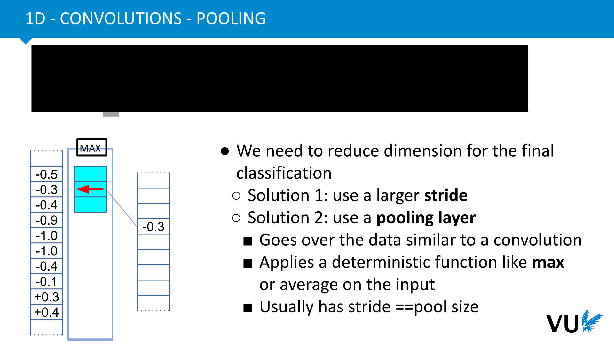

            <figcaption>
            
<strong><a href="|section|Conv2D, Conv3D, ConvND|
">|section|Conv2D, Conv3D, ConvND|
</a></strong>

<strong><a href="|video|https://www.youtube.com/embed/2hS_54kgMHs?si=UzbSrefM-CzrV0A4|
">|video|https://www.youtube.com/embed/2hS_54kgMHs?si=UzbSrefM-CzrV0A4|
</a></strong>
 
<strong><a href="In this third part, we aim to expand our understanding beyond one-dimensional convolution. Our goal is to delve into more intricate forms of data processing, such as two-dimensional convolution, three-dimensional convolution, and so forth. The motivation for venturing into higher dimensions is our desire to work with more diverse and intriguing types of data.
">In this third part, we aim to expand our understanding beyond one-dimensional convolution. Our goal is to delve into more intricate forms of data processing, such as two-dimensional convolution, three-dimensional convolution, and so forth. The motivation for venturing into higher dimensions is our desire to work with more diverse and intriguing types of data.
</a></strong>
 
            </figcaption>
            click image for animation
       </section>

       <section id="slide-063">
            <a class="slide-link" href="https://dlvu.github.io/cnns#slide-063" title="Link to this slide.">link here</a>
            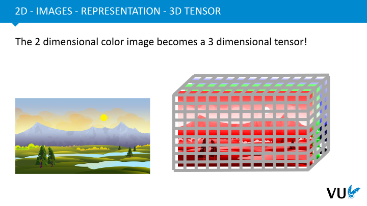

            <figcaption>
            
<strong><a href="|section|Conv2D, Conv3D, ConvND|
">|section|Conv2D, Conv3D, ConvND|
</a></strong>

<strong><a href="|video|https://www.youtube.com/embed/2hS_54kgMHs?si=UzbSrefM-CzrV0A4|
">|video|https://www.youtube.com/embed/2hS_54kgMHs?si=UzbSrefM-CzrV0A4|
</a></strong>
 
<strong><a href="In this third part, we aim to expand our understanding beyond one-dimensional convolution. Our goal is to delve into more intricate forms of data processing, such as two-dimensional convolution, three-dimensional convolution, and so forth. The motivation for venturing into higher dimensions is our desire to work with more diverse and intriguing types of data.
">In this third part, we aim to expand our understanding beyond one-dimensional convolution. Our goal is to delve into more intricate forms of data processing, such as two-dimensional convolution, three-dimensional convolution, and so forth. The motivation for venturing into higher dimensions is our desire to work with more diverse and intriguing types of data.
</a></strong>
 
            </figcaption>
       </section>

       <section id="slide-064">
            <a class="slide-link" href="https://dlvu.github.io/cnns#slide-064" title="Link to this slide.">link here</a>
            

            <figcaption>
            
<strong><a href="For instance, when we examine images, we've already observed that we move from two dimensions to three dimensions. In the case of images, we typically work with three color channels, often represented as RGB (red, green and blue). One way to conceptualize this is by envisioning an image as a three-dimensional tensor, which accommodates these three channels.
">For instance, when we examine images, we've already observed that we move from two dimensions to three dimensions. In the case of images, we typically work with three color channels, often represented as RGB (red, green and blue). One way to conceptualize this is by envisioning an image as a three-dimensional tensor, which accommodates these three channels.
</a></strong>
 
            </figcaption>
       </section>

       <section id="slide-065">
            <a class="slide-link" href="https://dlvu.github.io/cnns#slide-065" title="Link to this slide.">link here</a>
            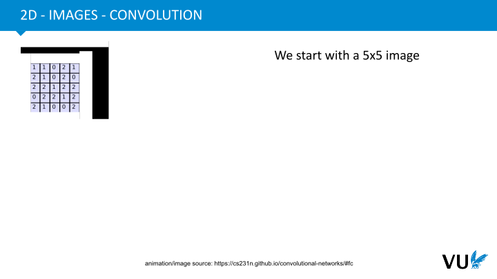

            <figcaption>
            
<strong><a href="As we dive into working with this type of data, it becomes apparent that our one-dimensional approach is no longer adequate. The complexity increases, particularly when dealing with video data.
">As we dive into working with this type of data, it becomes apparent that our one-dimensional approach is no longer adequate. The complexity increases, particularly when dealing with video data.
</a></strong>
 
            </figcaption>
       </section>

       <section id="slide-066">
            <a class="slide-link" href="https://dlvu.github.io/cnns#slide-066" title="Link to this slide.">link here</a>
            

            <figcaption>
            
<strong><a href="A video essentially transforms into a four-dimensional tensor because it comprises a sequence of images. This sequence of images, in turn, can be thought of as a sequence of tensors, culminating in a four-dimensional tensor representation.
">A video essentially transforms into a four-dimensional tensor because it comprises a sequence of images. This sequence of images, in turn, can be thought of as a sequence of tensors, culminating in a four-dimensional tensor representation.
</a></strong>
 
            </figcaption>
       </section>

       <section id="slide-067">
            <a class="slide-link" href="https://dlvu.github.io/cnns#slide-067" title="Link to this slide.">link here</a>
            

            <figcaption>
            
<strong><a href="In general, we aim to engage with this type of multidimensional data. To begin with, let's consider an example, a five-by-five image—a matrix of pixel intensities. It's essential to note that we don't deal with just one of these matrices; we have multiple color channels to take into account.
">In general, we aim to engage with this type of multidimensional data. To begin with, let's consider an example, a five-by-five image—a matrix of pixel intensities. It's essential to note that we don't deal with just one of these matrices; we have multiple color channels to take into account.
</a></strong>
 
            </figcaption>
       </section>

       <section id="slide-068">
            <a class="slide-link" href="https://dlvu.github.io/cnns#slide-068" title="Link to this slide.">link here</a>
            

            <figcaption>
            
<strong><a href="In this case, as explained in the example, we have three color channels to consider. Next, we move on to defining our filters. 
">In this case, as explained in the example, we have three color channels to consider. Next, we move on to defining our filters. 
</a></strong>
 
            </figcaption>
       </section>

       <section id="slide-069">
            <a class="slide-link" href="https://dlvu.github.io/cnns#slide-069" title="Link to this slide.">link here</a>
            

            <figcaption>
            
<strong><a href="In this specific example, we opt for two filters, but it's important to note that the number of filters can be chosen as needed. For filter W0, the first filter, it exhibits increased dimensions. This depiction illustrates a three-dimensional cube, with dimensions of three by three by three. The depth of this filter, the last dimension, aligns with the number of input channels available. Meanwhile, the width and height of the filter can be selected freely; in this case, it's three by three. However, it could have just as well been five by five, for instance. Additionally, it's worth mentioning that there's an explicit inclusion of a bias node, ensuring that the bias is accounted for.
">In this specific example, we opt for two filters, but it's important to note that the number of filters can be chosen as needed. For filter W0, the first filter, it exhibits increased dimensions. This depiction illustrates a three-dimensional cube, with dimensions of three by three by three. The depth of this filter, the last dimension, aligns with the number of input channels available. Meanwhile, the width and height of the filter can be selected freely; in this case, it's three by three. However, it could have just as well been five by five, for instance. Additionally, it's worth mentioning that there's an explicit inclusion of a bias node, ensuring that the bias is accounted for.
</a></strong>
 
            </figcaption>
       </section>

       <section id="slide-070">
            <a class="slide-link" href="https://dlvu.github.io/cnns#slide-070" title="Link to this slide.">link here</a>
            

            <figcaption>
            
<strong><a href="The challenges related to the boundaries of data persist when dealing with data in two or more dimensions. In two dimensions, such as in this case, we encounter not just the start and end of the data, but also the sides. For instance, when applying convolution at a corner point like this, it becomes evident that we require extra padding on both sides. Therefore, the approach is to add padding around the image, which, in this instance, involves adding one pixel of padding. This augmentation results in an input data size of seven by seven, rather than the original five by five.
">The challenges related to the boundaries of data persist when dealing with data in two or more dimensions. In two dimensions, such as in this case, we encounter not just the start and end of the data, but also the sides. For instance, when applying convolution at a corner point like this, it becomes evident that we require extra padding on both sides. Therefore, the approach is to add padding around the image, which, in this instance, involves adding one pixel of padding. This augmentation results in an input data size of seven by seven, rather than the original five by five.
</a></strong>
 
            </figcaption>
       </section>

       <section id="slide-071">
            <a class="slide-link" href="https://dlvu.github.io/cnns#slide-071" title="Link to this slide.">link here</a>
            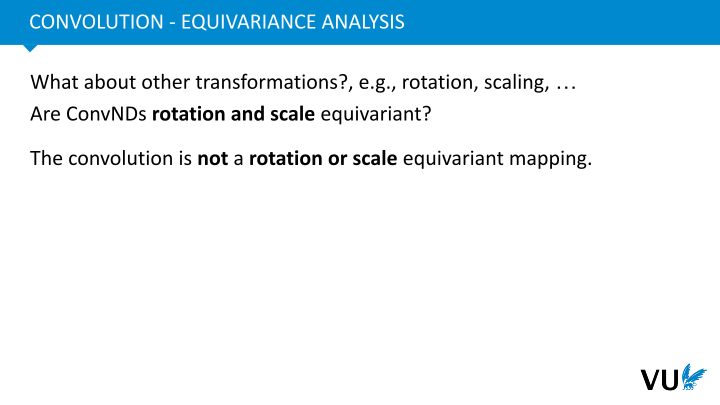

            <figcaption>
            
<strong><a href="Lastly, we must consider the nature of the outputs we're generating. The dimensions of our output depend on both our input size and the filter. In this particular scenario, we've applied a stride of 2. Before delving further into the topic, I recommend taking a brief pause to reflect or attempt to grasp the reasoning behind the resulting output dimensions. Moving forward, we'll explore the precise calculations that lead to these output dimensions.
">Lastly, we must consider the nature of the outputs we're generating. The dimensions of our output depend on both our input size and the filter. In this particular scenario, we've applied a stride of 2. Before delving further into the topic, I recommend taking a brief pause to reflect or attempt to grasp the reasoning behind the resulting output dimensions. Moving forward, we'll explore the precise calculations that lead to these output dimensions.
</a></strong>
 
            </figcaption>
       </section>

       <section id="slide-072">
            <a class="slide-link" href="https://dlvu.github.io/cnns#slide-072" title="Link to this slide.">link here</a>
            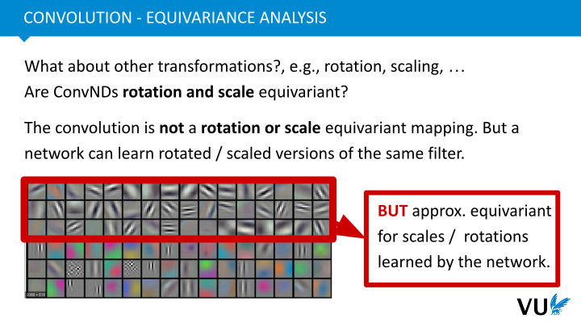

            <figcaption>
            
<strong><a href="Let's delve into a couple of intriguing characteristics. As we mentioned earlier, the concept of equivariance, especially in the context of images, is quite significant. In this example, we have an image on which we apply a 2D convolution, specifically an edge detection filter. This filter helps us detect certain features in the image.
">Let's delve into a couple of intriguing characteristics. As we mentioned earlier, the concept of equivariance, especially in the context of images, is quite significant. In this example, we have an image on which we apply a 2D convolution, specifically an edge detection filter. This filter helps us detect certain features in the image.
</a></strong>

<strong><a href="What's particularly interesting about this is the equivariance property of convolutions. When you first translate your input, such as moving the image to the right, and then apply our convolutional filter, you essentially obtain the same output, but it's shifted to the right as well. This property is crucial because it means that if certain features exist in your input, it doesn't matter where they are located. Your filter can detect these features regardless of their position. For instance, if you have a person in an image, it doesn't matter where within the image that person appears; your system or filter will identify it as a person.
">What's particularly interesting about this is the equivariance property of convolutions. When you first translate your input, such as moving the image to the right, and then apply our convolutional filter, you essentially obtain the same output, but it's shifted to the right as well. This property is crucial because it means that if certain features exist in your input, it doesn't matter where they are located. Your filter can detect these features regardless of their position. For instance, if you have a person in an image, it doesn't matter where within the image that person appears; your system or filter will identify it as a person.
</a></strong>

<strong><a href="This property is already visible in the formal definition. When we include the shift operation by using T0 in the convolution formula, we can observe that the result remains the same, but it is shifted by the same amount. This emphasizes the equivariance property of convolutions, making them an essential tool for recognizing features across different locations in an image.
">This property is already visible in the formal definition. When we include the shift operation by using T0 in the convolution formula, we can observe that the result remains the same, but it is shifted by the same amount. This emphasizes the equivariance property of convolutions, making them an essential tool for recognizing features across different locations in an image.
</a></strong>
 
            </figcaption>
       </section>

       <section id="slide-073">
            <a class="slide-link" href="https://dlvu.github.io/cnns#slide-073" title="Link to this slide.">link here</a>
            

            <figcaption>
            
<strong><a href="Let's discuss an interesting aspect related to the equivariance property. It's fascinating that features can occur anywhere in the data, but for images, there are other transformations we'd like our system to handle, such as rotation and scaling. We want the ability to recognize a person, for example, even if they're upside down, and this is where traditional convolutions have limitations. When you rotate an image, the filter doesn't function as effectively anymore, and it may fail to detect an upside-down person.
">Let's discuss an interesting aspect related to the equivariance property. It's fascinating that features can occur anywhere in the data, but for images, there are other transformations we'd like our system to handle, such as rotation and scaling. We want the ability to recognize a person, for example, even if they're upside down, and this is where traditional convolutions have limitations. When you rotate an image, the filter doesn't function as effectively anymore, and it may fail to detect an upside-down person.
</a></strong>

<strong><a href="This limitation poses a challenge because we need our system to be robust against various transformations, especially in computer vision applications. One approach to address this is training a convolutional neural network with permutations of the data. Essentially, you would take an image of a person and train the system not only with the original image but also with versions that have been rotated by 90 degrees, 180 degrees, and 270 degrees. By exposing the network to these multiple variations of the same data, you can enhance its robustness against rotation without fundamentally changing the system architecture.
">This limitation poses a challenge because we need our system to be robust against various transformations, especially in computer vision applications. One approach to address this is training a convolutional neural network with permutations of the data. Essentially, you would take an image of a person and train the system not only with the original image but also with versions that have been rotated by 90 degrees, 180 degrees, and 270 degrees. By exposing the network to these multiple variations of the same data, you can enhance its robustness against rotation without fundamentally changing the system architecture.
</a></strong>

<strong><a href="However, this approach has some drawbacks, as it requires training the model with many permutations of the same data, which can be computationally expensive and not very efficient in terms of data utilization.
">However, this approach has some drawbacks, as it requires training the model with many permutations of the same data, which can be computationally expensive and not very efficient in terms of data utilization.
</a></strong>
 
            </figcaption>
       </section>

       <section id="slide-074">
            <a class="slide-link" href="https://dlvu.github.io/cnns#slide-074" title="Link to this slide.">link here</a>
            

            <figcaption>
            
<strong><a href="Convolutional neural networks exhibit an interesting property in their filter design, even though they aren't explicitly designed to handle rotations. When we look at the filters in a convolutional network for images, we can observe that these filters represent what the network is detecting in the input data. For instance, some filters detect lines with a particular slope.
">Convolutional neural networks exhibit an interesting property in their filter design, even though they aren't explicitly designed to handle rotations. When we look at the filters in a convolutional network for images, we can observe that these filters represent what the network is detecting in the input data. For instance, some filters detect lines with a particular slope.
</a></strong>

<strong><a href="What's fascinating is that within the set of filters, you often find filters that are essentially rotations of each other. In other words, filters that detect lines with varying orientations. For instance, you might have a filter that detects lines with a particular slope, and another filter that detects lines with the opposite slope.
">What's fascinating is that within the set of filters, you often find filters that are essentially rotations of each other. In other words, filters that detect lines with varying orientations. For instance, you might have a filter that detects lines with a particular slope, and another filter that detects lines with the opposite slope.
</a></strong>

<strong><a href="This inherent property of the filters means that the convolutional network, while not explicitly designed for handling rotations, can still recognize them to some extent. As you go deeper into the network, you encounter higher-level features that also exhibit this ability to detect rotated versions of the underlying patterns. So, even though rotation robustness is not a primary design consideration, the network's architecture and filter diversity end up providing some level of rotation invariance.
">This inherent property of the filters means that the convolutional network, while not explicitly designed for handling rotations, can still recognize them to some extent. As you go deeper into the network, you encounter higher-level features that also exhibit this ability to detect rotated versions of the underlying patterns. So, even though rotation robustness is not a primary design consideration, the network's architecture and filter diversity end up providing some level of rotation invariance.
</a></strong>
 
            </figcaption>
       </section>

       <section id="slide-075">
            <a class="slide-link" href="https://dlvu.github.io/cnns#slide-075" title="Link to this slide.">link here</a>
            

            <figcaption>
            
<strong><a href="Group convolutions indeed address some of the challenges associated with parameter and data inefficiency in convolutional neural networks. In group convolutions, the idea is to share the pyramids not just for translation but also for other transformations like rotations and scaling. This approach results in extreme parameter sharing across the network.
">Group convolutions indeed address some of the challenges associated with parameter and data inefficiency in convolutional neural networks. In group convolutions, the idea is to share the pyramids not just for translation but also for other transformations like rotations and scaling. This approach results in extreme parameter sharing across the network.
</a></strong>

<strong><a href="By doing so, you make the network more efficient and data-efficient because it no longer requires explicit training on various transformations of the same data. It allows the network to generalize better across different transformations without explicitly observing them during training.
">By doing so, you make the network more efficient and data-efficient because it no longer requires explicit training on various transformations of the same data. It allows the network to generalize better across different transformations without explicitly observing them during training.
</a></strong>

<strong><a href="Group convolutions are particularly useful when working with data that can have multiple types of transformations or symmetries. They are often used in computer vision tasks to ensure that the network can handle different orientations, scales, and other transformations without the need for extensive data augmentation.
">Group convolutions are particularly useful when working with data that can have multiple types of transformations or symmetries. They are often used in computer vision tasks to ensure that the network can handle different orientations, scales, and other transformations without the need for extensive data augmentation.
</a></strong>
 
            </figcaption>
       </section>

       <section id="slide-076">
            <a class="slide-link" href="https://dlvu.github.io/cnns#slide-076" title="Link to this slide.">link here</a>
            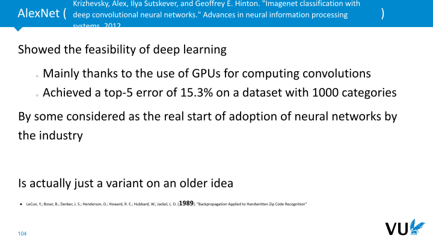

            <figcaption>
            
<strong><a href="As you mentioned, this parameter-efficient and data-efficient approach is an interesting and effective way to tackle the limitations of standard convolutions, which are mainly translation-invariant. Group convolutions can offer better results and more robustness in situations where multiple transformations need to be considered.
">As you mentioned, this parameter-efficient and data-efficient approach is an interesting and effective way to tackle the limitations of standard convolutions, which are mainly translation-invariant. Group convolutions can offer better results and more robustness in situations where multiple transformations need to be considered.
</a></strong>

<strong><a href="If you have any more specific questions or want to explore real-world examples of convolutional neural networks, please feel free to ask.
">If you have any more specific questions or want to explore real-world examples of convolutional neural networks, please feel free to ask.
</a></strong>
 
            </figcaption>
       </section>

       <section id="slide-077">
            <a class="slide-link" href="https://dlvu.github.io/cnns#slide-077" title="Link to this slide.">link here</a>
            

            <figcaption>
            
<strong><a href="This part is an example of a real-world convolutional neural network. Specifically, we will be looking at the network called AlexNet, employed for the task of image classification.
">This part is an example of a real-world convolutional neural network. Specifically, we will be looking at the network called AlexNet, employed for the task of image classification.
</a></strong>
 
            </figcaption>
       </section>

       <section id="slide-078">
            <a class="slide-link" href="https://dlvu.github.io/cnns#slide-078" title="Link to this slide.">link here</a>
            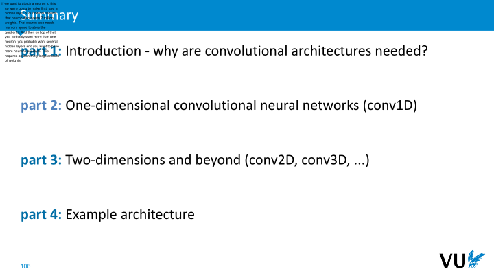

            <figcaption>
            
<strong><a href="AlexNet marked a pivotal moment in deep learning, and it's safe to say that it demonstrated the feasibility of this approach. In 2012, it triggered great developments in deep learning and broader machine learning fields. The primary driver behind AlexNet's remarkable performance, and that of similar architectures around that time, can be attributed to its adept utilization of GPUs for accelerating convolution computations.
">AlexNet marked a pivotal moment in deep learning, and it's safe to say that it demonstrated the feasibility of this approach. In 2012, it triggered great developments in deep learning and broader machine learning fields. The primary driver behind AlexNet's remarkable performance, and that of similar architectures around that time, can be attributed to its adept utilization of GPUs for accelerating convolution computations.
</a></strong>

<strong><a href="To elaborate, consider the intricacies of these convolutions. Each filter necessitates computing numerous dot products with the input image, demanding an immense computational load. This is where GPUs shine; they excel at executing these computations in parallel, thus greatly expediting convolution operations. The parallelization of tasks is executed with notable efficiency.
">To elaborate, consider the intricacies of these convolutions. Each filter necessitates computing numerous dot products with the input image, demanding an immense computational load. This is where GPUs shine; they excel at executing these computations in parallel, thus greatly expediting convolution operations. The parallelization of tasks is executed with notable efficiency.
</a></strong>

<strong><a href="The essence of this work revolved around harnessing the computational power of GPUs available at the time. What's truly astounding is the extent to which it outperformed other systems reliant on manual feature extraction. Achieving a top-five error rate of 15.3 percent on a dataset featuring a thousand categories is quite exceptional. Handling a thousand different categories is a daunting challenge as the probability of achieving correct classifications purely by chance in such a vast space is exceedingly small. This accomplishment signaled a significant turning point in the industry's acceptance of neural networks for practical applications.
">The essence of this work revolved around harnessing the computational power of GPUs available at the time. What's truly astounding is the extent to which it outperformed other systems reliant on manual feature extraction. Achieving a top-five error rate of 15.3 percent on a dataset featuring a thousand categories is quite exceptional. Handling a thousand different categories is a daunting challenge as the probability of achieving correct classifications purely by chance in such a vast space is exceedingly small. This accomplishment signaled a significant turning point in the industry's acceptance of neural networks for practical applications.
</a></strong>

<strong><a href="It's noteworthy that this work, although revolutionary, is essentially a modern reiteration of an older concept. This idea harks back to a study from 1989, nearly three decades prior, which initially targeted handwritten digit recognition. While the core technique remains consistent, this reimagining's clever adaptation for GPU acceleration makes it an emblem of technological advancement.
">It's noteworthy that this work, although revolutionary, is essentially a modern reiteration of an older concept. This idea harks back to a study from 1989, nearly three decades prior, which initially targeted handwritten digit recognition. While the core technique remains consistent, this reimagining's clever adaptation for GPU acceleration makes it an emblem of technological advancement.
</a></strong>

<strong><a href="Now, let's delve into an exploration of this network and dissect its architectural components, shall we?
">Now, let's delve into an exploration of this network and dissect its architectural components, shall we?
</a></strong>
 
            </figcaption>
       </section>

       <section id="slide-079">
            <a class="slide-link" href="https://dlvu.github.io/cnns#slide-079" title="Link to this slide.">link here</a>
            

            <figcaption>
            
<strong><a href="In this context, the initial input is a 227x227 pixel image with three color channels (RGB). The first layer involves a convolutional operation, similar to what we've discussed earlier. In this case, the convolutional filter is 11x11 in dimension and applies with a stride of four. To calculate the output volume dimensions, a formula subtracts the filter dimensions from the input dimensions and divides it by the stride, then adds one.
">In this context, the initial input is a 227x227 pixel image with three color channels (RGB). The first layer involves a convolutional operation, similar to what we've discussed earlier. In this case, the convolutional filter is 11x11 in dimension and applies with a stride of four. To calculate the output volume dimensions, a formula subtracts the filter dimensions from the input dimensions and divides it by the stride, then adds one.
</a></strong>

<strong><a href="This first layer employs 96 different filters or kernels to process the image, each with an 11x11 dimension. The result is the first output volume. Following this is an "overlapping max pool" layer, where the stride is set to two instead of three, creating a slight overlap. This process also reduces the dimensions of the volume.
">This first layer employs 96 different filters or kernels to process the image, each with an 11x11 dimension. The result is the first output volume. Following this is an "overlapping max pool" layer, where the stride is set to two instead of three, creating a slight overlap. This process also reduces the dimensions of the volume.
</a></strong>

<strong><a href="The network proceeds with another convolutional layer, this time using 5x5 filters with a padding of two and employing 256 of these filters. You can once more apply a similar formula to find the output volume dimensions in this case. This pattern continues with a max pooling layer, another convolutional layer, and so on.
">The network proceeds with another convolutional layer, this time using 5x5 filters with a padding of two and employing 256 of these filters. You can once more apply a similar formula to find the output volume dimensions in this case. This pattern continues with a max pooling layer, another convolutional layer, and so on.
</a></strong>

<strong><a href="As the network progresses, you'll notice it gradually evolves into a deep network with many filters. Finally, it applies fully connected layers, including two of them, culminating in a softmax function over a thousand dimensions. This sequence creates a deep neural network architecture.
">As the network progresses, you'll notice it gradually evolves into a deep network with many filters. Finally, it applies fully connected layers, including two of them, culminating in a softmax function over a thousand dimensions. This sequence creates a deep neural network architecture.
</a></strong>

<strong><a href="Exploring the "magic numbers" chosen for the filter dimensions—11, 3, 5, 3—might raise questions. While some aspects remain enigmatic, research is ongoing to gain a better understanding. It is known that smaller filters, such as 3x3 or 5x5, are typically more practical than larger ones. This is because smaller filters are stacked and, when examined recursively, impact a larger region of the image.
">Exploring the "magic numbers" chosen for the filter dimensions—11, 3, 5, 3—might raise questions. While some aspects remain enigmatic, research is ongoing to gain a better understanding. It is known that smaller filters, such as 3x3 or 5x5, are typically more practical than larger ones. This is because smaller filters are stacked and, when examined recursively, impact a larger region of the image.
</a></strong>

<strong><a href="Much of the development following the 2012 paper has involved experimenting with different network configurations, seeking incremental improvements.
">Much of the development following the 2012 paper has involved experimenting with different network configurations, seeking incremental improvements.
</a></strong>
 
            </figcaption>
       </section>

       <section id="slide-080">
            <a class="slide-link" href="https://dlvu.github.io/cnns#slide-080" title="Link to this slide.">link here</a>
            

            <figcaption>
            
<strong><a href="We've just explored the example of AlexNet, a deep architecture that relies on the fundamental concepts we've been discussing. Similar ideas underpin many other networks in this field.
">We've just explored the example of AlexNet, a deep architecture that relies on the fundamental concepts we've been discussing. Similar ideas underpin many other networks in this field.
</a></strong>

<strong><a href="Let's recap today's discussion. We began with an introduction, addressing the necessity of convolutional architectures. We delved into the one-dimensional case, examining why these architectures are indispensable. The primary reason is that using a multi-layer perceptron (MLP), as we've done previously, isn't feasible. An MLP grows too large, becomes impractical to train, and loses the ability to recognize features if they don't occur exactly in the same position as in the training data.
">Let's recap today's discussion. We began with an introduction, addressing the necessity of convolutional architectures. We delved into the one-dimensional case, examining why these architectures are indispensable. The primary reason is that using a multi-layer perceptron (MLP), as we've done previously, isn't feasible. An MLP grows too large, becomes impractical to train, and loses the ability to recognize features if they don't occur exactly in the same position as in the training data.
</a></strong>

<strong><a href="We used sound as an example to understand these concepts better. Subsequently, we extended our understanding to two-dimensional scenarios, applying similar principles like filters, padding, and deeper nested structures. We then scrutinized AlexNet, an example architecture, and mentioned that further developments exist in this field.
">We used sound as an example to understand these concepts better. Subsequently, we extended our understanding to two-dimensional scenarios, applying similar principles like filters, padding, and deeper nested structures. We then scrutinized AlexNet, an example architecture, and mentioned that further developments exist in this field.
</a></strong>

<strong><a href="The key takeaway from this presentation is the realization that deep learning models can autonomously extract features from data, and these models can be applied across higher dimensions.
">The key takeaway from this presentation is the realization that deep learning models can autonomously extract features from data, and these models can be applied across higher dimensions.
</a></strong>
 
            </figcaption>
       </section>

</article>
