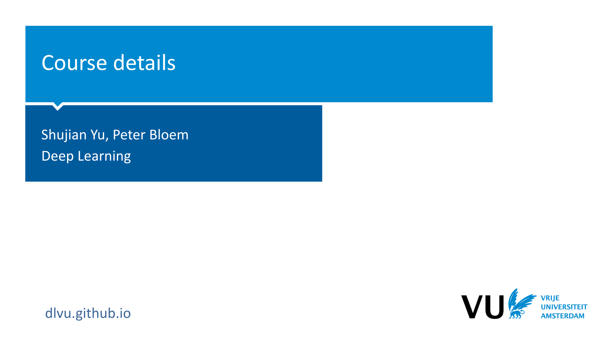
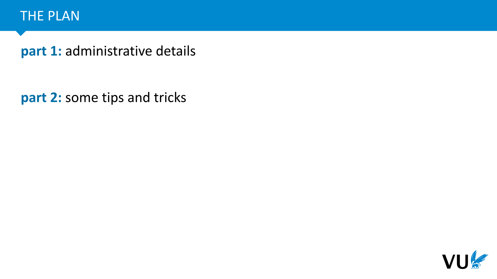
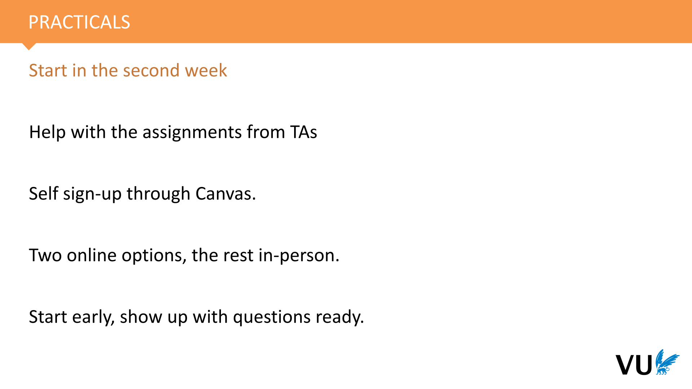
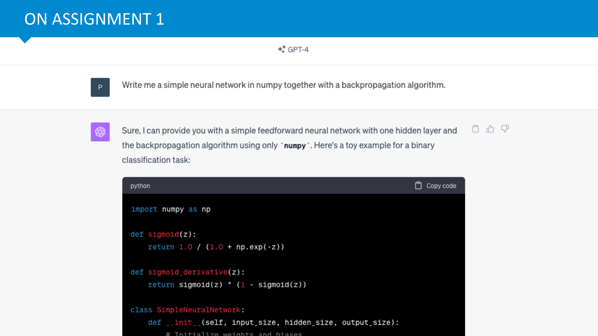

<nav class="menu">
    <ul>
        <li class="home"><a href="/">Home</a></li>
        <li class="name">Course Details</li>
                <li><a href="#video-000">Details</a></li>
                <li><a href="#slide-012">Tips and tricks</a></li>
        <li class="pdf"><a href="https://dlvu.github.io/pdfs/lecture0.course-details.annotated.pdf">PDF</a></li>
    </ul>
</nav>

<article class="slides">

       <section class="video" id="video-000">
           <a class="slide-link" href="https://dlvu.github.io/course-details#video-0">link here</a>
           <iframe
                src="https://www.youtube.com/embed/9dPKK6YJ9fg?si=Mj-j0c8oP94QjRQ3"
                title="YouTube video player"
                frameborder="0" allow="accelerometer; autoplay; clipboard-write; encrypted-media; gyroscope; picture-in-picture"
                allowfullscreen>
           </iframe>

       </section>

       <section id="slide-001">
            <a class="slide-link" href="https://dlvu.github.io/course-details#slide-001" title="Link to this slide.">link here</a>
            

            <figcaption>
            
 

|video-html|https://surfdrive.surf.nl/files/index.php/s/DCSyuGGoWRgK6TN/download| 

            </figcaption>
       </section>

       <section id="slide-002">
            <a class="slide-link" href="https://dlvu.github.io/course-details#slide-002" title="Link to this slide.">link here</a>
            

            <figcaption>
            
In these slides we will briefly lay out the main details of how the course works, and give you some tips on how to make effective use of what we offer. 

This is just the high level picture, so make sure to also read the Canvas page to get a complete picture.

            </figcaption>
       </section>

       <section id="slide-003">
            <a class="slide-link" href="https://dlvu.github.io/course-details#slide-003" title="Link to this slide.">link here</a>
            

            <figcaption>
            

            </figcaption>
       </section>

       <section id="slide-004" class="anim">
            <a class="slide-link" href="https://dlvu.github.io/course-details#slide-004" title="Link to this slide.">link here</a>
            

            <figcaption>
            

            </figcaption>
            click image for animation
       </section>

       <section id="slide-005">
            <a class="slide-link" href="https://dlvu.github.io/course-details#slide-005" title="Link to this slide.">link here</a>
            

            <figcaption>
            
Let’s start with your grade and work backwards from there.  

Your final grade consists of two parts: the assignments and the exam. You get one grade for each, both of which should be at least 5.5. If either is lower than a 5.5, you fail the course. If they are both 5.5 or higher, you pass, and your final grade is the average of these two.

            </figcaption>
       </section>

       <section id="slide-006">
            <a class="slide-link" href="https://dlvu.github.io/course-details#slide-006" title="Link to this slide.">link here</a>
            

            <figcaption>
            
The idea of the assignments is that you start by learning how to build a neural network from scratch, without using any libraries. Then whenever you learn to do something yourself, you are allowed to use a library to make your life a little easier. 

There are four assignments, each worth 10 points, for a total of 40 points. Getting 21 points corresponds to a 5.5, so you that’s the minimum you need to get. The assignments are designed to take about 2 weeks to finish. Note however, that this differs a lot per student, especially for the first assignment, so you should start early, to find out if you may need a little more time. 

The deliverable is just a PDF of your answers. You may include snippets of your code in the PDF, but you don’t hand in your codebase. You are required to follow a specific template that we provide.

            </figcaption>
       </section>

       <section id="slide-007">
            <a class="slide-link" href="https://dlvu.github.io/course-details#slide-007" title="Link to this slide.">link here</a>
            

            <figcaption>
            
Here is part of the first assignment. As you can see, it takes the form of a (slightly lengthy) document. You read through it and answer in detail any questions you come across. You do this in a document, which you turn into a PDF. You can add extras to the document, in the appendix, but it’s not guaranteed that we will look at them. If you want us to see what you did, put it in the answer to a question. 

You will occasionally find starred questions. These are questions that we expect to be challenging and that are not about core learning goals. If you are in a rush to meet the deadline, you can skip these, and still get a passing grade if you get the rest correct. Note, however, that <strong>these are not </strong><em>bonus questions</em>. You need to answer all of them if you want full marks. 

One approach would be to answer all non-starred questions first, and then making a second pass to see how many of the starred ones you can answer. Note that it’s perfectly fine to hand in a partially complete assignment. In the end you only need 5.25 points per assignment to pass. 
<aside    >Handing in late costs you 2 points per day, so if you mistimed things and the assignment isn’t finished by the deadline, it’s usually best to just hand in a partial assignment. </aside><aside    ></aside>
            </figcaption>
       </section>

       <section id="slide-008">
            <a class="slide-link" href="https://dlvu.github.io/course-details#slide-008" title="Link to this slide.">link here</a>
            

            <figcaption>
            
The practicals are on Thursday or Friday. You can find the schedule on Canvas (under Pages &gt; Practicals) and you can sign up to a group of your choice (under People &gt; Practicals). There are no practicals in the first week, to allow you to focus on theory. We do, however, strongly recommend that you start on the assignment today, so you can get a sense of whether you are likely to struggle with it. 

You don’t have to have finished the assignment before the practical, but you should have <em>started</em>. Make sure to show up to the practical with questions ready, or at least knowing which parts of the assignment you have difficulty with.

            </figcaption>
       </section>

       <section id="slide-009">
            <a class="slide-link" href="https://dlvu.github.io/course-details#slide-009" title="Link to this slide.">link here</a>
            

            <figcaption>
            
The main focus of the exam will be the lectures. You should concentrate on those if you want to pass. However, if you want to be sure that you won’t miss anything, you should also read the reading material. 

The nature of the questions will be recall, remembering what you read in the slides, and combination, reasoning about what you read in the slides. There will not be much heavy math or algorithmic detail, but there may be a small amount. The practice exam, available on Canvas, should be a good indicator. 

The number of points required to pass the exam (i.e. the number of points corresponding to a 5.5) will be determined <em>after</em> the exam. This allows us to correct for any questions that were too difficult, or that contained mistakes. It will not be lower than 20 and it will not be higher than 25. 
<aside    >Note that with a multiple choice exam, we must include a correction for random guessing, so that 10 points (the expected score under random guessing) should correspond roughly to the lowest possible grade (a 1). </aside>
You are allowed to make a cheat sheet for yourself. This is a single sheet of A4 paper, on which you may write whatever you like, using both sides, so long as it is written by hand.  
<aside    ></aside>
            </figcaption>
       </section>

       <section id="slide-010">
            <a class="slide-link" href="https://dlvu.github.io/course-details#slide-010" title="Link to this slide.">link here</a>
            

            <figcaption>
            
The main teaching form will be the lectures. There are about 12 of these. Each lecture consists primarily of<em> online material</em>, in the form of a set of annotated slides and a series of pre-recorded videos. These will cover all the material. 

The annotations and the videos may differ slightly as we update the material. The rule is that you can <em>either</em> watch the video or read the annotations. Or put differently we won’t ask something on the exam that only appeared in a video or that only appeared in an annotation.  
<aside    >Using both the annotations and videos is recommended, of course, but you don’t have to meticulously make sure you’ve covered both extensively. </aside>

            </figcaption>
       </section>

       <section id="slide-011">
            <a class="slide-link" href="https://dlvu.github.io/course-details#slide-011" title="Link to this slide.">link here</a>
            

            <figcaption>
            
Finally, if you’ve done the course before, you may notice some changes.  

First, We have a new coordinator and lecturer this year, Shujian. 
<aside    >We usually split the coordination duties between the three lecturers, but Shujian is the official person responsible for the course, and the person you should contact with any problems. </aside>
Second, we took this opportunity to review some of the material and change some of the lectures. This will be primarily in the second half. The changes in the first half are minimal. We are introducing some new topics as well, to keep up with the fast-moving field of deep learning. 

Third, we are committed this year to provide fully annotated slides for all lectures, so that you can read the material as well as watching the videos. We will offer these annotations in HTML on our website, together with the videos. This is a labor-intensive process, so please bear with us while we get everything ready. We’ll do our best to have each lecture prepared and online before its corresponding QA session. 

            </figcaption>
       </section>

       <section id="slide-012">
            <a class="slide-link" href="https://dlvu.github.io/course-details#slide-012" title="Link to this slide.">link here</a>
            

            <figcaption>
            
To finish up, here are some things to keep in mind as you start on this course. 

            </figcaption>
       </section>

       <section id="slide-013">
            <a class="slide-link" href="https://dlvu.github.io/course-details#slide-013" title="Link to this slide.">link here</a>
            

            <figcaption>
            
First, mathematics. Deep Learning is a mathematical field, and you need a solid basis to understand the details. I you don’t have that basis, it’s fine, but you should commit to catching up, not only to understand the mathematics, but to get properly comfortable with them. The only way to do this is through <a href="https://en.wikipedia.org/wiki/Practice_(learning_method)#Deliberate_practice">deliberate practice</a>. If you feel you’re behind on your math, you’ll need make time for this kind of practice outside of the time required for the course. 

The good news is that the preliminaries are pretty limited and well-defined. You can understand the vast majority of deep learning research with only a sound understanding of probability, partial derivatives and linear algebra. 

            </figcaption>
       </section>

       <section id="slide-014">
            <a class="slide-link" href="https://dlvu.github.io/course-details#slide-014" title="Link to this slide.">link here</a>
            

            <figcaption>
            
<a href="http://mlvu.github.io">mlvu.github.io</a> is the website for our BSc machine learning course. If you feel like you may not have the required background for Deep Learning, this is a good place to brush up. In particular, have a look at <a href="https://mlvu.github.io/preliminaries/">the preliminaries lecture</a>: it should help you to check if you have a decent grasp on the required mathematics.

            </figcaption>
       </section>

       <section id="slide-015">
            <a class="slide-link" href="https://dlvu.github.io/course-details#slide-015" title="Link to this slide.">link here</a>
            

            <figcaption>
            
The first assignment is standard fare for a deep learning course. So standard in fact, that ChatGPT (or even plain old Google) can do it for you in five minutes flat. We know this, and we can’t stop you. The important thing to realize is that <strong>assignment 2 and the ones that follow it </strong><em>aren’t</em><strong> standard</strong>. For most of them, GPT isn’t going to be able to do the hard work for you. And if you don’t put the work into assignment 1, you won’t understand assignment 2.  

So, in short, if you use ChatGPT for assignment 1, you will only be shooting yourself in the foot. Building a neural network from scratch, by yourself is a fundamental foundation that we are going to build on in the rest of the course. It’s also something that every Deep Learning practitiner has done at least once, so you shouldn’t deny yourself the experience. If you do, then the rest of the material simply won’t make sense and you will lack crucial experience that people will expect you to have, based on your diploma. 

Assignment 1 can be a tough exercise with lots of debugging and headscratching, so please start early, and give yourself time to struggle with it for while. It may be unpleasant, but it’s an important learning experience.

            </figcaption>
       </section>

       <section id="slide-016">
            <a class="slide-link" href="https://dlvu.github.io/course-details#slide-016" title="Link to this slide.">link here</a>
            

            <figcaption>
            
The deadlines for the assignments have a slightly irregular pattern. This is because the early assignments often take a little time to debug. Neural networks are fickle things to program, and you learn a lot by wrestling with one that doesn’t work. This isn’t the most fun part of the process, but it is very instructive.  

To allow you to go through this process without having to rush things, we have shifted the deadlines back by one week. Each assignment is designed to take two weeks, but you only have to hand in the first assignment after <em>three</em> weeks. Ideally, you will finish assignment 1 in two weeks, but if you run into a particularly knotty problem, you can take an extra week. 
<aside    >Hopefully, the extra time you take on the early exercises will make the later exercises easier. </aside>
The downside of this pattern is that we can only put one week in between the deadline of assignment 3 and that of assignment 4. This <em>doesn’t</em> mean that assignment 4 is easy, or that you can do it in one week. You should still try to spend about 2 weeks on each assignment.  
<aside    >Assignments 3 and 4 are done in groups, so that should allow a little more opportunity for working on both assignments in parallel.  </aside>
 

 

            </figcaption>
       </section>

       <section id="slide-017" class="anim">
            <a class="slide-link" href="https://dlvu.github.io/course-details#slide-017" title="Link to this slide.">link here</a>
            

            <figcaption>
            
Finally, if you have any further questions, you are free to get in touch with us about anything you like. We love to hear from you, but we do ask that you read the whole syllabus first. That is, the page you find under “Home” on Canvas. Read that from top to bottom, note the FAQ, and then ask anything you like. 

Then, note that if your question is of general use, you should ask it on the Discussion board. You will get a quicker and more thorough reply there than over email. 

<strong>Finally, do </strong><em>not</em><strong> use the Canvas messaging system to get in touch with us.</strong> Use email. If you use the canvas messaging system you will not get a reply (or at best a reply asking to email us). 

<em>It’s unfortunate that this is offered so prominently, and you are forgiven for thinking that this is the way to get in touch with a teacher, but the messaging system is worse than useless. It offers no useful way to maintain a messaging history, so we really need to avoid using it if we are going to manage hundreds of students.</em>

<em></em>

            </figcaption>
            click image for animation
       </section>

       <section id="slide-018">
            <a class="slide-link" href="https://dlvu.github.io/course-details#slide-018" title="Link to this slide.">link here</a>
            

            <figcaption>
            

            </figcaption>
       </section>

</article>
