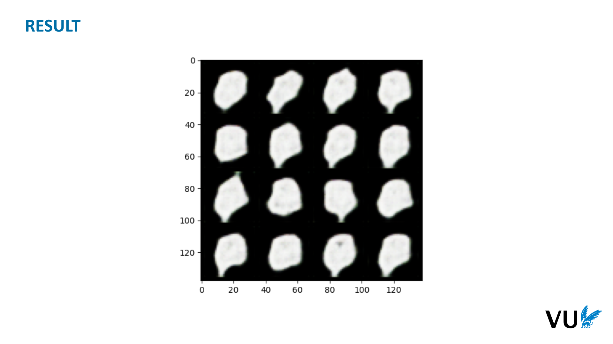
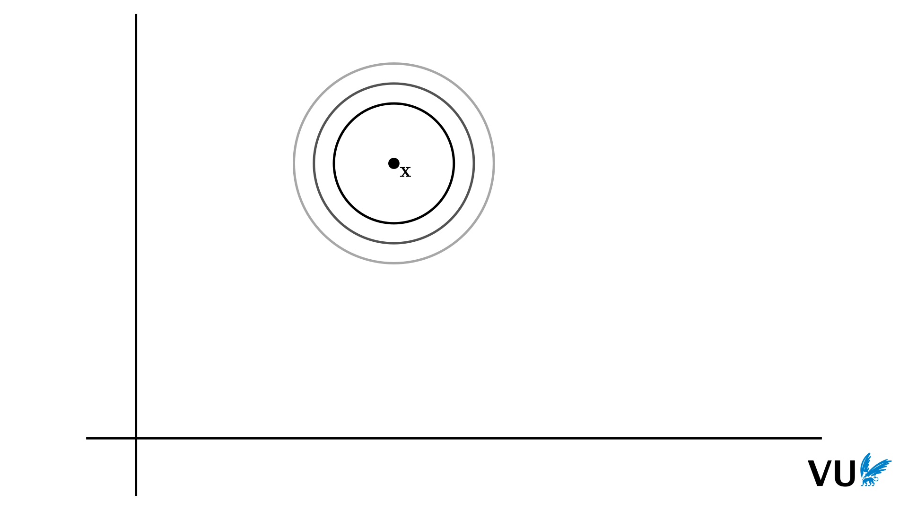

<nav class="menu">
    <ul>
        <li class="home"><a href="/">Home</a></li>
        <li class="name">Diffusion</li>
                <li><a href="#slide-005">Naive diffusion</a></li>
                <li><a href="#slide-022">Understanding Gaussians</a></li>
                <li><a href="#slide-049">Gaussian diffusion</a></li>
        <li class="pdf"><a href="https://dlvu.github.io/pdfs/lecture11.diffusion.annotated.pdf">PDF</a></li>
    </ul>
</nav>

<article class="slides">

       <section id="slide-001">
            <a class="slide-link" href="https://dlvu.github.io/diffusion#slide-001" title="Link to this slide.">link here</a>
            

            <figcaption>
            
This lecture is about <em>diffusion</em>, a technique for building generative models.

            </figcaption>
       </section>

       <section id="slide-002">
            <a class="slide-link" href="https://dlvu.github.io/diffusion#slide-002" title="Link to this slide.">link here</a>
            

            <figcaption>
            
Diffusion models behind most of the “AI image generators”, whose output these days populates social media…

            </figcaption>
       </section>

       <section id="slide-003">
            <a class="slide-link" href="https://dlvu.github.io/diffusion#slide-003" title="Link to this slide.">link here</a>
            

            <figcaption>
            
… and occasionally, the news.

            </figcaption>
       </section>

       <section id="slide-004" class="anim">
            <a class="slide-link" href="https://dlvu.github.io/diffusion#slide-004" title="Link to this slide.">link here</a>
            

            <figcaption>
            
We will first discuss a very simple version of the diffusion process, with all the math stripped away. This will help to illustrate how simple the basic idea is: it can be explained with (almost) no math at all. 

Next, to help us build an efficient and robust diffusion system, we will need to use <em>Gaussian noise</em>. This is noise from a Gaussian or normal distribution. To help us build diffusion on top of Gaussian noise, we will need to understand Gaussians very well, so we will spend a little time developing our intuition, and setting up the properties that we need. 

Then we will develop Gaussian diffusion, the basic principle behind modern diffusion systems like DALL·E, Midjourney and Stable Diffusion. 

            </figcaption>
            click image for animation
       </section>

       <section class="video" id="video-004">
           <a class="slide-link" href="https://dlvu.github.io/diffusion#video-4">link here</a>
           <iframe
                src=""
                title="YouTube video player"
                frameborder="0" allow="accelerometer; autoplay; clipboard-write; encrypted-media; gyroscope; picture-in-picture"
                allowfullscreen>
           </iframe>

       </section>

       <section id="slide-005">
            <a class="slide-link" href="https://dlvu.github.io/diffusion#slide-005" title="Link to this slide.">link here</a>
            

            <figcaption>
            
 

            </figcaption>
       </section>

       <section id="slide-006">
            <a class="slide-link" href="https://dlvu.github.io/diffusion#slide-006" title="Link to this slide.">link here</a>
            

            <figcaption>
            
This is the basic task of generative modeling: We are given a set of instances. In this case images, but they could also be sentences, bits of music or anything else we can think of. Given this dataset, our job is to produce a model that functions like a black box with a single button: we push the button and out pops an instance that looks like it belongs in the dataset.  

It shouldn’t literally come from the data, that would be overftting, but it should seem to follow the same distribution as the one we got the data from.

            </figcaption>
       </section>

       <section id="slide-007">
            <a class="slide-link" href="https://dlvu.github.io/diffusion#slide-007" title="Link to this slide.">link here</a>
            

            <figcaption>
            
Why does generative modeling require all these special tricks to apply deep learning to them? What makes it so difficult? 

The first reason is that it doesn’t come with explicit input/output pairs. Neural networks are functions from an input to an output. We can only start training them when we have an example of what a given output should look like for a given input. In generative modeling we don’t have that. We just want a sample from the data distribution, and we want a new sample every time. We don’t even know what the sample should be, so long as it looks like the data. 

To make the sample different each time, we need <em>randomness</em>. In some way, the model should consume random bits, and then it should translate these to an output sample. 

If we do this naievly, for instance, by randomly pairing up one noisy input with an instance in the data, and making the model predict one from the other, we get what is called <em>mode collapse</em>. Instead of producing different samples with high variety (for instance, a different digit every time), it produces the sample sample every time: the point that minimizes the average distance to all data points. Instead of producing variety, the model collapses to a single output. The big challenge in generative modeling is avoiding this kind of behavior.

            </figcaption>
       </section>

       <section id="slide-008" class="anim">
            <a class="slide-link" href="https://dlvu.github.io/diffusion#slide-008" title="Link to this slide.">link here</a>
            

            <figcaption>
            
Here is the the basic idea behind diffusion. We start with an image from the data, and we gradually, step by step, add a little noise to it. In this case we do that by picking a few random pixels and setting them to black or white at random. As we do this, the information in the original image gradually disappears, until we are left with an image that consists entirely of noise: each pixel is black or white with 50% probability, and there is no further structure. 

 We can then train a model to <em>reverse</em> this process. This is essentially a denoising model, something that neural networks have been able to do for decades. Note that we now have input/output pairs for our neural network. For each time step t we can just give it image t+1, and train it on how close the input is to the image at timestep t.  

It’s not possible to do this task perfectly, but for many of the noisy pixels, especially at the start of the diffusion process, you can see pretty well what it behind them, so we can at lest make an educated guess at most stages of the diffusion process. 

We call the image from our data <strong>x</strong>, and we call the sequence of noisy images <strong>z</strong>T. We use T to refer to the number of noising steps we apply, so <strong>z</strong>T is our final image. We set T to some high value where we’re sure that at that point every pixel has been corrupted at least once and no information from the original image remains.

            </figcaption>
            click image for animation
       </section>

       <section id="slide-009" class="anim">
            <a class="slide-link" href="https://dlvu.github.io/diffusion#slide-009" title="Link to this slide.">link here</a>
            

            <figcaption>
            
Then, when the time comes we essentially <em>fake</em> the process of denoising. For <strong>z</strong>T we know exactly what the distribution is. We can sample a new zT from this distribution very easily: we just create a new image, where we decide to set every pixel to black or white at random. This the same noisy image we would get if we took a sample from our data, and added noise to it bit by bit, exc ept in this case, there is no actuall image “behind” the noise. 

However, we still ask our model to “denoise” it. As the model starts to remove parts of the noise, it will begin to hallucinate small details to take the place of this noise. In the next step, these details replace what it hallucinates for the next noise to remove and so on. I everything works, at the end of the denoising process, the model has hallucinated an entire image, that looks like it came from our dataset.

            </figcaption>
            click image for animation
       </section>

       <section id="slide-010" class="anim">
            <a class="slide-link" href="https://dlvu.github.io/diffusion#slide-010" title="Link to this slide.">link here</a>
            

            <figcaption>
            
Here is the training and sampling process. 

During training, we follow the diffusion process, and add noise step by step. At each stage, we then immediately train the model for one step of gradient descent, to predict the previous image from the next one. We do this by running the model and comparing its output <strong>o</strong>t-1 to the true value for <strong>z</strong>t-1. For now, we will simply use the squared Euclidean distance between the two.  
<aside    >We’ll take a more principled approach to the loss later. For now we just work on the intuition that  <strong>o</strong>t-1 should be as close to <strong>z</strong>t-1 as possible so the distance between them should be a reasonable thing to minimize (and the squared distance is easier to work with, and remove a square root form the computation, so should give better gradients.).</aside><aside    ></aside>
            </figcaption>
            click image for animation
       </section>

       <section id="slide-011" class="anim">
            <a class="slide-link" href="https://dlvu.github.io/diffusion#slide-011" title="Link to this slide.">link here</a>
            

            <figcaption>
            
So, how do we set up the model? We need to map one image to another. This means that we cannot go with fully connected layers if we want to work on high-res images.  

For that reason, we want the kind of hourglass shape that we also saw in the variational autoencoder. We uses a series of convolutions and pooling operations to gradually work down to a low-resolution, high-dimensional representation, and then we reverse the process with transpose convolutions and upsampling.  
<aside    >A transpose convolution (sometimes called a deconvolution) is essentially a reverse convolution: where a convolution maps an input patch of k × k pixels to one output pixel, and transpose convolution maps one input pixel to a patch of output pixels. In both cases, we usually set them in such a way that the input and output resolutions are the same. A regular convolution would also work in the decoder stage (but the transpose provide a pleasing kind of structural symmetry). </aside>
This allows the model to learn powerful image-to-image functions. However, it also makes it difficult to learn certain very <em>simple</em> functions. For instance, in this case, the model needs to leave most of the image intact, and only remove a few noisy pixels. To output all the pixels that should stay the same, the model should encode them through all the convolutions and then decode them again. This is a complex function to learn, when all you want is to reproduce the input. 

For this purpose, we add <em>residual connections</em>. Before we send the input through the convolutions, we remember it, and then at the end, concatenate it to the input along the channel dimension, and project down to 3 channels with a simple 1x1 convolution.  
<aside    >In other settings it’s more common to add residual connections (like we saw in the transformer). As far as I can tell, you can do that here as well, without any loss in performance, but for some reason, the convention when building a UNet is to concatenate rather than add. </aside>
Note that UNets existed long before diffusion models. This is just the first time we’ve come across them in the course, so we introduce them here.

            </figcaption>
            click image for animation
       </section>

       <section id="slide-012">
            <a class="slide-link" href="https://dlvu.github.io/diffusion#slide-012" title="Link to this slide.">link here</a>
            

            <figcaption>
            
It help to tell the model at which point in time we are denoising, so we give it an extra argument t. We usually don’t show this in the notation, but you can assume it’s always there. 

It can also help a lot to tell the model at which point in<em> space </em>image it’s working.That is, the coordinates of the pixel to which a convolution is being applied. We’ve discussed before that convolutions are translation equivariant, which means they necessarily do the same thing regardless of where in the image they are applied. However, many things are very dependent on which part of the image you’re in. For example, if you’re generating portrait photos, your much more likely to generate a nose in the center of the image that in the top right. 

For both t and the pixel coordinates, we create <em>embeddings. </em>These are then added to the pixels before every convolution and transpose convolution.

            </figcaption>
       </section>

       <section id="slide-013" class="anim">
            <a class="slide-link" href="https://dlvu.github.io/diffusion#slide-013" title="Link to this slide.">link here</a>
            

            <figcaption>
            
Here is the result on a fairly quick experiment without too much tuning.  

The final step doesn’t exactly show recognizable digits, but it’s enough to indicate that the method has promise. 

            </figcaption>
            click image for animation
       </section>

       <section id="slide-014">
            <a class="slide-link" href="https://dlvu.github.io/diffusion#slide-014" title="Link to this slide.">link here</a>
            

            <figcaption>
            
What can we improve about this approach? 

One issue is that we are feeding examples to our model in sequence. It will first see a bunch of very unnoisy images from the start of the diffusion process, and then a bunch of noisy images. This causes learning to become unstable. For instance, the network might forget what it’s learned from the unnoisy images while it’s learning about the noisy images.  
<aside    >We know that neural networks suffer from catastrophic forgetting under slight changes in the data distribution. </aside>
For this reason, it would be better to pick a random t and train the neural network on the images at that point in time. However, in our current set up that would be expensive, since we would have to run the whole diffusion process up to point t, just for one sample. 
<aside    >We could work out the distribution on how many pixels are corrupted at time t, sample that and then corrupt that amount of pixels, but that would require a bit of math, and I promised no math in this section. </aside>
A second downside is that the model needs to identify which pixels are noise and then do something very different for those than for the other pixels. This is not what convolutions are good at. They are much better at doing the same thing to all pixels in parallel.  

Even worse, only some of the corrupted pixels were added in this noising step. Ideally, the model removes those, and leaves the rest as they are. But the model has no way to tell which is which. The best it can do is denoise all pixels<em> a bit</em>. 

 

            </figcaption>
       </section>

       <section id="slide-015">
            <a class="slide-link" href="https://dlvu.github.io/diffusion#slide-015" title="Link to this slide.">link here</a>
            

            <figcaption>
            
Before we more onto the alternative types of noise, here is one approach to diffusion that solves some of these problems.  

Instead of training the network to predict the next step in the denoising process, we train it to <em>fully denoise</em> the image. That is, we always predict <strong>x</strong> from <strong>z</strong>t, no matter how far along the noising process we are. 

For high t, the image will be so noisy that there isn’t much to predict, and the network will mode collapse to predicting mostly the data mean, possibly with very slight amount of variation. For low t, with little noise, it will be very easy for the model to make an almost perfect prediction.

            </figcaption>
       </section>

       <section id="slide-016">
            <a class="slide-link" href="https://dlvu.github.io/diffusion#slide-016" title="Link to this slide.">link here</a>
            

            <figcaption>
            
One thing we can now do is add noise one pixel at a time. We’ll keep track of which pixels we’ve already corrupted, and only corrupt pixels we haven’t corrupted before. This means we diffuse for exactly as many steps as we have pixels. This seems inefficient, but that turns out not to be the case. 

First, because during training, we can always easily sample <strong>z</strong>t<em> directly</em>. We just pick a random t between 0 and T, and corrupt t pixels of <strong>x</strong> chosen randomly (without replacement). 

Second, because our sampling algorithm works by denoising and renoising, we don’t need to sample with the same step size we did before. We can just denoise from level t=1000 and renoise at level t=900. This is a way to trade off sampling speed for quality.

            </figcaption>
       </section>

       <section id="slide-017">
            <a class="slide-link" href="https://dlvu.github.io/diffusion#slide-017" title="Link to this slide.">link here</a>
            

            <figcaption>
            
The idea is that during sampling, instead of denoising a little bit—from level t to level t-1—we fully denoise from level t , and then add some <em>noise back in </em>at level t-1<em>.</em> The idea is that the model doesn’t need to worry about modeling the noise (which in the case of binomial noise is hard to do for a unet). It can just predict the fully cleaned image and we’ll add some noise back using the noising operator we also used during training. 

The result is that we start with a very fuzzy prediction: If we feed the model a fully noisy image with no signal, all it can do is predict the data mean. Then, we renoise, hiding most of the image, except some very small details of the fuzzy image. There are different every time, so they may steer the model slightly towards a different outcome. The more noise we remove, the more the predictions serve to add detail, and the more the prediction moves away from the data mean and towards a specific sample. 

            </figcaption>
       </section>

       <section id="slide-018" class="anim">
            <a class="slide-link" href="https://dlvu.github.io/diffusion#slide-018" title="Link to this slide.">link here</a>
            

            <figcaption>
            
With that, here is our second diffusion algorithm in full. 

The parameter K lets us trade off sampling speed for image quality. 

            </figcaption>
            click image for animation
       </section>

       <section id="slide-019" class="anim">
            <a class="slide-link" href="https://dlvu.github.io/diffusion#slide-019" title="Link to this slide.">link here</a>
            

            <figcaption>
            

            </figcaption>
            click image for animation
       </section>

       <section id="slide-020">
            <a class="slide-link" href="https://dlvu.github.io/diffusion#slide-020" title="Link to this slide.">link here</a>
            

            <figcaption>
            
This kind of no-frills approach to diffusion is not just a teaching tool. It can actually be used to generate high-quality images. In this paper, the authors show that a simple noise function and a squared error loss (like we used) is often all you need. In fact, you don’t even need noise. You can gradually degrade the image by any means you can think of: evend slowly overlaying a picture of a random animal allows the diffusion process to work. 
<aside    >The authors use our second algorithm, with a slight adaptation required for work with non-noisy degradation operators.</aside><aside    ></aside>
            </figcaption>
       </section>

       <section id="slide-021" class="anim">
            <a class="slide-link" href="https://dlvu.github.io/diffusion#slide-021" title="Link to this slide.">link here</a>
            

            <figcaption>
            
That’s about as far as we can go without mathematics. In the remainder of the lecture, we will show how using Gaussian noise can solve many more of our problems. 

            </figcaption>
            click image for animation
       </section>

       <section class="video" id="video-021">
           <a class="slide-link" href="https://dlvu.github.io/diffusion#video-21">link here</a>
           <iframe
                src=""
                title="YouTube video player"
                frameborder="0" allow="accelerometer; autoplay; clipboard-write; encrypted-media; gyroscope; picture-in-picture"
                allowfullscreen>
           </iframe>

       </section>

       <section id="slide-022">
            <a class="slide-link" href="https://dlvu.github.io/diffusion#slide-022" title="Link to this slide.">link here</a>
            

            <figcaption>
            
 

 

Most diffusion models work on the basis of <em>Gaussian noise</em>. That is noise from a Gaussian or normal distribution. These distributions have many nice properties, that mean they are used a lot in machine learning. It can however, be a little daunting to work with Gaussians at first.

            </figcaption>
       </section>

       <section id="slide-023" class="anim">
            <a class="slide-link" href="https://dlvu.github.io/diffusion#slide-023" title="Link to this slide.">link here</a>
            

            <figcaption>
            
A big reason for this is that the function for the probability density is complex. This is usually how Gaussians are defined and how their basic properties are proved. We  can make things a lot simpler by forgetting about this formula, and defining Gaussians a slightly different way.

            </figcaption>
            click image for animation
       </section>

       <section id="slide-024">
            <a class="slide-link" href="https://dlvu.github.io/diffusion#slide-024" title="Link to this slide.">link here</a>
            

            <figcaption>
            

            </figcaption>
       </section>

       <section id="slide-025" class="anim">
            <a class="slide-link" href="https://dlvu.github.io/diffusion#slide-025" title="Link to this slide.">link here</a>
            

            <figcaption>
            
We start with the 1D standard normal distribution. That is, a single distribution which has its mean at zero, and which has a very simple shape.  

One of the main properties of the Gaussian is that it has a definite <em>scale</em>: it assigns some nonzero probability density to every point between negative infinity and positive infinity, but we can still say with strong certainty that a sample will be in the range [-1, 1], and with extreme certainty that a sample will be in the range [-10, 10]. This means, for instance, because people’s heights are roughly normally distributed, you may see the occasional people being 2m tall, and one person in history might have come close to being 3m tall, we will never see a 4m tall person. In short, this normal distribution are why doors are feasible.  
<aside    >Compare this to the distribution on wealth, for instance, which does not have this property: if we look at 10 times as many people, the maximum wealth in the population will always increase by about 10 as well. </aside>
To get a distribution like this, we can use exponential decay: every step of 1 we take away from 0, we multiply the density by a fixed number smaller than 1. The function e-|x|, or exp -|x|, is an example. the normal distribution adds even more decay by <em>squaring</em> the x. exp-x2.  

There are various reasons for this square: One is that with the square in there the curve has two <em>inflection points</em>. This is where the derivative flattens out and the curve goes from growing more quickly to growing more slowly (on the left) and from decaying more slowly to decaying more quickly (on the right). Because the peak is in between the two inflection points and that’s where the rate of change slows down, we get a “bulk” of probability mass in that range. In short this is a natural range to consider the scale of the normal distribution. 

We multiply by 1/2 before the square so that the inflection points land precisely on -1 and 1, which means that for the standard gaussian, the mean is at 0 and the bulk of the mass is in [-1, 1]. The variance also coincides with the positive inflection point, so that is 1. 

To make this a proper probability distribution, the density over the whole domain should sum to one. This is achieved by integrating the raw function exp-x2 and dividing the function by that result. However, to keep the formula simple, we can also just say that p(x) is proportional to  exp-x2. Whatever we multiply by to normalize, is a constant with respect to x, so we won’t need to worry about it. The function becomes even simpler if we only look at the log-probability density. In that case, it’s just a parabola (the normalization constant becomes an additive constant c). 

Note that we’re not introducing a mean or a variance (that would just complicate the formula). We’ll just stick with the single standard normal distribution and build on that for the time being.

            </figcaption>
            click image for animation
       </section>

       <section id="slide-026">
            <a class="slide-link" href="https://dlvu.github.io/diffusion#slide-026" title="Link to this slide.">link here</a>
            

            <figcaption>
            
Next, we define a Gaussian<strong> in d dimensions</strong>. That is, a distribution on vectors of <em>d</em> elements. Imagine that we sample d numbers xi independently from Ns1 and stick them in a vector <strong>x</strong>. The resulting distribution on <strong>x</strong>, we call Nsd (or just Ns if the dimension is clear from context). 

That is, the standard Gaussian in d dimensions just consists of d independent standard Gaussians, one along each axis.

            </figcaption>
       </section>

       <section id="slide-027" class="anim">
            <a class="slide-link" href="https://dlvu.github.io/diffusion#slide-027" title="Link to this slide.">link here</a>
            

            <figcaption>
            
What does the density of the standard Gaussian look like? When we sample x, each of its elements is sampled independently, so p(<strong>x</strong>) = p(x1) p(x2) … p(xd). We’ll look at the log density of this to make things simpler. The log density of xi under Ns1 is -1/2 xi2 plus come constant, so we get a sum of these for all xi. If we collect the squares into a sum, we see that this sum is equal to the squared length of <strong>x</strong>.  

What this tells us, is that all x that have the same length, have the same (log) density. This means that the contour lins of Ns2 form circles and in higher dimensions, the contour<em> surfaces</em> form hyper<em>spheres.</em> 

For this reason we call this type of distribution <em>spherical </em>(the word isotropic is also used).

            </figcaption>
            click image for animation
       </section>

       <section id="slide-028">
            <a class="slide-link" href="https://dlvu.github.io/diffusion#slide-028" title="Link to this slide.">link here</a>
            

            <figcaption>
            
With a little more reasoning (which we’ll skip), you can also work out that the smaller circles have higher density, and that the density decays with the diameter of the circle in the same way as it does in the 1D case. 

This means that the distribution in 2D roughly looks like a rotated version of the 1D curve.

            </figcaption>
       </section>

       <section id="slide-029">
            <a class="slide-link" href="https://dlvu.github.io/diffusion#slide-029" title="Link to this slide.">link here</a>
            

            <figcaption>
            
Next, we define the family of Gaussians. We will do this by assuming that we have a vector <strong>s</strong> which is drawn from a standard normal Gaussian in d dimensions. We then apply an affine transformation to s (that is, a matrix multiplication and a translation), resulting in the vector <strong>x</strong>. 

Obviously, if we know s, then x is fully determined. But what if I told you I had done this, but didn’t tell you what <strong>s</strong> I had drawn. What would the distribution p(<strong>x</strong>) be? We call this distribution a<em> Gaussian</em>. The matrix A and the vector t function (for the time being) as the parameters of this Gaussian. 
<aside    >Note that we are using this as a definition of what a Gaussian is. In other contexts, you may see the Gaussian defined differently (in terms of that horrible formula) and then the fact that they are all affine transformations of Ns is a property of Gaussians. Here we use it as a definition, in order to simplify the construction of the Gaussians. </aside>
For our definition, it is not necessary that <strong>A</strong> is square. However, any Gaussian defined by a non-square <strong>A</strong>, can also be defined by a square <strong>A</strong><strong> </strong>(possibly with <strong>s</strong> of a different dimension), so we will limit ourselves mostly to square <strong>A</strong>s in this lecture.

            </figcaption>
       </section>

       <section id="slide-030" class="anim">
            <a class="slide-link" href="https://dlvu.github.io/diffusion#slide-030" title="Link to this slide.">link here</a>
            

            <figcaption>
            
How should we visualize these Gaussians? A simple way is to think of all the points inside a circle under Ns. This circle will be mapped to an ellipse by <strong>A</strong> and <strong>t</strong>. 
<aside    >In higher dimensions, we call these ellipsoids. </aside>
If, say, 68% of the points s fall inside the inner circle, then they will all be mapped to the inner ellipse on the right. This means that 68% of the points <strong>x</strong> will fall inside the inner ellipse. 

In short, the general Gaussian is not spherical.  

<strong>question: </strong>What would <strong>A</strong> and <strong>t</strong> need to look like for the distribution on the right to be spherical as well?

            </figcaption>
            click image for animation
       </section>

       <section id="slide-031" class="anim">
            <a class="slide-link" href="https://dlvu.github.io/diffusion#slide-031" title="Link to this slide.">link here</a>
            

            <figcaption>
            
Next, we can ask about some of the properties of these Gaussians. For example, the mean. 

The mean is defined as the expected value of the distribution. That is, what does the average of a sample converge to for an increasing sample size? 
<aside    >Again, the mean is normally part of the definition of a Gaussian, but we’re flipping it around. We’ve already defined the Gaussian, so now we’re studying the mean as a property. </aside>
We use two properties in this derivation. First, that the Expected value is a <em>linear function</em>. That means that any matrix multiplication and vector addition can be taken out of the mean in the same way we would take it out of a set of brackets.  

The second is that the mean of the standard Gaussian is <strong>0 </strong>(that is, the 0-vector). This follows from the fact that the elements of <strong>s</strong> are independently sampled, so the expected value of <strong>s</strong> is the vector made up of the expected values of its elements. And the expected value of Ns1 is 0. 

The end result is that the mean of a Gaussian (<strong>A</strong>, <strong>t</strong>) is equal to <strong>t</strong>. 
<aside    > </aside><aside    ></aside>
            </figcaption>
            click image for animation
       </section>

       <section id="slide-032" class="anim">
            <a class="slide-link" href="https://dlvu.github.io/diffusion#slide-032" title="Link to this slide.">link here</a>
            

            <figcaption>
            
Next, the covariance. Again, think of this as a <em>property</em> of any multivariate distribution not (necessarily) a parameter. 

The covariance matrix of p(<strong>x</strong>) collects the variance of all the elements of <strong>x</strong> along the diagonal and the covariance of any two elements on the off-diagonal elements. This tells us what the covariance matrix of <strong>s</strong> is: the variances are all 1, because all elements are distributed according to Ns1, and the covariances are all 0, because all elements are independently drawn. In short, the covariance matrix of <strong>s</strong> is the identity matrix. 

We can now work out what the covariance matrix of a Gaussian (<strong>A</strong>, <strong>t</strong>) is. We use the definition that the covariance matrix of p(<strong>x</strong>) is the expected outer product of (<strong>x</strong> - <strong>μ</strong>), where <strong>μ</strong> is the mean of p(<strong>x</strong>).  

In the previous slide, we worked out that <strong>μ</strong> = <strong>t</strong>, so if we fill in the definition of <strong>x</strong> in terms of <strong>s</strong>, the translation term <strong>t</strong> and the <strong>μ</strong> cancel out. Next, we are left with two matrix multiplications. Working these out of the expectation, we are left with E<strong>ss</strong>T, which is the covariance of the standard Gaussian, which is I, so it disappears.  

The end result is that the covariance of the Gaussian (<strong>A</strong>, <strong>t</strong>) is <strong>AA</strong>T.

            </figcaption>
            click image for animation
       </section>

       <section id="slide-033">
            <a class="slide-link" href="https://dlvu.github.io/diffusion#slide-033" title="Link to this slide.">link here</a>
            

            <figcaption>
            
Because A and t transform so simply to the mean and the covariance (and back) this means we can now use the mean and covariance as a name for the Gaussian as well (we have a simple method for translating one type of name to another). 

The mean and covariance is, of course, the traditional way of parametrizing the Gaussians. It has one benefit over the affine transformation: the mean and covariance are <em>unique names</em>. The affine transformation naming scheme has many names for the same Gaussian. 
<aside    >Consider for instance what we get if we use a rotation matrix and <strong>t</strong>=0. </aside><aside    ></aside>
            </figcaption>
       </section>

       <section id="slide-034">
            <a class="slide-link" href="https://dlvu.github.io/diffusion#slide-034" title="Link to this slide.">link here</a>
            

            <figcaption>
            
One thing that is going to be important when we build diffusion models is the subset of Spherical Gaussians. These are Gaussians that retain the property of the standard Gaussian that all the contour lines are circles, spheres or hyper-spheres. 

We achieve this if <strong>A</strong> scales each dimension uniformly (that is by the same amount). In other words, if <strong>A</strong> is the identity matrix <strong>I</strong> times some scalar σ.  
<aside    >There are other matrices that also lead to spherical Gaussians (again, consider rotations), but if we limit ourselves to As that are a scalar times the identity matrix, we can define all spherical Gaussians.  </aside>
Following what we derived earlier, this shows that the covariance matrix is <strong>I</strong> times σ2.  

By seeing what happens in the 1D case, we can see that these are natural analogues of the variance and the standard deviation, and we will name them as such. That is, even though a d-dimensional distribution doesn’t have a single variance or standard deviation, in a spherical distribution the variance and standard deviation are the same in all direcitions, so in this specific case, we can talk about a single scalar variance and standard deviation.

            </figcaption>
       </section>

       <section id="slide-035">
            <a class="slide-link" href="https://dlvu.github.io/diffusion#slide-035" title="Link to this slide.">link here</a>
            

            <figcaption>
            
To finish up our discussion, we will look at 4 properties of Gaussians that will help us to define the Gaussian diffusion process.

            </figcaption>
       </section>

       <section id="slide-036">
            <a class="slide-link" href="https://dlvu.github.io/diffusion#slide-036" title="Link to this slide.">link here</a>
            

            <figcaption>
            
We start with the simplest one. We already know that, by definition, an affine transformation of the standard Gaussian is a Gaussian. If we combine this with the fact that the composition of two affine transformation is another affine transformation, we can show that the affine transformation of any Gaussian (standard or not) yields another Gaussian. 

Say that we have a Gaussian G and and affine transformation (<strong>A</strong>, <strong>t</strong>). What we want to show is that sampling from G and applying (A, t) results in a Gaussian. 

Sampling from G is, by definition, equivalent to sampling from Ns and then transforming by some affine transformation (<strong>B</strong>,<strong>t</strong> in the slides). All we are doing then, is applying another affine transformation (<strong>A</strong>, <strong>t</strong>) after that. The composition of two affine transformations is another affine transformation, so what we are doing is equivalent to sampling from Ns and then applying a single affine transformation. By our definition, this is a Gaussian. 
<aside    >As the slides show, the combined affine transformation is<strong> </strong>(<strong>A</strong><strong>B</strong><strong>, </strong><strong>A</strong><strong>q</strong><strong> </strong>+<strong> </strong><strong>t</strong>).</aside><aside    ></aside>
            </figcaption>
       </section>

       <section id="slide-037" class="anim">
            <a class="slide-link" href="https://dlvu.github.io/diffusion#slide-037" title="Link to this slide.">link here</a>
            

            <figcaption>
            
Here’s a slightly more involved one to prove: if we take samples x and y from two separate Gaussian, their sum is also distributed as a Gaussian. 
<aside    >Note that this is distinct from taking the probability density functions of two Gaussians and summing them (the result of which is a mixture-of-gaussians). </aside>
The way to show this, and to work out what the parameters of the resulting Gaussian are, is to frame this process as an affine transformation. If we fill in the definitions of <strong>x</strong> and <strong>y</strong>, we get an affine transformation in two variables <strong>s</strong>1 and <strong>s</strong>2. We can rephrase this as an affine transformation in a single variable, by simply concatenating <strong>A</strong> and <strong>B</strong> horizontally and <strong>s</strong>1 and <strong>s</strong>2 vertically.  

Finally, we can see that the concatenation of  <strong>s</strong>1 and <strong>s</strong>2 is a standard Gaussian vector. This is because we defined a standard Gaussian vector as one whose elements were sampled independently from Ns1. The elements of <strong>s</strong>1 and <strong>s</strong>2 were each sampled indepently, so <strong>s</strong> must also be standard Gaussian. 

The result is that z is an affine transformation of a standard Gaussian, so it must be a Gaussian. 

Note, however, that this doesn’t give us as nice a definition as we have found so far: the problem is that we are defining z as an affine transformation of Gaussian noise <strong>s</strong>, but <strong>s</strong> has twice as many dimensions as <strong>z</strong>. In our previous definitions <strong>s</strong> always had the same number of dimensions as the resulting variable.  

The solution is to work out the covariance matrix. This is a unique parametrization of this Gaussian on <strong>z</strong>, so it must be square.

            </figcaption>
            click image for animation
       </section>

       <section id="slide-038" class="anim">
            <a class="slide-link" href="https://dlvu.github.io/diffusion#slide-038" title="Link to this slide.">link here</a>
            

            <figcaption>
            
To get the covariance matrix matrix, we need to work out what we get if we multiply (<strong>A B</strong>) by its transpose.  
<aside    >Note that (<strong>A B</strong>)T flips the matrix along its diagonal. This means that the height and width become reversed. </aside>
The result is <strong>AA</strong>T + <strong>BB</strong>T, the sum of the two covariances of the original two distributions. 

If we want to translate this back to an affine transformation, we will need to find a square matrix <strong>C</strong>, such that <strong>CC</strong>T is equal to this expression. Happily this is always possible (usually in a few ways), using operations like a Eigen- or Cholesky decomposition (note that is <strong>AA</strong>T + <strong>BB</strong>T symmetric) 

 

            </figcaption>
            click image for animation
       </section>

       <section id="slide-039" class="anim">
            <a class="slide-link" href="https://dlvu.github.io/diffusion#slide-039" title="Link to this slide.">link here</a>
            

            <figcaption>
            
This operation, summing two Gaussian variables, will become especially important in the context of spherical Gaussians.  

Applying the rule we derived in the previous slide, we can see how to work out the sum of two Gaussians in the affine transformations notation: we take the two variances (the sigma’s without a square), we square them, then sum them then take the square root again. 
<aside    >We recommend that you memorize this rule as well as understanding it.</aside><aside    ></aside>
            </figcaption>
            click image for animation
       </section>

       <section id="slide-040" class="anim">
            <a class="slide-link" href="https://dlvu.github.io/diffusion#slide-040" title="Link to this slide.">link here</a>
            

            <figcaption>
            
The third property, we’ll call <em>chaining</em> Gaussians. This is when we take a sample from one Gaussian, and make it the mean of another Gaussian. 

This happens, for instance, if you take one noisy measurement, and use it in another noisy process. For example if I measure the length of one plank of wood, and then try  cut another plank of wood at that length, the length of the resulting plank of wood will be a combination of how poorly I measured the first plank and how poorly I made my cut. If both processes are Gaussian, what we’d like to show, is that the resulting distribution on the length of the second plank has and acceptable variance, and that the mean of the whole process is equal to the length of the first plank, so that at least on average the planks are the same length.

            </figcaption>
            click image for animation
       </section>

       <section id="slide-041">
            <a class="slide-link" href="https://dlvu.github.io/diffusion#slide-041" title="Link to this slide.">link here</a>
            

            <figcaption>
            
We can think of this as a <em>convolution</em> of two Gaussians. Each possible measurement x contributed some probability density to the final point y, proportional to how likely x is to be measured. Adding up (or rather integrating) all these bits of probability density, will give us the answer. 
<aside    >We call this a convolution, because we’re sliding one Gaussian along the horizontal axis, and taking a (weighted) “sum” of all the copies we encounter. </aside>
Of course, this is not an easy integral to work out, especially if we want to move to higher dimensions. Instead, we will take a geometric perspective again.

            </figcaption>
       </section>

       <section id="slide-042" class="anim">
            <a class="slide-link" href="https://dlvu.github.io/diffusion#slide-042" title="Link to this slide.">link here</a>
            

            <figcaption>
            
Here’s what the picture looks like in N dimensions. Writing the two Gaussians as transformations of standard Gaussian noise, shows how we can solve this puzzle: we just plug the definition of <strong>x</strong> into the definition of <strong>y</strong>.

            </figcaption>
            click image for animation
       </section>

       <section id="slide-043">
            <a class="slide-link" href="https://dlvu.github.io/diffusion#slide-043" title="Link to this slide.">link here</a>
            

            <figcaption>
            
Doing this gives us <strong>y</strong> as a function of two vectors of standard Gaussian noise <strong>s</strong>1 and <strong>s</strong>2. The trick here, is that we can interpret this as the sum of two Gaussians (one with mean <strong>t</strong>, and one with mean <strong>0</strong>). 

We’ve seen already how to combine these into a a single Gaussian. We sum the means, and the covariances. 

The result is that our distribution on <strong>y</strong> has <strong>t</strong> as a mean, and the sum of the two covariances for its covariance matrix. 
<aside    >In the example of cutting a plank, we see that we do in deed get two planks of the same length on average, and the sum of the variances of our measuring and our cutting needs to make an acceptable error margin for the final product.</aside><aside    ></aside>
            </figcaption>
       </section>

       <section id="slide-044" class="anim">
            <a class="slide-link" href="https://dlvu.github.io/diffusion#slide-044" title="Link to this slide.">link here</a>
            

            <figcaption>
            
As before, the story becomes much simple in the spherical case. Here, we just square and sum the variances and then take the square root.

            </figcaption>
            click image for animation
       </section>

       <section id="slide-045">
            <a class="slide-link" href="https://dlvu.github.io/diffusion#slide-045" title="Link to this slide.">link here</a>
            

            <figcaption>
            
The KL divergence, written here as an expectation, expresses how “similar” two probability distributions are. If the are exactly the same, the KL divergence is 0, and the more they differ, the bigger it gets. 
<aside    >It’s relevant to us, because the quantity we’re actually interested in optimizing (the data log-likelihood under our model) can often be rewritten into one or more KL divergences, as we saw earlier with the VAE. </aside>
For this to lead to a loss function we can use, we need a closed-form expression for the KL divergence. The formula here is no good to us, because the expectation isn’t necessarily computable. We need an expression that we cannot just compute quickly, but that we can backpropagate through (remember, this will be our loss function). 

This is our final reason for liking Gaussians: the KL divergence between two Gaussians has a simple closed-form expression.  

 

            </figcaption>
       </section>

       <section id="slide-046">
            <a class="slide-link" href="https://dlvu.github.io/diffusion#slide-046" title="Link to this slide.">link here</a>
            

            <figcaption>
            
We will make use of the following useful property: the expected value between random vector <strong>x</strong> and constant vector <strong>y</strong>, if <strong>x</strong> is distributed according to a spherical Gaussian, is the squared distance between <strong>y</strong> and the mean of the Gaussian, plus d times the variance. 
<aside    >If you’ve following the derivation, note that on line 5 we make use of the fact that E<strong>s</strong>T<strong>s </strong>= d (where d is the dimension of <strong>s</strong>). You can work this out by writing the dot product as a sum, and working the expectation inside the sum. Then note that E si2 is the variance of Ns1, which we know to be 1.</aside><aside    ></aside>
            </figcaption>
       </section>

       <section id="slide-047" class="anim">
            <a class="slide-link" href="https://dlvu.github.io/diffusion#slide-047" title="Link to this slide.">link here</a>
            

            <figcaption>
            
Now, to the KL divergence. 

We won’t work it out for general Gaussians (although it exists), we will just show a simple case: the KL loss for two spherical Gaussians, in terms of the means. We will assume that our model only controls the mean of one of the Gaussians, so that we can ignore any terms that are constant with respect to that mean. 

In the first line, we expand the logarithm over the two Gaussians, and remove any terms that don’t contain <strong>μ</strong>, which is the term we assume we’re optimizing. Then we work the expectations inside as shown. 

To line 2, we can apply the property from the last slide, resulting inline 3 as shown. The second term reduces to a constant, and the first to a constant (in <strong>μ</strong>) plus a constant, times the distance between <strong>μ </strong>and <strong>ν</strong>, which is the fundamental property that we should be minimizing. 
<aside    >This should make some intuitive sense: to make two spherical Gaussians as similar as possible to one another, without changing their variances: align their means. </aside>

            </figcaption>
            click image for animation
       </section>

       <section id="slide-048">
            <a class="slide-link" href="https://dlvu.github.io/diffusion#slide-048" title="Link to this slide.">link here</a>
            

            <figcaption>
            

            </figcaption>
       </section>

       <section class="video" id="video-048">
           <a class="slide-link" href="https://dlvu.github.io/diffusion#video-48">link here</a>
           <iframe
                src=""
                title="YouTube video player"
                frameborder="0" allow="accelerometer; autoplay; clipboard-write; encrypted-media; gyroscope; picture-in-picture"
                allowfullscreen>
           </iframe>

       </section>

       <section id="slide-049">
            <a class="slide-link" href="https://dlvu.github.io/diffusion#slide-049" title="Link to this slide.">link here</a>
            

            <figcaption>
            
 

 

At last, we are ready to start building Gaussian diffusion models.

            </figcaption>
       </section>

       <section id="slide-050">
            <a class="slide-link" href="https://dlvu.github.io/diffusion#slide-050" title="Link to this slide.">link here</a>
            

            <figcaption>
            
There are many different ways to do this, and many state-of-the art models add their own little tweak and touches to the derivation. 

We will focus on this specific approach. The first to show that diffussion models could be trained to do the things we’d seen models like GANs do, like generate realistic human faces. Besides being very powerful, this model is also remarkable for its simplicity. More powerful models have been published since, but this is probably the best in terms of its tradeoff of simplicity and performances, so it’s a good model to use as a foundation of your understanding of diffusion models. 
<aside    >If you are continuing in diffusion models after this lecture, perhaps for your thesis, then we suggest carefully following all the steps in the derivation of this model, and then seeing how other models deviate.</aside><aside    ></aside>
            </figcaption>
       </section>

       <section id="slide-051">
            <a class="slide-link" href="https://dlvu.github.io/diffusion#slide-051" title="Link to this slide.">link here</a>
            

            <figcaption>
            
Here is the picture of diffusion models that we’ve built up so far. We add noise to an image, slowly erasing the information in it step by step, and then we train a model to reverse this process. 

The key feature that made this work is that the noise we converge to in the diffusion is a known distribution that we can easily sample from.  

We also saw that a nice property to have was if we can sample the noisy image <strong>z</strong>t at time step t directly rather than explicitly having to go to t steps of diffusion. We will require both these properties from our Gaussian noise process.

            </figcaption>
       </section>

       <section id="slide-052" class="anim">
            <a class="slide-link" href="https://dlvu.github.io/diffusion#slide-052" title="Link to this slide.">link here</a>
            

            <figcaption>
            
Here is what Gaussian noise looks like. 
<aside    >We will model our data as color images, even though this particular dataset is black and white. We don’t have to do this, but it isn’t difficult for the model to learn that the images should always be black and white, and it’s visually a little more interesting.</aside><aside    ></aside>
            </figcaption>
            click image for animation
       </section>

       <section id="slide-053" class="anim">
            <a class="slide-link" href="https://dlvu.github.io/diffusion#slide-053" title="Link to this slide.">link here</a>
            

            <figcaption>
            
Here is what that looks like in 2 dimensions. We start with a Gaussian that is centered on <strong>x</strong> (that is, <strong>x</strong> is its mean). We then sample <strong>z</strong>1 from that distribution. This is an image that will looks like a noisy version of <strong>x</strong>. We then repeat the process, we create a Gaussian that is centered on <strong>z</strong>1, sample from that and so on.  

This is, of course, the Gaussian chaining that we talked about in the last part. So we know that our distribution on <strong>z</strong>t is a Gaussian. 

Currently, the variance of this Gaussian grows bigger with every step we take, and the mean stays at <strong>x</strong>, so we’re not really removing information from x very effectively. We’ll fix that by slightly tweaking the process.

            </figcaption>
            click image for animation
       </section>

       <section id="slide-054" class="anim">
            <a class="slide-link" href="https://dlvu.github.io/diffusion#slide-054" title="Link to this slide.">link here</a>
            

            <figcaption>
            
Here’s how we can write down this diffusion process.  

What we need it for our process to converge to a single, know Gaussian that we can sample from. This can be any Gaussian, but it would be neatest if this was the <em>standard</em> Gaussian. We’ll see what we need to do to achieve that.

            </figcaption>
            click image for animation
       </section>

       <section id="slide-055">
            <a class="slide-link" href="https://dlvu.github.io/diffusion#slide-055" title="Link to this slide.">link here</a>
            

            <figcaption>
            
The first thing we need is for the mean to go to <strong>0</strong>. We can achieve this with a simple trick. Instead of putting the next Gaussian right on top of the previous sample, we first shrink the sample a bit, by multiplying it by some value, γ, between 0 and 1. 
<aside    >Note that the Gaussian chaining property still applies: this shrinking is an affine operation, so we are still chaining Gaussians. </aside>
This shrinking creates a kind of force that steadily pulls the mean to <strong>0</strong>. It’s reasonable to assume that this will cause the process to converge to a zero-mean distribution, but we should really prove that. Additionally, we should work out what to set the variance to at each step, so that the distribution converges to variance 1.

            </figcaption>
       </section>

       <section id="slide-056" class="anim">
            <a class="slide-link" href="https://dlvu.github.io/diffusion#slide-056" title="Link to this slide.">link here</a>
            

            <figcaption>
            
To work this, we will write down the first couple of <strong>z</strong>t, and rewrite them in terms of <strong>x</strong>. To do this, we can apply the same principle that we used to show the chaining property was true. We write each <strong>z</strong> as an affine transformation of the previous <strong>z</strong> and some Gaussian noise <strong>s</strong>. We then plug in the definition of the previous z, and work this into a function of <strong>x</strong> and a single standard noise vector <strong>s</strong>. 
<aside    >Remember, to combine two standard noise vectors <strong>s</strong>1 and <strong>s</strong>2, we square their variances, sum, and square-root to get the variance for a single standard noise vector <strong>s</strong>. </aside>
By <strong>z</strong>3, the pattern (hopefully) becomes clear: the scalar in front of <strong>x</strong> is just γ to the power of t. The variance is a sum with t terms, where each term is our chosen standard deviation σ, times γ to the power of i, where i increases in steps of 2.

            </figcaption>
            click image for animation
       </section>

       <section id="slide-057" class="anim">
            <a class="slide-link" href="https://dlvu.github.io/diffusion#slide-057" title="Link to this slide.">link here</a>
            

            <figcaption>
            
With this, we can work out what to set σ to so that the variance of <strong>z</strong>t converges to 1.  

They key is to recognize that the sum on the right-hand-side is a standard geometric sum in for γ2 which a closed form expression is known. With that, we can rewrite and figure out what σ2 should be.

            </figcaption>
            click image for animation
       </section>

       <section id="slide-058">
            <a class="slide-link" href="https://dlvu.github.io/diffusion#slide-058" title="Link to this slide.">link here</a>
            

            <figcaption>
            
In practice, it turns out that it’s better to take big steps at the start of the diffusion process, and smaller steps at the end. This is because denoising is easier if you can see more of the image. That mean that the start of the process, we can ask the mode to remove more noise, which we achieve by taking bigger steps there. This means we can take smaller steps at the end, when it’s more difficult for the model to figure out what is “behind” the noise.

            </figcaption>
       </section>

       <section id="slide-059">
            <a class="slide-link" href="https://dlvu.github.io/diffusion#slide-059" title="Link to this slide.">link here</a>
            

            <figcaption>
            
We achieve this by setting a noise <em>schedule</em>. We use a different value for each timestep, and ensure that these decrease with t. 

If all of these are smaller than 1, we can be sure that the process still converges to mean 0, but what should we set the variance to at each step to ensure that we get a standard Gaussian at the end? A lucky guess might be the same value we got earlier: one minus the square of γ, except now to do this at each timestep for the specific γt we used. 

Let’s see if that guess pays off.

            </figcaption>
       </section>

       <section id="slide-060" class="anim">
            <a class="slide-link" href="https://dlvu.github.io/diffusion#slide-060" title="Link to this slide.">link here</a>
            

            <figcaption>
            
We proceed as before, by writing out the definitions of the first few <strong>z</strong>t, and plugging the previous <strong>z</strong>t into the definition of the next. 

The result is more complex, but not by much.  

To get the mean of zt, x is scaled by the product of all γt  so far. The scalar in front of <strong>s</strong> is once again a sum of t terms. Each term i consists of the variance use at time i times all the square of the γt's used after time i.

            </figcaption>
            click image for animation
       </section>

       <section id="slide-061" class="anim">
            <a class="slide-link" href="https://dlvu.github.io/diffusion#slide-061" title="Link to this slide.">link here</a>
            

            <figcaption>
            
Finally, we need to show that if we set each to the value of one minus the square of the gamma used at t, we get the desired result (a variance that goes to 1). 

The key is to realize that if we multiply out the brackets, we get a <em>telescoping sequence</em>. We show it here for t=4, but it works for all t. Each term before we multiply our the brackets yields two terms afterwards one with the squared γt's from i to t and one with the squared γt's from i+1 to t. Since i increments by 1 each term, the first term we create by multiplying our one set of brackets will be equal to the second term we generate by multiplying out the next set of brackets. This is true for every set of brackets, so that we end up only with the final 1 and the full sequences of squared γt’s from the first term. 

This tells us that the variance of <strong>z</strong>t can be expressed as one minus the square of the product of γt all so far, which goes to 0, so the variance goes to 1. 

            </figcaption>
            click image for animation
       </section>

       <section id="slide-062">
            <a class="slide-link" href="https://dlvu.github.io/diffusion#slide-062" title="Link to this slide.">link here</a>
            

            <figcaption>
            
So there we have it: a noise step for our diffusion process that generally affects all pixels to some extent, that can be easily sampled at time t and that converges to standard noise as t increases.

            </figcaption>
       </section>

       <section id="slide-063" class="anim">
            <a class="slide-link" href="https://dlvu.github.io/diffusion#slide-063" title="Link to this slide.">link here</a>
            

            <figcaption>
            
The next thing we want is a <em>principled loss</em>. Instead of just appealing to intuition, and minimizing the squared distance between two fairly arbitrarily chosen images, we are going to start with a well-chosen principle, and derive from this a loss that we can optimize.  

The principle we choose, just as we did with the VAE, is <em>maximum likelihood</em>: we should try to set the parameters of our UNet so that the probability of our data is as high as possible. 
<aside    >And that high probability density should transfer to our validation and test data (so that we are not overfitting). </aside>
To keep things simple we will 

Only state the  maximum likelihood objective for one instance <strong>x</strong>. It would be more correct to maximize the likelihood for the whole dataset, or even better to maximize the expected likelihood of one instance sampled from the data distribution, but there we will just do what we always do in deep learning: loop over the individual instances (or batches of instances) and follow the gradient of the loss for these with stochastic gradient descent. In short, this part of the approach is exactly the same for generative models as it is for classification or regression, so we will start with the maximum likelihood objective for a single instance. 

Take the negative log-likelihood as a starting point. As we noted before, we put a logarithm in front of a probability (density) to help with the math and the numerical stability, and we put a minus in front because we are looking for a quantitiy to <em>minimize</em>. 

The next question is, what is the probability of <strong>x</strong> under our model? In this view the entire denoising chain, from sampling zt all the way to the final x is a process that we call p. p is controlled by the parameters of our UNet, which we collectively call θ. Our job is to set θ so that this whole sampling chain is as likely as possible to generate our training, validation and test data. 

Note the subtle, but fundamental change in perspective. Before we started by assuming that there was a diffusion process. Now, we never refer to it in our objective. If we could optimize this objective function directly, we would never need to worry about the existince of a diffusion process at all. All we would need, would be the denoising process. 

As it is, we cannot easily optimize this function directly, so we bring in the diffusion process, and call it q.  
<aside    >This is similar to the way we set up a VAE: we start with just a generator network (also known as the decoder) and we bring in asecond network to help us optimize it. </aside><aside    ></aside>
            </figcaption>
            click image for animation
       </section>

       <section id="slide-064" class="anim">
            <a class="slide-link" href="https://dlvu.github.io/diffusion#slide-064" title="Link to this slide.">link here</a>
            

            <figcaption>
            
To fit this picture we need to slightly adapt our UNet, or at least our perspective on it. The UNet should now compute the function p(zt-1|zt). That is, instead of giving us a single guess for what picture preceded zt, it gives us a probability distribution on the whole space of possible images. 

Practically, this isn’t as involved as it sounds. The simplest way to achieve this is to treat the output of the UNet as a mean of a probability distribution. We will combine this with a variance to get a spherical Gaussian on zt-1. is a hyperparameter that we schedule manually. 
<aside    >It’s not too difficult to also have the network output a variance, as we do in the VAE. This is often done as well, but in Ho et al, which we follow here, the UNet only outputs a mean.</aside><aside    ></aside>
            </figcaption>
            click image for animation
       </section>

       <section id="slide-065">
            <a class="slide-link" href="https://dlvu.github.io/diffusion#slide-065" title="Link to this slide.">link here</a>
            

            <figcaption>
            
So, here’s the situation: we want to rewrite the negative log probability density of the data into something we can compute and that we can backpropagate through. The functions that we can easily compute are  

under p (our model): 

the density of <strong>z</strong>t conditioned on <strong>z</strong>t+1 

the density of <strong>z</strong>T (the last step in our diffusion process) which we assume to be standard Gaussian noise. 

under q (the diffusion process which we will bring in) 

the density of <strong>z</strong>t conditioned on <strong>z</strong>t-1 

the density of <strong>z</strong>t conditioned on <strong>x </strong>

In our derivation, we will make use of the properties of continuous expectation, and of Jensen’s inequality. The latter is a general rule about what happens when you take the sum of points on a concave function, versus summing first and then applying the function. In our case, we need a specific consquence of Jensen’s inequality, which is that if we are working with the logarithm, a concave function, of an expectation, a sum or integral, then moving the logarithm inside the expectation changes the value, but it makes it strictly larger. 
<aside    >We will use this in the same way we did in the VAE. We can’t work this loss into something we can compute, but we can compute a lower bound using Jensen’s inequality. Maximizing the lower bound (or minimizing its negative) will, if the lower bound is good enough, also maximize the thing we’re lower-bounding.</aside><aside    ></aside>
            </figcaption>
       </section>

       <section id="slide-066" class="anim">
            <a class="slide-link" href="https://dlvu.github.io/diffusion#slide-066" title="Link to this slide.">link here</a>
            

            <figcaption>
            
Here is our full derivation. Step by step: 

1: We can get to a particular x by many different sequences of denoising steps. If we call this sequence of intermediate pictures <strong>ẑ</strong>, then the total probability is the probability of x given a particular <strong>ẑ</strong>, integrated over all possible <strong>ẑ</strong>. In probability theory jargon: we start with the joint probability of <strong>x</strong> andf the <strong>ẑ</strong> that generated it, and then we marginalize out <strong>ẑ</strong> to get our loss. 

2: We use the chain rule of probability to decompose the joint probability into the product of all probabilities of zt given its successor. This is a very common approach in sequence modeling. If you’ve never seen it before, have a look at <a href="https://mlvu.github.io/lecture11/#slide-013"><strong>these slides</strong></a>.  

3: We feed in the diffusion process. There is not much intuition here, except that we’re allowed to do this because the factor we add in is equal to 1. Note that this probability is slightly different than the one under p, because here x only appears in the conditional. The reason is that we want q to correspond to our diffusion process in which <strong>x</strong> is given and we sample <strong>ẑ</strong>. 

4: We move the numerator out in front, and the denominator we decompose in the same was as we did with p. This gives us a factor q(<strong>z</strong>t | <strong>z</strong>t-1) for every factor p(<strong>z</strong>t-1|<strong>z</strong>t). I recommend trying this with a short sequence on pen an paper, to see that it works out this way. 

5: The probability next to the integral shows that we have created an <em>expectation</em>. Specifically, the expected value of some probabilities multiplied together, under our diffusion process. This is relevant, because we can estimate expectations by sampling, and we can easily sample from our diffusion process. In short, this is starting to look like something we can estimate. 

6: Just as with the VAE, we use Jensen’s inequality to move the logarithm inside the expectation. This turns the quantity we’re working out into an upper bound of the quantity we actually want to minimize. <em>This is called the evidence lower bound or ELBO (it’s a lower bound if you take the perspective that you’re maximizing the probability of the data).</em> 

7, 8: Next, we work out all the log factors separately. In our case, only the terms containing p(<strong>z</strong>t-1|<strong>z</strong>t) are affected by the parameters. The rest are constants, so we can ignore them without affecting the gradients we ultimately get. 

9: We open up the formula for the Gaussian that our model outputs. Because of the logarithm and our assumption that the variance τt is constant, the only term that is influenced by the parameters is the squared euclidean distance. The multiplicative constant should be included if we’re strict (since it’s different for different t), but it’s often found that the algorithm performs better if we ignore it and tune the learning rate carefully. 

 

            </figcaption>
            click image for animation
       </section>

       <section id="slide-067">
            <a class="slide-link" href="https://dlvu.github.io/diffusion#slide-067" title="Link to this slide.">link here</a>
            

            <figcaption>
            
If we move the sum outside the expectation, a very simple algorithm presents itself. We will take this sum of expectations and optimize one term at a time. That is, we pick a random t and optimize only the term corresponding to t.  

In that  case, the expectation over the whole sequence <strong>ẑ</strong> reduces to the marginal distribution on <strong>z</strong>t-1 and <strong>z</strong>t. These we can sample easily to estimate the expectation.  

Finally, we just compute the squared Euclidean distance between <strong>z</strong>t-1 and the model output and backpropagate that. 

This is, of course, what we were doing already. You may ask what the point of all this is, if we just end up where we started, when the original idea was already obvious. One benefit of this derivation, is that it tells us how to adapt the model in a rigorous way. We can, for instance, decide not to ignore the variance of the distribution that the model outputs. Or, we can make that variance an output of the model instead of a hyperparameter. In such cases, all we have to do is follow the derivation and see how the loss function changes as a result.

            </figcaption>
       </section>

       <section id="slide-068">
            <a class="slide-link" href="https://dlvu.github.io/diffusion#slide-068" title="Link to this slide.">link here</a>
            

            <figcaption>
            
The version of our algorithm in the last slide was used in early diffusion models. It worked, but it suffered from high variance: that is, the loss differed a lot from one sample to the next. This isn’t surprising: we do a lot of sampling, and everything we sample to estimate some expectation that we want to compute, increases the variance. There is one place where we can replace a sample with a more direct computation.  

In the algorithm we have now, we sample <strong>z</strong>t-1 and then we maximize the probability density of <strong>z</strong>t-1 under p (given <strong>z</strong>t). What if, instead, we could work out the probability distribution that q puts on <strong>z</strong>t-1 given <strong>z</strong>t and just tell our model to get as close to that distribution as possible? Comparing two probability distributions to each other should lead to less variance than comparing one probability distribution to a sample from another distribution.  

The problem is that q(<strong>z</strong>t-1|<strong>z</strong>t) is the opposite direction of how we can easily compute q. We can try to flip the conditional around with Bayes’ rule, but it turns out this doesn’t lead to a tractable distribution. To see why, imagine that the data can come from two points <strong>x</strong> and <strong>x</strong>’ as shown in the image. What we want to know is the distribution on <strong>z</strong>t-1 given <strong>z</strong>t. If we started with x, then this <strong>z</strong>t-1 is very likely, since the diffusion process mostly follows a straight line towards the origin. However, if we start with x’, then all the probability mass is on the line between x’ and the origin, and this <strong>z</strong>t-1 is very unlikely.  

The takeaway is that the distribution q(<strong>z</strong>t-1|<strong>z</strong>t) is highly dependent on the shape of the distribution on <strong>x</strong>. This distribution is first of all highly complex, and second of all unknown (it’s what we’re trying to learn). 

However, what we also see is that if we condition on which x we started with, the resulting distribution q(<strong>z</strong>t-1|<strong>z</strong>t, <strong>x</strong>)  is actually quite simple. In fact, with a little analysis, it turns out that this distribution is a Gaussian.

            </figcaption>
       </section>

       <section id="slide-069">
            <a class="slide-link" href="https://dlvu.github.io/diffusion#slide-069" title="Link to this slide.">link here</a>
            

            <figcaption>
            
The derivation itself is a little complex so we’ll skip it here, but these are the parameters of the resulting Gaussian. 

Note that the mean looks like a random value itself, but that isn’t what’s happening here. What we have done is to remove <strong>x</strong> from the formula by remembering the specific gaussian noise <strong>s</strong>t that we sampled when we generated <strong>z</strong>t. So, what we are looking at is just a function of know values. In other words, this function doesn’t work for general zt and x, but it we generated <strong>z</strong>t from <strong>x</strong> (as we do in sampling from our diffusion process), then we can use this formula if we remember the specific Gaussian noise we used. 

So now we have a distribution to compare out model’s output distribution to, not just a single point. But how do we work this into the loss? We wanted to work from first principles, so we can’t just start comparing these two distributions arbitrarily. We will have to go back to our derivation, and take a slightly different route.

            </figcaption>
       </section>

       <section id="slide-070" class="anim">
            <a class="slide-link" href="https://dlvu.github.io/diffusion#slide-070" title="Link to this slide.">link here</a>
            

            <figcaption>
            
Here is the derivation.  

1: In the first line, we have already followed some steps from the original derivation, including marginalizing in <strong>ẑ</strong>, working in q, and turning the integral into an expectation. Note that we have not applied Jensen’s inequality yet (the logarithm is still outside the expectation). 

2: We note that q(<strong>z</strong>t|<strong>z</strong>t-1) is equal to q(<strong>z</strong>t|<strong>z</strong>t-1, x). This is because <strong>z</strong>t is independent of x when contioned on <strong>z</strong>t-1.Put simply, if we already know <strong>z</strong>t-1 then also knowing <strong>x</strong> doesn’t give us extra information. So adding <strong>x</strong> to the conditional doesn’t change anything. It will however change things when we use Bayes’ rule to flip the conditional around. 

3: We separate the first factor from our product. This will help us later on.<em> </em>

4: Next, we flip the conditional in the denominator of our product using Bayes’ rule. We flip around <strong>z</strong>t and <strong>z</strong>t-1, and keep <strong>x</strong> in the conditional for all factors. 

5: Note that this extra factor that we got from Bayes’ rule “telescopes” over the factors. That is, every z that appears in the numerator as <strong>z</strong>t-1 will appear in the denominator as <strong>z</strong>t in the next factor. All of these cancel out, against each other, except the first  and the last, which we take out of the sum. 

6: We cancel the the two q(<strong>z</strong>1|<strong>x</strong>)’s 

7: We apply Jensen’s and separate out three terms for our loss function as shown. 

8: We now recognize that almost all terms are KL divergences. That is, they naturally express the similarity between two Gaussian distributions. Only the first term is a log-probability of <strong>x </strong>given the final image in our denoising process <strong>z</strong>1. 

 

            </figcaption>
            click image for animation
       </section>

       <section id="slide-071" class="anim">
            <a class="slide-link" href="https://dlvu.github.io/diffusion#slide-071" title="Link to this slide.">link here</a>
            

            <figcaption>
            
Looking at this loss function, let’s see what we have. The middle term doesn’t have any parameters, so we can ignore it. The first term is an odd duck. What Ho et al do is to train a separate model for this part, which tells us how to generate <strong>x</strong> given <strong>z</strong>1. Note that <strong>z</strong>1 is almost completely denoised, so this model has an easy job.  
<aside    >The main reason for this separate decoder is that Ho et al. want to evaluate their model in the number of bits it uses to represent an image. This is a great evaluation metric (see <a href="https://mlvu.github.io/lecture04/#video-067"><strong>here</strong></a> for an explanation), but it requires a discrete distribution on your space of images, while the Gaussian is continuous. Ho et al. use this extra term as an opportunity to translate to a discrete representation of images. </aside>
For the final term (or rather T-2 terms), we can fill in what we worked out earlier about the KL divergence for two spherical Gaussians: as a function of the means the KL divergence is just the (scaled) squared euclidean distance plus some constants that don’t affect our gradients. 

Ho et al find that they get better results by ignoring the scaling factor, but other authors prefer to include it. We’ll ignore it for the sake of simplicity and just minimize the squared Euclidean distance as we did already for the naive diffusion. 

What has changed from the previous algorithm? There we also took the output of the model and computed a squared distance. The difference is in what we compute the distance <em>to</em>. Previously, that was the sample zt-1, Now, we compute the distance to the mean of the distribution on <strong>z</strong>t-1. By not sampling <strong>z</strong>t-1 but looking instead at the mean of its distribution, we are reducing the variance of our loss.

            </figcaption>
            click image for animation
       </section>

       <section id="slide-072" class="anim">
            <a class="slide-link" href="https://dlvu.github.io/diffusion#slide-072" title="Link to this slide.">link here</a>
            

            <figcaption>
            
We are almost finished, but Ho et al have one last trick up their sleeve. By rewriting a little bit further we can have the model predict the noise that has been added to our image instead of the partially denoised image.  

First we fill in our formula for computing the mean on <strong>z</strong>t-1.  

Next, we change our model output from a prediction of this mean, to a prediction of the noise <strong>s</strong>t used to generate this mean. From that, we compute the mean by the same formula as we used in the other term.  

The factor in front of the noises is the same on both sides, so we can take it out of the loss, and absorb it into the learning rate.  
<aside    >We’ve written <strong>s</strong>θ as <strong>s</strong>θ(<strong>z</strong>t) here to emphasize that this is the output of the model when given <strong>z</strong>t as an input. </aside>

            </figcaption>
            click image for animation
       </section>

       <section id="slide-073">
            <a class="slide-link" href="https://dlvu.github.io/diffusion#slide-073" title="Link to this slide.">link here</a>
            

            <figcaption>
            
With that, here is our second Gaussian diffusion algorithm, which is exactly equal to the one used by Ho et al. 

During training, we pick a random point t and sample <strong>z</strong>t using some random standard noise <strong>s</strong>t. We then have the model predict <strong>s</strong>t. 

During sampling, we sample <strong>z</strong>t-1  from the distribution q(<strong>z</strong>t-1 | <strong>z</strong>t, <strong>x</strong>) that we worked out earlier. You might think that in this case it’s a problem that we don’t have <strong>x</strong>, but that’s where out model comes in. We changed the functional dependence on <strong>x</strong> by rewriting the mean as a function of <strong>s</strong>t and this is a value that our model can predict. 

The result is a kind of combination of the two algorithms we saw in the first part.There we had two options: we either predict <strong>z</strong>t-1 from <strong>z</strong>t directly, or we predict <strong>x</strong> from <strong>z</strong>t-1, and we denoise and renoise during sampling. Here, we do neither. We instead predict the noise vector <strong>s</strong>t that describes <strong>z</strong>t as a function of <strong>x</strong>. From this we can compute either our best bet for the fully denoised <strong>x</strong>, or for <strong>z</strong>t-1. In short the first and second algorithms from the first part of the lecture are the same algorithm, but only if we use Gaussian noise, and we predict <strong>s</strong>t.

            </figcaption>
       </section>

       <section id="slide-074">
            <a class="slide-link" href="https://dlvu.github.io/diffusion#slide-074" title="Link to this slide.">link here</a>
            

            <figcaption>
            
That should give you a basic idea of how Gaussian diffusion works. There are many variations on this idea and all of them require you to follow this derivation and to change some thing here or there, or to rewrite something in a slightly different way. Understanding all these models requires understanding this derivation in detail. 

Some important things you may want to look into if you want to continue with diffusion models are: 

Ways to make the sampling more efficient. Ho et al required 1000 steps during sampling, which means 1000 forward passes to generate one batch of images. This puts diffusion models at a substantial disadvantage to VAEs and GANs which can generate images with a single forward pass. Several methods exist which allow us to reduce the number of sampling steps required (possibly at the cost of a slight drop in quality). 

If your sampling algorithm doesn’t require you to visit all time steps in the diffusion process, then you can make those steps as small as possible. We saw this idea in part 1 in the denoising/renoising algorithm. In the limit of infinitely small time steps, we get a continuous value t. Theoretically, the models starts to look like a differential equation, but practically, not much changes. 

Finally, the most impressive uses of diffusion models are those that condition the generation on something, in particular on a text description of what the image should contain. Practically, this is as simple as feeding the text description to an LLM to get an embedding and then to add that embedding to the inputs of the model. However, it turns out that it’s good to have a way to control how much the model tries to make the image fit the data distribution, and how much it tries to make it fit the description. This is usually done with a method called <em>classifier-free guidance</em>. 

            </figcaption>
       </section>

</article>
