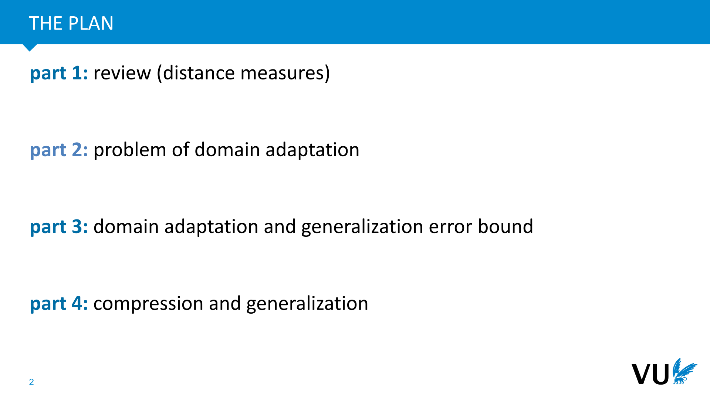
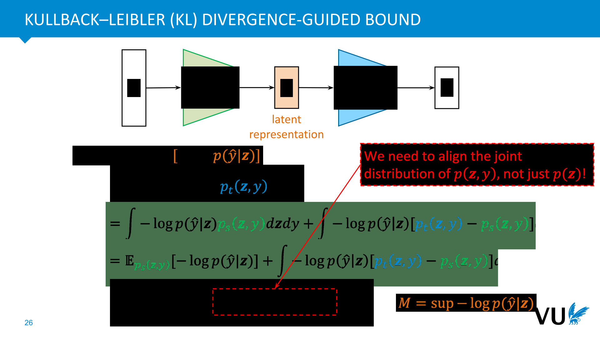
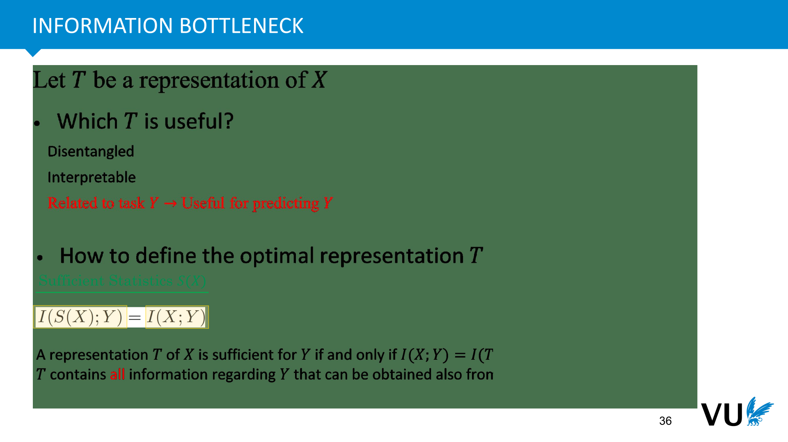
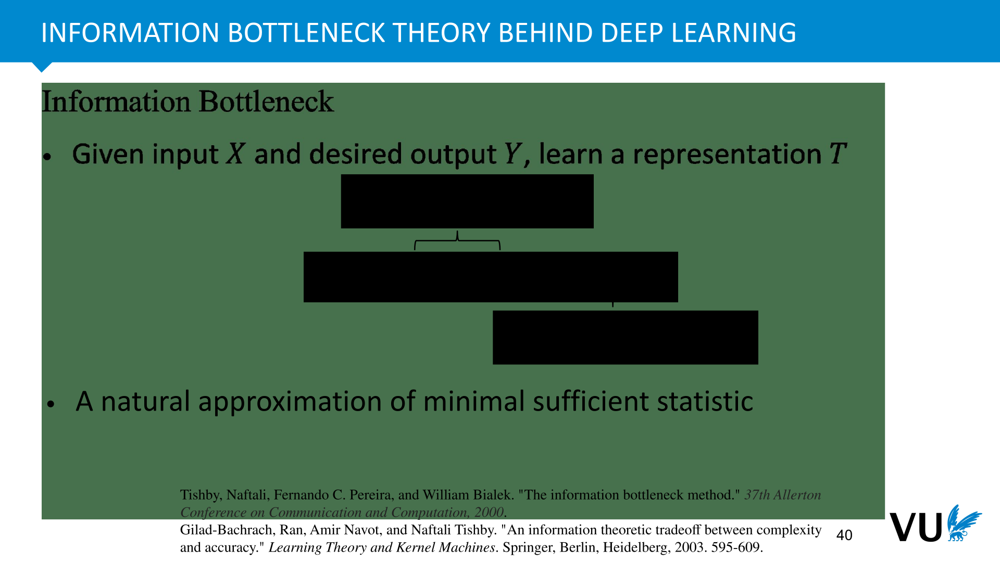
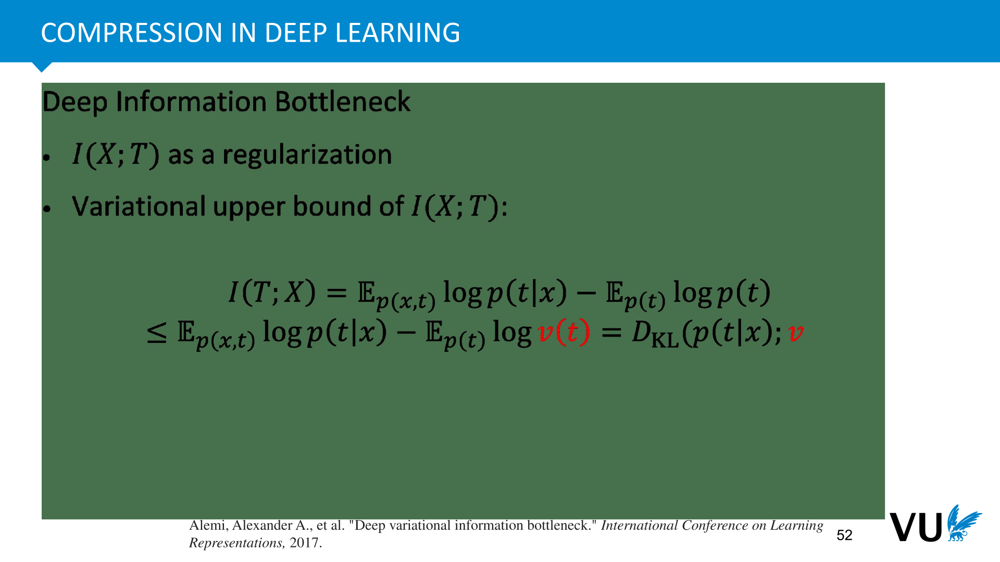

<nav class="menu">
    <ul>
        <li class="home"><a href="/">Home</a></li>
        <li class="name">Generalization</li>
                <li><a href="#video-000">Introduction</a></li>
                <li><a href="#video-002">review</a></li>
                <li><a href="#video-017">Problem</a></li>
                <li><a href="#video-028">Generalization Bound</a></li>
                <li><a href="#video-029">Compression Generalization</a></li>
        <li class="pdf"><a href="https://dlvu.github.io/lecture12,generalization.annotated.pdf">PDF</a></li>
    </ul>
</nav>

<article class="slides">

       <section class="video" id="video-000">
           <a class="slide-link" href="https://dlvu.github.io/generalization#video-0">link here</a>
           <iframe
                src="https://"
                title="YouTube video player"
                frameborder="0" allow="accelerometer; autoplay; clipboard-write; encrypted-media; gyroscope; picture-in-picture"
                allowfullscreen>
           </iframe>

       </section>

       <section id="slide-001">
            <a class="slide-link" href="https://dlvu.github.io/generalization#slide-001" title="Link to this slide.">link here</a>
            

            <figcaption>
             
Today's lecture delves into a prevalent topic in deep learning—domain adaptation and generalization. This concept is integral to a multitude of deployment applications across various domains.

 
The primary focus lies in the scenario where, following robust training with high-quality data, a deployment system is established for tasks like regression or classification. However, optimal performance is typically confined to the training data itself. Unfortunately, practical challenges arise when attempting to deploy these models to real-world or different test data, often resulting in compromised generalization performance.

 
Throughout this lecture, we will explore strategies to tackle this issue, delving into common approaches and the theoretical framework underpinning domain adaptation and generalization. It's crucial to note that the methodologies discussed are not limited to specific neural network architectures such as convolutional neural networks, LSTM, or graph neural networks. The overarching principles can be applied to a diverse range of neural network types, emphasizing the universality of this challenge in nearly all practical deep learning applications.

 
            </figcaption>
       </section>

       <section id="slide-002">
            <a class="slide-link" href="https://dlvu.github.io/generalization#slide-002" title="Link to this slide.">link here</a>
            

            <figcaption>
            
The lecture will unfold in four parts. Initially, we will provide a brief review of some distance measures and revisit the general ideas covered in the virtual notary code. Following that, we'll delve into practical examples to illustrate the concept of domain adaptation and underscore the significance of this problem.

 
Moving forward, we'll examine the intricacies of the domain adaptation problem, offering detailed insights and aiming to derive easily understandable bounds on generalization errors. These bounds form the crux of nearly all domain adaptation algorithms, and it's crucial to emphasize that they are versatile enough to be applied to various architectures covered in your previous learning experiences.

 
In the final segment, we'll introduce a widely accepted theoretical framework in deep learning. This theory suggests that the assurance of good generalization performance in deep learning networks is rooted in a certain form of compression. While this topic is somewhat advanced, it encapsulates the predominant reasons acknowledged by the deep learning community. We'll also elaborate on the concept of compression itself.

 
            </figcaption>
       </section>

       <section class="video" id="video-002">
           <a class="slide-link" href="https://dlvu.github.io/generalization#video-2">link here</a>
           <iframe
                src="https://"
                title="YouTube video player"
                frameborder="0" allow="accelerometer; autoplay; clipboard-write; encrypted-media; gyroscope; picture-in-picture"
                allowfullscreen>
           </iframe>

       </section>

       <section id="slide-003">
            <a class="slide-link" href="https://dlvu.github.io/generalization#slide-003" title="Link to this slide.">link here</a>
            

            <figcaption>
             
            </figcaption>
       </section>

       <section id="slide-004">
            <a class="slide-link" href="https://dlvu.github.io/generalization#slide-004" title="Link to this slide.">link here</a>
            

            <figcaption>
            
In the autoencoder lecture, you've already been introduced to the two prevalent ways the community measures the distance between distributions. In Bayesian settings, where assessing distribution distance is crucial, there are two main scenarios. Firstly, we aim to ensure that the distribution of our encoder, PTGivX, closely aligns with a prior distribution. This necessitates the use of divergence measures. Secondly, when dealing with real and generated data, it's essential to quantify how closely the generated data resembles the real data. This is where a reliable distance measure comes into play, a critical aspect in various generative models, including inversion-motion code.

 
The significance of a good distance measure extends to domain adaptation and generalization. It effectively governs the performance of both processes, as I'll elaborate on shortly. Presently, there are two predominant ways to measure distance. The first is technically known as the Integral Probability Matrix, often referred to as horizontal comparison. This method evaluates the difference between distributions P and Q, emphasizing a horizontal assessment.

 
Alternatively, KL divergence, a special case of divergence, focuses on comparing the ratio P over Q. The rationale behind this lies in the fact that if the ratio P over Q equals one, the two distributions are identical. This underlines the vertical comparison aspect, distinguishing it from the horizontal approach of the Integral Probability Matrix.

 
            </figcaption>
       </section>

       <section id="slide-005">
            <a class="slide-link" href="https://dlvu.github.io/generalization#slide-005" title="Link to this slide.">link here</a>
            

            <figcaption>
            
We've also touched upon another widely adopted divergence measure known as the max-min discrepancy. This measure operates with two sets of samples, one from distribution P and the other from distribution Q. The objective is to learn a mapping function, denoted as phi. The mechanism involves using phi to map all samples from distribution P to a new space and applying the same mapping to all samples from distribution Q, resulting in two sets of samples in the same space.

 
The subsequent steps include computing the mean value for all samples from distribution P and separately for all samples from distribution Q. The Max-Min Discrepancy (MMD) is then calculated based on the difference between these mean values. This process is designed to capture the dissimilarity between the two distributions in a comprehensive manner.

 
Furthermore, it's important to note that this method involves mapping samples from both distributions to a shared space, enabling the computation of means and subsequently determining the MMD. This divergence measure proves to be effective in assessing dissimilarities between distributions and is a valuable tool in the context of domain adaptation and generalization.

  
            </figcaption>
       </section>

       <section id="slide-006">
            <a class="slide-link" href="https://dlvu.github.io/generalization#slide-006" title="Link to this slide.">link here</a>
            

            <figcaption>
            
After a straightforward mathematical derivation, the final expression for the Max-Min Discrepancy (MMD) can be represented as follows. Let xi be the i-sample in distribution P, xj be the j-sample in distribution Q, Yi be the i-sample in distribution P, and Yj be the j-sample in distribution Q.

 
The physical meaning of MMD is to measure the distance between two distributions. In distribution P, we have samples xi and xj, and in distribution Q, we have samples Yi and Yj. To consider the pairwise distribution similarity, we introduce the similarity matrix G, which is represented by a kernel function k. This kernel, often in the form of a Gaussian kernel, is defined as the exponential of the negative of the squared Euclidean distance between xi and xj divided by twice the square of the standard deviation (sigma).

 
The kernel function G quantifies the similarity between samples in distribution P. We need to measure both within-distribution similarity (for each pair of xi and xj from Q) and between-distribution similarity. This approach captures the mechanics behind the final expression of MMD.

 
To simplify the understanding, consider a mean vector A for distribution P. The expression becomes akin to a Euclidean distance measure, where the factor of two times the mean vector's dot product is subtracted from the similarity quantified across distributions. This way, the expression encapsulates both within-distribution and between-distribution similarities in an easily interpretable manner.

 
            </figcaption>
       </section>

       <section id="slide-007">
            <a class="slide-link" href="https://dlvu.github.io/generalization#slide-007" title="Link to this slide.">link here</a>
            

            <figcaption>
            
Suppose we have two distributions, P and Q, and we aim to explain the concept of the max-min discrepancy by mapping all the samples to a high-dimensional space known as the reproducing kernel Hilbert space. Quantifying the distance in this new space can be derived with a relatively easy understanding.

 
Let's consider the simplest scenario, using a Euclidean distance. For distributions P and Q, the Euclidean distance can be expressed as the squared difference between P and Q. By combining terms, P is equal to the integral of P squared, the integral of Q squared, minus twice the integral of PQ. Now, if we introduce a kernel density estimator, which is a popular method for estimating the distribution of data from samples, the logic is as follows:

 
Suppose we have samples Y1, Y2, up to Yn from distribution P. The kernel density estimator involves placing different kernels on each sample, and for new data Y, the distribution of Y can be expressed as the average provided by different kernels. In this context, G represents a Gaussian kernel, although other types of kernels can be chosen based on preference.

 
Returning to the second way of understanding the max-min discrepancy, we simplify by introducing a Euclidean distance between P and Q. The equation becomes apparent. Now, to compute the integral of P squared, we employ a kernel density estimator. By plugging this estimator into the formula, the integral becomes a sum of kernel terms, ultimately providing the distribution of the function in space. This approach aligns with the same logic employed in the reproducing kernel Hilbert space.

 
            </figcaption>
       </section>

       <section id="slide-008">
            <a class="slide-link" href="https://dlvu.github.io/generalization#slide-008" title="Link to this slide.">link here</a>
            

            <figcaption>
            
Finally, when we utilize the kernel density and incorporate the expression of the kernel density estimator into the integral functions, the resulting mathematical expression aligns with the Max-Min Discrepancy (MMD). What does this signify? Essentially, it indicates that the MMD can be comprehended or derived from two perspectives or angles.

 
The first angle involves imagining the introduction of a random function, phi. We then project all the samples via phi into a new space and compute the mean of all the samples in distribution P, as well as the mean of all the samples in distribution Q. The distance between these means is then computed. The second angle, on the other hand, involves expressing the kernel density estimator by plugging it into the Euclidean distance. This approach also yields the same expression for the Max-Min Discrepancy.

 
In summary, the expression for MMD involves computing the within-distribution similarity and subtracting twice the cross-distribution similarity. This dual perspective provides a comprehensive understanding of the Max-Min Discrepancy and its role in measuring the distance between two distributions.

 
            </figcaption>
       </section>

       <section id="slide-009">
            <a class="slide-link" href="https://dlvu.github.io/generalization#slide-009" title="Link to this slide.">link here</a>
            

            <figcaption>
            
Another well-known distance measure is the KL divergence, where the logic involves directly computing the ratio of P over Q. If you've delved into classification, you've likely encountered the cross-entropy loss. Interestingly, it's quite straightforward to prove that the KL divergence between P and Q is equivalent to the cross-entropy of P and Q minus the entropy of P.

 
To break it down, decomposing the equation reveals that the first term corresponds to the integral of P and Q, and then adding the integral of P multiplied by the logarithm of P. This provides a clear and direct understanding of the relationship. By leveraging Jensen's inequality, beautiful insights into concentration loss emerge, transforming the initial classifier's loss with memory labels into the second classifier's loss.

 
Consider the key, a parameterized label distribution representing the likelihood of prediction by the key. Similarly, the queue is a distribution of the likelihood of prediction by the queue itself. This perspective emphasizes that, when appropriately controlled, the queue serves as a distribution of the key variable, adding a layer of convenience.

 
This simple derivation sheds light on why cross-entropy loss is employed. Essentially, cross-entropy aims to minimize the distance between the true label distribution and the distribution predicted by the model, making it a suitable choice in various classification scenarios.

 
            </figcaption>
       </section>

       <section id="slide-010">
            <a class="slide-link" href="https://dlvu.github.io/generalization#slide-010" title="Link to this slide.">link here</a>
            

            <figcaption>
            
In statistics and mathematics, certain properties are deemed desirable for a distance measure to satisfy. While KL divergence is a popular choice, it has limitations. This lecture will touch on some of its advantages and disadvantages, considering two essential properties: non-negativity and identity of indiscernibles.

 
Firstly, for a valid distance measure, including both MMD and KL divergence, it must ensure non-negativity. Distance between two objects should inherently be non-negative, as negative distance lacks a meaningful interpretation. Secondly, a valid distance measure should be equal to zero if and only if the two objects being compared are the same. Therefore, the divergence between distributions P and Q should be zero only if P equals Q.

 
Satisfying these first two conditions deems a measure valid. However, in advanced machine learning topics, additional properties are often desired. Unfortunately, KL divergence falls short in this regard. Symmetry, a property where the distance between P and Q equals the distance between Q and P, is expected from a good distance measure. KL divergence is not symmetric, whereas MMD does exhibit symmetry.

 
Additionally, a valid distance measure should adhere to the triangle inequality, ensuring that the distance between P1 and P2 is less than or equal to the sum of the distances between P1 and P3 and P3 and P2. KL divergence fails to satisfy the triangle inequality, potentially impacting its reliability in some advanced deployment applications within machine learning.

 
In summary, while KL divergence is a straightforward and commonly used measure, it does not satisfy all the desired properties, making it less reliable in certain applications compared to alternatives like MMD.

 
            </figcaption>
       </section>

       <section id="slide-011">
            <a class="slide-link" href="https://dlvu.github.io/generalization#slide-011" title="Link to this slide.">link here</a>
            

            <figcaption>
            
https://

|
 
            </figcaption>
       </section>

       <section id="slide-012">
            <a class="slide-link" href="https://dlvu.github.io/generalization#slide-012" title="Link to this slide.">link here</a>
            

            <figcaption>
            
Now, let's delve into the first part of the lecture, addressing the problem of domain adaptation and why it's crucial. Many of you might have experienced or will encounter this issue. After today's lecture, you can even experiment with it. For instance, consider training a classifier for digital classification, covering digits zero to nine. Your training data might consist of color images, possibly from the MNIST dataset—a popular choice for digit recognition. If you train your model using this data, you'll likely achieve excellent performance on the MNIST test data.

 
However, here's the catch. If your test data shifts to a different source, say the original MNIST dataset, even though the task remains the same, you'll observe a significant drop in performance. This phenomenon isn't restricted to image applications; it extends to various signal processing domains. Whether you're working with graphs, LSTMs, or other types of data, if your training data comes from one source, the model may struggle to generalize when tested on data from a different source.

 
Consider an example where you train a classification system for EEG signals from hospital A. Your training data is abundant, and the model achieves high accuracy within the hospital. However, when you apply the model to data from a different hospital or collected from the internet, the performance rapidly diminishes. It's noteworthy that this challenge persists even within the same hospital, especially when there's a temporal gap between the training and test data (e.g., data collected in 2020 vs. data collected in 2023).

 
In essence, the key issue here is that the distribution of your training data is not equivalent to the distribution of your test data. This mismatch in distributions is a prevalent and significant problem in machine learning, particularly in the realm of deep neural networks. The discrepancy between training and practical test data distributions often results in a notable drop in performance.

 
            </figcaption>
       </section>

       <section id="slide-013">
            <a class="slide-link" href="https://dlvu.github.io/generalization#slide-013" title="Link to this slide.">link here</a>
            

            <figcaption>
            
            </figcaption>
       </section>

       <section id="slide-014">
            <a class="slide-link" href="https://dlvu.github.io/generalization#slide-014" title="Link to this slide.">link here</a>
            

            <figcaption>
            
            </figcaption>
       </section>

       <section id="slide-015">
            <a class="slide-link" href="https://dlvu.github.io/generalization#slide-015" title="Link to this slide.">link here</a>
            

            <figcaption>
            
In mathematical terms, this discrepancy between training and test data distributions implies that if we denote the source as our training data, where X represents the input and Y represents the label, and PT is the distribution of the test data, then in most practical scenarios, the joint distribution of PSXY (source) is not equal to the joint distribution of PTXY (target).

 
To further illustrate, using Bayes' rule, we can express this inequality as in the slide. 

To simplify the problem, domain adaptation can be approached as a broad topic that varies based on applications and the source of the distribution. For instance, by examining the equation above, we can see that the joint distribution of PX is not equal to the distribution of PX conditioned on Y, divided by the marginal distribution of Y. This underscores the complexity and significance of addressing the differences in distributions for effective domain adaptation.

 
            </figcaption>
       </section>

       <section id="slide-016">
            <a class="slide-link" href="https://dlvu.github.io/generalization#slide-016" title="Link to this slide.">link here</a>
            

            <figcaption>
            
Continuing with the exploration of domain adaptation, let's consider an assumption where the distribution solely comes from PX, implying that the decision is solely influenced by the input features. In this scenario, the decision is not probabilistic and is solely determined by the features of the case.

 
However, it's crucial to recognize that decisions are often inherently probabilistic because outcomes can be uncertain. Let's assume that the outcome, represented by PY, is a probabilistic event. In this case, our target distribution is PY.

 
The challenge arises when our training data is derived from one source (e.g., PX) and the target data comes from a different source (e.g., PY). The distribution of PX is not equivalent to the distribution of PY. This discrepancy is evident when comparing the data points. In PX, a point corresponds to a single value of X, whereas in PY, a point corresponds to a probability distribution over Y.

 
This mismatch highlights the difficulty in adapting a model trained on one distribution to perform effectively on a different distribution, showcasing the need for sophisticated domain adaptation techniques.

 
            </figcaption>
       </section>

       <section id="slide-017">
            <a class="slide-link" href="https://dlvu.github.io/generalization#slide-017" title="Link to this slide.">link here</a>
            

            <figcaption>
            
Let's consider another assumption where only the labeling function introduces a shift. In this case, we assume that the distribution of our data, represented by PX, remains the same. The only variation occurs in the mapping from X to Y. This perspective aligns with the idea of covariate shift, where the distribution of X changes, but the conditional distribution of Y given X remains constant.

 
However, there are multiple ways to decompose the joint distribution. One decomposition is P(X, Y) = P(X | Y) * P(Y), and another is P(X, Y) = P(Y | X) *P(X). These decompositions are equivalent, with the joint distribution equal to the product of the conditional and marginal distributions.

 
In the context of covariate shift, only PX undergoes a change, while PY remains constant. There's also the concept of label shift, where only the labels change, while PX given Y remains the same. In graph representations, the reverse may occur, with PX given Y remaining constant, but PY undergoing a shift.

 
Label shift is particularly relevant in imbalanced applications. For example, in training data, one class might dominate, while in the test data, the alternative class dominates, leading to a label shift. The assumption made in such cases is that PY given X remains the same.

 
In different applications and scenarios, assumptions can vary based on the characteristics of the data and the domain of application. Overall, the joint distribution is considered as one unalterable entity, and different assumptions provide ways to address the problem of distributional shift. One approach is to use weighted samples, adjusting the weights to ensure that the new distribution aligns with the training distribution. This strategy is one of the simplest ways to guarantee a consistent distribution.

 
            </figcaption>
       </section>

       <section class="video" id="video-017">
           <a class="slide-link" href="https://dlvu.github.io/generalization#video-17">link here</a>
           <iframe
                src="https://"
                title="YouTube video player"
                frameborder="0" allow="accelerometer; autoplay; clipboard-write; encrypted-media; gyroscope; picture-in-picture"
                allowfullscreen>
           </iframe>

       </section>

       <section id="slide-018">
            <a class="slide-link" href="https://dlvu.github.io/generalization#slide-018" title="Link to this slide.">link here</a>
            

            <figcaption>
              
We've discussed practical scenarios where distributional shift is a common challenge and introduced various decompositions to understand the problem. Now, let's delve into some practical approaches to address distribution shift. Many algorithms and strategies have been designed to handle domain or distributional shifts, and most of them rely on theoretical guarantees. This assurance is often expressed through what is known as a generalization error bound.

 
The generalization error bound is a mathematical expression that provides insights into the expected performance degradation of a model when faced with distributional shift. Essentially, it answers the question: If a distributional shift occurs, how much worse might the model perform on new, target data? The generalization error bound offers a way to quantify and bound the performance of a model on the target data.

 
In essence, this theoretical guarantee becomes a guiding principle for designing algorithms and strategies to mitigate the impact of distributional shift and improve the adaptability of models across different domains.

 
            </figcaption>
       </section>

       <section id="slide-019">
            <a class="slide-link" href="https://dlvu.github.io/generalization#slide-019" title="Link to this slide.">link here</a>
            

            <figcaption>
            
Distribution shift is pervasive, and ensuring the exact match between the training and test distributions is practically impossible, especially in real-world projects where even minor changes can lead to different distributions. The challenge is further compounded by the fact that we often don't know the source of each component of the shift.

 
To understand the impact of distribution shift on model performance, a generalization error bound is derived. This bound assumes that the distributions of training and test data are the same. It is expressed in mathematical terms, indicating that the loss on the test data is bounded by the loss on the training data.

 
The loss on the test data is essentially the loss on the training data plus a complexity term related to the model. A powerful aspect is that it implies the model can generalize well on unseen data (test data). However, it also highlights the need to control the complexity of the model to avoid overfitting.

 
In practice, despite the theoretical preference for simpler models, complex models are often used due to the recognition of the intricate nature of real-world phenomena. Overfitting is acknowledged, but the complexity of the system often necessitates the use of sophisticated models.

 
While the error bound assumes the same distribution for training and test data, in practical scenarios, especially with large language models having a vast number of parameters, the challenges of distribution shift persist, and model complexity is a critical factor in balancing performance and overfitting concerns.

 
            </figcaption>
       </section>

       <section id="slide-020">
            <a class="slide-link" href="https://dlvu.github.io/generalization#slide-020" title="Link to this slide.">link here</a>
            

            <figcaption>
            
Given the complexity of real-world scenarios, the assumption that the training and test data come from the same distribution might not hold true. In your case, it's acknowledged that the test distribution is not equal to the training distribution, introducing additional challenges.

 
In such situations, a single error bound or model might not be sufficient to capture the intricacies of the distribution shift. The task becomes finding ways to adapt the model to the variations present in the test distribution.

 
The key challenge is understanding and addressing the differences between the training and test distributions. This involves exploring methods for domain adaptation or transfer learning, where the model learns to adapt to the characteristics of the target distribution. This adaptation can involve retraining the model on target domain data, leveraging domain-specific features, or employing other techniques to align the model with the distribution it will encounter during deployment.

 
In essence, the focus shifts from assuming identical distributions to actively managing and adapting to distributional shifts encountered in practical scenarios. This adaptation process becomes crucial for improving model performance and robustness across diverse environments.

 
            </figcaption>
       </section>

       <section id="slide-021">
            <a class="slide-link" href="https://dlvu.github.io/generalization#slide-021" title="Link to this slide.">link here</a>
            

            <figcaption>
            
            </figcaption>
       </section>

       <section id="slide-022">
            <a class="slide-link" href="https://dlvu.github.io/generalization#slide-022" title="Link to this slide.">link here</a>
            

            <figcaption>
            
In summary, the introduced equations serve as guidelines derived from the work of renowned mathematicians and computer scientists. They aim to explain the general idea behind analyzing the behavior of machine learning models in scenarios where the source and target domains differ.

 
The generalization error bound includes two terms. The first term considers the distance between the distributions of features from the source and target domains, denoted by PX. The second term involves the distance between PY given X, equivalent to the algorithmic function.

 
The significance of this bound lies in its intuitive interpretation. It indicates that, for any model H, its performance on test data can be bounded by its performance on training data, with the addition of two terms representing the distances between feature distributions and conditional label distributions. This mathematical framework provides a means to design effective machine learning systems by minimizing both prediction errors and distributional differences between domains.

 
            </figcaption>
       </section>

       <section id="slide-023">
            <a class="slide-link" href="https://dlvu.github.io/generalization#slide-023" title="Link to this slide.">link here</a>
            

            <figcaption>
            
sup indicates supremum, i.e., -log p(\hat{y}|z) <= M
  
To summarize the explanation, the speaker discusses the use of bounds to understand adaptation or generation behavior in machine learning models. They emphasize the significance of bounds in providing mathematical insights and guiding the design of practical algorithms.

 
The discussion then shifts to the application of KL divergence in understanding the generalization behavior of deep learning models. The model architecture involves an encoder (denoted as g theta) responsible for feature extraction, a latent variable (denoted as z), and a classifier (denoted as h) for classification. The encoder's architecture may vary based on the data type, such as graph convolution for graph data or convolutional layers for image data.

 
In the context of test data, the cross-entropy loss is used to measure the distribution. The speaker explains that the cross-entropy loss can be expressed in terms of expectations over the distribution of P Y hat given Z and P Z given X. These components are essential in the formulation of the loss function, linking the learned features (latent variable Z) to the prediction distribution.

            </figcaption>
       </section>

       <section id="slide-024">
            <a class="slide-link" href="https://dlvu.github.io/generalization#slide-024" title="Link to this slide.">link here</a>
            

            <figcaption>
            
sup indicates supremum, i.e., -log p(\hat{y}|z) <= M
  
            </figcaption>
       </section>

       <section id="slide-025">
            <a class="slide-link" href="https://dlvu.github.io/generalization#slide-025" title="Link to this slide.">link here</a>
            

            <figcaption>
            
In the same manner, as you've previously learned about the inversion for encoding, you can refer to some earlier slides where Young's inequality is applied. This is crucial for understanding the evaluation process. You are addressing the evaluation aspect and aiming to analyze performance comprehensively.

 
To elaborate, the test error is once again influenced by the expectations of the negative log of PY given Z, considering the joint distribution of PZY. PZY, in turn, represents the joint distribution of features learned under the true labels in the test data.

 
            </figcaption>
       </section>

       <section id="slide-026">
            <a class="slide-link" href="https://dlvu.github.io/generalization#slide-026" title="Link to this slide.">link here</a>
            

            <figcaption>
            
sup indicates supremum, i.e., -log p(\hat{y}|z) <= M
  
And then, we know that the expectation can be expressed in this way. PT still represents the test data. However, the interesting part is that we can perform some decomposition. To clarify, let's break it down. Imagine a situation where the source domain represents your training data, the domain you're familiar with, and the target domain is the unfamiliar part, where you wish to gain insights. For the relative quantifier, it stems from the connection between the source and the target, essentially capturing the difference in distribution. This term serves as a means to evaluate the ambiguity between the two domains. The goal is to understand the shift that exists in your data.

 
We've highlighted that the reason for learning features is to mitigate or eliminate this shift. By introducing feature learning, we aim to reduce the domain shift. The purpose is not to make the training and test data identical (as that's often impossible), but to minimize the shift. This is where the significance of this bound comes into play. To ensure good generalization performance, we aim to make the PZY distribution in the source domain equal to the PY given Z distribution in the target domain. We can control the former (learned from the source), but the latter is beyond our control.

 
This aligns with the challenge of domain adaptation—striving to minimize the distributional discrepancy. To put it succinctly, the bound suggests that the performance on test data is bounded by the performance on training data, with the distance between joint distributions of Z and Y being minimized. Therefore, the challenge is to align these distributions and minimize the discrepancy.

 
In many practical domain adaptation scenarios, the available data includes labeled source data (XI and YI) for which cross-entropy loss can be computed. Additionally, unlabeled target data (XH) from the new domain may be present. To train an effective neural network for optimal performance on the test data, one must minimize both the cross-entropy loss on the source domain and the Maximum Mean Discrepancy (MMD) on the features of both source and target data. This is typically achieved by incorporating these terms into the training algorithm, involving a hyperparameter λ for balancing the MMD term. The MMD is computed on the features learned by the encoder g(theta) for both source and target data.

 
            </figcaption>
       </section>

       <section id="slide-027">
            <a class="slide-link" href="https://dlvu.github.io/generalization#slide-027" title="Link to this slide.">link here</a>
            

            <figcaption>
             
In practical applications, one can focus on shaping the distribution of features. Both the Kullback-Leibler (KL) divergence and the Maximum Mean Discrepancy (MMD) can be employed for this purpose. Ultimately, the goal is to ensure that the distribution of features, as visualized in the source and target domains, aligns well. A well-designed deep neural network can effectively achieve this, ensuring that the feature distributions are consistent between the source and target domains.

            </figcaption>
       </section>

       <section id="slide-028">
            <a class="slide-link" href="https://dlvu.github.io/generalization#slide-028" title="Link to this slide.">link here</a>
            

            <figcaption>
            
sup indicates supremum, i.e., -log p(\hat{y}|z) <= M
  
The theoretical underpinning for why this approach works lies in the KL-guided bound we previously introduced. The bound provides a framework that theoretically explains and justifies the effectiveness of employing methods such as KL divergence and MMD to shape feature distributions in domain adaptation. By leveraging these techniques, we aim to minimize the distribution shift between the source and target domains, as guided by the insights provided by the theoretical bound.

 
            </figcaption>
       </section>

       <section class="video" id="video-028">
           <a class="slide-link" href="https://dlvu.github.io/generalization#video-28">link here</a>
           <iframe
                src="https://"
                title="YouTube video player"
                frameborder="0" allow="accelerometer; autoplay; clipboard-write; encrypted-media; gyroscope; picture-in-picture"
                allowfullscreen>
           </iframe>

       </section>

       <section id="slide-029">
            <a class="slide-link" href="https://dlvu.github.io/generalization#slide-029" title="Link to this slide.">link here</a>
            

            <figcaption>
               
In the final part, we delve into a particularly challenging aspect of deep learning: addressing generalization issues, which proves to be a formidable task. As you rightly pointed out, the complexity arises from the fact that, in practical scenarios, we lack knowledge about the shape and characteristics of our test data. This uncertainty is exacerbated when considering the diverse environments where the model might be deployed, such as different hospitals around the world. Given that the test data is beyond our control, the key challenge becomes ensuring robust performance despite the variability introduced by domain shifts.

 
To tackle this intricate problem, a cutting-edge and increasingly recognized topic in deep learning is introduced: domain adaptation. This approach aims to enable models trained on data from one domain to generalize effectively across various domains, even when information about the specificities of the target domain is unavailable during training. The field of domain adaptation holds promise for addressing the challenges posed by distribution shifts and ensuring the adaptability of models to diverse real-world scenarios.

 
            </figcaption>
       </section>

       <section id="slide-030">
            <a class="slide-link" href="https://dlvu.github.io/generalization#slide-030" title="Link to this slide.">link here</a>
            

            <figcaption>
            
            </figcaption>
       </section>

       <section id="slide-031">
            <a class="slide-link" href="https://dlvu.github.io/generalization#slide-031" title="Link to this slide.">link here</a>
            

            <figcaption>
            
            </figcaption>
       </section>

       <section id="slide-032">
            <a class="slide-link" href="https://dlvu.github.io/generalization#slide-032" title="Link to this slide.">link here</a>
            

            <figcaption>
              
Now, let's explore the concept of compression and the associated methodology known as the information bottleneck. Ensuring effective generalization and adaptation in machine learning involves the crucial task of learning valuable features or representations. These features should satisfy certain properties, such as disentanglement and interpretability. Disentanglement implies that each dimension of the feature captures a distinct factor of variation, making it interpretable to humans.

 
However, the utility of a feature extends beyond these properties. Its effectiveness also relies on its relevance to downstream applications. For instance, consider an image-based task where the goal is to determine if there is text present. A disentangled and interpretable feature capturing text-related variations may suffice. Yet, if the task shifts to counting the number of people in the image, the same feature may no longer be optimal, emphasizing the need for relevance to downstream tasks.

 
In summary, to guarantee the usefulness of a feature representation, it must not only be disentangled and interpretable but also intrinsically related to the target labels in downstream tasks. This triad of properties ensures that the learned features align with the specific requirements of diverse applications.

 
            </figcaption>
       </section>

       <section id="slide-033">
            <a class="slide-link" href="https://dlvu.github.io/generalization#slide-033" title="Link to this slide.">link here</a>
            

            <figcaption>
            
            </figcaption>
       </section>

       <section id="slide-034">
            <a class="slide-link" href="https://dlvu.github.io/generalization#slide-034" title="Link to this slide.">link here</a>
            

            <figcaption>
            
            </figcaption>
       </section>

       <section id="slide-035">
            <a class="slide-link" href="https://dlvu.github.io/generalization#slide-035" title="Link to this slide.">link here</a>
            

            <figcaption>
            
To comprehend this, there exists a trade-off when aiming for an optimal representation T. Let T be the feature extracted from the data, and A represents the use of T. An ideal representation T should be sufficient for Y, and only the mutual information between X and Y is essential. The mutual information, denoted by I(X;Y), quantifies the information shared between the real data (X) and the predicted output (Y).

 
In essence, I(X;Y) captures all the information that Y uses to predict X, acknowledging that this information is justified for the given distribution. The mutual information provides insights into the model's ability to predict future occurrences. The shared information, representing the mutual information between X and Y, is vital for predicting Y.

 
Thus, the objective is to ensure that the information in T and Y is maximized and approaches the quantity of I(X;Y). This condition serves as a sufficient requirement for the representation T, ensuring that it encapsulates the necessary information for predicting Y based on X.

 
            </figcaption>
       </section>

       <section id="slide-036">
            <a class="slide-link" href="https://dlvu.github.io/generalization#slide-036" title="Link to this slide.">link here</a>
            

            <figcaption>
            
In the quest for sufficient statistics, consider the scenario where T contains all the information, essentially mirroring X. If the neural network learns an identity mapping, making T exactly the same as X, it would be a sufficient representation, as it preserves all aspects of X without any alteration.

 
However, within the realm of sufficient representations, the key criterion is to unveil the pertinent information from the data while discarding unnecessary or irrelevant details. The objective is to ensure that T captures only the relevant information needed for predicting Y, avoiding the inclusion of redundant information or noise.

 
To achieve this, the concept of ethical compression comes into play. Ethical compression involves minimizing shared information and focusing on the essential features. It aims to extract valuable insights while eliminating noise and superfluous details present in the data.

 
            </figcaption>
       </section>

       <section id="slide-037">
            <a class="slide-link" href="https://dlvu.github.io/generalization#slide-037" title="Link to this slide.">link here</a>
            

            <figcaption>
            
            </figcaption>
       </section>

       <section id="slide-038">
            <a class="slide-link" href="https://dlvu.github.io/generalization#slide-038" title="Link to this slide.">link here</a>
            

            <figcaption>
            
In essence, we are navigating a trade-off between sufficiency and minimality in our quest for meaningful representations. The goal is to strike a balance where we extract sufficient information relevant to the task at hand while minimizing unnecessary details. This delicate balance ensures that the obtained representation is both informative and concise.

 
The first condition is to capture enough information to fulfill the task requirements, and the second condition involves the aspiration for independence from extraneous information. However, the challenge lies in the ambiguity of what exactly needs to be preserved or excluded, as it depends on the specific context and objectives. Hence, there is a constant need for information and communication to align perspectives and determine the most relevant features for a given task.

 
            </figcaption>
       </section>

       <section id="slide-039">
            <a class="slide-link" href="https://dlvu.github.io/generalization#slide-039" title="Link to this slide.">link here</a>
            

            <figcaption>
            
We seek to elucidate the generalization patterns of deep learning and aims to enhance the practical performance of deep learning models based on information theory. The underlying logic involves extracting the minimum sufficient statistics, as it is anticipated that having the minimum necessary information is often adequate for effective prediction tasks. Returning to the initial question, whether deep neural networks do learn these minimum sufficient statistics and how to validate it becomes crucial.

 
The challenge arises from the complexity of deep learning models, especially in large language models, where numerous hyperparameters and an extensive neural network are involved. Traditional theories, such as VC dimension, which explain the generalization behavior, become inadequate for large models. Hence, emerging theories like the information bottleneck are gaining popularity as they provide a more suitable framework to understand the generalization dynamics of deep learning, especially in the context of intricate and expansive neural networks.

 
            </figcaption>
       </section>

       <section id="slide-040">
            <a class="slide-link" href="https://dlvu.github.io/generalization#slide-040" title="Link to this slide.">link here</a>
            

            <figcaption>
            
So the first one we're going to ask in the training of neural network data, the network,  or data,  the latent augmentation itself is a new form of service.

 
            </figcaption>
       </section>

       <section id="slide-041">
            <a class="slide-link" href="https://dlvu.github.io/generalization#slide-041" title="Link to this slide.">link here</a>
            

            <figcaption>
            
            </figcaption>
       </section>

       <section id="slide-042" class="anim">
            <a class="slide-link" href="https://dlvu.github.io/generalization#slide-042" title="Link to this slide.">link here</a>
            

            <figcaption>
            
 So in order to do so, we can just try to visualize

  the training behavior or evolution of the training,

  the dynamic of training in the neural network.

  
            </figcaption>
            click image for animation
       </section>

       <section id="slide-043">
            <a class="slide-link" href="https://dlvu.github.io/generalization#slide-043" title="Link to this slide.">link here</a>
            

            <figcaption>
            
To ensure or enhance the generalization of deep learning, it becomes essential to incorporate a form of regularization or compression to eliminate redundant or irrelevant information. While traditional methods like MMD might not be applicable when data is unknown, this boundary suggests an approach. Specifically, if we only have access to training data, we can design a novel loss function by introducing a regularization term. This term aims to exert control over the mutual information between X and the feature, denoted as G(theta, X). It addresses the challenge of dealing with data of unknown composition during testing, emphasizing the importance of constructing new representations that facilitate compression to minimize mutual information between X and the feature. This aspect has been underexplored but is crucial for effective learning.

 
            </figcaption>
       </section>

       <section id="slide-044">
            <a class="slide-link" href="https://dlvu.github.io/generalization#slide-044" title="Link to this slide.">link here</a>
            

            <figcaption>
            
In this context, similar to the initial dual encoder distribution Pt given x concerning a prior distribution Vt, the revised version of the encoder, denoted as Vt, can be considered Gaussian. Consequently, you can seamlessly incorporate this into the cross-entropy by adding the pairwise dimensions between the encoder's distribution and the Gaussian distribution. This integration is something that you may have implemented in your machine learning code environment. By employing these analogous strategies and introducing additional considerations into the K-divergence, observers have noted a substantial improvement in generative performance. You can also include this by incorporating a novel regularization term in the Kullback-Leibler (KL) divergence.

            </figcaption>
       </section>

       <section id="slide-045">
            <a class="slide-link" href="https://dlvu.github.io/generalization#slide-045" title="Link to this slide.">link here</a>
            

            <figcaption>
            
            </figcaption>
       </section>

       <section id="slide-046">
            <a class="slide-link" href="https://dlvu.github.io/generalization#slide-046" title="Link to this slide.">link here</a>
            

            <figcaption>
            
On top, for example,  of a relatively big lumped number of BERT, and the performance of BERT, generation can also be significantly improved.

 
            </figcaption>
       </section>

       <section id="slide-047">
            <a class="slide-link" href="https://dlvu.github.io/generalization#slide-047" title="Link to this slide.">link here</a>
            

            <figcaption>
            
The minimal cost involved is merely a small addition to the loss function in the form of the KDAB divergence representation, a concept already implemented in your VEE assignment. By augmenting the original loss function with this additional KDAB divergence term, there's a notable enhancement in the performance of the generation process. The fundamental logic underlying this theory is derived from the information bottleneck principle, where compression is indicative of generalization.

            </figcaption>
       </section>

       <section id="slide-048">
            <a class="slide-link" href="https://dlvu.github.io/generalization#slide-048" title="Link to this slide.">link here</a>
            

            <figcaption>
            
            </figcaption>
       </section>

</article>
