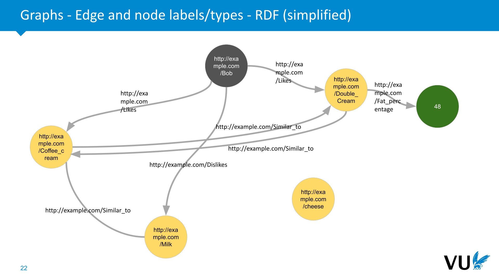
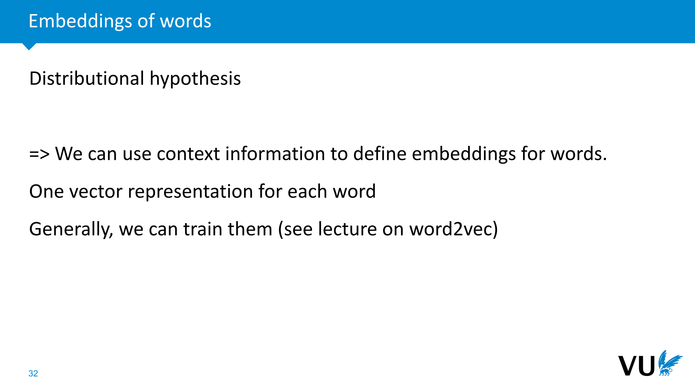
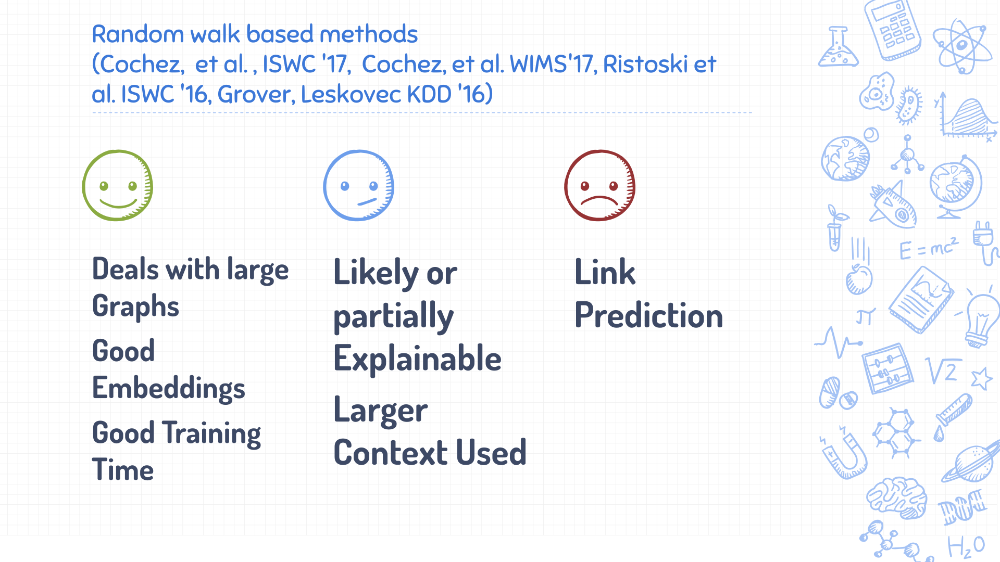
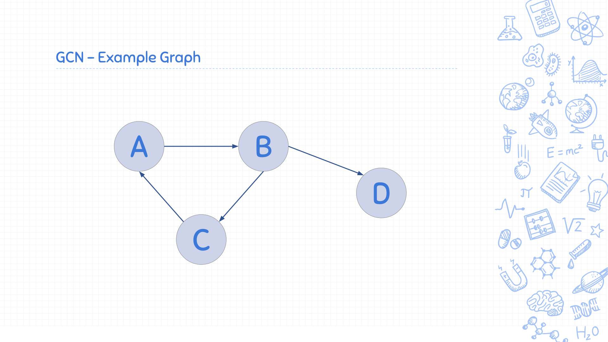
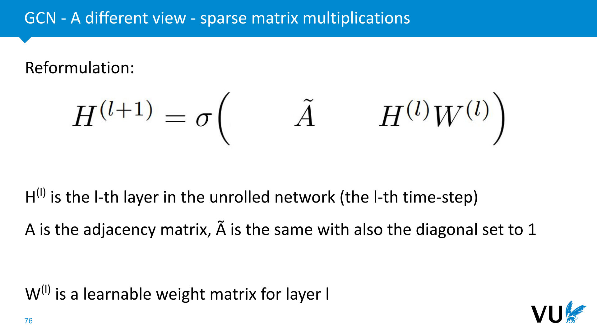

<nav class="menu">
    <ul>
        <li class="home"><a href="/">Home</a></li>
        <li class="name">Graphs</li>
                <li><a href="#video-002">Introduction - Graphs (1A)</a></li>
                <li><a href="#video-017">Introduction - Embeddings (1B)
</a></li>
                <li><a href="#video-025">Graph Embedding Techniques</a></li>
                <li><a href="#video-048">Graph Neural Networks</a></li>
                <li><a href="#video-064">Query embedding</a></li>
        <li class="pdf"><a href="https://dlvu.github.io/pdfs/lecture08.graphs.annotated.pdf">PDF</a></li>
    </ul>
</nav>

<article class="slides">

       <section id="slide-001">
            <a class="slide-link" href="https://dlvu.github.io/graphs#slide-001" title="Link to this slide.">link here</a>
            

            <figcaption>
            
Hi and welcome to lecture eight of the deep learning course. I'm Michael Cochez, and today we will be talking about learning with graphs.

 
            </figcaption>
       </section>

       <section id="slide-002">
            <a class="slide-link" href="https://dlvu.github.io/graphs#slide-002" title="Link to this slide.">link here</a>
            

            <figcaption>
            
So, this will basically be split into four or five parts. The first part has two subparts. The first one talks about why we care about graphs and what crafts actually are. The second part 1 cares about what embeddings are. Then, in part 2, we will talk about the craft embedding techniques, basically combining these two aspects from the first part. After that, we will talk about graphene networks, which is a different way of getting graphs into neural networks. In part 4, we will talk about applications on query embedding. So now we have part one a; we first talk about what graphs are and why we care about them.

            </figcaption>
       </section>

       <section class="video" id="video-002">
           <a class="slide-link" href="https://dlvu.github.io/graphs#video-2">link here</a>
           <iframe
                src="https://www.youtube.com/embed/y87PNsQj9aM?si=yL27Igg-sLbShUGm"
                title="YouTube video player"
                frameborder="0" allow="accelerometer; autoplay; clipboard-write; encrypted-media; gyroscope; picture-in-picture"
                allowfullscreen>
           </iframe>

       </section>

       <section id="slide-003">
            <a class="slide-link" href="https://dlvu.github.io/graphs#slide-003" title="Link to this slide.">link here</a>
            

            <figcaption>
             
            </figcaption>
       </section>

       <section id="slide-004" class="anim">
            <a class="slide-link" href="https://dlvu.github.io/graphs#slide-004" title="Link to this slide.">link here</a>
            

            <figcaption>
            
So in this context, I want you to think about when the last thing was when you reconnected with a friend. Now, chances are that you have been using what is called Facebook social graph. So what Facebook is keeping is a large graph within their friends, people who know each other, and what people do, and so on. 

            </figcaption>
            click image for animation
       </section>

       <section id="slide-005" class="anim">
            <a class="slide-link" href="https://dlvu.github.io/graphs#slide-005" title="Link to this slide.">link here</a>
            

            <figcaption>
            
Now, the last time when you visited a doctor, maybe not so much in Europe but at least in other countries like, for example, in the U.S., you would have tools like IBM Watson, which are very large knowledge systems. Internally, they also keep a graph for representing certain key concepts and relationships within the domain. So a doctor can use that knowledge graph, and you can use that system to, for example, search what the disease might be corresponding to certain symptoms.

            </figcaption>
            click image for animation
       </section>

       <section id="slide-006" class="anim">
            <a class="slide-link" href="https://dlvu.github.io/graphs#slide-006" title="Link to this slide.">link here</a>
            

            <figcaption>
            
Another example is you might have been visiting a webshop. So you might have gone, for example, to Amazon, and Amazon is keeping a very large product graph, meaning basically the relation between the different products they have. To give an example, they might give a relation between a washing machine which you might have bought and the washing liquid which you actually need for it.

            </figcaption>
            click image for animation
       </section>

       <section id="slide-007" class="anim">
            <a class="slide-link" href="https://dlvu.github.io/graphs#slide-007" title="Link to this slide.">link here</a>
            

            <figcaption>
            
Or you might have been doing a web search; that's maybe the most famous example. So Google is keeping a very large knowledge graph of all kinds of concepts. That means, for example, painters, paintings which they have been painting, they keep cities, they keep the major of the cities, they keep the university where that major of the city has been studying, they keep other people in that university and so on.

            </figcaption>
            click image for animation
       </section>

       <section id="slide-008" class="anim">
            <a class="slide-link" href="https://dlvu.github.io/graphs#slide-008" title="Link to this slide.">link here</a>
            

            <figcaption>
            
So, really, these knowledge crafts or these graphs are all around us, right? So there are a lot more examples. Some examples are very about very general domains like for the search engines and so on. Now we also find examples, things like, for example, Springer, which is mentioned here, or Elsevier. So they would keep knowledge graphs of research articles, so they can go from a very narrow domain to a very broad domain.

            </figcaption>
            click image for animation
       </section>

       <section id="slide-009">
            <a class="slide-link" href="https://dlvu.github.io/graphs#slide-009" title="Link to this slide.">link here</a>
            

            <figcaption>
            
Now let's get back to basics on knowledge graphs. So our graphs, so the first, the very simple, the simplest thing which you can do is what is called a simple graph, right? So a simple graph, what does it mean? So we have nodes, also sometimes called vertices, and then we have edges or arcs connecting these together, right? So that means that, this could represent that the nodes here, the circles, they could be people, and the relation between them could be a friendship, a friendship relation. Then this whole graph would basically be a friendship network. Now what you can see in this graph is that we basically have sort of two parts. So there is the part of the graph that is connected, and then there is this separate part of the graph that is disconnected. We call this graph disconnected; it means we have two completely separate parts. A graph which is completely connected would be a connected graph.

            </figcaption>
       </section>

       <section id="slide-010">
            <a class="slide-link" href="https://dlvu.github.io/graphs#slide-010" title="Link to this slide.">link here</a>
            

            <figcaption>
            
One thing which cannot happen in a simple graph but which we can add is something called self-loops. So in this case, we have the node here, and basically, it has a connection to itself (the red line). So what could this graph now represent? Let's take another example. All of these nodes could be representing a network of atoms. Each atom has edges between them, which could bind to each other to form bigger molecules.

            </figcaption>
       </section>

       <section id="slide-011">
            <a class="slide-link" href="https://dlvu.github.io/graphs#slide-011" title="Link to this slide.">link here</a>
            

            <figcaption>
            
Now one additional thing which we can have on graphs is what is called multi-edges or multi-graphs. So it basically means, um, between these two nodes, we don't have just one edge, but we have two. So now what could you do with this kind of graphs? Well, let's imagine we are now in this pandemic situation. So let's imagine that this graph represents which people have been meeting up with which other persons in the past month. So you have a person here, this person because there is this edge, we know that he has been meeting with that person over here. And now here, there are two edges, so that basically means that two meetings have happened between these two people. So each of the edges basically represents one of the meetings.

            </figcaption>
       </section>

       <section id="slide-012">
            <a class="slide-link" href="https://dlvu.github.io/graphs#slide-012" title="Link to this slide.">link here</a>
            

            <figcaption>
            
Now, another enhancement we can make is to assign direction to the edges. Until now, concepts like friendships or meetings lacked a specific direction. In this case, we aim to introduce directionality, imbuing it with a specific meaning. For example, consider a network resembling Twitter, focusing on people following each other. Picture this: one person here is being followed by another person over there. In this context, the edge's meaning and direction signify that the person at the start of the edge is being followed by the person at the end.

It's important to note that while not illustrated in this example, reciprocal following can occur. This person follows that one, and reciprocally, the latter also follows the former. In such instances, two edges are necessary to indicate this bidirectional relationship. Another example fitting into this graph concept is links between web pages. If each node represents a web page, the edges could represent links from, say, this page to that page.

            </figcaption>
       </section>

       <section id="slide-013">
            <a class="slide-link" href="https://dlvu.github.io/graphs#slide-013" title="Link to this slide.">link here</a>
            

            <figcaption>
            
The next step in working with graphs involves assigning labels and types. For each edge and node, I've introduced descriptive words. For instance, this node is labeled Bob, another is labeled double cream, and one more is labeled cheese, and so forth. This allows us to express relationships, such as saying that "Bob likes cheese." I've extended this labeling to the edges, giving them distinct meanings.

In addition to labels, I've introduced types. In this context, Bob is classified as a type of person, while other entities like double cream, cheese, and milk are categorized as dairy products. This establishes different types for the nodes.

One more aspect of this graph is the inclusion of both directed and undirected edges. I've combined direct attachments with undirected ones, providing a mix of both in the graph structure.

            </figcaption>
       </section>

       <section id="slide-014">
            <a class="slide-link" href="https://dlvu.github.io/graphs#slide-014" title="Link to this slide.">link here</a>
            

            <figcaption>
            
Taking another step forward, we can create what is known as an RDF (Resource Description Framework) graph, maintaining a somewhat simplified perspective. Notably, the labels, which were previously simple textual labels, now each represent a URL, serving as a unique identifier for the nodes. This approach carries tangible benefits, particularly when attempting to merge graphs. The presence of unique identifiers facilitates a seamless merging process.

Additionally, observe a change in the nature of the edges. This graph exclusively features directed edges, transitioning from the single edge in the previous representation. I've also corrected an oversight, ensuring that the indicated edge should be a double one.

Furthermore, I've introduced a distinct type of node—one that carries a literal value. In this case, it contains a numerical value representing the fat percentage of the double cream. This highlights a capability within RDF where nodes can directly contain literal values, expanding the expressive power of the graph.

 
            </figcaption>
       </section>

       <section id="slide-015">
            <a class="slide-link" href="https://dlvu.github.io/graphs#slide-015" title="Link to this slide.">link here</a>
            

            <figcaption>
            
In graphs, we can assign weights to edges. In this instance, we've reverted to standard labels and added weights such as 4.9, 0.8, and 0.5. The interpretation of these weights depends on how you analyze the graph. For instance, Bob prefers double cream with a weight of 0.8 and coffee cream with a weight of 4.9, indicating a stronger preference for the latter. The similarity score between these two preferences is 4.5, while another pair has a similarity score of 4.8.

            </figcaption>
       </section>

       <section id="slide-016">
            <a class="slide-link" href="https://dlvu.github.io/graphs#slide-016" title="Link to this slide.">link here</a>
            

            <figcaption>
            
Beyond weights, we have additional possibilities. Properties can be added to edges, going beyond the basics. Consider Bob: he likes coffee cream, but with added temporal and contextual details. For instance, he prefers this cream only in the evenings and exclusively with coffee. Similarly, he enjoys double cream, but exclusively with strawberries in the morning. These additional details specified on the edge are known as qualifiers, providing more information about the edge itself.

            </figcaption>
       </section>

       <section id="slide-017">
            <a class="slide-link" href="https://dlvu.github.io/graphs#slide-017" title="Link to this slide.">link here</a>
            

            <figcaption>
            
We've observed the progression from a basic graph to a more complex property graph. When someone mentions using a graph, it's crucial to inquire about its characteristics. Is it a simple graph or does it permit features like self-loops, multigraph elements, directional aspects, or a blend of both? Are there labels for edges or nodes, and are they unique? Does it support edge properties, such as qualifiers, or even edge weights? These elements can be combined in various ways, offering a wide range of possibilities.

            </figcaption>
       </section>

       <section class="video" id="video-017">
           <a class="slide-link" href="https://dlvu.github.io/graphs#video-17">link here</a>
           <iframe
                src="https://www.youtube.com/embed/Q70zKCbfKyk?si=_pu9Q75GE9hgEApT"
                title="YouTube video player"
                frameborder="0" allow="accelerometer; autoplay; clipboard-write; encrypted-media; gyroscope; picture-in-picture"
                allowfullscreen>
           </iframe>

       </section>

       <section id="slide-018">
            <a class="slide-link" href="https://dlvu.github.io/graphs#slide-018" title="Link to this slide.">link here</a>
            

            <figcaption>
            
In part B, we'll delve into embeddings, which are low-dimensional representations of objects. To better understand, let's break down this concept.

            </figcaption>
       </section>

       <section id="slide-019">
            <a class="slide-link" href="https://dlvu.github.io/graphs#slide-019" title="Link to this slide.">link here</a>
            

            <figcaption>
            
Low dimension, in the context of embeddings, means a representation much smaller than the original size. For instance, an image embedding shouldn't be as large as the number of pixels but significantly smaller. These representations hold meaning, corresponding to real-world objects, which can range from words and sentences to images, audio, or even graphs, as we'll explore later on.

            </figcaption>
       </section>

       <section id="slide-020">
            <a class="slide-link" href="https://dlvu.github.io/graphs#slide-020" title="Link to this slide.">link here</a>
            

            <figcaption>
            
You've encountered various examples of embeddings, even if we didn't always use that term. Consider the left example, where an input image passes through convolutional filters, resulting in a lower-dimensional output—a form of embedding. Similarly, generative models like variational autoencoders generate points in a distribution space, each point serving as an embedding corresponding to a real-world image.

            </figcaption>
       </section>

       <section id="slide-021">
            <a class="slide-link" href="https://dlvu.github.io/graphs#slide-021" title="Link to this slide.">link here</a>
            

            <figcaption>
            
Some embedded spaces exhibit a valuable structure that allows navigation. Moving in specific directions within this space holds meaningful changes in certain features of the object. For example, in images, navigating could transition from a smiling person to a non-smiling one or from a female to a male gender along a certain direction. When features disentangle in this way, they separate and correspond to distinct semantic features in the objects within the embedding space.

            </figcaption>
       </section>

       <section id="slide-022">
            <a class="slide-link" href="https://dlvu.github.io/graphs#slide-022" title="Link to this slide.">link here</a>
            

            <figcaption>
            
Beyond images, we can also create word embeddings. In a machine learning context, one-hot encoding is common, but it has limitations. To address this, we often rely on the distributional hypothesis, which suggests that understanding a word involves its contextual associations. As FortH put it, "You shall know a word by the company it keeps." In modern terms, if words or text units share similar vectors in a frequency matrix, they likely have similar meanings.

 
For instance, words like 'cat,' 'dog,' and 'fish' frequently co-occur with 'animal' but rarely with 'loudspeaker.' This implies that 'cat,' 'dog,' and 'fish' are semantically similar, while 'loudspeaker' is distinct. Leveraging such contextual information allows us to create embeddings for words.

 
            </figcaption>
       </section>

       <section id="slide-023">
            <a class="slide-link" href="https://dlvu.github.io/graphs#slide-023" title="Link to this slide.">link here</a>
            

            <figcaption>
            
To achieve this, we generate vector representations for each word, incorporating information about co-occurrence with other words. Training these embeddings is a common approach, and I recommend watching the lecture on word2vec for a detailed understanding.

            </figcaption>
       </section>

       <section id="slide-024">
            <a class="slide-link" href="https://dlvu.github.io/graphs#slide-024" title="Link to this slide.">link here</a>
            

            <figcaption>
            
Just as with images, we can navigate through space with words. Though the example may not be realistic, it conveys the concept. For instance, starting with the concept 'king,' navigating in a certain direction in space could lead to the word 'man.' Similarly, starting from 'queen' and following a similar direction could lead to the embedding for 'woman.' This approach can extend to relationships like capitals to countries or transforming grammatical forms of words.

            </figcaption>
       </section>

       <section id="slide-025">
            <a class="slide-link" href="https://dlvu.github.io/graphs#slide-025" title="Link to this slide.">link here</a>
            

            <figcaption>
            
Before diving into graph embeddings, let's explore why we use them in machine learning. The primary goals include classification, regression, or clustering of nodes, edges, or the entire graph. For instance, in an Amazon product graph with missing labels, we might want to classify nodes, such as determining whether a product is poisonous or not. Regression could quantify toxicity levels. Other applications include recommender systems for product suggestions based on connections in the knowledge graph, document modeling to find similar documents through graph links, and aligning graphs to identify similarities between nodes. Additionally, tasks like link prediction and error detection aim to refine and correct the knowledge graph by predicting missing links and rectifying inaccuracies.

            </figcaption>
       </section>

       <section class="video" id="video-025">
           <a class="slide-link" href="https://dlvu.github.io/graphs#video-25">link here</a>
           <iframe
                src="https://www.youtube.com/embed/kClCCEheI3o?si=-06mVNRgPbZDw5dn"
                title="YouTube video player"
                frameborder="0" allow="accelerometer; autoplay; clipboard-write; encrypted-media; gyroscope; picture-in-picture"
                allowfullscreen>
           </iframe>

       </section>

       <section id="slide-026">
            <a class="slide-link" href="https://dlvu.github.io/graphs#slide-026" title="Link to this slide.">link here</a>
            

            <figcaption>
            
In this segment, we'll discuss graph embedding techniques. We've covered the concept of graphs and explored embeddings for various entities represented as graphs. Now, let's delve into techniques for embedding graphs specifically for machine learning purposes.

            </figcaption>
       </section>

       <section id="slide-027">
            <a class="slide-link" href="https://dlvu.github.io/graphs#slide-027" title="Link to this slide.">link here</a>
            

            <figcaption>
            
When embedding graphs, we actually have one big challenge.

            </figcaption>
       </section>

       <section id="slide-028" class="anim">
            <a class="slide-link" href="https://dlvu.github.io/graphs#slide-028" title="Link to this slide.">link here</a>
            

            <figcaption>
            
When working with embeddings before, say with text or images, it was relatively easy to integrate them into a neural network. We had a one or two-dimensional structure, a linear format that smoothly fed into the neural network on the right.

However, this scenario changes when dealing with graphs. Graphs pose a challenge as they don't have a straightforward linear structure. Unlike text or images, graphs can't be neatly represented in a linear fashion. Therefore, feeding them into our network becomes a non-trivial task.

 
            </figcaption>
            click image for animation
       </section>

       <section id="slide-029">
            <a class="slide-link" href="https://dlvu.github.io/graphs#slide-029" title="Link to this slide.">link here</a>
            

            <figcaption>
            
Traditionally, some machine learning methods for graphs, which we'll skip in this lecture, involve manual feature engineering. These methods attempt to manually extract specific features from the nodes in the graph and then input them into a machine learning algorithm. However, such approaches often encounter scalability issues and are task-specific. Due to these limitations, we won't delve deeper into them in this discussion, but it's worth noting that they do exist.

            </figcaption>
       </section>

       <section id="slide-030">
            <a class="slide-link" href="https://dlvu.github.io/graphs#slide-030" title="Link to this slide.">link here</a>
            

            <figcaption>
            
What we'll focus on instead is embedding knowledge graphs in a vector space. More precisely, we'll discuss embedding nodes in an effective space. The approach involves taking each node in the graph and creating a vector in a vector space for each node. These vectors are designed to be easily integrated into a machine learning algorithm.

            </figcaption>
       </section>

       <section id="slide-031">
            <a class="slide-link" href="https://dlvu.github.io/graphs#slide-031" title="Link to this slide.">link here</a>
            

            <figcaption>
            
What we're essentially doing is akin to something called propositionalization. This involves creating one vector for each entity or node in the graph, making it compatible with traditional data mining algorithms, other machine learning tools, or machine learning networks.

The primary goal of this embedding is to preserve information from the original graph. Ideally, we prefer an unsupervised approach for now, meaning the embeddings obtained are task and dataset independent. They originate from a specific graph but should be universally applicable.

As mentioned earlier, efficiency in computation is crucial. Whether dealing with a graph of 5 million or 10 million nodes, the embedding process should remain feasible. Additionally, we aim for a low-dimensional representation compared to the original graphs. While representing a graph with millions of nodes and connections in a standard vector format is possible, it consumes a significant amount of space. Our objective is to achieve a more compact, low-dimensional representation of the same information.

            </figcaption>
       </section>

       <section id="slide-032">
            <a class="slide-link" href="https://dlvu.github.io/graphs#slide-032" title="Link to this slide.">link here</a>
            

            <figcaption>
            
In methods to accomplish this, there are two major visions on how it should be done. In one approach, the focus is on preserving topology. The goal here is to maintain the proximity of neighbors in the graph. For instance, if you have neighbors like Europe and Germany connected by an edge in the graph, you'd want their embeddings to be close to each other in the embedded space. Similarly, Africa and Algeria, being connected, would also have close embeddings in that space.

On the other hand, a completely different view emphasizes preserving similarity in the embedded space. This means that similar nodes should be close together. In this scenario, you might have separate embeddings for Europe and Africa, and because they are both continents, they would be close together in the embedded space. Likewise, Germany and Algeria, both being large countries, would also have close embeddings in the same space.

These are the two major visions that exist for achieving graph embeddings.

 
            </figcaption>
       </section>

       <section id="slide-033">
            <a class="slide-link" href="https://dlvu.github.io/graphs#slide-033" title="Link to this slide.">link here</a>
            

            <figcaption>
            
When creating these embeddings, there are two major targets, each related to the tasks we discussed earlier. One significant group of tasks involves improving the original data, as we previously mentioned in the context of graph completion, link prediction, and anomaly detection.

The second set of targets revolves around downstream machine learning tasks. In this case, the goal is not directly tied to the graph itself. Instead, the embeddings are utilized for tasks that may include classification, clustering, or as part of a larger process. For instance, embeddings can be integrated into question-answer systems, dialog systems, translation systems, or even image segmentation. In the latter case, information from a knowledge graph can be used to make informed decisions, like recognizing that if the entity is a "cow," the background is more likely to be land rather than the sea, as cows are typically not found in the sea but rather in other environments.

 
            </figcaption>
       </section>

       <section id="slide-034">
            <a class="slide-link" href="https://dlvu.github.io/graphs#slide-034" title="Link to this slide.">link here</a>
            

            <figcaption>
            
            </figcaption>
       </section>

       <section id="slide-035">
            <a class="slide-link" href="https://dlvu.github.io/graphs#slide-035" title="Link to this slide.">link here</a>
            

            <figcaption>
            
There are essentially three major approaches. The first set of approaches relies on a translational property, meaning that any relation existing in the knowledge graph is directly mapped to its counterpart in the embedded space. Essentially, if there's a certain relation in the graph, the goal is to replicate that relation in the embedded space.

The second group of methods is based on tensor factorization. This involves creating a 3D matrix of all the relations in the graph. The process includes starting at a particular node and navigating its context for embedding. This method incorporates the distributional hypothesis, which we previously discussed in the context of words and context.

 
            </figcaption>
       </section>

       <section id="slide-036">
            <a class="slide-link" href="https://dlvu.github.io/graphs#slide-036" title="Link to this slide.">link here</a>
            

            <figcaption>
            
            </figcaption>
       </section>

       <section id="slide-037">
            <a class="slide-link" href="https://dlvu.github.io/graphs#slide-037" title="Link to this slide.">link here</a>
            

            <figcaption>
            
New approaches continue to emerge, and essentially, they all come down to similar principles. Let's focus on the very first one, TransE, as the subsequent ones are essentially more complex versions of it.

            </figcaption>
       </section>

       <section id="slide-038" class="anim">
            <a class="slide-link" href="https://dlvu.github.io/graphs#slide-038" title="Link to this slide.">link here</a>
            

            <figcaption>
            
The core idea of TransE is to consider each edge in a knowledge graph. In a large knowledge graph, nodes are connected by typed edges. Each edge is associated with a type 'e'.

The approach involves ensuring that if a certain type of edge exists in the knowledge graph, corresponding embeddings are created for the connected nodes. Additionally, an embedding is generated for the edge, representing a vector that serves as a translation from one node to another. If there are multiple triples with the same type, the same edge embedding is used.

The optimization goal is to align the head ('h') of the relationship, the edge, and the tail. Specifically, the aim is to minimize the distance between the sum of the embeddings of the head and the edge and the tail ('t'). The objective is to reduce the distance between these elements for all edges in the knowledge graph, making the sum of the head and edge embeddings as close as possible to the tail.

  
            </figcaption>
            click image for animation
       </section>

       <section id="slide-039">
            <a class="slide-link" href="https://dlvu.github.io/graphs#slide-039" title="Link to this slide.">link here</a>
            

            <figcaption>
             
The current approach has some limitations, as it primarily relies on positive information, which can lead to over-optimization and nonsensical results. To address this, instead of solely minimizing the distance as described earlier, the model should also penalize instances where incorrect triples or relations in the graph are in close proximity.

To implement this, a loss function is proposed. It involves considering valid triples and corresponding negative triples. Negative triples are essentially corrupted versions of real triples. This corruption entails randomly removing either the tail or the head of an edge and replacing it with another random entity. In essence, this introduces randomness into the graph, and the objective is to minimize the distance for valid triples while maximizing it for the negative ones. Additionally, a margin is introduced as part of this margin-based loss function.

In summary, the loss function is designed to simultaneously minimize the distance for valid triples and maximize it for corrupted (negative) triples, ensuring a balance between positive and negative information in the training process.

 
            </figcaption>
       </section>

       <section id="slide-040">
            <a class="slide-link" href="https://dlvu.github.io/graphs#slide-040" title="Link to this slide.">link here</a>
            

            <figcaption>
            
The existing approach has limitations; it seems to work, but it tends to over-optimize for positive information, leading to nonsensical results. To address this, instead of solely minimizing the established distance, we also aim to penalize instances where incorrect triples or wrong relations in the graph are in close proximity. The written loss function includes valid triples and a set of negative triples. These negative triples are essentially corrupted versions of real triples. For each valid triple, we randomly alter either the end or the beginning of the edge, replacing it with something else. This introduces randomness into the graph, and the objective is to minimize the distance for valid triples while maximizing it for negative ones. Additionally, a margin is incorporated into this margin-based loss.

            </figcaption>
       </section>

       <section id="slide-041">
            <a class="slide-link" href="https://dlvu.github.io/graphs#slide-041" title="Link to this slide.">link here</a>
            

            <figcaption>
            
            </figcaption>
       </section>

       <section id="slide-042">
            <a class="slide-link" href="https://dlvu.github.io/graphs#slide-042" title="Link to this slide.">link here</a>
            

            <figcaption>
            
A group of methods focuses on matrix factorization. One canonical example is Rascal, and there are various approaches. In this case, we examine a 3D matrix, denoted as x, representing our graph. Along one axis, it indicates possible relations (e.g., person likes milk or dislikes). Another axis represents entities, forming a 2D matrix.

Inside this 3D matrix, a '1' is placed for the jade entity and identity if relation k holds. This results in a sparse matrix, more compactly represented. The factorization decomposes it into three matrices.

Decomposing implies having three smaller matrices that, when multiplied, recreate the original or something close. Notably, the matrices on the left and right are essentially the same, with one being a twisted version. So, there are only two matrices: one fixed for the k relations and another for entity embeddings.

After decomposition, these matrices contain embeddings for all entities and, when multiplied, restore the original matrix. This process is akin to how encoders work. The smaller representation in the middle discards noise, anomalies, and mistakes in the graph, but also generalizes, predicting missing edges not in the original graph.

      
            </figcaption>
       </section>

       <section id="slide-043">
            <a class="slide-link" href="https://dlvu.github.io/graphs#slide-043" title="Link to this slide.">link here</a>
            

            <figcaption>
            
Tensor factorization is indeed powerful, conceptually straightforward, and effective for link relation tasks. Recent works indicate that even the method presented on the slide is highly potent. These methods are often scalable, leveraging powerful linear algebra operations, and capable of encoding multi-hop information to some extent. They are explainable, allowing for the understanding of why certain edges are predicted, and can incorporate numeric attributes, a feature lacking in translation-based methods.

However, there is a drawback. While tensor factorization excels in link prediction, its embedding quality tends to be less effective for downstream machine learning tasks. Despite the existence of stronger matrix factorization techniques, the scalability of these models diminishes with increased complexity.

 
            </figcaption>
       </section>

       <section id="slide-044">
            <a class="slide-link" href="https://dlvu.github.io/graphs#slide-044" title="Link to this slide.">link here</a>
            

            <figcaption>
            
            </figcaption>
       </section>

       <section id="slide-045">
            <a class="slide-link" href="https://dlvu.github.io/graphs#slide-045" title="Link to this slide.">link here</a>
            

            <figcaption>
             
Now moving on to the last class, which is random walk-based methods. These methods leverage random walks to capture the context around a specific node. By initiating a random walk around a node, the context is extracted for that node. Subsequently, this context serves as an input to a word embedding technique. In essence, similar to the example where a cat occurs in the context of an animal, these methods utilize distributional hypothesis information to embed nodes.

      
            </figcaption>
       </section>

       <section id="slide-046">
            <a class="slide-link" href="https://dlvu.github.io/graphs#slide-046" title="Link to this slide.">link here</a>
            

            <figcaption>
            
One approach is to initiate a sequence by starting from a node and creating a sequence. Here, you begin with a node, note its label, take a random step to the next node, record the edge followed and the label of the next node. Repeat this process to form a sequence, essentially creating a text-like structure. This sequence might resemble a sentence, such as "This person likes milk. Milk is similar to cheese, and cheese contains a high amount of fat."

Subsequently, these sequences can be input into a language model, like the Word2Vec model, to obtain embeddings for the words. These word embeddings correspond to concepts in the graph, effectively creating an embedding for the entire graph. Additional strategies include biasing the walks by assigning extra weight to certain directions instead of randomly jumping to locations. Graph kernels, although not elaborated here, are also employed as alternative methods for navigating the graph.

 
            </figcaption>
       </section>

       <section id="slide-047">
            <a class="slide-link" href="https://dlvu.github.io/graphs#slide-047" title="Link to this slide.">link here</a>
            

            <figcaption>
            
Another technique that relies on a similar distributional hypothesis is personalized PageRank. In this method, you examine each node in the graph and consider its neighborhood. The information about the proximity of these nodes is then fed into another type of language model, such as GloVe. The underlying idea is to apply the distributional hypothesis, asserting that similar nodes should have similar context in the graph, encompassing both immediate neighbors and those further away.

This language model, GloVe, is designed to optimize for preserving analogies. An example of this is the well-known analogy: "king - man + woman = queen." The advantage of this model over the random walk method discussed earlier is that it captures the complete context comprehensively. Instead of randomly walking in the hope of discovering context, it systematically encompasses the entire context at once.

            </figcaption>
       </section>

       <section id="slide-048">
            <a class="slide-link" href="https://dlvu.github.io/graphs#slide-048" title="Link to this slide.">link here</a>
            

            <figcaption>
            
These methods come with several advantages. They excel in handling very large graphs by leveraging local neighborhoods effectively. Even for relatively small graphs, they provide reasonably good embeddings that prove useful for downstream machine learning tasks. The training process is generally robust.

However, explainability is a challenge. While some methods, like the one capturing context, offer partial explainability, there is still ongoing research needed in this area. Scalable methods could potentially address the issue of handling larger contexts.

One notable drawback is in link prediction. These methods tend to prioritize semantic similarity based on the distributional hypothesis, potentially overlooking the original graph's structure. For instance, continents might be grouped together in the embedded space, even if they weren't connected in the original graph.

            </figcaption>
       </section>

       <section class="video" id="video-048">
           <a class="slide-link" href="https://dlvu.github.io/graphs#video-48">link here</a>
           <iframe
                src="https://www.youtube.com/embed/ckAjM9XIdQs?si=VpQ8vgYiK-nNEJBo"
                title="YouTube video player"
                frameborder="0" allow="accelerometer; autoplay; clipboard-write; encrypted-media; gyroscope; picture-in-picture"
                allowfullscreen>
           </iframe>

       </section>

       <section id="slide-049">
            <a class="slide-link" href="https://dlvu.github.io/graphs#slide-049" title="Link to this slide.">link here</a>
            

            <figcaption>
             
Part three focuses on graph neural networks, relatively new architectures with increasingly exciting applications. Let's delve right in.

            </figcaption>
       </section>

       <section id="slide-050">
            <a class="slide-link" href="https://dlvu.github.io/graphs#slide-050" title="Link to this slide.">link here</a>
            

            <figcaption>
            
Graph neural networks is now three to four years old. The fundamental question addressed is how to seamlessly integrate graph information into a machine learning algorithm, particularly for an end-to-end learning set.

            </figcaption>
       </section>

       <section id="slide-051">
            <a class="slide-link" href="https://dlvu.github.io/graphs#slide-051" title="Link to this slide.">link here</a>
            

            <figcaption>
            
In the preceding section, we discussed the embedding of nodes, where a two-step process was employed. Initially, portions of the graph were taken, and in a subsequent step, these embeddings were utilized in a downstream machine learning task. This method falls short of true end-to-end learning, as there's an intermediate step involving saving to a file. In case this information isn't retained, it poses challenges for subsequent tasks. Essentially, the final task cannot influence the creation of these embeddings. This approach has its drawbacks, notably that certain information deemed unimportant during the embedding process might be discarded, potentially impacting the application.

Conversely, with end-to-end learning, a different challenge arises. The embeddings generated in such a system may lack generalizability, being too specific to the task at hand. Unlike the two-step approach, they may not be transferable to other tasks.

 
            </figcaption>
       </section>

       <section id="slide-052">
            <a class="slide-link" href="https://dlvu.github.io/graphs#slide-052" title="Link to this slide.">link here</a>
            

            <figcaption>
            
This process essentially involves merging the two realms – the world of graphs and that of neural networks. Initially distinct, these two worlds are now being fused together, creating intriguing networks that bridge the gap between them.

            </figcaption>
       </section>

       <section id="slide-053" class="anim">
            <a class="slide-link" href="https://dlvu.github.io/graphs#slide-053" title="Link to this slide.">link here</a>
            

            <figcaption>
            
Let's delve into an example known as the graph convolutional network, starting with a directed graph featuring four nodes connected by directed edges. Our aim is to construct a neural network in a specific manner. Follow along step by step as we build this network.

Initially, we create four nodes, representing the four nodes in our graph, arranged consecutively. This process is repeated, forming a second set of nodes, aligning with the original graph.

The next step involves incorporating all the connections present in the graph. If there's a connection from node A to B, we replicate that connection in the network being constructed. Importantly, this isn't a one-time replication; it's done multiple times, introducing multiple layers to the graph. Each layer essentially repeats the paths defined by the original graph's connections.

            </figcaption>
            click image for animation
       </section>

       <section id="slide-054" class="anim">
            <a class="slide-link" href="https://dlvu.github.io/graphs#slide-054" title="Link to this slide.">link here</a>
            

            <figcaption>
            
To transform this into a graph convolutional network, we replace each edge in the constructed network with a small Multi-Layer Perceptron (MLP), essentially a compact neural network. Imagine having input nodes represented by T and B, where a small MLP is situated. This dense network contains multiple input nodes, a hidden layer, and an output node (D in this case). Each edge in the network is substituted with such an MLP.

Importantly, this modification means that the input to each node isn't just a vector with dimensions corresponding to A, P, C, and D, but rather each node takes a vector as input. For instance, the input to each node is a vector of dimension three, corresponding to the input dimension of the MLP. Consequently, the output for each node is also a vector, in this case, with a dimension of 2.

Furthermore, the weight matrices associated with these MLPs are shared among different edges. Although each edge has its set of weights, they are shared. This sharing of weights consolidates gradient information flowing back through different edges, contributing to a unified weight matrix.

The term "graph convolutional network" stems from this sharing of weight matrices, resembling the way filters are shared in a convolutional neural network. In a convolutional neural network, a filter matrix is convolved over different parts of an image. Similarly, in a graph convolutional network, the weight matrix is convolved over the total input, focusing on connected elements from the original graph.

Additionally, these networks typically include self-loops. This involves adding connections from each node to itself, creating a forward MLP-like structure at the next level in the network.

 
            </figcaption>
            click image for animation
       </section>

       <section id="slide-055">
            <a class="slide-link" href="https://dlvu.github.io/graphs#slide-055" title="Link to this slide.">link here</a>
            

            <figcaption>
            
Conceptually, this idea is appealing. However, the practical challenge lies in scalability. Implementation works to a certain extent, but not exceptionally well. Neural libraries, like Python Geometric, offer a workaround. These libraries, when applied to relevant assignments, demonstrate effective scaling due to their sophisticated message passing system. This implementation allows them to handle even sizable systems quite efficiently.

In addition to scalability issues, another practical concern arises— the need for increased normalization. While no conversation normalization has been applied thus far, it becomes essential in practical scenarios.

            </figcaption>
       </section>

       <section id="slide-056" class="anim">
            <a class="slide-link" href="https://dlvu.github.io/graphs#slide-056" title="Link to this slide.">link here</a>
            

            <figcaption>
            
In the original implementation of graph convolutional networks, a different formulation was employed. Instead of using MLPs as previously described, the approach involved a more concise representation using matrices.

The computation for the l-th layer in the control network is outlined here. The network may consist of multiple layers, as indicated by the example with two layers and another with three layers. The computation for the l-th layer addresses the state of all nodes simultaneously. To achieve this, a weight matrix is applied universally. This matrix is shared across all nodes. The computation involves taking the previous state, representing what occurred in the previous layer at layer l, and multiplying it by an adjacency matrix.

The adjacency matrix is a crucial component, representing connections between entities. If two entities are connected, a 1 is placed in the corresponding matrix entry. For a multi-graph, the entry may scale with the number of connections. To account for self-loops, the diagonal in the adjacency matrix is set to 1, denoted by the tilde (~).

Multiplying the node in question by this modified adjacency matrix involves a specific technique. This process serves to scale and counteract the impact of having numerous neighbors. Without such compensation, a node with many neighbors could accumulate excessive weight from incoming messages, potentially distorting its state. Therefore, the multiplication is carefully designed to manage the influence of incoming messages and prevent the undesired inflation of node values.

            </figcaption>
            click image for animation
       </section>

       <section id="slide-057">
            <a class="slide-link" href="https://dlvu.github.io/graphs#slide-057" title="Link to this slide.">link here</a>
            

            <figcaption>
            
We've deconstructed the graph, introduced weights, and now we can integrate this structure into a larger, differentiable network. This network, being informed by graph-related information, produces output that can be further utilized.

As for the input to the Graph Convolutional Network (GCN), we didn't delve into it earlier. The input to the GCN needs to be a vector. There are several options for what you can feed into it. In the original paper, a common choice is a one-hot encoded vector. In this scenario, the first layer, the MLP acting as an embedding layer, treats the input as a trained embedding.

Alternatively, you could feed specific features of the node directly into the network. For instance, if the node represents a person, you might input attributes like the person's height and gender. These properties become part of the initial input and are considered throughout the network's operations. The resulting output can then be applied to the intended use case or application.

 
            </figcaption>
       </section>

       <section id="slide-058">
            <a class="slide-link" href="https://dlvu.github.io/graphs#slide-058" title="Link to this slide.">link here</a>
            

            <figcaption>
            
You can use it for various tasks. For instance, traditional tasks like node classification to determine a certain node's type. Regression of graph attributes allows you to predict, for example, the price of a product based on its relationships with others in the graph. Beyond node-specific tasks, you can also apply the model to the entire graph. This includes regression or classification tasks, such as predicting the boiling point of a molecule. Represent the molecule as a graph, pass it through the network, collect outputs, and use them for regression. Similarly, for binary classification tasks like determining if a molecule is poisonous, follow the same process of a forward pass, collect information, and make a prediction.

            </figcaption>
       </section>

       <section id="slide-059">
            <a class="slide-link" href="https://dlvu.github.io/graphs#slide-059" title="Link to this slide.">link here</a>
            

            <figcaption>
            
One unaddressed question is the scenario where the graph has typed edges. In the Graph Convolutional Network (GCN) we examined, the graph was considered with assumed connections and a single edge type.

            </figcaption>
       </section>

       <section id="slide-060" class="anim">
            <a class="slide-link" href="https://dlvu.github.io/graphs#slide-060" title="Link to this slide.">link here</a>
            

            <figcaption>
            
If the graph has typed edges, a straightforward approach is to create one weight matrix per edge type. For instance, consider a graph with green and purple edges. Instead of sharing weights across all edges, you have distinct weight matrices for each edge type — one for green edges and another for purple edges. In your actual network, this translates to having one weight matrix per edge type.

Additionally, when constructing these networks, reverse edges are often added to the graph. This is done because the direction of edges, as in the example 'I live in Amsterdam,' may not always align with the desired meaning for the application. By adding inverse relations and ensuring they account for edge types, the network can be improved. For instance, instead of having the edge 'I live in Amsterdam,' it might be more useful to include the edge 'Amsterdam has inhabited me.' This flexibility in considering both directions and different edge types contributes to enhancing the network's performance.

            </figcaption>
            click image for animation
       </section>

       <section id="slide-061">
            <a class="slide-link" href="https://dlvu.github.io/graphs#slide-061" title="Link to this slide.">link here</a>
            

            <figcaption>
            
The current formulation differs from the previous one in that it is designed for each node in the graph individually. In contrast to the previous formulation, which focused on the entire unrolled graph, this new approach addresses each node independently. Let's proceed step by step to understand how this formulation is constructed.

            </figcaption>
       </section>

       <section id="slide-062" class="anim">
            <a class="slide-link" href="https://dlvu.github.io/graphs#slide-062" title="Link to this slide.">link here</a>
            

            <figcaption>
            
The first step is to compute the vector for a specific node, let's call it the "height" node. We are computing the state for the next stage, denoted as L plus one. To introduce non-linearity, we look at all possible relation types in the graph. For each relation type, there may be multiple nodes connected to the node h_i, forming the neighborhood of node i according to relation r. We focus on a specific relation r and examine its incoming edges to identify neighboring nodes.

For each of these connected nodes, we apply a traditional Multi-Layer Perceptron (MLP). This involves multiplying the current state of the node with weights and applying a non-linearity, as seen in the basic MLP operation. This step is crucial for updating the state of the node based on its relations with others.

Additionally, the formulation explicitly addresses self-loops. A specific weight matrix is assigned for self-loops, where the node connects to itself. In this case, instead of considering any neighbors, we solely utilize the information from the node itself.

Similar to the conventional Graph Convolutional Network (GCN), a normalization constant is introduced. This constant, denoted as one over c_i^r, represents the size of the neighborhood — the number of incoming neighbors with that specific relation. The purpose of this normalization is to ensure that the impact of neighbors is appropriately scaled based on the size of the neighborhood.

            </figcaption>
            click image for animation
       </section>

       <section id="slide-063" class="anim">
            <a class="slide-link" href="https://dlvu.github.io/graphs#slide-063" title="Link to this slide.">link here</a>
            

            <figcaption>
            
Absolutely, when dealing with relational graph convolutional networks, the key observation is the flexibility they offer in the unrolled view. As you work with the unrolled network, you can adapt and modify it to suit your specific requirements. For instance, if you introduce typed edges, you can efficiently address this by appropriately sharing weight matrices.

The crucial aspect is the translation from the conceptual unrolled view to an implementable form. It's about finding a practical way to bring the theoretical framework into a concrete implementation. This adaptability allows for customization based on the specific characteristics and needs of the graph structure under consideration.

            </figcaption>
            click image for animation
       </section>

       <section id="slide-064" class="anim">
            <a class="slide-link" href="https://dlvu.github.io/graphs#slide-064" title="Link to this slide.">link here</a>
            

            <figcaption>
            
Absolutely, the flexibility in graph neural networks allows for experimentation with various network architectures. Instead of sticking to Multi-Layer Perceptrons (MLPs) for each edge, you can explore different network types. For instance, you could replace an MLP with an LSTM or any other type of recurrent network architecture. Taking it further, you could even introduce convolutional neural networks (CNNs) into the mix. This would mean that one node's input could be an image, and the transformation during the edge operation would involve processing that image through the CNN.

The possibilities are wide open, and researchers often try out different approaches to see what works best for a given scenario. Additionally, the notion of shared weight matrices can also be explored in various ways. Instead of having shared weights all the way, you might experiment with multiple weight matrices, akin to having multiple filters in convolutional layers. The sharing of weights can extend not only between edges but also deeper into the network, allowing for reuse of weights at different levels. Advanced techniques, such as tying weights in specific ways, are also possible.

For further exploration, you can refer to the paper you linked, which provides a general overview of graph neural networks and offers insights into the diverse possibilities and strategies available in this field.

            </figcaption>
            click image for animation
       </section>

       <section class="video" id="video-064">
           <a class="slide-link" href="https://dlvu.github.io/graphs#video-64">link here</a>
           <iframe
                src="https://www.youtube.com/embed/7m07Pr7NiV0?si=Ej9ZiYxlYcwaTvak"
                title="YouTube video player"
                frameborder="0" allow="accelerometer; autoplay; clipboard-write; encrypted-media; gyroscope; picture-in-picture"
                allowfullscreen>
           </iframe>

       </section>

       <section id="slide-065">
            <a class="slide-link" href="https://dlvu.github.io/graphs#slide-065" title="Link to this slide.">link here</a>
            

            <figcaption>
             
We're still discussing an application, specifically an English application - query embedding. Daniel Dasa, my PhD student, presented this. We collaborated on a project applying this relation to graph convolutional networks to tackle a challenging problem. For details, see 

https://arxiv.org/abs/2002.02406

 

            </figcaption>
       </section>

       <section id="slide-066">
            <a class="slide-link" href="https://dlvu.github.io/graphs#slide-066" title="Link to this slide.">link here</a>
            

            <figcaption>
            
We've already covered noise graphs. I'll keep this brief. Essentially, we have a knowledge graph, a graphical representation of information, such as in medicine. It's valuable for storing data, and our goal now is to answer questions about elements within this graph.

            </figcaption>
       </section>

       <section id="slide-067" class="anim">
            <a class="slide-link" href="https://dlvu.github.io/graphs#slide-067" title="Link to this slide.">link here</a>
            

            <figcaption>
            
For instance, consider this graph. It features a university with two individuals employed there and two associated projects. These projects involve the mentioned individuals, with one project focusing on machine learning. Now, we can utilize a language called SPARQL to answer queries. For instance, you can request all projects related to machine learning in which Alice is involved. The response is project one, indicating her involvement in a machine learning-related project. The question arises whether this answer is comprehensive. By examining the graph, project one seems complete. However, project two could also be a valid answer since both Alice and Bob contribute to both projects. While project one is explicitly about machine learning, project two might also be associated with machine learning due to the shared involvement of Alice and Bob.

  
            </figcaption>
            click image for animation
       </section>

       <section id="slide-068">
            <a class="slide-link" href="https://dlvu.github.io/graphs#slide-068" title="Link to this slide.">link here</a>
            

            <figcaption>
            
It's possible that there's a missing link between project two and machine learning – an oversight, a forgotten connection in the graph. To address this, we can apply techniques discussed earlier, such as link prediction. We mentioned methods like TransE, which aims to maximize scores for existing edges and minimize scores for random or incorrect edges, essentially predicting these absent links.

            </figcaption>
       </section>

       <section id="slide-069" class="anim">
            <a class="slide-link" href="https://dlvu.github.io/graphs#slide-069" title="Link to this slide.">link here</a>
            

            <figcaption>
            
This approach is not ideal because it involves a substantial amount of work. Let's break down the query a bit. Essentially, we want to select all topics (T) related to a project (P) where both Alice and Bob work. The challenge arises when using link prediction, as we need to enumerate all possible pairs of T and P. We must examine all pairs of nodes to identify missing links, and the number of missing links grows exponentially. This would not be an issue with a small graph, but the graph on the left is a subset of a much larger graph, like Wikidata. Applying this method to such extensive graphs becomes impractical for link prediction systems.

            </figcaption>
            click image for animation
       </section>

       <section id="slide-070" class="anim">
            <a class="slide-link" href="https://dlvu.github.io/graphs#slide-070" title="Link to this slide.">link here</a>
            

            <figcaption>
            
Another insight from this paper is that the queries we've written down, such as the one at the top, can themselves be represented as graphs. Specifically, if we consider the basic graph pattern, which is a simple type of query, we can create such structures. In this case, we have topics (T), our target node or variable, where P is related. Correcting quickly, these topics relate to project P, and both Alice and Bob work on project P. The goal is to find all these topics.

            </figcaption>
            click image for animation
       </section>

       <section id="slide-071" class="anim">
            <a class="slide-link" href="https://dlvu.github.io/graphs#slide-071" title="Link to this slide.">link here</a>
            

            <figcaption>
            
In this study, our approach involves taking a graph-formatted query and passing it through a query encoder. While we'll explore the intricacies of its functioning shortly, you can envision it as a Graph Convolutional Network (GCN). As mentioned earlier, each node in this network corresponds to an embedding representing entities in the graph. These embeddings are trainable, starting with random initialization and then refined during training.

For instance, in the given query mentioning Alice and Bob, we input their embeddings directly into the graph convolutional network under construction. This process encodes the query, yielding an output within the same embedding space as the entities. Within this space, we conduct a nearest neighbor search using the embedded query. We identify the nearest entity in that space and designate it as the answer. The noteworthy aspect here is that these vectors serve both as the initial input to the network and as the space for searching for answers, showcasing a streamlined and efficient process.

            </figcaption>
            click image for animation
       </section>

       <section id="slide-072">
            <a class="slide-link" href="https://dlvu.github.io/graphs#slide-072" title="Link to this slide.">link here</a>
            

            <figcaption>
            
The query encoder operates through Relational Graph Convolutional Networks (RGCNs). The edges in this network are typed, and they facilitate the passage of messages. In the approach termed "message-passing query embedding," we learn embeddings and weights on the edges within our RGCN. Both the entity embeddings and the weight matrices for the variable nodes (P and D) are trainable parameters. Although P and D aren't actual entities, we still learn embeddings for them.

After the initialization phase, illustrated on the right, the network is structured. It starts with embeddings for entities and variables. The propagation of the network then begins, akin to what we observed with Relational Graph Convolutional Networks. However, the result is embeddings for each node, not a single embedding, as our objective requires.

In this network, we obtain one encoded representation for each node, which deviates from our intended outcome, as indicated in the overview.

 
            </figcaption>
       </section>

       <section id="slide-073" class="anim">
            <a class="slide-link" href="https://dlvu.github.io/graphs#slide-073" title="Link to this slide.">link here</a>
            

            <figcaption>
            
The consolidation into a smaller form involves propagating the embeddings and then combining them into a single query embedding. This is crucial because, currently, there's an embedding for each element instead of an overall query embed. The process includes mapping all these final states into one embedding for the query, adhering to certain criteria.

We aim for permutation invariance, implying that the graph's shape or the order of its nodes shouldn't impact the result. The order in which you take these nodes or whether you consider them all at once should be immaterial; they are essentially equivalent in their representation.

One straightforward approach is to select the target node's embedding as our query embed, effectively ignoring the embeddings of the other nodes. This simple method assumes that the target node's embedding alone is sufficient for our query representation, and we can consider the process complete at this point.

            </figcaption>
            click image for animation
       </section>

       <section id="slide-074">
            <a class="slide-link" href="https://dlvu.github.io/graphs#slide-074" title="Link to this slide.">link here</a>
            

            <figcaption>
            
Now, we can perform more complex operations. We take these four embeddings - one, two, three, four. Although one color has changed, these remain the same entities. We aggregate them into a single vector using various methods. You can sum them, apply max pooling, use a large MLP on all four, compressing them into a unified representation. There are a few more variations of this process.

            </figcaption>
       </section>

       <section id="slide-075">
            <a class="slide-link" href="https://dlvu.github.io/graphs#slide-075" title="Link to this slide.">link here</a>
            

            <figcaption>
            
The nice thing is that our approach makes query answering highly scalable. We have an efficient query encoder, and its complexity is mainly tied to the size of the graph. The number of message passing steps depends on the graph's size, and the messages forwarded each step match the edges in the query. Since queries are typically small, it works well.

The most costly part is the nearest neighbor search, but it's linear as we don't use any approximation – just a linear search of our space. This is advantageous because in a standard query answering system, especially with link prediction, this step would be exponential. With our method, it's feasible in a reasonable time. Another cool aspect of MPQE is its ability to encode arbitrary queries, not just simple shapes or lines.

            </figcaption>
       </section>

       <section id="slide-076">
            <a class="slide-link" href="https://dlvu.github.io/graphs#slide-076" title="Link to this slide.">link here</a>
            

            <figcaption>
            
So, now onto the evaluation. We start with the original graph, and to assess its capabilities, we generate numerous queries. These queries cover a range of problem types, and our system demonstrates proficiency in solving them. Here's how we conduct the evaluation: we sample subgraphs from the main graph and replace some entities with variables. For instance, we have "PT" originating from a subgraph, and we replace it with a variable. The same goes for "Alice" and "Bob BT," each from their respective subgraphs.

It's crucial to note that during evaluation, when we extract these subgraphs, we go a step further in training the system by removing even more edges. For example, if the evaluation query involves a particular edge, say this one, we remove its corresponding edge in the graph before any learning takes place. This approach prevents potential issues, ensuring there's no leakage from the test set to the training set.

            </figcaption>
       </section>

       <section id="slide-077">
            <a class="slide-link" href="https://dlvu.github.io/graphs#slide-077" title="Link to this slide.">link here</a>
            

            <figcaption>
            
Regarding variables, like "PT," we extract subgraphs and replace them with variables. For instance, we have "PT" from this subgraph, and we can perform a similar replacement within that variable. This process continues, allowing us to extract various subgroups.

It's important to note that during the extraction of these subgraphs for evaluation, we go a step further in training the system by removing even more edges. For example, if a query involves a specific edge, such as this one, we eliminate its corresponding edge in the graph before any learning occurs. This practice prevents potential issues, ensuring there's no leakage from the test set to the training set.

Now, onto training. After removing some edges, as mentioned earlier, we evaluate the system on four different graphs. They aren't extremely large, ranging from about 2,000 to 300,000 entities and up to 8 million relations.

            </figcaption>
       </section>

       <section id="slide-078">
            <a class="slide-link" href="https://dlvu.github.io/graphs#slide-078" title="Link to this slide.">link here</a>
            

            <figcaption>
            
Essentially, what we did was select specific query structures, which have been used in previous literature and cover a broad range of cases. These structures encompass every scenario with up to three hops in the query, meaning three edges in the graph. A noteworthy aspect is our approach to training. Unlike previous methods that use all seven structures for training and evaluation, we took an exciting approach.

Instead of training on all seven structures, we trained on the simplest case – a single chain query with just one hop. The excitement lies in the prospect that if this approach proves effective, starting from training on very basic queries, we can then successfully evaluate and perform well on more complex query structures. This suggests the potential scalability of our method to handle all possible curve structures.

            </figcaption>
       </section>

       <section id="slide-079">
            <a class="slide-link" href="https://dlvu.github.io/graphs#slide-079" title="Link to this slide.">link here</a>
            

            <figcaption>
            
We observe that our system performs reasonably well across all query types, either outperforming or at least matching the capabilities of existing systems.

            </figcaption>
       </section>

       <section id="slide-080">
            <a class="slide-link" href="https://dlvu.github.io/graphs#slide-080" title="Link to this slide.">link here</a>
            

            <figcaption>
            
Even more exciting is the aspect of one-chain queries, where we train on a single hop and then evaluate on all other structures. What stands out is our system's exceptional performance, consistently outperforming existing systems, except in specific types of graphs. This is particularly thrilling because it demonstrates that we can train our system on straightforward one-hop scenarios and still achieve high performance on queries that extend much further.

            </figcaption>
       </section>

       <section id="slide-081">
            <a class="slide-link" href="https://dlvu.github.io/graphs#slide-081" title="Link to this slide.">link here</a>
            

            <figcaption>
            
Another noteworthy aspect of this method is the type of representations it learns. In comparison to a previous method addressing the same problem, if we visualize the embedded space with colored representations by type – for instance, purple denoting all the projects – you'll notice some clustering but not a clear separation.

In contrast, our method exhibits a more distinctive feature in the embedded space. You can observe clear separations – a distinct cluster for people, another for projects, and yet another for topics. This implies that our space captures more semantic information, making it more navigable, as we discussed in earlier sections.

   
            </figcaption>
       </section>

       <section id="slide-082">
            <a class="slide-link" href="https://dlvu.github.io/graphs#slide-082" title="Link to this slide.">link here</a>
            

            <figcaption>
            
In conclusion, our architecture, based on RGCNs, is remarkably simple yet effective. It learns embeddings for entities and types, proving valuable in addressing the query answering task. The versatility of our approach allows it to handle questions for any Property Graph Pattern (PGP). The graph-shaped queries, coupled with the message-passing algorithm, exhibit superior generalization. Notably, it can be trained on one-hop queries and seamlessly extend its capabilities to handle much larger ones.

As illustrated in the visualizations, our method can capture the notion of entity types without relying on specific supervision, apart from the signal derived from the original queries. This highlights the effectiveness and adaptability of our approach in learning meaningful representations from the data.

            </figcaption>
       </section>

       <section id="slide-083">
            <a class="slide-link" href="https://dlvu.github.io/graphs#slide-083" title="Link to this slide.">link here</a>
            

            <figcaption>
            
Okay, so this concludes the example or application of RGCN. Throughout this series of lectures, we started with an introduction, exploring the reasons behind working with graphs and understanding what embeddings entail. Subsequently, we delved into graph embedding techniques, both traditional approaches that involve embedding nodes for downstream machine learning tasks and modern graph neural networks designed for end-to-end learning systems. Finally, we examined the practical application of relational graph convolutional networks, specifically in the context of query embedding. Thank you for your attention.

            </figcaption>
       </section>

</article>
