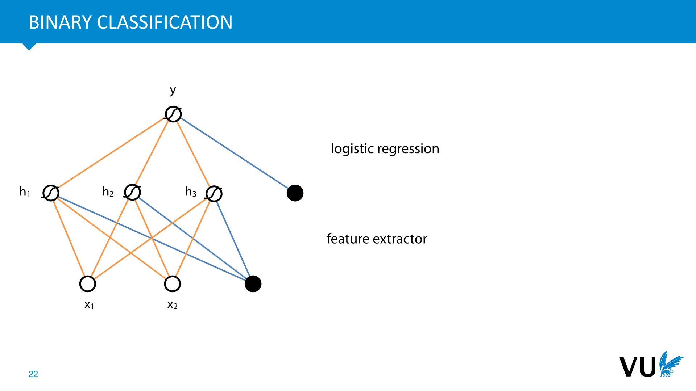
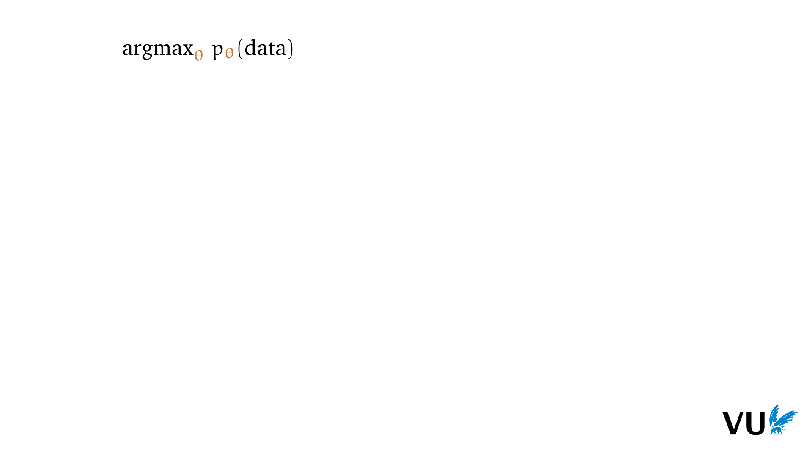

<nav class="menu">
    <ul>
        <li class="home"><a href="/">Home</a></li>
        <li class="name">Introduction</li>
                <li><a href="#video-000">Neural networks</a></li>
                <li><a href="#video-020">Classification and regression</a></li>
                <li><a href="#video-034">Autoencoders</a></li>
        <li class="pdf"><a href="https://dlvu.github.io/pdfs/lecture01.introduction.annotated.pdf">PDF</a></li>
    </ul>
</nav>

<article class="slides">

       <section class="video" id="video-000">
           <a class="slide-link" href="https://dlvu.github.io/introduction#video-0">link here</a>
           <iframe
                src="https://www.youtube.com/embed/MrZvXcwQJdg?si=BRr6mIPzcjbE1N_a"
                title="YouTube video player"
                frameborder="0" allow="accelerometer; autoplay; clipboard-write; encrypted-media; gyroscope; picture-in-picture"
                allowfullscreen>
           </iframe>

       </section>

       <section id="slide-001">
            <a class="slide-link" href="https://dlvu.github.io/introduction#slide-001" title="Link to this slide.">link here</a>
            

            <figcaption>
            
  

 

In this lecture, we will discuss the basics of neural networks. What they are, and how to use them.

            </figcaption>
       </section>

       <section id="slide-002">
            <a class="slide-link" href="https://dlvu.github.io/introduction#slide-002" title="Link to this slide.">link here</a>
            

            <figcaption>
            

            </figcaption>
       </section>

       <section id="slide-003">
            <a class="slide-link" href="https://dlvu.github.io/introduction#slide-003" title="Link to this slide.">link here</a>
            

            <figcaption>
            

            </figcaption>
       </section>

       <section id="slide-004">
            <a class="slide-link" href="https://dlvu.github.io/introduction#slide-004" title="Link to this slide.">link here</a>
            

            <figcaption>
            
We’ll start with a quick recap of the basic principles behind neural networks. We expect you’ve seen most of this before, but it’s worth revisiting the most important parts, and setting up our names and notation for them 

The name neural network comes from neurons the cells that make up most of our brain and nervous system. A neuron receives multiple different input signals from other cells through connections called <strong>dendrites</strong>. It processes these in a relatively simple way, deriving a single new output signal, which it sends out through its single <strong>axon</strong>. The axon branches out so that the single signal can reach multiple other cells. 

In the very early days of AI (the late 1950s), researchers decided to try a simple approach: the brain is the only intelligent system we know, and the brain is made of neurons, so why don’t we simply model neurons in a computer? 

 

            </figcaption>
       </section>

       <section id="slide-005">
            <a class="slide-link" href="https://dlvu.github.io/introduction#slide-005" title="Link to this slide.">link here</a>
            

            <figcaption>
            
The of idea of a neuron needed to be radically simplified to work with computers of that age, but doing so yielded one of the first successful machine learning systems: <strong>the perceptron</strong>. 

The perceptron has a number of <em>inputs</em>, each of which is multiplied by a <strong>weight</strong>. The result is summed over all weights and inputs, together with a <strong>bias parameter</strong>, to provide the <em>output</em> of the perceptron. If we're doing binary classification, we can take the sign of the output as the class (if the output is bigger than 0 we predict class A otherwise class B). 

The bias parameter is often represented as a special input node, called a<strong> bias node</strong>, whose value is fixed to 1. 

For most of you, this will be nothing new. This is simply a linear classifier or linear regression model. It just happens to be drawn as a network.  

But the real power of the brain doesn't come from single neurons, it comes from <em>chaining a large number of neurons together</em>. Can we do the same thing with perceptrons: link the outputs of one perceptron to the inputs of the next in a large network, and so make the whole more powerful than any single perceptron?

            </figcaption>
       </section>

       <section id="slide-006" class="anim">
            <a class="slide-link" href="https://dlvu.github.io/introduction#slide-006" title="Link to this slide.">link here</a>
            

            <figcaption>
            
This is where the perceptron turns out to be too simple an abstraction. Composing perceptrons (making the output of one perceptron the input of another) doesn’t make them more powerful. 

As an example, we’ve chained three perceptrons together on the left. We can write down the function computed by this perceptron, as shown on the bottom left. Working out the brackets gives us a simple linear function of four arguments. Or equivalently, a single perceptron with 4 inputs. This will always happen, no matter how we chain the perceptrons together. 

This is because perceptrons are <strong>linear functions</strong>. Composing together linear functions will only ever give you another linear function. We’re not creating models that can learning non-linear functions. 
<aside    >We’ve removed the bias node here for clarity, but that doesn’t affect our conclusions: any composition of affine functions is itself an affine function. </aside>
If we're going to build networks of perceptrons that do anything a single perceptron can't do, we need another trick.

            </figcaption>
            click image for animation
       </section>

       <section id="slide-007" class="anim">
            <a class="slide-link" href="https://dlvu.github.io/introduction#slide-007" title="Link to this slide.">link here</a>
            

            <figcaption>
            
The simplest solution is to apply a <em>nonlinear</em> function to each neuron, called the <strong>activation function.</strong> This is a scalar function (a function from a number to another number) which we apply to the output of a perceptron after all the weighted inputs have been combined.  

One popular option (especially in the early days) is the <strong>logistic sigmoid</strong>. The sigmoid takes the range of numbers from negative to positive infinity and squishes them down to the interval between 0 and 1. 

Another, more recent nonlinearity is the<strong> linear rectifier</strong>, or <strong>ReLU</strong> nonlinearity. This function just sets every negative input to zero, and keeps everything else the same. 

Not using an activation function is also called using a <strong>linear activation</strong>. 
<aside    >If you're familiar with logistic regression, you've seen the sigmoid function already: it's stuck on the end of a linear regression function (that is, a perceptron) to turn the outputs into class probabilities. Now, we will take these sigmoid outputs, and feed them as inputs to other perceptrons.</aside><aside    ></aside>
            </figcaption>
            click image for animation
       </section>

       <section id="slide-008">
            <a class="slide-link" href="https://dlvu.github.io/introduction#slide-008" title="Link to this slide.">link here</a>
            

            <figcaption>
            
Using these nonlinearities, we can arrange single neurons into <strong>neural networks</strong>. Any arrangement of perceptrons and nonlinearities makes a neural network, but for ease of training, the arrangement shown here was the most popular for a long time.  

It’s called a <strong>feedforward network </strong>or <strong>multilayer perceptron</strong>. We arrange a layer of hidden units in the middle, each of which acts as a perceptron with a nonlinearity, connecting to all input nodes. Then we have one or more output nodes, connecting to all nodes in the hidden layer. Crucially: 

There are <strong>no cycles</strong>, the network “feeds forward” from input to output. 

Nodes in the same layer are not connected to  each other, or to any other layer than the previous one. 

Each layer is <strong>fully connected</strong> to the previous layer, every node in one layer connects to every node in the layer before it. 

In the 80s and 90s feedforward networks usually had just one hidden layer, because we hadn’t figured out how to train deeper networks. Later, we began to see neural networks with more hidden layers, but still following these basic rules. 
<aside    >Note: Every orange and blue line in this picture represents one parameter of the model.</aside><aside    ></aside>
            </figcaption>
       </section>

       <section id="slide-009">
            <a class="slide-link" href="https://dlvu.github.io/introduction#slide-009" title="Link to this slide.">link here</a>
            

            <figcaption>
            
With that, let’s see how we can use such a feedforward network to attack some basic machine learning problems. 

If we want to train a <strong>regression</strong> model (a model that predicts a numeric value), we put non-linearities on the hidden nodes, and no activation on the output node. That way, the output can range from negative to positive infinity, and the nonlinearities on the hidden layer ensure that we can learn functions that a single perceptron couldn't learn. 

We can think of the first layer as learning some nonlinear transformation of the inputs, the <em>features</em> in machine learning parlance, and we can think of the the second layer as performing linear regression on these derived, nonlinear features.

            </figcaption>
       </section>

       <section id="slide-010" class="anim">
            <a class="slide-link" href="https://dlvu.github.io/introduction#slide-010" title="Link to this slide.">link here</a>
            

            <figcaption>
            
The next step is to figure out a <strong>loss function</strong>. This tells you how well your network is doing with its current weights. The lower the loss the better you are doing. 

Here’s what that looks like for a simple regression problem. We feed the network somebody’s age and weight, and we we ask it to predict their blood pressure. We compare the predicted blood pressure y to the true blood pressure t (which we assume is given by the data). The loss should then be a value that is high if the prediction is very wrong and that gets lower as the prediction gets closer to the truth. 

A simple loss function for regression is the <strong>squared error</strong>. We just take the difference between the prediction y and the truth t, and we square it. This gives us a value that is 0 for a perfect prediction and that gets larger as the difference between y and t gets bigger. 
<aside    >It’s nice if the loss is zero when the prediction is perfect, but this isn’t required.  </aside><aside    >The loss can be defined for a single instance (as it is here) or for all instances in the data. Usually, the loss over the whole data is just the average loss over all instances.</aside><aside    ></aside>
            </figcaption>
            click image for animation
       </section>

       <section id="slide-011" class="anim">
            <a class="slide-link" href="https://dlvu.github.io/introduction#slide-011" title="Link to this slide.">link here</a>
            

            <figcaption>
            
With the loss function decided, we can starting looking for weights (i.e. model parameters) that result in a low loss over the data. 

The better our model, the lower the loss. If we imagine a model with just two weights then the set of all models, called the <strong>model space</strong>, forms a plane. For every point in this plane, our loss function defines a loss. We can draw this above the plane as a surface: the <strong>loss surface </strong>(sometimes also called, more poetically, the loss <em>landscape</em>). 
<aside    >Make sure you understand the difference between the model, a function from the inputs x to the outputs y in which the weights act as constants, and the loss function, a function from the weights to a loss value, <strong>in which the data acts as constants</strong>. </aside>
The symbol <strong>θ</strong> is a common notation referring to the set of all weights of a model (sometimes combined into a vector, sometimes just a set).

            </figcaption>
            click image for animation
       </section>

       <section id="slide-012">
            <a class="slide-link" href="https://dlvu.github.io/introduction#slide-012" title="Link to this slide.">link here</a>
            

            <figcaption>
            
Here’s what a loss surface might look like for a model with just two parameters. 

Our job is to search the loss surface for a low point. When the loss is low, the model predictions are close to the target labels, and we've found a model that does well.

            </figcaption>
       </section>

       <section id="slide-013">
            <a class="slide-link" href="https://dlvu.github.io/introduction#slide-013" title="Link to this slide.">link here</a>
            

            <figcaption>
            
This is a common way of summarizing this aim of machine learning. We have a large space of possible parameters, with <strong>θ </strong>representing a single choice, and in this space we want to find the <strong>θ </strong>for which the loss on our chosen dataset is minimized. 
<aside    >It turns out this is actually an oversimplification, and we don't want to solve this particular problem too well. We'll discuss this in a future lecture. For now, this serves as a reasonable summary of what we're trying to do.</aside><aside    ></aside>
            </figcaption>
       </section>

       <section id="slide-014" class="anim">
            <a class="slide-link" href="https://dlvu.github.io/introduction#slide-014" title="Link to this slide.">link here</a>
            

            <figcaption>
            
So, how do we find the lowest point on a surface? This is where <em>calculus</em> comes in. 

In one dimension, we can approximate a function at a particular point, by finding the tangent line at that point: the line that just touches the function without crossing it. The slope of the tangent line tells us how much the line rises if we take one step to the right. This is a good indication of how much the function itself rises as well at the point at which we took the tangent. 

The slope of the tangent line is called <strong>the derivative</strong>. 

If you are entirely new to derivatives, you should brush up a little. <a href="https://mlvu.github.io/preliminaries/#slide-058"><strong>See these slides for a place to start.</strong></a> 
<aside    > </aside><aside    ></aside>
            </figcaption>
            click image for animation
       </section>

       <section id="slide-015" class="anim">
            <a class="slide-link" href="https://dlvu.github.io/introduction#slide-015" title="Link to this slide.">link here</a>
            

            <figcaption>
            
If our input space has multiple dimensions, like our model space, we can simply take a derivative with respect to each input, separately, treating the others as constants. This is called a<strong> partial derivative</strong>. The collection of all possible partial derivatives is called <strong>the gradient</strong>.  

The partial derivatives of the loss surface, one for each model weight, tell us how much the loss falls or rises if we increase each weight. Clearly, this information can help us decide how to change the weights.  

If we interpret the gradient as a vector, we get an arrow in the model space. This arrow points in the direction in which the function grows the fastest. Taking a step in <em>the opposite direction</em> means we are <em>descending</em> the loss surface. 

In our case, this means that if we can work out the gradient of the loss, then we can take a small step in the opposite direction and be sure that we are moving to a lower point on the loss surface. Or to put it differently be sure that we are <em>improving  our model</em>. 
<aside    >The symbol for the gradient is a downward pointing triangle called a nabla. The subscript indicates the variable over which we are taking the derivatives.  Note that in this case we are treating θ as a vector.</aside><aside    ></aside>
            </figcaption>
            click image for animation
       </section>

       <section id="slide-016">
            <a class="slide-link" href="https://dlvu.github.io/introduction#slide-016" title="Link to this slide.">link here</a>
            

            <figcaption>
            
To summarize: <strong>the gradient is an arrow that points in the direction of steepest ascent</strong>. That is, the gradient of our loss (at the dot) is the direction in which the loss surface increases the quickest.  
<aside    >More precisely, if we fit a tangent hyperplane to the loss surface at the dot, then the direction of steepest ascent on that hyperplane is the gradient. Since it's a hyperplane, the opposite direction (the gradent with a minus in front of it) is the direction of steepest descent. </aside><aside    >This is why we care about the gradient: it helps us find a downward direction on the loss surface. All we have to do is follow the negative gradient and we will end up lowering our loss.</aside><aside    ></aside>
            </figcaption>
       </section>

       <section id="slide-017" class="anim">
            <a class="slide-link" href="https://dlvu.github.io/introduction#slide-017" title="Link to this slide.">link here</a>
            

            <figcaption>
            
This is the idea behind the <strong>gradient descent algorithm</strong>. We compute the gradient, take a small step in the <em>opposite direction</em> and repeat.  
<aside    >Note that we’re subtracting the (scaled) gradient. Or rather, we’re adding the negative of the gradient. This results in taking a step in the opposite direction of the gradient. </aside>
The reason we take<em> small</em> steps is that the gradient is only the direction of steepest ascent <em>locally</em>. It's a linear approximation to the <em>non</em>linear loss function. The further we move from our current position, the worse an approximation the tangent hyperplane will be for the function that we are actually trying to follow. That's why we only take a small step, and then <em>recompute</em> the gradient in our new position. 

We can compute the gradient of the loss with respect to a single example from our dataset, a small batch of examples, or over the whole dataset. These options are usually called stochastic, minibatch and full-batch gradient descent respectively.  
<aside    >These terms are use interchangeably in the literature, but we’ll try to stick to these definitions in the course. </aside>
In deep learning, we almost always use <strong>minibatch gradient descent,</strong> but there are some cases where full-batch is used. 

Training usually requires multiple passes over the data. One such pass is called an <strong>epoch</strong>.

            </figcaption>
            click image for animation
       </section>

       <section id="slide-018">
            <a class="slide-link" href="https://dlvu.github.io/introduction#slide-018" title="Link to this slide.">link here</a>
            

            <figcaption>
            
This is the basic idea of neural networks. We define a perceptron, a simplified model of a neuron, which we chain together into a neural network, with nonlinearities added. We then define a loss, and train by gradient descent to find good weights. 

What we haven't discussed is how to work out the gradient of a loss function over a neural network. For simple functions, like linear classifiers, this can be done by hand. For more complex functions, like very deep neural networks, this is no longer feasible, and we need some help.  

This help comes in the form of the <strong>backpropagation</strong> algorithm. This is a complex and very important algorithm, so we will dive into it in the next lecture. 

            </figcaption>
       </section>

       <section id="slide-019">
            <a class="slide-link" href="https://dlvu.github.io/introduction#slide-019" title="Link to this slide.">link here</a>
            

            <figcaption>
            
Before we move on, it's important to note that the name neural network is not much more than a historical artifact. The original neural networks were very loosely inspired by the networks of neurons in our heads, but even then the artificial neural nets were so simplified that they had little to do with the real thing.  

Today's neural nets are nothing like brain networks, and serve in no way as a realistic model of what happens in our head. In short, don't read too much into the name. 

 

            </figcaption>
       </section>

       <section id="slide-020">
            <a class="slide-link" href="https://dlvu.github.io/introduction#slide-020" title="Link to this slide.">link here</a>
            

            <figcaption>
            

            </figcaption>
       </section>

       <section class="video" id="video-020">
           <a class="slide-link" href="https://dlvu.github.io/introduction#video-20">link here</a>
           <iframe
                src="https://www.youtube.com/embed/-JNj1legjHw?si=unWk3uoiBqGfVnmt"
                title="YouTube video player"
                frameborder="0" allow="accelerometer; autoplay; clipboard-write; encrypted-media; gyroscope; picture-in-picture"
                allowfullscreen>
           </iframe>

       </section>

       <section id="slide-021">
            <a class="slide-link" href="https://dlvu.github.io/introduction#slide-021" title="Link to this slide.">link here</a>
            

            <figcaption>
            
  

 

So, now we know how to build a neural network, and we know broadly how to train one by gradient descent (taking it as read for now that there’s a special way to work out a gradient, that we’ll talk about later). What can we do with this? We’ll start with the basic machine learning tasks of <strong>classification </strong>and <strong>regression</strong>. These will lead to some loss functions that we will build on a lot during the course. 

It will also show how we use <strong>probability theory</strong> in deep learning, which is important to understand. 

            </figcaption>
       </section>

       <section id="slide-022" class="anim">
            <a class="slide-link" href="https://dlvu.github.io/introduction#slide-022" title="Link to this slide.">link here</a>
            

            <figcaption>
            
If we have a classification problem with two classes, whcih we’ll call <em>positive</em> and <em>negative</em>, we can place<strong> a sigmoid activation</strong> on the output layer, so that the output is between 0 and 1.  

We can then interpret this as the<strong> probability </strong>that the input has the <strong>positive</strong> class (according to our network). The probability of the negative class is 1 minus this value. 

 

            </figcaption>
            click image for animation
       </section>

       <section id="slide-023">
            <a class="slide-link" href="https://dlvu.github.io/introduction#slide-023" title="Link to this slide.">link here</a>
            

            <figcaption>
            
So, what’t our loss here? The situation is a little different from the regression setting. Here, the neural network predicts a number between 0 and 1, and the data only gives us a value that is true or false. Broadly, what we want from the loss is that it is a low value if the probability of the true class is close to one, and high if the probability of the true class is low. 

One popular function that does this for us is the <strong>log loss</strong>. <strong>The negative logarithm of the probability of the true class.</strong> We’ll just give you the functional form for now. We’ll show where it comes from later. The log loss is also known as <strong>the cross-entropy.  </strong>
<aside    >See <a href="https://mlvu.github.io/lecture04/#video-067">this lecture</a> to learn why.  </aside>
We suggest you think a bit about the shape of the log function, and convince yourself that this is indeed a function with the correct properties. 
<aside    >The base of the logarithm can be anything. It’s usually e or 2.</aside><aside    ></aside>
            </figcaption>
       </section>

       <section id="slide-024" class="anim">
            <a class="slide-link" href="https://dlvu.github.io/introduction#slide-024" title="Link to this slide.">link here</a>
            

            <figcaption>
            
What if we have more than one class? Then we want the network to somehow output a probability distribution over <em>all classes</em>. We can’t do this with a single node anymore. Instead, we’ll give the network one output node for every possible class. 

We can then use the <strong>softmax activation</strong>. This is an activation function that ensures that all the output nodes are positive and that they always sum to one. In short, that together they form a <strong>probability vector</strong>. We can then interpret this series of values as the class probabilities that our network predicts. That is, after the softmax we can interpret the output of node 3 as the probability that our input has class 3. 

To compute the softmax, we simply take <em>the exponent </em>of each output node oi (to ensure that they are all positive) and then divide each by the total (to ensure that they sum to one). We could make the values positive in many other ways (taking the absolute or the square), but the exponent is a common choice for this sort of thing in statistics and physics, and it seems to work well enough. 
<aside    >Note that the softmax is a little unusual for an activation function: it’s not element-wise like the sigmoid or the ReLU. To compute the value of one output node, it looks at the inputs of  all the other nodes in the same layer. </aside><aside    ></aside>
            </figcaption>
            click image for animation
       </section>

       <section id="slide-025">
            <a class="slide-link" href="https://dlvu.github.io/introduction#slide-025" title="Link to this slide.">link here</a>
            

            <figcaption>
            
The loss function for the softmax is the same as it was for the binary classification. We assume that the data tells us what the correct class is, and we take the negative log-probability of the correct class as the loss. This way, the higher the probability is that the model assigns to the correct class, the lower the loss.<em> </em>

<em>Note that we can apply this trick also to a binary classification problem. That is, we don’t need to do binary classification with a single output node, we can also use two output nodes and a softmax.  </em>

<em>In practice, both options lead to almost the same gradients. The single-node option saves a little memory, but probably nothing noticeable. The  multi-node option is a little more flexible when you want to use the same code on different classification tasks.</em> 

            </figcaption>
       </section>

       <section id="slide-026" class="anim">
            <a class="slide-link" href="https://dlvu.github.io/introduction#slide-026" title="Link to this slide.">link here</a>
            

            <figcaption>
            
Here are some common loss functions for situations where we have examples t of what the model output y should be for a given input <strong>x</strong>.  

The error losses are derived from basic regression. The (binary) cross entropy comes from logistic regression (as shown last lecture) and the hinge loss comes from support vector machine classification. You can find their derivations in most machine learning books/courses.  

The loss can be computed for a single example or for multiple examples. In almost all cases, the loss for multiple examples is just the sum or average over all their individual losses.

            </figcaption>
            click image for animation
       </section>

       <section id="slide-027">
            <a class="slide-link" href="https://dlvu.github.io/introduction#slide-027" title="Link to this slide.">link here</a>
            

            <figcaption>
            
To finish up, let’s have a look at where these loss functions <em>come from</em>. We didn’t just find them by trial and error, many of them were derived from first principles. And the principle at work is a very powerful one: <strong>the maximum likelihood principle</strong>. 

This is often used in frequentist statistics to fit models to data. Put simply, it says that given some data, and a class of models, a good way of picking your model is to see what the probability of the data is under each model and then picking the model for which the probability of the data is highest. 
<aside    >There are many problems with this approach, and many settings in which it fails, but it’s usually a simple and intuitive place to start. </aside>
In statistics you usually fill in the definition of p and solve the maximization problem until you get an explicit expression of your optimal model as a function of your data.  
<aside    >For instance, say the data is numerical, and the model class is the normal distribution. Then after a bit of scribbling you can work out that the mean of your data and the standard deviation of your data are the parameters of the normal distribution that fit your data best, according to the maximum likelihood principle. </aside>
In our setting, things aren’t so easy. The parameters we are allowed to change are the parameters of the neural network (which decides the distribution on the labels). We cannot find a closed form solution for neural networks usually, but we can still start with the maximum likelihood principle and see what we can rewrite it into.

            </figcaption>
       </section>

       <section id="slide-028" class="anim">
            <a class="slide-link" href="https://dlvu.github.io/introduction#slide-028" title="Link to this slide.">link here</a>
            

            <figcaption>
            
Let’s try this for the binary classification network. 
<aside    >Here we assume that the neural network with weights θ will somehow describe the probability pθ(data) of seeing the whole dataset.  </aside>
The first step is to note that our data consists of<em> independent, identically distributed samples</em> (<strong>x</strong>, t), where <strong>x</strong> is the feature vector and t is the corresponding class. This means that the probability of all the data is just the product of all the individual instances.  
<aside    >Because they are independently sampled, we may multiply their probabilities together. </aside>
Next, we note that we are only modelling the probabilities <strong>of the classes, not of the features by themselves </strong>(in fancy words, we have a discriminative classifier). This means that the probability of each instance is just the probability of the class given the features. 

Next, we stick a logarithm in front. This is a slightly arbitrary choice, but if you work with probability distributions a lot, you will know that taking logarithms of probabilities almost always makes your life easier: you get simpler functions, better numerical stability, and better behaved gradients. Crucially, because the logarithm is a monotonic function, the position of the maximum doesn’t change: the model that maximizes the probability of the data is the same as the model that maximizes the log-probability. 

Taking the logarithm inside the product, turns the product into a sum. Finally, we want something to minimize, not maximize, so we stick a minus in front and change the argmax to an argmin. We can then rescale by any constant without moving the minimum. If we use 1/N, with N the size of our data, then <strong>we end up with the average log loss over the whole dataset</strong>. 

That is, if we start with the maximum likelihood objective, we can show step by step that this is equivalent to minimizing the log loss. 
<aside    >A deeper reason for the “- log” is that every probability distribution can be thought of as a compression algorithm, and the negative log2 probability is the number of bits you need to encode with this compression algorithm. See <a href="https://mlvu.github.io/lecture04/#video-067"><strong>this lecture</strong></a> for details. </aside>

            </figcaption>
            click image for animation
       </section>

       <section id="slide-029">
            <a class="slide-link" href="https://dlvu.github.io/introduction#slide-029" title="Link to this slide.">link here</a>
            

            <figcaption>
            
We can generalize this idea by viewing the output of the neural network as <strong>the parameters of a probability distribution</strong>. 

For instance, in the binary classification network, the output of the network is the probability of one of the two classes. This is the parameter θ, for a Bernoulli distribution on the space of the two classes {positive, negative}. 

In the softmax example, the network output is a<em> probability vector</em>. This is the parameter for a Categorical distribution on the space of all classes {1, …, K}. 

To finish up, let’s see what happens if we extend this to another distribution: the Normal distribution.

            </figcaption>
       </section>

       <section id="slide-030" class="anim">
            <a class="slide-link" href="https://dlvu.github.io/introduction#slide-030" title="Link to this slide.">link here</a>
            

            <figcaption>
            
The normal distribution is a distribution on the number line, so this fits best to a regression problem. We’ll return to our earlier example. We give the network an age and a weight and our aim is to predict the blood pressure. However, instead of treating the output node as the predicted blood pressure directly, we treat it as <strong>the mean of a probability distribution</strong> on the space of all blood pressures. 
<aside    >To keep things simple, we fix the variance to 1 and predict only the mean. We can also give the neural network two outputs, and have it parametrize the whole normal distribution. We’ll see examples of this later in the course. </aside>
Note that in this picture, we are moving the mean around to maximize the probability density of the true value t. We move the mean by changing the weights of the neural network. Of course, for every instance we see, t will be in a new place, so the weights should give us a new mean for every input <strong>x</strong> we see.

            </figcaption>
            click image for animation
       </section>

       <section id="slide-031" class="anim">
            <a class="slide-link" href="https://dlvu.github.io/introduction#slide-031" title="Link to this slide.">link here</a>
            

            <figcaption>
            
So what does the maximum likelihood objective look like for this problem? 
<aside    >We’re maximizing the probability density rather than the probability, but the approach remains the same. </aside>
First, we follow the same steps as before. This turns our maximum likelihood into a minimum min-log probability (density). We use the base-e logarithm to make our life easier. 

Then we fill in the definition of the normal probability density. This is a complicated function, but it quickly simplifies because of the logarithm in from of it. The parts in grey are additive or multiplicative constants, which we can discard without changing the location of the minimum. 

After we’ve stripped away everything we can, we find that the result is just a plain old squared error loss, that we were using all along.  

            </figcaption>
            click image for animation
       </section>

       <section id="slide-032" class="anim">
            <a class="slide-link" href="https://dlvu.github.io/introduction#slide-032" title="Link to this slide.">link here</a>
            

            <figcaption>
            <aside    >You may wonder if this is how the squared error loss that we use so much was first discovered: by starting with the famous normal distribution and then working out the maximum likelihood solution for its parameters. The truth is a little stranger.  </aside><aside    >In point of fact it was the other way around. Gauss, who discovered the Normal distribution, started with the idea of <strong>the mean</strong> of a set of measurements as a good approximation of the true value. This was something people had been using since antiquity. He wanted to justify its use. </aside><aside    >Gauss invented the maximum likelihood principle to do so. Then he asked himself what kind of probability density function would have the mean as its maximum likelihood solution. He worked out that its logarithm would have to correspond to the squares of the residuals, and from that worked out the basic form of the normal distribution, doing what we just did, but <strong>in the opposite direction</strong>. </aside><aside    ></aside>
            </figcaption>
            click image for animation
       </section>

       <section id="slide-033">
            <a class="slide-link" href="https://dlvu.github.io/introduction#slide-033" title="Link to this slide.">link here</a>
            

            <figcaption>
            
What we’ve shown is that almost all of the loss functions we use regularly, can be derived from this basic principle of maximum likelihood. This is important to understand, because it’s a principle we will return to multiple times throughout the course, especially in the context of generative models.

            </figcaption>
       </section>

       <section id="slide-034">
            <a class="slide-link" href="https://dlvu.github.io/introduction#slide-034" title="Link to this slide.">link here</a>
            

            <figcaption>
            

            </figcaption>
       </section>

       <section class="video" id="video-034">
           <a class="slide-link" href="https://dlvu.github.io/introduction#video-34">link here</a>
           <iframe
                src="https://www.youtube.com/embed/M1hh8HcWEzk?si=8OlYpUyuibS7PJI5"
                title="YouTube video player"
                frameborder="0" allow="accelerometer; autoplay; clipboard-write; encrypted-media; gyroscope; picture-in-picture"
                allowfullscreen>
           </iframe>

       </section>

       <section id="slide-035">
            <a class="slide-link" href="https://dlvu.github.io/introduction#slide-035" title="Link to this slide.">link here</a>
            

            <figcaption>
            
  

So, we’ve seen what neural networks are, and how to use them for regression and for classification. But the real power of neural networks is not in doing classical machine learning tasks. Rather it’s in their flexibility to grow <em>beyond</em> that. The idea is that neural networks can be set up in a wild variety of different configurations, to solve all sorts of different tasks. 

To give you a hint of that, we’ll finish up by looking at a simple example: <strong>the autoencoder</strong>.

            </figcaption>
       </section>

       <section id="slide-036">
            <a class="slide-link" href="https://dlvu.github.io/introduction#slide-036" title="Link to this slide.">link here</a>
            

            <figcaption>
            
Here’s what an autoencoder looks like. It’s is a particular type of neural network, shaped like an hourglass. Its job is just to make the output as close to the input as possible, but somewhere in the network there is a small layer that functions as a bottleneck. 

We can set it up however we like, with one or many fully connected layers. The only requirements are that (a)  one of the layers forms a bottleneck, and (b) that the input is the same size as the output. 

The idea is that we simply train the neural network to reconstruct the input. If we manage to train a network that does this successfully, then we know that whatever value the bottleneck layer takes for a particular input is a low-dimensional representation of that input, from which we can pretty well decode the input,  so it must contain the relevant details. 
<aside    >Note how powerful this idea is. We don’t even need any labeled data. All we need is a large amounts of examples (images, sentences, etc) and with that we can train an autoencoder.</aside><aside    ></aside>
            </figcaption>
       </section>

       <section id="slide-037" class="anim">
            <a class="slide-link" href="https://dlvu.github.io/introduction#slide-037" title="Link to this slide.">link here</a>
            

            <figcaption>
            
Here’s the picture in detail. We call the bottom half of the network the <strong>encoder</strong> and the top half the <strong>decoder</strong>. We feed the autoencoder an instance from our dataset, and all it has to do is reproduce that instance in its output. We can use any loss that compares the output to the original input, and produces a lower loss, the more similar they are. Then, we just brackpropagate the loss and train by gradient descent. 
<aside    >To feed a neural network an image, we can just flatten the whole thing into a vector. Every color channel of every pixel becomes an input node, giving us, in this case 128 × 128 × 3 inputs. This is a bit costly, but we’ll see some more efficient ways to feed images to neural networks soon. </aside>
Many loss functions would work here, but to keep things simple, we’ll stick with the squared error loss. 

We call the  blue layer the <strong class="blue">latent representation</strong> of the input. If we train an autoencoder with just two nodes in the bottleneck layer, we can plot in two dimensions what latent representation each input is assigned. If the autoencoder works well, we expect to see similar images clustered together (for instance smiling people vs frowning people, men vs women, etc). This is often called the <strong>latent space</strong> of a network.  
<aside    >No need to read too much into that yet, but it’s phrase that will come back often. </aside><aside    >In a 2D space, we can’t cluster too many attributes together, but in higher dimensions it’s easier.  To quote <a href="http://jeffclune.com/courses/media/courses/2016-Fall-AI/lectures/L24-AI-2016.pdf"><strong class="blue">Geoff Hinton</strong></a>: “If there was a 30 dimensional supermarket, [the anchovies] could be close to the pizza toppings and close to the sardines.”</aside><aside    ></aside>
            </figcaption>
            click image for animation
       </section>

       <section id="slide-038">
            <a class="slide-link" href="https://dlvu.github.io/introduction#slide-038" title="Link to this slide.">link here</a>
            

            <figcaption>
            
To show what this looks like, we've set up a relatively simple autoencoder. It uses a few tricks we haven’t discussed yet, but the basic principle is just neural network with a bottleneck and a squared error loss. The size of the bottleneck layer is 256 nodes. 

We train it on a low-resolution version of the <a href="https://github.com/NVlabs/ffhq-dataset"><strong class="blue">FFHQ dataset</strong></a>, containing 70 000 images of faces with resolution 128 × 128. 

Here are the reconstructions after 5 full passes over the data. 

            </figcaption>
       </section>

       <section id="slide-039">
            <a class="slide-link" href="https://dlvu.github.io/introduction#slide-039" title="Link to this slide.">link here</a>
            

            <figcaption>
            

            </figcaption>
       </section>

       <section id="slide-040">
            <a class="slide-link" href="https://dlvu.github.io/introduction#slide-040" title="Link to this slide.">link here</a>
            

            <figcaption>
            

            </figcaption>
       </section>

       <section id="slide-041">
            <a class="slide-link" href="https://dlvu.github.io/introduction#slide-041" title="Link to this slide.">link here</a>
            

            <figcaption>
            
After 300 epochs, the autoencoder has pretty much converged. Here are the reconstructions next to the original data. Considering that we've reduced each image to just 256 numbers, it's not too bad.

            </figcaption>
       </section>

       <section id="slide-042" class="anim">
            <a class="slide-link" href="https://dlvu.github.io/introduction#slide-042" title="Link to this slide.">link here</a>
            

            <figcaption>
            
So, now that we have an autoencoder what can we do with it? One thing we can do is <strong>interpolation</strong>. 

If we take two points in the latent space, and draw a line between them, we can pick evenly spaced points on that line and decode them. If the decoder is good, and all the points in the latent space decode to realistic faces, then this should give us a smooth transition from one point to the other, and each point should result in a convincing example of our output domain. 
<aside    >This is not a guaranteed property of an autoencoder trained like this. We’ve only asked it to find a way to represent the data in the latent space. Still, you usually get decent interpolations from a simple autoencoder. In a few weeks, we will see variational autoencoders, which enforce more explicitly that all points in the latent space should decode to realistic examples.</aside><aside    ></aside>
            </figcaption>
            click image for animation
       </section>

       <section id="slide-043" class="anim">
            <a class="slide-link" href="https://dlvu.github.io/introduction#slide-043" title="Link to this slide.">link here</a>
            

            <figcaption>
            
Another thing we can do is to study the latent space based on the examples that we have. For instance, we can see whether smiling and non-smiling people end up in distinct parts of the latent space. 

We just label a small amount of instances as smiling and nonsmiling (just 20 each in this case). If we're lucky, these form distinct clusters in our latent space. If we compute the means of these clusters, we can draw a vector between them. We can think of this as a “smiling” vector. The further we push people along this line, the more the decoded point will smile. 

This is one big benefit of autoencoders: we can train them on unlabeled data (which is cheap) and then use only a <em>very</em> small number of labeled examples to “annotate” the latent space. In other words, autoencoders are a great way to do <strong>semi-supervised learning</strong>. 

            </figcaption>
            click image for animation
       </section>

       <section id="slide-044">
            <a class="slide-link" href="https://dlvu.github.io/introduction#slide-044" title="Link to this slide.">link here</a>
            

            <figcaption>
            
Once we've worked out what the smiling vector is, we can manipulate photographs to make people smile. We just encode their picture into the latent space, add the smiling vector (times some small scalar to control the effect), and decode the manipulated latent representation. If the autoencoder understands "smiling" well enough, the result will be the same picture but manipulated so that the person will smile.

            </figcaption>
       </section>

       <section id="slide-045">
            <a class="slide-link" href="https://dlvu.github.io/introduction#slide-045" title="Link to this slide.">link here</a>
            

            <figcaption>
            
Here is what that looks like for our (simple) example model. In the middle we have the decoding of the original data, and to the right we see what happens if we add an increasingly large multiple of the smiling vector. 

To the right we subtract the smiling vector, which makes the person frown.

            </figcaption>
       </section>

       <section id="slide-046" class="anim">
            <a class="slide-link" href="https://dlvu.github.io/introduction#slide-046" title="Link to this slide.">link here</a>
            

            <figcaption>
            
With a bit more powerful model, and some face detection, we can see what some famously moody celebrities might look like if they smiled. 

source: <a href="https://blogs.nvidia.com/blog/2016/12/23/ai-flips-kanye-wests-frown-upside-down/"><strong class="blue">https://blogs.nvidia.com/blog/2016/12/23/ai-flips-kanye-wests-frown-upside-down/</strong></a> 

            </figcaption>
            click image for animation
       </section>

       <section id="slide-047">
            <a class="slide-link" href="https://dlvu.github.io/introduction#slide-047" title="Link to this slide.">link here</a>
            

            <figcaption>
            
So, what we get out of an autoencoder, depends on which part of the model we focus on. 

If we keep the encoder and the decoder, we get a network that can help us manipulate data in this way. We map data to the latent space, tweak it there, and then map it back out of the latent space with the decoder. 

If we keep just the encoder, we get a powerful dimensionality reduction method. We can use the latent space representation as the features for a model that does not scale well to high numbers of features. 

One final thing we can do is to throw away the encoder and keep only the decoder. In that case the result is a <strong>generator network</strong>. A model that can generate fictional examples of the sort of thing we have in our dataset (in our case, pictures of people who don’t exist).

            </figcaption>
       </section>

       <section id="slide-048">
            <a class="slide-link" href="https://dlvu.github.io/introduction#slide-048" title="Link to this slide.">link here</a>
            

            <figcaption>
            
Here’s how that works. First, we train an autoencoder on our data. The encoder will map the data to a point cloud in our latent space.  

We don’t know what this point cloud will look like, but we’ll make a guess that a multivariate normal distribution will make a reasonable fit. We fit such a distribution to our data. If it does fit well, then the regions of our latent space that get high probability density, are also the regions that are likely to decode to realistic looking instances of our data. 

With that, we can sample a point from the normal distribution, pass it through the decoder, and get a new datapoint, that looks like it could have come from our data. 
<aside    >This is a bit like the interpolation example. There, we assumed that the points directly in between the two latent representations should decode to realistic examples. Here we assume that all the points that are anywhere near points in our data (as captured by the normal distribution) decode to realistic examples. </aside><aside    ></aside>
            </figcaption>
       </section>

       <section id="slide-049">
            <a class="slide-link" href="https://dlvu.github.io/introduction#slide-049" title="Link to this slide.">link here</a>
            

            <figcaption>
            
This is the point cloud of the latent representations in our example. We plot the first two of the 256 dimensions, resulting in the blue point cloud. 

To these points we fit a multivariate normal distribution (in 256 dimensions), and we sample 400 new points from it, the red dots.  

In short, we sample points in the latent space that do not correspond to the data, but that are sufficiently near the data that we can expect the decoder to give us something realistic.

            </figcaption>
       </section>

       <section id="slide-050">
            <a class="slide-link" href="https://dlvu.github.io/introduction#slide-050" title="Link to this slide.">link here</a>
            

            <figcaption>
            
If we feed these sampled points to the decoder, this is what we get.  

The results don’t look as good as the reconstructions, but clearly we are looking at approximate human faces.

            </figcaption>
       </section>

       <section id="slide-051">
            <a class="slide-link" href="https://dlvu.github.io/introduction#slide-051" title="Link to this slide.">link here</a>
            

            <figcaption>
            
This has given us a generator, but we have little control over what the cloud of latent representations looks like. We just have to hope that it looks enough like a normal distribution that our normal distribution makes a good fit.  

We’ve also seen that this interpolation works well, but it’s not something we’ve specifically trained the network to do.  

In short, the autoencoder is not a very principled way of getting a generator network. You may ask if there is a way to train a generator from first principles, perhaps starting with the maximum likelihood objective? 

The answer to all of these questions is <strong>the variational autoencoder</strong>, which we’ll discuss in a few weeks.

            </figcaption>
       </section>

       <section id="slide-052">
            <a class="slide-link" href="https://dlvu.github.io/introduction#slide-052" title="Link to this slide.">link here</a>
            

            <figcaption>
            

            </figcaption>
       </section>

</article>
