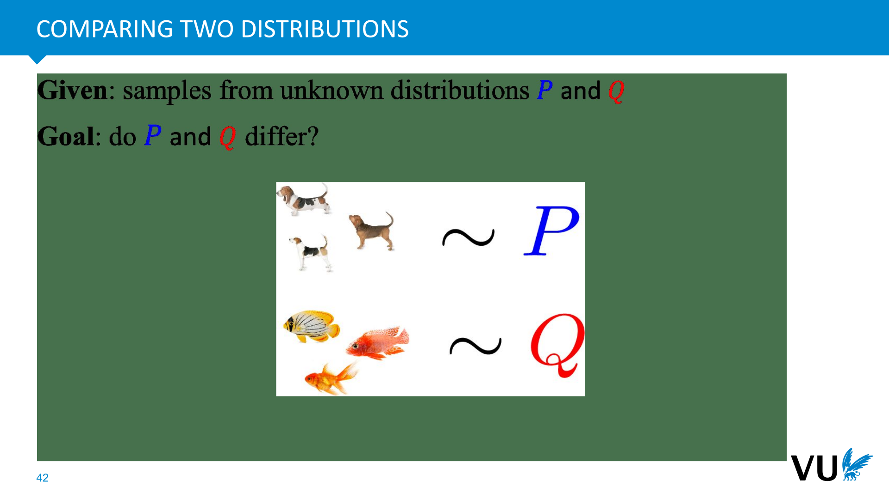
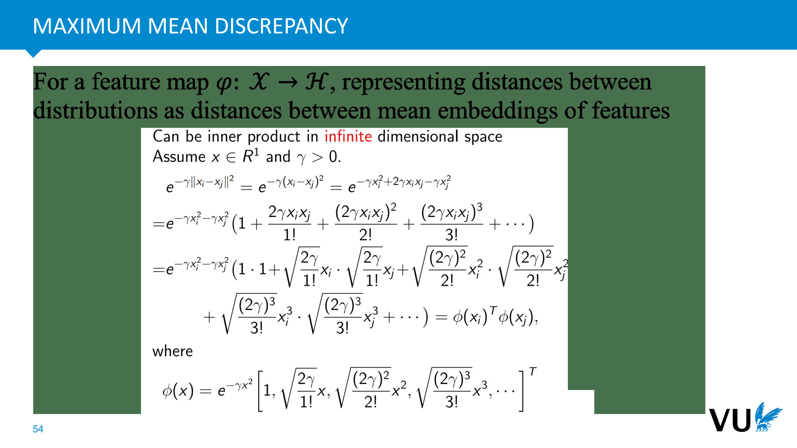

<nav class="menu">
    <ul>
        <li class="home"><a href="/">Home</a></li>
        <li class="name">Unsupervised representation learning</li>
                <li><a href="#video-000">Introduction</a></li>
                <li><a href="#video-008">VAE Implementation</a></li>
                <li><a href="#video-023">KL Divergence</a></li>
                <li><a href="#video-035">MMD-VAE</a></li>
        <li class="pdf"><a href="https://dlvu.github.io/lecture07.unsupervisedrepresentation.annotated.pdf">PDF</a></li>
    </ul>
</nav>

<article class="slides">

       <section class="video" id="video-000">
           <a class="slide-link" href="https://dlvu.github.io/unsuprepr#video-0">link here</a>
           <iframe
                src="https://"
                title="YouTube video player"
                frameborder="0" allow="accelerometer; autoplay; clipboard-write; encrypted-media; gyroscope; picture-in-picture"
                allowfullscreen>
           </iframe>

       </section>

       <section id="slide-001">
            <a class="slide-link" href="https://dlvu.github.io/unsuprepr#slide-001" title="Link to this slide.">link here</a>
            

            <figcaption>
             
            </figcaption>
       </section>

       <section id="slide-002">
            <a class="slide-link" href="https://dlvu.github.io/unsuprepr#slide-002" title="Link to this slide.">link here</a>
            

            <figcaption>
            
We're continuing our discussion on the rationale or code and unsupervised recognition in this lecture. The content is organized into three parts. Firstly, we'll delve into the practical implementation of the rationale, demonstrating the code through a demo. Secondly, we'll cover a fundamental aspect introduced in the last lecture, focusing on concepts like divergence, particularly K-divergence. A good divergence measure plays a crucial role, not just in the encoding process but also in various downstream applications. We'll explore two mainstream ideas in this lecture: K-divergence and maximum discrepancy, offering ways to compare and evaluate the distance between two distributions. Lastly, we'll showcase two advanced versions of auto-encoders, briefly introducing their general ideas and highlighting some limitations.

Let's revisit the key concepts from the previous lecture where we discussed a pivotal architecture in the deep learning community—the auto-encoder. This architecture differs significantly from convolutional neural networks or multi-layer perceptrons covered in previous lectures, which mainly focused on supervised learning with labeled samples. However, in practical scenarios, obtaining label information for each instance is often challenging or not feasible. This underscores the need for a robust architecture that accommodates unsupervised learning, a common requirement in many real-world applications where label information is either elusive or not available.

 
            </figcaption>
       </section>

       <section id="slide-003">
            <a class="slide-link" href="https://dlvu.github.io/unsuprepr#slide-003" title="Link to this slide.">link here</a>
            

            <figcaption>
            
How can we extract meaningful information from data when label information is absent? Among various architectures developed for this purpose, one notable model is the auto-encoder. Illustrated here, it comprises an encoder and a corresponding decoder. The encoder projects data from a typically high-dimensional space to a latent space, referred to as the latent location. On the other hand, the decoder attempts to reconstruct the input data. This general idea is closely tied to latent variable models, as explicitly learning the dependence of different inputs in the input space (denoted as X) is exceptionally challenging, given its often high dimensionality. To overcome this difficulty, latent variable models simplify the task by modeling something in the latent space, which can be more manageable. The latent space is conceptually meaningful; for example, in our previous lecture, we discussed how a face image's input might be influenced by various factors like the presence of eyeglasses, gender, and head posture. Each dimension of the latent code is expected to capture different variations.

In generative models or latent variable models, the primary focus is on learning an effective latent representation. The idea is that different dimensions of the latent code characterize distinct factors of variation. Once we've acquired this latent code, the decoder can be employed to generate diverse images or inputs. For instance, if we understand that one dimension controls the presence of eyeglasses, another the gender, and so on, we can combine these factors to generate various inputs. This ability to generate diverse outputs based on learned latent representations is why this model is termed a generative model. It provides a means to generate arbitrary inputs by leveraging knowledge of the latent distribution and the conditional probability of the decoder given the latent code (P(X|Z)).

 
            </figcaption>
       </section>

       <section id="slide-004">
            <a class="slide-link" href="https://dlvu.github.io/unsuprepr#slide-004" title="Link to this slide.">link here</a>
            

            <figcaption>
             
Although delving into some statistical derivations, the fundamental idea behind the rationale or code is crucial to grasp. We begin with the first principle derived from the maximum local likelihood, where θ represents the parameter of the decoder responsible for mapping from Z to X. This mapping function is governed by θ, and P(X|Z) is the conditional distribution. Additionally, Pdz denotes the prior, or the marginal distribution of Z, often referred to as the prior distribution.

In machine learning, maximizing the localized log-likelihood of P(X) is a common objective. However, this can be challenging. As an alternative, we aim to develop a lower bound for this objective. After some derivation, we arrive at the lower bound, known as the evidence lower bound (ELBO). The underlying principle is that maximizing this lower bound is a surrogate for maximizing the original objective. The logic here is that if we can maximize the lower bound, we may reasonably expect an improvement in the original objective.

To achieve this, we introduce the variational posterior distribution, denoted as Pφ(Z|X). The goal is to ensure that the Qφ(Z|X) distribution is a good approximation to the true posterior distribution P(Z|X). This is a crucial step in the process of maximizing the evidence lower bound, emphasizing the importance of accurate approximations to the true underlying distribution.

  
            </figcaption>
       </section>

       <section id="slide-005">
            <a class="slide-link" href="https://dlvu.github.io/unsuprepr#slide-005" title="Link to this slide.">link here</a>
            

            <figcaption>
            
The evidence lower bound (ELBO) comprises two terms, each with distinct roles. Let's delve into these terms in more detail. The first term intuitively quantifies the reconstruction error. To understand this, consider the process: we sample from the encoder (Qφ), obtaining a latent code (V) from an input image (X). This code is then fed into the decoder (Pθ), reconstructing the probability distribution (PX). Maximizing the log likelihood of PX effectively minimizes the reconstruction error. In essence, this term gauges how well the model reconstructs input data.

The second term controls the distance, or divergence, between the distribution generated by the encoder (Qφ(Z|X)) and the prior distribution (P(Z)). The goal is to minimize this divergence, ensuring that the distribution induced by the encoder closely matches the prior distribution. This alignment is crucial; if the two distributions match well, we can eliminate the need for the encoder, as anything it generates can be sampled from the prior distribution. This, in turn, allows for the generation of diverse inputs.

Another perspective on the first term involves assuming a Gaussian distribution for the decoder. In this case, the reconstruction error quantifies the Euclidean distance between the input (X) and the reconstructed input (Fθ(Z)), providing a measure of the error between the original and reconstructed data. This approach can be extended to other distributions, such as a Laplace distribution, leading to a different objective that evaluates the L1 distance or mean absolute error.

Regardless of the distribution assumptions, the overarching idea remains: the first term captures and quantifies the reconstruction error, comparing the original input with the reconstructed output, while the second term ensures alignment between the distributions induced by the encoder and the prior distribution.

 
            </figcaption>
       </section>

       <section id="slide-006">
            <a class="slide-link" href="https://dlvu.github.io/unsuprepr#slide-006" title="Link to this slide.">link here</a>
            

            <figcaption>
            
In practice, when implementing the encoder to generate images, the first term in the evidence lower bound (ELBO) is commonly computed using the mean squared error. Although the coding may seem straightforward, the underlying derivation indicates that this implicitly assumes the decoder follows a Gaussian distribution. Essentially, using the mean squared error aligns with the logic of assuming a Gaussian distribution for the decoder. It's worth noting that if a different assumption, like a Laplace distribution, is made, the result would be the mean absolute error.

The rationale behind introducing the variational strategy (Qφ(Z|X)) is to model a realistic distribution for Pθ(Z|X) and ensure a correspondence between each term's probability and the encoder-decoder structure under the prior distribution P(Z). This alignment is crucial, and it clarifies why the overall architecture is referred to as the "variational autoencoder" (VAE). The VAE framework allows for a more flexible and realistic modeling of latent spaces, accommodating diverse distributions and enhancing the generative capabilities of the model.

 
            </figcaption>
       </section>

       <section id="slide-007">
            <a class="slide-link" href="https://dlvu.github.io/unsuprepr#slide-007" title="Link to this slide.">link here</a>
            

            <figcaption>
            
In our previous lecture, we emphasized that the ultimate objective is to maximize the local likelihood, P(X). However, in practice, we aim to maximize the evidence lower bound (ELBO), creating a gap between the objective we want to optimize and the achievable lower bound. This gap is precisely quantified by the Kullback-Leibler (KL) divergence between the true posterior distribution, Pθ(Z|X), and our variational approximation, Qφ(Z|X). In other words, the extent to which our variational approximation aligns with the true underlying distribution directly influences the size of this gap. Minimizing this gap is a crucial aspect of training the model effectively. It ensures that our variational approximation provides a meaningful and accurate representation of the true posterior distribution, bringing us closer to the goal of maximizing the local likelihood.
 
            </figcaption>
       </section>

       <section id="slide-008">
            <a class="slide-link" href="https://dlvu.github.io/unsuprepr#slide-008" title="Link to this slide.">link here</a>
            

            <figcaption>
            
Absolutely, understanding the overarching logic and the conceptual meanings behind the evidence lower bound (ELBO) is crucial, even if delving into the mathematical details of the formulas may not be necessary. grasping the fundamental principles behind the ELBO and the significance of its components is essential.

In essence, the ELBO is a trade-off between two terms. The first term focuses on minimizing the reconstruction error, ensuring that the generated outputs closely match the original inputs. This term captures the essence of how well the model can reconstruct data, a key aspect in generative models.

The second term is centered around minimizing the divergence between the distribution induced by the encoder and the prior distribution. This alignment ensures that the latent space generated by the encoder closely resembles the true underlying distribution, allowing for more accurate generative capabilities.

Recognizing the existence of a gap between the objective to maximize the local likelihood and the achievable lower bound sheds light on the importance of the Kullback-Leibler (KL) divergence. Minimizing this gap is fundamental, as it signifies how well our variational approximation approximates the true posterior distribution.

So, while the detailed mathematical derivations might not be essential, having a conceptual grasp of these principles will significantly enhance your understanding of the variational autoencoder framework and its application in generative models.

 
            </figcaption>
       </section>

       <section class="video" id="video-008">
           <a class="slide-link" href="https://dlvu.github.io/unsuprepr#video-8">link here</a>
           <iframe
                src="https://"
                title="YouTube video player"
                frameborder="0" allow="accelerometer; autoplay; clipboard-write; encrypted-media; gyroscope; picture-in-picture"
                allowfullscreen>
           </iframe>

       </section>

       <section id="slide-009">
            <a class="slide-link" href="https://dlvu.github.io/unsuprepr#slide-009" title="Link to this slide.">link here</a>
            

            <figcaption>
               
In the first part of today's lecture, we'll discuss the practical implementation of the variational autoencoder (VAE). As you can envision, both the encoder and the decoder are realized as neural networks. The choice of neural network architecture depends on the nature of the data you are working with. For image modeling, convolutional neural networks (CNNs) might be employed, drawing from your previous lectures. Alternatively, for simpler datasets, a feedforward neural network may suffice.

Consider the flexibility of neural network architectures based on your specific application. If you are working with time series data or music, recurrent neural networks (RNNs) could be a suitable choice. Similarly, if your goal is to generate graphs or molecules, upcoming lectures will introduce specialized graph encoders tailored to these tasks.

The key takeaway is that the VAE framework is adaptable to various neural network structures, allowing you to tailor the architecture to the characteristics of your data and the goals of your generative model.
 
            </figcaption>
       </section>

       <section id="slide-010">
            <a class="slide-link" href="https://dlvu.github.io/unsuprepr#slide-010" title="Link to this slide.">link here</a>
            

            <figcaption>
            
Indeed, both the encoder and the decoder are parameterized by neural networks in the variational autoencoder (VAE) framework. The role of the encoder is to generate two key parameters: the mean and the log variance of the latent code (Z). Specifically, the encoder produces these two values, representing the statistical properties of the latent space. Assuming a Gaussian distribution for the latent space, the encoder effectively learns the mean and log variance of this distribution.

Once the mean (μ) and log variance (logσ^2) are learned by the encoder, a latent code Z can be sampled from the induced distribution P(Z|X). This sampling process is crucial for the generative aspect of the model. Since we assume a Gaussian distribution, we can sample a latent code Z by drawing from this Gaussian distribution using the mean and log variance.

With the sampled latent code Z, we then pass it to the decoder. The decoder's role is to reconstruct the input based on this latent code. In this way, the VAE learns to encode meaningful representations of the data in the latent space and subsequently decode them to reconstruct the original input. The entire process involves the encoder learning the parameters of a Gaussian distribution, sampling from that distribution, and then using the sampled latent code to reconstruct the input through the decoder.

 
            </figcaption>
       </section>

       <section id="slide-011">
            <a class="slide-link" href="https://dlvu.github.io/unsuprepr#slide-011" title="Link to this slide.">link here</a>
            

            <figcaption>
            
In practice, we assume that the latent variable Z follows a Gaussian distribution, and the task of the encoder is to generate two crucial parameters for this distribution: the mean (μ) and the log variance (logσ^2) denoted as sigma. There's a well-known strategy called the reparameterization trick that is commonly used to handle the sampling process in a differentiable manner. The key idea is to express the sampled latent code Z as the sum of the mean and a reparameterization term involving epsilon (ε), which follows a standard Gaussian distribution (

ε

 ~ N(0,1)). Mathematically, this is expressed as ( Z = 

μ

 + 

σ

*

ε

).

 
The reparameterization trick is essential for making the overall architecture differentiable, a requirement for efficient training. The term involving epsilon ensures that the sampling operation remains differentiable during the backpropagation process.

 
Now, regarding the question about the independence of dimensions in the latent space, it is a significant consideration. In practice, we often assume that the dimensions of Z are independent, meaning that each dimension captures a distinct and uncorrelated aspect of the data. This assumption aligns with the goal of disentanglement, where different dimensions correspond to independent factors of variation in the data. For example, one dimension might control size, another color, and so on. Independence between dimensions facilitates learning these factors more effectively.

 
The motivation for seeking independence is rooted in the latent variable model's desire for different latent factors to be as independent as possible. This practice aligns with the goal of creating a meaningful and interpretable latent space where each dimension corresponds to a specific and independent aspect of the data. Achieving independence between dimensions can simplify the model's understanding of the underlying factors, aiding in the generation of diverse and meaningful outputs.

            </figcaption>
       </section>

       <section id="slide-012" class="anim">
            <a class="slide-link" href="https://dlvu.github.io/unsuprepr#slide-012" title="Link to this slide.">link here</a>
            

            <figcaption>
            
In the encoder, the primary objective is to learn two vectors: one representing the mean 

μ

 and the other the variance 

σ

. Once the encoder has acquired knowledge of these parameters 

μ

 and 

σ

, it employs the reparameterization trick to sample the latent code Z. This sampling process ensures differentiability during training. Subsequently, this sampled Z is fed into the decoder, another neural network. The decoder's role is to generate an output, often denoted as "the big head," which corresponds to a reconstructed image or data based on the input.

 
            </figcaption>
            click image for animation
       </section>

       <section id="slide-013">
            <a class="slide-link" href="https://dlvu.github.io/unsuprepr#slide-013" title="Link to this slide.">link here</a>
            

            <figcaption>
            
The rationale behind using the variational autoencoder (VAE) as a generative model stems from the convergence of training. When training successfully converges, it implies that the objective function has minimized two key terms. The first term is associated with reconstruction, and the second term is the Kullback-Leibler (KL) divergence between the distribution created by the encoder and the prior distribution.

In an ideal scenario where both these terms approach zero, it implies that we could discard the encoder after training. This is because the distribution learned by the encoder now aligns perfectly with the prior distribution. In simpler terms, if the training is successful and the KL divergence is minimized, the generative model can function solely with the decoder.

For example, if we assume our prior distribution to be a standard Gaussian, and after successful training, the KL divergence becomes zero, we can randomly sample data from the standard Gaussian distribution. By inputting this sampled data into the decoder, we can effectively generate diverse images or inputs. This clarifies why, once training is complete, the variational autoencoder can be utilized as a generative model. By sampling data from a chosen distribution, it has the capacity to generate a variety of inputs.

 
            </figcaption>
       </section>

       <section id="slide-014" class="anim">
            <a class="slide-link" href="https://dlvu.github.io/unsuprepr#slide-014" title="Link to this slide.">link here</a>
            

            <figcaption>
            
Consider, for instance, the ability to randomly sample from a learned distribution, using these samples as input to generate diverse images. This results in the creation of different images as each sample produces unique input data. This capability defines a generative model, showcasing its proficiency in producing varied outputs based on random samples.

 
This is notably distinct from benchmark autoencoders or basic autoencoders, which primarily focus on reconstruction. A basic autoencoder excels at faithfully reconstructing a given image but lacks the capacity to generate images similar to the original. Its limitation lies in adhering closely to a prior solution, constraining the encoded description. Consequently, the encoder becomes dispensable, allowing the generative model to take over. It can generate diverse outputs by sampling from a predefined distribution, freeing it from the constraints of faithful reconstruction.

 
            </figcaption>
            click image for animation
       </section>

       <section id="slide-015" class="anim">
            <a class="slide-link" href="https://dlvu.github.io/unsuprepr#slide-015" title="Link to this slide.">link here</a>
            

            <figcaption>
            
Suppose we aim to train a basic Variational Autoencoder (VAE) to generate face images. The architecture is straightforward. The encoder takes an image as input, assuming it's in a high-dimensional space denoted as D. Using various neural network layers, possibly convolutional, and incorporating nonlinear activation functions, the encoder produces two vectors. The first vector represents the mean (μ), and the second represents the variance. These vectors are of dimensions M and 2M, respectively. The reparameterization step involves sampling from the distribution using Z=μ+σ⋅ϵ, where ϵ is noise from a standard Gaussian.

Moving on to the decoder, it follows a linear mapping with additional nonlinear activation functions to reconstruct the input. The output is generated through this process. The lower bound in the VAE consists of two terms. The first term is the reconstruction error, which can be addressed with mean square error (MSE) during training. The second term involves the Kullback-Leibler (KL) divergence, measuring the proximity of the encoder's distribution to the assumed Gaussian prior distribution. In practice, these terms collectively contribute to the learning process of the VAE.

 
            </figcaption>
            click image for animation
       </section>

       <section id="slide-016">
            <a class="slide-link" href="https://dlvu.github.io/unsuprepr#slide-016" title="Link to this slide.">link here</a>
            

            <figcaption>
            
When it comes to the code, I'll demonstrate a straightforward and interactive example to illustrate the process. You can easily build upon it or implement your own Variational Autoencoder (VAE). In a VAE, the input is in a space of dimension d, and the latent code is of dimension m, representing the mean.

Additionally, the reparameterization step, which involves sampling from the distribution, is not too complex. Given the learned mean (μ) and log variance (log(σ)), you can generate the latent code  Z using the equation  Z=μ+ϵ⋅log(σ), where ϵ is a random value.

 
            </figcaption>
       </section>

       <section id="slide-017">
            <a class="slide-link" href="https://dlvu.github.io/unsuprepr#slide-017" title="Link to this slide.">link here</a>
            

            <figcaption>
            
After learning the various parameters in our model, specifically defining the forward structure of the algebra for reconstruction, we initiate the process by inputting X into the encoder. Utilizing the reparameterization trick, which involves the learned mean and log of the variance, we obtain a sampled latent code C. Subsequently, feeding this C into the decoder yields our reconstructed image, denoted as X_hat.

            </figcaption>
       </section>

       <section id="slide-018">
            <a class="slide-link" href="https://dlvu.github.io/unsuprepr#slide-018" title="Link to this slide.">link here</a>
            

            <figcaption>
            
The loss function used is the Evidence Lower Bound (ELBO), consisting of two crucial terms. The first term is the reconstruction loss, and the second term is the Kullback-Leibler (KL) divergence. The KL divergence, in this case, is with respect to a standard prior distribution and has a closed-form expression, particularly using the Mean Absolute Error (MAE) for reconstruction.

 
The objective is to minimize both the reconstruction loss and the KL divergence. Specifically, the KL divergence term can be expressed as (KL(P_X || Q_X) ), where P_X is the distribution we aim to match, and Q_X is the approximating distribution. In the case of a Gaussian distribution, implementing the logarithm of the normal distribution is required. Despite this, it's worth noting that a closed-form expression for the log of the normal distribution is available in practice.

 
            </figcaption>
       </section>

       <section id="slide-019">
            <a class="slide-link" href="https://dlvu.github.io/unsuprepr#slide-019" title="Link to this slide.">link here</a>
            

            <figcaption>
            
We aim to understand the latent space of the Variational Autoencoder (VAE) by exploring why it might yield better results than traditional autoencoders. In our previous lecture, we discussed how traditional encoders may learn latent codes without ensuring good separability. Separability is crucial, indicating that codes from the same class should cluster together in the latent space.

 
To illustrate, consider a scenario where input data has 10 classes. Ideally, the codes representing the same class should converge in specific regions of the latent space. This facilitates tasks such as clustering. Separability serves as a useful metric to assess the quality of the latent code. In contrast to traditional autoencoders focused solely on reconstruction, VAEs inherently tend to exhibit better separability.

 
In the learning process, we initially aim to understand the standardization of the mean. Suppose we input a sample, represented by a digital two, and determine new parameters, μ  and σ. We then sample a latent code, Z , from a standard Gaussian distribution with parameters μ  and σ , corresponding to the location of the digital two in the latent space.

 
            </figcaption>
       </section>

       <section id="slide-020" class="anim">
            <a class="slide-link" href="https://dlvu.github.io/unsuprepr#slide-020" title="Link to this slide.">link here</a>
            

            <figcaption>
            
In the Vanilla VAE training process, the reconstruction of images unfolds iteratively. Starting with a sample, say a digital two, the encoder learns parameters μ1 ,σ1, allowing the sampling of a code Z1 from a Gaussian distribution, followed by image reconstruction. When introducing a new digit, like digital three, the process repeats with new parameters μ2,σ2 for a different class, yielding a distinct code Z2 and image reconstruction. However, issues arise when encountering the same digit again during training. New parameters μ1 ,σ1  generate a code Z3, potentially close to Z1, causing similarity concerns. To address this, the network dynamically adjusts by reorganizing the latent space, pushing codes of different digits farther apart to prevent confusion during reconstruction. This iterative refinement process ensures that codes from the same digit cluster together and those from different digits are distinctly positioned, resulting in a latent space with improved separability. Overall, this mechanism explains why Vanilla VAEs often exhibit superior separability in the latent space compared to traditional autoencoders.

 
            </figcaption>
            click image for animation
       </section>

       <section id="slide-021">
            <a class="slide-link" href="https://dlvu.github.io/unsuprepr#slide-021" title="Link to this slide.">link here</a>
            

            <figcaption>
             
            </figcaption>
       </section>

       <section id="slide-022">
            <a class="slide-link" href="https://dlvu.github.io/unsuprepr#slide-022" title="Link to this slide.">link here</a>
            

            <figcaption>
             
            </figcaption>
       </section>

       <section id="slide-023">
            <a class="slide-link" href="https://dlvu.github.io/unsuprepr#slide-023" title="Link to this slide.">link here</a>
            

            <figcaption>
             
            </figcaption>
       </section>

       <section class="video" id="video-023">
           <a class="slide-link" href="https://dlvu.github.io/unsuprepr#video-23">link here</a>
           <iframe
                src="https://"
                title="YouTube video player"
                frameborder="0" allow="accelerometer; autoplay; clipboard-write; encrypted-media; gyroscope; picture-in-picture"
                allowfullscreen>
           </iframe>

       </section>

       <section id="slide-024">
            <a class="slide-link" href="https://dlvu.github.io/unsuprepr#slide-024" title="Link to this slide.">link here</a>
            

            <figcaption>
             
The second crucial aspect in variational autoencoders (VAEs) and various generative models pertains to the evaluation of the distance between two distributions. This challenge is fundamental in statistics, machine learning, and deep learning. In the realm of the encoder, the objective is to ensure that the learned distribution (Q_phi Z|X) is closely aligned with a prior distribution (P_lambda Z). However, the critical question arises: how do we quantify this distance, particularly when armed with samples from these two distributions? This predicament forms a core problem in statistical analysis. In the upcoming discussion, we will allocate approximately 20 minutes to delve into two general ideas aimed at addressing this challenge.

            </figcaption>
       </section>

       <section id="slide-025">
            <a class="slide-link" href="https://dlvu.github.io/unsuprepr#slide-025" title="Link to this slide.">link here</a>
            

            <figcaption>
            
Our primary objective is to compare two distributions—a common challenge encountered in various machine learning problems. In many instances, the exact distribution of our data is unknown, and all we possess are finite samples drawn from these unidentified distributions. For instance, we may have numerous samples of dogs drawn from distribution P and multiple samples of fish drawn from distribution Q. However, the catch is that we may not explicitly know that these samples are derived from two distinct distributions. The question then arises: Can we employ machine learning techniques to discern and assert that these sets of samples indeed follow two separate distributions?

            </figcaption>
       </section>

       <section id="slide-026">
            <a class="slide-link" href="https://dlvu.github.io/unsuprepr#slide-026" title="Link to this slide.">link here</a>
            

            <figcaption>
             
In the realm of generative models, a well-established goal is to produce realistic images that closely resemble real data. Take, for instance, a set of realistic images on the left, representing our actual dataset, and compare it with samples generated from a VAE on the right. The key challenge is to assess and quantify the degree to which the generated samples adhere to the distribution of the real dataset. This evaluation is crucial in determining the quality of a generative model. A high-quality generative model should ensure that the generated samples precisely match the distribution of the real data. However, even to the human eye, differences are noticeable in the generated images, such as a blurring effect. The question then becomes: How do we precisely quantify the disparity between these two distributions? In the context of machine learning, understanding the difference between these distributions is vital, as it enables us to make statements about the nature of our samples—whether they follow a Gaussian distribution or a mixture of Gaussians.

            </figcaption>
       </section>

       <section id="slide-027">
            <a class="slide-link" href="https://dlvu.github.io/unsuprepr#slide-027" title="Link to this slide.">link here</a>
            

            <figcaption>
            
In such cases, it becomes imperative to assess whether our underlying assumptions align well with the actual sample data. For instance, consider a scenario where we only have a set of samples, as depicted in the figures. On the left, it appears that the samples follow a single Gaussian distribution, while on the right, the samples seem to conform to a mixture of two Gaussians. The challenge lies in determining which assumption better captures the nature of the sample data—whether it aligns more closely with a single Gaussian or a mixture of two Gaussians. This predicament is a prevalent issue across various machine learning and deep learning applications.

            </figcaption>
       </section>

       <section id="slide-028">
            <a class="slide-link" href="https://dlvu.github.io/unsuprepr#slide-028" title="Link to this slide.">link here</a>
            

            <figcaption>
            
Moreover, a robust distance measure provides a valuable tool for quantifying dependencies between variables. Consider the scenario where we aim to disentangle three factors—color (C1), rotation angle (C2), and size (C3)—in an image. Ideally, we expect these factors to be independent of each other, as color has no bearing on size, and rotation angle is unrelated to color. In probability theory, the independence of three variables is expressed through their joint distribution being equal to the product of their marginals. This fundamental concept implies that a good distance measure can serve as an effective means to assess the independence or dependence between these variables. If the distance between two distributions is zero, it indicates perfect independence. Conversely, a larger distance suggests that the variables are not fully independent. Thus, the evaluation of distance measures plays a crucial role in quantifying the independence between different variables, not only in autoencoders but across various applications in statistics and probability theory.

            </figcaption>
       </section>

       <section id="slide-029" class="anim">
            <a class="slide-link" href="https://dlvu.github.io/unsuprepr#slide-029" title="Link to this slide.">link here</a>
            

            <figcaption>
            
In the realm of machine learning and statistics, two prominent approaches for defining distance or divergence between distributions exist. The first approach focuses on horizontal comparison, aiming to directly measure the difference between P and Q. The second approach, a ratio-based method, quantifies the ratio between P and Q, where a ratio of one signifies equality. In today's lecture, we introduced Kullback-Leibler (KL) divergence, belonging to the divergence family, as well as the maximum mean discrepancy (MMD), which we will delve into later. The fundamental idea behind KL divergence is to evaluate the ratio of P over Q, with a ratio of one resulting in a divergence of zero. On the other hand, MMD and integral probability metrics take a horizontal approach, seeking to explicitly quantify the difference between samples drawn from P and Q. In these cases, we aim to learn a mapping function G, allowing us to measure the maximum distance between the expectations of GX and GY. The goal is to discover an optimal mapping function G that effectively distinguishes between the two distributions. This involves identifying mappings that yield minimal distances when samples are close and larger distances when they differ.

 
            </figcaption>
            click image for animation
       </section>

       <section id="slide-030">
            <a class="slide-link" href="https://dlvu.github.io/unsuprepr#slide-030" title="Link to this slide.">link here</a>
            

            <figcaption>
            
Let's consider a simple example involving two Gaussian distributions. Suppose these Gaussians differ only in their means, making it straightforward to assess the dissimilarity between them. By drawing many samples from each distribution (X1, X2, ..., XN from the first distribution and Y1, Y2, ..., YN from the second), we can easily compare the distributions. Taking the mean of each sample and computing the distance between the means, such as |mean(X) - mean(Y)|, enables clear differentiation between the two distributions.

 
Now, let's complicate the scenario. Imagine the two Gaussians have the same means but different variances. In this case, merely taking the mean of the samples won't be sufficient to distinguish the distributions. We encounter a situation where we need to employ transformations. Using a transformation function G, we aim to differentiate between GX and GY, considering that the variances of the two distributions are distinct. This highlights the need for transformations when distributions share certain properties but differ in others, illustrating the versatility of these methods in handling various scenarios.

 
            </figcaption>
       </section>

       <section id="slide-031">
            <a class="slide-link" href="https://dlvu.github.io/unsuprepr#slide-031" title="Link to this slide.">link here</a>
            

            <figcaption>
            
Consider a straightforward transformation, for instance, squaring the variables. Instead of comparing the means of X and Y directly, we compare the means of X squared and Y squared. By evaluating the mean of X squared and comparing it to the mean of Y squared, we introduce a distinction between the two distributions. This illustrates the use of a transformation function, denoted by G, in the context of squaring the variables (X and Y) to effectively differentiate between samples from the two distributions. Such transformations offer a versatile approach to address specific characteristics of distributions and enhance our ability to discern differences.

            </figcaption>
       </section>

       <section id="slide-032">
            <a class="slide-link" href="https://dlvu.github.io/unsuprepr#slide-032" title="Link to this slide.">link here</a>
            

            <figcaption>
            
In real-world scenarios, distributions often exhibit considerable complexity. Consequently, if two distributions share similar means and variances, distinguishing between samples from these distributions requires incorporating higher-order information. The challenge lies in designing an explicit mapping function, denoted as G, that effectively captures these intricate details. This task is a fundamental concern in the context of integral probability metrics, as it involves developing mapping functions that can discern subtle differences between distributions by considering higher-order features beyond means and variances.

            </figcaption>
       </section>

       <section id="slide-033" class="anim">
            <a class="slide-link" href="https://dlvu.github.io/unsuprepr#slide-033" title="Link to this slide.">link here</a>
            

            <figcaption>
            
The general idea is to project data into a new space using a mapping function, denoted as G. Consider two distributions, P and Q, with samples X and Y, respectively. The goal is to evaluate the distance between these distributions in a new space. This involves a nonlinear mapping to a space called the reproducing kernel Hilbert space (RK space). The mapping, denoted as Phi, transforms the input data X and Y into this new space.

The Euclidean distance in the RK space is expressed as the inner product between the expectations of Phi(X) and Phi(Y). Utilizing the basic mathematical property of the square of the Euclidean distance, the distance is decomposed into inner products and a cross-product term.

Introducing the kernel trick, a method commonly used in machine learning, involves defining a kernel function. The kernel implicitly calculates the distance between samples in the high-dimensional space without explicitly requiring knowledge of the mapping function Phi. For instance, the Gaussian kernel is often employed, and it uses the Gaussian function to compute the Euclidean distance between samples in the input space. This kernel trick simplifies the computation, allowing for efficient evaluation of inner products in the high-dimensional space.

  
            </figcaption>
            click image for animation
       </section>

       <section id="slide-034">
            <a class="slide-link" href="https://dlvu.github.io/unsuprepr#slide-034" title="Link to this slide.">link here</a>
            

            <figcaption>
             
The Gaussian kernel encapsulates higher-order information from the input. If we assume a Gaussian kernel, it can be decomposed to reveal an explicit form for Phi(X), even though the mapping function Phi is not explicitly computed. The form of Phi(X) is complex and infinite-dimensional, indicating that the mapping function exists in an infinite-dimensional space.

 
The kernel trick allows us to bypass explicit computation of the mapping function. By choosing the type of kernel (e.g., Gaussian) and its hyperparameter (e.g., kernel size), the trick automatically determines the inner product of Phi(X) and Phi(Y) in the common space. The kernel, with its specific format, is chosen by the user and governs the mapping's behavior.

 
In the case of the Gaussian function, it serves as a magic function to project X and Y into a new representation Phi(X) and Phi(Y). The kernel function evaluates the similarity between the transformed samples in the high-dimensional space. The inner product of Phi(A) and Phi(Y)is determined by the kernel, relieving us from explicit consideration of the mapping function. 

            </figcaption>
       </section>

       <section id="slide-035">
            <a class="slide-link" href="https://dlvu.github.io/unsuprepr#slide-035" title="Link to this slide.">link here</a>
            

            <figcaption>
            
In practice, the maximum discrepancy between distributions P and Q can be computed as depicted above as MMD^2(P;Q).

Here, X and X′ are two samples from distribution P, and Y and Y′ are two samples from distribution Q. The term K represents the kernel function. The Gaussian kernel, for example, is used here. The expectation is taken over the samples, and the distance is computed between pairs of samples.

 
This formula breaks down into three terms: the mean pairwise distance within distribution P, the mean pairwise distance within distribution Q, and the mean pairwise distance between samples from distributions P and Q. Summing these terms provides a measure of distributional similarity, emphasizing the differences and similarities between the two distributions. The goal is to find a mapping function that minimizes this maximum discrepancy, capturing the underlying structure and relationships between the samples from different distributions.

            </figcaption>
       </section>

       <section class="video" id="video-035">
           <a class="slide-link" href="https://dlvu.github.io/unsuprepr#video-35">link here</a>
           <iframe
                src="https://"
                title="YouTube video player"
                frameborder="0" allow="accelerometer; autoplay; clipboard-write; encrypted-media; gyroscope; picture-in-picture"
                allowfullscreen>
           </iframe>

       </section>

       <section id="slide-036">
            <a class="slide-link" href="https://dlvu.github.io/unsuprepr#slide-036" title="Link to this slide.">link here</a>
            

            <figcaption>
             
            </figcaption>
       </section>

       <section id="slide-037">
            <a class="slide-link" href="https://dlvu.github.io/unsuprepr#slide-037" title="Link to this slide.">link here</a>
            

            <figcaption>
            
Now we will replace the KL divergence in the version of encoder, because if you remember: a good generative model has two objectives.

            </figcaption>
       </section>

       <section id="slide-038">
            <a class="slide-link" href="https://dlvu.github.io/unsuprepr#slide-038" title="Link to this slide.">link here</a>
            

            <figcaption>
            
The primary goal is to minimize the reconstruction error as the first objective. The second objective involves ensuring that the distribution produced by the encoder aligns precisely with the prior distribution. Instead of employing Kullback-Leibler (K) divergence, we can substitute Maximum Mean Discrepancy (MMD), which is often denoted as Variational MMD (VMMD). The rationale behind favoring MMD over KL divergence is thoroughly discussed in the associated paper, which will be shared after the lecture. The paper delves into more intricate details that extend beyond our current coverage.

            </figcaption>
       </section>

       <section id="slide-039">
            <a class="slide-link" href="https://dlvu.github.io/unsuprepr#slide-039" title="Link to this slide.">link here</a>
            

            <figcaption>
            
In the presented comparison, the left side corresponds to the Vanilla Variational Autoencoder (VAE), while the right side represents the Maximum Mean Discrepancy (MMD) VAE. It is observable that the MMD VAE yields a more effective solution, showcasing superior performance in capturing the intrinsic features of the data when compared to the Vanilla VAE on the left. Although the Vanilla VAE exhibits proximity to the desired outcome, the MMD VAE demonstrates a clearer advantage.

            </figcaption>
       </section>

       <section id="slide-040">
            <a class="slide-link" href="https://dlvu.github.io/unsuprepr#slide-040" title="Link to this slide.">link here</a>
            

            <figcaption>
            
In conclusion, we delve into the concept of entanglement in the context of latent variable models. The objective is to ensure that different latent codes are independent of each other, aligning with the overarching goal of latent variable models to capture independent and meaningful factors.

The rationale behind promoting independence stems from real-world scenarios where certain attributes, like gender, eye color, and accessories, should ideally be unrelated. The discussion highlights that the original version of the VAE encoder lacks sufficient constraints or mechanisms to ensure the independence of different vectors representing latent codes.

To address this, a straightforward strategy is introduced to enhance the independence of latent codes. The explanation hints at a simple yet effective trick that can be employed to achieve this goal, offering a glimpse into potential techniques for improving the performance of the VAE encoder.

            </figcaption>
       </section>

       <section id="slide-041" class="anim">
            <a class="slide-link" href="https://dlvu.github.io/unsuprepr#slide-041" title="Link to this slide.">link here</a>
            

            <figcaption>
            
Certainly, let's break down the logic behind this in a concise manner. We are dealing with the Kullback-Leibler (KL) divergence in the context of the VAE encoder. The primary goal is to minimize the first term in the KL divergence equation. This term compares the conditional distribution Qphi(Z|X) to a predefined prior distribution Plambda(Z), aiming to make them as close as possible.

The KL divergence is defined as D_KL(Q||P), expressing the ratio between Q and P. Transitioning from the second to the third equation involves introducing two probabilities that are identical. This manipulation allows us to multiply by Qphi(Z) in the numerator. 

In the context of latent variables, where Z is an D-dimensional latent vector composed of D factors, each element Z_j represents one factor. The second equation involves the product of marginal distributions, emphasizing the importance of disentanglement among these factors.

Moving on, the third equation introduces the prior distribution P_lambda(Z), assuming it follows a standard Gaussian distribution with a diagonal covariance matrix. This assumption ensures that each dimension of the prior is independent.

 
The final step is evaluating the logarithm of the ratio of three quantities: Q_phi(Z|X), Q_phi (Z) and Q_phi(Z) with the product of Q_phi(Z_j), and the product Q_phi(Z_j) with the product of P_phi(Z_j). These steps result in three KL divergence terms, each governing a specific ratio. The first term captures information content, while the second term plays a crucial role in ensuring the independence of learned codes.

  
            </figcaption>
            click image for animation
       </section>

       <section id="slide-042">
            <a class="slide-link" href="https://dlvu.github.io/unsuprepr#slide-042" title="Link to this slide.">link here</a>
            

            <figcaption>
             
In summary, the Kullback-Leibler (KL) divergence in the context of the VAE encoder can be decomposed into three terms: the first, second, and third terms. The first term captures information content, the second term plays a vital role in ensuring the independence of learned codes, and the third term involves the prior distribution.

To address issues related to the independence of latent codes, a solution involves introducing a hyperparameter called β. The idea is to impose a heavy penalty on the KL divergence term. Originally, β is set to one, but in practice, you can experiment with different values. One common strategy is to start with a high value of β and gradually reduce it towards one during training. This strategy has been found to result in better disentangled representations. You can observe this in the figures from the original paper.

            </figcaption>
       </section>

       <section id="slide-043">
            <a class="slide-link" href="https://dlvu.github.io/unsuprepr#slide-043" title="Link to this slide.">link here</a>
            

            <figcaption>
            
Certainly, the results demonstrate the effectiveness of the model. From left to right, we observe that the generated images remain roughly the same, indicating that the first dimension has learned some latent codes related to the location of objects in the images. Furthermore, examining the third column reveals variations in the size of the generated images while maintaining overall similarity. This suggests that the third dimension of the code controls the size of the image and, interestingly, other semantic features such as shape and color also exhibit changes.

In essence, these findings indicate that the model not only generates realistic images but also ensures the learned latent representations possess semantic meaning. Each dimension of the latent space captures specific features, and importantly, these dimensions become gradually independent of each other. This outcome highlights the success of the generative model in both reconstructing data and learning meaningful latent representations.

            </figcaption>
       </section>

</article>
