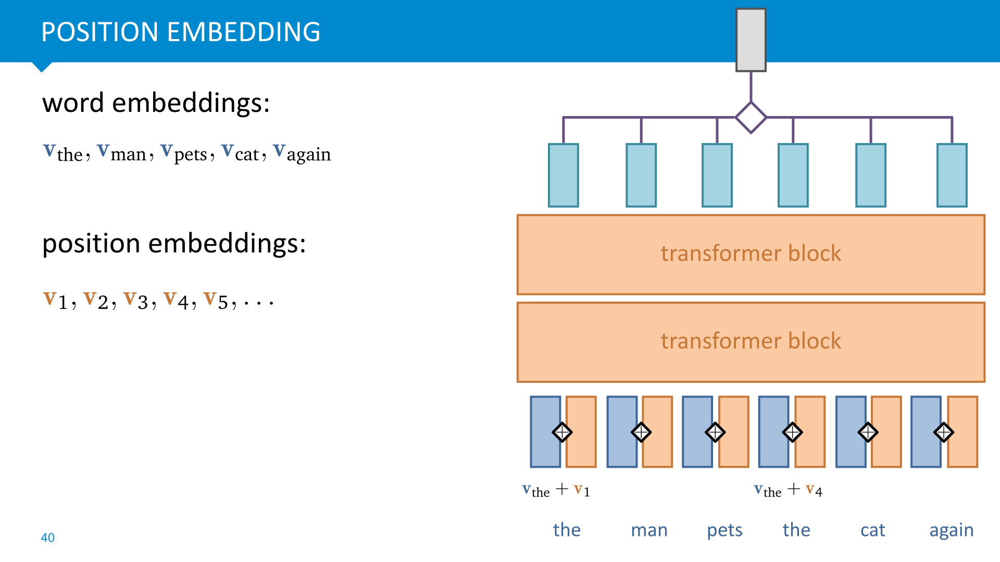
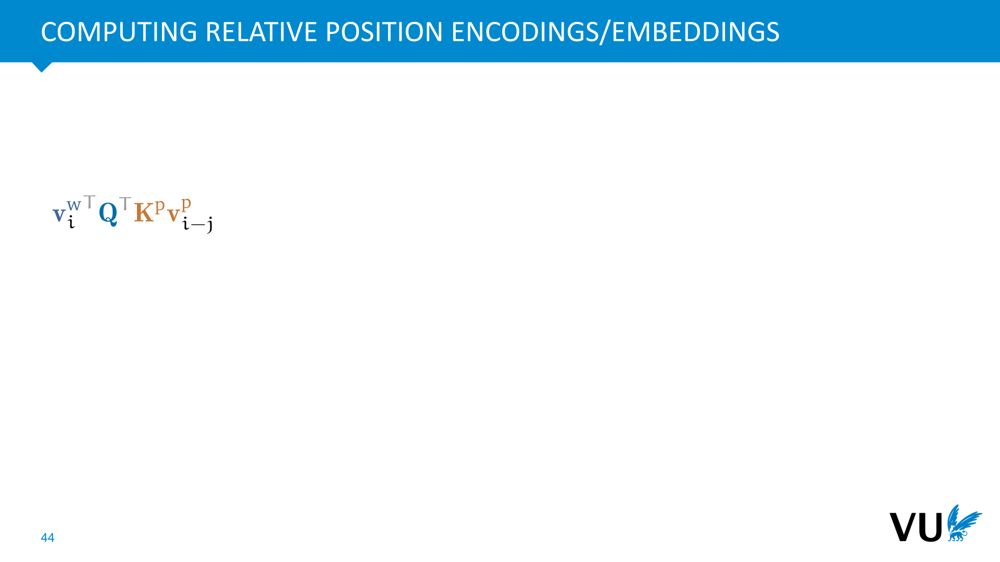
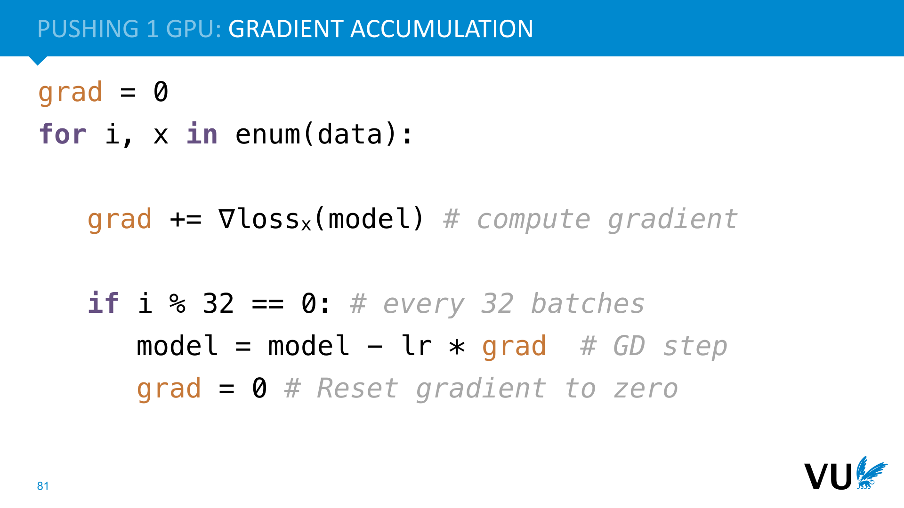
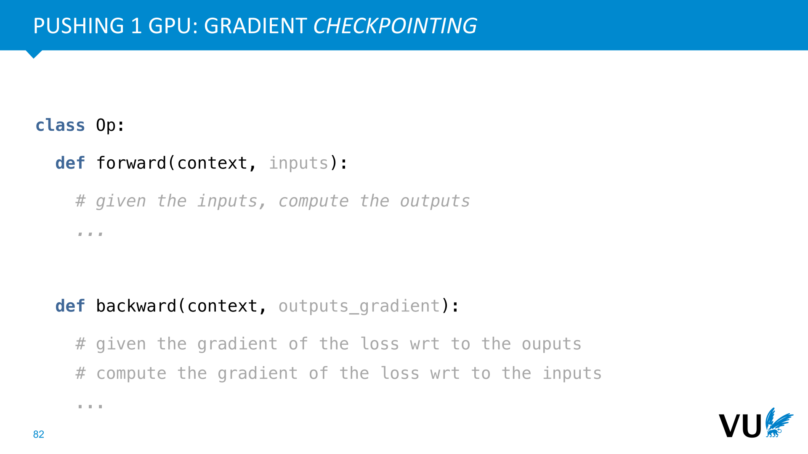
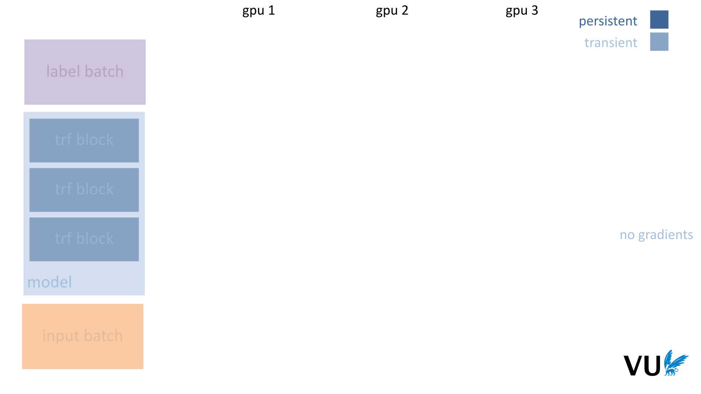

<nav class="menu">
    <ul>
        <li class="home"><a href="/">Home</a></li>
        <li class="name">Self-attention</li>
                <li><a href="#video-072">Scaling up</a></li>
        <li class="pdf"><a href="https://dlvu.github.io/pdfs/lecture09.self-attention.annotated.pdf">PDF</a></li>
    </ul>
</nav>

<article class="slides">

       <section id="slide-001">
            <a class="slide-link" href="https://dlvu.github.io/sa#slide-001" title="Link to this slide.">link here</a>
            

            <figcaption>
            

            </figcaption>
       </section>

       <section id="slide-002">
            <a class="slide-link" href="https://dlvu.github.io/sa#slide-002" title="Link to this slide.">link here</a>
            

            <figcaption>
            

            </figcaption>
       </section>

       <section id="slide-003">
            <a class="slide-link" href="https://dlvu.github.io/sa#slide-003" title="Link to this slide.">link here</a>
            

            <figcaption>
            

            </figcaption>
       </section>

       <section id="slide-004">
            <a class="slide-link" href="https://dlvu.github.io/sa#slide-004" title="Link to this slide.">link here</a>
            

            <figcaption>
            

            </figcaption>
       </section>

       <section id="slide-005">
            <a class="slide-link" href="https://dlvu.github.io/sa#slide-005" title="Link to this slide.">link here</a>
            

            <figcaption>
            

            </figcaption>
       </section>

       <section id="slide-006">
            <a class="slide-link" href="https://dlvu.github.io/sa#slide-006" title="Link to this slide.">link here</a>
            

            <figcaption>
            
We’ve seen two examples of (non-trivial) sequence-to-sequence layers so far: recurrent neural networks, and  convolutions. RNNs have the benefit that they can potentially look infinitely far back into the sequence, but they require fundamentally sequential processing, making them slow. Convolution don’t have this drawback—we can compute each output vector in parallel if we want to—but the downside is that they are limited in how far back they can look into the sequence. 

<strong>Self-attention</strong> is another sequence-to-sequence layer, and one which provides us with the best of both worlds: parallel processing and a potentially infinite memory. 

 

            </figcaption>
       </section>

       <section id="slide-007">
            <a class="slide-link" href="https://dlvu.github.io/sa#slide-007" title="Link to this slide.">link here</a>
            

            <figcaption>
            

            </figcaption>
       </section>

       <section id="slide-008">
            <a class="slide-link" href="https://dlvu.github.io/sa#slide-008" title="Link to this slide.">link here</a>
            

            <figcaption>
            
At heart, the operation of self-attention is very simple. Every output is simply a<em> weighted sum </em>over the inputs. The trick is that the weights in this sum are not parameters. They are <em>derived </em>from the inputs. 

Note that this means that the input and output dimensions of a self-attention layer are always the same. If we want to transform to a different dimension, we’ll need to add a projection layer.

            </figcaption>
       </section>

       <section id="slide-009" class="anim">
            <a class="slide-link" href="https://dlvu.github.io/sa#slide-009" title="Link to this slide.">link here</a>
            

            <figcaption>
            

            </figcaption>
            click image for animation
       </section>

       <section id="slide-010" class="anim">
            <a class="slide-link" href="https://dlvu.github.io/sa#slide-010" title="Link to this slide.">link here</a>
            

            <figcaption>
            

            </figcaption>
            click image for animation
       </section>

       <section id="slide-011" class="anim">
            <a class="slide-link" href="https://dlvu.github.io/sa#slide-011" title="Link to this slide.">link here</a>
            

            <figcaption>
            
To vectorize this operation, we can concatenate the input and output sequences into matrices, and perform the simple self-attention operation in three steps.

            </figcaption>
            click image for animation
       </section>

       <section id="slide-012">
            <a class="slide-link" href="https://dlvu.github.io/sa#slide-012" title="Link to this slide.">link here</a>
            

            <figcaption>
            

            </figcaption>
       </section>

       <section id="slide-013">
            <a class="slide-link" href="https://dlvu.github.io/sa#slide-013" title="Link to this slide.">link here</a>
            

            <figcaption>
            

            </figcaption>
       </section>

       <section id="slide-014">
            <a class="slide-link" href="https://dlvu.github.io/sa#slide-014" title="Link to this slide.">link here</a>
            

            <figcaption>
            
To build some intiuition for why the self attention works, we need to look into how dot products function. To do so, we’ll leave the realm of sequence learning for a while and dip our toes briefly into the pool of<em> recommendation</em>. 

 

Imagine that we have a set of users and a set of movies, with no features about any of them except an incomplete list of which user liked which movie. Our task is to predict which other movies a given user will like.

            </figcaption>
       </section>

       <section id="slide-015" class="anim">
            <a class="slide-link" href="https://dlvu.github.io/sa#slide-015" title="Link to this slide.">link here</a>
            

            <figcaption>
            
If we had features for each movie and user, we could match them up like this. We multiply how much the user likes romance by how much romance there is in the movie. If both are positive of negative, the score is increased. If one is positive and one is negative, the score is decreased. 

Note that we’re not just taking into account the sign of the values, but also the magnitude. If a user’s preference for action is near zero, it doesn’t matter much for the score whether the movie has action.

            </figcaption>
            click image for animation
       </section>

       <section id="slide-016">
            <a class="slide-link" href="https://dlvu.github.io/sa#slide-016" title="Link to this slide.">link here</a>
            

            <figcaption>
            
As a simple example, let’s build a sequence classifier consisting of just one embedding layer followed by a global maxpooling layer. We’ll imagine a sentiment classification task where the aim is to predict whether a restaurant review is positive or negative. 

If we did this without the self-attention layer, we would essentially have a model where each word can only contribute to the output score independently of the other. This is known as a bag of words model. In this case, the word terrible would probably cause us to predict that this is a negative review. In order to see that it might be a positive review, we need to recognize that the meaning of the word terrible is moderated by the word not. This is what the self-attention can do for us.

            </figcaption>
       </section>

       <section id="slide-017">
            <a class="slide-link" href="https://dlvu.github.io/sa#slide-017" title="Link to this slide.">link here</a>
            

            <figcaption>
            
If the embedding vectors of not and terrible have a high dot product together, the weight of the input vector for not becomes high, allowing it to influence the meaning of the word terrible in the output sequence.

            </figcaption>
       </section>

       <section id="slide-018">
            <a class="slide-link" href="https://dlvu.github.io/sa#slide-018" title="Link to this slide.">link here</a>
            

            <figcaption>
            
The standard self attention add some bells and whistles to this basic framework. We’ll discuss the three most important additions. 

            </figcaption>
       </section>

       <section id="slide-019">
            <a class="slide-link" href="https://dlvu.github.io/sa#slide-019" title="Link to this slide.">link here</a>
            

            <figcaption>
            
Scaled self attention is very simple: instead of using the dot product, we use the dot product scaled by the square root of the input dimension. This ensures that the input and output of the self attention operation have similar variance. 

Why √k? Imagine a vector in ℝk with values all c. Its Euclidean length is √kc. Therefore, we are dividing out the amount by which the increase in dimension increases the length of the average vectors. Transformer usually models apply normalization at every layer, so we can usually assume that the input is standard-normally distributed.

            </figcaption>
       </section>

       <section id="slide-020">
            <a class="slide-link" href="https://dlvu.github.io/sa#slide-020" title="Link to this slide.">link here</a>
            

            <figcaption>
            
In each self attention computation, every input vector occurs in three distinct roles: 

<strong>the value</strong>: the vector that is used in the weighted sum that ultimately provides the output 

<strong>the query</strong>: the input vector that corresponds to the current output, matched against every other input vector. 

<strong>the key</strong>: the input vector that the query is matched against to determine the weight.

            </figcaption>
       </section>

       <section id="slide-021" class="anim">
            <a class="slide-link" href="https://dlvu.github.io/sa#slide-021" title="Link to this slide.">link here</a>
            

            <figcaption>
            
In a dictionary, all the operations are discrete: a query only matches a single key, and returns only the value corresponding to that key.

            </figcaption>
            click image for animation
       </section>

       <section id="slide-022">
            <a class="slide-link" href="https://dlvu.github.io/sa#slide-022" title="Link to this slide.">link here</a>
            

            <figcaption>
            
If the dot product of only one query/key pair is non-zero, we recover the operation of a normal dictionary.

            </figcaption>
       </section>

       <section id="slide-023">
            <a class="slide-link" href="https://dlvu.github.io/sa#slide-023" title="Link to this slide.">link here</a>
            

            <figcaption>
            
To give the self attention some more flexibility in determining its behavior, we multiply each input vector by three different k-by-k parameter matrices, which gives us a different vector to act as key query and value. 

Note that this makes the self attention operation a layer with parameters (where before it had none).

            </figcaption>
       </section>

       <section id="slide-024">
            <a class="slide-link" href="https://dlvu.github.io/sa#slide-024" title="Link to this slide.">link here</a>
            

            <figcaption>
            
In many sentences, there are different relations to model. Here, the word meaning of the word “terrible” is inverted by “not” and moderated by “too”. Its relation to the word restaurant is completely different: it describes a property of the restaurant. 

The idea behind multi-head self-attention is that multiple relations are best captured by different self-attention operations.

            </figcaption>
       </section>

       <section id="slide-025">
            <a class="slide-link" href="https://dlvu.github.io/sa#slide-025" title="Link to this slide.">link here</a>
            

            <figcaption>
            
The idea of multi-head attention is that we project the input sequence down to several lower dimensional sequences, to give us a key, query and a value sequence for each self attention and apply a separate low-dimensional self attention to each of these. After this, we concatenate their outputs, and apply another linear  transformation (biases not shown)

            </figcaption>
       </section>

       <section id="slide-026">
            <a class="slide-link" href="https://dlvu.github.io/sa#slide-026" title="Link to this slide.">link here</a>
            

            <figcaption>
            
Here we see that we can implement this multi-head self-attention with three matrix multiplications of k by k matrices (where k is the embedding dimension), just like the original self-attention 
<aside    >NB. the matrix multiplication by Wo after concatenation is an addition. It’s not clear whether this operation actually adds anything, but it’s how self-attention is canonically implemented.</aside><aside    ></aside>
            </figcaption>
       </section>

       <section id="slide-027">
            <a class="slide-link" href="https://dlvu.github.io/sa#slide-027" title="Link to this slide.">link here</a>
            

            <figcaption>
            

            </figcaption>
       </section>

       <section id="slide-028">
            <a class="slide-link" href="https://dlvu.github.io/sa#slide-028" title="Link to this slide.">link here</a>
            

            <figcaption>
            

            </figcaption>
       </section>

       <section id="slide-029">
            <a class="slide-link" href="https://dlvu.github.io/sa#slide-029" title="Link to this slide.">link here</a>
            

            <figcaption>
            
A recurrent neural network is any neural network that has a cycle in it

            </figcaption>
       </section>

       <section id="slide-030">
            <a class="slide-link" href="https://dlvu.github.io/sa#slide-030" title="Link to this slide.">link here</a>
            

            <figcaption>
            

            </figcaption>
       </section>

       <section id="slide-031">
            <a class="slide-link" href="https://dlvu.github.io/sa#slide-031" title="Link to this slide.">link here</a>
            

            <figcaption>
            
The basic building block of transformer models is usually a simple <strong>transformer block</strong>.  

The details differ per transformer, but the basic ingredients are usually: one self-attention, one feed-forward layer applied individually to each token in the sequence and a layer normalization and residual connection for each. 

Note that the self-attention is the only operation in the block that propagates information across the time dimension. The other layers operate only on each token independently. 

            </figcaption>
       </section>

       <section id="slide-032">
            <a class="slide-link" href="https://dlvu.github.io/sa#slide-032" title="Link to this slide.">link here</a>
            

            <figcaption>
            
Layer normalization is like batch normalization, except that it normalizes along a different dimension of the batch tensor. 

Note that this does not propagate information across the time dimension. That is still reserved for the self attention only. 

While layer normalization tends to work a little less well than batch normalization, the great benefit here is that its behavior doesn’t depend on the batch size. This is important, because transformer models are often so big that we can only train on single-instance batches. We can accumulate the gradients, but the forward pass should not be reliant on having accurate batch statistics. 

            </figcaption>
       </section>

       <section id="slide-033">
            <a class="slide-link" href="https://dlvu.github.io/sa#slide-033" title="Link to this slide.">link here</a>
            

            <figcaption>
            
Once we’ve defined a transformer block, all we need to do is stack a bunch of them together. Then, if we have a sequence-to-label task, we just need one global pooling operation and we have a sequence-to-label model.

            </figcaption>
       </section>

       <section id="slide-034" class="anim">
            <a class="slide-link" href="https://dlvu.github.io/sa#slide-034" title="Link to this slide.">link here</a>
            

            <figcaption>
            
What about autoregressive modeling? 

If we do this naively, we have a problem: the self-attention operation can just look ahead in the sequence to predict what the next model will be. We will never learn to predict the future from the past. In short the transformer block is not a <em>causal </em>sequence-to-sequence operation. 

            </figcaption>
            click image for animation
       </section>

       <section id="slide-035" class="anim">
            <a class="slide-link" href="https://dlvu.github.io/sa#slide-035" title="Link to this slide.">link here</a>
            

            <figcaption>
            
The solution is simple: when we compute the attention weights, we mask out any attention from the current token to future tokens in the sequence. 

 

Note that to do this, we need to set the raw attention weights to negative infinity, so that after the softmax operation, they become 0.

            </figcaption>
            click image for animation
       </section>

       <section id="slide-036">
            <a class="slide-link" href="https://dlvu.github.io/sa#slide-036" title="Link to this slide.">link here</a>
            

            <figcaption>
            
Since the self attention is the only part of the transformer block that propagates information across the time dimension, making that part causal, makes the whole block causal. 

With a stack of causal transformer blocks, we can easily build an autoregressive model.

            </figcaption>
       </section>

       <section id="slide-037">
            <a class="slide-link" href="https://dlvu.github.io/sa#slide-037" title="Link to this slide.">link here</a>
            

            <figcaption>
            
To really interpret the meaning of the sentence, we need to be able to access the position of the words. Two sentences with their words shuffled can mean the exact opposite thing. 

If we feed these sentences, tokenized by word, to the architecture on the right, their output label will necessarily be the same. The self-attention produces the same output vectors, with just the order differing in the same way they do for the two inputs, and the global pooling just sums all the vectors irrespective of position.

            </figcaption>
       </section>

       <section id="slide-038">
            <a class="slide-link" href="https://dlvu.github.io/sa#slide-038" title="Link to this slide.">link here</a>
            

            <figcaption>
            
This is a property known as <strong>equivariance</strong>. Self-attention is<em> permutation</em> equivariant. Whether we permute the tokens in the sequence first and then apply self-attention, or apply self attention and then permute, we get the same result. We’ve seen this property already in convolutions, which are<em> translation</em> equivariant. This tells us that equivariance is not a bad thing; it’s a property that allows us to control what structural properties the model assumes about the data. 

Permutation equivariance is particularly nice, because in some sense it corresponds to a minimal structural assumption about the units in our instance (namely that they form a <em>set</em>). By carefully breaking this equivariance, we can introduce more structural knowlegde. 

            </figcaption>
       </section>

       <section id="slide-039">
            <a class="slide-link" href="https://dlvu.github.io/sa#slide-039" title="Link to this slide.">link here</a>
            

            <figcaption>
            
These are the three most common ways to break the permutation equivariance, and to tell the model that the data is laid out as a sequence.

            </figcaption>
       </section>

       <section id="slide-040" class="anim">
            <a class="slide-link" href="https://dlvu.github.io/sa#slide-040" title="Link to this slide.">link here</a>
            

            <figcaption>
            
The idea behind position embeddings is simple. Just like we assign each word in our vocabulary an embedding vector, we also assign each<em> position </em>in our vocabulary an embedding vector. This way, the input vectors for the first “the” in the input sequence and the second “the” are different, because the first is added to the position embedding <strong>v</strong>1 and the second is added to the input embedding <strong>v</strong>2. 

This break our equivariance: the position information becomes <em>part</em> of our embedding vectors, and is fed into the self attention. This is very effective, and very easy to implement. The only drawback is that we can’t run the model very well on sequences that are longer than the largest position embedding observed during training.

            </figcaption>
            click image for animation
       </section>

       <section id="slide-041">
            <a class="slide-link" href="https://dlvu.github.io/sa#slide-041" title="Link to this slide.">link here</a>
            

            <figcaption>
            
Position encodings are very similar. Just like the embeddings, we assign a vector to every position in the sequence, and summing to the word embedding for the word at that position. 

The difference is that the position encodings are <em>not learned</em>. They are fixed to some function that we expect the downstream self-attentions can easy latch on to to tell the different positions apart. The image shows a common method for defining position encodings: for each dimension, we define a different sinusoidal function, which is evaluated at the position index. 

The main benefit is that this pattern is predictable, so the transformer can theoretically model it. This would allow us to run the model on sequences of length 200, even if we had only seen sequence of length 100 during training.

            </figcaption>
       </section>

       <section id="slide-042">
            <a class="slide-link" href="https://dlvu.github.io/sa#slide-042" title="Link to this slide.">link here</a>
            

            <figcaption>
            
The idea behind relative position encodings is that it doesn’t really matter so much where the word is in the sequence absolutely, it’s much more important how close it is to the current word we’re computing the output for.  

Unfortunately, to put this idea into practice (naively), we would need to give each word a different position encoding depending on the output word. This is clearly not feasible, but we can be a bit more clever, if we dig into the definition of self attention. 

            </figcaption>
       </section>

       <section id="slide-043" class="anim">
            <a class="slide-link" href="https://dlvu.github.io/sa#slide-043" title="Link to this slide.">link here</a>
            

            <figcaption>
            

            </figcaption>
            click image for animation
       </section>

       <section id="slide-044" class="anim">
            <a class="slide-link" href="https://dlvu.github.io/sa#slide-044" title="Link to this slide.">link here</a>
            

            <figcaption>
            

            </figcaption>
            click image for animation
       </section>

       <section id="slide-045" class="anim">
            <a class="slide-link" href="https://dlvu.github.io/sa#slide-045" title="Link to this slide.">link here</a>
            

            <figcaption>
            

            </figcaption>
            click image for animation
       </section>

       <section id="slide-046">
            <a class="slide-link" href="https://dlvu.github.io/sa#slide-046" title="Link to this slide.">link here</a>
            

            <figcaption>
            
These are the three most common ways to break the permutation equivariance, and to tell the model that the data is laid out as a sequence.

            </figcaption>
       </section>

       <section id="slide-047">
            <a class="slide-link" href="https://dlvu.github.io/sa#slide-047" title="Link to this slide.">link here</a>
            

            <figcaption>
            

            </figcaption>
       </section>

       <section id="slide-048">
            <a class="slide-link" href="https://dlvu.github.io/sa#slide-048" title="Link to this slide.">link here</a>
            

            <figcaption>
            

            </figcaption>
       </section>

       <section id="slide-049">
            <a class="slide-link" href="https://dlvu.github.io/sa#slide-049" title="Link to this slide.">link here</a>
            

            <figcaption>
            
A recurrent neural network is any neural network that has a cycle in it

            </figcaption>
       </section>

       <section id="slide-050">
            <a class="slide-link" href="https://dlvu.github.io/sa#slide-050" title="Link to this slide.">link here</a>
            

            <figcaption>
            

            </figcaption>
       </section>

       <section id="slide-051">
            <a class="slide-link" href="https://dlvu.github.io/sa#slide-051" title="Link to this slide.">link here</a>
            

            <figcaption>
            

            </figcaption>
       </section>

       <section id="slide-052">
            <a class="slide-link" href="https://dlvu.github.io/sa#slide-052" title="Link to this slide.">link here</a>
            

            <figcaption>
            

            </figcaption>
       </section>

       <section id="slide-053">
            <a class="slide-link" href="https://dlvu.github.io/sa#slide-053" title="Link to this slide.">link here</a>
            

            <figcaption>
            

            </figcaption>
       </section>

       <section id="slide-054">
            <a class="slide-link" href="https://dlvu.github.io/sa#slide-054" title="Link to this slide.">link here</a>
            

            <figcaption>
            

            </figcaption>
       </section>

       <section id="slide-055">
            <a class="slide-link" href="https://dlvu.github.io/sa#slide-055" title="Link to this slide.">link here</a>
            

            <figcaption>
            

            </figcaption>
       </section>

       <section id="slide-056">
            <a class="slide-link" href="https://dlvu.github.io/sa#slide-056" title="Link to this slide.">link here</a>
            

            <figcaption>
            

            </figcaption>
       </section>

       <section id="slide-057">
            <a class="slide-link" href="https://dlvu.github.io/sa#slide-057" title="Link to this slide.">link here</a>
            

            <figcaption>
            
By using only the output vector of the CLS token to classify the sentence, we force the model to accumulate global information into this token. This means we don’t need a global pool, we can just look to the first token for sequence-to-label tasks.

            </figcaption>
       </section>

       <section id="slide-058">
            <a class="slide-link" href="https://dlvu.github.io/sa#slide-058" title="Link to this slide.">link here</a>
            

            <figcaption>
            
Like ELMo, BERT considerably advanced the state of the art on many tasks. Its finetuning procedures were much simpler than those of ELMo, 

            </figcaption>
       </section>

       <section id="slide-059">
            <a class="slide-link" href="https://dlvu.github.io/sa#slide-059" title="Link to this slide.">link here</a>
            

            <figcaption>
            

            </figcaption>
       </section>

       <section id="slide-060">
            <a class="slide-link" href="https://dlvu.github.io/sa#slide-060" title="Link to this slide.">link here</a>
            

            <figcaption>
            

            </figcaption>
       </section>

       <section id="slide-061" class="anim">
            <a class="slide-link" href="https://dlvu.github.io/sa#slide-061" title="Link to this slide.">link here</a>
            

            <figcaption>
            

            </figcaption>
            click image for animation
       </section>

       <section id="slide-062">
            <a class="slide-link" href="https://dlvu.github.io/sa#slide-062" title="Link to this slide.">link here</a>
            

            <figcaption>
            

            </figcaption>
       </section>

       <section id="slide-063">
            <a class="slide-link" href="https://dlvu.github.io/sa#slide-063" title="Link to this slide.">link here</a>
            

            <figcaption>
            

            </figcaption>
       </section>

       <section id="slide-064">
            <a class="slide-link" href="https://dlvu.github.io/sa#slide-064" title="Link to this slide.">link here</a>
            

            <figcaption>
            

            </figcaption>
       </section>

       <section id="slide-065">
            <a class="slide-link" href="https://dlvu.github.io/sa#slide-065" title="Link to this slide.">link here</a>
            

            <figcaption>
            
Note the logarithmic scale.

            </figcaption>
       </section>

       <section id="slide-066">
            <a class="slide-link" href="https://dlvu.github.io/sa#slide-066" title="Link to this slide.">link here</a>
            

            <figcaption>
            

            </figcaption>
       </section>

       <section id="slide-067">
            <a class="slide-link" href="https://dlvu.github.io/sa#slide-067" title="Link to this slide.">link here</a>
            

            <figcaption>
            

            </figcaption>
       </section>

       <section id="slide-068">
            <a class="slide-link" href="https://dlvu.github.io/sa#slide-068" title="Link to this slide.">link here</a>
            

            <figcaption>
            

            </figcaption>
       </section>

       <section id="slide-069">
            <a class="slide-link" href="https://dlvu.github.io/sa#slide-069" title="Link to this slide.">link here</a>
            

            <figcaption>
            
It is not yet clear whether models like this just reflect the data bias or amplify it too. Nevertheless, as we said before (in lecture 5) even is these biases are accurate as predictions given the data, that does not mean that they are safe to use to produce <em>actions</em>. Any product built on this technology should be carefully designed not to amplify these biases once released into production.

            </figcaption>
       </section>

       <section id="slide-070">
            <a class="slide-link" href="https://dlvu.github.io/sa#slide-070" title="Link to this slide.">link here</a>
            

            <figcaption>
            

            </figcaption>
       </section>

       <section id="slide-071">
            <a class="slide-link" href="https://dlvu.github.io/sa#slide-071" title="Link to this slide.">link here</a>
            

            <figcaption>
            
Since GPT-3, the story has moved out of the sphere of research and into the mainstream with the release of ChatGPT. 

OpenAI is tight-lipped about GPT-4, which is the most powerful backend to ChatGPT and probably the most capable language model available today. From leaks here and there we can glean that GPT-4 is probably an ensemble model, consisting of 8 separate 200B parameter models trained in the style of GPT-3. Reportedly, for each token it generates, two members of the ensemble share responsibility. It’s likely that the choice of these two changes for every token. 

On top of that we have ChatGPT. This was built by creating a simple chatbot wrapper around GPT. The idea is that the use input, with a little annotation functions as the prompt, after which the model generates the response of “ChatGPT”. One way of thinking about it, is that the model is predicting what an AI chatbot <em>would say</em> to the given user query. After it has finished (likely signalled by some stop token), the user is asked for more input and then we sample another reply and so on. 

From a raw LLM, you can get this kind of behavior, but it would be a bit ropy and unpredictable. To make the system more predictable and better behaved, OpenAI uses several techniques. The first is instruction tuning: a simple approach, where the model is finetuned to follow instructions in natural language. On top of that, there is RLHF, a more complicated set up, where the model learns explicitly from human feedback. This is used by a small army of annotators to help control the system, and make it behave (mostly) responsibly, and in the way that OpenAI wants.

            </figcaption>
       </section>

       <section id="slide-072">
            <a class="slide-link" href="https://dlvu.github.io/sa#slide-072" title="Link to this slide.">link here</a>
            

            <figcaption>
            

            </figcaption>
       </section>

       <section class="video" id="video-072">
           <a class="slide-link" href="https://dlvu.github.io/sa#video-72">link here</a>
           <iframe
                src="https://www.youtube.com/embed/0qoUqE695X0?si=bihBSsZRuIN9Ly3o"
                title="YouTube video player"
                frameborder="0" allow="accelerometer; autoplay; clipboard-write; encrypted-media; gyroscope; picture-in-picture"
                allowfullscreen>
           </iframe>

       </section>

       <section id="slide-073">
            <a class="slide-link" href="https://dlvu.github.io/sa#slide-073" title="Link to this slide.">link here</a>
            

            <figcaption>
            
 

 

Transformers, more than any other type of model are famous for being <strong>big</strong>. For some reason, this type of model, trained on natural language, really performs well in the regime of large data and big models. This is true to some extent for other domains and model architectures, but never quite as much as for transformers on natural language. 

            </figcaption>
       </section>

       <section id="slide-074">
            <a class="slide-link" href="https://dlvu.github.io/sa#slide-074" title="Link to this slide.">link here</a>
            

            <figcaption>
            
We’ll try to look at where this behaviour comes from (to the extent that we know) and perhaps more importantly, how these big models are actually trained.

            </figcaption>
       </section>

       <section id="slide-075">
            <a class="slide-link" href="https://dlvu.github.io/sa#slide-075" title="Link to this slide.">link here</a>
            

            <figcaption>
            
These plots are from a paper produced by OpenAI (sometime between GPT2 and GPT3). It shows that when we train an autoregressive transformer on natural language data, and we increase the model size, data size, and available compute in the right proportions, then performance increases in a very predictable way.  

The takeaway for a lot of people, at least in this domain, was that so long as this pattern holds, there is not much value in investing in clever models. A larger transformer trained on more data will always catch up with any clever tricks we come up with.  

We don’t know much about why language transformers specifically seem to scale so well with data. In part it’s just that language data is so readily available. Another aspect seems to be the structure of the data, since, for instance, visual transformers don’t show quite the same effortless scaling behavior. 
<aside    >That doesn’t mean we can’t train large visual transformers to give us benefits in performance, but it isn’t as easy as it is with natural language models, where it mostly seems to boil down to training the same model, scaled up in the right proportions. In other domains, it usually takes a lot more architectural innovation to get to the next order of magnitude. <a href="https://arxiv.org/abs/2302.05442"><strong>Here’s an example</strong></a> of such a jump. </aside>
Whatever the reasons, these discoveries led to a race over the past few years to train ever bigger models. Ending up, at the time of writing, with GPT4, which consists (to the best of our knowledge) of 8 parallel GPT models of 200B parameters each.

            </figcaption>
       </section>

       <section id="slide-076">
            <a class="slide-link" href="https://dlvu.github.io/sa#slide-076" title="Link to this slide.">link here</a>
            

            <figcaption>
            
Here are some more subtle points from the scaling laws paper.  

The left plot shows that for the same amount of training tokens seen, a larger model gets more performance out of the data than a smaller model (at the cost of more compute per token, of course). 

The right plot  shows that if we increase the amount of compute (measured in petaflops-days), the optimal size of model increases in a predictable way. Moreover, it’s usually better to train a big model to far short of convergence, than it is to let a smaller model converge.

            </figcaption>
       </section>

       <section id="slide-077">
            <a class="slide-link" href="https://dlvu.github.io/sa#slide-077" title="Link to this slide.">link here</a>
            

            <figcaption>
            
So, we don’t fully understand <em>why</em> large language models scale so well, but it seems clear that they do. For a large part of our community, this was reason enough to start training some <strong>very</strong> big models.  

How is this done? The models we have been talking about take hundreds of gigabytes to store. So far we have always assumed that everything about our model fits into memory: the parameters, the optimizer state, and the full computation graph. With these kind of models, that will no longer be possible. 

            </figcaption>
       </section>

       <section id="slide-078">
            <a class="slide-link" href="https://dlvu.github.io/sa#slide-078" title="Link to this slide.">link here</a>
            

            <figcaption>
            
To start with, let’s see how far we can get with one modern GPU. The largest GPU that you might commonly enounter (at the time of writing) is the A100, which has 40Gb of GPU memory. How big a model can we fit into GPU memory? We’ll take GPT-2 as a point of reference. It has 1.5B parameters, so it should take about 6 Gb to store (assuming 32 bits per parameter). 

That suggests we could comfortably store it in memory. However, we also need to store the gradients. This is another 6 Gb (it’s the same amount of numbers). Next, we need to store the optimizer state, which, for Adam, requires a momentum term and a second-moment term for each parameter. That means, that even if we forget about all the intermediate values, and the computation graph, we require 24 Gb for a single parameter update.

            </figcaption>
       </section>

       <section id="slide-079">
            <a class="slide-link" href="https://dlvu.github.io/sa#slide-079" title="Link to this slide.">link here</a>
            

            <figcaption>
            
Here are some back of the envelope calculations for how much it takes to store various parts of the model and intermediate values during the forward pass. All this adds about 6 Gb. for most of these, we also need to store gradients (although pytorch may be able to delete some of those when all upstream gradients have been computed) 

In short, we’ll be lucky if we can run the model for a batch size of 1. Note also that this is a <em>big</em> GPU. In the days of GPT-2, memory  sizes of 12 Gb were much more conventional, so training on a single GPU wouldn’t have been feasible in this way. 
<aside    >Note that this is only a problem during training. During inference we can do our forward pass, and at each block forget whatever we did in the block before. Even the computation of the attention weights can be broken into chunks, so we can pretty much make the memory cost as small as we like. </aside><aside    ></aside>
            </figcaption>
       </section>

       <section id="slide-080">
            <a class="slide-link" href="https://dlvu.github.io/sa#slide-080" title="Link to this slide.">link here</a>
            

            <figcaption>
            
Before we start bringing in more GPUs, let’s see how we can get more mileage out of a single one. 

One way we can fit more model onto one GPU is to represent each number (parameters and intermediate values) in <strong>16 bits</strong> rather than <strong>32 bits</strong>. For most parts of the network it isn’t really important to be extremely precise. A value of 0.1 may have broadly the same effect as a value of 0.125, but due to the way decimal numbers are represented the second can be represented in a much smaller amount of of bits. By using the second number instead of the first, we save memory. 
<aside    >The fact that some numbers can be represented in fewer bits than is down to the way floating point representation work. For instance, the number 0.1 can actually never be represented exactly. The closest we can get with a standard floating point representation is 0.100000001490116119384765625. However, a number like 0.125, because it’s equal to 2^-3, can be represented exactly, even in very 16 bit versions of the floating point representation. <a href="https://www.h-schmidt.net/FloatConverter/IEEE754.html"><strong>Here is a good tool</strong></a> to help you understand how this works. </aside>
You can play around a bit with how many bits you use on the exponent and how many on the fraction, leading to slightly different formats like float16 and bfloat16. For smaller models, the choice  won’t matter too much, but for large models, <a href="https://github.com/stas00/ml-engineering/blob/master/instabilities/training-loss-patterns.md"><strong>they can be crucial</strong></a>. 

When using 16 bits floating point numbers, there are some important points to pay attention to. First of all, some parts of the network, like the computation of the loss, suffer badly when they are done in 16 bits. This is why we train in <strong>mixed precision</strong>. Usually, we do linear operations in 16 bits, and nonlinear operation in 32 bits (in some frameworks, you can do a little bit more of the computation in low-precision mode, but this is a good rule of thumb). That means that all the weights and intermediate values are in 16 bits, but for certain operations they are cast up to 32 bit precision before the operation, and back down to 16 again after. Since matrix multiplications are almost always the bottleneck in any neural net, we still save a lot of time and memory by performing these in low precision. 

There are some other things to take care of. NaNs—some part of the computation resulting in <em>not-a-number</em>—are a little more likely in mixed precision. So, instead of stopping your training on a NaN loss, and lowering the learning rate, we just <em>ignore</em> the NaN losses. If we see a NaN, we ignore the forward, and move on to the next batch.  

Finally, the reduced precision may cause some gradients to underflow to zero as they’re backpropagating, causing all upstream gradients to become zero as well. The solution is to scale up the loss before starting the backpropagation, and then to scale the gradients back down again by the same factor when they have been computed. 

In pytorch, <a href="https://pytorch.org/blog/what-every-user-should-know-about-mixed-precision-training-in-pytorch/"><strong>all the necessary adjustments</strong></a> can be made with a few wrappers around the optimizer and the model and loss computation. 

The result is that we use roughly half the memory. Moreover, computations in low precision are also a lot faster<em> </em>(on GPUs that support it).  
<aside    >The TitanX GPUs you have acces to on DAS-5 don’t support accelerated mixed precision, but the RT2080’s in the proq do. </aside><aside    ></aside>
            </figcaption>
       </section>

       <section id="slide-081">
            <a class="slide-link" href="https://dlvu.github.io/sa#slide-081" title="Link to this slide.">link here</a>
            

            <figcaption>
            
After we switch to mixed precision, we may still be left with the situation that we can only train with very small batches, perhaps of only one or two instances. The problem is that this may lead to very unstable training, unless we set a very low learning rate. 

The solution is simple. For a concrete example, imagine that we can only train on a single instance at a time, in the memory we have, but we would <em>like</em> to use a batch size of 32. The gradient over of the batch of 32 is just the gradients of 32 single-instance batches summed or averaged together. This means we can just <em>collect</em> the gradients over 32 batches in 32 separate forward and backward passes, and sum them as we go. The pseudocode on the slide shows how you might implement this from scratch. 

Once we’ve processed the 32nd single-instance batch, we do a single gradient descent step with the collected gradient. Then, we reset the gradients to zero and keep going.  
<aside    >Of course, this is much slower than training a smaller model with a single gradient update step for every forward/backward. But that is the way we train big models: we trade off compute for memory. </aside>
In principle, this works very well in pytorch. All you need to do is move the lines opt.step() and opt.zero_grad() inside an if statement as shown in the slide. 

Note however, that some operations make assumptions that are broken by this approach. For example, batch normalization won’t work if you have a single instance, and it will work poorly if you have a only a handful of instances. For this reason, large models tend to use layer normalization instead.

            </figcaption>
       </section>

       <section id="slide-082" class="anim">
            <a class="slide-link" href="https://dlvu.github.io/sa#slide-082" title="Link to this slide.">link here</a>
            

            <figcaption>
            
We can see another way to trade off memory for compute, if we look at the way we define the operation nodes in our computation graph.  

The key thing to remember is that we often record intermediate values that we computed in the forward pass, because we need them in the backward pass. In our model of backpropagation, we used the <em>context object </em>to store the parts of the forward computation that we needed to re-use during the backward.  

Instead of storing it these parts, we can also <em>recompute</em> them. We leave the context object empty and when we reach the backward for this node, we just rerun the forward up to this node to get the required intermediate values. This is expensive—we could double our forward computations for just a single checkpoint—but it can also save a lot of memory. 
<aside    >Note that in deep learning, a saved model is also called a checkpoint. These two things have nothing to do with each other. </aside>
Here again, we need to be careful with certain modules. In particular ones that use randomness, like dropout. It’s important that they behave exactly the same way when the checkpoint is recomputed, as they did in the first place. For this reason pytorch has a mechanism for running models using the same random seed, that you can use if you want to use gradient checkpointing. 

That way, the random number generator will produce the same randomness in both the initial run and the checkpointed run. 

            </figcaption>
            click image for animation
       </section>

       <section id="slide-083" class="anim">
            <a class="slide-link" href="https://dlvu.github.io/sa#slide-083" title="Link to this slide.">link here</a>
            

            <figcaption>
            
Once we’ve exhausted how much model we can cram onto a single GPU, it’s time to start looking into training with <em>multiple</em> GPUs. There are several possible configurations for this. We could use a single computer, called a <em>node</em>, with several GPUs. In this case, we need to communicate internally between the GPUs to coordinate what they’re doing over the internal buses of the computer (over the PCIe bus, or a GPU interconnect). This allows for relatively quick communication, but we’re usually limited to about 4 to 8 GPUs.  
<aside    >Maybe a little more on expensive hardware, but we can’t cram unlimited GPUs into a machine. Note that we usually have one device in charge of synchronization, so we don’t need communication between each pair of GPUs </aside>
If we want as many GPUs as money can buy, we’ll need to distribute them over different machines. The simplest option is one GPU per machine. In this case, the communication between different training processes goes over the network which is much slower. 

A final option is to have a network of nodes with multiple GPUs each. This gives us the best of both worlds, but it complicates the question of synchronisation. If we want to make good use of the high communication speeds between GPUs on the same nodes, we should let them communicate more often than we communicate over the network.  

We will leave that question to the implementers of distributed training libraries. We will only assume that we have multiple acceleration devices (usually GPUs), each with their own limited memory and some sort of communication between them. The main question is what data and model code should we give to each device, and how should we communicate between them to end up with <em>one</em> trained model?

            </figcaption>
            click image for animation
       </section>

       <section id="slide-084">
            <a class="slide-link" href="https://dlvu.github.io/sa#slide-084" title="Link to this slide.">link here</a>
            

            <figcaption>
            
Communicating between nodes or between GPUs is a complicated, technical business. We’d like to abstract all of that away as much as possible.  

Luckily, there are a few primitive operations that we can build everything on top of. The first is called AllReduce. It works as follows, we have a bunch of processes working in parallel. At some point, the AllReduce stops all processes, retrieves a values from all of them (in our case a tensor) and applies a <em>reduction</em> to the set of values. This is simply an operation that takes the set of values as input, and returns a single value computed from them. The reduction is usually a simple operation like taking the sum or the mean. 

After the reduced value is computed, the same value is given to each of the processes.  

With this definition in place, the people who understand GPUs and networking can get to work implementing it efficiently. A naive way do implement it would be to collect all values in a central process, compute the reduction and distribute it back, but there are many clever ways of making it more efficient for certain situations.  
<aside    >You could for instance, arrange the processes in a ring, and have each process add its value to a running total (if you’re computing the sum). </aside>
AllReduce is implemented in many libraries for parallel computation, like MPI, NCCL and Gloo. This means that so long as we can frame our method in terms of local computations, combined with an occasional AllReduce, we can call one of these libraries to deal with the details. 
<aside    >The name reduce comes from parallel programming. In parallel programming, it can be very useful if you can frame an algorithm in terms of <strong>map</strong> operations, which apply an operation in parallel to all elements of a set, and <strong>reduce</strong> operations, which turn a set of values into a single value. If your algorithm is a sequence of maps and reduces, you can likely very easily scale it up to datasets of terabytes (assuming you have the required hardware).</aside><aside    ></aside>
            </figcaption>
       </section>

       <section id="slide-085">
            <a class="slide-link" href="https://dlvu.github.io/sa#slide-085" title="Link to this slide.">link here</a>
            

            <figcaption>
            
For example, here is what an allreduce looks like with “taking the mean” as the reduction operation. We take the mean over the three outputs, and send that single mean back to all three processes. 
<aside    >Note that in practice, the values are often (large) tensors, rather than scalars, but so long as they all have the same size, we can still take the mean of a collection of tensors.</aside><aside    ></aside>
            </figcaption>
       </section>

       <section id="slide-086">
            <a class="slide-link" href="https://dlvu.github.io/sa#slide-086" title="Link to this slide.">link here</a>
            

            <figcaption>
            
Another primitive, we will need is AllGather. This is essentially an AllReduce, where the reduction operation just takes the different values and <em>collects</em> them in a list. This list is then sent to all processes. 
<aside    >Note that unlike the sum or mean AllReduce, this operation substantially increases the memory required by each process, even if they replace the result of the operation by the value they provided at the start. That is, in a sum AllReduce, each process can replace the value provided by the sum of the the value over all process, and keep its memory consumption stable. For the AllGather, doing this always replaces one value by N values. This can be important in the values are large tensors. </aside><aside    ></aside>
            </figcaption>
       </section>

       <section id="slide-087" class="anim">
            <a class="slide-link" href="https://dlvu.github.io/sa#slide-087" title="Link to this slide.">link here</a>
            

            <figcaption>
            
Finally, there is ReduceScatter. This is a kind of reverse of AllGather, in that it starts with a list per process, and ends with a single value per process. 
<aside    >If these are tensors, you can say that it starts with large tensors, and ends up with tensors that are one-third the size. </aside>
The idea is that we reduce over the lists, resulting in a single list. In this example, we use the sum operator to reduce, but any reduction works.  

We break up the list in equal chunks, one for each process. In this example, each chunk consists of one number.  

We then apply the reduction to each chunk over all the processes: for example, we sum the numbers in all of the first chunks over all three processes. The result is then returned to the corresponding process. That is, process 1 gets the sum of the first chunks. Process 2 gets the sum of the second chunks and so on. 
<aside    >There are <a href="https://en.wikipedia.org/wiki/Collective_operation"><strong>more of these primitives</strong></a> used in parallel programming, but these are the only three we will need. </aside><aside    ></aside>
            </figcaption>
            click image for animation
       </section>

       <section id="slide-088">
            <a class="slide-link" href="https://dlvu.github.io/sa#slide-088" title="Link to this slide.">link here</a>
            

            <figcaption>
            
We’ll look at a few popular approaches for parallelising neural network training over different nodes or different GPUs.

            </figcaption>
       </section>

       <section id="slide-089" class="anim">
            <a class="slide-link" href="https://dlvu.github.io/sa#slide-089" title="Link to this slide.">link here</a>
            

            <figcaption>
            
If the model fits entirely onto a single GPU (possibly for just a single instance), the simplest approach is <strong>data-parallel training</strong>. We simply make N copies of the model, one for each GPU, and we split the data along the batch dimension. That is, if a given batch has 18 instances, we feed the first 6 to the model on the first GPU, we feed instances 7 to 12 to the model on the second GPU and we feed instances 13 to 18 to the model on the third GPU. 
<aside    >To simplify things, we’ve assumed that we have a model containing three transformer blocks.  None of these algorithms are specific to the transformer, and they translate trivially to other architectures, but we’ll stick with the transformer to keep things concrete.  </aside>
We then perform a forward and backward pass on each GPU <em>in parallel</em>. This is a purely local operation. Each GPU can do it’s own job without worrying what’s happening on the other GPUs. After the backward, we have a set of gradients for the whole model on each GPU. Each GPU has seen different inputs and labels, so these gradients are all different.  

We then apply the AllReduce to the gradients, taking their average over all three copies, and distributing this average back to each GPU. This average is the gradient over the whole batch (of 18 instances). With the gradients synchronized, the GPUs can each apply an optimizer step in to the weights of their model. Because the weights are synchronized, we know they will apply the same step (even if they use momentum or Adam). 
<aside    >In fact, data-parallel training, when you do it like this is provably equivalent to what you would get with a single GPU that was big enough to fit the whole batch.</aside><aside    ></aside>
            </figcaption>
            click image for animation
       </section>

       <section id="slide-090">
            <a class="slide-link" href="https://dlvu.github.io/sa#slide-090" title="Link to this slide.">link here</a>
            

            <figcaption>
            
To achieve data parallel training very simply in pytorch, you can use the DataParallel wrapper. You simply create a model as normal, and feed it to the DataParallel class which act as a model, wrapped around your model. This does several things behind the scenes. 

It creates copies of your model on all available devices. 

When forward is called, it splits the batch and passes a piece of the batch to each copy of the model, so that each copy runs a forward in parallel on a different slice of the data. 

It then concatenates the results of these different forwards, and returns that as the result of the wrapped model. This is a tensor (called output here) on device 0. 

The rest of the computation of the loss happens on device 0 over the whole output batch. 

The computation graph is constructed over all devices, so it automatically computes gradients for all copies in parallel 

After the backward, a special hook (registered by the DataParallel wrapper) runs the AllReduce over the different gradients of the different copies, ensuring that all copies now have the same gradient.  

All parameters of all copies were registered with the optimizer, so it automatically updates all models. 

This extreme simplicity in the implementation comes at a cost. To start with, it would be more efficient to have each copy compute its <em>own</em> loss on a slice of the target batch (as drawn in the previous slide), rather than doing it for all copies on device 0. Moreover, this approach requires multi<em>threading</em>, rather than multi<em>processing</em>, which is a little broken in python. Finally, this approach only works with devices on a single machine.  

A more versatile and robust approach is the <a href="https://pytorch.org/tutorials/intermediate/ddp_tutorial.html"><strong>DistributedDataParallel</strong></a> module, which also works for multi-node training. However, this also requires more extensive changes to your code. We won’t detail that here.

            </figcaption>
       </section>

       <section id="slide-091">
            <a class="slide-link" href="https://dlvu.github.io/sa#slide-091" title="Link to this slide.">link here</a>
            

            <figcaption>
            
This is data-parallel training. For a model that fits on the GPU, this is likely all you need. It’s simple to understand, and it’s quite efficient. There are two main downsides. 

One is that it required us to keep a copy of the <strong>optimizer state</strong> on each GPU. If we’re using momentum SGD this is a vector that is as big as the model itself, and if we’re using Adam, it’s <em>two vectors </em>the size of the model. These are guaranteed to be exactly the same on each GPU, which means we’re storing a lot of redundant information. 

The other issue is that the model may <em>not </em>fit on the GPU in its entirety. In that case we’ll need to use tricks like checkpointing, which is going to add a lot to the time required for the forward and backward pass. 

 

            </figcaption>
       </section>

       <section id="slide-092">
            <a class="slide-link" href="https://dlvu.github.io/sa#slide-092" title="Link to this slide.">link here</a>
            

            <figcaption>
            
If our model is too big to fit on a single GPU, we can also split the model, and send different parts of it to different devices. This is called <strong>model parallelism</strong>. 

This requires a bit more manual work than data-parallelism. You need to figure out how many blocks fit on each GPU, and data needs to be transferred manually between them. 

            </figcaption>
       </section>

       <section id="slide-093">
            <a class="slide-link" href="https://dlvu.github.io/sa#slide-093" title="Link to this slide.">link here</a>
            

            <figcaption>
            
Here is a simple example of how to achieve model parallelism in pytorch. We simply create a network as normal, in this case consisting of two linear layers. We then move each layer to its own device, one to the first GPU (called cuda:0) and one to the second (called cuda:1). 

Then, in the forward, we can simply feed the input to the relevant layers in order, except that we first need to move them to the correct device. Pytorch will do the rest, and happily keep track of the computation graph over multiple GPUs and run a backward over all the different devices.  
<aside    >The move from one GPU to another simply creates a new node in the computation graph for the same data in a different device. The operation between these two is the identity, so it has a very simple gradient. </aside>
You can even use this trick to offload parts of the computation graph to the CPU memory. If there’s one small computation that takes a lot of memory, and you don’t mind it being a bit slow, this may be a good approach. 
<aside    >All this moving of tensors between devices can be quite expensive. In the tutorial linked at the bottom, there are some tests showing about a 7% overhead compared to doing the same thing on a single GPU with lots of memory.</aside><aside    ></aside>
            </figcaption>
       </section>

       <section id="slide-094" class="anim">
            <a class="slide-link" href="https://dlvu.github.io/sa#slide-094" title="Link to this slide.">link here</a>
            

            <figcaption>
            
The big problem with model parallelism is that most of the time, the majority of your GPUs is doing nothing. While we are computing the middle block, the last block is waiting for its input and the first block is waiting for the backward to start and come back to the start of the network. 

It’s very wasteful to buy a lot of expensive GPUs and to have all but one of them doing nothing. Can we find something for these idle GPUs to do?

            </figcaption>
            click image for animation
       </section>

       <section id="slide-095" class="anim">
            <a class="slide-link" href="https://dlvu.github.io/sa#slide-095" title="Link to this slide.">link here</a>
            

            <figcaption>
            
At the top we seel what model parallelism looks like “unrolled” over time. Note that at all time, all but one of our GPUs is idle (i.e. doing nothing). 

One solution, called <em>pipeline parallelism</em>, is to note that while gpu1 is waiting for the backward of one batch to come back, it can get started on the next batch. 

This can get a little complicated, so it pays to draw who does what over time. One important aspect of pipeline parallellism is that during the backward, the blocks depend on one another in the reverse order. That means that if we get started on batch 2 while batch 1 is still in progress, gpu3 should take care of batch 2 first, so that we can start the backward on batch 2 before the backward on batch 1. 

Note that these are<em> micro-batches</em>. That is, we do <em>one gradient update</em> over all these batches. At the right of the figure, all gradients are summed over all three batches and a gradient step is applied. A great benefit of pipeline parallelism (and any kind of model sharding in general) is that for each block, the parameters, the gradients and the optimizer state for the parameters of that block only need to live on the GPU holding that block. This means we get no redundant copies of any part of the model  or the optimizer. If we want, we can make our model exactly as big as the sum total of GPU memory we have available. 

The downside is that even with pipeline parallelism, we cannot avoid a substantial amount of GPU idle time in the middle, called “the bubble”. We can make the bubble a smaller proportion of the total compute, by increasing the number of batches, but we can only do that by seeing more data per gradient update (we get one bubble for every update we make). However, in general, we don’t want to reduce the number of updates too much: we usually prefer to make many noisy gradient updates than fewer very accurate gradient updates.

            </figcaption>
            click image for animation
       </section>

       <section id="slide-096">
            <a class="slide-link" href="https://dlvu.github.io/sa#slide-096" title="Link to this slide.">link here</a>
            

            <figcaption>
            
One final thing we can try, is <strong>to shard the model </strong><em>as well </em><strong>as the data</strong>. This is referred to as fully-sharded data parallelism (FSDP). 

            </figcaption>
       </section>

       <section id="slide-097" class="anim">
            <a class="slide-link" href="https://dlvu.github.io/sa#slide-097" title="Link to this slide.">link here</a>
            

            <figcaption>
            
The key is to shard<em> each layer</em> into equal parts. That is, each gpu gets a copy of each layer, but only concerns itself with storing the parameters and gradients of one third of each layer (or one n-th for n GPUs).  

We call this the part of the model that is stored persistently. That is, from one forward pass to the next, the GPU keeps these weights in memory (and indeed, is responsible for remembering these weights). Across the three GPUs, each parameter is stored persistently on exactly one device.  

If the GPU needs access to the rest of the layer, it retrieves those parameters from the other GPUs. We call this transient storage. The idea is that the GPU is not responsible for these parameters, so it can retrieve them when needed, and then delete them afterwards (another GPU is responsible for them, so they will always be available when needed). 
<aside    >How exactly you shard the layers depends on the details of the model. For a standard transformer block, we can note that (almost) all parameters are part of a linear layer: either in the feedforward part, or in the key/query/value projections of the self-attention. For these, we can just slice the weight matrix and bias vector into N chunks, where N is the number of GPUs we have available. </aside>
 

            </figcaption>
            click image for animation
       </section>

       <section id="slide-098">
            <a class="slide-link" href="https://dlvu.github.io/sa#slide-098" title="Link to this slide.">link here</a>
            

            <figcaption>
            
That is the key idea: that each GPU maintains the parameters, the gradients and the optimizer state only for the shard of the layer that it’s responsible for. This is what it keeps in memory and updates when the time comes). 

Of course, to compute the forward and backward, the GPU does need the rest of the parameters, and the rest of the gradient. These, it <em>retrieves</em> from the other GPUs whenever it’s time to compute a forward or backward for this block. This needs to fit in memory during the computation of the block, but after the forward or backward is computed, we can forget about them. We only need to retain the parameters, gradients and optimizer states for our shard of the data. 

This gives is a rough indication of the memory requirements under FSDP. If we shard over N GPUS, we need to be able to fit 1/N-th of our model in memory persistently, <em>together</em> with the full memory required to compute one transformer block, which we can forget once the block has been computed. 
<aside    >This is assuming that we break our computation up at the level of transformer blocks. We could also break it down into smaller chunks. This would require more frequent communication, but reduce the memory requirements.</aside><aside    ></aside>
            </figcaption>
       </section>

       <section id="slide-099" class="anim">
            <a class="slide-link" href="https://dlvu.github.io/sa#slide-099" title="Link to this slide.">link here</a>
            

            <figcaption>
            
Here’s a detailed diagram of the computation of the first layer.  

At the start, each GPU contains its own shard of the first layer. The rest of the parameters are unknown. We perform an AllGather so that each GPU has a full copy of the weight of the first layer.  

Next, we collect the input for each GPU. In the first layer, each GPU gets a slice of the current batch of data. Later in the model these are the outputs of the previous layer. The key thing to note, is that each GPU computes the layer <em>with a different input</em>. This means that they will het different outputs, and ultimately, different gradients. 

Note the difference between the parameter tensor and the input/output tensors. The parameters need to be completed before the forward computation. The input and output are split along the batch dimension, so these do not need to be completed. We can apply the layer to a slice of the input and get a corresponding slice of the output.  
<aside    >This is because the computation is independent over the batch dimension: the computation over one dimension of the batch dimension does not dependent on what the values of the rest of the batch are. This is not the case with any of the dimensions of the parameter tensor. We need to know the whole parameter tensor in order to compute any part of the output. This is why we apply the AllGather to the parameters, but not to the input or output. </aside><aside    >After each GPU has computed its slice of the output, we no longer need the full parameters of the layer. Each deletes all the parts that it is not responsible for and keeps only its own shard, freeing up our memory for the computation of the next layer. </aside><aside    >Then, the backward. As the loss backpropagates, it hits each layer in reverse order to the forward. That means that when we hit the backward for our layer, we can assume that the gradients for our output have already been computed. At the start, we have these, and our own shard for the parameters. We need the full parameters for the backward as well, so we collect these from the other GPUs as well.  </aside><aside    >Not drawn are the intermediate values that we need to remember for the backward. These too have a batch dimension, so we can store only the slice that pertains to our shard of the data. </aside>
After we’ve completed the parameters, we can compute the backward. This gives us a full gradient on all of our parameters (all proamaters contributed to our shard of the output, so all get a gradient). Moreover, these gradients are different on each GPU, since each GPU saw a different slice of the input batch. However, ultimately, each GPU should only need to worry about its own shard of the gradients. The rest it should delete.  

To make this possible, we apply a ReduceScatter. We sum or average the gradients of the first shard of the parameters over all GPUs, and return this sum to the first GPU, we do the same for the second GPU, and for the third. This way, each GPU gets the gradients its responsible for, but we still combine gradients over all instances in the batch. 

At the end of this process, each GPU has what it needs to work out the optimizer state for its shard of the batch, and to perform a gradient update step. 

  

            </figcaption>
            click image for animation
       </section>

       <section id="slide-100">
            <a class="slide-link" href="https://dlvu.github.io/sa#slide-100" title="Link to this slide.">link here</a>
            

            <figcaption>
            

            </figcaption>
       </section>

       <section id="slide-101">
            <a class="slide-link" href="https://dlvu.github.io/sa#slide-101" title="Link to this slide.">link here</a>
            

            <figcaption>
            
Finally, a note on when exactly you can expect to need any of this. 

Mixed precision is pretty much always a good idea. The only reason not to use it, is if you have an unusual model that doesn’t respond well to it, or if you’re building a very small proof-of-concept and it’s not worth the very minor implementation hassle. 
<aside    >You could also be dealing with an old GPU (anything before the 20 generation NVIDIA) or legacy code/checkpoints. </aside>
Gradient accumulation is a useful trick. If your model is small enough for a large batch size, you won’t need it, but otherwise it’s a good trick to keep in mind whenever your training appears to become unstable. It’s a costly tradeoff, and there are better ways of stabilizing learning, but accumulating over a few batches should at least elp to diagnose the problem (if it helps, you can look into more efficient ways of achieving the same effect). 

Gradient checkpointing is probably not likely to be useful. It can be helpful if your model falls just short of fitting on a GPU, but if that happens, you’ll probably need multiple GPUs anyway to feed it enough data anyway, so you might as well skip to full blown FSDP. 

Data parallelism is relatively likely to crop up. You may well need to train models that fit into memory in principle, but that would still take too long to train on a single GPU. As we saw, DP is very easy to achieve in pytorch, and DDP (data parallelism over multiple nodes) is only a little bit more complex.  

Finally, FSDP. As we noted, this is only necessary if you’re training something that’s so big it won’t fit into GPU memory. If that’s the case, you will also need vast amounts of data, and a substantial cluster. If that happens, you should also have a team of people working out exactly how best to train the model and how to tune each component of the FSDP implementation to squeeze the maximum throughput out of your training. In short, if you end up using FSDP, you are more likely going to need a lot more detailed knowledge than this course can offer. However, it;s important to understand the basic idea behind the algorithm, and the considerations that went into its design.

            </figcaption>
       </section>

       <section id="slide-102">
            <a class="slide-link" href="https://dlvu.github.io/sa#slide-102" title="Link to this slide.">link here</a>
            

            <figcaption>
            
This is the key thing to remember for when you start running into these situations. There is no need to move beyond data parallellism, until you’re training very big models. 

Also, while you can do distributed training in plain pytorch, for the more complicated setups, it may be good to rely on a more high-level library. 

            </figcaption>
       </section>

       <section id="slide-103">
            <a class="slide-link" href="https://dlvu.github.io/sa#slide-103" title="Link to this slide.">link here</a>
            

            <figcaption>
            

            </figcaption>
       </section>

</article>
