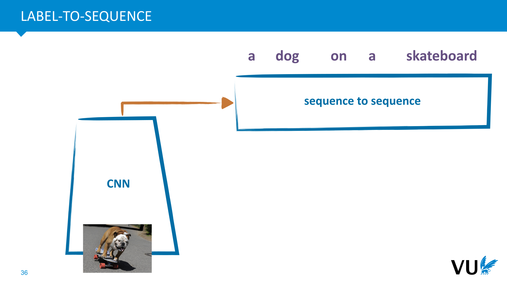
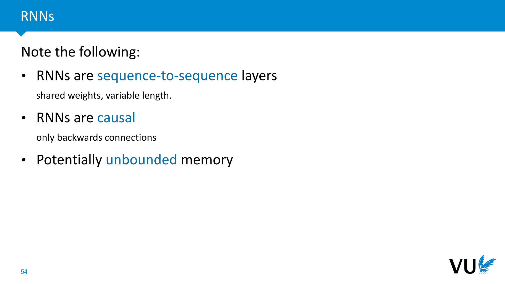
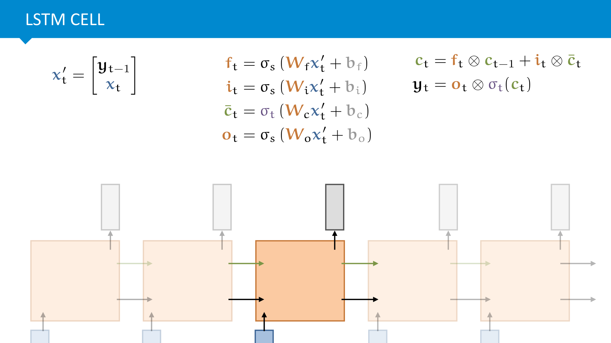
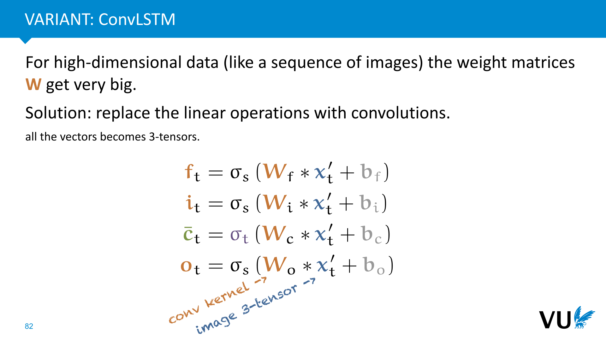
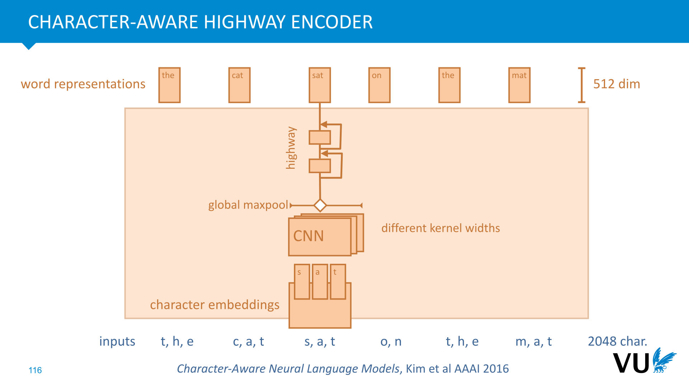
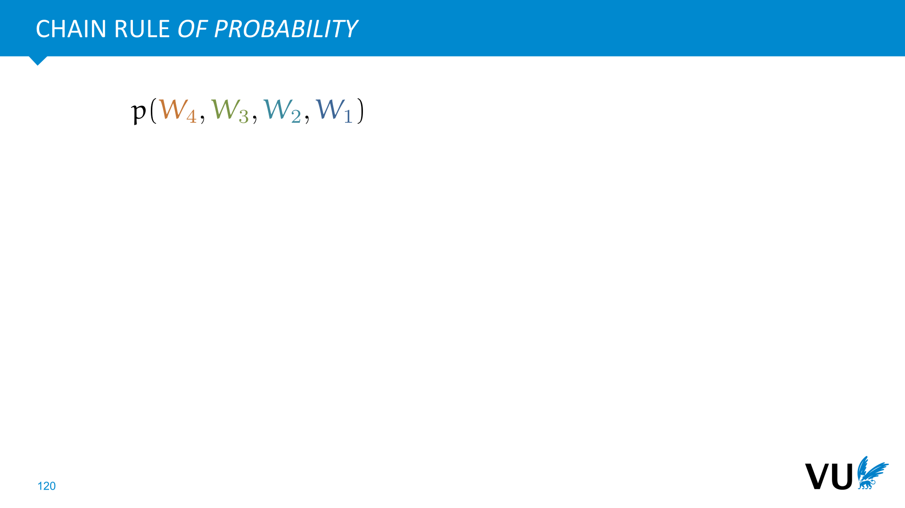

<nav class="menu">
    <ul>
        <li class="home"><a href="/">Home</a></li>
        <li class="name">Sequences</li>
                <li><a href="#video-002">Learning from sequences</a></li>
                <li><a href="#video-042">Recurrent neural networks</a></li>
                <li><a href="#video-060">LSTMs and friends</a></li>
                <li><a href="#video-084">CNNs for sequential data</a></li>
                <li><a href="#video-102">ELMo, a case study</a></li>
        <li class="pdf"><a href="https://dlvu.github.io/pdfs/lecture05.sequences.annotated.pdf">PDF</a></li>
    </ul>
</nav>

<article class="slides">

       <section id="slide-001">
            <a class="slide-link" href="https://dlvu.github.io/sequences#slide-001" title="Link to this slide.">link here</a>
            

            <figcaption>
            

            </figcaption>
       </section>

       <section id="slide-002">
            <a class="slide-link" href="https://dlvu.github.io/sequences#slide-002" title="Link to this slide.">link here</a>
            

            <figcaption>
            

            </figcaption>
       </section>

       <section class="video" id="video-002">
           <a class="slide-link" href="https://dlvu.github.io/sequences#video-2">link here</a>
           <iframe
                src="https://www.youtube.com/embed/rK20XfDN1N4?si=wtMoWrtgR4ETaKp5"
                title="YouTube video player"
                frameborder="0" allow="accelerometer; autoplay; clipboard-write; encrypted-media; gyroscope; picture-in-picture"
                allowfullscreen>
           </iframe>

       </section>

       <section id="slide-003">
            <a class="slide-link" href="https://dlvu.github.io/sequences#slide-003" title="Link to this slide.">link here</a>
            

            <figcaption>
            
In the first part we’ll look at the technical details of setting up a sequence learning problem. How should we prepare our data, represent it as a tensor, and what do sequence-based models look like in deep learning systems? We'll see that one model we've met already, the convolutional layer, can be seen as a sequence model.  

 

            </figcaption>
       </section>

       <section id="slide-004">
            <a class="slide-link" href="https://dlvu.github.io/sequences#slide-004" title="Link to this slide.">link here</a>
            

            <figcaption>
            
Before we start looking at different models to learn from sequential data, it pays to think a little bit about the different types of sequential datasets we might encounter.  

As with the traditional, tabular setting, we can divide our features into numeric and discrete.  

A single 1D sequence might look like this. We could think of this as a stock price, traffic  to a webserver, or atmospheric pressure over Amsterdam. In this case, the data shows the number of sunspots observed over time. 

            </figcaption>
       </section>

       <section id="slide-005">
            <a class="slide-link" href="https://dlvu.github.io/sequences#slide-005" title="Link to this slide.">link here</a>
            

            <figcaption>
            
Sequential numeric data can also be multidimensional. In this case, we see the closing index of the AEX and the FTSE100 over time. This data is a sequence of 2D vectors.

            </figcaption>
       </section>

       <section id="slide-006">
            <a class="slide-link" href="https://dlvu.github.io/sequences#slide-006" title="Link to this slide.">link here</a>
            

            <figcaption>
            
If the elements of our data are discrete (analogous to a categorical feature), it becomes a sequence of symbols. Language is a prime example. In fact, we can model language as a sequence in two different ways: as a sequence of words, or as a sequence of characters. 

            </figcaption>
       </section>

       <section id="slide-007">
            <a class="slide-link" href="https://dlvu.github.io/sequences#slide-007" title="Link to this slide.">link here</a>
            

            <figcaption>
            
As a whole, our dataset can consist of a single long sequence, but it can also be a set of short sequences. For instance, in a typical email spam classification scenario, we could leave the text of the emails as-is (instead of extracting features). The task is then to map a sequence of words or or a sequence characters to the correct class. 

Here, each sequence represents one instance in our data.

            </figcaption>
       </section>

       <section id="slide-008">
            <a class="slide-link" href="https://dlvu.github.io/sequences#slide-008" title="Link to this slide.">link here</a>
            

            <figcaption>
            
An entirely different setting is one where the dataset as a whole is a sequence. In this case, <strong>each point in the sequence is one instance</strong>. The dataset as a whole is an ordered sequence of instances. 

In such cases, the task is often to predict (part of) the future values of the sequence based on what we’ve seen in the past. 

NB: If we really want to complicate things, we can have both at the same time. For instance, emails are actually timestamped, so the dataset as a whole is a sequence of emails. This aspect of emails is usually ignored to keep things simple (but it could carry valuable information).

            </figcaption>
       </section>

       <section id="slide-009">
            <a class="slide-link" href="https://dlvu.github.io/sequences#slide-009" title="Link to this slide.">link here</a>
            

            <figcaption>
            
When your instances are ordered in time, it's important to perform validation carefully. The easiest way to understand this is that evaluation is a <em>simulation</em> of the way you expect the model to be used. If you train a model to predict the future, it should only have access to instances from the past. Therefore you usually train on instances before some point and then evaluate on instances after that point.  

If the model has access to instances "from the future" you will probably get much higher performance in evaluation than is actually realistic. 

To still allow yourself to see how the model performs on various amounts of data, you can use<strong> walk forward validation</strong>. Keep your data aligned in time and test your model at various points, training on the past only, and using a small stretch afterwards as validation. This simulates how well your model does if you had trained it at a particular point in time. 

You can average the different measurements for a general impression of how well your model does, but you can also look at the individual measurements to see, for instance, if there are seasonal effects, how well the model does with little data, what the overall variance is in the performance, etc. 

For the test set you can either use a single evaluation or small steps with retraining in between. To decide, it's usually best to reflect on how you expect the model to be used and what evaluation is the most accurate simulation of that use.

            </figcaption>
       </section>

       <section id="slide-010">
            <a class="slide-link" href="https://dlvu.github.io/sequences#slide-010" title="Link to this slide.">link here</a>
            

            <figcaption>
            

            </figcaption>
       </section>

       <section id="slide-011">
            <a class="slide-link" href="https://dlvu.github.io/sequences#slide-011" title="Link to this slide.">link here</a>
            

            <figcaption>
            
Once we know what our data consists of, we need a model that can consume sequences. In deep learning, the whole point is not to remove information from our input data, but to feed the model data is as raw a form as possible (i.e. no feature extraction). For that reason we want to build models that can consume sequences <em>natively</em>. 

Therefore, we define a sequence model as a model that can consume sequences of variable length. For instance, an email classification model can classify a short email or a long email using<strong> the same set of weights</strong>. 

Our main building block for building sequence models will be <strong>sequence-to-sequence layers</strong>.

            </figcaption>
       </section>

       <section id="slide-012">
            <a class="slide-link" href="https://dlvu.github.io/sequences#slide-012" title="Link to this slide.">link here</a>
            

            <figcaption>
            
This layer takes a sequence of vectors, and outputs a sequence of vectors.  

Both sequences have the <em>same number of vectors</em>, but the<em> dimension </em>of the vectors may change. The key property here is that the layer is defined by a finite set of weights, and with those same weights it should be able to operate on inputs of different lengths t. 

We can also generalize this to sequences of tensors without much change (for instance, to analyse film frames), but we’ll stick to vectors for this lecture.

            </figcaption>
       </section>

       <section id="slide-013" class="anim">
            <a class="slide-link" href="https://dlvu.github.io/sequences#slide-013" title="Link to this slide.">link here</a>
            

            <figcaption>
            
Here is an example: we need a layer that consumes a sequence of five vectors with four elements each and produces another sequence of five vectors with four elements each. 

A fully connected layer would simply connect every input with every output, giving us 400 connections with a weight each. This is <em>not </em>a sequence-to-sequence layer. Why not? Imagine that the next instance has 6 vectors: we wouldn’t be able to feed it to this layer without adding extra weights. 

The version on the right also uses an MLP, but only applies it to each vector in isolation: this gives us 4x4=16 connections per vector and 80 in total. These 80 connection share only 16 unique weights, which are repeated at each step. 

This <em>is</em> a sequence-to-sequence layer. If the next instance has 6 vectors, we can simple repeat the same MLP again, we don’t need any extra weights. 

NB: We call the sequence dimension “time”, but it doesn’t necessarily always represent time. 

            </figcaption>
            click image for animation
       </section>

       <section id="slide-014" class="anim">
            <a class="slide-link" href="https://dlvu.github.io/sequences#slide-014" title="Link to this slide.">link here</a>
            

            <figcaption>
            
The simplest sequence-to-sequence layer that propagates information over time is probably the convolutional layer that we've already seen. In this case with a size 3 kernel.  

Note that the convolution satisfies the main property of a sequence to sequence layer: if we see a longer input sequence, we can simply apply the same kernel, without having to add any weights.

            </figcaption>
            click image for animation
       </section>

       <section id="slide-015">
            <a class="slide-link" href="https://dlvu.github.io/sequences#slide-015" title="Link to this slide.">link here</a>
            

            <figcaption>
            
Of course, the per-element MLP is very simple. The information in the n-th input vector can only influence the information the n-th output vector, and not in any of the other output vectors. It doesn't <strong>propagate information along the time dimensions</strong>. 

More useful sequence-to-sequence layers also have connections between the different points in time. There are three basic families of layers that offer this: convolutions, recurrent layers, and self-attention.

            </figcaption>
       </section>

       <section id="slide-016" class="anim">
            <a class="slide-link" href="https://dlvu.github.io/sequences#slide-016" title="Link to this slide.">link here</a>
            

            <figcaption>
            
Some sequence-to-sequence layers can only look backward in the input sequence. That means that to provide an output yn+1, the model can only use x1 to xn as inputs. This is a very natural assumption for <em>online</em> learning tasks, since we usually want to make a prediction about the next token in the sequence before it has come in. They can either reference these inputs directly, or take the output of the previous computation as an additional input. But in either case, information only ever flows from left to right, and the future tokens in the sequence cannot be used to compute the current token in the output. 

Layers like these are called <strong>causal</strong>. Models build up exclusively of causal layers are called<em> causal sequence models</em>. Note that the name causal is<strong> just a name</strong>: there is no guarantee that these models will actually help you prove causal relations (unless you use them in a particular way). Don't confuse this with the kind of a machine learnig that actually infers causal properties. 

In many other tasks (say, spam classification) we have access to the whole of the sequence before we need to make our prediction. In this case <strong>non-causal</strong> sequence-to-sequence models are prefereable: these can look at the whole sequence to produce their output. 

The convolution we saw earlier was not causal, but convolutions can be made causal by changing the wiring pattern. This will be explained in detail in a later video.

            </figcaption>
            click image for animation
       </section>

       <section id="slide-017">
            <a class="slide-link" href="https://dlvu.github.io/sequences#slide-017" title="Link to this slide.">link here</a>
            

            <figcaption>
            
We'll look at the other sequence-to-sequence layers later. For now, let's see how we can build a basic model, assuming that we have a sequence-to-sequence layer we can stack. 

The first thing we need to think about is how to represent our data. If we have discrete data (like words or characters), how do we represent this in the continuous values that deep learning requires. And, once we have our sequences of vectors, how do we<em> batch</em> these into a single tensor?

            </figcaption>
       </section>

       <section id="slide-018">
            <a class="slide-link" href="https://dlvu.github.io/sequences#slide-018" title="Link to this slide.">link here</a>
            

            <figcaption>
            
As we’ve seen, when we want to do deep learning, our input should be represented as a tensor. Preferably in a way that retains all information (i.e. we want to be learning from the raw data, or something as close to it as possible). 

Here is simple  example: to encode a simple monophonic musical sequence, we just one-hot encode the notes. We create a set of vectors each as long as the vocabulary, filled with zeroes, except for a 1 at one position. We then assign element i the one-hot vector with the 1 at the i-th position. 

image source: <a href="https://violinsheetmusic.org">https://violinsheetmusic.org</a>

            </figcaption>
       </section>

       <section id="slide-019">
            <a class="slide-link" href="https://dlvu.github.io/sequences#slide-019" title="Link to this slide.">link here</a>
            

            <figcaption>
            
Another approach is to embed the discrete tokens in our vocabulary. In this case, we have a vocabulary of seven items (the notes a to g), and we simply <em>assign </em>each a vector of randomly chosen values. Note the difference in length: the one-hot vectors are necessarily exactly as long as the vocabulary. The embedding vectors can be any length. 

The trick of embedding vectors is that we treat these vectors <strong>as parameters</strong>. During training, we compute gradients for them and update their values with gradient descent, the same as all the other values in the neural network. 

This idea can take a while to wrap your head around. If it's not immediately clear, watch/read the rest of the lecture and come back to it when you have a clearer intuition for what sequence-to-sequence models look like. It should make more sense then.

            </figcaption>
       </section>

       <section id="slide-020">
            <a class="slide-link" href="https://dlvu.github.io/sequences#slide-020" title="Link to this slide.">link here</a>
            

            <figcaption>
            
The idea of embedding discrete objects is not specific to sequences. We find it also in matrix decomposition and graph neural networks. Here is the basic principle defined in the most generic terms.

            </figcaption>
       </section>

       <section id="slide-021">
            <a class="slide-link" href="https://dlvu.github.io/sequences#slide-021" title="Link to this slide.">link here</a>
            

            <figcaption>
            
In practice, there is often not much difference between the two approaches. As soon as we multiply a one-hot vector by a weight matrix, we are <strong>selecting a column</strong> from that matrix, so that we can see the columns of the weight matrix as a collection of embeddings. 

Practically, we rarely implement the one-hot vectors explicitly, because we’d just be storing a large amount of zeros, so the two approaches are likely to lead to the same or very similar implementations.

            </figcaption>
       </section>

       <section id="slide-022" class="anim">
            <a class="slide-link" href="https://dlvu.github.io/sequences#slide-022" title="Link to this slide.">link here</a>
            

            <figcaption>
            
Once we have each point in a sequence represented as a vector of continuous values, we can easily represent this sequence as a matrix.  

If we have multiple sequences of different lengths, this leads to a data set of matrices of different sizes. This means that our dataset as a whole can’t be stored in a single tensor. 

That’s not a problem, we can simply maintain a<em> list</em> of these matrices instead of concatenating them into a single tensor. However, the single batch we feed to our network <em>does</em> need to be a tensor, otherwise we don’t get any parallelism across the batch dimension from our tensor library. 

            </figcaption>
            click image for animation
       </section>

       <section id="slide-023" class="anim">
            <a class="slide-link" href="https://dlvu.github.io/sequences#slide-023" title="Link to this slide.">link here</a>
            

            <figcaption>
            
The simplest way to create batches of a uniform length is to pad our sequences with zeros, or with a special “&lt;pad&gt;” token that we add to our vocabulary (so that it gets a one-hot or an embedding vector). 

            </figcaption>
            click image for animation
       </section>

       <section id="slide-024" class="anim">
            <a class="slide-link" href="https://dlvu.github.io/sequences#slide-024" title="Link to this slide.">link here</a>
            

            <figcaption>
            
The lengths of sequences are often roughly powerlaw-distributed with a few very long outliers. If we shuffled the data, we would end up padding batches to the length of the longest member of the batch, which means we're filling a lot of our batch with zeros. 

A common approach is to sort the data by sequence length and <em>then</em> cut into batches. The first advantage is that most elements in the batch have similar lengths, which minimizes the amount of padding. 

The second advantage is that we can increase the batch size for the shorter sequences: it may be that we only have enough memory to feed the long sequences to the model one at a time, but for the short sequences, we can still train on a large batch in one pass. 

Note that this does mean that our instances are no longer i.i.d. This may confuse certain layers (like batch norm) that assume i.i.d. batches.

            </figcaption>
            click image for animation
       </section>

       <section id="slide-025" class="anim">
            <a class="slide-link" href="https://dlvu.github.io/sequences#slide-025" title="Link to this slide.">link here</a>
            

            <figcaption>
            
In addition to padding your sequences, you can also <em>pack</em> them. This is a neat trick that means that you won’t use any memory for the zero-padding of your sequences. 

The data will be stored in a single sequence that interleaves the different instances in the batch. This is stored together with a count of, reading from left to right, how many  instances are still in the batch at that point. 

Using this information, a sequence layer can process the batch by a sliding window, representing the current “timestep”. The window contains all the tokens that may be processed in parallel. As we move from left to right, the window occasionally shrinks, when we reach the end of one of the sequences. 

Packing is primarily used for recurrent neural networks, as these actually process sequences serially (i.e. with a sliding window). For self-attention and CNNs, as we shall see, we get a big boost from processing all time steps in parallel, which requires us to operate on padded batches.

            </figcaption>
            click image for animation
       </section>

       <section id="slide-026">
            <a class="slide-link" href="https://dlvu.github.io/sequences#slide-026" title="Link to this slide.">link here</a>
            

            <figcaption>
            
Now that we have our data prepared, we can start building our model. First, we need to know what we feed into the model and what we expect to get out. One of these needs to be a sequence (or it wouldn't be a sequence model) but the other can be a single "label": either a categorical value like a class or a (vector of) numerical values. 

Here are the four most common options. We'll go through each in order and see what the main considerations are for building a model like this. 

            </figcaption>
       </section>

       <section id="slide-027">
            <a class="slide-link" href="https://dlvu.github.io/sequences#slide-027" title="Link to this slide.">link here</a>
            

            <figcaption>
            
A sequence-to-sequence task is probably the simplest set-up. Our dataset consists of a set of input and output sequences. We simply create a model by stacking a bunch of sequence to sequence layers, and our loss is the difference between the target sequence and the output sequence.

            </figcaption>
       </section>

       <section id="slide-028">
            <a class="slide-link" href="https://dlvu.github.io/sequences#slide-028" title="Link to this slide.">link here</a>
            

            <figcaption>
            
Here’s a simple example of a sequence-to-sequence task: tag each word in a sentence with its grammatical category (the "part of speech tag"). This is known as<em> part-of-speech tagging</em>. All we need is a large collection of sentences that have been tagged as training data. 

For the embedding layer, we convert our input sequence to positive integers. We have to decide beforehand what the size of our vocabulary is. If we keep a vocabulary of 10 000 tokens, the embedding layer will create 10 000 embedding vectors for us.  

It then takes a sequence of positive integers and translates this to a sequence of the corresponding embedding vectors. These are fed to a stack of s2s layers, which ultimately produce a sequence of vectors with as many elements as output tokens (if we have 5 POS tags, these vectors have five elements each). After applying a softmax activation to each vector in this sequence, we get a sequence of probabilities over the target tokens.

            </figcaption>
       </section>

       <section id="slide-029">
            <a class="slide-link" href="https://dlvu.github.io/sequences#slide-029" title="Link to this slide.">link here</a>
            

            <figcaption>
            
If we have a padded batch, it’s a good idea to mask the computation of the loss for the padded part of the sequence. That is, we compute the loss only for the non-masked tokens, since we don’t really care what the model predicts for the pad tokens. 

A simple way to do this is to make a binary tensor indicating which elements are masked, and to compute the loss per output in a tensor, and to multiply the two, before summing/averaging the loss.

            </figcaption>
       </section>

       <section id="slide-030">
            <a class="slide-link" href="https://dlvu.github.io/sequences#slide-030" title="Link to this slide.">link here</a>
            

            <figcaption>
            
If we have a<em> causal</em> model, and there is likely some processing required between the input and the output, it’s common to let the network read the whole input before it starts processing the output. 

With a non-causal model, we can just add extra layers to allow extra processing, but with a causal model, any processing that takes into account the last word of the input has to happen after that word, so we need to lengthen the sequence as well. 

Note that here, we’ve even given the model one empty step between the end of the question and the beginning of the answer, for extra processing (in practice this maybe hundreds of steps of padded tokens).

            </figcaption>
       </section>

       <section id="slide-031">
            <a class="slide-link" href="https://dlvu.github.io/sequences#slide-031" title="Link to this slide.">link here</a>
            

            <figcaption>
            
One interesting trick we can use with  a causal model, is to feed it some sequence, and to set the target as the same sequence, <em>shifted one token to the left</em>. 

This effectively trains the model to predict the next character in the sequence. Note that this only works with causal models, because non-causal models can just look ahead in the input sequence to see the next character.

            </figcaption>
       </section>

       <section id="slide-032">
            <a class="slide-link" href="https://dlvu.github.io/sequences#slide-032" title="Link to this slide.">link here</a>
            

            <figcaption>
            
After the network is trained in this way, we can use it to generate text. 

We start with a small <em>seed</em> sequence of tokens, and sequentially sample a likely sequence. We’ll see some examples of this after we’ve explained LSTM networks. 

In lecture 10, Jakub will go into autoregressive modeling is much greater detail.

            </figcaption>
       </section>

       <section id="slide-033">
            <a class="slide-link" href="https://dlvu.github.io/sequences#slide-033" title="Link to this slide.">link here</a>
            

            <figcaption>
            
In a sequence-to-label setting, we get a sequence as input, and we need to produce a single output. This can be a softmaxed vector over classes, or simply an output vector if we need multiple outputs (this vector may also be passed through some further feedforward layers, which we haven’t drawn here). 

Here, we first stack one or more sequence to sequence layers. At some point in the network, we need to reduce in the time dimension. A<strong> global pooling </strong>layer sums, averages or maxes across one whole dimension, removing it from the output tensor. In this case, we global pool over the time dimension, amd  

Note that we can’t use a fully connected layer here: we need an operation that can be applied to variable input sequences.

            </figcaption>
       </section>

       <section id="slide-034">
            <a class="slide-link" href="https://dlvu.github.io/sequences#slide-034" title="Link to this slide.">link here</a>
            

            <figcaption>
            
Another approach is to simply take one of the vectors in the output sequence, use that as the output vector and ignore the rest. 

If you have <em>causal </em>s2s layers, it’s important that you use the last vector, since that’s the only one that gets to see the whole sequence. 

For some layers (like RNNs), this kind of approach puts more weight on the end of the sequence, since the early nodes have to propagate through more intermediate steps in the s2s layer. For others (like self-attention), all inputs in the sequence are treated equally, and there is little difference between a global unit and a pooling layer.

            </figcaption>
       </section>

       <section id="slide-035">
            <a class="slide-link" href="https://dlvu.github.io/sequences#slide-035" title="Link to this slide.">link here</a>
            

            <figcaption>
            

            </figcaption>
       </section>

       <section id="slide-036">
            <a class="slide-link" href="https://dlvu.github.io/sequences#slide-036" title="Link to this slide.">link here</a>
            

            <figcaption>
            
Here’s one example of a label to sequence task. Taking a simple image, and generating a caption for it. The “label”, here is the input image, which is transformed to a single feature vector by a CNN  

            </figcaption>
       </section>

       <section id="slide-037">
            <a class="slide-link" href="https://dlvu.github.io/sequences#slide-037" title="Link to this slide.">link here</a>
            

            <figcaption>
            
Our final configuration is the case where we have both a label and a sequence as input. Some sequence-to-sequence layers support a second vector input natively (as we shall see later).

            </figcaption>
       </section>

       <section id="slide-038">
            <a class="slide-link" href="https://dlvu.github.io/sequences#slide-038" title="Link to this slide.">link here</a>
            

            <figcaption>
            
If there is no native way for the sequence model to accept a second input, we can just repeat the label into a sequence, and concatenate or sum it to the input sequence.

            </figcaption>
       </section>

       <section id="slide-039">
            <a class="slide-link" href="https://dlvu.github.io/sequences#slide-039" title="Link to this slide.">link here</a>
            

            <figcaption>
            
What does this allow us to do? In the image captioning task, we can now train our language model <em>autoregressively</em>. This can help a lot to make the output sentences look more natural.

            </figcaption>
       </section>

       <section id="slide-040">
            <a class="slide-link" href="https://dlvu.github.io/sequences#slide-040" title="Link to this slide.">link here</a>
            

            <figcaption>
            
We can also apply this principle for complex sequence-to-sequence tasks. Here we first use a non-causal model to learn a global representation of the input sequence in a single vector. This is then used to condition a causal model of the output sequence, which is trained like the autoregressive model we saw earlier. It looks complicated, but given a set of inputs and targets, this model can be trained end-to-end by backpropagation. 

Once it’s trained, we first feed an input to the encoder to get a global representation, and then perform sequential sampling  

 

            </figcaption>
       </section>

       <section id="slide-041">
            <a class="slide-link" href="https://dlvu.github.io/sequences#slide-041" title="Link to this slide.">link here</a>
            

            <figcaption>
            

            </figcaption>
       </section>

       <section id="slide-042">
            <a class="slide-link" href="https://dlvu.github.io/sequences#slide-042" title="Link to this slide.">link here</a>
            

            <figcaption>
            

            </figcaption>
       </section>

       <section class="video" id="video-042">
           <a class="slide-link" href="https://dlvu.github.io/sequences#video-42">link here</a>
           <iframe
                src="https://www.youtube.com/embed/2JGlmBhQedk?si=khTatO6UOf9WCsAW"
                title="YouTube video player"
                frameborder="0" allow="accelerometer; autoplay; clipboard-write; encrypted-media; gyroscope; picture-in-picture"
                allowfullscreen>
           </iframe>

       </section>

       <section id="slide-043">
            <a class="slide-link" href="https://dlvu.github.io/sequences#slide-043" title="Link to this slide.">link here</a>
            

            <figcaption>
            
A recurrent neural network is any neural network that has a cycle in it. 

 

            </figcaption>
       </section>

       <section id="slide-044">
            <a class="slide-link" href="https://dlvu.github.io/sequences#slide-044" title="Link to this slide.">link here</a>
            

            <figcaption>
            
This figure shows a popular configuration. It’s a basic fully connected network, except that its input x is extended by three nodes to which the hidden layer is copied. 

This particular configuration is sometimes called an <strong>Elman network</strong>. These were popular in the 80s and early 90s, so you’ll usually see them with a sigmoid activation.

            </figcaption>
       </section>

       <section id="slide-045">
            <a class="slide-link" href="https://dlvu.github.io/sequences#slide-045" title="Link to this slide.">link here</a>
            

            <figcaption>
            
To keep things clear we will adopt this visual shorthand: a rectangle represents a vector of nodes, and an arrow feeding into such a rectangle annotated with a weight matrix represents a fully connected transformation. 

We will assume bias nodes are included without drawing them. 

This image shows a simple (nonrecurrent) feedforward net in our new shorthand.

            </figcaption>
       </section>

       <section id="slide-046" class="anim">
            <a class="slide-link" href="https://dlvu.github.io/sequences#slide-046" title="Link to this slide.">link here</a>
            

            <figcaption>
            
A line with no weight matrix represents a copy of the input vector. When two lines flow into each other, we concatenate their vectors.  

Here, the added line copies h, concatenates it to x, and applies weight matrix W. 

            </figcaption>
            click image for animation
       </section>

       <section id="slide-047">
            <a class="slide-link" href="https://dlvu.github.io/sequences#slide-047" title="Link to this slide.">link here</a>
            

            <figcaption>
            
We can now apply this neural network to a sequence. We feed it the first input, x1, result in a first value for the hidden layer, h1, and retrieve the first output y1. 

In the first iteration the recurrent inputs are set equal to zero, so the network just behaves like an MLP. 

The network provides an output y1, which is the first element of our output sequence.

            </figcaption>
       </section>

       <section id="slide-048">
            <a class="slide-link" href="https://dlvu.github.io/sequences#slide-048" title="Link to this slide.">link here</a>
            

            <figcaption>
            
In the second step, we feed it the second element in our sequence, concatenated with the hidden layer from the previous sequence.

            </figcaption>
       </section>

       <section id="slide-049">
            <a class="slide-link" href="https://dlvu.github.io/sequences#slide-049" title="Link to this slide.">link here</a>
            

            <figcaption>
            
And so on.

            </figcaption>
       </section>

       <section id="slide-050">
            <a class="slide-link" href="https://dlvu.github.io/sequences#slide-050" title="Link to this slide.">link here</a>
            

            <figcaption>
            

            </figcaption>
       </section>

       <section id="slide-051">
            <a class="slide-link" href="https://dlvu.github.io/sequences#slide-051" title="Link to this slide.">link here</a>
            

            <figcaption>
            
Instead of visualising a single small network, applied at every time step, we can unroll the network. Every step in the sequence is applied in parallel to a copy of the network, and the recurrent connection flows from the previous copy to the next. 

Now the whole network is just one big, complicated feedforward net, that is, a network without cycles. Note that we have a lot of shared weights, but we know how to deal with those.

            </figcaption>
       </section>

       <section id="slide-052">
            <a class="slide-link" href="https://dlvu.github.io/sequences#slide-052" title="Link to this slide.">link here</a>
            

            <figcaption>
            
Now the whole network is just one big, complicated feedforward net. Note that we have a lot of shared weights, but we know how to deal with those. 

Here, we’ve only drawn the loss for one output vector, but in a sequence-to-sequence task, we’d get a loss for every vector in the output sequence, which we would then sum. 

            </figcaption>
       </section>

       <section id="slide-053">
            <a class="slide-link" href="https://dlvu.github.io/sequences#slide-053" title="Link to this slide.">link here</a>
            

            <figcaption>
            
In truncated backpropagation through time, we limit how far back the backpropagation goes, to save memory. The output is still entirely dependent on the whole sequence, but the weights are only trained based on the last few steps. Note that the weights are still affected everywhere, because they are shared between timesteps. 

Before the truncation point, we do not need to maintain a computation graph, so up to the computation of <strong>h</strong>3, we do not need to store any intermediate values. 

 

 

            </figcaption>
       </section>

       <section id="slide-054">
            <a class="slide-link" href="https://dlvu.github.io/sequences#slide-054" title="Link to this slide.">link here</a>
            

            <figcaption>
            

            </figcaption>
       </section>

       <section id="slide-055">
            <a class="slide-link" href="https://dlvu.github.io/sequences#slide-055" title="Link to this slide.">link here</a>
            

            <figcaption>
            

            </figcaption>
       </section>

       <section id="slide-056">
            <a class="slide-link" href="https://dlvu.github.io/sequences#slide-056" title="Link to this slide.">link here</a>
            

            <figcaption>
            
When training sequence-to-label, it’s quite common to take the last hidden state as the label output of the network (possible passed through an MLP to reshape it). 

Thos is broadly equivalent to the global unit shown in the first video, so this does mean that the last part of the sequence likely has more influence on the outptu than the first part. Nevertheless, it is a common configuration.

            </figcaption>
       </section>

       <section id="slide-057">
            <a class="slide-link" href="https://dlvu.github.io/sequences#slide-057" title="Link to this slide.">link here</a>
            

            <figcaption>
            
Similarly, in a label-to-sequence task, you can pass the label vector as the first hidden state. This is a compact way to do it, but do note that the last tokens in the sequence are further way than the first (there are more computations in between). For this reason a repeat strategy as shown on layer 36, may be more powerful (at the cost of a little more memory).

            </figcaption>
       </section>

       <section id="slide-058">
            <a class="slide-link" href="https://dlvu.github.io/sequences#slide-058" title="Link to this slide.">link here</a>
            

            <figcaption>
            
If you want to do teacher forcing, or something similar, the hidden state is a neat way to combine the label input and the sequence input.

            </figcaption>
       </section>

       <section id="slide-059">
            <a class="slide-link" href="https://dlvu.github.io/sequences#slide-059" title="Link to this slide.">link here</a>
            

            <figcaption>
            
In theory, RNNs are a wonderful model for sequences, because they can remember things forever. In practice, it turns out that these kinds of RNNs don’t. Why not? consider the path taken by the backpropagation algorithm: it passes many activation layers (and these are sigmoids in the most common RNNs). At each step the gradient is multiplied by at most 0.25. The problem of vanishing gradients is very strong in RNNs like this. 

We could of course initialize the weight matrices <strong>W</strong> very carefully, use ReLU activations, and perhaps even add an occasional batch-norm-style centering of the activations. Unfortunately, in the 90s, none of these tricks we known yet. Instead researchers am up with something entirely different: the LSTM network. 

            </figcaption>
       </section>

       <section id="slide-060">
            <a class="slide-link" href="https://dlvu.github.io/sequences#slide-060" title="Link to this slide.">link here</a>
            

            <figcaption>
            

            </figcaption>
       </section>

       <section class="video" id="video-060">
           <a class="slide-link" href="https://dlvu.github.io/sequences#video-60">link here</a>
           <iframe
                src="https://www.youtube.com/embed/fbTCvvICk8M?si=lzXc2KfpCuuC_Mtu"
                title="YouTube video player"
                frameborder="0" allow="accelerometer; autoplay; clipboard-write; encrypted-media; gyroscope; picture-in-picture"
                allowfullscreen>
           </iframe>

       </section>

       <section id="slide-061">
            <a class="slide-link" href="https://dlvu.github.io/sequences#slide-061" title="Link to this slide.">link here</a>
            

            <figcaption>
            
 

            </figcaption>
       </section>

       <section id="slide-062">
            <a class="slide-link" href="https://dlvu.github.io/sequences#slide-062" title="Link to this slide.">link here</a>
            

            <figcaption>
            
Basic RNNs work pretty well, but they do not learn to remember information for very long. Technically they can, but the gradient vanished too quickly over the timesteps. 

You can’t have a long term memory for everything. You need to be selective, and you need to learn to select words to be stored for the long term when you first see them.  

In order to remember things long term you need to forget many other things.

            </figcaption>
       </section>

       <section id="slide-063">
            <a class="slide-link" href="https://dlvu.github.io/sequences#slide-063" title="Link to this slide.">link here</a>
            

            <figcaption>
            
An enduring solution to the problem are LSTMs. LSTMs have a complex mechanism, which we’ll go through step by step, but the main component is a gating mechanism. 

            </figcaption>
       </section>

       <section id="slide-064">
            <a class="slide-link" href="https://dlvu.github.io/sequences#slide-064" title="Link to this slide.">link here</a>
            

            <figcaption>
            
The basic operation of the LSTM is called a <em>cell </em>(the orange square, which we’ll detail later). Between cells, there are two recurrent connections, y, the current output, and C the cell state.

            </figcaption>
       </section>

       <section id="slide-065">
            <a class="slide-link" href="https://dlvu.github.io/sequences#slide-065" title="Link to this slide.">link here</a>
            

            <figcaption>
            
Inside the LSTM cell, these formulas are applied. They’re a complicated bunch, so we’ll first represent what happens visually.

            </figcaption>
       </section>

       <section id="slide-066">
            <a class="slide-link" href="https://dlvu.github.io/sequences#slide-066" title="Link to this slide.">link here</a>
            

            <figcaption>
            
Here is our visual notation.

            </figcaption>
       </section>

       <section id="slide-067">
            <a class="slide-link" href="https://dlvu.github.io/sequences#slide-067" title="Link to this slide.">link here</a>
            

            <figcaption>
            
Here is what happens inside the cell. It looks complicated, but we’ll go through all the elements step by step.

            </figcaption>
       </section>

       <section id="slide-068">
            <a class="slide-link" href="https://dlvu.github.io/sequences#slide-068" title="Link to this slide.">link here</a>
            

            <figcaption>
            
The first is the “conveyor belt”. It passes the previous cell state to the next cell. Along the way, the current input can be used to manipulate it.  

 

Note that the connection from the previous cell to the next has <em>no activations</em>. This means that along this path, gradients do not decay: everything is purely linear. It’s also very easy for an LSTM cell  to ignore the current information and just pass the information along the conveyor belt.

            </figcaption>
       </section>

       <section id="slide-069">
            <a class="slide-link" href="https://dlvu.github.io/sequences#slide-069" title="Link to this slide.">link here</a>
            

            <figcaption>
            
Here is the first manipulation of the conveyor belt. This is called the <strong>forget gate</strong>. 

It looks at the current input, concatenated with the previous output, and applies an element-wise scaling to the current value in the conveyor belt. Outputting all 1s will keep the current value on the belt what it is, and outputting all values near 0, will decay the values (forgetting what we’ve seen so far, and allowing it to be replaces by our new values in the next step).

            </figcaption>
       </section>

       <section id="slide-070">
            <a class="slide-link" href="https://dlvu.github.io/sequences#slide-070" title="Link to this slide.">link here</a>
            

            <figcaption>
            
in the next step, we pass the input through a generic gate, as described earlier, and add the resulting vector to the value on the conveyor belt.

            </figcaption>
       </section>

       <section id="slide-071">
            <a class="slide-link" href="https://dlvu.github.io/sequences#slide-071" title="Link to this slide.">link here</a>
            

            <figcaption>
            
The gate combines the sigmoid  and tanh activations. The sigmoid we’ve seen already. The tanh is just a the sigmoid rescaled so that its outputs are between -1 and 1. 

The gating mechanism takes two input vectors, and combines them using a sigmoid and a tanh activation. The gate is best understand as producing an additive value: we want to figure out how much of the input to add to some other vector (if it’s import, we want to add most of if, otherwise, we want to forget it, and keep the original value). 

The input is first transformed by two weight metrics and then passed though a sigmoid and a tanh. The tanh should be though of as a mapping of the input to the range [-1, 1]. This ensures that the effect of the addition vector can’t be too much. The sigmoid acts as a selection vector. For elements of the input that are important, it outputs 1,  retaining all the input in the addition vector. For elements of the input that are not important, it outputs 0, so that they are zeroed out. The sigmoid and tanh vectors are element-wise multiplied. 

Note that if we initialise Wt and Ws to zero,  the input is entirely ignored.

            </figcaption>
       </section>

       <section id="slide-072">
            <a class="slide-link" href="https://dlvu.github.io/sequences#slide-072" title="Link to this slide.">link here</a>
            

            <figcaption>
            
Finally, we need to decide what to output now. We take the current value of the conveyor belt, tanh it to rescale, and element-wise multiply it by another sigmoid activated layer. This layer is sent out as the current output, and sent to the next cell along the second recurrent connection. 

Note that this is another gate construction: the current <strong>c</strong> value is passed though a tanh and multiplied by a filter <strong>o</strong>.

            </figcaption>
       </section>

       <section id="slide-073">
            <a class="slide-link" href="https://dlvu.github.io/sequences#slide-073" title="Link to this slide.">link here</a>
            

            <figcaption>
            

            </figcaption>
       </section>

       <section id="slide-074">
            <a class="slide-link" href="https://dlvu.github.io/sequences#slide-074" title="Link to this slide.">link here</a>
            

            <figcaption>
            
On interesting trick we can use on a causal model, is to feed it some sequence, and to set the target as the same sequence, <em>shifted one token to the left</em>. 

This effectively trains the model to predict the next character in the sequence. Note that this only works with causal models, because non-causal models can just look ahead in the sequence to see the next character.

            </figcaption>
       </section>

       <section id="slide-075">
            <a class="slide-link" href="https://dlvu.github.io/sequences#slide-075" title="Link to this slide.">link here</a>
            

            <figcaption>
            
Remember, this is a <strong>character level</strong> language model.

            </figcaption>
       </section>

       <section id="slide-076">
            <a class="slide-link" href="https://dlvu.github.io/sequences#slide-076" title="Link to this slide.">link here</a>
            

            <figcaption>
            
Note that not only is the language natural, the wikipedia markup is also correct (link brackets are closed properly, and contain key concepts).

            </figcaption>
       </section>

       <section id="slide-077">
            <a class="slide-link" href="https://dlvu.github.io/sequences#slide-077" title="Link to this slide.">link here</a>
            

            <figcaption>
            
The network can even learn to generate valid (looking) URLs for external links.

            </figcaption>
       </section>

       <section id="slide-078">
            <a class="slide-link" href="https://dlvu.github.io/sequences#slide-078" title="Link to this slide.">link here</a>
            

            <figcaption>
            
Sometimes wikipedia text contains bits of XML for structured information. The model can generate these flawlessly.

            </figcaption>
       </section>

       <section id="slide-079">
            <a class="slide-link" href="https://dlvu.github.io/sequences#slide-079" title="Link to this slide.">link here</a>
            

            <figcaption>
            

            </figcaption>
       </section>

       <section id="slide-080">
            <a class="slide-link" href="https://dlvu.github.io/sequences#slide-080" title="Link to this slide.">link here</a>
            

            <figcaption>
            

            </figcaption>
       </section>

       <section id="slide-081">
            <a class="slide-link" href="https://dlvu.github.io/sequences#slide-081" title="Link to this slide.">link here</a>
            

            <figcaption>
            

            </figcaption>
       </section>

       <section id="slide-082">
            <a class="slide-link" href="https://dlvu.github.io/sequences#slide-082" title="Link to this slide.">link here</a>
            

            <figcaption>
            

            </figcaption>
       </section>

       <section id="slide-083">
            <a class="slide-link" href="https://dlvu.github.io/sequences#slide-083" title="Link to this slide.">link here</a>
            

            <figcaption>
            

            </figcaption>
       </section>

       <section id="slide-084">
            <a class="slide-link" href="https://dlvu.github.io/sequences#slide-084" title="Link to this slide.">link here</a>
            

            <figcaption>
            

            </figcaption>
       </section>

       <section class="video" id="video-084">
           <a class="slide-link" href="https://dlvu.github.io/sequences#video-84">link here</a>
           <iframe
                src="https://www.youtube.com/embed/rT77lBfAZm4?si=XzPOr-6eTgJmsUqh"
                title="YouTube video player"
                frameborder="0" allow="accelerometer; autoplay; clipboard-write; encrypted-media; gyroscope; picture-in-picture"
                allowfullscreen>
           </iframe>

       </section>

       <section id="slide-085">
            <a class="slide-link" href="https://dlvu.github.io/sequences#slide-085" title="Link to this slide.">link here</a>
            

            <figcaption>
            
 

            </figcaption>
       </section>

       <section id="slide-086">
            <a class="slide-link" href="https://dlvu.github.io/sequences#slide-086" title="Link to this slide.">link here</a>
            

            <figcaption>
            

            </figcaption>
       </section>

       <section id="slide-087">
            <a class="slide-link" href="https://dlvu.github.io/sequences#slide-087" title="Link to this slide.">link here</a>
            

            <figcaption>
            

            </figcaption>
       </section>

       <section id="slide-088">
            <a class="slide-link" href="https://dlvu.github.io/sequences#slide-088" title="Link to this slide.">link here</a>
            

            <figcaption>
            

            </figcaption>
       </section>

       <section id="slide-089">
            <a class="slide-link" href="https://dlvu.github.io/sequences#slide-089" title="Link to this slide.">link here</a>
            

            <figcaption>
            

            </figcaption>
       </section>

       <section id="slide-090">
            <a class="slide-link" href="https://dlvu.github.io/sequences#slide-090" title="Link to this slide.">link here</a>
            

            <figcaption>
            

            </figcaption>
       </section>

       <section id="slide-091">
            <a class="slide-link" href="https://dlvu.github.io/sequences#slide-091" title="Link to this slide.">link here</a>
            

            <figcaption>
            

            </figcaption>
       </section>

       <section id="slide-092">
            <a class="slide-link" href="https://dlvu.github.io/sequences#slide-092" title="Link to this slide.">link here</a>
            

            <figcaption>
            

            </figcaption>
       </section>

       <section id="slide-093">
            <a class="slide-link" href="https://dlvu.github.io/sequences#slide-093" title="Link to this slide.">link here</a>
            

            <figcaption>
            

            </figcaption>
       </section>

       <section id="slide-094">
            <a class="slide-link" href="https://dlvu.github.io/sequences#slide-094" title="Link to this slide.">link here</a>
            

            <figcaption>
            

            </figcaption>
       </section>

       <section id="slide-095">
            <a class="slide-link" href="https://dlvu.github.io/sequences#slide-095" title="Link to this slide.">link here</a>
            

            <figcaption>
            

            </figcaption>
       </section>

       <section id="slide-096">
            <a class="slide-link" href="https://dlvu.github.io/sequences#slide-096" title="Link to this slide.">link here</a>
            

            <figcaption>
            

            </figcaption>
       </section>

       <section id="slide-097">
            <a class="slide-link" href="https://dlvu.github.io/sequences#slide-097" title="Link to this slide.">link here</a>
            

            <figcaption>
            

            </figcaption>
       </section>

       <section id="slide-098">
            <a class="slide-link" href="https://dlvu.github.io/sequences#slide-098" title="Link to this slide.">link here</a>
            

            <figcaption>
            

            </figcaption>
       </section>

       <section id="slide-099">
            <a class="slide-link" href="https://dlvu.github.io/sequences#slide-099" title="Link to this slide.">link here</a>
            

            <figcaption>
            

            </figcaption>
       </section>

       <section id="slide-100">
            <a class="slide-link" href="https://dlvu.github.io/sequences#slide-100" title="Link to this slide.">link here</a>
            

            <figcaption>
            

            </figcaption>
       </section>

       <section id="slide-101">
            <a class="slide-link" href="https://dlvu.github.io/sequences#slide-101" title="Link to this slide.">link here</a>
            

            <figcaption>
            

            </figcaption>
       </section>

       <section id="slide-102">
            <a class="slide-link" href="https://dlvu.github.io/sequences#slide-102" title="Link to this slide.">link here</a>
            

            <figcaption>
            

            </figcaption>
       </section>

       <section class="video" id="video-102">
           <a class="slide-link" href="https://dlvu.github.io/sequences#video-102">link here</a>
           <iframe
                src="https://www.youtube.com/embed/csAlW9HmwAQ?si=1GDZdwZ34YydsEvJ"
                title="YouTube video player"
                frameborder="0" allow="accelerometer; autoplay; clipboard-write; encrypted-media; gyroscope; picture-in-picture"
                allowfullscreen>
           </iframe>

       </section>

       <section id="slide-103">
            <a class="slide-link" href="https://dlvu.github.io/sequences#slide-103" title="Link to this slide.">link here</a>
            

            <figcaption>
            
 

            </figcaption>
       </section>

       <section id="slide-104" class="anim">
            <a class="slide-link" href="https://dlvu.github.io/sequences#slide-104" title="Link to this slide.">link here</a>
            

            <figcaption>
            
To place ELMo into context, let’s first look at one of it’s predecessors: Word2Vec. 

We slide a context window over the sequence. The task is to predict the distribution p(y|x): that predict which words are likely to occur in the context window given the middle word. 

We create a dataset of word pairs from the entire text and feed this to a very simple two-layer network. This is a bit like an autoencoder, except we’re not reconstructing the output, but predicting the <em>context</em>. 

The softmax activation over 10k outputs is very expensive to compute, and you need some clever tricks to make this feasible (called<em> hierarchical </em>softmax or negative sampling). We won’t go into them here.

            </figcaption>
            click image for animation
       </section>

       <section id="slide-105">
            <a class="slide-link" href="https://dlvu.github.io/sequences#slide-105" title="Link to this slide.">link here</a>
            

            <figcaption>
            
After training, we discard the second layer, and use only the embeddings produced by the first layer.

            </figcaption>
       </section>

       <section id="slide-106">
            <a class="slide-link" href="https://dlvu.github.io/sequences#slide-106" title="Link to this slide.">link here</a>
            

            <figcaption>
            
Here, we can see a very direct example of the principle noted at the start of the lecture: that multiplying by 

Because the input layer is just a matrix multiplication, and the input is just a one-hot vector, what we end up doing when we compute the embedding for word i, is just extracting the i-th column from <strong class="orange">W</strong>. 

In other words, we’re not really training a function that <em>computes</em> an embedding for each word, we are actually learning the embeddings directly: every element of every embedding vector is a separate parameter. 

 

 

 

 

            </figcaption>
       </section>

       <section id="slide-107" class="anim">
            <a class="slide-link" href="https://dlvu.github.io/sequences#slide-107" title="Link to this slide.">link here</a>
            

            <figcaption>
            
Famously, Word2Vec produces not just an informative embedding, where similar words are close together, but for many concepts, there seems to be a kind of algebraic structure, similar to the smile vector example from the autoencoder.

            </figcaption>
            click image for animation
       </section>

       <section id="slide-108">
            <a class="slide-link" href="https://dlvu.github.io/sequences#slide-108" title="Link to this slide.">link here</a>
            

            <figcaption>
            
Word2Vec was also one of the first systems that clearly showed the way that machine learning models could be <em>biased</em>.  

As useful as word embeddings are, it’s very important to be aware that they will reflect the bias in your data. Any large collection of text, for instance, will reflect gender biases that exist in society.  

In itself, this is not a bad thing: it may even help to map out those biases and study them better.  

            </figcaption>
       </section>

       <section id="slide-109" class="anim">
            <a class="slide-link" href="https://dlvu.github.io/sequences#slide-109" title="Link to this slide.">link here</a>
            

            <figcaption>
            
However when you use these statistics in an application, you need to turn your predictions into actions, which will almost certainly end up reinforcing the existing biases.  

Shown here is google’s machine translation system. A sentence which is gender-neutral in English, like “My friend is a doctor” cannot be translated in a gender-neutral way into Spanish. In the earlier versions of Google Translate, a gender was chosen (implicitly), mostly dictated by the statistics of the dataset. You may argue that these statistics are in a sense reflective of biases that exist in society, so that it is indeed more likely that this sentence should be translated for a male. However, that doesn’t mean that we’re <em>certain</em> that the user wants the sentence translated in this way. And by reducing uncertain predictions to discrete, certain actions, we run the risk of not just reproducing the bias in our data, but also amplifying it. 

The solution (in this case) was not to reduce the uncertainy by guessing more accurately, but to detect it, and <em>communicate </em>it to the user. In this case, by showing the two possible translations.

            </figcaption>
            click image for animation
       </section>

       <section id="slide-110">
            <a class="slide-link" href="https://dlvu.github.io/sequences#slide-110" title="Link to this slide.">link here</a>
            

            <figcaption>
            

            </figcaption>
       </section>

       <section id="slide-111">
            <a class="slide-link" href="https://dlvu.github.io/sequences#slide-111" title="Link to this slide.">link here</a>
            

            <figcaption>
            
W2V embeddings have many uses. For our current purposes, the most interesting application is that if we have a sequence-based model, with an embedding layer, we can use word2vec embeddings instead of embeddings learned from scratch. We can then fine tune these by backpropagation, or just leave them as is. 

We find that adding W2V embeddings often improves performance. This is because the s2s model is likely trained on a relatively small datasets, since it needs to be hand-annotated. W2V, in contrast, can easily be trained on great volumes of data, since all we need is a large corpus of high-quality un-annotated text. By combining the two, we are adding some of the power of that large volume of data, to our low-volume setting.

            </figcaption>
       </section>

       <section id="slide-112">
            <a class="slide-link" href="https://dlvu.github.io/sequences#slide-112" title="Link to this slide.">link here</a>
            

            <figcaption>
            
This would prove to be a great breakthrough in natural language processing: pre-training on an unsupervised task, and finetuning on supervised data, could lead to much greater performance than had been seen before. 

            </figcaption>
       </section>

       <section id="slide-113">
            <a class="slide-link" href="https://dlvu.github.io/sequences#slide-113" title="Link to this slide.">link here</a>
            

            <figcaption>
            
To take this principle, and build on it, the first thing we must do is to learn contextual representations of words. The same word can mean different things in different contexts.  

While Word2Vec uses the context of a word as a training signal, it ultimately provides only a single embedding vector for any given word. To get contextual representations for our words we need to pre-train a sequence to sequence model on a large amount of unsupervised data.

            </figcaption>
       </section>

       <section id="slide-114">
            <a class="slide-link" href="https://dlvu.github.io/sequences#slide-114" title="Link to this slide.">link here</a>
            

            <figcaption>
            
ELMo wasn’t the first model to do this, nor is it currently the best option available, but it was the first model that achieved state-of-the-art performance on a wide range of fine tuning tasks, and it was the last model that used RNNS (the later models all use only self-attention), so it seems suitable to highlight it at this point.

            </figcaption>
       </section>

       <section id="slide-115">
            <a class="slide-link" href="https://dlvu.github.io/sequences#slide-115" title="Link to this slide.">link here</a>
            

            <figcaption>
            

            </figcaption>
       </section>

       <section id="slide-116">
            <a class="slide-link" href="https://dlvu.github.io/sequences#slide-116" title="Link to this slide.">link here</a>
            

            <figcaption>
            

            </figcaption>
       </section>

       <section id="slide-117">
            <a class="slide-link" href="https://dlvu.github.io/sequences#slide-117" title="Link to this slide.">link here</a>
            

            <figcaption>
            
After each LSTM the output is porjected down to 512 dimensions by a hidden layer applied token-wise(and then projected back up again to 512 for the next LSTM). 

            </figcaption>
       </section>

       <section id="slide-118" class="anim">
            <a class="slide-link" href="https://dlvu.github.io/sequences#slide-118" title="Link to this slide.">link here</a>
            

            <figcaption>
            
When modelling probability, we usually break the sequence up into its tokens (in this case the words of the sentence) and model each as a random variable. Note that these random variables are decidedly not independent.  

This leaves us with a joint distribution over 6 variables, which we would somehow like to model and fit to a dataset.

            </figcaption>
            click image for animation
       </section>

       <section id="slide-119">
            <a class="slide-link" href="https://dlvu.github.io/sequences#slide-119" title="Link to this slide.">link here</a>
            

            <figcaption>
            
If we have a joint distribution over more than two variables on the left, we can apply this rule multiple times.

            </figcaption>
       </section>

       <section id="slide-120" class="anim">
            <a class="slide-link" href="https://dlvu.github.io/sequences#slide-120" title="Link to this slide.">link here</a>
            

            <figcaption>
            
This gives us the<strong> chain rule of probability</strong> (not to be confused with the chain rule of  calculus, which is entirely different), which is often used in modelling sequences. 

The chain rule allows us to break a joint distribution on many variables into a product of conditional distributions. In sequences, we often apply it so that each word becomes conditioned on the words before it. 

This tells us that if we build a model that can estimate the probability p(x|y, z) of a word x based on the words y, z that precede it, we can then <em>chain</em> this estimator to give us the joint probability of the whole sentence x, y, z.

            </figcaption>
            click image for animation
       </section>

       <section id="slide-121">
            <a class="slide-link" href="https://dlvu.github.io/sequences#slide-121" title="Link to this slide.">link here</a>
            

            <figcaption>
            
In other words, we can rewrite the probability of a sentences as the product of the  probability of  each word, conditioned on its history. If we use the log probability, this becomes a sum. 

 

Note that applying the chain rule in a different order would allow us to condition any word on any other word, but conditioning on the history fits well with the sequential nature of the data, and will allow us to make some useful simplifications later.

            </figcaption>
       </section>

       <section id="slide-122">
            <a class="slide-link" href="https://dlvu.github.io/sequences#slide-122" title="Link to this slide.">link here</a>
            

            <figcaption>
            
If we train our LSTM autoregressively, we are essentially maximizing this language model loss, by optimizing for a conditional probability at each token in our sequence.

            </figcaption>
       </section>

       <section id="slide-123" class="anim">
            <a class="slide-link" href="https://dlvu.github.io/sequences#slide-123" title="Link to this slide.">link here</a>
            

            <figcaption>
            
A perfect language model would encompass everything we know about language: the grammar, the idiom and the physical reality it describes. For instance, it would give window a very high probability, since that is a very reasonable  way to complete the sentence. Aquarium is less likely, but still physically possible and grammatically correct. A very clever language model might know that falling out of a pool is not physically possible (except under unusual circumstances), so that should get a lower probability, and finally cycling is ungrammatical, so that should get very low probability (perhaps even zero). 

            </figcaption>
            click image for animation
       </section>

       <section id="slide-124">
            <a class="slide-link" href="https://dlvu.github.io/sequences#slide-124" title="Link to this slide.">link here</a>
            

            <figcaption>
            
The residual connections are drawn only for one token but they are applied to every token in the sequence. 

Ultimately, this gives us 5 different representations for every input word. Which one should we use in our downstream task?

            </figcaption>
       </section>

       <section id="slide-125">
            <a class="slide-link" href="https://dlvu.github.io/sequences#slide-125" title="Link to this slide.">link here</a>
            

            <figcaption>
            

            </figcaption>
       </section>

       <section id="slide-126">
            <a class="slide-link" href="https://dlvu.github.io/sequences#slide-126" title="Link to this slide.">link here</a>
            

            <figcaption>
            

            </figcaption>
       </section>

       <section id="slide-127">
            <a class="slide-link" href="https://dlvu.github.io/sequences#slide-127" title="Link to this slide.">link here</a>
            

            <figcaption>
            

            </figcaption>
       </section>

</article>
