<nav class="menu">
    <ul>
        <li class="home"><a href="/">Home</a></li>
        <li class="name">Tools of the trade</li>
                <li><a href="#video-003">Deep learning in practice</a></li>
                <li><a href="#video-044">Why does any of this work at all?</a></li>
                <li><a href="#video-066">Understanding optimizers</a></li>
                <li><a href="#video-101">The bag of tricks</a></li>
        <li class="pdf"><a href="https://dlvu.github.io/pdfs/lecture04.tools.annotated.pdf">PDF</a></li>
    </ul>
</nav>

<article class="slides">

       <section id="slide-001">
            <a class="slide-link" href="https://dlvu.github.io/tools#slide-001" title="Link to this slide.">link here</a>
            

            <figcaption>
            
In the previous lectures, we’ve seen how to build a basic neural network, how to train it using backpropagation and we’ve met our first specialized layer: the Convolution. Putting all this together, you can build some pretty powerful networks already, but doing so is not a trivial process. Today, we’ll look at some of the things you need to know about to actually design, build and test deep neural nets that work well, and work efficiently.

            </figcaption>
       </section>

       <section id="slide-002">
            <a class="slide-link" href="https://dlvu.github.io/tools#slide-002" title="Link to this slide.">link here</a>
            

            <figcaption>
            

            </figcaption>
       </section>

       <section id="slide-003">
            <a class="slide-link" href="https://dlvu.github.io/tools#slide-003" title="Link to this slide.">link here</a>
            

            <figcaption>
            
This lecture is heavily overloaded. We’ve tried to strip it down, but if you’re going to do deep learning there are many concepts that you simply have to have seen, however briefly, to make effective use of the methods. We’ve crammed them all into one lecture, which is why this one is a little long. 

To get through all the material, we recommend 

Skimming first so you’ve seen the names of all topics discussed. You can then come back later when they become relevant. 

Skip the slides with grey headers in the first pass. These provide useful insight, but they are less crucial, and usually quite technical. 

Skim the last part, and come back to it later. Most of these techniques only make sense when you start building larger networks. Make sure you get a general sense of each topic and then come back to it when it becomes relevant.

            </figcaption>
       </section>

       <section class="video" id="video-003">
           <a class="slide-link" href="https://dlvu.github.io/tools#video-3">link here</a>
           <iframe
                src="https://www.youtube.com/embed/EE5jTGP7wrM?si=RdsrImFZKcKNDk4I"
                title="YouTube video player"
                frameborder="0" allow="accelerometer; autoplay; clipboard-write; encrypted-media; gyroscope; picture-in-picture"
                allowfullscreen>
           </iframe>

       </section>

       <section id="slide-004">
            <a class="slide-link" href="https://dlvu.github.io/tools#slide-004" title="Link to this slide.">link here</a>
            

            <figcaption>
            
Let's start by looking at the practical business of building deep learning models. Either for research purposes, or for production settings. What does the process look like, and what do you need to keep in mind at each step? 

 

            </figcaption>
       </section>

       <section id="slide-005">
            <a class="slide-link" href="https://dlvu.github.io/tools#slide-005" title="Link to this slide.">link here</a>
            

            <figcaption>
            
We’ll divide the generic deep learning development pipeline into these four basic stages, and give some general tips and pointers for each.

            </figcaption>
       </section>

       <section id="slide-006">
            <a class="slide-link" href="https://dlvu.github.io/tools#slide-006" title="Link to this slide.">link here</a>
            

            <figcaption>
            
Most of the standard practices of data handling are carried over from basic machine learning, so we won’t go into them here. <strong>If you haven’t taken a machine learning course, please make sure to read up on things like ROC curves, dataset splits, cross validation and so on.</strong> We will only review briefly the most important principle: the notion of a train, validation and test set. 

You measure the performance of your model on data that it hasn't seen before: the  test set. If you overuse the test set during model development, you end up tuning the model to the test set anyway, so the rule is that in a given project you use the test set <strong>only once</strong>: to measure the final performance of your model that you will report. In order to make choices during model development (which hyperparameters, how many layers, etc) you check the performance on another set of withheld data called the validation set. Whatever data you have left over after withholding these two, you can use as training data. 

The MNIST data that you've seen in the first assignment is an example of a benchmark that comes with a canonical test/train split, but not with validation data. That doesn’t mean you’re free to use the test set for validation<strong>, it means you have to split the training data into a training and validation split yourself.</strong> 

            </figcaption>
       </section>

       <section id="slide-007">
            <a class="slide-link" href="https://dlvu.github.io/tools#slide-007" title="Link to this slide.">link here</a>
            

            <figcaption>
            
Deep learning has a reputation for being data hungry. Don’t expect to get very far with a hugely deep model, if you don’t have a decent amount of data. How much exactly? The first consideration is not how much training data you have, but how much test data (and, by extension, how much validation data) 

Having a small training set may mean that your model doesn’t learn, but having a small test set means that you can’t even tell whether your model is learning or not.

            </figcaption>
       </section>

       <section id="slide-008" class="anim">
            <a class="slide-link" href="https://dlvu.github.io/tools#slide-008" title="Link to this slide.">link here</a>
            

            <figcaption>
            
To understand the importance of test set size, let’s look more closely at what we’re doing when we compute the test set accuracy of a binary classifier. In effect, we’re estimating a statistic: <strong>the probability that a randomly drawn instance will be classified correctly</strong>. The size of the test set is our<em> sample size for this estimate</em>. If we draw a confidence interval around our estimate, we can see the impact of this sample size. 

The size of this confidence interval depends on two factors: the true accuracy* and the size of the test set. Here are some examples for different accuracies and test set sizes. (NB: ) 

This tells us that if the true success probability (accuracy) of a classifier is 0.5, and the test set contains 100 examples, our confidence interval has size 0.2. This means that even if we report 0.5 as the accuracy, we may well be wrong by as much as 0.1 either side. We can't reliably tell the difference between 40% and 60% accuracy. 

Even if these confidence intervals are usually not reported, you can easily work them out (or look them up) yourself. <strong>So, if you see someone say that classifier A is better than classifier B because A scored 60% accuracy and and B scored 59%, on a test set of 100 instances, you have a good reason to be sceptical. </strong>

In practice, we usually end up trying to differentiate between scores like 99.4% and 99.5%. Clearly, for these kind of measurements to be meaningful, we need test and validation sets with at least 10 000 instances, and often more.<strong> </strong>

*We don’t know the true accuracy, but it’s accepted practice to substitute the estimate, since it is likely close enough to get a reasonable estimate of the confidence interval. 

            </figcaption>
            click image for animation
       </section>

       <section id="slide-009">
            <a class="slide-link" href="https://dlvu.github.io/tools#slide-009" title="Link to this slide.">link here</a>
            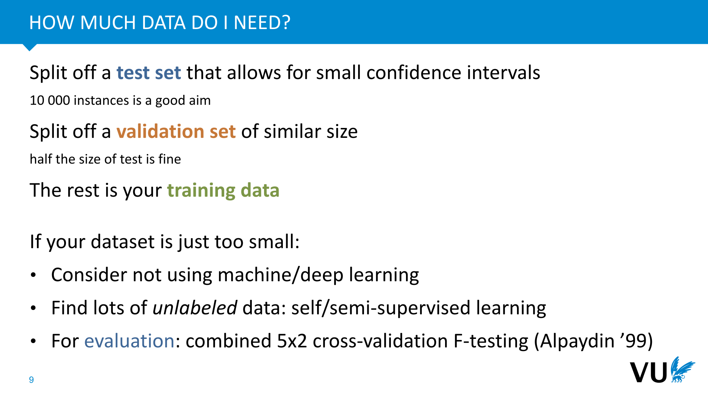

            <figcaption>
            
Sometimes your dataset comes with a canonical split. If it doesn't you'll need to make your own split.  

For your final training run, you are allowed to train on both your training data and your validation data.

            </figcaption>
       </section>

       <section id="slide-010">
            <a class="slide-link" href="https://dlvu.github.io/tools#slide-010" title="Link to this slide.">link here</a>
            

            <figcaption>
            
Just to reiterate: this is a really important principle. We can’t go deeply into why this is so important, your bachelor ML course should have covered this*, but just remember this as a rule.  

This is something that goes wrong a lot in common practice, and the tragic thing is that it’s a mistake you cannot undo. Once you’ve developed your model and chosen your hyperparameters based on the performance on the test set, the only thing you can do is fess up in your report. 

The safest thing to do is to split the data into different files and simply not look at the test file in any way. 

* For a refresher, watch <a href="https://youtu.be/hHLDDJJl2v4"><strong>https://youtu.be/hHLDDJJl2v4</strong></a> 

            </figcaption>
       </section>

       <section id="slide-011">
            <a class="slide-link" href="https://dlvu.github.io/tools#slide-011" title="Link to this slide.">link here</a>
            

            <figcaption>
            
When you accidentally use information from your test (or validation) set in a way that the model normally shouldn't have access to, this is called a <strong>test set leak</strong>. This is very common, and a deep learning practitioner should be on the look out for mistakes like these. 

For instance, if you're doing <strong>spam detection</strong> (classification of emails into ham/spam), you may shuffle your emails before making the train/val/test split, instead of keeping them sorted by date. Now imagine that at some time T, a particular account starts sending spam emails that always have the same subject. If these emails are in your training data, the classifier will score all of them perfectly in the test data. But that doesn't mean that if this system had been deployed, it would have caught the first email with this subject. A fairer test is to keep the emails ordered by time stamp before splitting. Then, if the first email from this spammer is after the split, the task of recognizing this as spam is much more challenging. 

Another example is<strong> link prediction</strong>. No need to worry about the details yet: just take my word for it that this is a common task on graphs. You are given a partial graph with relational links like these, and the task is to predict which links not included might also be true. To test a model, we withhold some of the true links. and see if the model predicts them. Some of these graphs contain inverse links for every relation: like a "child_of" link for every "parent_of" relation or a "works_for" for every "employed_by". If we split randomly, then often one of these will be in the test set and the other in the training set, and the prediction task will be really easy. Here, we need to make sure that both links in such a pair either end up in the test set together or in the training set. 

And finally, a very common mistake is to <strong>preprocess your data before splitting</strong>. Let's say you compute the average of your data and subtract it from all instances in the dataset to make the data mean-centered. If you do this before you split the data, you are leaking information from your test set. If you do it properly (on only the training data, after splitting), then the average would be less accurate, so the slightly increased accuracy of the average is because you're using information from your test set. More importantly, when you use your test set, each instance is an<em> independent </em>measurement of the model performance, which you average. You can't use an aggregate statistic over your whole test set as part of your preprocessing. Instead, you should use the average over your training set, and use that to preprocess your test data. 

There’s no fool-proof recipe for avoiding leakage and other mistakes like these. This is one of those problems you have to train yourself to recognize, and be continually on the lookout for.

            </figcaption>
       </section>

       <section id="slide-012">
            <a class="slide-link" href="https://dlvu.github.io/tools#slide-012" title="Link to this slide.">link here</a>
            

            <figcaption>
            
Just to show you that this happens to all of us, here is a snippet from the paper for the GPT-3 model, a famous large language model trained by OpenAI. Due to a bug in their data collection code, some of the data they intended to use to evaluate the model ended up in in their training set.  

Since the model itself cost about $10M to train and they only found out about the bug after training, they were stuck with the mistake and had to correct for it afterwards as best they could. 
<aside    >source: “Language Models are Few-Shot Learners” Brown et al 2020. </aside><aside    ></aside>
            </figcaption>
       </section>

       <section id="slide-013">
            <a class="slide-link" href="https://dlvu.github.io/tools#slide-013" title="Link to this slide.">link here</a>
            

            <figcaption>
            
Next up, debugging. After you build a model, you are bound to have some bugs. Deep learning models are hard to debug, so it's good to know a few tricks.

            </figcaption>
       </section>

       <section id="slide-014">
            <a class="slide-link" href="https://dlvu.github.io/tools#slide-014" title="Link to this slide.">link here</a>
            

            <figcaption>
            
In normal programming, if your language supports type checking, then a lot of the mistakes you make will be noticed at compile time. That is, before you even run the program. This is the best time to spot a bug. You know immediately that somethings gone wrong, and usually you get a very accurate pointer to where you made the mistake.  

In deep learning, things are more hairy. Python doesn't have type checking, but even if it did, almost every object in our program is usually a tensor. Type information doesn't help us here. If our program fails, it'll usually be at runtime. If we're lucky we will at least get a pointer to where we made the mistake, but if we are using lazy execution, or the mistake happens in the backward pass, then the failure happens at a different point in the program to where we made the mistake. 

Even worse, if all your tensor shapes broadcast together (more on this later), your neural network may fail without telling you. You’ll have to infer from your loss becoming NaN or Inf that something is wrong. Maybe your loss stays real-valued, but it simply doesn’t go down. In this case you have to decide whether your neural network is |(a) correctly implemented, but not learning (b) has a bug that yo haven’t spotted yet. 

Finally, sometimes neural networks may not even fail at all, despite the fact that you’ve made a mistake. You may see the loss converge and the network train despite the fact you’ve not implemented the model you thought you'd implemented.  

In short, deep learning programming is by nature more treacherous than regular programming, so it pays to be extra vigilant. The main way to learn this is to suffer through it a few times, but we'll try to minimize the amount you have to suffer by flagging up a couple of common mistakes and by giving a few useful tricks.

            </figcaption>
       </section>

       <section id="slide-015">
            <a class="slide-link" href="https://dlvu.github.io/tools#slide-015" title="Link to this slide.">link here</a>
            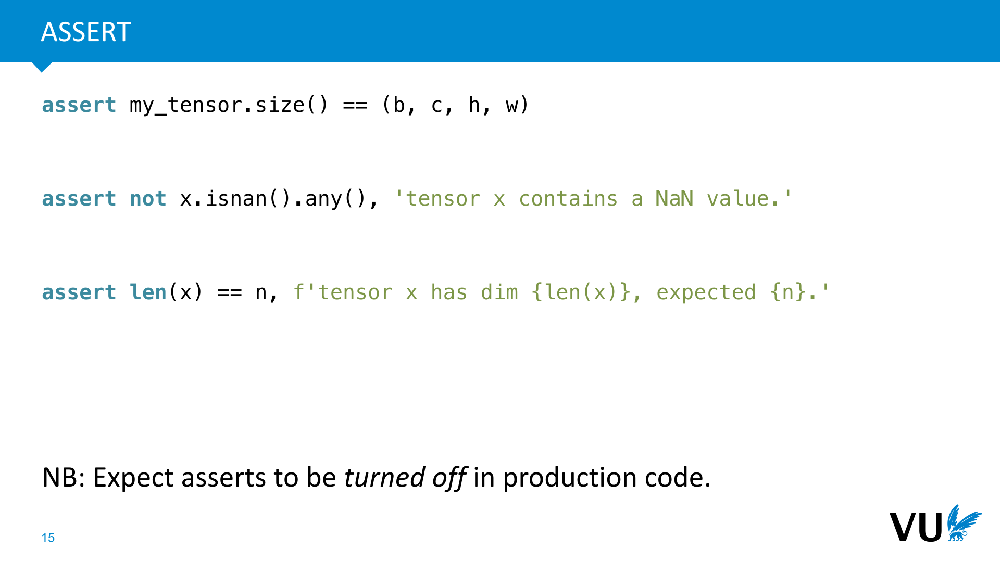

            <figcaption>
            
The simplest way to stop a program from failing silently is to check whether the program is in the state you think it’s in, and to <strong>force it to fail</strong> if it isn’t 

This is what the <strong>assert</strong> statement is for. It checks a condition and raises an exception if the condition is false. It may seem counterintuitive to make your own code fail, but a program that fails fast, <em>at the point where the mistake happens</em>, can save you days worth of debugging time. 

In deep learning you will commonly add asserts for the dimensions of a particular tensor, or to check that a tensor contains no NaN or infinity values.  

These are asserts in python, but the keyword exists in most languages. In python,the second (optional) argument is a string that is shown as a part of the error message when the assert fails. Using an f-string here allows you to add some helpful information. 

Don’t worry about the assert condition being expensive to compute. It’s easy to run python in a way that the asserts are skipped (once you’re convinced there are no bugs). This does mean that you should only use asserts for things you expect to be<strong> turned off in production</strong>. So don’t use them for, for instance, for validating user input. 

            </figcaption>
       </section>

       <section id="slide-016" class="anim">
            <a class="slide-link" href="https://dlvu.github.io/tools#slide-016" title="Link to this slide.">link here</a>
            

            <figcaption>
            
<strong>Broadcasting</strong> is a mechanism that allows you to apply element-wise operations to tensors of different shapes.  

It’s very helpful for smoothly implementing things like scalar-by-matrix multiplication in an intuitive manner. It’s also one of the more treacherous mechanisms in numpy and pytorch, because it’s very easy to make mistakes if you don’t fully understand it. 

Here's an example of how it might go wrong. We have two tensors both representing vectors with 16 elements each. The first has shape (16,) and the second has shape (16, 1). Element-wise multiplying these, we might expect to get another tensor with 16 values with shape either (16, ) or (16, 1). 

What actually happens is that we get a matrix of 16 x 16. The (16, ) vector is given an extra dimension to make the two match, and that extra dimension is added on the left. We now have a (16, 1) matrix and a (1, 16) matrix. Next, the singleton dimensions are expanded (the values repeated) to give us two (16, 16) matrices which are element-wise multiplied. 

In short, don't expect broadcasting to always behave the way you expect. Know the exact rules for the mechanism, and be careful when you use it. 

 

 

 

            </figcaption>
            click image for animation
       </section>

       <section id="slide-017" class="anim">
            <a class="slide-link" href="https://dlvu.github.io/tools#slide-017" title="Link to this slide.">link here</a>
            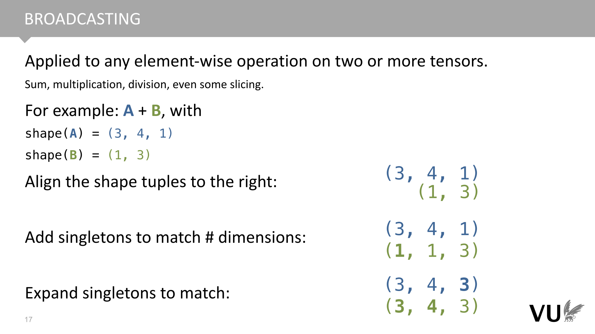

            <figcaption>
            
These are the rules of the broadcasting algorithm: the shapes are aligned on the right, extra singleton dimensions are added to make them match, and the singleton dimensions are expanded so that the shapes match. Once the shapes match, the element-wise operation is applied. 

Here is the complete documentation: <a href="https://numpy.org/doc/stable/user/basics.broadcasting.html"><strong>https://numpy.org/doc/stable/user/basics.broadcasting.html</strong></a> In pytorch, broadcasting works the same as it does in numpy. 

The alignment step is the dangerous one. Here, two dimensions often get aligned with each other that you did not expect to be matched. 

 

            </figcaption>
            click image for animation
       </section>

       <section id="slide-018">
            <a class="slide-link" href="https://dlvu.github.io/tools#slide-018" title="Link to this slide.">link here</a>
            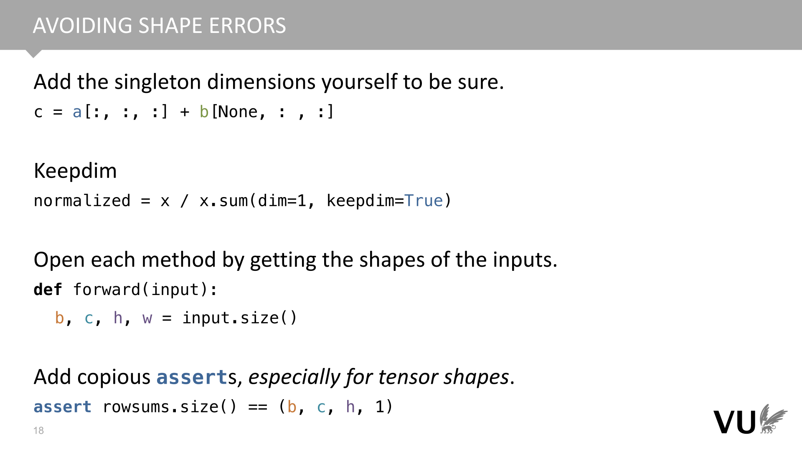

            <figcaption>
            
One of the best ways to ensure that broadcasting works as expected is to manually add the singleton dimensions, so that both tensors have the same number of dimensions and you know how they will be aligned.  

The None inside a slice adds a singleton dimension. Note that in the first example, “a[:, :, :]” is the same as just “a”. However, this notation communicates to the reader what is happening. 

Methods that eliminate a dimension (like summing out a dimension, or taking the maximum) come with a keepdim argument in pytorch (keepdims in numpy). If you set this to True, the eliminated dimension remains as a singleton dimension, which ensures that broadcasting will behave reliably. 

Opening a function with a line like the third one helps to make your code more readable: it tells the reader the dimensionality of the input tensor, and gives them four explicit shape variables to keep track of. These shape variables can then be used to easily assert stuff 

 

            </figcaption>
       </section>

       <section id="slide-019" class="anim">
            <a class="slide-link" href="https://dlvu.github.io/tools#slide-019" title="Link to this slide.">link here</a>
            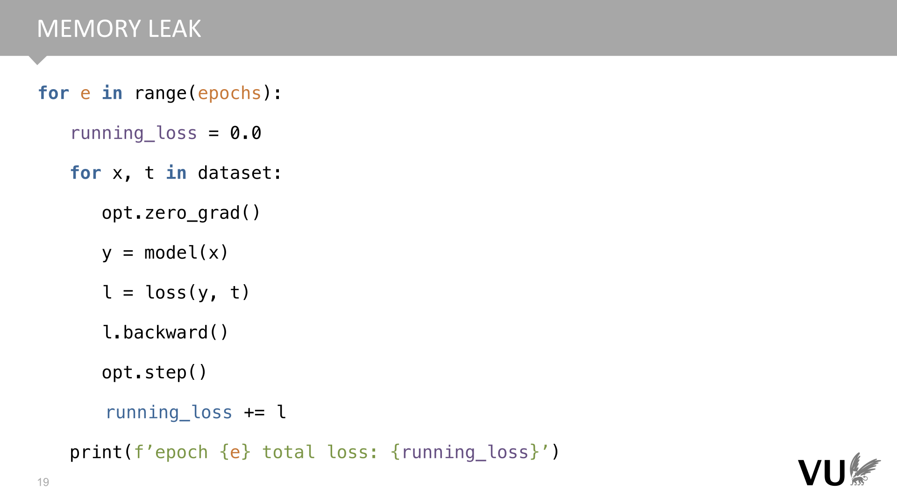

            <figcaption>
            
Here's another common mistake to be aware of: memory leaks from pointers to the computation graph. This one only happens in eager execution systems. 

Remember that in eager execution, the computation graph is cleared and rebuilt for every forward pass. Usually, this clearing is done behind the scenes by the garbage collector. Once python sees that there are no references in the running code to any part of the graph, it will collect and delete the whole thing from memory. 

This means that if you accidentally do have some variable that is active outside the training loop which references a node in the computation graph, the graph doesn't get cleared. Instead, you end up adding nodes to the same computation graph for every pass, constructing a massive graph until your memory runs out. 

A common way this happens is if you keep a running loss as shown in the code. The line running_loss += l looks harmless, but remember what pytorch is doing under water. It's not just computing values, it's also adding nodes to the computation graph. Since running_loss is referenced outside the training loop, the graph never gets cleared, and just grows and grows. 

If your memory use balloons over several iterations (instead of returning to near 0 after each batch), this is probably what is happening. Check for any variables that exist outside the training loop which might be nodes in the computation graph.

            </figcaption>
            click image for animation
       </section>

       <section id="slide-020">
            <a class="slide-link" href="https://dlvu.github.io/tools#slide-020" title="Link to this slide.">link here</a>
            

            <figcaption>
            
In pytorch, the solution is to call .item(). This function works on any <em>scalar</em> tensor, and returns a simple float value of its data, unconnected to the computation graph. 

In other situations you may be better served by the .detach() function, which creates a copy of your tensor node, detached from the current computation graph, and .data, which gives a view of the data as a basic tensor. 
<aside    >In modern pytorch, every tensor is always a computation graph node, so .detach() and .data do pretty much the same thing. The difference is a holdover from earlier versions, when Tensors needed to be turned into a computation graph node by wrapping them in a Variable object.</aside><aside    ></aside>
            </figcaption>
       </section>

       <section id="slide-021">
            <a class="slide-link" href="https://dlvu.github.io/tools#slide-021" title="Link to this slide.">link here</a>
            

            <figcaption>
            
One of the most common problems is a loss that becomes NaN. This just means that some value somewhere in your network has become either NaN or infinite. Once that happens, everything else quickly fails as well, and everything in your network becomes NaN. To emphasize: this is not usually a problem with the loss, it's just that the loss is usually where you first notice it. 

One of the causes of NaN loss is that your learning rate is too high. To eliminate this problem, try a run with a learning rate of 0.0 and 1e-12. If these are also NaN it's just a bug. If not, there are two options: (a) it's a bug that shows only for some parameters (b) your network works fine so long as you keep the learning rate reasonable.  

To localize where the values of your forward pass first go wrong, you can add these kinds of asserts. Note that these operations are linear in the size of the tensor, so they have a non-negligable impact on performance. However, you can always turn off the asserts when you're sure the code is free of bugs (just run python with the -O flag) 

            </figcaption>
       </section>

       <section id="slide-022">
            <a class="slide-link" href="https://dlvu.github.io/tools#slide-022" title="Link to this slide.">link here</a>
            

            <figcaption>
            
Next, you may find yourself with a network that runs without errors or NaN values, but that doesn't learn: the loss stays exactly or approximately the same. 

The first thing to do is to try a few learning rates. Learning only happens for a relatively narrow band of learning rates, and the values changes from one setting to the next. If the problem happens for all learning rates, it's probably bug. The place to start then is<strong> to check what gradients pytorch is computing</strong>.  

Pytorch does not hold on to gradients it doesn’t need, by default. For debugging purposes, you can add a retain_grad() in the forward pass to a tensor. The gradient is then retained, and after the backward pass, you can print the gradient tensor (or some statistics). 

If the gradient is None, then the backpropagation algorithm never reached it. This can happen if your computation graph is somehow disconnected (perhaps you used a non-differentiable operation somewhere). If the gradient has a value, but it's 0.0, then backpropagation reached the node, but the gradient died out. This can happen, for instance if you have ReLU activations somewhere with all inputs always negative, or a sigmoid activation with very large negative or positive inputs.

            </figcaption>
       </section>

       <section id="slide-023">
            <a class="slide-link" href="https://dlvu.github.io/tools#slide-023" title="Link to this slide.">link here</a>
            

            <figcaption>
            
Once you're pretty sure you have a model that is doing something reasonable, you need to start tuning it, to see how much you can boost the performance.

            </figcaption>
       </section>

       <section id="slide-024">
            <a class="slide-link" href="https://dlvu.github.io/tools#slide-024" title="Link to this slide.">link here</a>
            

            <figcaption>
            
If you are designing a new network or architecture, or otherwise trying something new that may or may not work, <strong>don’t just implement your idea right away</strong>. There’s a vanishing chance that it’ll work out of the gate, and you’ll be stuck with a complicated mess that doesn’t work either because you have a bug somewhere, <em>or</em> because your idea doesn’t work. <strong>You’ll be stuck looking for a bug that you are not sure is even there</strong>, which is an almost impossible task. 

Instead, start with a model that you know <em>has</em> to work, and for which you know <em>why</em> it must work. Either make the model simpler or make the data simpler: 

Start with synthetic data that makes the learning problem trivial to solve. Slowly scale up to more realistic data. 

Start with a competing model for which the performance has been reported. Replicate the performance, and then transform this model into yours step by step. 

Divide and conquer. If your model consists of separate features, implement them one by one., and check the performance impact of each. If it doesn’t think hard about how you can break things up. 

The main requirement for a successful deep learning project is not a good idea: it’s a <strong>good plan</strong> consisting of small and careful increments. 

A<strong> baseline</strong> is simply another model that you compare against. This can be a competing model for the same task, but also a stupidly simple model that helps you calibrate what a particular performance means. Baselines help you to interpret your results, but they are also incredibly helpful during development. For instance, if you start with a baseline, and you slowly turn it into the model you had in mind, then at each step you can always check if the performance drops to tell you whether you have a bug.

            </figcaption>
       </section>

       <section id="slide-025">
            <a class="slide-link" href="https://dlvu.github.io/tools#slide-025" title="Link to this slide.">link here</a>
            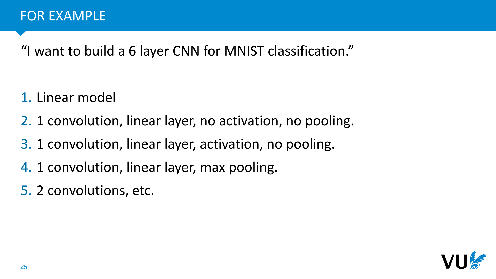

            <figcaption>
            
Here’s an example. To build up to a 6 layer CNN, you might start slowly with a simple linear model (a one-layer NN). This will give you a baseline. 

The next step is to introduce a stride-1 convolution before the linear layer. As you know, this doesn't change the expressivity of the network, but it allows you to check if the performance degrades. We know that this model is capable of performing the same as the linear model, so if performance drops, we know that there is either a bug or something is wrong with the gradient descent or initialization. 

Then, we can introduce an activation. We know that activations don’t usually hurt performance, but they might. If we can’t get the network with activation to perform better than or as well as the previous network (even after much tuning of hyperparameters), we should try a different activation. 

Then, we can introduce some pooling. This strictly reduces the size of the linear layer so it may hurt performance (we may make up this decrease by adding more convolutions). At this point, we’re pretty sure that the rest of our code is sound, so if the performance drops, we know what the cause is. 

This kind of approach may not always be necessary. On well-covered ground like CNNs, you can probably start with a more complex model right away and expect it to work. But that's only because somebody else has done this work before us. We know it has to work because many other people have got it to work before us. If we struggle, we can always take one of their versions, and eliminate the differences one by one. 

Whenever you are breaking new ground, and building things from scratch, you need to start with a simple model and build up the complexity step by step.

            </figcaption>
       </section>

       <section id="slide-026">
            <a class="slide-link" href="https://dlvu.github.io/tools#slide-026" title="Link to this slide.">link here</a>
            

            <figcaption>
            
The main principle behind scaling up slowly is that you need to have a sound reasoning for why the code you are about to run will work. If you don’t, and the code doesn’t work, you can’t tell whether it’s because of a bug somewhere, or because the ideas behind the code are simply not sound. 

One of the best things you can do in building neural networks is to make sure that you know exactly what should happen when you execute your code. Inevitably, that then won’t happen (we’re programming after all), but then at least you can be sure that something is wrong with the code and not with your idea.

            </figcaption>
       </section>

       <section id="slide-027">
            <a class="slide-link" href="https://dlvu.github.io/tools#slide-027" title="Link to this slide.">link here</a>
            

            <figcaption>
            
Your learning rate is <em>very dependent</em> on the batch size. You can tune both together, but generally, the bigger the batch size, the faster your training, so people tend to go for the largest batch size that will fit in memory and tune with that. There is some evidence that smaller batches often work better, but then you can train longer with a larger batch size, so the trade-off depends on the model. 

If you're running large experiments, it can be good to measure throughput instead. This is the amount of data (eg. the number of characters) that your models sees per second. Often, GPUs work a lot faster if their memory isn't entirely full, so the batch size that will give you optimal throughput is the one that fills you memory to something like 80%. 

            </figcaption>
       </section>

       <section id="slide-028" class="anim">
            <a class="slide-link" href="https://dlvu.github.io/tools#slide-028" title="Link to this slide.">link here</a>
            

            <figcaption>
            
The simplest way to find a reasonable learning rate is to take a small number of logarithmically spaced values, do a short training run with each, and plot their loss per batch (after each forward pass, you plot the loss for that batch).  

This is usually a noisy curve (especially if your batch size is small), so you’ll need to apply some smoothing to see what’s going on.  

In this case, 0.1 is clearly too high. The loss bounces around, but never drops below a certain line. 0.03 seems to give us a nice quick drop, but we see that in the long run 0.01 and 0.003 drop below the orange line. 0.001 is too low: it converges very slowly, and never seems to make it into the region that 0.01 is in. 

Note that the difference between the lower learning rates seems small, but these differences are not insignificant. Small improvements late in the process tend to correspond to much more meaningful learning than the big changes early on. It can be helpful to plot the vertical axis in a logarithmic scale to emphasize this. 

Some popular toosl for automatically tracking your loss this way are 

Tensorboard (which originated with tensorflow, but now works with both tensorflow and pytorch). This is a tool that runs on your own machien 

Weights and biases. This is a cloud-based tool. It uploads your losses to a server, and provides an online dashboard.

            </figcaption>
            click image for animation
       </section>

       <section id="slide-029">
            <a class="slide-link" href="https://dlvu.github.io/tools#slide-029" title="Link to this slide.">link here</a>
            

            <figcaption>
            
Another helpful thing to plot is the <strong>gradient norm</strong> (basically an indicator of the size of step you’re taking). Just arrange all your parameters into a vector and compute its length. 

If the variance of your gradients goes to zero, you're probably getting stuck in a local minimum. If the variance is very large, your model is probably bouncing over areas of low loss. The middle curve shows a happy medium: high enough to move around, but not so high that it will miss important minima in the loss surface. 
<aside    >I the loss becomes NaN at any point, you will often see the gradient norm growing out of bounds just before. In that case gradient clipping, explained later, is a good way to solve the problem.</aside><aside    ></aside>
            </figcaption>
       </section>

       <section id="slide-030">
            <a class="slide-link" href="https://dlvu.github.io/tools#slide-030" title="Link to this slide.">link here</a>
            

            <figcaption>
            
Here's what that might look like on a 2D loss surface (bright spots are the minima). If we have high variance at the start, gradient descent bounces over the minima. If we have high variance at the end, it has settled in the "bowl" of a minimum, but it's bouncing from side to side without ever settling in the middle. 

If we have low variance throughout, the process is finding a minimum, but it takes ages, and it converges to the first minimum it finds.

            </figcaption>
       </section>

       <section id="slide-031">
            <a class="slide-link" href="https://dlvu.github.io/tools#slide-031" title="Link to this slide.">link here</a>
            

            <figcaption>
            
One trick that can help speed things up a little is to change the learning rate as learning progresses. 

There are many schedules possible, and the precise differences aren't that important. The main tricks that are often tried are: 

Warming up at the start of training: starting at 0 and slowly increasing the learning rate. This is particularly useful with optimizers like Adam (which we'll discuss later) which gather secondary statistics about the gradients. It ensures that gradient descent doesn't make any big steps until these statistics are accurate estimates. 

Cooling down towards the end of learning (lowering the learning rate again). This can help with the problem where gradient descent is in an optimum, but bouncing from side to side instead of finding the minimum (this is known as oscillation). Momentum-based optimizers should recognize and dampen oscillations automatically, but sometimes a cooldown on the learning rate helps the process along. 

In general, you should try learning without a schedule first, and look at your loss curves and gradient norms to see if you think a learning rate schedule might help. If you do need a schedule, simple is best. A little warmup is often all you need.

            </figcaption>
       </section>

       <section id="slide-032">
            <a class="slide-link" href="https://dlvu.github.io/tools#slide-032" title="Link to this slide.">link here</a>
            

            <figcaption>
            
One popular trick to get a feel for a good learning rate is to do a <em>range test</em>. This is a single training run, where you ramp up the learning rate by small, but exponentially increasing steps <em>each batch</em>. It will give you a plot like this. The point where the accuracy peaks is a good estimate of your maximum learning rate. You can then warm up to this learning rate slowly (and possibly cool back down again).

            </figcaption>
       </section>

       <section id="slide-033">
            <a class="slide-link" href="https://dlvu.github.io/tools#slide-033" title="Link to this slide.">link here</a>
            

            <figcaption>
            
With a decent learning rate chosen, we can train for longer runs. At this point, a different kind of loss curve becomes important. For a smaller number of times during your training run (usually once per epoch), you should test your model on the whole validation set and on the whole training set.* You can then plot the average loss or accuracy (or any other metric) for both datasets. 

What we see here is that if we look at just the training accuracy, we might be confident of getting almost 99% of our instances correct. Unfortunately, the validation accuracy is much lower at around 96%. Some parts of our performance are due to <em>overfitting</em>, and will not<strong> generalize</strong> to unseen data. For this reason the difference between the performance on the training and validation data is called the <strong>generalization gap</strong>. 

* People often use the running loss averaged over the preceding epoch in place of this, but it's more accurate to rerun the model on the whole training data. This is because the running loss is an average taken as the model changes. If you want to know the training loss for the precise model at the end of the epoch, you need to do a full pass over the training data as well as over the validation data.

            </figcaption>
       </section>

       <section id="slide-034">
            <a class="slide-link" href="https://dlvu.github.io/tools#slide-034" title="Link to this slide.">link here</a>
            

            <figcaption>
            
In general, a high learning rate is preferable to a low one, so long as you can keep the learning stable. These are some tricks to help learning stabilize, so that you can use higher learning rates, and train faster. 

A learning rate warmup is a slow, linear increase in the learning rate, usually in the first few epochs. This can usually help a lot to stabilize learning. A cooldown at the end of learning can also help, but is less common. 

Momentum and batch normalization can also help a lot. We will discuss these techniques later.

            </figcaption>
       </section>

       <section id="slide-035">
            <a class="slide-link" href="https://dlvu.github.io/tools#slide-035" title="Link to this slide.">link here</a>
            

            <figcaption>
            
Remember however, that using too many tricks can hurt your <em>message</em>. People are much less likely to trust the performance of a model that seems to require very specific hyperparameters to perform well. If your model only performs with a specific learning rate of 0.004857, a five stage learning rate schedule, and a very particular early-stopping strategy, then it’s unlikely that that model performance will be robust enough to translate to another dataset or domain (at least, not without a huge effort in re-tuning the hyperparameters).  

Your performance is also unlikely to transfer from validation to test, and your audience may be skeptical that you chose such particular hyperparameters without occasionally sneaking a look at your test set. 

However, if you report performance for a simple learning rate of 0.0001, with no early stopping, gradient clipping, or any other tricks, it’s much more likely that your performance is <em>robust</em>.  

In other words, hyperparameter tuning is not simply about playing around until you get a certain performance. It’s about finding a <strong>tradeoff between simplicity and performance</strong>.

            </figcaption>
       </section>

       <section id="slide-036">
            <a class="slide-link" href="https://dlvu.github.io/tools#slide-036" title="Link to this slide.">link here</a>
            

            <figcaption>
            
What about the rest of our hyperparameters? We also need to figure out how many layers our network needs, how to preprocess the data, and how set things like regularization parameters (which we will discuss later). 

How should we proceed? Just try a bunch of settings that seem right and check our validation performance? Or should we follow some rigid strategy? 

In practice, when it comes to tuning your own model, simple trial and error is usually fine, so long as you check the performance only on the validation set. It also usually works <em>better</em> than automatic approaches, because you know best what your hyperparameters mean and what their impact may be. You can reason about them in a way that automatic methods can't. 

However, it is difficult to dispense the same amount of effort when you are trying to tune your baselines. If you want truly fair comparisons, <strong>automatic hyperparameter tuning</strong> might be a better approach.

            </figcaption>
       </section>

       <section id="slide-037">
            <a class="slide-link" href="https://dlvu.github.io/tools#slide-037" title="Link to this slide.">link here</a>
            

            <figcaption>
            
If you want to tune your hyperparameters in a more rigorous or automated fashion, one option is <strong>grid search</strong>. This simply means defining a set of possible values for each hyperparameter and trying every single option exhaustively (where the options form a <em>grid </em>of points in your hyperparameter space). 

This may seem like the best available options, but as this image shows, selecting hyperparameters randomly may lead to better results, because it gives you a larger range of values to try over different dimensions. If one parameter is important for the performance and another isn’t you end up testing more difference values for the important parameter. 

You should also think carefully about the <em>scale</em> of your hyperparameter. For many hyperparameters, the main performance boost comes not from the difference between 0.1 and 0.2 but from the difference between 0.01 and 0.1. In this case it’s best to test the hyperparameters in a <strong>logarithmic scale</strong>. The learning rate is an example of this.

            </figcaption>
       </section>

       <section id="slide-038">
            <a class="slide-link" href="https://dlvu.github.io/tools#slide-038" title="Link to this slide.">link here</a>
            

            <figcaption>
            
The practice of manual tuning is a large contributing factor to a small reproduction crisis in machine learning. A lot of results have been published over the years that turn out to disappear when the baselines and the models are given equal attention by an automatic hyperparameter tuning algorithm. 

There are a few potential reasons for this: 

<strong>Publication bias:</strong> some people get lucky and find some high performing parameters that generalize to the test set but not beyond that. 

<strong>Unrigorous experimentation:</strong> nobody checks how careful you are in your experiments. If some experimenters are careless about never using their test set, they may get better results than their more careful colleagues. The publication system will then select the more careless researchers. 

<strong>Regression towards the mean:</strong> Selecting good results and then retesting will always yield lower average scores. If we we take all students with a 9 or higher for some exam and retest them, they will probably score below 9 on average. This is because performance is always partly due to ability and partly due to luck.  

For now, the important message is that we should be mindful that when we compare hand-tuned models, there is room for error. We can’t afford to do full hyperparameter sweeps for every experiment we publish, so the best option is probably to keep hand-tuning and occasionally publish a big replication study were all current models are pitted against each other in a large automated search. 

<a href="https://www.sciencemag.org/news/2020/05/eye-catching-advances-some-ai-fields-are-not-real"><strong>https://www.sciencemag.org/news/2020/05/eye-catching-advances-some-ai-fields-are-not-real</strong></a> 

            </figcaption>
       </section>

       <section id="slide-039">
            <a class="slide-link" href="https://dlvu.github.io/tools#slide-039" title="Link to this slide.">link here</a>
            

            <figcaption>
            
Here are some examples of papers that do this kind of automatic turning. One popular approach is to use a random layout for the discrete parameters, but to use something called <strong>Sobol sequences</strong> to make the sampled points a little more regular, and to then tune the continuous hyperparameters using Bayesian search. 

Ax.dev is one popular platform for such experiments (but beware, they require <em>a lot</em> of compute). 

            </figcaption>
       </section>

       <section id="slide-040">
            <a class="slide-link" href="https://dlvu.github.io/tools#slide-040" title="Link to this slide.">link here</a>
            

            <figcaption>
            
The last stage of our pipeline is to deploy our model. Either we turn it into a production model powering our software product, or we write a research paper about our findings.

            </figcaption>
       </section>

       <section id="slide-041">
            <a class="slide-link" href="https://dlvu.github.io/tools#slide-041" title="Link to this slide.">link here</a>
            

            <figcaption>
            
Since the final model is usually a combination of many different innovations, it’s good to figure out which of these is the most important for the performance. 

The most common way to do this is an <strong>ablation study</strong>: you first pick the best model with all the bells and whistles, and then remove features one by one to evaluate the impact.  

There’s no standard way to design an ablation. The main principle is that you pick a full-featured model<em> first</em>, because the features likely need to interact with each other to improve the performance, and then you measure their performance.

            </figcaption>
       </section>

       <section id="slide-042">
            <a class="slide-link" href="https://dlvu.github.io/tools#slide-042" title="Link to this slide.">link here</a>
            

            <figcaption>
            
Finally, even if you have a cheap model that perfectly predicts what you want it to predict, when you put it into production you will be using that model to <strong>take actions</strong>. This means that its predictions will no longer be purely offline, as they were in the training setting. For instance, if you recommend particular items to your users, you are driving the whole system of all your users engaging with your website towards a particular mode of behavior. Your model was only trained to predict certain targets on data where the model itself was not active. In short, you have no idea where the model will drive the interactions between your users and your website.

            </figcaption>
       </section>

       <section id="slide-043">
            <a class="slide-link" href="https://dlvu.github.io/tools#slide-043" title="Link to this slide.">link here</a>
            

            <figcaption>
            

            </figcaption>
       </section>

       <section id="slide-044">
            <a class="slide-link" href="https://dlvu.github.io/tools#slide-044" title="Link to this slide.">link here</a>
            

            <figcaption>
            

            </figcaption>
       </section>

       <section class="video" id="video-044">
           <a class="slide-link" href="https://dlvu.github.io/tools#video-44">link here</a>
           <iframe
                src="https://www.youtube.com/embed/ixI83iX7TV4?si=UBGkKtXkeHMioFPi"
                title="YouTube video player"
                frameborder="0" allow="accelerometer; autoplay; clipboard-write; encrypted-media; gyroscope; picture-in-picture"
                allowfullscreen>
           </iframe>

       </section>

       <section id="slide-045">
            <a class="slide-link" href="https://dlvu.github.io/tools#slide-045" title="Link to this slide.">link here</a>
            

            <figcaption>
            
 

            </figcaption>
       </section>

       <section id="slide-046">
            <a class="slide-link" href="https://dlvu.github.io/tools#slide-046" title="Link to this slide.">link here</a>
            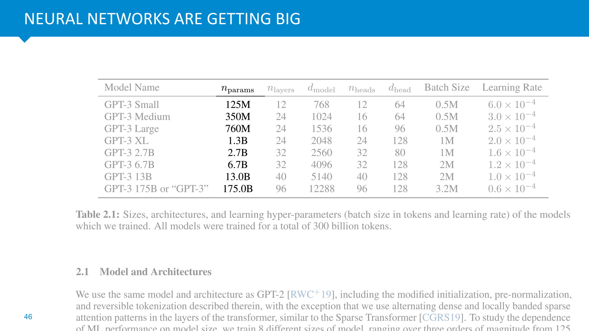

            <figcaption>
            
These are the sizes of some versions of GPT-3: a large language model trained by OpenAI. The largest has 175 billion parameters.  

This model was trained by nothing more than gradient descent and backpropagation. It’s worth pausing to think about that. Imagine if everybody on earth had 20 opinions that you could each individually sway one way or the other, and you wanted to sway each and every one of them in order to make one UN resolution pass. Succesfully applying gradient descent on a model of this size is like trying to reason backwards from the outcome of the UN vote through the organizational structure of the UN, the governments of the members states, the determination of their makeup by elections down to every individual on earth and how their opinions go into influencing their government. 

We don’t quite have the full picture for how it is possible that such a simple algorithm as gradient descent achieves this, but we are beginning to gather up some of the ingredients. 

<em>Language Models are Few-Shot Learners</em>, Brown et al, 2020. <a href="https://arxiv.org/abs/2005.14165"><strong>https://arxiv.org/abs/2005.14165</strong></a> 

            </figcaption>
       </section>

       <section id="slide-047">
            <a class="slide-link" href="https://dlvu.github.io/tools#slide-047" title="Link to this slide.">link here</a>
            

            <figcaption>
            
At the start of the deep learning revolution, most researchers were not immediately struck by how odd it was that we can train neural networks with millions of parameters. We were pleasantly surprised, of course, but the main focus was on simply seeing how far this method could be pushed. 

The first clear signal of just how odd this breakthrough was, came from a very simple experiment, performed by Zhang et al. They took a simple convolutional neural network, trained it on MNIST, and then they repeated the experiments with the dataset randomized. They did this in several ways: randomizing the labels, replacing the images with gaussian noise, etc. But in each case, they made it <em>impossible</em> to predict from the image what the label could be, while still keeping the possibility of <em>remembering</em> the label for a given image. 

Of course, the validation loss plummeted to chance level: anything that could be used to predict the label was removed. However, the training loss still went to zero.<strong> The model learned to predict the training data perfectly.</strong> Better than it did when the task wan't randomized.<strong> </strong>

Why is this so strange? Note that during training, we only have access to the training loss. Gradient descent can then choose between two possible models: a generalizing solution that it chooses on normal data, and an overfitting solution that it chooses if we randomize the labels. <strong>And the second solution has lower loss.</strong> Why doesn’t the model choose this solution all the time, even on normal data? Why does it end up with the (from its perspective) worse solution which generalizes well, instead of the perfect solution that doesn’t generalize at all? How does it know? 

(By <em>generalizing</em>, we mean not just fitting the training data well, but the validation and test data also.)

            </figcaption>
       </section>

       <section id="slide-048">
            <a class="slide-link" href="https://dlvu.github.io/tools#slide-048" title="Link to this slide.">link here</a>
            

            <figcaption>
            
Here's a cartoon image of the loss landscape. What the Zhang experiment shows, among other things, is that when it comes to models with a large capacity to remember stuff, <strong>we are not actually looking for the global minimum</strong>. The global minimum is an overfitting solution that just remembers the training data. The good solutions that also do well on the test and validation data are good local optima (among all the bad local optima). 

Somehow gradient descent is more likely to land in a good local optimum than a bad local optimum, or an overfitting local optimum.

            </figcaption>
       </section>

       <section id="slide-049">
            <a class="slide-link" href="https://dlvu.github.io/tools#slide-049" title="Link to this slide.">link here</a>
            

            <figcaption>
            
So, next time you see a formula like this, to explain the basic optimization task of ML, you should know that this is a slightly poor definition of our problem. We want to solve this optimization problem, and we use techniques from optimization to do so. But in a way, we don’t want to solve it <em>too </em>well.  

In the classical machine learning view, we would keep to this optimization objective, and solve it perfectly, but we would then <em>cripple </em>the model class so that the overfitting models were no longer in the model space. In deep learning we expand the model class far beyond the overfitting models. At this point, the only optimization algorithms we have available will only be able to reach a certain part of this space. If we’re lucky, these parts contain the generalizing local optima and the overfitting global optima are pushed out of the range of the optimization algorithm. 

In short, modern machine learning is often the strange business of letting an optimization algorithm loose on a problem like this, but then crippling it, implicitly or explicitly, so that it doesn’t find the very best solution, because that wouldn’t lead to generalization. 

            </figcaption>
       </section>

       <section id="slide-050" class="anim">
            <a class="slide-link" href="https://dlvu.github.io/tools#slide-050" title="Link to this slide.">link here</a>
            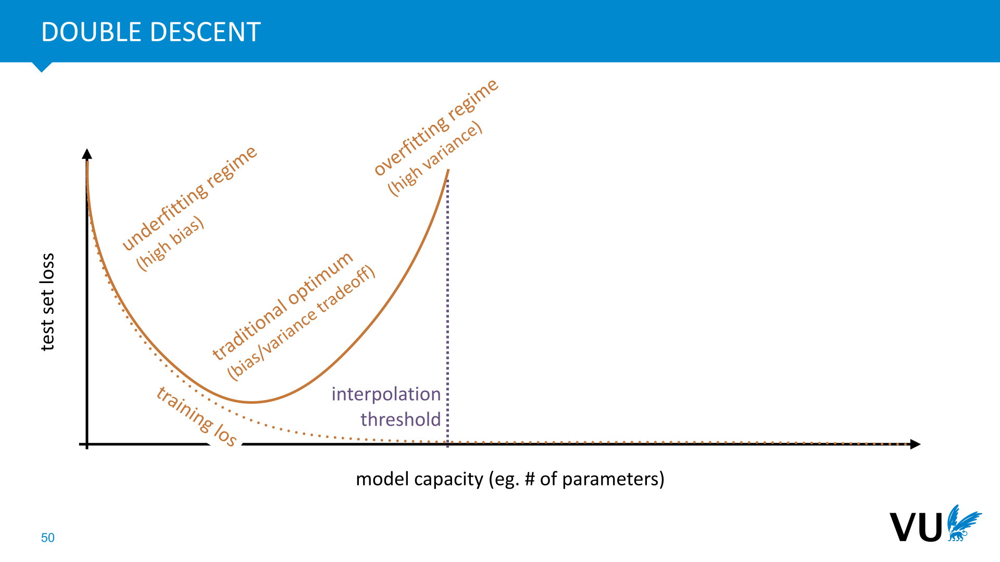

            <figcaption>
            
The traditional view of machine learning has always been that the aim was to find the sweet spot between underfitting and overfitting. An underfitting model is too simple to capture all the relations between the input and the output. For instance, if we try to fit a parabola with a line, we get errors due to underfitting. 

If we give our model too much capacity, it can overfit: it can remember all the features of the training set that won’t be reproduced in the test set. The model starts latching on to noise that isn’t relevant for the task: it starts to overfit. Underfitting is called high bias, because the mistakes are the same for every training run. Overfitting is called high variance, because the mistakes average out over multiple training runs, assuming we get fresh data each time. Because we only have one dataset, however, this doesn’t help us much. 

The point at which the model capacity is large enough to fully remember the dataset (or at least enough of it to remember all the labelings perfectly), is called the interpolation threshold. This is the point beyond which the model should always perfectly overfit without any generalization. That is, assuming that the model search find a global optimum.  

The traditional solution was always to find the best tradeoff between these two extremes of model capacity. We cripple our model just enough that it finds the generalizing solutions because the overfitting solutions are simply not there in the parameter space. 

“Double descent” refers to the surprising finding (due to experiments like those of Zhang) that there is life beyond the interpolation threshold. If we push on beyond the regime where we can just about remember the data, into the regime where the capacity is vastly greater than that required to remember the data, we see that some model classes start to naturally prefer generalizing solutions over non-generalizing solutions.

            </figcaption>
            click image for animation
       </section>

       <section id="slide-051">
            <a class="slide-link" href="https://dlvu.github.io/tools#slide-051" title="Link to this slide.">link here</a>
            

            <figcaption>
            
Here is what such curves actually look like for deep convolutional networks. Note on the left that the training loss goes to zero as the model capacity grows, due to overfitting. The test error first goes up as we approach the interpolation threshold, showing that the model is just overfitting, but then goes down again as we go far enough past the interpolation threshold. 

On the right, we see the effect of training time. If we don't let gradient descent search too far into the model space, we are essentially crippling its ability to overfit to highly specific solutions. Only when we let it search far enough to overfit, do we see a double descent emerge. In between, there is a sweet spot where the test error decays monotonically with model capacity , but still reaches the same performance that a longer search does. 

<a href="https://openai.com/blog/deep-double-descent/"><strong>https://openai.com/blog/deep-double-descent/</strong></a> 

 

            </figcaption>
       </section>

       <section id="slide-052">
            <a class="slide-link" href="https://dlvu.github.io/tools#slide-052" title="Link to this slide.">link here</a>
            

            <figcaption>
            
Here's a way to visualize that. Gradient descent takes a fixed number of steps in model space, and these steps usually have a maximum size, so if we limit the number of epochs, we get a radius of models that we can reach. As we allow more steps, the amount of models that we can reach increases. This way, we can think of the length of training as a cap on the model complexity.

            </figcaption>
       </section>

       <section id="slide-053">
            <a class="slide-link" href="https://dlvu.github.io/tools#slide-053" title="Link to this slide.">link here</a>
            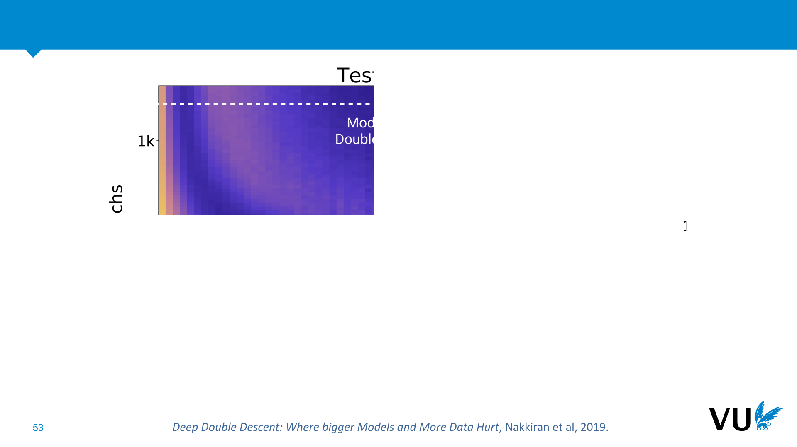

            <figcaption>
            
This means that we can see a double descent phenomenon not just in model complexity (horizontal) but also in training time (vertical).

            </figcaption>
       </section>

       <section id="slide-054">
            <a class="slide-link" href="https://dlvu.github.io/tools#slide-054" title="Link to this slide.">link here</a>
            

            <figcaption>
            
Note that we’re talking about the minima of the training loss <em>on the dataset</em>. If we define the loss as a function of the data <em>distribution</em> (which we estimate by sampling data), then the global optimum is still the ideal, but the lowest loss we can find for the data is actually a poor estimate, since we get a completely different loss on a new sample. 

The mechanism behind the double descent phenomenon seems to be that the more your overparametrize the model, the stronger the effect of the imoplicit regularization of gradient descent becomes.

            </figcaption>
       </section>

       <section id="slide-055" class="anim">
            <a class="slide-link" href="https://dlvu.github.io/tools#slide-055" title="Link to this slide.">link here</a>
            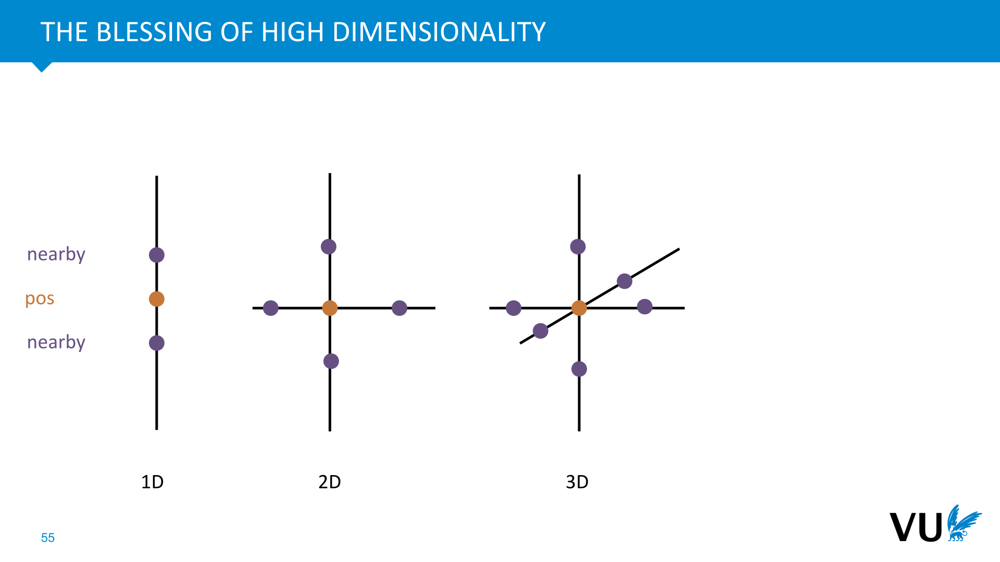

            <figcaption>
            
Here's another mechanism that may play a role. Imagine gradient descent taking a single step of a fixed length. How many different models can it reach? If we look at only the steps along one of the axes (changing only one parameter, and leaving the rest), we can count the available models. It's 2 for a single parameter, 4 for two parameters and 8 for 3 parameters. In short, and exponential increase.  

In reality, one fixed step of gradient descent can reach every model on a sphere around the current position, so the amount and variety of models is a little harder to analyze, but the message remains the same: the amount increases exponentially with the number of dimensions. Once we get to billions of parameters, the variety of nearby models might be so great, that gradient descent only needs to walk a short path to a very good model. 

To paraphrase Geoffrey Hinton: “In a sixteen dimensional supermarket, the pizzas can be next to the anchovies, the beer, the cheese and the pasta”. 
<aside    >There’s not much rigorous work on this, but here’s a blog post that goes a little deeper: https://moultano.wordpress.com/2020/10/18/why-deep-learning-works-even-though-it-shouldnt/ </aside>
What does this look like inside the network? What kind of parameters does gradient descent select? The <strong>lottery ticket hypothesis</strong> offers us a perspective on this.

            </figcaption>
            click image for animation
       </section>

       <section id="slide-056">
            <a class="slide-link" href="https://dlvu.github.io/tools#slide-056" title="Link to this slide.">link here</a>
            

            <figcaption>
            
The lottery ticket hypothesis comes out of the technique of network pruning. This is the simple idea that <strong>after</strong> training a large neural network, we can disable all the weights that are close to zero (by setting them to zero), and lose almost no performance. Pruning works so well, that we can often remove 85% to 95% of the network weights.  

Crucially, however, we can't just start with a network that small and train it from scratch: the performance is noticeably lower. So, we need the large networks to end up with a good model, but the good model we get is also highly redundant, with most parameters serving no purpose in the trained network. 

How do we explain this? 

            </figcaption>
       </section>

       <section id="slide-057">
            <a class="slide-link" href="https://dlvu.github.io/tools#slide-057" title="Link to this slide.">link here</a>
            

            <figcaption>
            
The lottery ticket hypothesis is a suggested answer to this question. The idea is that we aren’t actually training the whole of this network, with all these millions or billions of weights each acting in concert. 

What actually happens is that we are initializing a combinatorial explosion of <strong>subnetworks</strong>. By pure chance, some these will perform well or be close to something that performs well. Gradient descent isn't actually carefully selecting just the right value for for every single parameter. It's merely weeding the subnetworks that are already performing well and finetuning them a little bit.

            </figcaption>
       </section>

       <section id="slide-058">
            <a class="slide-link" href="https://dlvu.github.io/tools#slide-058" title="Link to this slide.">link here</a>
            

            <figcaption>
            
Here are just five of the subnetworks of a simple (2, 3, 2) network that might compute a useful function if we set the greyed out weights to zero. There are many more, and the number explodes as the width of the network grows. 

In a network with N weights, there are 2N ways to select a subnetwork. Some of these won’t connect the input to the output, but most will. 

            </figcaption>
       </section>

       <section id="slide-059" class="anim">
            <a class="slide-link" href="https://dlvu.github.io/tools#slide-059" title="Link to this slide.">link here</a>
            

            <figcaption>
            
If you've never looked carefully at exponential growth, you may not yet understand what the big deal is. Here is a quick example to hammer the point home. 

The last two numbers are fairly crude approximations (we don't know for instance, what proportion of these networks will be disconnected), but note that even if only one-sixteenth of the possible subnetworks should actually be counted as being useful, we should just subtract 4 from the exponent.  
<aside    >So long as the proportion of useful subnetworks is non-vanishing (doesn't go to zero), we still get a massive exponential growth far beyond anything countable that our universe holds.</aside><aside    ></aside>
            </figcaption>
            click image for animation
       </section>

       <section id="slide-060">
            <a class="slide-link" href="https://dlvu.github.io/tools#slide-060" title="Link to this slide.">link here</a>
            

            <figcaption>
            
Here's an experiment to verify (or at least boost our confidence in) the lottery ticket hypothesis. We train and prune a large neural net. Then, after training, we keep the pruned weights 0, but we reset the non-pruned weights to the value they had at initialization. We then restart training, keeping the pruned weights fixed to zero. 

What we see is that we <strong>now have a small network that GD can train to the same performance as the large network</strong>. 

If however, we re-initialize the unpruned weights to random values, we lose the performance. It only works because the non-pruned weights constitute a <strong>lottery ticket</strong> in the original initialization. 

            </figcaption>
       </section>

       <section id="slide-061">
            <a class="slide-link" href="https://dlvu.github.io/tools#slide-061" title="Link to this slide.">link here</a>
            

            <figcaption>
            
If we iterate this process, we can prune to even lower values. At each point in this plot, the network is pruned by a small amount, the non-pruned values are reset to the initialization values, and retrained. This is compared with resetting to a new random initialization, represented by the dashed line. 

By the end, the network is pruned to 1% of its original size, with a relatively small drop in performance. If we had trained a network that small from scratch, we would get 65% accuracy at best.

            </figcaption>
       </section>

       <section id="slide-062">
            <a class="slide-link" href="https://dlvu.github.io/tools#slide-062" title="Link to this slide.">link here</a>
            

            <figcaption>
            
This gives some weight of evidence to the lottery ticket hypothesis, but we're still using gradient descent to learn. How much of the performance is down to selecting subnetworks and how much is weight tuning? Can we somehow isolate the selection of subnetworks, without ever changing the weights from their initialization value? 

It turns out this is possible. Using a method called gradient estimation (discussed later, in the reinforcement learning lectures) we can used stochatic gradient descent to learn a <em>mask </em>over the weights. We set some of the weights to zero, and keep the rest at their initialization value. 

The result is that the masked network, with the majority of its weights zeroed out, and the rest kept unchanged, already achieves performance that is close to that of a state of the art. This more-or-less confirms the lottery ticket hypothesis. When you train a network, the perfectly performing model is already in there. Like Michelangelo with a block of marble, all you have to do is carve it out.

            </figcaption>
       </section>

       <section id="slide-063">
            <a class="slide-link" href="https://dlvu.github.io/tools#slide-063" title="Link to this slide.">link here</a>
            

            <figcaption>
            
<a href="https://eng.uber.com/deconstructing-lottery-tickets/"><strong>https://eng.uber.com/deconstructing-lottery-tickets/</strong></a> 

            </figcaption>
       </section>

       <section id="slide-064">
            <a class="slide-link" href="https://dlvu.github.io/tools#slide-064" title="Link to this slide.">link here</a>
            

            <figcaption>
            

            </figcaption>
       </section>

       <section id="slide-065">
            <a class="slide-link" href="https://dlvu.github.io/tools#slide-065" title="Link to this slide.">link here</a>
            

            <figcaption>
            

            </figcaption>
       </section>

       <section id="slide-066">
            <a class="slide-link" href="https://dlvu.github.io/tools#slide-066" title="Link to this slide.">link here</a>
            

            <figcaption>
            

            </figcaption>
       </section>

       <section class="video" id="video-066">
           <a class="slide-link" href="https://dlvu.github.io/tools#video-66">link here</a>
           <iframe
                src="https://www.youtube.com/embed/uEvvs2YCxQk?si=LoM19qg_p5GRctaJ"
                title="YouTube video player"
                frameborder="0" allow="accelerometer; autoplay; clipboard-write; encrypted-media; gyroscope; picture-in-picture"
                allowfullscreen>
           </iframe>

       </section>

       <section id="slide-067">
            <a class="slide-link" href="https://dlvu.github.io/tools#slide-067" title="Link to this slide.">link here</a>
            

            <figcaption>
            
Optimizers are algorithms that take the basic idea of (stochastic) gradient descent and tweak it a little bit, to improve its performance. For large, and heterogeneous neural networks, the use of optimizers is essential.  

With only plain SGD, you would often have to carefully tune the learning rate and learning rate schedule separately for different parts of one model. With a good optimizer, this becomes a simple matter of trying three or four learning rates and picking the best. It also often means that you can train with<em> higher</em> learning rates, taking bigger steps in model space, and getting to a good model faster. 

 

            </figcaption>
       </section>

       <section id="slide-068" class="anim">
            <a class="slide-link" href="https://dlvu.github.io/tools#slide-068" title="Link to this slide.">link here</a>
            

            <figcaption>
            
To start, let's look at the business of optimization in general. In the first videos of this lecture, we already discussed the problem that the optimization that we perform in machine learning is not the optimization that we actually want to solve. This put us in the awkward position of wanting to solve a problem well, but not too well. We're not really doing optimization so much as using optimization tools and then crippling them so they don't work too well. 

We can solve this by restating the problem <em>probabilistically</em>. If we assume our data (either an instance, a batch or the whole dataset) is drawn from some distribution p, then what we really want to minimize is the <strong>expected loss</strong> under that distribution. For the expected loss, we do actually want to find a global minimum: we have a proper optimization problem again. 

The problem we have now, is that the expected loss is not something we can compute. The best we can do is to estimate it by taking a bunch of samples from our data distribution (i.e. our dataset) and to average the loss over them. When we minimize that instead, however, the problem of overfitting emerges: we may end up optimizing for random details in our sample, that would disappear if we took another sample.

            </figcaption>
            click image for animation
       </section>

       <section id="slide-069">
            <a class="slide-link" href="https://dlvu.github.io/tools#slide-069" title="Link to this slide.">link here</a>
            

            <figcaption>
            
Here is our cartoon again, extended with the ideal view. We have the expected loss, which we want to optimize for but can't directly, and the loss on our training data, which is an imperfect estimate of the expected loss.  

            </figcaption>
       </section>

       <section id="slide-070">
            <a class="slide-link" href="https://dlvu.github.io/tools#slide-070" title="Link to this slide.">link here</a>
            

            <figcaption>
            
Luckily there is a result that tells us we can optimize for a loss we can’t compute: the Robbins-Monro algorithm. We estimate the loss and/or its gradient based on some sample, and perform simple gradient descent. 

These constraints almost never hold in deep learning, but for some we can assume that they hold locally. For instance, once we get into an area of parameter space where the loss surface is locally convex (and the other constraints hold), we can be sure that SGD will converge to that local optimum. And that local optimum is a local optimum for the loss surface of the expected loss, rather than the data loss. 

In most cases, we don’t care too much about maintaining the convergence guarantees (even if we decay the learning rate, we rarely do it like this). Ultimately, we prove the quality of our learning empirically, not theoretically. Still, the Robbins-Monro result tells us that if we have asymptotically unbiased estimates of the gradient, we should in principle be able to find a local optimum. 

Note also that reusing data (training for more than one epoch) eventually causes bias, which means the RM conditions fail (which is where overfitting comes from). The RM results only hold if we keep taking fresh samples (or equivalently, we only train for one epoch). This also, doesn't usually hold in deep learning.

            </figcaption>
       </section>

       <section id="slide-071" class="anim">
            <a class="slide-link" href="https://dlvu.github.io/tools#slide-071" title="Link to this slide.">link here</a>
            

            <figcaption>
            
To understand the limits of plain gradient descent as we’ve seen it, imagine tuning two models: a CNN to analyze images, and a language model RNN to generate sentences (we haven’t looked at RNNs yet, but we will soon). 

Clearly these are very different models, with different requirements. We can expect them to require very different learning rates. So what should we do if we want to connect a CNN to a language model, and train the whole thing end to end? This is for instance, how you would build a simple image captioning network. 

The more heterogeneous a network becomes, the more difficult it is to train it with a single learning rate. Instead, we need a mechanism that is more<strong> adaptive</strong>. Ideally, one that starts with a base learning rate, but adapts that learning rate at every step of training for every parameter individually.

            </figcaption>
            click image for animation
       </section>

       <section id="slide-072">
            <a class="slide-link" href="https://dlvu.github.io/tools#slide-072" title="Link to this slide.">link here</a>
            

            <figcaption>
            
These are the approaches we will look at. First, we will look at second order optimization (also know as Newton's method). This isn't actually practical for the large models we get in DL, but it gives us a picture of the ideal we would like to estimate. 

Them, we will look at the basic idea, momentum, that inspires most optimizers, and we will look in detail at what is probably the most famous and commonly used optimizer: Adam.  

Finally, to show that there is much progress being made in this area, we will look at a few recent innovations.

            </figcaption>
       </section>

       <section id="slide-073">
            <a class="slide-link" href="https://dlvu.github.io/tools#slide-073" title="Link to this slide.">link here</a>
            

            <figcaption>
            
To understand Newton's method, remember that the gradient (or the derivative in 1D), is a local, linear approximation to a function. At one particular point, it gives us the line that best follows the function around that point. 

We can think of gradient descent in the following terms. It takes this local, linear approximation, takes a small step towards its minimum (which lies off towards infinity for a linear approximation) and then repeats the procedure.

            </figcaption>
       </section>

       <section id="slide-074">
            <a class="slide-link" href="https://dlvu.github.io/tools#slide-074" title="Link to this slide.">link here</a>
            

            <figcaption>
            
With this view in hand, we can improve the method by using a <strong>nonlinear approximation</strong> to our function instead. 

We could, for instance, use a a polynomial of order 2, which gives us a better local approximation. For these two points here, the linear approximations give pretty similar slopes. However, the polynomial approximations give us more information. for the orange point on the left, the polynomial approximation has a minimum at negative infinity, just like the linear approximation. But for the green point the polynomial approximation actually has a finite minimum.  

Taking the second value as an approximation, we could move directly to its minimum, and get a solution in one step. A solution that is not so far from the actual minimum of the blue line. 

The derivative (the linear approximation) only tells us how fast the function is increasing or decreasing. The second order approximation also gives us the second derivative: whether the increase is slowing down, or speeding up. If we are minimizing, both pictures will tell us to move to the left, but in the first, the second order derivative tells us that (moving left) the decrease is speeding up, so we can take a big step. In the second, we see that we are approaching the minimum, so we should reduce our step size.

            </figcaption>
       </section>

       <section id="slide-075" class="anim">
            <a class="slide-link" href="https://dlvu.github.io/tools#slide-075" title="Link to this slide.">link here</a>
            

            <figcaption>
            
To see how this works in practice, let's work out the formal details in a 1D setting (we'll sketch out how this translates to higher dimensions later). 

Let’s start with the linear approximation. We’re usually only interested in the slope of this function, but we can work out the complete function if needs be; we just have to solve for the bias term b. 

As we can see here, the complete function for our linear approximation at the point x=a works out as fa(x) = f'(a)x + f(a) - af'(a), which can also be written as  fa(x) = f(a) + f'(a)(x - a) 
<aside    >Note that fa(a) = f(a) because at point a the two functions coincide.</aside><aside    ></aside>
            </figcaption>
            click image for animation
       </section>

       <section id="slide-076" class="anim">
            <a class="slide-link" href="https://dlvu.github.io/tools#slide-076" title="Link to this slide.">link here</a>
            

            <figcaption>
            
For the best second order approximation we work out the first three terms of the Taylor approximation of our function. If you've never seen that done, here's briefly how it works. If this is moving too fast, consult your calculus textbook on Taylor polynomials.  

We want a second order polynomial that is a good approximation of our function at the point a. We assume that this function has the form fa(x) = c1 + c2(x-a) + c3(x-a)2. That is, it’s a regular second-order polynomial with three coefficients, but the base of the terms is not how far x is from 0, but how far x is from a. 

All we need is to work out what the values of the constants c1, c2 and c3 should be. If x = a, the second two terms disappear, so we are left with c1 = f(a). Taking the first derivative of our approximation, the c1 term disappears, and c2 becomes a constant. We can now use the same trick again: set x = a and only c2 is left. Then we take the second derivative of fa(x) to isolate c3. 

What we end up with is an approximation of f at a as a second degree polynomial. We get the values of the constants by feeding a to the 0th, first and second derivatives of f. 

What we can do now, is to move towards the minimum of the approximation. Since it has a simple functional form, we can work out the location of this minimum analytically.

            </figcaption>
            click image for animation
       </section>

       <section id="slide-077" class="anim">
            <a class="slide-link" href="https://dlvu.github.io/tools#slide-077" title="Link to this slide.">link here</a>
            

            <figcaption>
            
Our approximation is a parabola, with a minimum of its own (unlike the 1st order approximation, which as its minimum at infinity). We can simply work out where this minimum is, and take a step towards it.  

To work out the minimum, we take the derivative of our approximation wrt x (note that the purple factors are just constants), we set it equal to 0 and solve for x. 

In the result, x is where we want to be and a is where we started.  

We can now change the meaning of the symbol x to where we are now in the optimization: if we are at x and want to move towards the minimum of our function, we should subtract from x: the first derivative of f at our current position, divided by the second derivative at our current position. This gives us the update rule at the bottom of the slide. 

Since we are dealing with an approximation, we multiply this step size by some value alpha, so we move only a small way towards the minimum rather than jumping directly to it. 

The step size is determined by how far we trust the approximation. If we know the approximation is exact, we can set alpha=1 and just jump directly to the minimum in one step. The less we trust our approximation, the smaller alpha becomes, and the more steps we should take.

            </figcaption>
            click image for animation
       </section>

       <section id="slide-078" class="anim">
            <a class="slide-link" href="https://dlvu.github.io/tools#slide-078" title="Link to this slide.">link here</a>
            

            <figcaption>
            
Of course in deep learning, we are not searching a one-dimensional space, but a high dimensional space (containing the parameters of our model). 

In n dimensions, we can follow the same process (we’ll save you the working out, but it’s pretty straightforward with a little vector calculus). The Taylor approximation in n dimensions has f(a) for a constant, the dot product of the gradient and x-a as the first order term, and the bilinear product of a matrix with x-a as the second order term. This matrix is called the Hessian: element (i, j) of the Hessian is a second-order derivative: the derivative wrt to parameter j of the derivative wrt to the parameter i. 
<aside    >Note that we're changing perspective from how we viewed the problem in the backpropagation lecture: we are now taking all parameters of our function as a single vector, rather than lots of different tensors retaining their shape.  </aside>
This tells us how to apply Newton's method to high dimensional problems. It's not usually done in practice in deep learning because the number of elements in the Hessian matrix is the square of the number of parameters. If we have a million parameters, the Hessian has 1012 elements. Not only is that too big to fit in a reasonable amount of memory, we’d have to do an additional backward pass for each element to compute each second derivative, and then compute the <em>inverse of the Hessian</em> after we've built this up. Some of these steps can be approximated, but in general, Newton's method still ends up being impractical for training large neural nets. 

The reason we discuss it here, is not because we use it in practice, but because it's an ideal that we'd like to approximate with cheaper methods. 

            </figcaption>
            click image for animation
       </section>

       <section id="slide-079">
            <a class="slide-link" href="https://dlvu.github.io/tools#slide-079" title="Link to this slide.">link here</a>
            

            <figcaption>
            
Even for a relatively simple neural network of 100K parameters, this is already completely infeasible.

            </figcaption>
       </section>

       <section id="slide-080">
            <a class="slide-link" href="https://dlvu.github.io/tools#slide-080" title="Link to this slide.">link here</a>
            

            <figcaption>
            
When we compute a partial derivative for a parameter, we assume that all other parameters are constant. This is what the gradient tells us: how to change one parameter, assuming that we keep all the rest constant. Of course, this is not what we actually do: we change all parameters of the network. In an ideal world, we would work out how much we change parameter a and parameter b together: modeling not just their behavior independently of one another, but also how they interact. This is what the off-diagonal elements tell us: how all parameters interact with one another.  

On the diagonal, we get the second order partial derivative of the parameter. This is the curvature information along a particular dimension in model space. We saw in the 1D example of Newton's method what this tells us: if we are far from an optimum, it increases the step size, and once we near the optimum, it reduces the step size.

            </figcaption>
       </section>

       <section id="slide-081">
            <a class="slide-link" href="https://dlvu.github.io/tools#slide-081" title="Link to this slide.">link here</a>
            

            <figcaption>
            
To visualize this, here is how gradient descent behaves on a surface with a tricky curvature. If we had access to the Hessian, it could tell us two things.  

First, that the horizontal and vertical parameters interact, creating a "canyon" with a curved shape. The Hessian would let us follow this curved shape directly. It would tell us that if we change parameter a in a certain way, we should change parameter b to match. Gradient descent only looks at each parameter independently. It can only see how parameter b should change as a result of this curvature <em>after</em> it has updated parameter a (and vice verse). As a result, gradient descent shows much more oscillation, since the loss landscape "curves away" from the direction predicted by a linear approximation.  

Second, we see that at the start, when the search encounters a "bowl" shape along the vertical axis, it doesn't converge to the minimum of this bowl, but bounces around from side to side: it oscillates from one side of the canyon to the other. Most of the distance covered is spent on these oscillations, rather than following the direction of the canyon. If we had access to the Hessian, it could tell us that in the vertical direction we are nearing a minimum, so we should lower the step size, dampening the oscillation. 
<aside    >We can, of course reduce the learning rate to eliminate this oscillation, but the price we pay is that we take more steps. The information from the Hessian allows us to take big steps when the loss landscape is predictable, and small steps when it curves in a tricky way. </aside><aside    ></aside>
            </figcaption>
       </section>

       <section id="slide-082" class="anim">
            <a class="slide-link" href="https://dlvu.github.io/tools#slide-082" title="Link to this slide.">link here</a>
            

            <figcaption>
            
Here's another way to think about the Hessian (which requires a little linear algebra*). The first two parts of our Taylor approximation define a linear function (a hyperplane). The hessian term adds to that a parabola in n dimensions (a quadratic function). This is a function that takes the bi-unit sphere and stretches, squishes and rotates it into an ellipsoid. The eigenvectors of the Hessian give us the axes of this ellipsoid. 

If the largest eigenvector is very large and the smallest is very small, the ellipsoid is very stretched, and gradient descent is likely to perform poorly because it's missing the required curvature information. The ratio between the two is called the <strong>condition number</strong>, and tells us a lot (if we can work it out) about how easy our optimization problem is to solve. 
<aside    >*To brush up on the relevant concepts, this blog post may help: <a href="http://peterbloem.nl/blog/pca-2"><strong>http://peterbloem.nl/blog/pca-2</strong></a>.</aside><aside    ></aside>
            </figcaption>
            click image for animation
       </section>

       <section id="slide-083">
            <a class="slide-link" href="https://dlvu.github.io/tools#slide-083" title="Link to this slide.">link here</a>
            

            <figcaption>
            
So, if computing and inverting the Hessian is not workable for deep neural nets, how can we solve some of these problems in practice? First, let's sum up what the requirements are, so that our optimization is roughly as expensive as plain gradient descent.  

Gradient descent (by backpropagation) requires only one forward pass and one backward pass. These usually take the bulk of the computation, so we don't want to do more of these. In other words, whatever optimizer we design shouldn't need more information than the gradients we are already computing. 

Next, we don't want to have to store substantially more than we are already storing. In plain GD, we store one (floating point) number for each parameter of our network and one for its gradient. We're willing to store one or two more number per parameters (like previous gradients) but not more than that. 

Finally, the extra computation after the forward and backward should be limited. In plain GD this is limited to subtracting the gradient from the parameter values, which is a very cheap O(N) operation. This usually vanishes compared to the forward and backwards which are usually more than linear. So long as the computation remains linear in the number of parameters, we can be sure that updating our parameters based on the gradients remains a vanishingly small part of a single update of our algorithm.

            </figcaption>
       </section>

       <section id="slide-084">
            <a class="slide-link" href="https://dlvu.github.io/tools#slide-084" title="Link to this slide.">link here</a>
            

            <figcaption>
            
Here is our first practical variation on gradient descent. In addition to the weights (w) of the neural network, we maintain another vector <strong>m</strong> of the same length (that is, we store one additional number per network weight). This is called the <strong>momentum</strong>. These are initialized to 0. 

We compute the gradient for the weights, as before, but instead of subtracting it from the weights directly, we add it to the momentum, which is first reduced by a hyperparameter gamma. 

This means that the value <strong>m</strong> that we subtract from the weights, is partially made up of the current gradient, and partially of previous gradients.

            </figcaption>
       </section>

       <section id="slide-085">
            <a class="slide-link" href="https://dlvu.github.io/tools#slide-085" title="Link to this slide.">link here</a>
            

            <figcaption>
            
There are a few perspectives that can help us to understand what is happening in momentum, and why it makes optimization work better.

            </figcaption>
       </section>

       <section id="slide-086">
            <a class="slide-link" href="https://dlvu.github.io/tools#slide-086" title="Link to this slide.">link here</a>
            

            <figcaption>
            
If you imagine a heavy ball, rolling over the loss surface, you can see that it will very efficiently find good minima. If any minimum is to shallow, or too small, the ball will roll back out of it, due to its momentum. Only when a minimum is wide, with high walls, will the ball stay put. The heavier the ball the greater its momentum. 

To model this analogy, we need to mimic the way nature produces motion. This is not by direct change, as in gradient descent: a force does not add directly to our position. A force adds to our velocity, and the velocity adds to our position. In momentum, the gradient works as the force, and the momentum vector works as the velocity. 

            </figcaption>
       </section>

       <section id="slide-087">
            <a class="slide-link" href="https://dlvu.github.io/tools#slide-087" title="Link to this slide.">link here</a>
            

            <figcaption>
            
These are the three main behaviors we want from our heavy ball. First, It should roll out of insignificant local minima, as already discussed. 

Second, if the optimization process is oscillating (the ball is rolling back and forth), this should be dampened out. As we saw before, oscillations means we are taking big steps, but not moving a lot, so the more we can dampen them out, the more efficient our optimization is. 

Third, if any direction is repeated a lot in subsequent gradient steps, we want to accelerate in that direction. We are timid in gradient descent, taking only small steps in case the current approximation of the loss surface no longer holds after the step. If it turns out that timidity is not necessary and the same direction is consistently part of the gradient steps after step, we can increase our step size in that direction. 

Note that the second and the third can hold at the same time. In the plot on the bottom left, we have an oscillation from the bottom left to the top right, which we want dampened out, and a repeating direction from the top left to the bottom right (at the start), which we want to accelerate. 

For these second two points the heavy ball perspective is perhaps not the most intuitive. We’ll look at some other perspectives to help us understand what is happening.

            </figcaption>
       </section>

       <section id="slide-088" class="anim">
            <a class="slide-link" href="https://dlvu.github.io/tools#slide-088" title="Link to this slide.">link here</a>
            

            <figcaption>
            
To see how momentum accelerates repeated gradients, imagine an ideal scenario where the gradient always points in exactly the same direction. This happens for instance, if we try to find the minimum on a hyperplane  
<aside    >In this case GD will send us off to infinity, so it's not a realistic example, but some loss surfaces may look like a hyperplane for a large stretch of their domain.  </aside>
In the first gradient update, the momentum vector is 0 plus this direction d, so the update is the same as our regular GD update. 

In the second update, the momentum is the previous direction (which was d) times gamma, plus the current. In the third, these previous two are multiplied by gamma and the new direction is added. This pattern continues forever. 

Because all the directions are the same in this example, we can take them out of the sum and the remainder is just an infinite sum of gammas with increasing exponents. This infinite sum has a simple analytic expression: 1/(1- γ), which becomes 100 if gamma is 0.99.  

This means that compared to our plain gradient descent update, under momentum, we are moving in exactly the same direction, but we are multiplying our step size a hundredfold.

            </figcaption>
            click image for animation
       </section>

       <section id="slide-089">
            <a class="slide-link" href="https://dlvu.github.io/tools#slide-089" title="Link to this slide.">link here</a>
            

            <figcaption>
            
To see how momentum helps us to dampen out oscillations, we can use yet another perspective: momentum computes an exponential moving average. 

To motivate this, here's a simple way to deal with oscillations: store the k previous gradients, and instead of moving in the direction of the last, move <em>in the direction of their average</em>. Look at the oscillation in the picture. If we average the gradients, the oscillation gives us roughly as many gradients pointing one way as in the opposite direction. Averaging these removes the oscillation, and leaves only the gradient pointing bottom right.  
<aside    >This repeats for all steps so it becomes accelerated. </aside>
There are two problems with this idea. First, we need to store k gradients, which for a large model means k times the memory we use to store the model itself. Second, if we choose k small, we get little dampening, but if we choose it large, we get a lot of influence from old gradients that are no longer relevant.  

The <strong>exponential moving average</strong> solves both problems.

            </figcaption>
       </section>

       <section id="slide-090">
            <a class="slide-link" href="https://dlvu.github.io/tools#slide-090" title="Link to this slide.">link here</a>
            

            <figcaption>
            
If we fill in the sequence of gradients g1, …, gn as we did before, we can easily see that the change we make to the neural network parameters is a weighted sum over all the previous gradients. 

This is not strictly a weighted <em>average</em>, because the weights don't sum to one. However, we are multiplying by an arbitrary hyperparameter α anyway. 

            </figcaption>
       </section>

       <section id="slide-091" class="anim">
            <a class="slide-link" href="https://dlvu.github.io/tools#slide-091" title="Link to this slide.">link here</a>
            

            <figcaption>
            
An <strong>exponential moving average</strong> is a weighted average of a sequence of values (numbers or vectors) that is easy to compute on the fly (without storing the whole sequence). It takes all elements of the sequence into account, but with the most recent values weighted more heavily. It's defined similarly to momentum, but slightly different. Can we find a precise relation between the two? 

The exponential moving average works recursively: when we see element xn come in, we simply take the average of xn and our previous average, with the new value counting for some proportion <em>kappa </em>and the old counting with proportion 1-kappa. At the very start (t=0) we set the average to 0. 

Because the new average is the average of the new value and an old average, we can be sure that the value is a proper average at every stage (in contract to the momentum). 

Starting with this definition, we can fill in the definition of EMAn-1 and multiply out the brackets. If we keep doing this, we see that the exponential moving average is a simple weighted sum over the whole sequence. If we define a value gamma = 1 - kappa, then we see that the EMA is proportional to the weighted sum that momentum computes.  

In other words, the momentum <strong>m</strong> can be seen as an exponential moving average of the recently observed gradients (it’s scaled by a constant factor, but then we multiply it by an arbitrary learning rate anyway).

            </figcaption>
            click image for animation
       </section>

       <section id="slide-092" class="anim">
            <a class="slide-link" href="https://dlvu.github.io/tools#slide-092" title="Link to this slide.">link here</a>
            

            <figcaption>
            
This idea of taking averages to stabilize gradient descent also provides us with a new perspective on minibatching. Assume we have some minibatch of instances, and we are averaging the loss over them. When we look at the gradient over the batch loss, we see that it is equivalent to the average of the individual gradients of each instance. 

This means that doing one step of gradient descent for the loss over a minibatch, is equivalent to doing single-instance gradient descent, but averaging the gradients that we get and holding off on the descent step until we’ve seen all gradients in the batch. 

With this perspective, we can think of momentum as giving us the best of both worlds: because we use an exponential moving average, we can do an update after each instance (or small batch), but we also get the stabilizing and accelerating effects of large batch training. 
<aside    >In practice, we do both, big batches, and momentum, but this is probably more because big batches allow us to fill up our memory and thus achieve the maximum amount of parallelization.</aside><aside    ></aside>
            </figcaption>
            click image for animation
       </section>

       <section id="slide-093">
            <a class="slide-link" href="https://dlvu.github.io/tools#slide-093" title="Link to this slide.">link here</a>
            

            <figcaption>
            
So that's momentum. We pay a little extra memory (one extra number for each weight), and we make one extra operation (a sum) per weight, and we have one extra hyperparameter to tune. 

In return, we get a potential massive speedup in convergence, escaping of local minima, dampening of oscillations and acceleration of gradients, so it’s a pretty good deal. 

We can also see the fact that each parameter gets its own momentum as a kind of<strong> adaptive learning rate</strong>. Momentum <em>learns</em> to accelerate some directions and to dampen others. 

            </figcaption>
       </section>

       <section id="slide-094">
            <a class="slide-link" href="https://dlvu.github.io/tools#slide-094" title="Link to this slide.">link here</a>
            

            <figcaption>
            
Nesterov momentum is a slight tweak on plain momentum.  

With plain momentum, the position where we end up is the sum of our momentum term and the current gradient. The idea behind Nesterov momentum is that if we are going to add the momentum term anyway, and you know the momentum term <em>before</em> you compute the gradient, you might as well add the momentum term first, and<em> then</em> compute the gradient. The gradient for this position will be closer to where you're going, so the information should be more accurate.  

In practice, Nesterov momentum often works better, but both versions are used.

            </figcaption>
       </section>

       <section id="slide-095">
            <a class="slide-link" href="https://dlvu.github.io/tools#slide-095" title="Link to this slide.">link here</a>
            

            <figcaption>
            
It’s not just the <em>average</em> of our gradients that can tell us something. Remember in the first part of this lecture, we noted that if the variance of our gradients is high, we’re probably bouncing around some bowl in the loss surface (at least for that parameter), so we want to lower the learning rate. If the variance is low, we’ve settled on a local minimum, and (if that minimum isn’t good enough) we had better boost the learning rate a little. 

This tells us that it’s not just helpful to use the average of a bunch of suggestions for the gradient, we may get a boost from normalizing the variance as well.

            </figcaption>
       </section>

       <section id="slide-096">
            <a class="slide-link" href="https://dlvu.github.io/tools#slide-096" title="Link to this slide.">link here</a>
            

            <figcaption>
            
If you've done any data science before, you've probably seen this operation before: you subtract the mean of your data and divide by the standard deviation. This operation ensure that the new mean of your data is 0 and the new variance is 1.  
<aside    >Adding a small epsilon to avoid problems when the standard deviation gets too close to zero. </aside>
We can use this normalization as inspiration to normalize our gradients. If we divide them by the standard deviation, we boost the values if they collectively get too small, and dampen them if them get too big.

            </figcaption>
       </section>

       <section id="slide-097" class="anim">
            <a class="slide-link" href="https://dlvu.github.io/tools#slide-097" title="Link to this slide.">link here</a>
            

            <figcaption>
            
This is the basic idea behind Adam: we compute not only an exponential moving average (as momentum does), but also an exponential moving average of the (non-centralized) <em>second moment</em> of each parameter (this is essentially the variance).  

The result is that the step size is reduced if we observe that we are bouncing around a lot and increased if we observe that we are stagnating.

            </figcaption>
            click image for animation
       </section>

       <section id="slide-098">
            <a class="slide-link" href="https://dlvu.github.io/tools#slide-098" title="Link to this slide.">link here</a>
            

            <figcaption>
            
In the first steps of our iteration, moving averages are very biased towards our initial values. These are arbitrarily set to 0, underestimating the gradient. For <strong>m</strong> this leads to slightly smaller steps than desired, which is not a problem, but for <strong>v</strong> this can lead to larger steps by a serious amount. 

To correct for this, the authors introduced the following bias correction. Note that this correction weighs heavily in the first steps and then dies out quickly. 
<aside    >People have observed that even with the bias correction, the early estimates are often a little off. There are many more complicated corrections, but a simpler approach is to just warm up the learning rate. That way, you’re not taking any big steps until <strong>m</strong> and <strong>v</strong> are accurate estimates of the first and second moments. </aside><aside    ></aside>
            </figcaption>
       </section>

       <section id="slide-099">
            <a class="slide-link" href="https://dlvu.github.io/tools#slide-099" title="Link to this slide.">link here</a>
            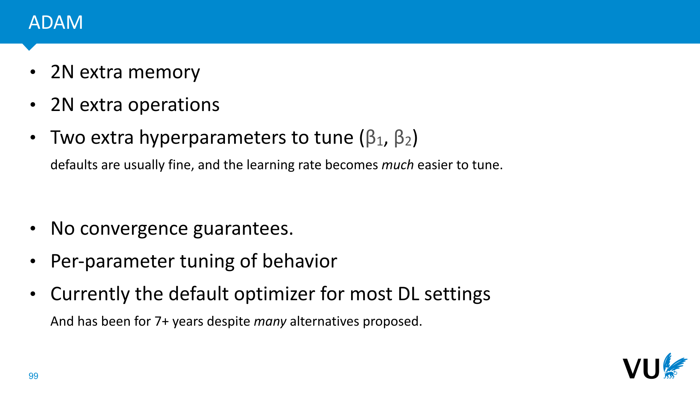

            <figcaption>
            

            </figcaption>
       </section>

       <section id="slide-100">
            <a class="slide-link" href="https://dlvu.github.io/tools#slide-100" title="Link to this slide.">link here</a>
            

            <figcaption>
            
A word of warning. You will likely find yourself, at some point, optimizing for a very simple linear problem, and wondering why Adam performs poorly. Just because Adam works better for highly complex, nonlinear problems doesn't mean it should therefore work even better for simple linear problems. Often, Adam is very slow to converge in such situations and basic SGD or momentum will give you much faster convergence.

            </figcaption>
       </section>

       <section id="slide-101">
            <a class="slide-link" href="https://dlvu.github.io/tools#slide-101" title="Link to this slide.">link here</a>
            

            <figcaption>
            
In the previous lectures, we’ve seen how to build a basic neural network, how to train it using backpropagation and we’ve met our first specialized layer: the Convolution. Putting all this together, you can build some pretty powerful networks already, but doing so is not a trivial process. Today, we’ll look at some of the things you need to know about to actually design, build and test deep neural nets.

            </figcaption>
       </section>

       <section class="video" id="video-101">
           <a class="slide-link" href="https://dlvu.github.io/tools#video-101">link here</a>
           <iframe
                src="https://www.youtube.com/embed/mX92C0s0q1Y?si=2iZlRjcusuCLZQ8T"
                title="YouTube video player"
                frameborder="0" allow="accelerometer; autoplay; clipboard-write; encrypted-media; gyroscope; picture-in-picture"
                allowfullscreen>
           </iframe>

       </section>

       <section id="slide-102">
            <a class="slide-link" href="https://dlvu.github.io/tools#slide-102" title="Link to this slide.">link here</a>
            

            <figcaption>
            
Getting deep learning to work can be a bit of a dark art. The basic principles that we've described so far are enough to understand how everything works, but to actually get to the point where you can build a working network yourself, you usually need a few tricks. In this video, we'll go through the main ones. 

 

            </figcaption>
       </section>

       <section id="slide-103">
            <a class="slide-link" href="https://dlvu.github.io/tools#slide-103" title="Link to this slide.">link here</a>
            

            <figcaption>
            

            </figcaption>
       </section>

       <section id="slide-104">
            <a class="slide-link" href="https://dlvu.github.io/tools#slide-104" title="Link to this slide.">link here</a>
            

            <figcaption>
            

            </figcaption>
       </section>

       <section id="slide-105">
            <a class="slide-link" href="https://dlvu.github.io/tools#slide-105" title="Link to this slide.">link here</a>
            

            <figcaption>
            
To understand this, imagine a network with just a single weight per layer (and no biases). First, consider what happens if you have linear activations, and set all weights higher than 1. As the network gets deeper, the output of each layer grows exponentially. If we get a gradient over the loss, the chain rule tells us to multiply it by the weights, so the gradient also grows exponentially. In theory, this is no problem: the gradients are correct so if we need smaller values, they should shrink quickly. It does mean, however, that unless we carefully tune our learning rate, we are taking very big steps at the start of learning. There is also the problem of numerical instability: the bigger our output, the less stable our nonlinear computations (like the loss) get. 

If we try to avoid it by setting the weights less than 1, we get the opposite problem: as the network gets deeper, the output shrinks exponentially and with it the gradients. Here, we have a situation, where learning never starts, because the initial gradient is far too small. And again, in this regime, there is a big probability of numerical instability. 

The sweet spot is a network with activations all equal to 1. That way, however big the input is, that's how big the output is, and the same goes for the gradient traveling back down the network. 

Of course, we never stack linear layers like this in practice. Let's see what happens when we add sigmoid activations. We see that for positive inputs the activations get squished into the interval (0, 1). Large activations are mapped to 0 and 1 and small activations are mapped to 0.5. In both cases, the sigmoid does something to counter the activation explosion/shrinkage problem. But we pay a large price in the backward pass.

            </figcaption>
       </section>

       <section id="slide-106" class="anim">
            <a class="slide-link" href="https://dlvu.github.io/tools#slide-106" title="Link to this slide.">link here</a>
            

            <figcaption>
            
The very largest derivative the sigmoid will give us is 0.25. This means that as it propagates down the network, the gradient now shrinks exponentially in the number of sigmoids it encounters. 

We could fix this by squeezing the sigmoid, so its derivative is 1 in the middle, but that would increase the regions where the sigmoid is close to flat. If backpropagation encounters anything in these region, the gradient is multiplied by something very close to zero, so it dies immediately.

            </figcaption>
            click image for animation
       </section>

       <section id="slide-107">
            <a class="slide-link" href="https://dlvu.github.io/tools#slide-107" title="Link to this slide.">link here</a>
            

            <figcaption>
            
The ReLU activation preserves the derivatives for the nodes whose activations it lets through. It kills it for the nodes that produce a negative value, of course, but so long as your network is properly initialised, about half of the values in your batch will always produce a positive input for the ReLU. 

One way to think about the difference between the sigmoid and the ReLU is that the sigmoid preserves a gradient for every weight, but shrinks the magnitude exponentially. The ReLU exponentially shrinks the number of weights for which it preserves a gradient, but for those it preserves the<em> magnitude </em>perfectly. This is much preferable. In gradient descent, we take many steps, so it's fine to take a step for only an arbitrary subset of our weights each time.  

The only thing we must watch out for is that for each weight there is some input for which the weight gets a gradient. If any input to a ReLU is negative for all possible inputs to the network, its derivative will always be 0 and it will never change. This is what we call a <strong>dead neuron</strong>. 

We can avoid dead neurons by normalization: if all the inputs look standard-normally distributed, then half of them will always get a gradient. 

            </figcaption>
       </section>

       <section id="slide-108">
            <a class="slide-link" href="https://dlvu.github.io/tools#slide-108" title="Link to this slide.">link here</a>
            

            <figcaption>
            
In short, the precise behavior of your network at initialization depends a lot on your activations. But there is a basic principle that almost always works well: make sure that on average, your activations don't increase or decrease from the input to the output, and make sure that your gradients don't increase or decrease from the output loss to the input loss. 

A simple way to guarantee this is to ensure that if the input to your layer has standard mean and covariance, then the output does to, and ensure the same thing for the backward function (or as close as you can get).  

There are two simple approaches that are commonly used: Glorot and He initialization. These are also known as Xavier and Kaiming initialization respectively (in both cases after the authors' first name).

            </figcaption>
       </section>

       <section id="slide-109">
            <a class="slide-link" href="https://dlvu.github.io/tools#slide-109" title="Link to this slide.">link here</a>
            

            <figcaption>
            
Before we get to the weights, however, we must make sure that our assumption hold for the input to the first layer. We must normalize our data. For each scalar in our input (i.e. each color channel of each pixel, or each feature in a tabular dataset), we should make sure that over the whole data its mean is 0 and its variance is 1. The operation that achieves this is simple: compute the data mean, and subtract the data standard deviation. 
<aside    >NB: Remember what we said about leakage. How should you normalize the test and validation sets?</aside><aside    ></aside>
            </figcaption>
       </section>

       <section id="slide-110" class="anim">
            <a class="slide-link" href="https://dlvu.github.io/tools#slide-110" title="Link to this slide.">link here</a>
            

            <figcaption>
            
Glorot initialization makes the simplifying assumption that the layer is linearly activated. This won't be true in practice, but the initialization usually works anyway (especially with ReLU activations). 

Top left, we see the forward and the backward functions. We will assume first that the input has standard mean and variance. We will then sample the weights from some distribution with mean 0 and variance c, and try to ensure that the output yi has variance 1 for all i. What should c be? 

We fill in the definition of yi, and work the sum out of the variance. Variance doesn't distribute over multiplication, so if we rewrite to the product of the input and the weight, we get a few extra terms. Happily, these contain the expectations of the weights and the input as factors, which we'd assumed to be zero, so these disappear (more briefly; the variance does distribute over multiplication if the expectations of both arguments are zero, as they are here). What's left reduces to the sum of m times the variance of c, where m is the number of columns in the weight matrix. 

The same argument holds in the other direction for the backward pass. The variance of the loss for the input is n times c. For these to be 1, we need to set the variance of the elements of <strong>W</strong> to 1/n and 1/m. This is clearly impossible unless <strong>W</strong> is square. In practice, we choose either or m, or we take the we take the average of n and m.  

All that's left is to pick a distribution that has 0 mean and variance 2/(n + m). The most common options are a uniform distribution or a normal distribution. In the case of the normal distribution the parameter (the standard deviation) can be derived directly from the desired variance. In the case of the uniform distribution, the upper and lower bound shown here will give you the required variance.

            </figcaption>
            click image for animation
       </section>

       <section id="slide-111">
            <a class="slide-link" href="https://dlvu.github.io/tools#slide-111" title="Link to this slide.">link here</a>
            

            <figcaption>
            
The simplifying assumption of the Glorot initialization was that the layer was linear. In short, we ignored the activation. In practice, it turns out that this doesn't hurt too much, and most networks train fine with Glorot initialization. However, it isn't too much effort to work out the impact of the activation.  

In the case of a ReLU, it's particularly straightforward: if the input to the activation has mean zero, then we expect half of them to be set to zero. This means that the remainder needs to have double the variance, or sqrt(2) times the standard deviation. This factor is called the <strong>gain</strong>. Each activation comes with its own gain. You can find a list here: <a href="https://pytorch.org/docs/stable/nn.init.html#"><strong>https://pytorch.org/docs/stable/nn.init.html#</strong></a> or in the paper. 

Note also that while the default choice for Glorot initialization is to average n and m (as shown here), the default choice for He initialization is to take only n. This choice shouldn't affect performance too much, but it may be important to implement it this way for compatibility or reproduction. When in doubt try to check the code of the model you're trying to reproduce. 

 

            </figcaption>
       </section>

       <section id="slide-112" class="anim">
            <a class="slide-link" href="https://dlvu.github.io/tools#slide-112" title="Link to this slide.">link here</a>
            

            <figcaption>
            
In practice, it's very easy to initialize things without knowing exactly what you're doing. For instance, if you check the pytorch documentation for a linear layer, it turns out that it uses neither He nor Glorot, but a similar initialization with 1 in the numerator  
<aside    >Apparently based on this '99 paper by Yann Lecun: <a href="http://yann.lecun.com/exdb/publis/pdf/lecun-98b.pdf"><strong>http://yann.lecun.com/exdb/publis/pdf/lecun-98b.pdf</strong></a>. </aside>
These default initializations usually work fine, but it's worth trying different initializations if your model isn't performing as it should. Additionally, if you're reproducing a model that uses a specific stated initialization, make sure to initialize the layers manually. 

Another thing to consider is that the linear layer doesn't know which activation it feeds into. If you want to use He initialization, make sure to set the gain manually. 

            </figcaption>
            click image for animation
       </section>

       <section id="slide-113">
            <a class="slide-link" href="https://dlvu.github.io/tools#slide-113" title="Link to this slide.">link here</a>
            

            <figcaption>
            
Even with sound initialization, however, in a very deep neural net, your gradients and activations will start to wander away from the standard mean and covariance. One good way to avoid this—both at initialization and as training takes hold—is to insert a layer that specifically normalizes its input, whatever the values. 

The most popular layer that does this is called a<strong> batch normalization</strong> layer. It takes a batch of tensors (vectors here, but any tensor shape works), and computes, for each dimension in the tensor, the mean and variance. It then normalizes the input by subtracting the mean and dividing by the standard deviation. All of these are simple, differentiable operations, so we can easily chain them together and let our AD system take care of the backpropagation. 

Optionally we can add two learnable parameters: an element-wise multiplication and a bias. This gives us the best of both worlds: the output of the batch norm can have any mean and variance, but we still get perfectly controlled gradients (this last step is linear, so the gradients are scaled linearly as well). 

Batch normalization works extremely well. In fact much better than any other approach that should work similarly (like controlling normalization through extra loss terms, or training the initial values to for normal activations). Many papers have been written about exactly why this is the case, but there doesn't seem to be a clear answer yet. For now, we can just remember that the basic idea is to stabilize the activations and the gradients.

            </figcaption>
       </section>

       <section id="slide-114">
            <a class="slide-link" href="https://dlvu.github.io/tools#slide-114" title="Link to this slide.">link here</a>
            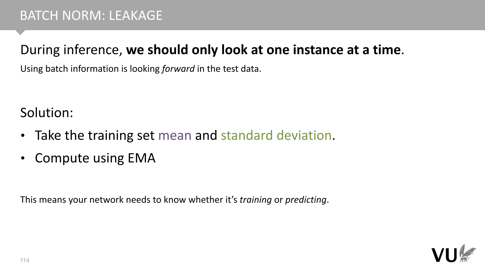

            <figcaption>
            
Remember leakage? Batch norm is a typical example of a mechanism that can leak during evaluation. If we use batch norm the same way in evaluation as we do during training, we are aggregating information over the batch dimension. This is not usually a realistic way to use a neural net. In production, instances come in one at a time. Even if they don't in your setting and you can actually batch them together, you are likely comparing to a model that doesn't. 

Moreover, your evaluation performance is an average of several independent samples of the performance on a single instance.  

To eliminate this unfair advantage, batch norm behaves differently during evaluation than during training. Like the data normalization should do, it takes the mean and variance from the training data and normalizes by that. Since it's difficult in a library like pytorch to compute the training data mean/variance from inside a layer (in some cases, there may not be fixed dataset at all), batch norm usually computes a running mean  and variance using the exponential moving average to use during evaluation. 

This does mean that when you use batch norm your network needs to know whether its training or predicting. All DL libraries have a simple functionality for telling your network this, but if you forget to do so, you are inflating the performance of your network.

            </figcaption>
       </section>

       <section id="slide-115">
            <a class="slide-link" href="https://dlvu.github.io/tools#slide-115" title="Link to this slide.">link here</a>
            

            <figcaption>
            
The batch dimension isn't the only dimension along which you can normalize. You can pick other directions and even subsets of the dimensions of your batch tensor. Depending on which dimension you pick this is called instance normalization, layer normalization or group normalization. 

Not normalizing over the batch dimension has several benefits. First, you don't have the leakage issue from the previous slide: group normalization can operate in exactly the same way during training and testing (only the batch dimension is "protected"). Second, the performance doesn't degrade for smaller batches. Batch norm requires a large number of instances to get strong estimates. If we don't have many instances in the input, but we do have, for instance, many pixels, then it may be better to normalize in another direction. 

In practice, however, for reasonable batch sizes, batch normalization appears to work best, and remains the most popular option for small models.

            </figcaption>
       </section>

       <section id="slide-116">
            <a class="slide-link" href="https://dlvu.github.io/tools#slide-116" title="Link to this slide.">link here</a>
            

            <figcaption>
            
Another cheap trick to help your gradients propagate during early training is to simply add a connection around a block of layers. We take the input of the block and add it to the output (sometimes multiplied by a single scalar parameter, but this isn't usually necessary).  

This does require that the input of the block has the same dimensions as the output, but it's usually possible to design your network in these kinds of blocks. This is called a <strong>residual connection</strong>. 

The benefit of the residual connection is that at the start of training, when the gradient signal through the block is weak because of the limits of initialization, there is a second signal through the residual that doesn't suffer this decay. The lower layers can start training based on this signal, and later, when the layers in the block start to do something useful, integrate the gradient from the block. 

 

            </figcaption>
       </section>

       <section id="slide-117">
            <a class="slide-link" href="https://dlvu.github.io/tools#slide-117" title="Link to this slide.">link here</a>
            

            <figcaption>
            
Once we have our network up and running we need to control its behavior. If we are lucky, gradient descent moves towards a model that generalizes in the way we want it to generalize. If not, it will pick a different model, which generalizes in another way. It may, for instance end up overfitting on some aspects of the data. If the problem isn't too bad, we can control this with a little bit of <em>regularization</em>.

            </figcaption>
       </section>

       <section id="slide-118">
            <a class="slide-link" href="https://dlvu.github.io/tools#slide-118" title="Link to this slide.">link here</a>
            

            <figcaption>
            
Regularization is telling the model in some way that we have an a priori preference for some models over other models. One common preference is <strong>simplicity</strong>. All else being equal, we prefer models that are somehow simple (fewer parameters, smaller parameter values, more zero parameters) to models that are more complex.  

Regularization is how we define this preference and how we communitcate it to our learning algorithm, 

A lot of the methods we use in deep learning have an <em>implicit</em> regularizing effect. For instance in gradient descent, we start at some point in model space, and take a finite number of small steps. This means we are much more likely to end up with a model that is close to our starting point. By our choice of initialization mehtod (which chooses the starting point) and our choice of gradient descent we have defined a preference from some models over others, even if we didn't do it consciously, and we couldn't quite state what that preference is. 

We'll now look at some more<strong> explicit</strong> regularizations. Methods which are explicitly added to GD or to our model to regularize it, and for which we can describe reasnoably well what preference we are encoding.

            </figcaption>
       </section>

       <section id="slide-119">
            <a class="slide-link" href="https://dlvu.github.io/tools#slide-119" title="Link to this slide.">link here</a>
            

            <figcaption>
            
The l2 regularizer considers models with small weight values to be preferable. It adds a  a penalty to the loss for models with larger weights. 

To implement the regularizer we simply compute the l2 norm of all the weights of the model (flattened into a vector). We then add this to the loss multiplied by hyperparameter lambda. Thus, models with bigger weights get a higher loss, but if it’s worth it (the original loss goes down enough), they can still beat the simpler models. 

In the image, the light brown parameter vector is preferable (according to l2 regularization) to the dark brown one. 

Here, theta is a vector containing all parameters of the model (it’s also possible to regularise only a subset).

            </figcaption>
       </section>

       <section id="slide-120">
            <a class="slide-link" href="https://dlvu.github.io/tools#slide-120" title="Link to this slide.">link here</a>
            

            <figcaption>
            
Here's how the l2 norm is computed for a two parameter model (this should not be news to you). 

By replacing the square with an arbitrary exponent (and similarly adapting the root), we can modify the norm to a range of other so called <strong>l-norms</strong>. All of these are well defined norms following the rules that a norm should follow. By regularizing with l norms of different values of p, we can change the regularization behavior.

            </figcaption>
       </section>

       <section id="slide-121">
            <a class="slide-link" href="https://dlvu.github.io/tools#slide-121" title="Link to this slide.">link here</a>
            

            <figcaption>
            
To visualize this, we can color all points that are a fixed distance from the origin. If we use the norm as a penalty, these are all the models that get the same penalty. 

For the l2 norm, they form a circle. Or, in higher dimensions, a hypersphere. 

            </figcaption>
       </section>

       <section id="slide-122">
            <a class="slide-link" href="https://dlvu.github.io/tools#slide-122" title="Link to this slide.">link here</a>
            

            <figcaption>
            
For the l1 norm, they form a diamond.

            </figcaption>
       </section>

       <section id="slide-123">
            <a class="slide-link" href="https://dlvu.github.io/tools#slide-123" title="Link to this slide.">link here</a>
            

            <figcaption>
            

            </figcaption>
       </section>

       <section id="slide-124">
            <a class="slide-link" href="https://dlvu.github.io/tools#slide-124" title="Link to this slide.">link here</a>
            

            <figcaption>
            
What does this mean for our regularization behavior with the l norms? For low p values (p=1 is most common), we are telling the learning algorithm that we prefer solutions closer to the origin (all else being equal). However, if the solution is far out into space, we also prefer it to align with the axes. A vector aligned with the axes gets to have a much high length (by l2 norm) than a vector at an angle of 45 degrees, for the same penalty. 

The effect is that we get, wherever possible, weight values that are exactly 0. Under the l2 norm, there is no difference between a values of 0.0 and a value of 0.0001. The l1 norm encodes a strong preference: weights of 0 are axis aligned, and so preferable.

            </figcaption>
       </section>

       <section id="slide-125">
            <a class="slide-link" href="https://dlvu.github.io/tools#slide-125" title="Link to this slide.">link here</a>
            

            <figcaption>
            
Here’s an analogy. Imagine you have a bowl, and you roll a marble down it to find the lowest point. Applying l2 loss is like tipping the bowl slightly to the right. You shift the lowest point in some direction (like to the origin).

            </figcaption>
       </section>

       <section id="slide-126">
            <a class="slide-link" href="https://dlvu.github.io/tools#slide-126" title="Link to this slide.">link here</a>
            

            <figcaption>
            
L1 loss is like using a square bowl. It has grooves along the dimensions, so that when you tip the bowl, the marble is likely to end up in one of the grooves.

            </figcaption>
       </section>

       <section id="slide-127">
            <a class="slide-link" href="https://dlvu.github.io/tools#slide-127" title="Link to this slide.">link here</a>
            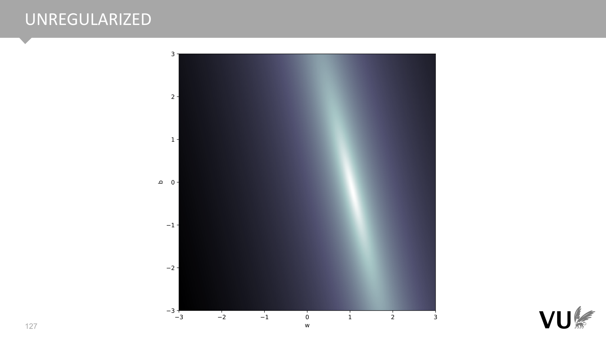

            <figcaption>
            
Here is a loss landscape for a simple linear regression problem with two parameters. Brighter points have lower loss.

            </figcaption>
       </section>

       <section id="slide-128">
            <a class="slide-link" href="https://dlvu.github.io/tools#slide-128" title="Link to this slide.">link here</a>
            

            <figcaption>
            
And here it is with l2 loss. Note that the "cloud" of good solutions has widened and a little tuft has been pulled out towards the origin.

            </figcaption>
       </section>

       <section id="slide-129">
            <a class="slide-link" href="https://dlvu.github.io/tools#slide-129" title="Link to this slide.">link here</a>
            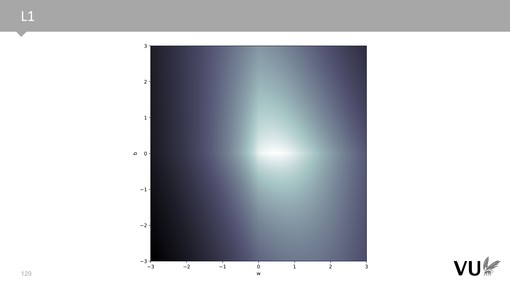

            <figcaption>
            
And here it is for l1 loss. Note the "creases" in the surface along the axes.

            </figcaption>
       </section>

       <section id="slide-130">
            <a class="slide-link" href="https://dlvu.github.io/tools#slide-130" title="Link to this slide.">link here</a>
            

            <figcaption>
            
In practice, the l2 loss doesn't usually use the norm, but the squared norm, which is equal to the dot product of the weight vector with itself. This is cheaper and easier to implement and easier to analyze. 

It's not 100% the same (the square amplifies the effect of outliers), but the basic principle is similar.

            </figcaption>
       </section>

       <section id="slide-131" class="anim">
            <a class="slide-link" href="https://dlvu.github.io/tools#slide-131" title="Link to this slide.">link here</a>
            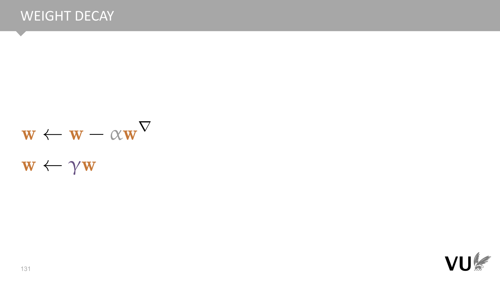

            <figcaption>
            
One consequence of using the squared norm instead of the norm in l2 loss, is that we<strong> if we use plain gradient descent</strong>, we can implement l2 loss as <strong>weight decay</strong>. In weight decay we simply shrink the weights a little after each gradient update by multiplying by a value gamma which is slightly less than 1. 

If we fill in the gradient for the penalized loss, we see that the penalty term rewrites into a simple negative term of the weights multiplied by a constant. The result that when we subtract this term, we are subtracting from weights a small multiple of themselves. For the correct value of gamma, the two approaches are equivalent.  

<em>If</em> we use plain gradient descent....

            </figcaption>
            click image for animation
       </section>

       <section id="slide-132">
            <a class="slide-link" href="https://dlvu.github.io/tools#slide-132" title="Link to this slide.">link here</a>
            

            <figcaption>
            
The benefit of weight decay is a memory saving. Penalty terms extend the computation graph, whereas weight decay is a simple in-place computation on the weights outside of the computation graph.  

However, when we sue weight decay with other optimizers, it is no longer equivalent to l2 loss, unless we implement it differently. It may still work, but you should be aware of the implications. In practice, there are often specific implementations of optimizers (like AdamW) that implement weight decay in a way that is equivalent to l2 loss.

            </figcaption>
       </section>

       <section id="slide-133" class="anim">
            <a class="slide-link" href="https://dlvu.github.io/tools#slide-133" title="Link to this slide.">link here</a>
            

            <figcaption>
            
If our model is a probability distribution (like most neural networks are), then we can easily cast penalty terms as <em>priors</em>. This fits our view of regularization very well, since it's meant to tell us which models to prefer regardless of the data, exactly what a prior does as well. 

The analysis is simple. If we are maximizing the posterior probability (using the MAP criterion to choose a model), we are maximizing the product of the prior and the sampling distribution (aka the likelihood). Taking the negative logarithm, we see that we retrieve a loss with two terms: one involving the data, and one involving only the weights. The negative log of the prior functions as a penalty term.  

Many well-known priors correspond to well know regularizers. For instance, if we use a standard normal prior on our weights, the complicated expression of the normal distribution simplifies to a simple dot product of the weight with themselves: the (squared) l2 loss that we've seen already.

            </figcaption>
            click image for animation
       </section>

       <section id="slide-134" class="anim">
            <a class="slide-link" href="https://dlvu.github.io/tools#slide-134" title="Link to this slide.">link here</a>
            

            <figcaption>
            
So what about this penalty hyperparameter alpha? It turns out that we can include that as well if we raise our prior probability density to the power alpha. Repeating the analysis from the previous slide shows that this results in a penalty term as before, but scaled by alpha. 

The only problem is that when we raise a probability density function to a power it stops summing/integrating to 1, so it's no longer a proper probability function. Therefore, we need to apply an additional normalization factor. Happily, this factor is constant with respect to the chosen weights w, so its term disappears from our loss function. 

What's the effect on the prior of raising it to a power like this? It's a little bit like adjusting the contrast in an image. If alpha is larger than 1, the difference between the large and small densities becomes more defined. In short our preferences becomes stronger. If it's less than 1, the differences become less defined and our preferences, while still the same, become less strong. This is exactly the effect that alpha has on our loss function. 

In the limit, as alpha goes to 0, the preferences disappear and we have a uniform preference over all models (although in practice, of course, we already have a load of implicit biases encoded in our search algorithm). 

In Bayesian parlance, adjusting a prior like this is known as <strong>tempering</strong>. 

            </figcaption>
            click image for animation
       </section>

       <section id="slide-135">
            <a class="slide-link" href="https://dlvu.github.io/tools#slide-135" title="Link to this slide.">link here</a>
            

            <figcaption>
            
Dropout is another regularization technique for large neural nets. During training, we simply remove hidden and input nodes (each with probability p). 

This prevents <em>co-adaptation</em>. Memorization (aka overfitting) often depends on multiple neurons firing together in specific configurations. Dropout prevents this. 

            </figcaption>
       </section>

       <section id="slide-136">
            <a class="slide-link" href="https://dlvu.github.io/tools#slide-136" title="Link to this slide.">link here</a>
            

            <figcaption>
            
Once you’ve finished training and you’ve starting using the model, you turn off dropout. Since this increases the size of the activations, you should correct by a factor of p. 
<aside    >Here again, we see a situation where the model needs to know whether it’s training or predicting. </aside><aside    ></aside>
            </figcaption>
       </section>

       <section id="slide-137">
            <a class="slide-link" href="https://dlvu.github.io/tools#slide-137" title="Link to this slide.">link here</a>
            

            <figcaption>
            
<a href="https://twitter.com/Smerity/status/980175898119778304">https://twitter.com/Smerity/status/980175898119778304</a> 

            </figcaption>
       </section>

       <section id="slide-138">
            <a class="slide-link" href="https://dlvu.github.io/tools#slide-138" title="Link to this slide.">link here</a>
            

            <figcaption>
            

            </figcaption>
       </section>

       <section id="slide-139">
            <a class="slide-link" href="https://dlvu.github.io/tools#slide-139" title="Link to this slide.">link here</a>
            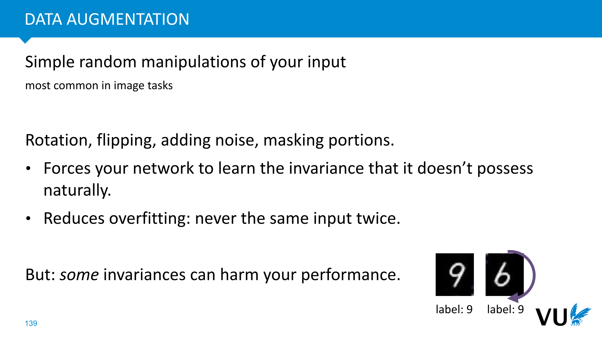

            <figcaption>
            
Again, this is usually only done during training.

            </figcaption>
       </section>

       <section id="slide-140">
            <a class="slide-link" href="https://dlvu.github.io/tools#slide-140" title="Link to this slide.">link here</a>
            

            <figcaption>
            
There is much more to be said about this, but for now, just remember that for small projects in computer vision and NLP, it's a no brainer to grab a large pretrained model and finetune it for your data.

            </figcaption>
       </section>

       <section id="slide-141">
            <a class="slide-link" href="https://dlvu.github.io/tools#slide-141" title="Link to this slide.">link here</a>
            

            <figcaption>
            

            </figcaption>
       </section>

       <section id="slide-142">
            <a class="slide-link" href="https://dlvu.github.io/tools#slide-142" title="Link to this slide.">link here</a>
            

            <figcaption>
            

            </figcaption>
       </section>

</article>
