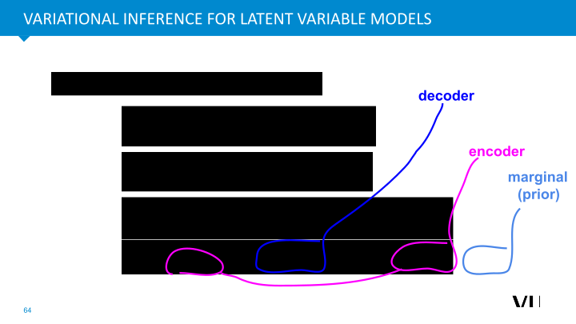

<nav class="menu">
    <ul>
        <li class="home"><a href="/">Home</a></li>
        <li class="name">Latent variable models </li>
                <li><a href="#video-002">Why Generative Modeling</a></li>
                <li><a href="#video-014">Autoencoders</a></li>
                <li><a href="#video-023">Variational Autoencoders</a></li>
        <li class="pdf"><a href="https://dlvu.github.io/pdfs/lecture06.latentvariablemodels.annotated.pdf">PDF</a></li>
    </ul>
</nav>

<article class="slides">

       <section id="slide-001">
            <a class="slide-link" href="https://dlvu.github.io/latentvarmodels#slide-001" title="Link to this slide.">link here</a>
            

            <figcaption>
            
Hello, everyone. Let's begin the lecture of today.  I'm Shujian Yu, a professor in the Department of Computer Science, and in the Deep Learning course. I will be responsible for the introduction of the generative models, recognition learning, as well as the last two lectures about generalization and adaptability. So, let's begin our first lecture, which is about unsupervised representation learning and generative models.

 
These slides are based on earlier lectures from 

Jakub Tomczak

.

            </figcaption>
       </section>

       <section id="slide-002">
            <a class="slide-link" href="https://dlvu.github.io/latentvarmodels#slide-002" title="Link to this slide.">link here</a>
            

            <figcaption>
            
This lecture consists of three parts. In the first, we will briefly introduce the motivation: why we need to do the generating modeling and what's the goal of unsupervised repetition learning. Then, we will briefly introduce a general idea about the auto encoder, the naive auto encoder, and show some of its limitations. Finally, in the last part, we move to the main content of this lecture. We will carefully introduce a very popular departure with the name Variational Auto Encoder.
 
            </figcaption>
       </section>

       <section class="video" id="video-002">
           <a class="slide-link" href="https://dlvu.github.io/latentvarmodels#video-2">link here</a>
           <iframe
                src="https://"
                title="YouTube video player"
                frameborder="0" allow="accelerometer; autoplay; clipboard-write; encrypted-media; gyroscope; picture-in-picture"
                allowfullscreen>
           </iframe>

       </section>

       <section id="slide-003">
            <a class="slide-link" href="https://dlvu.github.io/latentvarmodels#slide-003" title="Link to this slide.">link here</a>
            

            <figcaption>
              
So, we first give two examples to show why generative models are important in modern AI applications and also in lots of the deep learning problems. I think in your last lecture, you have already learned some basic idea about discriminative models, especially the convolutional neural networks. 

  
            </figcaption>
       </section>

       <section id="slide-004">
            <a class="slide-link" href="https://dlvu.github.io/latentvarmodels#slide-004" title="Link to this slide.">link here</a>
            

            <figcaption>
            
You have also learned the basic idea that if I give you the image, how to do the classification with concatenating different convolution layers. Sometimes, the deep layer, the convolution neural net, can be very, very deep inside the model. An example of this is the model: ResNet-50, which is a very popular pre-trained convolutional neural network consisting of 50 layers.

            </figcaption>
       </section>

       <section id="slide-005" class="anim">
            <a class="slide-link" href="https://dlvu.github.io/latentvarmodels#slide-005" title="Link to this slide.">link here</a>
            

            <figcaption>
            
Now suppose I give you the image of a hog (this is a type of pig) that will be used for prediction. First we will train a ResNet-50 algorithm on a dataset of images of pigs, which after training performs really well. This network predicts that this image of a pig belongs to the class hog with 99% confidence. At first it might seem that the model is very precise in its prediction, however the algorithm does not have a clear understanding of what a pig is.

 
            </figcaption>
            click image for animation
       </section>

       <section id="slide-006" class="anim">
            <a class="slide-link" href="https://dlvu.github.io/latentvarmodels#slide-006" title="Link to this slide.">link here</a>
            

            <figcaption>
            
We can test this idea by adding noise to the image of the hog, this will trick the network into making a different prediction. The algorithm will a different class since the noise activates different neurons. From a human perspective this is just a noisy image of a hog, while the ResNet-50 does not understand this semantic difference. 

  
            </figcaption>
            click image for animation
       </section>

       <section id="slide-007" class="anim">
            <a class="slide-link" href="https://dlvu.github.io/latentvarmodels#slide-007" title="Link to this slide.">link here</a>
            

            <figcaption>
            
This example shows us that it can be a good discriminative model, but the network does not actually have a semantic understanding of the content of the image. These models require some form of understanding of uncertainty, the noise example. In short, a model would need to understand basic parts of reality to make proper predictions. A possible solution for this problem would be generative modelling.

 
            </figcaption>
            click image for animation
       </section>

       <section id="slide-008" class="anim">
            <a class="slide-link" href="https://dlvu.github.io/latentvarmodels#slide-008" title="Link to this slide.">link here</a>
            

            <figcaption>
            
To further dive into generative modelling, let's look at this example. Suppose we have another model that has the task to discriminate between a horse and a cat. In order to do this, we need a lot of samples from a cat and a horse. Now after training this model it will classify all images on the top right of the hyperplane as a cat and the bottom left as a horse. In contrast to generative models aim to model the entire distribution of the input data, including the relationship between the input data and their labels. By estimating the joint distribution of input samples (X) and their labels (Y), generative models can potentially provide a more comprehensive understanding of the data. If the generative model can accurately capture the distribution of input data and the generative probability of the input samples (PX), it could be used to identify outlying data that doesn't belong to any of the trained classes. 

Now if we were to introduce a new type of data, a panda for example, the discriminative model would classify this somewhere on the hyperplane. In our case it would fall under the classification of horses and would thus be classified as such. In contrast generative models by their use of joint probabilities have a good estimation of classifying the panda as an outlier, thus giving it a low classification for a cat and low for a horse.

 
            </figcaption>
            click image for animation
       </section>

       <section id="slide-009">
            <a class="slide-link" href="https://dlvu.github.io/latentvarmodels#slide-009" title="Link to this slide.">link here</a>
            

            <figcaption>
            
Generative modelling is not only limited to images. It can be used to synthesize or generate different kinds of videos or audios. Good generative models can generate different types of audios for example speech or music.

 
            </figcaption>
       </section>

       <section id="slide-010">
            <a class="slide-link" href="https://dlvu.github.io/latentvarmodels#slide-010" title="Link to this slide.">link here</a>
            

            <figcaption>
            
Not only is generative modelling applicable in these more audio visual forms, also it can be used in chemistry. For example using the encoder decoder structure to generate new molecule sequences.
 
            </figcaption>
       </section>

       <section id="slide-011">
            <a class="slide-link" href="https://dlvu.github.io/latentvarmodels#slide-011" title="Link to this slide.">link here</a>
            

            <figcaption>
            
Another example from the medical domain, fMRI signals. This is especially useful to generate synthetic dataset for further medical research. Medical data is very privacy sensitive and are difficult to use, while if we were able to use synthetic data that closely resembles the real data we can do much more extensive research without breaching privacy.

            </figcaption>
       </section>

       <section id="slide-012" class="anim">
            <a class="slide-link" href="https://dlvu.github.io/latentvarmodels#slide-012" title="Link to this slide.">link here</a>
            

            <figcaption>
            
We've discussed the significance of generative models and provided examples illustrating why they are essential. The primary goal is to model the input and estimate P(X). X, representing inputs like images or signals, typically exists in a high-dimensional space. Modeling in such a space is inherently difficult, posing challenges related to the curse of dimensionality. In machine learning, as the dimensionality of input data increases, the difficulty in modeling X also significantly increases. This poses a fundamental challenge in effectively capturing and understanding high-dimensional data. Consider two images of cats, where the only difference is a black dot on one of them. Even for humans, discerning this difference requires careful observation. Asking machine learning models to perform this seemingly simple task highlights the challenges. Emphasize that a single pixel, like the black dot in the example, may not provide sufficient information. This limitation contributes to the complexity of modeling high-dimensional spaces.
 
            </figcaption>
            click image for animation
       </section>

       <section id="slide-013" class="anim">
            <a class="slide-link" href="https://dlvu.github.io/latentvarmodels#slide-013" title="Link to this slide.">link here</a>
            

            <figcaption>
            
To effectively capture information provided by single pixels, it's crucial to model the dependencies between each pixel and its neighboring pixels. The example of the black dot illustrates the need for understanding how pixels interact with one another. Suppose we have n pixels, denoted as X1, X2, ..., Xn. In datasets like MNIST, each image has a high dimension, for instance, 784 pixels. The goal is to model the joint probability P(X1 to Xn) to distinguish between images. Different pixels exhibit various forms of dependency. For instance, X1 and X2 may be related, and X1 and X7 may have a different type of relationship. All pixels collectively form a dependence graph, where modeling the dependencies is crucial for accurate joint probability estimation. Despite the general idea making sense in theory, practical implementation is highly challenging. Evaluating precise dependencies between different pixels is difficult. The sheer number of pixels (e.g., hundreds of thousands) implies the need to model an extensive set of dependence relationships, presenting a formidable challenge. Evaluating precise dependencies is challenging. Hundreds of thousands of pixels complicate the task of modeling and integrating all these dependencies into a joint probability model. While the general concept is sound, its practical implementation remains a significant hurdle.

  
            </figcaption>
            click image for animation
       </section>

       <section id="slide-014" class="anim">
            <a class="slide-link" href="https://dlvu.github.io/latentvarmodels#slide-014" title="Link to this slide.">link here</a>
            

            <figcaption>
            
To simplify modeling P(X), a central topic introduced is latent variable models, also known as latent representations. Instead of explicitly modeling P(X), the idea is to learn hidden factors (latent variables, Z) that generate the observed variable X (e.g., an image). The assumption is that X is generated by a few independent hidden factors (latent variables). For instance, in an image of a face, latent factors could control gender, eye color, glasses, and pose. Although more latent factors can be assumed for improved modeling capacity, the key is not to explicitly model P(X) but to assume it's generated by independent latent factors (Z1, Z2, Z3, Z4). Latent variable models define a joint distribution of P(X) and Z. By Bayes' rule, P(X, Z) equals the conditional probability of P(X) given Z multiplied by the marginal distribution of P(Z). Learning both P(Z) and P(X|Z) allows effective modeling of P(X). While latent variable models simplify the problem, a new challenge arises: how to learn the hidden factors (Z) when only the input (X) is known. The inference of latent factors becomes a key question in latent variable models.

       
            </figcaption>
            click image for animation
       </section>

       <section class="video" id="video-014">
           <a class="slide-link" href="https://dlvu.github.io/latentvarmodels#video-14">link here</a>
           <iframe
                src="https://www.youtube.com/embed/0HfQ_OYlCjw?si=20-jvmOzNa1h792A"
                title="YouTube video player"
                frameborder="0" allow="accelerometer; autoplay; clipboard-write; encrypted-media; gyroscope; picture-in-picture"
                allowfullscreen>
           </iframe>

       </section>

       <section id="slide-015">
            <a class="slide-link" href="https://dlvu.github.io/latentvarmodels#slide-015" title="Link to this slide.">link here</a>
            

            <figcaption>
              
The first architecture we want to introduce is the autoencoder. The general idea is prevalent in modern applications and deep learning architectures. However, the autoencoder differs significantly from conventional structures like convolutional neural networks or multilayer perceptrons taught in previous lectures.

            </figcaption>
       </section>

       <section id="slide-016">
            <a class="slide-link" href="https://dlvu.github.io/latentvarmodels#slide-016" title="Link to this slide.">link here</a>
            

            <figcaption>
            
The autoencoder, an unsupervised learning architecture, differs from previous models like convolutional neural networks and multilayer perceptrons that require labeled data. In autoencoders, the absence of label information for samples is a defining feature.

The architecture comprises two networks: the encoder and the decoder. The encoder learns hidden factors (latent variables, Z) from input data, projecting observations from a high-dimensional space to a low-dimensional space using a neural network with parameters phi. Mathematically, Z equals G phi of X.

Conversely, the decoder aims to reconstruct the input data, minimizing distortion. It operates in the bottleneck layer, using the low-dimensional representation (Z) to reconstruct the original data (X). The goal is to achieve precise reconstruction, minimizing the Reconstruction Error.

For instance, in cell image processing, where the original image may be in a high-dimensional space (D Big D), the autoencoder projects it into a lower-dimensional space (e.g., one, two, or four dimensions). The aim is to reconstruct the image accurately using the reduced-dimensional representation, despite inevitable information loss in the reconstruction process. This unsupervised approach allows for neural network design without the need for labeled data.

 
            </figcaption>
       </section>

       <section id="slide-017">
            <a class="slide-link" href="https://dlvu.github.io/latentvarmodels#slide-017" title="Link to this slide.">link here</a>
            

            <figcaption>
            
The fundamental concept is to have both an encoder and a decoder. We project high-dimensional observations into a low-dimensional space and aim to reconstruct the input using this low-dimensional code. Instead of using complex neural networks, we can simplify by employing linear mappings. For instance, assuming Z equals W transpose of X and reconstructing X hat as W times V.

By minimizing the Reconstruction Error with a linear encoder and decoder, it can be proven that the solution aligns with Principal Component Analysis (PCA). PCA is a widely used method for dimensionality reduction. Hence, autoencoders with linear mappings, in essence, encompass PCA as a special case. However, the strength of autoencoders lies in introducing non-linearity, offering a more potent method for learning effective codes compared to PCA.

 
            </figcaption>
       </section>

       <section id="slide-018">
            <a class="slide-link" href="https://dlvu.github.io/latentvarmodels#slide-018" title="Link to this slide.">link here</a>
            

            <figcaption>
            
Utilizing the MNIST dataset, we trained the naive autoencoder and visualized the latent code in a two-dimensional space. Each point corresponds to the latent code of an image, with colors representing different classes (digits zero to nine). While the autoencoder seems to capture useful patterns, there are limitations.

Latent representations exhibit gaps, making it challenging to infer their physical meaning. Additionally, separability issues arise, particularly in certain regions where images from different digit categories may project into the same space. Although the autoencoder provides some separability, it's not perfect.

Interpreting the latent space proves difficult. Learning only two dimensions (Z1 and Z2), we struggle to discern the physical meaning of these dimensions. For instance, Z1 may encode information about rotation, but it's challenging to verify.

Crucially, the naive autoencoder is not a generative model; it excels in reconstruction but cannot generate new data. It can precisely reconstruct training examples but lacks the capability to generate novel content, such as new faces or music.

While the general idea motivates modern AI architectures, the naive autoencoder has limitations, especially regarding interpretability, separability, and generative capabilities. These challenges led to the development of more advanced generative models.

      
            </figcaption>
       </section>

       <section id="slide-019" class="anim">
            <a class="slide-link" href="https://dlvu.github.io/latentvarmodels#slide-019" title="Link to this slide.">link here</a>
            

            <figcaption>
            
The naive autoencoder or principal component analysis falls short as a generative model. To precisely achieve generative capabilities, we need to probabilistically model at least two distributions: the marginal distribution P(Z) and the conditional distribution P(X|Z). Understanding these distributions constitutes a generative model.

Suppose we know the shape of P(Z) and the probability of P(X|Z). In that case, we can randomly sample a new Z from P(Z) and generate new data by mapping Z into the observation space. This process allows us to generate an arbitrary number of new data points. Typically, Z resides in a low-dimensional space, and the real data X is in a higher-dimensional space. By modeling both distributions, we can generate an abundance of new data.

A popular approach in neural network learning is maximizing the log-likelihood. The objective is to make the generated data (P(X)) as realistic as possible compared to real data. By applying Bayes' rule, we know that P(X) equals the integral of P(X|Z) and P(Z), requiring integration over Z.

Inspired by this, modern generative models parameterize and train both distributions. The challenge lies in modeling and training these distributions effectively and handling the integration involved in the generative process. Various approaches have been developed to address this, leading to the creation of diverse modern generative models. The key challenge remains in modeling and training these distributions while effectively capturing the complexities present in the data.

 
            </figcaption>
            click image for animation
       </section>

       <section id="slide-020" class="anim">
            <a class="slide-link" href="https://dlvu.github.io/latentvarmodels#slide-020" title="Link to this slide.">link here</a>
            

            <figcaption>
            
Let's simplify and assume that the marginal distribution P(Z) follows a standard Gaussian distribution, and the conditional distribution P(X|Z) is parameterized by a linear transformation. The linear mapping assumes Z is in a dimensional space, and X is in a big D-dimensional space. The goal is to model both P(Z) and P(X|Z) to ultimately understand how to model P(X).

Under these assumptions, modeling P(Z) is straightforward since it follows a standard Gaussian distribution. For P(X|Z), we assume a linear transformation with potential biases and noise following a Gaussian distribution with standard deviation Sigma.

Given these assumptions, we can derive that the conditional distribution P(X|Z) also follows a Gaussian distribution due to the linearity of the transformation. The illustration is as follows: P(Z) follows a standard Gaussian distribution, and by sampling a random point Z hat from this distribution and using the linear mapping, we can map Z hat into the space of X. The resulting P(X|Z) follows a Gaussian distribution centered at WZ + mu, with variance controlled by the parameter Sigma.

In essence, each point in the latent space can be projected into the input space, resulting in an X that follows a distribution in the input space. The decoder, parameterized by the row of the decoder, plays the role of PX given Z, aiming to generate or reconstruct X from the latent space.

 
            </figcaption>
            click image for animation
       </section>

       <section id="slide-021" class="anim">
            <a class="slide-link" href="https://dlvu.github.io/latentvarmodels#slide-021" title="Link to this slide.">link here</a>
            

            <figcaption>
            
Due to the assumption of a linear mapping ( T ) and the fact that the marginal distribution P(Z)  follows a Gaussian distribution, we can expect that P(X) is also Gaussian. The sum of the transformation of Gaussians results in a Gaussian distribution. Through mathematical derivations, particularly leveraging techniques from materials such as Bishop's paper, we can show that the integral of these two Gaussians indeed leads to a Gaussian distribution.

The final form of  P(X) is indeed Gaussian, but it is more intricate than a standard Gaussian. It is characterized by a mean mu  and a variance given by  WW^T + sigma^2 .

This elegant solution is achievable due to the assumption of a linear mapping, simplifying the decoder. The linearity ensures that the integral over the two Gaussians can still be expressed as a Gaussian, leading to the final form of P(X).

  
            </figcaption>
            click image for animation
       </section>

       <section id="slide-022" class="anim">
            <a class="slide-link" href="https://dlvu.github.io/latentvarmodels#slide-022" title="Link to this slide.">link here</a>
            

            <figcaption>
            
Given our knowledge of both P(X) and P(X|Z), we can theoretically infer the posterior distribution P(Z|X). This can be viewed as an encoding process, analogous to an encoder. Our initial assumptions include P(Z) following a Gaussian distribution, and P(X|Z) acting as a decoder to reconstruct or generate data from the latent space. With the Gaussian assumption and linear mapping, we can express these distributions as Gaussians. By knowing the joint distribution of P(X,Z), we can also infer the posterior distribution P(Z|X). The role of P(Z|X), akin to an encoder, is to utilize the input to learn the latent codes. Both distributions, P(X|Z) and P(Z|X), can be modeled as Gaussians, although their mean and covariance matrix may differ.

 
            </figcaption>
            click image for animation
       </section>

       <section id="slide-023">
            <a class="slide-link" href="https://dlvu.github.io/latentvarmodels#slide-023" title="Link to this slide.">link here</a>
            

            <figcaption>
            
Suppose P(Z) is a standard Gaussian, and all the components can be modeled as Gaussian. To maximize the log likelihood of PX, we can use maximum likelihood estimation. Assuming we have N independent and identically distributed training samples, we can set the gradient of the log likelihood with respect to W, mu, and sigma equal to zero. This allows us to obtain analytical solutions for the unknown parameters of W, mu, and sigma. However, this simplifies the model significantly, assuming a linear model to project Z into the observation space. In practice, many datasets do not follow a Gaussian distribution, and the model capacity is limited. After the break, we will explore how to make the model more complex beyond linear models and how autoencoders can address these limitations.

            </figcaption>
       </section>

       <section class="video" id="video-023">
           <a class="slide-link" href="https://dlvu.github.io/latentvarmodels#video-23">link here</a>
           <iframe
                src="https://www.youtube.com/embed/icOK6hwttCA?si=4VN49KpHcE-obNzq"
                title="YouTube video player"
                frameborder="0" allow="accelerometer; autoplay; clipboard-write; encrypted-media; gyroscope; picture-in-picture"
                allowfullscreen>
           </iframe>

       </section>

       <section id="slide-024">
            <a class="slide-link" href="https://dlvu.github.io/latentvarmodels#slide-024" title="Link to this slide.">link here</a>
            

            <figcaption>
            
            </figcaption>
       </section>

       <section id="slide-025">
            <a class="slide-link" href="https://dlvu.github.io/latentvarmodels#slide-025" title="Link to this slide.">link here</a>
            

            <figcaption>
            
We introduced the 

general idea

 of autoencoders. Building an effective generative model involves capturing the distribution of P(X). The practical implementation of this concept involves a two-step generative process. Initially, we establish a prior distribution for P(Z) and randomly select a point from P(Z). Simultaneously, we aim to learn the distribution of P(X|Z), which serves as the decoder. This decoder facilitates the transformation of latent space representations into our input space, allowing the generation of diverse input data.

 
            </figcaption>
       </section>

       <section id="slide-026" class="anim">
            <a class="slide-link" href="https://dlvu.github.io/latentvarmodels#slide-026" title="Link to this slide.">link here</a>
            

            <figcaption>
            
We highlighted the assumption of a linear model, where P(X|Z) is represented as X given Z through a linear transformation Wz plus Mu. Both P(X|Z) and the prior distribution P(Z|X) are assumed to follow Gaussian distributions. This simplification proves advantageous as the integrals of Gaussian distributions are also Gaussian. While this approach provides a solution, it might fall short of our modeling expectations due to potential limitations in modeling capacity.

The challenge arises when considering that P(X|Z) may not be adequately represented by a linear mapping, deviating from the simple expression of WZ plus mu. Suppose W represents the parameters of the decoder or any machine learning model. Instead of relying on the linear mapping, we observe a non-linear relationship between X and Z, where X equals the function of Z, with W as a parameter of this non-linear transformation.

While we appreciate the advantage that D is a Gaussian distribution, even after undergoing complex non-linear transformations, there's another hurdle. It becomes challenging to model or express P(X|Z), which is the integral of P(X|Z) and P(Z). This introduces a layer of complexity in our efforts.

Expressing P(X) becomes extremely challenging due to the intricate nature of the problem. We currently lack a suitable method to generalize the model in this context. While we assume that the marginal follows a normal distribution, and theoretically, even after undergoing non-linear transformations, it should still adhere to the principles of P(X|Z), the actual challenge lies in expressing the mean and variance elegantly. The non-linear transformation adds complexity, making it difficult to articulate the mean and variance in a straightforward manner.

 
            </figcaption>
            click image for animation
       </section>

       <section id="slide-027">
            <a class="slide-link" href="https://dlvu.github.io/latentvarmodels#slide-027" title="Link to this slide.">link here</a>
            

            <figcaption>
            
We now delve into what could be considered the most crucial aspect of today's lecture. Despite its initial complexity, we aim to provide a step-by-step derivation to facilitate a clearer understanding. Essentially, we embark on setting the parameters of our neural networks with the primary goal of maximizing the log-likelihood, denoted as log(P(X)). Employing the base rule, we express P(X) as an integral involving P(X|Z) and P(Z). Subsequently, we introduce a variational posterior distribution, denoted as Q(Z|X), with the unique property that it equals P(Z|X) divided by P(Z|X), yielding a ratio of one. This introduction allows us to transition from the initial expression to the subsequent one. The variational posterior's role lies in servinag as an approximation to the genuine posterior distribution, P(Z|X).

 
            </figcaption>
       </section>

       <section id="slide-028">
            <a class="slide-link" href="https://dlvu.github.io/latentvarmodels#slide-028" title="Link to this slide.">link here</a>
            

            <figcaption>
            
So the idea is that we first assume that we have a marginal distribution, P. The Z is the latent code. And then we use a decoder. The decoder is of the parameter theta. We can obtain the distribution of the P(X|Z). And then if in some way we can learn both the P(X|Z) and the P(Z), maybe we can also get the P(X). And then we can also get the posterior distribution of the P(Z|X). P(Z|X) can be understood as how to learn the latent codes given different input samples. However, in order to obtain the P-Theta(Z|X), we still need to get the P(X) first. But in principle, it's very, very difficult or even impossible. So our general idea is that instead of explicitly modelling the inverse of the mapping, the  P-Theta(X|Z) provides the mapping from the latent code to the input space. Ideally, we want to have a way to model the inverse of the mapping from the X to the Z, to go back to the Z. But we may have some mathematical problems when performing the precise inverse. The general idea is that instead of directly using a neuron, we let the neuron model the inverse, P(Z|X), we assume that we have another mapping. We call this mapping as Q. It's parameterized by some parameter, another neural network with the parameter phi. And we assume that the Q-phi (Z) given X plays the same role as the Q-theta(Z|X).

So we assume that they are as close as possible or almost indifferent, even though it is a new model, a new neural network, with a new distribution. This is why we introduce the variational posterior distribution to mimic or to play the role of the P-Theta(Z|X). We assume that now we have a variational posterior distribution Q-Phi(Z|X) , and the ratio of the Q-Phi(Z|X) by the Q-Phi(Z|X) is equal to one. This leads us from the first line of the equation to the second line.

  
            </figcaption>
       </section>

       <section id="slide-029">
            <a class="slide-link" href="https://dlvu.github.io/latentvarmodels#slide-029" title="Link to this slide.">link here</a>
            

            <figcaption>
            
Now we move to the third line, the log likelihood. Actually, this derivation is a bit more complicated because we use a very well-known inequality in statistics called the Jensen's inequality. In principle, it expresses that the log of the expectation over distribution Q should be larger or equal to the expectation of the log of some function over the distribution Q. So by just using the Jensen's inequality, we can arrive from the second step to the third step. It means that the log of this quantity is larger or equal to the integral of the Q-Phi. Q-Phi is our posterior distribution or variational posterior distribution that we want to mimic or that we want to play the role of the P-Theta(X). And it should be larger or equal to the Q-Phi(Z|X) log of this quantity. 

            </figcaption>
       </section>

       <section id="slide-030">
            <a class="slide-link" href="https://dlvu.github.io/latentvarmodels#slide-030" title="Link to this slide.">link here</a>
            

            <figcaption>
            
We all know that the log of AB can be formulated as the log A plus log B. This means that the log of the P-Theta(X|Z) and the P(Z) by Q-Phi(Z|X), will be equal to the log of the P-Theta(X|Z) plus the log of the P(Z) by Q-Phi. This is a property of the logarithm. Then we can have two integral terms. And finally, we obtain the last equation. And the first one can be expressed as the expectation of the log of the P-Theta(X|Z), which is the expectation over the distribution of the Q-Phi(Z|X). On the other hand, the last term, it equals to the integral of the Q-Phi with the log of Q-Phi by the P-Lambda. This last term is called the KL Divergence. So the divergence means that we want to, in some way, quantify the distance of these two distributions. Let us see how this can be used to quantify this. 

            </figcaption>
       </section>

       <section id="slide-031">
            <a class="slide-link" href="https://dlvu.github.io/latentvarmodels#slide-031" title="Link to this slide.">link here</a>
            

            <figcaption>
            
We've just discussed two pivotal terms in our equation. The first term is essentially the expectation of the logarithm of P Theta(X|Z), with the expectation taken over Z. On the other hand, the second term can be expressed as the expectation of the logarithm of P-Lambda divided by Q-Phi(Z|X). In machine learning, this second term is commonly referred to as KL Divergence.

Now, let's delve into why the KL Divergence is widely used in various machine learning and deep learning applications. It serves as a measure to quantify the divergence between two distributions. The rationale behind using expectation as the KL Divergence between two distributions, P and Q, lies in its ability to gauge the closeness of the two. When we assume that P equals Q, the logarithm inside becomes log one, and since log one is always zero, the integral over zero still yields a very small value. This explains the utility of the expectation as the KL Divergence.

While a more in-depth exploration of divergence measures is reserved for our next lecture, for now, grasp this as an intuitive method to quantify the difference between two distributions by modeling the ratio P over Q, where log P over Q's expectation equals the KL Divergence between Q-Phi and P, the prior distribution of P-Theta.

In the realm of variational autoencoders, the final line of our equation is referred to as the evidence lower bound. This quantity consists of two terms. The first term, the expectation of the log of P Theta(X|Z), can be intuitively understood as a measure of reconstruction performance. Imagine sampling Z from the latent space, generated by Q-Phi(Z|X), and then reconstructing new data using the mapping function P-Theta(X|Z). This explains the first term's significance in quantifying the quality of reconstruction. Meanwhile, the second term is often dubbed the regularization term, serving to measure the distance between the marginal distribution of Z and the posterior distribution Q-Phi(Z|X). It's crucial to note that these terms collectively form what we call the evidence lower bound.

 
            </figcaption>
       </section>

       <section id="slide-032">
            <a class="slide-link" href="https://dlvu.github.io/latentvarmodels#slide-032" title="Link to this slide.">link here</a>
            

            <figcaption>
             
In the architecture of an autoencoder, each term plays a crucial role. The term P-Theta(X|Z) functions as our encoder, delineating the mapping from X to Z. On the other hand, P-Theta(X|Z) acts as a decoder, detailing the process of generating X from the latent Z. Additionally, lambda represents a marginal distribution, often referred to as a prior distribution.

Conceptually, this unfolds as a flow from X to Z and then to X hat. Simultaneously, we introduce an assumption that there exists a prior distribution governing the marginal distribution of Z. In practice, we may make the assumption that our latent code adheres to a Gaussian distribution. This choice is driven by the notable simplification it brings to the training of our model.

   
            </figcaption>
       </section>

       <section id="slide-033">
            <a class="slide-link" href="https://dlvu.github.io/latentvarmodels#slide-033" title="Link to this slide.">link here</a>
            

            <figcaption>
            
The loss function, or the objective, of a variational encoder serves a dual purpose. Firstly, it endeavors to maximize the fidelity of the reconstruction, striving for perfection. Secondly, it aims to concurrently regulate or minimize the divergence-induced distance between the prior distribution and the posterior distribution of P Theta(Z|X).

 
            </figcaption>
       </section>

       <section id="slide-034" class="anim">
            <a class="slide-link" href="https://dlvu.github.io/latentvarmodels#slide-034" title="Link to this slide.">link here</a>
            

            <figcaption>
            
So now, we approach the question posed earlier: How close is the gap between the maximized log P-Theta and the evidence lower bound? To address this, we employ another method of derivation.

Initially, we recognize that the log likelihood, log of the P(X), can be expressed as the expectation of P(X) over Z, leveraging the independence of D and P-Theta as variables, as dictated by mathematical properties.

Subsequently, we multiply the term in P-Theta(X) by a factor of one. However, this one is now represented as the ratio of P-Theta(Z|X) to P-Theta(Z|X). Following the base rule, we establish the equivalence of P-Theta(Z|X) and P(X) to the joint distribution of P(X) and Z.

Proceeding with further derivation, we multiply both the numerator and denominator of this ratio by Q-Phi(Z|X). This manipulation results in the formulation presented in the third line of the equation.

 
            </figcaption>
            click image for animation
       </section>

       <section id="slide-035">
            <a class="slide-link" href="https://dlvu.github.io/latentvarmodels#slide-035" title="Link to this slide.">link here</a>
            

            <figcaption>
            
The derivation process may seem complex initially, but let's break it down step by step for a clearer understanding.

Initially, we recognize that the evidence lower bound, specifically the second and third terms, informs us about the gap—how closely the lower bound aligns with the ground truth. This gap is expressed as a KL Divergence, another measure of divergence, between our posterior distribution Q-Phi(Z|X) and P-Theta given X.

To grasp the logic, consider our initial objective: maximizing the log likelihood of PX in the second line of the equation. The challenge arises when we aim to intuitively learn the encoder function and effectively learn the genuine posterior distribution of P-Theta given X. However, this proves to be a formidable task.

The ingenious approach is to introduce a new distribution—a variational approximation. This new distribution is denoted as Q-Phi(Z|X), with the assumption that Q-Phi(Z|X) should closely resemble P-Theta(Z|X).

By introducing this variational approximation, Q-Phi(ZX), we derive our evidence lower bound. The crucial idea is to ensure that Q-Phi given X closely approximates the real posterior distribution P-Theta(Z|X). The final derivation reveals that the gap between our lower bound and the real P-Theta given X is determined by how closely our approximation aligns with the true posterior distributions of P-Theta(Z|X).

This elucidates why we introduce a variational approximation, denoted as Q-Phi(X). The ultimate derivation indicates that if our approximation is exceptionally close to the two posterior distributions P(Z|X), then the lower bound is synonymous with our ideal objective, the log of the P(X). Consequently, by maximizing the evidence lower bound, we not only aim to close the gap but also ensure the realization of our objective. The key takeaway is that these objectives are synergistic, meaning that by closing the gap, we achieve our goal of maximizing the lower bound. In essence, the intuition lies in the fact that if Q-Phi(Z|X) is close to the two posterior distributions P-Theta(Z|X), the gap is minimized, explaining why maximizing the lower bound is a viable strategy.

 
            </figcaption>
       </section>

       <section id="slide-036">
            <a class="slide-link" href="https://dlvu.github.io/latentvarmodels#slide-036" title="Link to this slide.">link here</a>
            

            <figcaption>
            
            </figcaption>
       </section>

       <section id="slide-037">
            <a class="slide-link" href="https://dlvu.github.io/latentvarmodels#slide-037" title="Link to this slide.">link here</a>
            

            <figcaption>
            
            </figcaption>
       </section>

       <section id="slide-038">
            <a class="slide-link" href="https://dlvu.github.io/latentvarmodels#slide-038" title="Link to this slide.">link here</a>
            

            <figcaption>
            
            </figcaption>
       </section>

       <section id="slide-039">
            <a class="slide-link" href="https://dlvu.github.io/latentvarmodels#slide-039" title="Link to this slide.">link here</a>
            

            <figcaption>
            
In the upcoming lecture, we'll delve into the practical implementation of variational autoencoders. However, the crucial aspect lies in comprehending the derivations underlying these two approaches. It's imperative to not only grasp the derivation in this equation but also discern the connections between the distributions associated with the encoder and the decoder. Understanding the significance of the prior distribution is equally crucial. All these elements together constitute the objective of the variational autoencoder, given its encoder structure and the introduction of the variational approximation.

The nomenclature "autoencoder" gains clarity when you realize that, by maximizing the evidence lower bound, our primary objective is clear. We aim to maximize the closeness of the gap to the true value we intend to optimize. This gap, in essence, represents the expectation of the approximation being as close as possible to the true posterior distribution, despite the inherent challenges in modeling the true posterior distribution. The overarching goal is to ensure that the variational autoencoder's objectives are aligned with minimizing this gap and, by extension, optimizing the model.

 
            </figcaption>
       </section>

</article>
